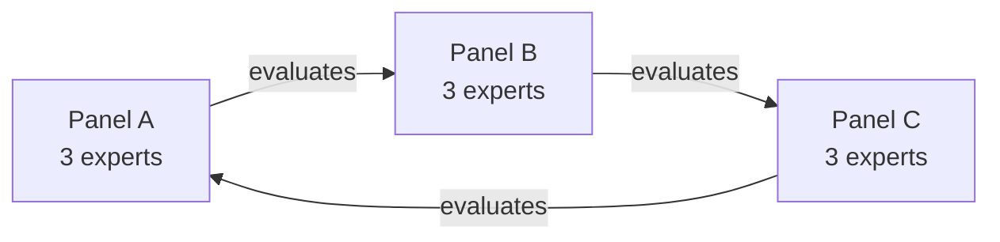

# Angular 2026Q2 Peer-to-Peer Review

## A Few Words from Varabei

Hi everyone!

I have seen that most people on Discord do not want to participate in the Peer Review, so I would like to explain why we are still going to conduct it.

Different types of demos are an essential part of an engineer’s work: demos for colleagues, customers, the customer’s clients, and so on. As developers, we regularly need to show and explain what we have built recently.

Customers want to see the functionality, while colleagues may ask about the code and how it works. Therefore, being able to present, explain, and defend your solution, as well as review other people’s features, is an essential professional skill.

During the Peer Review, you will take on two roles: **presenter** and **expert**.

As a presenter, you need to prepare a presentation about two features of your choice.

They do not have to be the most technically complex features. You can choose any two completed and working features that you have something meaningful to discuss: why you implemented them in a particular way, what bugs you encountered, what you learned, or what you remember most clearly.

## Format

Each Peer Review participant attends four sessions:

* one session as a presenter;
* three sessions as an expert.

In practice, this means **two Google Meet calls, or calls on any other suitable platform**:

1. **Your panel block, approximately 1.5–2 hours:** together with the other two experts in your panel, you attend three presenter sessions in a row.
2. **Your presentation, approximately 35 minutes:** you present to another panel. These are not the same people whose presentations you reviewed. The evaluation works in a circle, as shown below. For that panel, your presentation is one of the three sessions in their panel block.

Therefore, you only need to coordinate two dates for the entire Peer Review.

### Why is the role called “expert”?

Because you worked on a project with similar requirements and encountered similar problems. This means you can ask other students relevant, practical questions better than a mentor or another person who has not worked under the same conditions.

### What is a panel?

A panel is a group of three experts who attend and evaluate three presentations together.

Panels are formed based on the registration data. Language, time zone, and availability preferences will be taken into account where possible; the remaining allocation will be randomized.

It works as follows: your panel evaluates presenters from another panel, while your presentation is evaluated by a third panel. The evaluation goes in a circle, so the people you evaluate are not the same people who evaluate you.

The diagram shows one evaluation cycle.

If an expert knows in advance that they cannot attend, they must find a replacement among the course students or mentors and notify the coordinator. They should post a message in the Discord channel `#peer-review` and tag the coordinator.

In the event of an unexpected no-show, the coordinator will assign a replacement where possible.

### Feature requirements

* The two features must come from **two different sprints**.
* Each feature must represent **complete functionality**. A simple test is whether it can be demonstrated as a user scenario with a clear beginning and end: “the user does A and gets B.” Filtering a list is a valid scenario; a button with no resulting action or a purely cosmetic improvement is not.
* The code must have been written by the student personally.

## Session

To participate in the Peer Review, you [must register in advance](https://forms.gle/E51KGa9iTrTmeeXVA).

Registration is open *[*from July 13 to July 15, 2026, and closes at 23:59 UTC on July 15*](https://forms.gle/E51KGa9iTrTmeeXVA)*.

One session lasts approximately 30–40 minutes and consists of four parts.

### Before the session

The **presenter** creates a GitHub Gist containing the presentation plan:

* the two selected features;
* a short description of each feature;
* links to the corresponding pull requests or code.

The Gist must be shared in the experts’ chat no later than 24 hours before the presentation.

If the Gist is not shared at least 24 hours before the presentation, the presenter receives **0 points for the corresponding presentation criterion**.

**One of the experts** acts as the selecting expert. The order is specified in the panel table:

* Expert A selects the fragment for the first session;
* Expert B selects the fragment for the second session;
* Expert C selects the fragment for the third session.

Before the session, the selecting expert finds a code fragment in the presenter’s repository.

This preparation should take approximately 5–10 minutes:

1. Open the presenter’s repository and review the presenter’s commits or pull requests.
2. Find a fragment containing meaningful logic **outside the two announced features**. For example:

   * an event handler;
   * a service;
   * state-management logic;
   * data transformation;
   * another coherent piece of application logic.
3. Do not select configuration, markup, generated code, or a purely cosmetic change.
4. The fragment should be approximately **20–50 lines**, either in one file or as one coherent section of code.
5. Save a link to the fragment and think about what you might ask the presenter.

The selected fragment must have been written by the presenter. It may come from any part of the team project, including a feature that was not announced for the presentation, but it must not be code written by another team member.

The goal is to check the presenter’s understanding, not to catch them out.

### Part 1: Context, approximately 3 minutes

The presenter briefly introduces themselves and explains why they selected these two features.

In practice, this is preparation for the common interview question:

> “Tell us about a piece of work you are proud of.”

Peer Review is a good opportunity to practise answering it.

### Part 2: Demo, approximately 15 minutes

The presenter demonstrates both features live, either using the deployed application or a local version.

During the main demo, the experts do not interrupt. They write down their questions instead.

For each feature, the presenter must demonstrate at least one relevant negative scenario. After the main scenario, the experts may suggest an additional reasonable case to test.

Examples of negative scenarios include:

* invalid input;
* an empty state;
* a repeated action;
* missing data;
* another edge case relevant to the feature.

### Part 3: Expert-selected code fragment, approximately 5 minutes

The selecting expert identifies the fragment they found. The presenter opens it and explains:

* what is happening in the code;
* what this part of the application is responsible for;
* why it was implemented in this way.

There is no advance preparation for this part. The presenter explains the code directly from the screen.

The main goal is to demonstrate genuine understanding and deliberate development decisions, not memorisation.

If the selected fragment turns out to have been written by another team member, the experts should select another fragment written by the presenter.

### Part 4: Questions, approximately 10 minutes

The experts ask questions. Each expert must ask at least one question.

Examples:

* “What was the most difficult part?”
* “What would you change if you were starting again?”
* “How did you identify and fix your most difficult bug?”
* “What approaches or tools did you use?”
* “What alternative solutions did you consider?”
* “What trade-offs did you make?”

At the end, each expert says aloud one particularly strong aspect of the presentation and completes the evaluation form, which should take approximately two minutes.

## Observers

Observers may attend the sessions, including friends, team members, or mentors, either on the experts’ side or the presenter’s side.

Observers do not evaluate the presenter and must not interfere with the session format.

The session may only be recorded with the consent of both the presenter and the experts.

## Technical Issues

* If the live demo cannot be completed because of an **external issue**, such as a deployment outage, an unavailable external API, or connectivity problems, the student should demonstrate the application locally and show the relevant code. A pre-recorded video may be used as supporting material, but not as a replacement for a live demo, code walkthrough, and explanation.
* If the project cannot be launched because the student was **not properly prepared**, the experts evaluate only what was successfully demonstrated.

## Evaluation: 100 Points

All criteria are evaluated as **binary observations**: observed or not observed.

* Each of the three experts evaluates the presenter independently.
* The final score is the **median** of the three scores.
* If only two experts are present, the final score is the average of their scores.

### 1. Feature Demo: 30 Points

The features meet the requirements:

* they come from two different sprints;
* each feature represents complete functionality;
* each feature is demonstrated as a scenario in which “the user does A and gets B.”

### Feature 1: 15 Points

1. **5 points:** The feature was launched live without lengthy setup: either the deployed version worked or the local version was started within one minute.
2. **5 points:** The main user scenario was completed from beginning to end, and the feature worked as described in the announcement.
3. **5 points:** The presenter demonstrated at least one relevant negative scenario, such as invalid input, an empty state, a repeated action, or another applicable edge case.

### Feature 2: 15 Points

1. **5 points:** The feature was launched live without lengthy setup: either the deployed version worked or the local version was started within one minute.
2. **5 points:** The main user scenario was completed from beginning to end, and the feature worked as described in the announcement.
3. **5 points:** The presenter demonstrated at least one relevant negative scenario, such as invalid input, an empty state, a repeated action, or another applicable edge case.

### 2. Presentation: 70 Points — Binary Checklist

1. **10 points:** The features were announced at least 24 hours in advance, with links to the relevant code.
2. **10 points:** The presenter clearly explained which features they selected, why they selected them, and what made them worth discussing.
3. **10 points:** When answering questions, the presenter showed and discussed the code or architecture rather than only the visible result.
4. **10 points:** The presenter identified at least one trade-off: an alternative approach and the reason for the chosen solution.
5. **10 points:** The presenter successfully explained the expert-selected code fragment.
6. **10 points:** The presenter answered questions directly and meaningfully. An honest “I don’t know, but I will investigate it” counts; avoiding the question does not.
7. **10 points:** The presenter stayed within the allocated time and came prepared for the demo.

## Google Form

Each expert completes the form. The same form is used for all sessions.

The form is **private**: the presenter cannot see which expert submitted which score.

The form contains:

1. The presenter’s GitHub account and the expert’s GitHub account, selected from dropdown lists.
2. Feature Demo checklist: 0–30 points.
3. Presentation checklist: 0–70 points.
4. **What you remember most** — a required field. Describe a solution, approach, technique, or anti-pattern that stood out to you and explain why, in one to three sentences.
5. Differences from the announcement — describe anything that was announced but did not work during the session.

## No-Shows and Penalties

Peer Review is an **exchange**: you evaluate other people, and they evaluate you. In a professional environment, failing to attend a colleague’s review is not acceptable either.

### An expert misses their panel block

A panel block consists of three presenter sessions attended by the same group of experts.

If an expert misses their panel block or does not submit the required evaluation forms for the block:

* **30 points are deducted from their final Peer Review score.**
* Final Peer Review score = **max(0, score − 30)**.

If an expert knows in advance that they cannot attend, they must:

1. Find a replacement among the course students or mentors.
2. Post a message in the Discord channel `#peer-review`.
3. Tag the coordinator and provide the replacement’s details.

In the event of an unexpected no-show, participants should report it in `#peer-review` and tag the coordinator. The coordinator will assign a replacement where possible so that the presenters’ sessions are not cancelled.

### A presenter does not attend

* The experts wait for **10 minutes**.
* After 10 minutes, they report the no-show in the Discord channel `#peer-review` and tag the coordinator.
* The experts’ responsibility for that session is considered **completed**, and they receive no penalty.
* The presenter must organise one replacement session within the Peer Review period.
* The presenter should first coordinate the new session with the assigned panel.
* If this is not possible, the presenter must post in `#peer-review` and tag the coordinator so that another panel can be assigned.
* If the replacement session does not take place because of the presenter, the presenter receives **0 points for the Peer Review**.

### The presenter does not have enough experts

* With two experts, the session remains valid, and the final score is the average of the two evaluations.
* With only one expert, participants should post in `#peer-review` and tag the coordinator so that another expert can be assigned.
* The presenter does not receive a failing result because of someone else’s no-show. The absent expert receives the penalty, not the presenter.

## Preparation

### Presenter

1. Select two features that meet the requirements:

   * complete functionality;
   * features from two different sprints;
   * code written by you.
2. Create and share the Gist at least 24 hours before the session.
3. Rehearse the demo with a timer. Fifteen minutes for two features is not much time.
4. Prepare at least one relevant negative scenario for each feature.
5. Check the deployed version and ensure that the local application can be started within one minute.
6. Prepare a video recording in case of an external technical problem.

### Expert

1. Before the session, review the announced features, approximately five minutes.
2. If you are the selecting expert, spend another 5–10 minutes finding a code fragment according to the rules above.
3. Make sure the selected fragment was written by the presenter.
4. During the session, write down questions while watching the demo.
5. Note any differences between the announcement and what was actually demonstrated.
6. After the session, complete the Google Form, including the **“What you remember most”** field.

**[Form link will be added later]**
