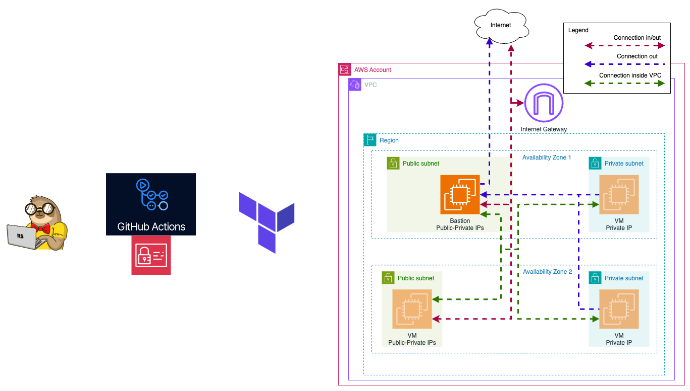

# Task 2: Basic Infrastructure Configuration

## Objective

In this task, you will write Terraform code to configure the basic networking infrastructure required for a Kubernetes (K8s) cluster.

## Steps

1. **Write Terraform Code**
   - Create Terraform code to configure the following:
     - VPC
     - 2 public subnets in different AZs
     - 2 private subnets in different AZs
     - Internet Gateway
     - Routing configuration:
       - Instances in all subnets can reach each other
       - Instances in public subnets can reach addresses outside VPC and vice-versa

2. **Organize Code**
   - Define variables in a separate variables file.
   - Separate resources into different files for better organization.

3. **Verify Configuration**
   - Execute `terraform plan` to ensure the configuration is correct.
   - Provide a resource map screenshot (VPC -> Your VPCs -> your_VPC_name -> Resource map).

4. **Additional Tasks💫**
   - Implement security groups.
   - Create a bastion host for secure access to the private subnets.
   - Organize NAT for private subnets, so instances in the private subnet can connect with the outside world:
     - Simpler way: create a NAT Gateway
     - Cheaper way: configure a NAT instance in the public subnet
   - Document the infrastructure setup and usage in a README file.

## Submission

- Create `task_2` branch from `main` in your repository.
- [Create a Pull Request](https://docs.github.com/en/pull-requests/collaborating-with-pull-requests/proposing-changes-to-your-work-with-pull-requests/creating-a-pull-request) (PR) with the Terraform code in your repository from `task_2` to `main`.
- Provide screenshots of a resource map screenshot (VPC -> Your VPCs -> your_VPC_name -> Resource map) in the PR description.
- (Optional) Set up a GitHub Actions (GHA) pipeline for the Terraform code.

## Evaluation Criteria (100 points for covering all criteria)

1. **Terraform Code Implementation (50 points)**
   - Terraform code is created to configure the following:
     - VPC
     - 2 public subnets in different AZs
     - 2 private subnets in different AZs
     - Internet Gateway
     - Routing configuration:
       - Instances in all subnets can reach each other
       - Instances in public subnets can reach addresses outside the VPC and vice-versa

2. **Code Organization (10 points)**
   - Variables are defined in a separate variables file.
   - Resources are separated into different files for better organization.

3. **Verification (10 points)**
   - Terraform plan is executed successfully.
   - A resource map screenshot is provided (VPC -> Your VPCs -> your_VPC_name -> Resource map).

4. **Additional Tasks (30 points)💫**
   - **Security Groups and Network ACLs (5 points)**
     - Implement security groups and network ACLs for the VPC and subnets.
   - **Bastion Host (5 points)**
     - Create a bastion host for secure access to the private subnets.
   - **NAT is implemented for private subnets (10 points)**
     - Orginize NAT for private subnets in a simpler or cheaper way
     - Instances in private subnets should be able to reach addresses outside the VPC
   - **Documentation (5 points)**
     - Document the infrastructure setup and usage in a README file.
   - **Submission (5 points)**
   - A GitHub Actions (GHA) pipeline is set up for the Terraform code.

## References

#### Simpler way

Elastic IP:

- <https://docs.aws.amazon.com/AWSEC2/latest/UserGuide/elastic-ip-addresses-eip.html>

Route table association:

- <https://registry.terraform.io/providers/hashicorp/aws/latest/docs/resources/main_route_table_association>

NAT vs Internet Gateway:

- <https://stackoverflow.com/questions/74455063/what-exactly-are-nat-gateway-and-internet-gateway-on-aws>

Configuration EC2 with private subnets:

- <https://medium.com/@prabhupj/terraform-way-to-run-aws-ec2-instances-in-a-private-subnet-and-load-balancing-with-an-application-98da5a11d4f1>

#### Cheaper way

Making EC2 a NAT gateway:

- <https://medium.com/nerd-for-tech/how-to-turn-an-amazon-linux-2023-ec2-into-a-nat-instance-4568dad1778f>

Configuration of NAT with multiple interfaces:

- It is needed to provide an interface by VPC and consume the interface by the Bastion host
- <https://people.computing.clemson.edu/~jmarty/courses/LinuxStuff/SetupNATWIthIpTables.pdf>
- <https://registry.terraform.io/providers/hashicorp/aws/latest/docs/resources/network_interface>

iptables:

- <https://linux.die.net/man/8/iptables>

Logs for troubleshooting user-data:

- <https://stackoverflow.com/questions/15904095/how-to-check-whether-my-user-data-passing-to-ec2-instance-is-working>
- /var/log/cloud-init.log
- /var/log/cloud-init-output.log
