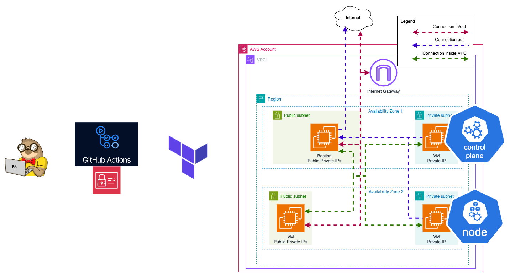

# Task: K8s Cluster Configuration and Creation



## Objective

In this task, you will configure and deploy a Kubernetes (K8s) cluster on AWS using or k3s. You will also verify the cluster by running a simple workload.

## Steps

1. **Choose Deployment Method**

   - Get familiar with [k3s](https://k3s.io/).
   - Use AWS EC2 instances from the [AWS Free Tier](https://aws.amazon.com/free/) to avoid additional expenses.

2. **Create or Extend Terraform Code**

   - Create or extend Terraform code to manage AWS resources required for the cluster creation.
   - Ensure the code includes the creation of a bastion host.

3. **Deploy the Cluster**

   - Deploy [Bastion host](https://www.geeksforgeeks.org/what-is-aws-bastion-host/)
   - Deploy the K8s cluster using k3s.
   - Ensure the cluster is accessible from your bastion host
   - **Additional task** make it accessible from your local computer.

4. **Verify the Cluster**

   - Run the `kubectl get nodes` command from your bastion host to get information about the cluster.
   - Provide a screenshot of the `kubectl get nodes` command output.

5. **Deploy a Simple Workload**

   - Deploy a simple workload on the cluster using the following command:
     ```sh
     kubectl apply -f https://k8s.io/examples/pods/simple-pod.yaml
     ```
   - Ensure the workload runs successfully on the cluster.

6. **Additional Tasks💫**
   - Document the cluster setup process in a README file.

## Submission

- Create a `task_3` branch from `main` in your repository.
- Provide a PR with the Terraform code for the K8s cluster and bastion host.
- Provide a screenshot of the `kubectl get all --all-namespaces` command output. (pod named "nginx" should be present)
- Provide a screenshot of the `kubectl get nodes` command output. 2 nodes should be present.
- Provide a README file documenting the cluster setup and deployment process.

## Evaluation Criteria (100 points for covering all criteria)

1. **Terraform Code for AWS Resources (10 points)**

   - Terraform code is created or extended to manage AWS resources required for the cluster creation.
   - The code includes the creation of a bastion host.

2. **Cluster Verification (50 points)**

   - The cluster is verified by running the `kubectl get nodes` command from the bastion host.
   - k8s cluster consists of 2 nodes (may be checked on screenshot).

3. **Workload Deployment (30 points)**

   - A simple workload is deployed on the cluster using `kubectl apply -f https://k8s.io/examples/pods/simple-pod.yaml`.
   - Pod named "nginx" presented in the output of `kubectl get all --all-namespaces` command

4. **Additional Tasks (10 points)💫**
   - **Documentation (5 points)**
     - Document the cluster setup and deployment process in a README file.
   - **Cluster accessability (5 points)**
     - The cluster is verified by running the `kubectl get nodes` command from the **local computer**.
