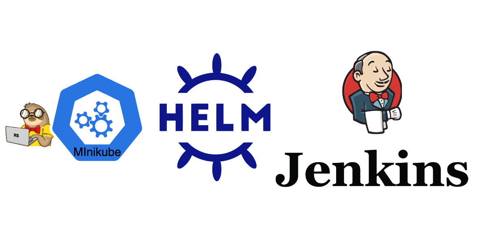

# Task 4: Jenkins Installation and Configuration


## Objective

In term to avoid unnecessary spendings, we'll not use cluster we've just created in the AWS. However, we'll leverage [Minikube](https://minikube.sigs.k8s.io/docs/start/?arch=%2Fmacos%2Fx86-64%2Fstable%2Fbinary+download). It's a k8s cluster, which you may install to your local machines. It should be enough for learning purposes. Follow the doumentation from taht link to install minikube on your local PC. And then, proceed right to [steps](#steps).

If you're brave enough to keep using cluster deployed in the clouds - pay attention on the resource's consumption my your VM. And keep in mynd notification down bellow.

IMPORTANT!( for cloud deployment only. Skip this one if you are chose to use minikube) You better choose to use t3/t2.small VMs, since micro have not sufficient amount of RAM for running Jenkins. Be aware that small instances are not included in the free tier, so you'll be charged 0.05$/hour for them.
Best choise for saving - create 1 small instalnce in public network. Setup init script to install k3s and deploy all of the necessary HELM charts to startup jenkins. Destroy environment whenever you are not working with it.

## Steps

1. **Install Helm**

   - Follow the instructions to install [Helm](https://helm.sh/).
   - Verify your Helm installation by deploying and removing the Nginx chart from [Bitnami](https://artifacthub.io/packages/helm/bitnami/nginx).

2. **Prepare the Cluster**

   - Ensure your cluster has a solution for managing persistent volumes (PV) and persistent volume claims (PVC). Refer to the [K8s documentation](https://kubernetes.io/docs/concepts/storage/volumes/) and [k3s documentation](https://docs.k3s.io/storage) or [Minikube PVC](https://minikube.sigs.k8s.io/docs/handbook/persistent_volumes/)for more details.

3. **Install Jenkins**

   - Follow the instructions from the [Jenkins documentation](https://www.jenkins.io/doc/book/installing/kubernetes/#install-jenkins-with-helm-v3) to install Jenkins using Helm. Ensure Jenkins is installed in a separate namespace.
     [Debug init container](https://kubernetes.io/docs/tasks/debug/debug-application/debug-init-containers/#accessing-logs-from-init-containers)

4. **Verify Jenkins Installation**

   - Create a simple freestyle project in Jenkins that writes "Hello world" into the log.

5. **Additional Tasks**
   - Set up a GitHub Actions (GHA) pipeline to deploy Jenkins. (not applicable on minikube installation. Not "not" at all, actually. if you'll succeed with this one, ping someone from Administration, please)
   - Configure authentication and security settings for Jenkins.
   - Use JCasC to store your Hello World job. 

## Submission

- Create a task_4 branch in your repository
- Provide a PR with the Helm chart for Jenkins deployment.
- Ensure that Jenkins is accessible via web browser. [Setup reverse proxy](https://www.digitalocean.com/community/tutorials/how-to-configure-nginx-as-a-reverse-proxy-on-ubuntu-22-04) if you are working in the environment behind the bastion host.
- Provide a screenshot of the Jenkins freestyle project log showing "Hello world".
- Provide a PR with the GHA pipeline code for Jenkins deployment.
- Attach screenshot with ```kubectl get all --all-namespaces``` to the PR
- Document the authentication and security configurations in a README file.

## Evaluation Criteria (100 points for covering all criteria)

1. **Helm Installation and Verification (10 points)**

   - Helm is installed and verified by deploying the Nginx chart.

2. **Cluster Requirements (10 points)**

   - The cluster has a solution for managing persistent volumes (PV) and persistent volume claims (PVC).

3. **Jenkins Installation (40 points)**

   - Jenkins is installed using Helm in a separate namespace.
   - Jenkins is available from the web browser.

4. **Jenkins Configuration (10 points)**

   - Jenkins configuration is stored on a persistent volume and is not lost when Jenkins' pod is terminated.

5. **Verification (15 points)**

   - A simple Jenkins freestyle project is created and runs successfully, writing "Hello world" into the log.

6. **Additional Tasks (15 points)**
   - **GitHub Actions (GHA) Pipeline (5 points)**
     - A GHA pipeline is set up to deploy Jenkins.
   - **Authentication and Security (5 points)**
     - Authentication and security settings are configured for Jenkins.
   - **JCasC is used to describe job in Jenkins (5 points)**
      - "Hello World" job is exists in helm values.
