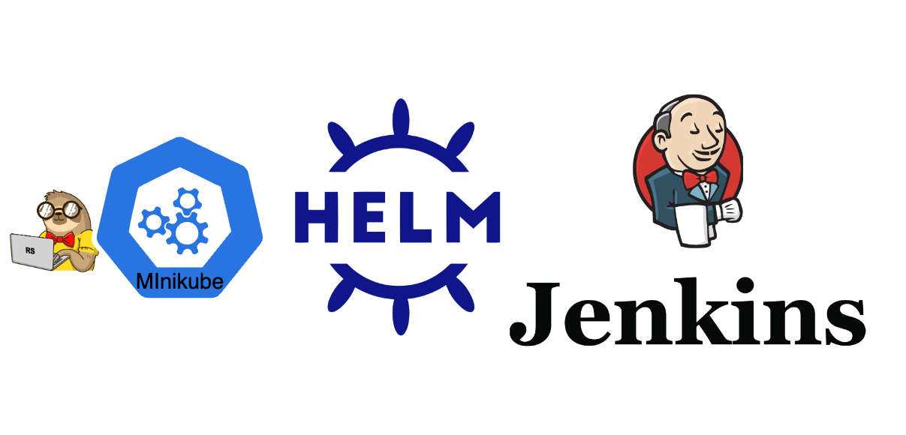

# Task 5: Simple Application Deployment with Helm

## Objective

In this task, you will create a Docker image and Helm chart for a simple application and deploy it on your Kubernetes (K8s) cluster.

## Steps

1. **Create Helm Chart**
   - Create a Helm chart for your [Application](https://github.com/rolling-scopes-school/tasks/tree/master/devops/flask_app/README.md).

2. **Deploy the Application**
   - Deploy the application using the Helm chart.
   - Ensure the application is accessible from the web browser.

3. **Store Artifacts in Git**
   - Store the application and Helm chart in your git repository.

4. **Additional Tasks💫**
   - Document the application setup and deployment process in a README file.

## Submission

- Create a `task_5` branch from `main` in your repository.
- Provide a PR with the application and Helm chart in your repository.
- Provide a screenshot from your browser with working application.
- Provide a README file documenting the application setup and deployment process.

## Evaluation Criteria (100 points for covering all criteria)

1. **Helm Chart Creation (40 points)**
   - A Helm chart for the application is created.

2. **Application Deployment (50 points)**
   - The application is deployed using the Helm chart.
   - The application is accessible from the web browser.

3. **Additional Tasks (10 points)💫**
   - **Documentation (10 points)**
     - The application setup and deployment processes are documented in a README file.

## References

- [Create your HELM chart](https://helm.sh/docs/helm/helm_create/)
