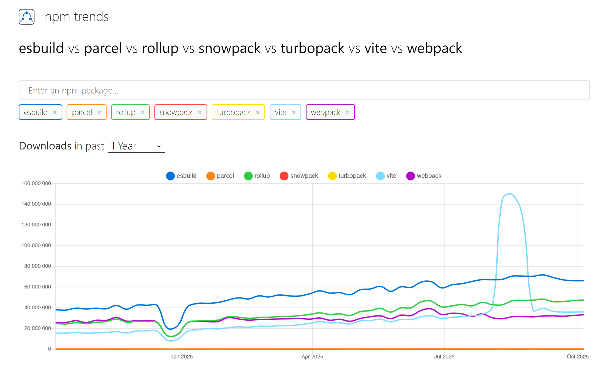

# Сборщики модулей 🌐

## Описание модуля 📚

Модуль «Сборщики модулей» подробно знакомит с различными инструментами сборки, которые играют важную роль в современной веб-разработке. В нём рассматриваются Webpack, Rollup, Parcel, Vite и esbuild. Каждый из этих инструментов обладает собственными возможностями и способами оптимизации процесса веб-разработки.

## Цели обучения 🎯

Студенты:

- Поймут значение сборщиков модулей в современной веб-разработке.
- Познакомятся с различными сборщиками, включая Webpack, Rollup, Parcel, Vite и esbuild, а также с их особенностями и вариантами применения.
- Изучат настройку, оптимизацию и практическое использование этих инструментов.
- Научатся оценивать влияние разных сборщиков на производительность веб-приложений и эффективность разработки.

## Примерное время прохождения модуля ⏱️

- **5 часов**

## Теория 📖

Студентам рекомендуется изучить следующие материалы:

1. **Основы сборки модулей:**
   - [Как работают сборщики модулей](https://www.freecodecamp.org/news/lets-learn-how-module-bundlers-work-and-then-write-one-ourselves-b2e3fe6c88ae/)
   - [Руководство по сборщикам модулей JavaScript](https://snipcart.com/blog/javascript-module-bundler)

2. **Webpack, Rollup и Parcel:**
   - [Основные концепции Webpack](https://webpack.js.org/concepts/)
   - [Начало работы с Rollup](https://rollupjs.org/guide/en/)
   - [Parcel — очень быстрый сборщик](https://parceljs.org/getting-started/webapp/)
   - [Webpack JS/FE 2021Q1 (RU)](https://www.youtube.com/watch?v=bozzyi8Tok0)
   - [Руководства по Webpack 5](https://www.robinwieruch.de/categories/webpack/)

3. **Знакомство с Vite и esbuild:**
   - [Vite — инструмент нового поколения для фронтенд-разработки](https://vitejs.dev/guide/)
   - [esbuild — чрезвычайно быстрый сборщик JavaScript](https://esbuild.github.io/getting-started/)

## Практика 💻

- Пройдите тест «[St1] Introduction to Bundlers» в RS APP > Auto Test.

## Дополнительные материалы 📘

1. [Альтернативы Webpack: пять популярных сборщиков JavaScript](https://www.contentful.com/blog/webpack-alternatives-5-top-bundlers/)
2. [Пять альтернатив Webpack: сравнение современных сборщиков JavaScript для фронтенд-проектов](https://strapi.io/blog/modern-javascript-bundlers-comparison-2025)
3. [Сравнение десяти лучших инструментов сборки и сборщиков JavaScript](https://www.codeinwp.com/blog/best-javascript-build-tools-bundlers/#gref)
