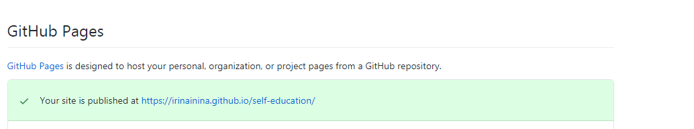
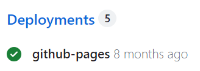
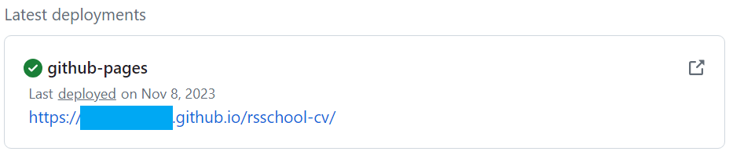

# CV

## Описание проекта

CV (Curriculum Vitae) — документ, в котором соискатель описывает своё образование и опыт работы. В отличие от резюме, адаптированного под конкретную вакансию, CV показывает профессиональные достижения и навыки за весь период обучения и работы.

## Задание

Нужно создать своё CV с помощью языка разметки Markdown, а затем оформить его с помощью HTML и CSS.

## Навыки

`Git` `GitHub` `Markdown` `HTML` `CSS` `semantic HTML`

## Материалы для изучения

### Работа с Git и GitHub

- [Git commit convention](https://rs.school/docs/git-convention) — как называть коммиты
- [Pull Request description schema](https://rs.school/docs/mentoring/pull-request-review-process#pull-request-requirements-pr) — как оформить PR
- [GitHub Skills](https://skills.github.com/) — официальные интерактивные курсы по работе с ветками и деплою
- [Learn Git Branching](https://learngitbranching.js.org/) — визуальный тренажёр для понимания логики ветвлений

### Разметка, контент и валидация

- [Markdown Syntax Cheat Sheet](https://ydmitry.ru/blog/rukovodstvo-po-markdown-dlya-uproshcheniya-veb-razrabotki/) — шпаргалка по синтаксису Markdown
- [MDN: Создание содержимого первой веб-страницы](https://developer.mozilla.org/ru/docs/Learn_web_development/Getting_started/Your_first_website/Creating_the_content) — руководство по структуре и контенту
- [HTML5 Semantic Elements](https://html5css.ru/html/html5_semantic_elements.php) — руководство по семантическим элементам HTML
- [W3C Markup Validator](https://validator.w3.org/) — проверка валидности вёрстки

### Вдохновение и дизайн

- Примеры оформления CV: [Freepik](https://www.freepik.com/free-photos-vectors/cv-template), [Canva](https://www.canva.com/resumes/templates/), [Figma Community](https://www.figma.com/community/search?resource_type=mixed&sort_by=relevancy&query=cv&editor_type=all&price=all&creators=all)

## Содержание CV

Рекомендации из HR-отдела EPAM:

1. Имя
2. Контактная информация
3. Краткая информация о себе (ваши цели и приоритеты, подчеркните сильные стороны, опишите опыт работы, если он есть, или желание учиться и приобретать новые навыки)
4. Навыки (языки программирования, фреймворки, методологии, системы контроля версий и инструменты разработки, которыми вы владеете)
5. Примеры кода
6. Опыт работы (можно указать учебные проекты с использованными навыками и ссылками на исходный код)
7. Образование (включая пройденные курсы и обучение)
8. Английский язык (ваш уровень владения английским, опишите языковую практику, если она была)

## Рекомендации по написанию CV

- Оформление CV — на ваше усмотрение. Старайтесь сделать его качественным, можно ориентироваться на примеры из раздела материалов.
- Рекомендуется указывать реальные данные.
- Добавьте своё фото или аватар. Фото предпочтительнее.
- Укажите актуальные контакты, включая ник в Discord.
- В качестве примера кода приведите решение задачи с [Codewars](https://www.codewars.com/). Если вы ещё не решали задачи, можно использовать [эту](https://www.codewars.com/kata/50654ddff44f800200000004/train/javascript).
- Добавляйте код символами и тегами, а не картинкой.
- Для выполненных проектов указывайте название, ссылку на код на GitHub или на страницу проекта. Если проектов пока нет, используйте это CV как первый проект.

## Технические требования

- Работа проверяется в последней версии Google Chrome.
- Нет ограничений на использование JS-библиотек, препроцессоров, фреймворков и любых известных технологий.

## Требования к репозиторию

- Задание выполняется в личном публичном репозитории.
- Название репозитория: `rsschool-cv`.

## Требования к коммитам

- История коммитов должна отражать процесс разработки.
- Используйте [конвенцию именования коммитов](https://rs.school/docs/git-convention).

## Требования к Pull Request

- Название Pull Request должно соответствовать выполняемой части задания.
- [Оформите описание Pull Request по схеме](https://rs.school/docs/mentoring/pull-request-review-process#pull-request-requirements-pr).
- Не мержите Pull Request из рабочей ветки в `main`.

## Порядок работы

Задание состоит из трёх частей. Часть 1 и Часть 2 проверяются автоматически (авто-тест), Часть 3 — через cross-check.

### Часть 1. Markdown & Git

1. Создать на GitHub публичный репозиторий `rsschool-cv`. В ветке `main` должен быть только один файл — `README.md` (при создании репозитория отметьте `Add a README file`).
2. Создать ветку `gh-pages` от `main`.
3. Сделать в ветке `gh-pages` не менее 3 коммитов по [конвенции коммитов](https://rs.school/docs/git-convention) (префиксы `init:`, `feat:`, `fix:`, `refactor:`, `docs:`).
4. В ветке `gh-pages` разместить файл `cv.md`.
5. Заполнить `cv.md` своим CV на Markdown — см. «Содержание CV» выше.
6. В `README.md` ветки `gh-pages` добавить ссылку вида `https://GITHUB-USERNAME.github.io/rsschool-cv/cv`, заменив `GITHUB-USERNAME` на свой ник на GitHub. По этой ссылке должна открываться страница CV, задеплоенная на GitHub Pages.
7. Создать Pull Request из ветки `gh-pages` в ветку `main`. Название — `Markdown & Git`. Оформить описание Pull Request в соответствии с требованиями. Не мержить.

> Подсказки по шагам (необязательные, не часть требований):
>
> 
>
> Найти ссылку на задеплоенную версию можно в панели Deployments репозитория:
>
> 
> 

#### Как сдавать Часть 1

Отправляется через авто-тест в [RS App](https://app.rs.school/): открыть вкладку `Auto-Test`, выбрать задание «Markdown & Git» и нажать «Submit». Пересдавать можно сколько угодно раз до дедлайна — каждая следующая попытка перезаписывает предыдущую.

- Результаты авто-теста (баллы и подробности проверки) могут появиться не сразу. Если после отправки отображаются нули или пустые поля, обновите страницу с результатами через некоторое время.
- Если при отправке появляется ошибка `Error: Temporary Github Error. Cannot get commits. Please try in 10 mins.`, это означает, что система временно не может получить данные о ваших коммитах из GitHub из-за превышения лимита запросов. Ничего исправлять в работе не нужно — попробуйте отправить задание повторно позже.

#### Критерии оценки Часть 1

**Максимальный балл: 100**

- Требования к репозиторию выполнены **+50**
  - создан публичный репозиторий `rsschool-cv`;
  - в ветке `main` находится только файл `README.md`;
  - создана ветка `gh-pages`;
  - в ветке `gh-pages` находится файл `cv.md` с CV в формате Markdown;
  - в `README.md` ветки `gh-pages` добавлена рабочая ссылка на CV, задеплоенное на GitHub Pages.

- Требования к коммитам и Pull Request выполнены **+50**
  - в ветке `gh-pages` сделано не менее 3 коммитов;
  - названия коммитов соответствуют [конвенции](https://rs.school/docs/git-convention);
  - создан Pull Request из `gh-pages` в `main`;
  - название Pull Request — `Markdown & Git`;
  - Pull Request оформлен по требованиям и не замержен.

### Часть 2. HTML, CSS & Git Basics

В этой части создаются только базовые шаблоны файлов — минимальные или пустые. Реальная вёрстка и стилизация CV делаются в Части 3.

Некоторые правила валидации, которые проверяет авто-тест:

- лишние пробелы в конце строк не допускаются;
- закрывающий тег или закрывающий слэш у непарного тега не допускается;
- специальные символы (`<`, `>`, `&` и др.), используемые в текстовом содержимом страницы, должны быть заменены на соответствующие escape-последовательности.

1. Продолжить работу в репозитории `rsschool-cv`. Создать ветку `rsschool-cv-html` от ветки `gh-pages`.
2. Вести историю коммитов по той же [конвенции](https://rs.school/docs/git-convention).
3. В ветке `rsschool-cv-html` разместить файлы `index.html` и `style.css` — базовые пустые шаблоны или шаблоны с минимальным содержимым.
4. В `README.md` ветки `rsschool-cv-html` добавить ссылку вида `https://GITHUB-USERNAME.github.io/rsschool-cv/`, заменив `GITHUB-USERNAME` на свой ник на GitHub. По этой ссылке будет открываться CV в виде полноценной веб-страницы (после Части 3).
5. Создать Pull Request из ветки `rsschool-cv-html` в ветку `gh-pages`. Название — `HTML, CSS & Git Basics`. Замержить его.

> **Подсказка (не часть требований):**
>
> Базовый HTML-шаблон можно создать в VS Code с помощью Emmet: в пустом файле `index.html` введите `!` и нажмите Enter. Убедитесь, что у элемента `<html>` указан атрибут `lang`.

#### Как сдавать Часть 2

Отправляется через авто-тест в [RS App](https://app.rs.school/): открыть вкладку `Auto-Test`, выбрать задание «HTML, CSS & Git Basics» и нажать «Submit». Пересдавать можно сколько угодно раз до дедлайна.

#### Критерии оценки Часть 2

**Максимальный балл: 100**

- Требования к репозиторию выполнены **+50**
  - работа продолжается в репозитории `rsschool-cv`;
  - ветка `rsschool-cv-html` создана от ветки `gh-pages`;
  - в ветке `rsschool-cv-html` находятся файлы `index.html` и `style.css`;
  - файлы `index.html` и `style.css` содержат базовые шаблоны;
  - в `README.md` ветки `rsschool-cv-html` добавлена ссылка на CV, задеплоенное на GitHub Pages.

- Требования к коммитам и Pull Request выполнены **+50**
  - есть история коммитов;
  - названия коммитов соответствуют [конвенции](https://rs.school/docs/git-convention);
  - создан Pull Request из `rsschool-cv-html` в `gh-pages`;
  - название Pull Request — `HTML, CSS & Git Basics`;
  - Pull Request замержен в `gh-pages`.

## Часть 3. Вёрстка CV

Основу содержания страницы составляют данные, которые вы добавили в `cv.md` в Части 1. Эти данные можно изменять, дополнять, редактировать. Кроме текста, на страницу нужно добавить фото или аватар.

### Требования к вёрстке

- Вёрстка валидная. Для проверки используйте [validator.w3.org](https://validator.w3.org/).
- Вёрстка семантическая.
- При написании кода рекомендуется следовать [гайдлайну](https://codeguide.academy/html-css.html).
- Контент размещается в блоке, который горизонтально центрируется на странице.
- Страница CV должна корректно отображаться в последней версии Google Chrome.
- В footer нужно добавить ссылку на ваш GitHub, год создания страницы, [логотип курса](assets/rs-school-logo.svg) со ссылкой на курс.

### Порядок работы Часть 3

1. Работа ведётся в ветке `rsschool-cv-html` репозитория `rsschool-cv`.
2. При вёрстке ориентируйтесь на «Требования к вёрстке» выше и «Критерии оценки» ниже.
3. Самостоятельно оцените свою работу по предложенным критериям.
4. В файл `README.md` ветки `rsschool-cv-html` добавьте обе ссылки (заменив `GITHUB-USERNAME` на свой ник на GitHub), по которым должны открываться CV в формате Markdown и в виде свёрстанной страницы:
   - `https://GITHUB-USERNAME.github.io/rsschool-cv/cv`
   - `https://GITHUB-USERNAME.github.io/rsschool-cv/`
5. Создайте Pull Request из ветки `rsschool-cv-html` в ветку `gh-pages`. Название — `CV Layout`. Замержите Pull Request. После merge убедитесь, что обе версии CV доступны по ссылкам из `README.md`.
6. Создайте Pull Request из ветки `rsschool-cv-html` в ветку `main`. Название — `CV Layout. Cross-Check`. Оформите описание Pull Request в соответствии с требованиями. **Этот Pull Request не мержить** — именно его ссылку нужно отправить на cross-check.

### Как сдавать Часть 3

Задание проверяется через [cross-check](https://rs.school/docs/cross-check-flow). Отправьте ссылку на Pull Request из ветки `rsschool-cv-html` в `main` (шаг 6 выше).

### Критерии оценки Часть 3

**Максимальный балл: 100**

- Pull Request открыт из `rsschool-cv-html` в `main`, имеет название `CV Layout. Cross-Check`, оформлен в соответствии с требованиями и не замержен **+5**
- Ссылки на обе версии CV в `README.md` рабочие **+5**
- Вёрстка валидная **+10**
- Вёрстка семантическая: `header`, `main`, `footer`, `nav`, один `h1`, есть `h2` **+10**
- В footer есть ссылка на GitHub автора, год создания, логотип курса со ссылкой на курс **+10**
- Для оформления CV используются CSS-стили **+10**
- При уменьшении масштаба страницы вёрстка остаётся по центру, а не сдвигается в сторону **+10**
- На странице есть фото или аватар автора, пропорции не искажены, есть атрибут `alt` **+10**
- Навигация, контакты и список навыков оформлены как `ul > li` (или `ol > li`) **+10**
- Содержание CV: присутствуют все обязательные разделы (имя, контакты, информация о себе, навыки, пример кода, опыт работы или учебные проекты, образование, уровень английского языка), содержание разделов осмысленное **+20**

_(Черновая раскладка баллов — общая модель оценивания курса ещё не согласована, см. OPEN_QUESTIONS.md)_
