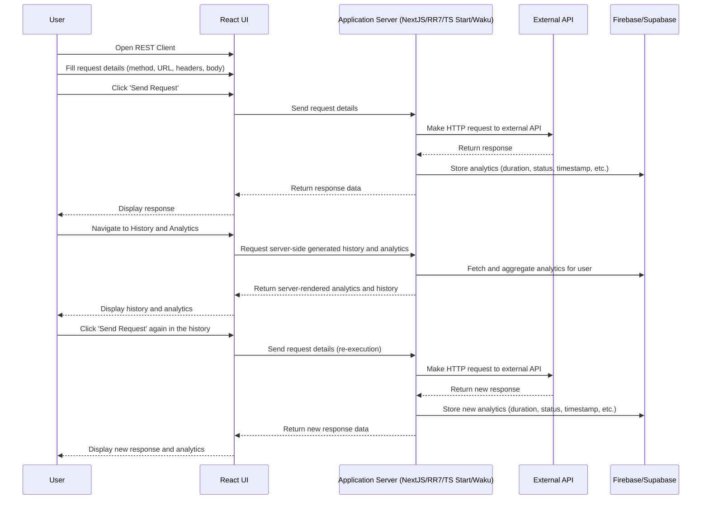

# REST Client

## Framework Options

You can choose from several modern React frameworks for your project. All of these support server-side logic, routing, and are suitable for building full-stack React applications:

- **React Router 7 (Framework mode)**: The latest version of React Router, now with features merged from Remix. [Docs](https://reactrouter.com/start/modes#framework)
- **Next.js (App Router)**: The recommended way to use Next.js for full-stack React apps. [Docs](https://nextjs.org/docs/app)
- **Tanstack Start**: A modern, full-stack React framework from the creators of TanStack Query. [Docs](https://tanstack.com/start/latest)
- **Waku**: A minimal React framework for building full-stack apps. [Docs](https://waku.gg/)

You are free to choose any of these options based on your team's preferences and project requirements.

You will be working on creating a light-weight version of Postman in one app.
PLEASE, READ THE TASK DESCRIPTION CAREFULLY UP TO THE END BEFORE STARTING THE TASK

## Theoretical Notes

[**Postman**](https://www.postman.com/) is a rich platform for using (and building) APIs. However, you can use any REST client as a reference.
It should support method selection, URL, headers.

Additional parts which your app will also include:

- Authorization and authentication capabilities, ensuring access to the tool is restricted to authorized users.
- History section, which will redirect the user to a specific section for previously executed requests.

## Building a team

- you should work in a team of 3 members
- you should select a team lead, who will be coordinating the development

## Application Prototype

You can use existing solutions like [Thunder Client for VSCode](https://marketplace.visualstudio.com/items?itemName=rangav.vscode-thunder-client) as a source of inspiration.
However, pay attention that we leave the final decision about the set of tools and design to you to not limit your possibilities and imagination.
Design, prototype, as well as implementation of the application, are up to you.

## Backend / API

- Application doesn't require a backend.
- Application should support any open, user-specified API (RESTful).
- You will use either **Next.js (App Router)** or **React Router 7 (Framework mode)** to make calls to the endpoint through the server. This is how you will avoid issues related to [CORS](https://developer.mozilla.org/en-US/docs/Web/HTTP/CORS).
  - **React Router 7 Framework mode** is the evolution of Remix, as Remix features have been merged into React Router. See [React Router 7 Framework mode docs](https://reactrouter.com/start/modes#framework).
  - **Next.js App Router** is the recommended way to use Next.js for full-stack React apps. See [Next.js App Router docs](https://nextjs.org/docs/app).
  - You may also use **Tanstack Start** ([docs](https://tanstack.com/start/latest)) or **Waku** ([docs](https://waku.gg/)) as alternative modern React frameworks for full-stack development.

## Application structure

Your app must contain:

1. Main page
2. User registration/authentication.
3. RESTful client, which includes:
   - method selector
   - text input for the endpoint URL
   - request editor
   - headers editor
   - response section
   - generated code section
4. Variables
5. History

## Repository requirements

- team lead should create a private repo in GitHub and invite other members
- repo name **rest-client-app**. Branch name for develop - **develop**, **main** branch is empty and contains only README.md
- the commit history should display the application development process. [Commit requirements](https://rs.school/docs/ru/git-convention)
- the demo version of the application should be deployed on `gh-pages`, `netlify`, `heroku`, or another similar service
- after completing the task, create a pull request from **develop** to **main** branch. **Merging a Pull Request is not required**
- in case you will use proxy-service you need to include instructions on how to run it locally
- you should make your repo public after the deadline

## Workflow/Branching strategy

You are free to choose your own way of developing the project and the repository. Here are links to a description and analysis of popular practices.

[Patterns for Managing Source Code Branches](https://martinfowler.com/articles/branching-patterns.html)
[Gitflow Workflow](https://www.atlassian.com/ru/git/tutorials/comparing-workflows/gitflow-workflow)
[GitHub flow](https://docs.github.com/en/get-started/quickstart/github-flow)
[ThreeFlow](https://habr.com/ru/company/infopulse/blog/345826/)
[GitLab Flow VS Git flow VS GitHub flow](https://yapro.ru/article/6172)

## Technical requirements

- semantic layout
- the application should work at least in the latest version of the Google Chrome browser
- private routes, 404, error boundary
- using jQuery in the main application code is not allowed (might be a part of other libraries, so pay attention to what you are using)
- you MUST use React 18 and above
- you MUST use one of the following modern React frameworks for your project:
  - **React Router 7 (Framework mode)** (recommended; includes Remix features)
  - **Next.js (App Router)**
  - **Tanstack Start**
  - **Waku**

See the section "Framework Options" above for more details and links.

- you might use any CSS frameworks, any JS/components libs you want, HTML and CSS pre-processors
- you MUST use Typescript
- tests should be present on the project (**test** command in the package.json), and test coverage should be reported when running the command; test coverage should be at least 80%
- Linting and formatting tools (**lint** and **format-fix** commands in the package.json)
- Husky hooks (run **lint** on pre-commit, **test** on pre-push)
- ❗ it is forbidden to copy the code of other students. This ban applies to HTML, CSS, and JS code. You can use small code snippets from Stack Overflow, and other self-found sources on the Internet, except GitHub repositories of course students.

## Application design requirements

- the application quality is characterized by the elaboration of details, attention to typography (no more than three fonts per page, font size of at least 14 px, optimal [font and background contrast](https://snook.ca/technical/colour_contrast/colour.html)), carefully selected content
- interactivity of elements users can interact with; element hover effects; usage of different styles for the active and inactive state of the element; smooth animations
- the unity of styles of all pages of the application - the same fonts, button styles, indents, and the same elements on all pages of the application have the same appearance and layout. Item colors and background images may vary. In this case, colors should be from the same palette, and background images from the same collection.

## Description of function blocks

### General requirements

- Errors (Not found route, unhandled rejection, etc) should be displayed in a user-friendly format (toast, pop-up, or something like that - up to your decision).
- Internationalization (i18n) - at least 2 languages. User should be able to change the language by clicking on the toggler/select in the header.

#### Error handling

Application should gracefully handle errors and show meaningful messages to the user.
Please, distinguish between errors on the application level and the valid HTTP error code.
CORS issues or network timeouts should be shown as errors, whereas 4xx and 5xx HTTP response codes should be displayed in the response section.

### Main page

- If the user is not authorized, the page should contain a link to Sign In / Sign Up page.
- If the user is authorized, the page should contain links to the RESTful client, History routes.

#### Main page template. User is not signed in

```
+----------------------------------------------------+
|                      Header                        |
|  +---------------------------------------------+   |
|  | [Logo] | Lang Toggle | [Sign In] | [Sign up]|   |
|  +---------------------------------------------+   |
+----------------------------------------------------+
|                                                    |
|   +--------------------------------------------+   |
|   |                                            |   |
|   |                Welcome!                    |   |
|   |                                            |   |
|   |           [Sign In] [Sign Up]              |   |
|   |                                            |   |
|   +--------------------------------------------+   |
|                                                    |
+----------------------------------------------------+
|                      Footer                        |
|    [GitHub Link] | Year | [Course Logo]            |
+----------------------------------------------------+
```

#### Main page template. User is signed in

```
+----------------------------------------------------+
|                      Header                        |
|  +---------------------------------------------+   |
|  | [Logo] | Language Toggle | [Sign Out]       |   |
|  +---------------------------------------------+   |
+----------------------------------------------------+
|                                                    |
|   +--------------------------------------------+   |
|   |                                            |   |
|   |         Welcome Back, [Username]!          |   |
|   |                                            |   |
|   +--------------------------------------------+   |
|                                                    |
|  +--------------------------------------------+    |
|  |    REST Client | History | Variables       |    |
|  +--------------------------------------------+    |
+----------------------------------------------------+
|                      Footer                        |
|    [GitHub Link] | Year | [Course Logo]            |
+----------------------------------------------------+
```

### Header

- The header should be sticky. The moment it becomes sticky (if there is a scroll on a page) should be animated: color can be changed or its height can become smaller. [Animated sticky header](https://www.youtube.com/watch?v=hR8UW5CvYgw)
- Link to the Main page
- Control that allows user to switch the language
- Sign Out button - signs user out

### Footer

- Footer should contain a link to the authors' GitHub, the year the application was created, [course logo](../../assets/rss-logo.svg) with [link to the course](https://rs.school/courses/reactjs).
- Footer is displayed on all pages of the application.

### Sign In / Sign Up

- For authentication you should use **Firebase**, **Supabase**, **Convex** or **NextAuth.js** with the email/password sign-in method.
  - Firebase: see this [article](https://blog.logrocket.com/user-authentication-firebase-react-apps/) as an example of Firebase usage.
  - Supabase: has a [free tier](https://supabase.com/pricing). See this [documentation](https://supabase.com/docs/guides/getting-started/tutorials/with-react) as an example of Supabase integration with React app.
  - Convex: see the [Convex Quickstart](https://docs.convex.dev/quickstarts) for setup and integration details.
  - NextAuth.js: see [documentation](https://next-auth.js.org/providers/credentials) for an implementation example. You can use any supported [adapter](https://next-auth.js.org/adapters) (for example, [Prisma](https://authjs.dev/getting-started/adapters/prisma)) and an [sqlite](https://sqlite.org/) database to persist data.
- Client-side validation should be implemented (email and password strength - minimum 8 symbols, at least one letter, one digit, one special character, Unicode passwords must be supported)
- Upon successful login, the user should be redirected to the Main page
- If the user has been logged in already and tries to reach these routes, they should be redirected to the Main page

#### Sign In / Sign Up template

```
+----------------------------------------------------+
|                      Header                        |
|  +---------------------------------------------+   |
|  | [Logo] | Language Toggle | [Sign Out] |     |   |
|  +---------------------------------------------+   |
+----------------------------------------------------+
|                                                    |
|   +--------------------------------------------+   |
|   |                                            |   |
|   |                Sign In / Sign Up           |   |
|   |                                            |   |
|   | [Email Input]                              |   |
|   | [Password Input]                           |   |
|   | [Submit Button]                            |   |
|   +--------------------------------------------+   |
|                                                    |
+----------------------------------------------------+
|                      Footer                        |
|    [GitHub Link] | Year | [Course Logo]            |
+----------------------------------------------------+

```

### RESTful client

- This route should be private.
- Rest client code should be lazy-loaded (so unauthenticated user won't download the code).
- Header should be visible.
- Method selector. Selected method should be reflected in the application URL (e.g. http://restclient.com/GET), for more details, please, check the next section.
- Endpoint (URL) input.
- Request body editor / JSON viewer. It will be used in the response section in read-only mode. Should support prettifying. Please, mind that request body editor should support at least JSON and plain text. Support of the XML syntax is not mandatory.
- Headers editor section.
- Generated code section.
- Response section. Should be read-only. Should contain information about HTTP response code and the response status.

#### RESTful client template

```
+----------------------------------------------------+
|                      Header                        |
|  +----------------------------------------------+  |
|  | [Logo] | Language Toggle | [Sign Out] |      |  |
|  +----------------------------------------------+  |
+----------------------------------------------------+
|                                                    |
|   +------------------- REST Client -------------+  |
|   | +-------------+ +--------------------------+ | |
|   | | Method      | | Endpoint URL             | | |
|   | +-------------+ +--------------------------+ | |
|   | Headers: [Add Header Button]                 | |
|   | +------------------------------------------+ | |
|   | | Header Key | Header Value                | | |
|   | +------------------------------------------+ | |
|   | Code: [Generated request code]               | |
|   | Body: [JSON/Text Editor]                     | |
|   +---------------------------------------------+  |
|                                                    |
|   +----------------- Response -------------------+ |
|   | Status: [HTTP Status Code]                   | |
|   | Body: [Read-Only JSON Viewer]                | |
|   +---------------------------------------------+  |
+----------------------------------------------------+
|                      Footer                        |
|    [GitHub Link] | Year | [Course Logo]            |
+----------------------------------------------------+

```

#### Routing on RESTful client

Route URL will be comprised of selected method as a route params, request URL encoded in base64 as a route param, request body (if applicable) as stringified JSON also encoded in base64 as another optional route param, and each presented header as a query param.
Let's say we want to make a GET request to the `https://jsonplaceholder.typicode.com/posts/1`:

```curl
curl https://jsonplaceholder.typicode.com/posts/1
```

So the URL might look so:
`http://localhost:5137/GET/aHR0cHM6Ly9qc29ucGxhY2Vob2xkZXIudHlwaWNvZGUuY29tL3Bvc3RzLzE=`
And we you want to make a POST request to the same endpoint, e.g.:

```curl
curl -d '{"title":"fakeTitle","userId":1,"body":"fakeMessage"}' https://jsonplaceholder.typicode.com/posts
```

Headers, specified in the editor, should be provided as URL query parameters (mind that you need to URL encode headers values):
`http://localhost:5137/POST/aHR0cHM6Ly9qc29ucGxhY2Vob2xkZXIudHlwaWNvZGUuY29tL3Bvc3Rz/eyJ0aXRsZSI6ImZha2VUaXRsZSIsInVzZXJJZCI6MSwiYm9keSI6ImZha2VNZXNzYWdlIn0=?Content-Type=application%2Fjson`

If the variables have been used in the request, replace them with values on submit and update the url.

#### Generated code

Add section which will show the generated code for the request.
Generated code shouldn't contain variables (replace them with respective values).
If there are not enough details for the code to be generated, show a message.
Code generation should support at least the following:

- curl
- JavaScript (Fetch api)
- JavaScript (XHR)
- NodeJS
- Python
- Java
- C#
- Go

Please, check the [Postman code generators](https://www.npmjs.com/package/postman-code-generators). Although you can implement the solution on your own, or use any other 3rd party library.

### Variables

- This route should be private.
- Variables code should be lazy-loaded (so unauthenticated user won't download the code).
- Variables should be stored in the browser's local storage.
- Application should load previously saved variables on user's successful authentication.
- Variable value can be inserted either in the url, or request body, or header value.
- To indicate that the variable should be used, user can specify it as {{variableName}}.

  Variable in the url:
  `https://wwww.npmjs.com/{{packageName}}`

  Variable in the header:
  `{{APPLICATION_JSON}}`

  Variable in the JSON:

  ```json
  {
    "foo": "{{BAR}}"
  }
  ```

### History and analytics

- This route should be private.
- History and analytics code should be lazy-loaded (so unauthenticated user won't download the code).
- The section should be server-side generated: all request history and analytics are aggregated and rendered on the server, then sent to the client for display.
- The section should display requests using links, on clicking on the link, user should be navigated to the respective section (RESTful client).
- All request history and analytics information must be loaded from **Firebase**, **Supabase**, or **Convex** for the logged in user. The information is written to the database from the server side after each request.
- The following parameters must be stored for each request:
  - **Request Duration (Latency):** Time taken from sending the request to receiving the response.
  - **Response Status Code:** HTTP status code (e.g., 200, 404, 500) for each request.
  - **Request Timestamp:** When the request was made (date and time).
  - **Request Method:** GET, POST, PUT, DELETE, etc.
  - **Request Size:** Size of the request payload (in bytes).
  - **Response Size:** Size of the response payload (in bytes).
  - **Error Details:** If the request failed, log the error message or type (timeout, network error, etc.).
  - **Endpoint/URL:** The endpoint that was called (for grouping and analysis).
- The section should show requests sorted by the time of their execution.
- The section should not contain variables, because information should be recorded from the server side.
- After navigating to the respective section, all the functional fields (URL, method selector, headers, body, values) should be restored. Please, mind this when saving the request in the database to ensure that all the required data will be saved.
- If there are no requests in the history, show message to the user, e.g. "You haven't executed any requests yet", "It's empty here. Try those options:" and give links to the RESTful client.

#### History and analytics template. No requests

```
+----------------------------------------------------+
|                      Header                        |
|  +---------------------------------------------+   |
|  | [Logo] | Language Toggle | [Sign Out]       |   |
|  +---------------------------------------------+   |
+----------------------------------------------------+
|                                                    |
|   +--------------------------------------------+   |
|   |                                            |   |
|   |      You haven't executed any requests     |   |
|   |            It's empty here. Try:           |   |
|   |                                            |   |
|   |   [REST Client]                            |   |
|   |                                            |   |
|   +--------------------------------------------+   |
|                                                    |
+----------------------------------------------------+
|                      Footer                        |
|    [GitHub Link] | Year | [Course Logo]            |
+----------------------------------------------------+
```

#### History and analytics template with requests

```
+----------------------------------------------------+
|                      Header                        |
|  +---------------------------------------------+   |
|  | [Logo] | Language Toggle | [Sign Out]       |   |
|  +---------------------------------------------+   |
+----------------------------------------------------+
|                                                    |
|   +--------------------------------------------+   |
|   |               History Requests             |   |
|   +--------------------------------------------+   |
|                                                    |
|  +----------------------------------------------+  |
|  | [GET https://api.example.com/resource/1]     |  |
|  | [POST https://api.example.com/resource]      |  |
|  +----------------------------------------------+  |
|                                                    |
+----------------------------------------------------+
|                      Footer                        |
|    [GitHub Link] | Year | [Course Logo]            |
+----------------------------------------------------+
```

## How to submit tasks

- Link to pull request in rs app is submitted only by **team leader** ❗
- Make sure the pull request is available for review ❗. To do this, open the link that you submit in rs app in incognito browser mode.
- If the task is not submitted before the deadline, it will not be distributed during the cross-check and points will not be added to your score.

## Evaluation criteria

**Maximum available points for the task are 500**

### Cross-check criteria

For the convenience of verification, it is **necessary** to record and post on YouTube a short (5-7 min) video for reviewers with an explanation of how each of the items listed in the evaluation criteria is implemented. Add a link to the video to the pull-request.
[How to evaluate tasks in Cross check](https://rs.school/docs/en/cross-check-flow). In the comments to the assessment, it is necessary to indicate which items are not fulfilled or partially fulfilled.

### Main route - max 50 points

- [ ] The Main page should contain general information about the developers, project, and course. - **10 points**
- [ ] In the upper right corner there are 2 buttons: Sign In and Sign Up. - **10 points**
- [ ] If the user is authorized, there should be a Main Page button instead of Sign In and Sign Up buttons in the upper right corner. - **10 points**
- [ ] If the token is expired/invalid - the user should be redirected from the private routes to the Main page (it might happen either automatically, on page refresh or on route change). - **10 points**
- [ ] Pressing the Sign In / Sign up button redirects a user to the route with the Sign In / Sign up form. - **10 points**

### Sign In / Sign Up - max 50 points

- [ ] Buttons for Sign In / Sign Up / Sign Out are everywhere where they should be. - **10 points**
- [ ] Client-side validation is implemented. - **20 points**
- [ ] Upon successful login, the user is redirected to the Main page. - **10 points**
- [ ] If the user is already logged in and tries to reach these routes, they should be redirected to the Main page. - **10 points**

### RESTful client - max 150 points

- [ ] Functional editor enabling query editing and prettifying, request body provided in the URL as base64-encoded on request submit. - **35 points**
- [ ] Functional read-only response section, with information about HTTP status and the code. - **30 points**
- [ ] Method selector, shows all the valid HTTP verbs, value is provided in the URL on request submit. - **15 points**
- [ ] Input for the URL, entered value is provided in base64-encoded way on request submit. - **20 points**
- [ ] Headers section, value is provided in the URL on request submit. - **20 points**
- [ ] Code generation section. - **30 points**

### History and analytics route - max 100 points

- [ ] History and analytics is server-side generated and shows informational message with links to the clients when there are no requests in the database. - **20 points**
- [ ] User can navigate to the previously executed HTTP request to the RESTful client, HTTP method, URL, body, headers are restored. - **30 points**
- [ ] The following analytics are recorded to the database from the application server side and displayed to the user: request duration, response status code, request timestamp, request method, request size, response size, error details, endpoint/URL. - **50 points**

### Variables route - max 50 points

- [ ] Variables show all the added variables, restores them from the local storage on load. - **15 points**
- [ ] User can add new, or delete an existing variable, variables in the local storage are updated on change. - **15 points**
- [ ] Variables are used in the request before the request execution. - **20 points**

### General requirements - max 50 points

- [ ] Multiple (at lest 2) languages support / i18n. - **30 points**
- [ ] Sticky header. - **10 points**
- [ ] Errors are displayed in the user friendly format. - **10 points**

### Youtube video - max 50 points

### Penalties

- **0. Framework Choice**

  - [ ] Using any framework option other than the mandatory list (**React Router 7 (Framework mode)**, **Next.js (App Router)**, **Tanstack Start**, **Waku**) is strictly forbidden and will result in **-200 points**

- **1. TypeScript & Code Quality**

  - [ ] @ts-ignore or any usage (search through GitHub repo) **-20 points** for each
  - [ ] The presence of _code-smells_ (God-object, chunks of duplicate code), commented code sections **-10 points per each**

- **2. Test Coverage**

  - [ ] Statement coverage below 80% (≥70%): **-50 points**
  - [ ] Statement coverage below 70% (≥50%): **-100 points**
  - [ ] All coverage metrics below 50%: **-150 points**
  - [ ] Absence of tests **-250 points**

- **3. React Best Practices**

  - [ ] One of the required lazy-loaded routes isn't lazy-loaded **-50 per each**

- **4. Console & Error Handling**

  - [ ] The presence of errors and warnings in the console **-20 points** for each
  - [ ] The presence in the console of the results of the console.log execution **-20 points** for each
  - [ ] HTTP 4xx and 5xx status codes displayed as errors not in the response section **-50 points**

- **5. Development Tools**

  - [ ] Absence of a linting tool **-150 points**
  - [ ] Absence of a formatting tool **-100 points**
  - [ ] Absence of husky git hooks **-100 points**

- **6. UI/UX**

  - [ ] Vite/NextJS default favicon **-50 points**

- **7. Project Management**
  - [ ] Making commits after the deadline **-100 points**
  - [ ] Pull Request doesn't follow guideline (including checkboxes in Score) [PR example](https://rs.school/docs/en/pull-request-review-process#pull-request-description-must-contain-the-following) **-10 points**
  - [ ] ⚠️ The administration reserves the right to apply penalties for the use of incorrect repository or branch names

## Sequence Diagram: User Journey and Analytics Flow


