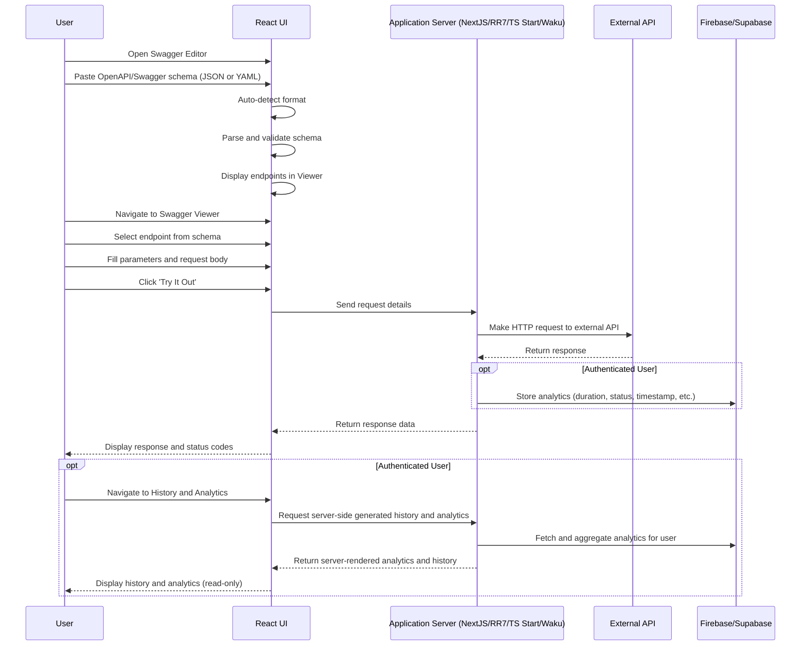

# Swagger/OpenAPI UI

## Framework Options

You can choose from several modern React frameworks for your project. All of these support server-side logic, routing, and are suitable for building full-stack React applications:

- **React Router 7 (Framework mode)**: The latest version of React Router, now with features merged from Remix. [Docs](https://reactrouter.com/start/modes#framework)
- **Next.js (App Router)**: The recommended way to use Next.js for full-stack React apps. [Docs](https://nextjs.org/docs/app)
- **Vinext**: The Next.js API surface, reimplemented on Vite
  [Docs/Code](https://github.com/cloudflare/vinext)
- **Tanstack Start**: A modern, full-stack React framework from the creators of TanStack Query. [Docs](https://tanstack.com/start/latest)
- **Waku**: A minimal React framework for building full-stack apps. [Docs](https://waku.gg/)

You are free to choose any of these options based on your team's preferences and project requirements.

You will be working on creating a **Swagger/OpenAPI UI** with REST client capabilities in one app. This allows users to edit and test APIs using OpenAPI specifications in an accessible, user-friendly interface.

PLEASE, READ THE TASK DESCRIPTION CAREFULLY UP TO THE END BEFORE STARTING THE TASK

## Application Prototype

This application is built around **OpenAPI specifications**. You can use the [OpenAPI Initiative](https://www.openapis.org/) as a reference, along with tools like [Swagger UI](https://editor.swagger.io/) as inspiration (if you aren't able to access the main link, you can try using [this link](https://forge.etsi.org/swagger/editor/)).

However, pay attention that we leave the final decision about the set of tools and design to you to not limit your possibilities and imagination.
Design, prototype, as well as implementation of the application, are up to you.

## Backend / API

- Application doesn't require a backend.
- Application should support any open, user-specified API (RESTful).
- You will use any SSR framework to make calls to the endpoint through the server. This is how you will avoid issues related to [CORS](https://developer.mozilla.org/en-US/docs/Web/HTTP/CORS).

## Building a team

- you should work in a team of 3 members
- you should select a team lead, who will be coordinating the development

## Repository requirements

- team lead should create a private repo in GitHub and invite other members
- repo name **swagger-editor-app**. Branch name for develop - **develop** and make it as default, the **main** branch is empty and contains only README.md, .gitignore, .github/pull_request_template.md
- the commit history should display the application development process. [Commit requirements](https://rs.school/docs/git-convention)
- the demo version of the application should be deployed on any preferable platform which supports SSR (for example, Vercel, Netlify, Render, etc.) and the link to the deployed app should be added to the README.md file in the repository
- after completing the task, create a pull request from **develop** to **main** branch. **Merging a Pull Request is not required**
- in case you will use proxy-service you need to include instructions on how to run it locally
- you should make your repo public after the deadline

## How to submit tasks

- Link to pull request in rs app is submitted only by **team leader** ❗
- Make sure the pull request is available for review ❗. To do this, open the link that you submit in rs app in incognito browser mode.
- If the task is not submitted before the deadline, it will not be distributed during the cross-check and points will not be added to your score.

## Functional Requirements (max **550 points**)

For the convenience of verification, it is **necessary** to record and post on YouTube a short (5-7 min) video for reviewers with an explanation of how each of the items listed in the evaluation criteria is implemented. Add a link to the video to the pull-request.
[How to evaluate tasks in Cross check](https://rs.school/docs/en/cross-check-flow). In the comments to the assessment, it is necessary to indicate which items are not fulfilled or partially fulfilled.

### Feature 1: App Header(**60 points**)

**As a** user
**I want** to access a header with navigation controls and authentication options on the main page
**So that** I can navigate the application and manage my authentication state

> **Note:** The main page itself is the Swagger UI (Editor + Viewer). The functionality described in this feature refers specifically to the **header** component displayed on the main page, not the page content itself.

**Scenario:** Header for non-authenticated users

- **Given** I am not authenticated
- **When** I visit the main page
- **Then** the header displays Sign In and Sign Up buttons in the upper right corner
- **And** navigation links to the About page are available in the header and footer

**Scenario:** Header for authenticated users

- **Given** I am authenticated
- **When** I visit the main page
- **Then** the header displays History and Sign Out buttons in the upper right corner

**Scenario:** Token expiry handling

- **Given** I am authenticated with an expired or invalid token
- **When** I try to access a private route (either automatically, on page refresh, or on route change)
- **Then** I am redirected to the Main page

**Scenario:** Navigation to authentication forms

- **Given** I am on the main page
- **When** I press the Sign In or Sign Up button in the header
- **Then** I am redirected to the route with the respective form

**Acceptance Criteria:**

- Non-authenticated users see Sign In and Sign Up buttons in the header's upper right corner. [15 points]
- Authenticated users see History and Sign Out buttons in the header's upper right corner. [10 points]
- Navigation link to About page is available in header and footer. [10 points]
- If the token is expired/invalid, the user is redirected from private routes to the Main page. [10 points]
- Pressing the Sign In / Sign Up button redirects to the route with the respective form. [15 points]

### Feature 2: Sign In / Sign Up (**50 points**)

**As a** user
**I want** to register and authenticate using email and password
**So that** I can access personalized features and request history

**Scenario:** Accessing authentication controls

- **Given** I am not authenticated
- **When** I navigate through the application
- **Then** Sign In, Sign Up, and Sign Out buttons are present everywhere they should be

**Scenario:** Client-side validation

- **Given** I am filling in the Sign In / Sign Up form
- **When** I enter an invalid email or a weak password
- **Then** validation errors are shown before the form is submitted

**Scenario:** Successful login

- **Given** I have submitted valid credentials
- **When** the login succeeds
- **Then** I am redirected to the Main page

**Scenario:** Redirect when already logged in

- **Given** I am already authenticated
- **When** I navigate to the Sign In or Sign Up route
- **Then** I am redirected to the Main page

**Acceptance Criteria:**

- Buttons for Sign In / Sign Up / Sign Out are present everywhere they should be. [10 points]
- Client-side validation is implemented (email format, password strength: min 8 chars, at least one letter, one digit, one special character, Unicode supported). [20 points]
- Upon successful login, the user is redirected to the Main page. [10 points]
- If the user is already logged in and tries to reach Sign In / Sign Up routes, they are redirected to the Main page. [10 points]

### Feature 3: Swagger Editor (**120 points**)

**As a** user
**I want** to paste and edit OpenAPI/Swagger specifications in a code editor
**So that** I can define APIs and automatically populate the viewer with endpoints

**Scenario:** Loading and editing a schema

- **Given** I am on the main page (authenticated or not)
- **When** I paste or type an OpenAPI/Swagger specification
- **Then** the format is auto-detected (JSON or YAML)
- **And** the schema is validated with errors displayed if invalid
- **And** the Swagger Viewer automatically populates with endpoints when the schema is valid

**Scenario:** Format switching

- **Given** I have a valid schema loaded in the editor
- **When** I toggle the format switch button
- **Then** the schema is automatically converted between JSON and YAML
- **And** the editor displays the converted schema without data loss

**Scenario:** Responsive split view

- **Given** I am using the application
- **When** the horizontal length is greater than the vertical length
- **Then** the editor and viewer are displayed in a horizontal split view
- **And** when the vertical length is greater, a vertical split view is used instead

**Scenario:** Saving schema (authenticated users)

- **Given** I am authenticated and have a valid schema loaded
- **When** I choose to save the schema
- **Then** the schema is saved to the server/database
- **And** the next time I log in, the saved schema is automatically restored in the editor

**Acceptance Criteria:**

- Loading/pasting OpenAPI/Swagger schema in JSON and YAML formats is supported. [25 points]
- Auto-detection of input format (JSON vs YAML) is implemented. [20 points]
- Format switching with automatic conversion (JSON ↔ YAML) works correctly. [20 points]
- Schema validation with error indication is implemented. [15 points]
- Authenticated users can save schemas; the saved schema is automatically restored in the editor upon next login. [10 points]
- The Viewer automatically populates with endpoints when the schema is valid. [10 points]
- Responsive split view adjusts based on screen orientation (horizontal/vertical). [20 points]

### Feature 4: Swagger Viewer (**120 points**)

**As a** user
**I want** to view and interact with API endpoints defined in the loaded schema
**So that** I can understand the API structure and test endpoints directly from the browser

**Scenario:** Viewing endpoint details

- **Given** a valid OpenAPI/Swagger schema is loaded
- **When** I view the Swagger Viewer
- **Then** all endpoints are listed and organized by path and method
- **And** each endpoint shows method, path, parameters (path, query, header, cookie), request schema, and response details for all status codes

**Scenario:** Executing a request (Try-It-Out)

- **Given** I have selected an endpoint in the Swagger Viewer
- **When** I fill in parameter values, headers, and request body and click Execute
- **Then** the request is sent through the server to avoid CORS issues
- **And** the response status, headers, and body are displayed

**Scenario:** Generating a cURL command

- **Given** I have filled in request details for an endpoint
- **When** I click the Generate cURL button
- **Then** a cURL command is generated from the current request state
- **And** I can copy it to my clipboard

**Scenario:** Request tracking (authenticated users)

- **Given** I am authenticated and execute a request
- **When** the response is received
- **Then** the request details are recorded on the server side and are available in History & Analytics

**Acceptance Criteria:**

- Endpoint list is displayed with organization by path/method. [20 points]
- Endpoint details show method, path, and all parameter types (path, query, header, cookie). [25 points]
- Request schema and example payloads are displayed. [20 points]
- Response schema, examples, and all supported status codes are displayed. [25 points]
- Try-It-Out functionality allows filling parameters, headers, and body; executing requests; and displaying responses. [20 points]
- Generate cURL button with copy-to-clipboard functionality is implemented. [10 points]

### Feature 5: History and Analytics (**70 points**)

**As an** authenticated user
**I want** to view a history of my executed API requests with analytics
**So that** I can review past API interactions and performance metrics

**Scenario:** Viewing request history

- **Given** I am authenticated and have executed at least one request
- **When** I navigate to the History & Analytics route
- **Then** my requests are displayed sorted by timestamp (most recent first)
- **And** each entry links to detailed analytics for that request

**Scenario:** Empty history

- **Given** I am authenticated but have not executed any requests
- **When** I navigate to the History & Analytics route
- **Then** an informational message is shown (e.g., "You haven't executed any requests yet")
- **And** links to the Editor and Viewer are provided

**Scenario:** Access control and lazy loading

- **Given** I am not authenticated
- **When** I try to access the History & Analytics route
- **Then** I am redirected to the Main page
- **And** the History & Analytics code is not downloaded (lazy-loaded)

**Scenario:** Server-side rendering

- **Given** I am authenticated
- **When** the History & Analytics page loads
- **Then** the request history and analytics are server-side generated and rendered before being sent to the client

**Acceptance Criteria:**

- History and analytics is server-side generated and shows an informational message with links to the editor/viewer when there are no requests in the database. [15 points]
- Requests are displayed sorted by timestamp (most recent first). [10 points]
- The following analytics are recorded from the server side and displayed: request duration, response status code, request timestamp, request method, request size, response size, error details, endpoint/URL. [45 points]

### Feature 6: About Page (**25 points**)

**As a** user
**I want** to view information about the RS School course and the development team
**So that** I can learn more about the project and its creators

**Scenario:** Accessing the About page

- **Given** I am using the application (authenticated or not)
- **When** I navigate to the About page
- **Then** I see information about the RS School course, team members with their roles and GitHub links, project description, technologies used, and links to relevant resources

**Scenario:** Public access

- **Given** I am not authenticated
- **When** I navigate to the About page
- **Then** the page is fully accessible without requiring login

**Acceptance Criteria:**

- About page is accessible to all users (public route). [5 points]
- About page contains information about the RS School course. [5 points]
- About page contains team member information (names, roles, GitHub links). [10 points]
- About page design is consistent with the application design. [5 points]

### Feature 7: General Requirements (**55 points**)

**As a** user
**I want** the application to support multiple languages, provide smooth interactions, and handle errors gracefully
**So that** I can use the app comfortably regardless of language preference or error conditions

**Scenario:** Language switching

- **Given** I am using the application
- **When** I click the language toggler/select in the header
- **Then** the application switches to the selected language
- **And** at least 2 languages are supported

**Scenario:** Sticky header behavior

- **Given** I am on a page with scrollable content
- **When** I scroll down the page
- **Then** the header remains visible (sticky)
- **And** the header animates when it becomes sticky (color change or height reduction)

**Scenario:** Error display

- **Given** an unhandled exception or application-level error occurs
- **When** the error is triggered
- **Then** a user-friendly error message is displayed (toast, pop-up, or similar)

**Scenario:** Private route protection

- **Given** I am not authenticated
- **When** I try to access a private route
- **Then** I receive a 401 response and am redirected to the Main page

**Acceptance Criteria:**

- Multiple (at least 2) languages are supported with an i18n toggler in the header. [30 points]
- Sticky header with animation when it becomes sticky is implemented. [10 points]
- Errors are displayed in a user-friendly format. [10 points]
- Private routes are properly protected (401 if not authenticated). See [RFC 9110](https://www.rfc-editor.org/rfc/rfc9110.html#name-401-unauthorized). [5 points]

### Feature 8: YouTube Video (**50 points**)

**As a** reviewer
**I want** to watch a short video walkthrough of the application
**So that** I can efficiently verify all implemented features

**Scenario:** Video submission

- **Given** the project is complete
- **When** I submit the pull request
- **Then** a 5–7 minute YouTube video is linked in the pull request
- **And** the video demonstrates how each evaluation criterion is implemented

**Acceptance Criteria:**

- A 5–7 minute YouTube video is linked in the pull request demonstrating all implemented features. [50 points]

### Penalties

- **0. Framework Choice**
  - [ ] Using any framework option other than the mandatory list (**React Router 7 (Framework mode)**, **Next.js (App Router)**, **Vinext**, **Tanstack Start**, **Waku**) is strictly forbidden and will result in **-200 points**

- **1. TypeScript & Code Quality**
  - [ ] @ts-ignore or any usage (search through GitHub repo) **-20 points** for each
  - [ ] The presence of _code-smells_ (God-object, chunks of duplicate code), commented code sections **-10 points per each**

- **2. Test Coverage (one which applies)**
  - [ ] Statement coverage below 80% (≥70%): **-50 points**
  - [ ] Statement coverage below 70% (≥50%): **-100 points**
  - [ ] All coverage metrics below 50%: **-150 points**
  - [ ] Absence of tests **-250 points**

- **3. React Best Practices**
  - [ ] One of the required lazy-loaded routes isn't lazy-loaded **-50 per each**

- **4. Console & Error Handling**
  - [ ] The presence of errors and warnings in the console **-20 points** for each
  - [ ] The presence in the console of the results of the console.log execution **-20 points** for each
  - [ ] HTTP 4xx and 5xx status codes displayed as errors not in the response section **-50 points**

- **5. Development Tools**
  - [ ] Absence of a linting tool **-150 points**
  - [ ] Absence of a formatting tool **-100 points**
  - [ ] Absence of husky git hooks **-100 points**

- **6. UI/UX**
  - [ ] Vite/NextJS default favicon **-50 points**

- **7. Project Management**
  - [ ] Making commits after the deadline **-100 points**
  - [ ] Pull Request doesn't follow guideline (including checkboxes in Score) [PR example](https://rs.school/docs/en/pull-request-review-process#pull-request-description-must-contain-the-following) **-10 points**
  - [ ] ⚠️ The administration reserves the right to apply penalties for the use of incorrect repository or branch names

## Sequence Diagram: User Journey and Analytics Flow

```mermaid
sequenceDiagram
    participant User
    participant UI as React UI
    participant Server as Application Server (NextJS/RR7/TS Start/Waku)
    participant API as External API
    participant DB as Firebase/Supabase

    User->>UI: Open Swagger Editor
    User->>UI: Paste OpenAPI/Swagger schema (JSON or YAML)
    UI->>UI: Auto-detect format
    UI->>UI: Parse and validate schema
    UI->>UI: Display endpoints in Viewer

    User->>UI: Navigate to Swagger Viewer
    User->>UI: Select endpoint from schema
    User->>UI: Fill parameters and request body
    User->>UI: Click 'Try It Out'
    UI->>Server: Send request details
    Server->>API: Make HTTP request to external API
    API-->>Server: Return response
    opt Authenticated User
        Server->>DB: Store analytics (duration, status, timestamp, etc.)
    end
    Server-->>UI: Return response data
    UI-->>User: Display response and status codes

    opt Authenticated User
        User->>UI: Navigate to History and Analytics
        UI->>Server: Request server-side generated history and analytics
        Server->>DB: Fetch and aggregate analytics for user
        Server-->>UI: Return server-rendered analytics and history
        UI-->>User: Display history and analytics (read-only)
    end
```
