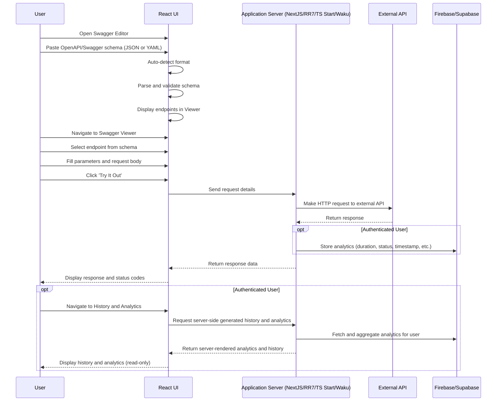

# Swagger/OpenAPI Editor and REST Client

## Framework Options

You can choose from several modern React frameworks for your project. All of these support server-side logic, routing, and are suitable for building full-stack React applications:

- **React Router 7 (Framework mode)**: The latest version of React Router, now with features merged from Remix. [Docs](https://reactrouter.com/start/modes#framework)
- **Next.js (App Router)**: The recommended way to use Next.js for full-stack React apps. [Docs](https://nextjs.org/docs/app)
- **Vinext**: The Next.js API surface, reimplemented on Vite
  [Docs/Code](https://github.com/cloudflare/vinext)
- **Tanstack Start**: A modern, full-stack React framework from the creators of TanStack Query. [Docs](https://tanstack.com/start/latest)
- **Waku**: A minimal React framework for building full-stack apps. [Docs](https://waku.gg/)

You are free to choose any of these options based on your team's preferences and project requirements.

You will be working on creating a **Swagger/OpenAPI Editor and Viewer** with REST client capabilities in one app. This allows users to edit and test APIs using OpenAPI specifications in an accessible, user-friendly interface.

PLEASE, READ THE TASK DESCRIPTION CAREFULLY UP TO THE END BEFORE STARTING THE TASK

## Theoretical Notes

This application is built around **OpenAPI/Swagger specifications**. You can use the [OpenAPI Initiative](https://www.openapis.org/) as a reference, along with tools like [Swagger UI](https://swagger.io/tools/swagger-ui/) as inspiration (if you aren't able to access the main link, you can try using [this link](https://forge.etsi.org/swagger/editor/)).

The application consists of:

1. **Swagger Editor** - Allows users to paste and edit OpenAPI schemas in JSON or YAML format
2. **Swagger Viewer** - Displays API endpoints from the schema and allows users to test them
3. **Authorized Features** - History and analytics for authenticated users, allowing them to track API usage and request details

The key difference from traditional REST clients is that users define their API through a schema, making it more structured and standardized.

## Building a team

- you should work in a team of 3 members
- you should select a team lead, who will be coordinating the development

## Application Prototype

You can use existing solutions like [Swagger Editor](https://editor.swagger.io/) as a source of inspiration (use alternative [links](https://forge.etsi.org/swagger/editor/) if you can't access the main one).
However, pay attention that we leave the final decision about the set of tools and design to you to not limit your possibilities and imagination.
Design, prototype, as well as implementation of the application, are up to you.

## Backend / API

- Application doesn't require a backend.
- Application should support any open, user-specified API (RESTful).
- You will use either **Next.js (App Router)** or **React Router 7 (Framework mode)** to make calls to the endpoint through the server. This is how you will avoid issues related to [CORS](https://developer.mozilla.org/en-US/docs/Web/HTTP/CORS).
  - **React Router 7 Framework mode** is the evolution of Remix, as Remix features have been merged into React Router. See [React Router 7 Framework mode docs](https://reactrouter.com/start/modes#framework).
  - **Next.js App Router** is the recommended way to use Next.js for full-stack React apps. See [Next.js App Router docs](https://nextjs.org/docs/app).
  - As an option, you can try using the Cloudflare's reimplementation of Next.js in Vite, check [Docs/Code](https://github.com/cloudflare/vinext).
  - You may also use **Tanstack Start** ([docs](https://tanstack.com/start/latest)) or **Waku** ([docs](https://waku.gg/)) as alternative modern React frameworks for full-stack development.

## Application structure

Your app must contain:

1. Main page, which has
   1. User registration/authentication
   2. **Swagger Editor** - allows users to paste and edit OpenAPI/Swagger schemas
      - Support for JSON and YAML formats
      - Auto-detection of format
      - Format switching with auto-conversion
      - Accessible to both authenticated and non-authenticated users
   3. **Swagger Viewer** - displays API endpoints from the schema and allows testing
      - Endpoint listing and organization
      - Parameter display (path, query, header, cookie)
      - Request and response schema visualization
      - Try-it-out functionality to execute requests
      - Generate cURL button
      - Accessible to both authenticated and non-authenticated users
2. History & Analytics (for authenticated users only)
3. About page (information about the course and team)
4. 404 Not Found page

## Repository requirements

- team lead should create a private repo in GitHub and invite other members
- repo name **swagger-editor-app**. Branch name for develop - **develop**, **main** branch is empty and contains only README.md
- the commit history should display the application development process. [Commit requirements](https://rs.school/docs/ru/git-convention)
- the demo version of the application should be deployed on `gh-pages`, `netlify`, `heroku`, or another similar service
- after completing the task, create a pull request from **develop** to **main** branch. **Merging a Pull Request is not required**
- in case you will use proxy-service you need to include instructions on how to run it locally
- you should make your repo public after the deadline

## Workflow/Branching strategy

You are free to choose your own way of developing the project and the repository. Here are links to a description and analysis of popular practices.

[Patterns for Managing Source Code Branches](https://martinfowler.com/articles/branching-patterns.html)
[Gitflow Workflow](https://www.atlassian.com/ru/git/tutorials/comparing-workflows/gitflow-workflow)
[GitHub flow](https://docs.github.com/en/get-started/quickstart/github-flow)
[ThreeFlow](https://habr.com/ru/company/infopulse/blog/345826/)
[GitLab Flow VS Git flow VS GitHub flow](https://yapro.ru/article/6172)

## Technical requirements

- semantic layout
- the application should work at least in the latest version of the Google Chrome browser
- private routes, 404, error boundary
- using jQuery in the main application code is not allowed (might be a part of other libraries, so pay attention to what you are using)
- you MUST use React 18 and above
- you MUST use one of the following modern React frameworks for your project:
  - **React Router 7 (Framework mode)** (recommended; includes Remix features)
  - **Next.js (App Router)** (or Vinext)
  - **Tanstack Start**
  - **Waku**

See the section "Framework Options" above for more details and links.

- you might use any CSS frameworks, any JS/components libs you want, HTML and CSS pre-processors
- you MUST use Typescript
- tests should be present on the project (**test** command in the package.json), and test coverage should be reported when running the command; test coverage should be at least 80%
- Linting and formatting tools (**lint** and **format-fix** commands in the package.json)
- Husky hooks (run **lint** on pre-commit, **test** on pre-push)
- ❗ it is forbidden to copy the code of other students. This ban applies to HTML, CSS, and JS code. You can use small code snippets from Stack Overflow, and other self-found sources on the Internet, except GitHub repositories of course students.

## Application design requirements

- the application quality is characterized by the elaboration of details, attention to typography (no more than three fonts per page, font size of at least 14 px, optimal [font and background contrast](https://snook.ca/technical/colour_contrast/colour.html)), carefully selected content
- interactivity of elements users can interact with; element hover effects; usage of different styles for the active and inactive state of the element; smooth animations
- the unity of styles of all pages of the application - the same fonts, button styles, indents, and the same elements on all pages of the application have the same appearance and layout. Item colors and background images may vary. In this case, colors should be from the same palette, and background images from the same collection.

## Description of function blocks

### General requirements

- Errors (unhandled exception, etc) should be displayed in a user-friendly format (toast, pop-up, or something like that - up to your decision).
- Internationalization (i18n) - at least 2 languages. User should be able to change the language by clicking on the toggler/select in the header.

#### Error handling

Application should gracefully handle errors and show meaningful messages to the user.
Please, distinguish between errors on the application level and the valid HTTP error code.
CORS issues or network timeouts should be shown as errors, whereas 4xx and 5xx HTTP response codes should be displayed in the response section.

### Main page

- This route is **public** - accessible to both authenticated and non-authenticated users.

#### Swagger Editor

- Allows users to paste and edit OpenAPI/Swagger specifications
- **Format Support:**
  - JSON format with syntax highlighting
  - YAML format with syntax highlighting
  - Auto-detection of input format (JSON or YAML)
  - Format switching toggle button with automatic conversion
- **Features:**
  - Live schema validation and error indication
  - Support for OpenAPI 3.0.x and Swagger 2.0 specifications
  - Example schemas dropdown (optional nice-to-have)
  - Clear/reset schema button
  - For authenticated users: Option to save schemas to the server/database (with analytics on server side)
  - For non-authenticated users: Session-based editing (data cleared on session end)
- **UX:**
  - Syntax highlighting with line numbers
  - Error messages for invalid schemas
  - Copy/paste friendly interface
  - Responsive split view: if the horizontal length is bigger than vertical, use horizontal split view; if the vertical length is bigger than horizontal, use vertical split view
- **Editor Libraries:** You may use external code editor libraries such as [Monaco Editor](https://github.com/microsoft/monaco-editor), [Code Mirror](https://codemirror.net/), or similar solutions for implementing syntax highlighting and code editing features.

#### Swagger Viewer

- Displays all endpoints from the loaded OpenAPI/Swagger schema
- **For Each Endpoint Display:**

  1. **Request Details**
     - HTTP Method (GET, POST, PUT, DELETE, PATCH, OPTIONS, HEAD, TRACE)
     - Endpoint URL/Path
     - Path parameters (required and optional)
     - Query parameters (required and optional)
     - Header parameters
     - Request body schema (if applicable)
     - Example request payloads
     - Supported content types (application/json, application/xml, etc.)
  2. **Response Details**
     - All documented HTTP status codes (200, 201, 204, 400, 401, 403, 404, 409, 500, etc.)
     - Response schema for each status code
     - Example response payloads for each status code
     - Response content types
     - Response headers (if documented)
  3. **Interactive Features**
     - **Try-It-Out / Execute Request Button**
       - Fill in parameter values
       - Set custom headers
       - Provide request body
       - Execute request through server (to avoid CORS issues)
       - Display response status, headers, and body
     - **Generate cURL Button**
       - Generate cURL command from current request state
       - Copy-to-clipboard functionality
     - **Request Preview**
       - Show full request before execution
       - Display method, URL, headers, body

- **Authentication Impact:**
  - Non-authenticated users: Full viewer access, can execute requests
  - Authenticated users: Full viewer access + request history tracking and analytics
    - All executed requests are recorded on the server side
    - Analytics data available in History & Analytics route

### Header

- The header should be sticky. The moment it becomes sticky (if there is a scroll on a page) should be animated: color can be changed or its height can become smaller. [Animated sticky header](https://www.youtube.com/watch?v=hR8UW5CvYgw)
- Link to the Main page (logo)
- Link to About page
- Control that allows user to switch the language
- Sign In / Sign Up buttons (for non-authenticated users) OR Sign Out button (for authenticated users)
- History link (only for authenticated users)

### Footer

- Footer should contain a link to the authors' GitHub, the year the application was created, link to About page, [course logo](../../assets/rss-logo.svg) with [link to the course](https://rs.school/courses/reactjs).
- Footer is displayed on all pages of the application.

### Sign In / Sign Up

- For authentication you should use **Firebase**, **Supabase**, **Convex** or **NextAuth.js** with the email/password sign-in method.
  - Firebase: see this [article](https://blog.logrocket.com/user-authentication-firebase-react-apps/) as an example of Firebase usage.
  - Supabase: has a [free tier](https://supabase.com/pricing). See this [documentation](https://supabase.com/docs/guides/getting-started/tutorials/with-react) as an example of Supabase integration with React app.
  - Convex: see the [Convex Quickstart](https://docs.convex.dev/quickstarts) for setup and integration details.
  - NextAuth.js: see [documentation](https://next-auth.js.org/providers/credentials) for an implementation example. You can use any supported [adapter](https://next-auth.js.org/adapters) (for example, [Prisma](https://authjs.dev/getting-started/adapters/prisma)) and an [sqlite](https://sqlite.org/) database to persist data.
- Client-side validation should be implemented (email and password strength - minimum 8 symbols, at least one letter, one digit, one special character, Unicode passwords must be supported)
- Upon successful login, the user should be redirected to the Main page
- If the user has been logged in already and tries to reach these routes, they should be redirected to the Main page

### About Page

- This route is **public** - accessible to all users (authenticated and non-authenticated)
- Should display information about:
  - The RS School course
  - The team members (names, roles, GitHub links)
  - Project description and goals
  - Technologies used
  - Links to relevant resources
- Clean, informative design consistent with the application aesthetics
- Responsive layout for various screen sizes

### History and analytics

- This route should be **private** (authenticated users only).
- History and analytics code should be lazy-loaded (so unauthenticated user won't download the code).
- The section should be server-side generated: all request history and analytics are aggregated and rendered on the server, then sent to the client for display.
- The section should display requests using links, on clicking on a request, user can view detailed analytics about that request.
- All request history and analytics information must be loaded from **Firebase**, **Supabase**, or **Convex** for the logged in user. The information is written to the database from the server side after each request.
- The following parameters must be stored for each request:
  - **Request Duration (Latency):** Time taken from sending the request to receiving the response.
  - **Response Status Code:** HTTP status code (e.g., 200, 404, 500) for each request.
  - **Request Timestamp:** When the request was made (date and time).
  - **Request Method:** GET, POST, PUT, DELETE, etc.
  - **Request Size:** Size of the request payload (in bytes).
  - **Response Size:** Size of the response payload (in bytes).
  - **Error Details:** If the request failed, log the error message or type (timeout, network error, etc.).
  - **Endpoint/URL:** The endpoint that was called (for grouping and analysis).
- The section should show requests sorted by the time of their execution (most recent first).
- **Simplified display:** History is read-only and for analytics review purposes only. There is **no request replay/re-execution** from history.
- If there are no requests in the history, show message to the user, e.g. "You haven't executed any requests yet", "It's empty here. Try those options:" and give links to the Editor and Viewer.

## How to submit tasks

- Link to pull request in rs app is submitted only by **team leader** ❗
- Make sure the pull request is available for review ❗. To do this, open the link that you submit in rs app in incognito browser mode.
- If the task is not submitted before the deadline, it will not be distributed during the cross-check and points will not be added to your score.

## Evaluation criteria

**Maximum available points for the task are 550**

### Cross-check criteria

For the convenience of verification, it is **necessary** to record and post on YouTube a short (5-7 min) video for reviewers with an explanation of how each of the items listed in the evaluation criteria is implemented. Add a link to the video to the pull-request.
[How to evaluate tasks in Cross check](https://rs.school/docs/en/cross-check-flow). In the comments to the assessment, it is necessary to indicate which items are not fulfilled or partially fulfilled.

### Main route - max 60 points

- [ ] The Main page should contain general information about the developers, project, and course. - **10 points**
- [ ] If the user is not authorized, there should be [Sign In] and [Sign Up] buttons in the upper right corner. - **10 points**
- [ ] If the user is authorized, there should be [History] and [Sign Out] buttons in the upper right corner. - **10 points**
- [ ] Navigation link to About page is available in header and footer. - **10 points**
- [ ] If the token is expired/invalid - the user should be redirected from the private routes to the Main page (it might happen either automatically, on page refresh or on route change). - **10 points**
- [ ] Pressing the Sign In / Sign up button redirects a user to the route with the Sign In / Sign up form. - **10 points**

### Sign In / Sign Up - max 50 points

- [ ] Buttons for Sign In / Sign Up / Sign Out are everywhere where they should be. - **10 points**
- [ ] Client-side validation is implemented. - **20 points**
- [ ] Upon successful login, the user is redirected to the Main page. - **10 points**
- [ ] If the user is already logged in and tries to reach these routes, they should be redirected to the Main page. - **10 points**

### Swagger Editor - max 120 points

- [ ] Loading/pasting OpenAPI/Swagger schema (JSON and YAML formats supported). - **25 points**
- [ ] Auto-detection of input format (JSON vs YAML). - **20 points**
- [ ] Format switching with automatic conversion (JSON ↔ YAML). - **20 points**
- [ ] Schema validation with error indication. - **15 points**
- [ ] For authenticated users: ability to save schemas. - **10 points**
- [ ] Viewer automatically populates with endpoints when schema is valid. - **10 points**
- [ ] Responsive split view based on screen orientation (horizontal/vertical). - **20 points**

### Swagger Viewer - max 120 points

- [ ] Endpoint list display with organization by path/method. - **20 points**
- [ ] Endpoint details: method, path, parameters display (path, query, header, cookie). - **25 points**
- [ ] Request schema and example display. - **20 points**
- [ ] Response schema, examples, and all supported status codes display. - **25 points**
- [ ] Try-it-out functionality: fill parameters, headers, body; execute request; display response. - **20 points**
- [ ] Generate cURL button with copy-to-clipboard functionality. - **10 points**

### History and analytics route - max 70 points

- [ ] History and analytics is server-side generated and shows informational message with links to the editor/viewer when there are no requests in the database. - **15 points**
- [ ] Requests are displayed sorted by timestamp (most recent first). - **10 points**
- [ ] The following analytics are recorded to the database from the application server side and displayed to the user: request duration, response status code, request timestamp, request method, request size, response size, error details, endpoint/URL. - **45 points**

### About Page - max 25 points

- [ ] About page is accessible to all users (public route). - **5 points**
- [ ] About page contains information about RS School course. - **5 points**
- [ ] About page contains team member information (names, roles, GitHub links). - **10 points**
- [ ] About page design is consistent with application design. - **5 points**

### General requirements - max 55 points

- [ ] Multiple (at least 2) languages support / i18n. - **30 points**
- [ ] Sticky header with animation. - **10 points**
- [ ] Errors are displayed in the user friendly format. - **10 points**
- [ ] Private routes properly protected (401 if not authenticated). Please, check the [RFC 9110](https://www.rfc-editor.org/rfc/rfc9110.html#name-401-unauthorized) - **5 points**

### Youtube video - max 50 points

### Penalties

- **0. Framework Choice**

  - [ ] Using any framework option other than the mandatory list (**React Router 7 (Framework mode)**, **Next.js (App Router)**, **Tanstack Start**, **Waku**) is strictly forbidden and will result in **-200 points**

- **1. TypeScript & Code Quality**

  - [ ] @ts-ignore or any usage (search through GitHub repo) **-20 points** for each
  - [ ] The presence of _code-smells_ (God-object, chunks of duplicate code), commented code sections **-10 points per each**

- **2. Test Coverage**

  - [ ] Statement coverage below 80% (≥70%): **-50 points**
  - [ ] Statement coverage below 70% (≥50%): **-100 points**
  - [ ] All coverage metrics below 50%: **-150 points**
  - [ ] Absence of tests **-250 points**

- **3. React Best Practices**

  - [ ] One of the required lazy-loaded routes isn't lazy-loaded **-50 per each**

- **4. Console & Error Handling**

  - [ ] The presence of errors and warnings in the console **-20 points** for each
  - [ ] The presence in the console of the results of the console.log execution **-20 points** for each
  - [ ] HTTP 4xx and 5xx status codes displayed as errors not in the response section **-50 points**

- **5. Development Tools**

  - [ ] Absence of a linting tool **-150 points**
  - [ ] Absence of a formatting tool **-100 points**
  - [ ] Absence of husky git hooks **-100 points**

- **6. UI/UX**

  - [ ] Vite/NextJS default favicon **-50 points**

- **7. Project Management**
  - [ ] Making commits after the deadline **-100 points**
  - [ ] Pull Request doesn't follow guideline (including checkboxes in Score) [PR example](https://rs.school/docs/en/pull-request-review-process#pull-request-description-must-contain-the-following) **-10 points**
  - [ ] ⚠️ The administration reserves the right to apply penalties for the use of incorrect repository or branch names

## Sequence Diagram: User Journey and Analytics Flow

```mermaid
sequenceDiagram
    participant User
    participant UI as React UI
    participant Server as Application Server (NextJS/RR7/TS Start/Waku)
    participant API as External API
    participant DB as Firebase/Supabase

    User->>UI: Open Swagger Editor
    User->>UI: Paste OpenAPI/Swagger schema (JSON or YAML)
    UI->>UI: Auto-detect format
    UI->>UI: Parse and validate schema
    UI->>UI: Display endpoints in Viewer

    User->>UI: Navigate to Swagger Viewer
    User->>UI: Select endpoint from schema
    User->>UI: Fill parameters and request body
    User->>UI: Click 'Try It Out'
    UI->>Server: Send request details
    Server->>API: Make HTTP request to external API
    API-->>Server: Return response
    opt Authenticated User
        Server->>DB: Store analytics (duration, status, timestamp, etc.)
    end
    Server-->>UI: Return response data
    UI-->>User: Display response and status codes

    opt Authenticated User
        User->>UI: Navigate to History and Analytics
        UI->>Server: Request server-side generated history and analytics
        Server->>DB: Fetch and aggregate analytics for user
        Server-->>UI: Return server-rendered analytics and history
        UI-->>User: Display history and analytics (read-only)
    end
```
