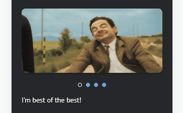
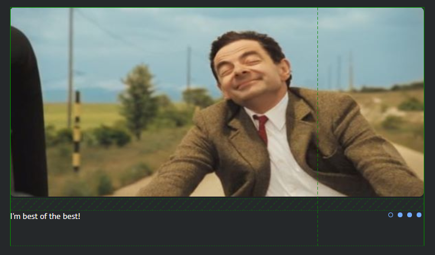
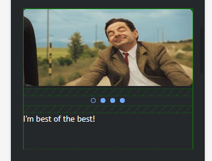
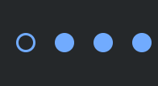

# CSS Meme Slider

## Skills

`CSS animations` `@keyframes` `CSS transitions` `Flexbox` `CSS Grid` `responsive design` `media queries` `pseudo-classes` `relative units`

## Our Handbook

👉 [Open Handbook](https://publish.obsidian.md/juniornotess/RS-Bootcamp-2026/Tasks/01+%E2%80%94+CSS+Meme+Slider) 👈

This handbook is currently in a test phase.
If you notice any issues or have suggestions, feel free to contact me on Discord: `@OreskaG`

## Task Description

Build a slider using pure HTML and CSS - **no JavaScript allowed**. The slider must display a set of meme images with captions and navigation controls, work on both desktop and mobile, and use smooth CSS animations for slide transitions.

Desktop preview:

<kbd></kbd>

Mobile preview:

<kbd></kbd>

## Requirements

### Layout

- The slider is centered on the page with equal margins on the left and right
- Desktop layout of images, captions, and controls:

<kbd></kbd>

- Mobile layout of images, captions, and controls:

<kbd></kbd>

### Functionality

- Clicking a control triggers a smooth animated transition between images (e.g. slide, fade, scroll - any smooth CSS animation)
- Clicking a control triggers a smooth animated transition between captions
- Captions must be plain text strings - not embedded in the image
- Each control has a clickable area larger than the visual size of the control itself
- Controls have interactive states: hover, active (pressed), active slide indicator, cursor change

Controls effects example:

<kbd></kbd>

> The yellow circle in the preview is a screen recorder's mouse indicator - you do not need to implement or score it.

### Technical Restrictions

- No CSS frameworks (Bootstrap, Foundation, etc.)
- No JavaScript or npm packages
- No CSS preprocessors - plain CSS only
- Target browser: Google Chrome
- `px` units are only allowed inside media query breakpoints; use relative units everywhere else (`rem`, `em`, `%`, `vh`, `vw`, `fr`, etc.)
- `reset.css` and `normalize.css` are allowed
- `gif` images are allowed
- Structural HTML tags (`h1`, `header`, `footer`, etc.) are allowed to add page content
- All slider components (controls, images, captions) must stay in the normal document flow:
  - `position` may only be `static`
  - No `top`, `left`, `right`, or `bottom` offsets
  - No `float`
  - `flex`, `grid`, `margin`, and similar are fine
- No CSS pseudo-elements (pseudo-classes are allowed)

## Submission

1. Create a public repository named `cssMemeSlider`. Check "Initialize with README" so a `main` branch is created automatically.
2. Create a `gh-pages` branch.
3. In `gh-pages`, create a folder `cssMemeSlider`. Your work will be live at:
   `https://<YOUR_GITHUB_NAME>.github.io/cssMemeSlider/cssMemeSlider/index.html`
4. Complete the task inside the `cssMemeSlider` folder with **at least 5 commits**.
5. Commit names must follow the [Git commit convention](https://rs.school/docs/git-convention). Each commit must also include a timestamp showing the exact time it was made (weekday, month, date, year, time to the second).

   Example commit messages:

   > `init: start cssMemeSlider-task (Mon, Sep 13, 2021 10:12:24 PM)`
   > `feat: add basic page layout (Mon, Sep 13, 2021 10:25:24 PM)`

   Shell template you can use:

   > `git commit -m "init: start cssMemeSlider-task $(LC_ALL=C date '+(%a, %b %d, %Y %r)')"`

6. When done, open a Pull Request from `gh-pages` into `main`. Name the PR after the task. Write the PR description following the [PR description schema](https://rs.school/docs/short-track/pull-request-requirements). Do **not** merge the PR. Submit the PR link in the cross-check form. In the description, list all screen resolutions you tested (e.g. mobile: 320×568, desktop: 1920×1080).

> If a reviewer has any questions about your implementation, they should find all answers in your PR description.

## Cross-check

This task is reviewed via the [cross-check process](https://rs.school/docs/cross-check-flow).

## Scoring Criteria

**Maximum score: 100 points**

### Repository & Submission (30 points)

- PR is open from `gh-pages` into `main` and not merged **+5**
- `cssMemeSlider` folder exists in `gh-pages` and deployment is accessible **+5**
- At least 5 commits in history **+5**
- Commits follow the naming convention and each includes a timestamp **+5**
- PR link was submitted **+5**
- PR description follows the schema and lists all tested resolutions **+5**

### Layout (10 points)

- Slider is centered with equal margins on both sides **+5**
- Correct layout of images, captions, and controls (matches design) **+5**

### Animations (20 points)

- Smooth animated transition between images **+15**
- Smooth animated transition between captions **+5**

### Content & Interaction (15 points)

- Captions are plain text strings (not part of the image) **+5**
- Each control has a clickable area larger than the control itself **+5**
- Controls have interactive states: hover, active, active slide indicator, cursor change **+5**

### Responsive Design (10 points)

- Mobile version is present and layout of images, captions, and controls is correct **+10**

### Code Quality (15 points)

- Only relative units used; slider is fluid across screen sizes **+5**
- All slider components in normal document flow; `position` is `static` only; no `float` **+5**
- No CSS pseudo-elements (pseudo-classes are fine) **+5**

### Penalties

- JavaScript or external libraries used **-100500**
- Obfuscated (non-human-readable) CSS or HTML **-100500**
- Plagiarism **-100500**

---

> **Design freedom:** Block sizes, fonts, slider content, and visual design are up to the developer. Significant deviations are acceptable - scoring focuses on layout structure and technical requirements, not pixel-perfect design.
>
> **Review resolutions:** Mobile version is checked at a minimum width of **500px**. Desktop version is checked at **1024px**.
>
> **Meme selection** is up to you - at least 4 memes recommended.

## Learning Resources

- [CSS Animations - MDN](https://developer.mozilla.org/en-US/docs/Web/CSS/CSS_animations)
- [CSS Transitions - MDN](https://developer.mozilla.org/en-US/docs/Web/CSS/CSS_transitions)
- [CSS Transform - MDN](https://developer.mozilla.org/en-US/docs/Web/CSS/transform)
- [CSS @keyframes - MDN](https://developer.mozilla.org/en-US/docs/Web/CSS/@keyframes)
- [A Complete Guide to Flexbox - CSS-Tricks](https://css-tricks.com/snippets/css/a-guide-to-flexbox/)
- [A Complete Guide to Grid - CSS-Tricks](https://css-tricks.com/snippets/css/complete-guide-grid/)
- [Using Media Queries - MDN](https://developer.mozilla.org/en-US/docs/Web/CSS/CSS_media_queries/Using_media_queries)
- [Responsive Design - web.dev](https://web.dev/learn/design/)
- [CSS Pseudo-classes - MDN](https://developer.mozilla.org/en-US/docs/Web/CSS/Pseudo-classes)
