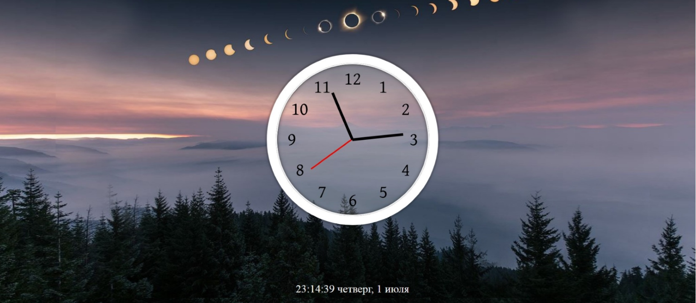

# JS Clock

## Skills

`DOM API` `Date object` `setInterval` / recursive `setTimeout` `CSS transforms` `Intl.DateTimeFormat`

## Task Description

**JS Clock** is an analog clock with moving hour, minute, and second hands, driven by JavaScript and rotated with CSS transforms. Date and time handling is a recurring need in many web projects: clocks, timers, stopwatches, store opening hours, game round duration, scheduled UI changes, and so on.

- [Reference demo](https://irinainina.github.io/JavaScript30-1/02%20-%20JS%20and%20CSS%20Clock/index-FINISHED.html)
- [Author video walkthrough](https://youtu.be/xu87YWbr4X0) (10:44)
- Parent task and scoring: [js30.md](js30.md)

## Mandatory Additional Feature

Extend the app with a **digital clock panel** displayed next to the analog face. It must show:

- exact time (hours, minutes, seconds);
- full weekday name;
- date (day number + month name);
- year.

The UI language is up to you (English, Russian, Belarusian, or any other locale — but pick one and apply it consistently). [Reference demo](https://js3002.github.io/)

## Optional Improvements

Each well-executed item below is worth **+10** points (Stage 3 in [js30.md](js30.md), capped at 30 per widget). You may also invent your own improvements of comparable complexity.

- A multi-timezone view showing time at several cities of the world simultaneously. [Reference](https://24timezones.com/)
- An online alarm clock with sound and dismiss/snooze controls. [Reference](https://onlinealarmkur.com/en/)
- A cuckoo clock — at the top of each hour the bird pops out and chimes. [Reference](http://www.3quarks.com/en/CuckooClock/index.html)
- A "do nothing for 2 minutes" / "Quiet Place" relaxation mode with a timer that resets on user input. [Reference](http://www.donothingfor2minutes.com/)
- Circular progress diagrams for seconds / minutes / hours rendered next to the face.
- Dark / light theme toggle that persists across reloads. [Reference](https://50projects50days.com/projects/theme-clock/)

## Learning Resources

- [Searching: getElement*, querySelector* — javascript.info](https://javascript.info/searching-elements-dom)
- [Node properties: type, tag, contents — javascript.info](https://javascript.info/basic-dom-node-properties)
- [Date and time — javascript.info](https://javascript.info/date)
- [`Date.prototype.toLocaleTimeString()` — MDN](https://developer.mozilla.org/en-US/docs/Web/JavaScript/Reference/Global_Objects/Date/toLocaleTimeString)
- [`Date.prototype.toLocaleDateString()` — MDN](https://developer.mozilla.org/en-US/docs/Web/JavaScript/Reference/Global_Objects/Date/toLocaleDateString)
- [`Intl.DateTimeFormat` — MDN](https://developer.mozilla.org/en-US/docs/Web/JavaScript/Reference/Global_Objects/Intl/DateTimeFormat)
- [Recursive `setTimeout` — javascript.info](https://javascript.info/settimeout-setinterval#recursive-settimeout)
- [`transform: rotate()` — MDN](https://developer.mozilla.org/en-US/docs/Web/CSS/transform-function/rotate)
