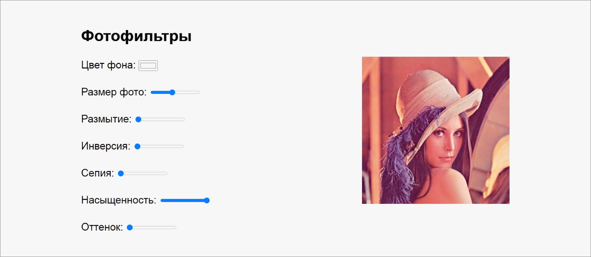

# Photofilter

## Skills

`DOM API` `CSS custom properties` `CSS filter property` `range input` `Canvas API` (optional, for save) `Blob` / `URL.createObjectURL`

## Task Description

**Photofilter** is a tiny photo editor: the user drags sliders to apply CSS filter properties (blur, brightness, contrast, saturation, hue-rotate, etc.) to a chosen image and immediately sees the result. Internally the sliders write to CSS custom properties, which the image's `filter` rule consumes.

- [Reference demo](https://irinainina.github.io/JavaScript30-1/03%20-%20CSS%20Variables/index-FINISHED.html)
- [Author video walkthrough](https://youtu.be/AHLNzv13c2I) (13:13)
- Parent task and scoring: [js30.md](js30.md)

## Mandatory Additional Feature

Add **at least two extra filters** beyond what the original project offers, and implement **presets**: a row of thumbnail variants of the photo, each with a preconfigured combination of filters. Clicking a preset thumbnail applies the same combination to the main photo and updates the slider positions accordingly.

## Optional Improvements

Each well-executed item below is worth **+10** points (Stage 3 in [js30.md](js30.md), capped at 30 per widget). You may also invent your own improvements of comparable complexity.

- Next / previous buttons to flip through a built-in gallery of source images.
- Load an image **from the user's computer** via `<input type="file">` (and/or drag-and-drop).
- Save the **edited** image back to disk with all filters baked in (render to a `<canvas>`, export with `canvas.toBlob`).
- Reset-all button that returns every slider to its default value.
- Live display of the generated **CSS `filter` string** with a "copy to clipboard" button.

## Learning Resources

- [`<input>` - MDN](https://developer.mozilla.org/en-US/docs/Web/HTML/Element/Input)
- [`<input type="range">` - MDN](https://developer.mozilla.org/en-US/docs/Web/HTML/Element/Input/range)
- [`<input type="file">` - MDN](https://developer.mozilla.org/en-US/docs/Web/HTML/Element/Input/file)
- [CSS `filter` property - CSS-Tricks Almanac](https://css-tricks.com/almanac/properties/f/filter/)
- [CSS Filters for Online Photo Editing - Orangeable](https://orangeable.com/css/filters)
- [Using CSS custom properties (variables) - MDN](https://developer.mozilla.org/en-US/docs/Web/CSS/Using_CSS_custom_properties)
- [Canvas API tutorial - MDN](https://developer.mozilla.org/en-US/docs/Web/API/Canvas_API/Tutorial)
- [`HTMLCanvasElement.toBlob()` - MDN](https://developer.mozilla.org/en-US/docs/Web/API/HTMLCanvasElement/toBlob)
