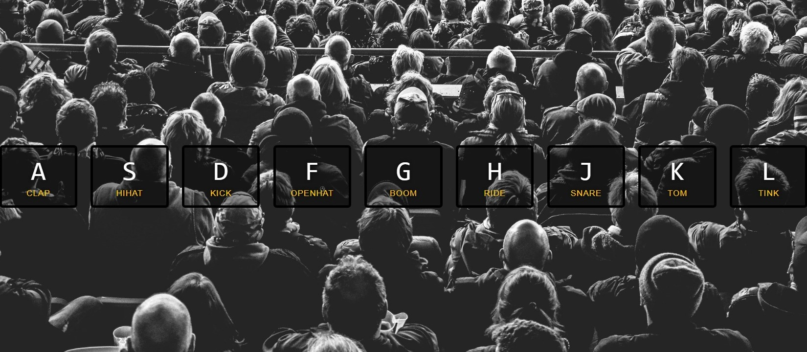
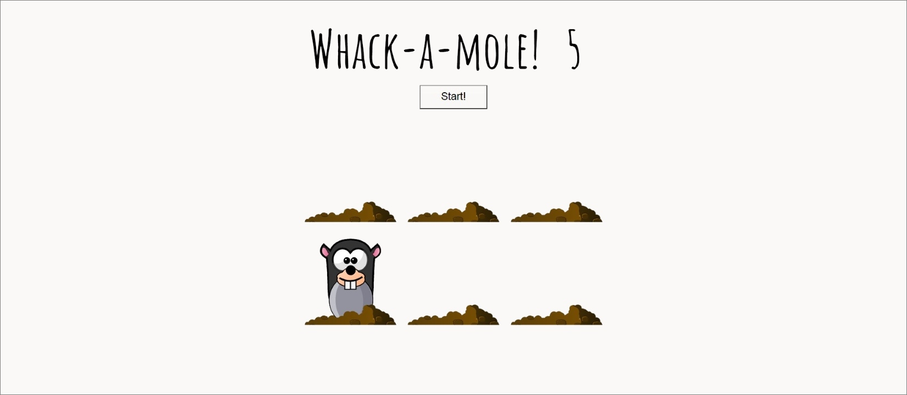

# JS30 Widgets

## Skills

`HTML5` `CSS3` `vanilla JavaScript (ES2020+)` `DOM API` `event handling` `CSS animations` `Web Audio / Canvas / Video APIs` `Git branching` `Pull Request workflow` `code review` `Netlify Preview`

## Task Description

This task is a homage to the [JavaScript30](https://javascript30.com/) course by Wes Bos — 30 small, self-contained widgets built with vanilla web technologies. Your goal is to grow your DOM and async muscles by **reproducing two real widgets from scratch**, then enriching each with your own features.

Unlike the standard school flow, this task is performed in a **shared public repository** maintained by the course curator. Every participant gets a personal subfolder and a personal branch in that repository, so the whole stream effectively builds a small widget library together. You will see your peers' branches, pull requests, and live previews — treat that as a learning resource, not as a copy/paste source.

There are **six widgets** to choose from. Pick any **two** that excite you. There is no "part 1 / part 2" split — the order does not matter, and the two widgets are scored independently.

| [Drum Kit](js30-1.md)                                                                                    | [JS Clock](js30-2.md)                                                                                   | [Vertical Slider](js30-3.md)                                          |
| -------------------------------------------------------------------------------------------------------- | ------------------------------------------------------------------------------------------------------- | --------------------------------------------------------------------- |
|                                                                                    |                                                                                   |                                                 |
| [Demo](https://irinainina.github.io/JavaScript30-1/01%20-%20JavaScript%20Drum%20Kit/index-FINISHED.html) | [Demo](https://irinainina.github.io/JavaScript30-1/02%20-%20JS%20and%20CSS%20Clock/index-FINISHED.html) | [Demo](https://50projects50days.com/projects/double-vertical-slider/) |
| [Video walkthrough](https://youtu.be/VuN8qwZoego) (19:38)                                                | [Video walkthrough](https://youtu.be/xu87YWbr4X0) (10:44)                                               | [Video walkthrough](https://youtu.be/laNpbZISwjY) (26:53)             |

| [Custom Video Player](js30-4.md)                                                      | [Photofilter](js30-5.md)                                                                         | [Whack-A-Mole](js30-6.md)                                                                         |
| ------------------------------------------------------------------------------------- | ------------------------------------------------------------------------------------------------ | ------------------------------------------------------------------------------------------------- |
|                                                                 |                                                                            |                                                                             |
| [Demo](https://irinainina.github.io/JavaScript30-1/11%20-%20Custom%20Video%20Player/) | [Demo](https://irinainina.github.io/JavaScript30-1/03%20-%20CSS%20Variables/index-FINISHED.html) | [Demo](https://irinainina.github.io/JavaScript30-1/30%20-%20Whack%20A%20Mole/index-FINISHED.html) |
| [Video walkthrough](https://youtu.be/yx-HYerClEA) (24:33)                             | [Video walkthrough](https://youtu.be/AHLNzv13c2I) (13:13)                                        | [Video walkthrough](https://youtu.be/toNFfAaWghU) (14:35)                                         |

## Requirements

### Functional requirements (per widget)

Each of your two chosen widgets must go through three stages.

#### Stage 1 — Reproduce the source project

- Re-create the HTML/CSS/JS for the chosen widget yourself.
- Use the author's video and the live demo as a reference. Watch, understand, **then write the code on your own**.
- Direct copy-paste of the original source code is **not allowed**. Re-typing while watching the video is fine — the point is that you actually wrote and understood every line.
- If you spot rough edges in the original (a11y issues, dead code, layout bugs), feel free to fix them. Defects inherited from the original project are **not** penalized.

#### Stage 2 — Implement the mandatory extension

Every widget has a **mandatory additional feature** described in its individual task file (`js30-1.md` … `js30-6.md`). You must implement that feature yourself, without copying code from the internet, the original project, or fellow students.

#### Stage 3 — Optional improvements

For each widget the task file proposes several optional improvements. You may pick any of them — or invent your own of similar complexity. Each well-executed improvement is worth points (see Scoring). The number of improvements is not capped, but the per-widget score has a ceiling.

Even if Stage 1 or Stage 2 is incomplete, you can still reach the maximum widget score via Stage 3, as long as the application stays on-topic for the original widget (a music app must play sounds, a clock must show time, a slider must slide, etc.).

### Non-functional requirements

- Verified in the latest **Google Chrome**.
- Allowed: [Bootstrap](https://getbootstrap.com/), CSS frameworks, HTML/CSS preprocessors (`Sass`, `Less`, `PostCSS`).
- **Forbidden**: jQuery, any other JS libraries or frameworks (React, Vue, Angular, Lodash, etc.).
- JavaScript code must be readable — no minification or obfuscation in the committed source.
- For convenience of cross-check, the application should print a short **self-evaluation to the browser console** on load, listing every Stage 1 / Stage 2 / Stage 3 item you claim and the points you assigned to yourself.

## Submission

This task is delivered into a **shared public repository** owned by the course curator. The repo URL is announced in the stream chat (referred to below as `<COURSE_REPO>`).

### Repository layout

```
<COURSE_REPO>/
├── students/
│   ├── <github-login-A>/
│   │   ├── drum-kit/
│   │   └── js-clock/
│   └── <github-login-B>/
│       ├── photofilter/
│       └── whack-a-mole/
└── index.html         # course-wide gallery (added later by the curator)
```

### Workflow

1. **Fork is not used.** The curator adds you as a collaborator to `<COURSE_REPO>` (or you push branches via your own clone — the curator opens the PR for you).
2. From `main`, create a working branch per widget, named `<github-login>/<task-slug>`, for example `johndoe/drum-kit`. Use lowercase letters and dashes only.
3. In your branch, create `students/<github-login>/<task-slug>/` and put **all** the widget's files there (`index.html`, `style.css`, `script.js`, assets, build output if any). Each widget is a standalone static site rooted at its own folder.
4. Follow the [git commit convention](https://rs.school/docs/git-convention). Commit history should reflect the real development process — frequent, meaningful commits, not a single dump.
5. Open a Pull Request from your branch into `main`. PR title and description follow the [PR description schema](https://rs.school/docs/short-track/pull-request-requirements). **Do not merge** the PR — the curator and your reviewers need it open.
6. **Netlify Preview Bot** is configured on the repository. Within a few minutes of opening (or updating) the PR, the bot leaves a comment with a live preview URL such as `https://deploy-preview-<N>--<course-site>.netlify.app/students/<login>/<task>/`. This URL is your **deploy link** — submit it in rs app → **Cross-Check: Submit** for this task. No `gh-pages` or Netlify Drop is required.
7. Repeat steps 2–6 for your second widget (separate branch, separate folder, separate PR).

### Public repository — what it means for you

- Other students will see your branch, your PR, your code, and your preview link. That is by design — peers, mentors, and reviewers learn from each other's solutions.
- Browsing other people's code **after you submit** is encouraged. Browsing it **before** you submit is on your conscience; we do not police it, but you only learn by writing your own code.

## Cross-check

The task is reviewed via the [cross-check process](https://rs.school/docs/cross-check-flow).

- The reviewer opens the deploy-preview URL from the PR and verifies each scoring item against the live widget and the source in the corresponding `students/<login>/<task>/` folder of the open PR.
- The browser-console self-evaluation (see Non-functional requirements) is treated as the author's claim; the reviewer awards or rejects each item based on what actually works in the preview.
- A reviewer may also browse the diff in the PR to confirm there was no obvious copy-paste from another student's branch.

### Bug penalties

- **Major bug** — implemented functionality works, but after some manipulations it breaks down or throws errors in the browser console — **-15** per bug, per widget.
- **Minor bug** — implemented functionality works, but visual or state behaviour is off (a button is not re-enabled, a class is not removed, etc.) and there are no errors in the console — **-5** per bug, per widget.

## Scoring Criteria

**Maximum score: 130 points** (65 per widget × 2 widgets).

Each widget is scored independently. The per-widget breakdown below is applied **twice**.

### Per widget (65 points)

#### Stage 1 — Reproduction (20 points)

- The widget visually matches the original demo (layout, key colors, key interactions) **+10**
- The core behaviour of the original widget works end-to-end (no broken features, no console errors) **+10**

#### Stage 2 — Mandatory additional feature (15 points)

- The mandatory additional feature described in the widget's task file is implemented and works correctly **+10**
- The feature is integrated with the rest of the UI (does not break Stage 1 functionality, handles edge cases reasonably) **+5**

#### Stage 3 — Optional improvements (up to 30 points)

- Each well-executed optional improvement — either from the list in the widget's task file or of comparable complexity invented by the author — **+10**, **capped at 30** points total for this stage.

#### Engineering & delivery requirements (counted within the 65 above — penalties only)

- JavaScript code is readable, not minified or obfuscated — **-10** if violated
- No forbidden JS library/framework is used (jQuery, React, Vue, Angular, etc.) — **-65** (the whole widget is voided)
- Browser-console self-evaluation is present and lists the items claimed — **-5** if missing
- Commit history reflects real development (not a single dump commit) — **-10** if violated
- PR is open against `main` of the course repo, with a working Netlify preview link — **-10** if violated; if there is no working preview at all, the widget cannot be scored

### Total

- Widget 1: up to **65**
- Widget 2: up to **65**
- **Sum: up to 130**

## Learning Resources

- [JavaScript30 playlist by Wes Bos](https://www.youtube.com/playlist?list=PLu8EoSxDXHP6CGK4YVJhL_VWetA865GOH)
- [50 Projects in 50 Days — GitHub](https://github.com/bradtraversy/50projects50days)
- [MDN — DOM Introduction](https://developer.mozilla.org/en-US/docs/Web/API/Document_Object_Model/Introduction)
- [MDN — Using Web Audio API](https://developer.mozilla.org/en-US/docs/Web/API/Web_Audio_API/Using_Web_Audio_API)
- [MDN — Canvas tutorial](https://developer.mozilla.org/en-US/docs/Web/API/Canvas_API/Tutorial)
- [MDN — HTMLMediaElement](https://developer.mozilla.org/en-US/docs/Web/API/HTMLMediaElement)
- [MDN — CSS transitions](https://developer.mozilla.org/en-US/docs/Web/CSS/CSS_transitions/Using_CSS_transitions)
- [MDN — CSS animations](https://developer.mozilla.org/en-US/docs/Web/CSS/CSS_animations/Using_CSS_animations)
- [Git commit convention](https://rs.school/docs/git-convention)
- [Pull Request requirements](https://rs.school/docs/short-track/pull-request-requirements)
- [Cross-check flow](https://rs.school/docs/cross-check-flow)
- [Netlify Deploy Previews](https://docs.netlify.com/site-deploys/deploy-previews/)
