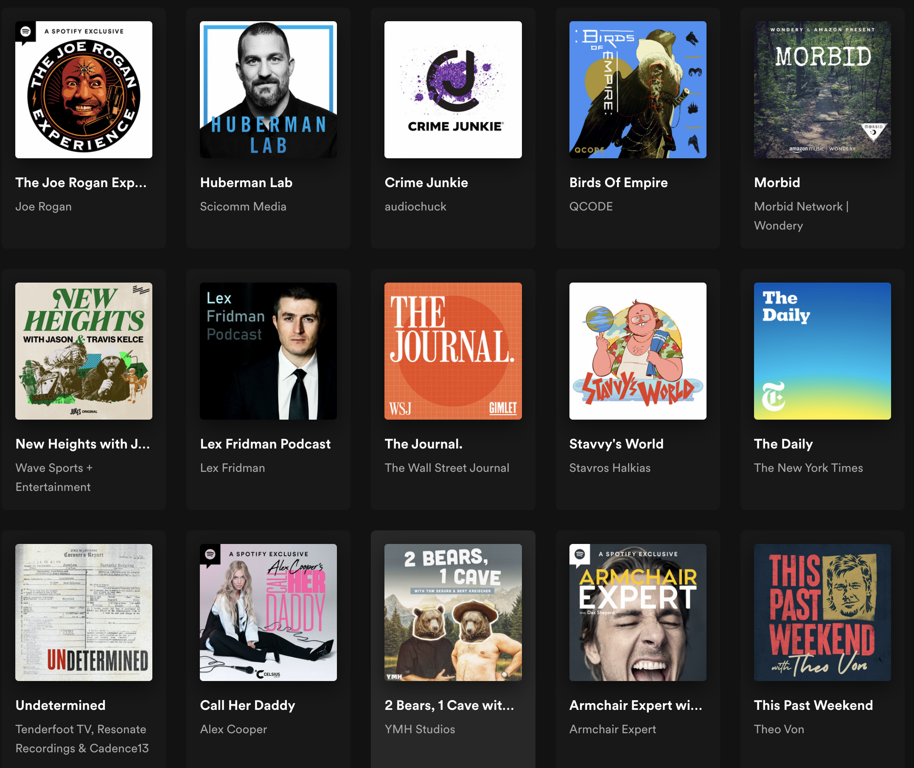
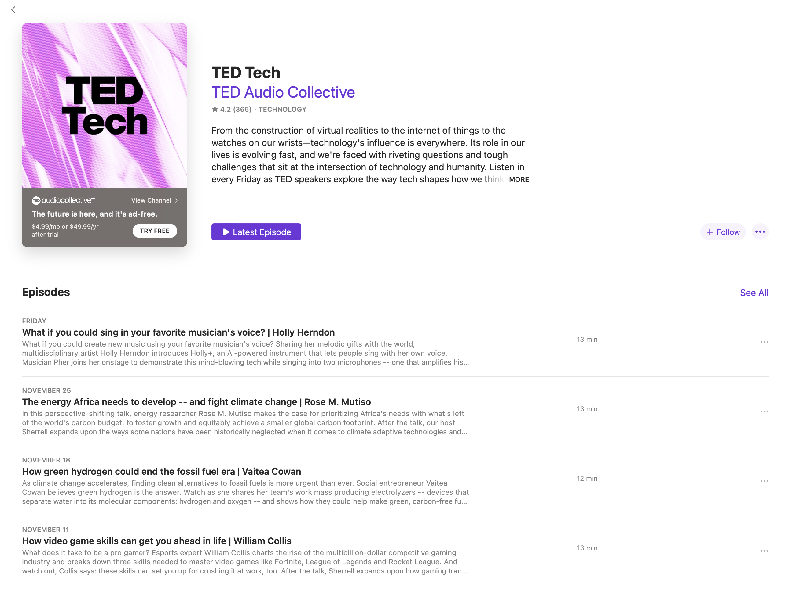
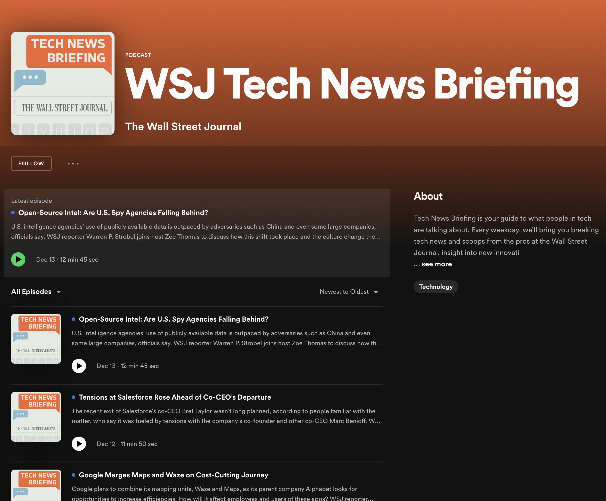

# Podcast Player

## Skills

`vanilla JavaScript` `TypeScript` `Fetch API` `async/await` `debouncing` `routing` `HTML5 Audio API` `LocalStorage` `responsive design`

## Our Handbook

👉 [Open Handbook](https://autocubes.site/junior-notes/rs-bootcamp-2026/readme) 👈

This handbook is currently in a test phase.
If you notice any issues or have suggestions, feel free to contact me on Discord: `@OreskaG`

## Task Description

A podcast player is an app for playing podcasts - audio recordings that are typically part of a series focused on a specific topic. Popular podcast players include:

- [Apple Podcasts](https://www.apple.com/apple-podcasts/)
- [Spotify](https://open.spotify.com/genre/podcasts-web)
- [Pocket Casts](https://pocketcasts.com)

Build a simplified web version of a podcast player that covers these user stories:

1. The user can see a list of recommended podcasts provided by the Listen Notes test API.
2. The user can search podcasts via text search. Since the test API returns predefined test data, search results may not correspond to the entered query.
3. The user can open a podcast from the list and see a details page with its available episodes.
4. The user can select an episode and start listening to it.
5. The user can seek forward and back through the episode timeline.
6. The user can keep navigating the app (search podcasts, browse episodes) while an episode is playing in the player.
7. The user can add and remove episodes to/from a personal playlist.
8. The app remembers the current play position and the playlist content after the page is reloaded.

The task is split into four sections. Each section builds on the previous ones.

## Requirements

### Section 1 - Landing page and search

_Covers user stories 1, 2._

1. Use the Listen Notes test API for this task. Refer to the official [Listen Notes guide on testing the Podcast API without an API key](https://www.listennotes.help/article/48-how-to-test-the-podcast-api-without-an-api-key) for information about the test API, and use the [Listen API v2 documentation](https://www.listennotes.com/api/docs/) while working with the endpoints.

   Base URL:

   ```txt
   https://listen-api-test.listennotes.com/api/v2
   ```

   The test API does not require authentication. Requests can be sent without the `X-ListenAPI-Key` header.

   ```ts
   class App {
     fetchPodcasts(): void {
       const url =
         "https://listen-api-test.listennotes.com/api/v2/best_podcasts?sort=recent_published_first&page=1";

       fetch(url, {
         method: "GET",
         headers: {
           Accept: "application/json",
         },
       })
         .then((res) => res.json())
         .then((json) => console.log(json));
     }
   }
   ```

2. Build a landing page. Use your own layout or take inspiration from existing players:

   Apple landing
   

   Spotify landing
   

3. Fetch podcasts using the [Best Podcasts API](https://www.listennotes.com/api/docs/) endpoint (`GET /best_podcasts`, use `sort=recent_published_first`) and render them on the landing page. The test API returns predefined mock data, therefore pagination or infinite scroll is not required for this task.

4. Add a search input.
   - When the input is empty, show the podcasts loaded from `GET /best_podcasts`.
   - When the input has a value, send a request to the [Search API](https://www.listennotes.com/api/docs/) (`GET /search?q=<query>&type=podcast`).
   - The test API returns predefined mock data, so the search results may not correspond to the entered query.
   - Search pagination is not required because the test API returns predefined mock data.
   - Search requests must **not** fire on every keystroke. Use [debouncing or throttling](https://www.telerik.com/blogs/debouncing-and-throttling-in-javascript) to limit the number of API calls.

### Section 2 - Podcast details page

_Covers user story 3._

1. Clicking a tile on the landing/search page navigates to a page that lists episodes for that podcast. Layout is up to you - examples for reference:

   Apple details
   

   Spotify details
   

2. To load episodes, use the podcast `id` from the landing/search result and request detailed data with the [Podcast Details API](https://www.listennotes.com/api/docs/) (`GET /podcasts/{id}`). Render episodes from the `episodes` array in the response.
3. The user must be able to return to the landing page without using the browser's "Back" button (provide an in-app navigation control).

### Section 3 - Podcast player

_Covers user stories 4, 5, 6._

1. Build an audio player component with the following behavior:
   - Alternating **Play / Pause** button.
   - Progress bar with current time and total time (or remaining time).
   - The user can seek the audio by clicking the progress bar.
   - The player stays visible on screen at all times.
   - The player does not block navigation between pages.
   - The user can search podcasts (Section 1) and browse episodes (Section 2) while the current episode is playing.
   - Selecting another episode replaces the current stream with the new one.

### Section 4 - Memory and playlist

_Covers user stories 7, 8._

1. Add a playlist page that lists user-added episodes. Layout is up to you - match the style of the rest of the app.
2. Store the playlist state in `localStorage`.
3. The user can add and remove episodes to/from the playlist.
4. The behavior of the playlist when the user starts a new episode is up to you (e.g. auto-advance, manual selection).
5. Store the playback progress of each played episode in `localStorage`. When the user returns to a previously listened episode, the player resumes from roughly 10 seconds before the last position.

### Technical requirements

1. **Vanilla JavaScript or TypeScript only** - no UI frameworks (React, Vue, Angular, etc.).
2. The app must be a Single Page Application - page transitions happen without full reloads.
3. No console errors during normal use.
4. The app must work in the latest version of Chrome.

## Submission

1. Work in a **public repository on your personal GitHub account** (named `podcast-player` or similar).
2. From the `main` branch, create a `podcast-player` branch and place your project files there.
3. Complete the task.
4. Deploy your work to `gh-pages`.
5. Open a Pull Request from `podcast-player` into `main`. Name the PR after the task. Write the description following the [PR description schema](https://rs.school/docs/short-track/pull-request-requirements). **Do not merge** this PR.
6. Submit the deployment link in [rs app](https://app.rs.school/) → **Cross-Check: Submit**.
7. After the deadline, the cross-check begins (3 days). To get the score, you must review all assigned works and submit results in **Cross-Check Review**.

> **Note.** This task uses the Listen Notes test API, which does not require an API key or authentication. The API returns predefined mock data intended for development and testing.

## Cross-check

This task is reviewed via the [cross-check process](https://rs.school/docs/cross-check-flow).

The reviewer goes through every scoring criterion and awards the listed points only if the feature works in the deployed app. Criteria that cannot be verified (e.g. the app fails to load or API requests fail) score 0 for that block.

## Scoring Criteria

**Maximum score: 140 points**

### Section 1 - Landing page and search (40 points)

- The landing page loads and renders a list of podcasts fetched from the [Best Podcasts API](https://www.listennotes.com/api/docs/) (`GET /best_podcasts`, `sort=recent_published_first`) **+10**
- Each podcast tile shows at least: cover image, title, author/feed name **+5**
- A search input is present on the landing page **+5**
- When the search input is empty, podcasts from `GET /best_podcasts` are shown **+5**
- When the search input has a value, a request is sent to the [Search API](https://www.listennotes.com/api/docs/) (`GET /search?q=<query>&type=podcast`) and the response is rendered **+5**
- Search requests are debounced or throttled (verified by observing network requests in DevTools while typing) **+5**
- A loading indicator is shown while a request is in flight **+5**

### Section 2 - Podcast details page (25 points)

- Clicking a podcast tile navigates to a details page for that podcast **+5**
- The details page lists episodes from the [Podcast Details API](https://www.listennotes.com/api/docs/) (`GET /podcasts/{id}`) **+10**
- Each episode item shows at least: title, publication date, duration **+5**
- An in-app control returns the user to the landing page without using the browser's "Back" button **+5**

### Section 3 - Podcast player (45 points)

- Selecting an episode starts playback in the player **+5**
- The player has a working Play / Pause toggle button **+5**
- The player shows current time and total time (or remaining time) **+5**
- The player has a progress bar that updates as the audio plays **+5**
- Clicking the progress bar seeks the audio to the clicked position **+10**
- The player stays visible on screen during navigation between pages **+5**
- The user can use search (Section 1) and browse episode lists (Section 2) while audio continues playing without interruption **+5**
- Selecting a different episode replaces the current stream with the new one (no double-playback) **+5**

### Section 4 - Memory and playlist (30 points)

- A playlist page exists and is reachable from the app's navigation **+5**
- The user can add an episode to the playlist from the details page or the player **+5**
- The user can remove an episode from the playlist **+5**
- The playlist contents persist across page reloads (stored in `localStorage`) **+5**
- The playback position of the currently playing episode is stored in `localStorage` **+5**
- When the user returns to a previously listened episode, playback resumes from roughly 10 seconds before the last saved position **+5**

### Penalties

- A UI framework (React, Vue, Angular, Svelte, etc.) is used **-140**
- Page transitions cause full reloads (not an SPA) **-20**
- Console errors during normal use **-10**
- Layout is visibly broken on the latest Chrome at a 1280px viewport **-10**

## Learning Resources

- [Listen Notes guide: Testing the Podcast API without an API key](https://www.listennotes.help/article/48-how-to-test-the-podcast-api-without-an-api-key)
- [Listen Notes Podcast API documentation](https://www.listennotes.com/api/docs/)
- [Fetch API - MDN](https://developer.mozilla.org/en-US/docs/Web/API/Fetch_API/Using_Fetch)
- [Debouncing and Throttling in JavaScript - Telerik](https://www.telerik.com/blogs/debouncing-and-throttling-in-javascript)
- [HTMLAudioElement - MDN](https://developer.mozilla.org/en-US/docs/Web/API/HTMLAudioElement)
- [Using the HTML5 Audio API - MDN](https://developer.mozilla.org/en-US/docs/Web/Media/Audio_and_video_delivery)
- [Window.localStorage - MDN](https://developer.mozilla.org/en-US/docs/Web/API/Window/localStorage)
- [Building a Single Page Application without a framework - DEV](https://dev.to/maxime1992/single-page-application-without-a-framework-31o)
- [TypeScript Handbook](https://www.typescriptlang.org/docs/handbook/intro.html)
