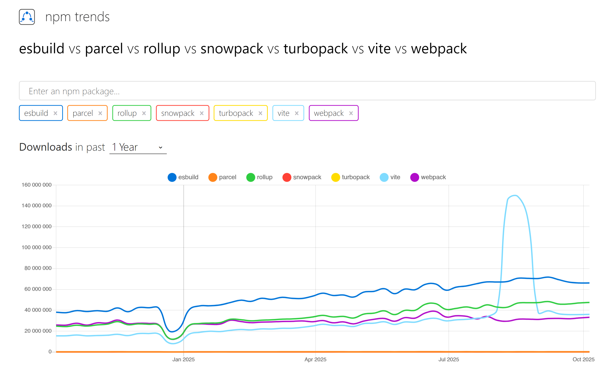

# [Stage#1](../../) Bundlers 🌐

## Module Overview 📚

The "Bundlers" module provides an in-depth exploration of various module bundlers pivotal in modern web development. This comprehensive module covers essential tools like Webpack, Rollup, Parcel, Vite, and esbuild, each offering unique features and optimizations to enhance the web development process.

## Learning Objectives 🎯

Students will:

- Understand the significance of module bundlers in contemporary web development.
- Gain knowledge about different bundlers such as Webpack, Rollup, Parcel, Vite, and esbuild, including their unique capabilities and applications.
- Explore configuration, optimization, and practical usage of these bundlers.
- Evaluate the impact of different bundlers on web application performance and development efficiency.

## Approximate Module Completion Time ⏱️

- **5 hours**

## Theory 📖

Students are encouraged to delve into the following resources:

1. **Fundamentals of Module Bundling:**
   - [How Module Bundlers Work](https://www.freecodecamp.org/news/lets-learn-how-module-bundlers-work-and-then-write-one-ourselves-b2e3fe6c88ae/)
   - [JavaScript Module Bundlers Guide](https://snipcart.com/blog/javascript-module-bundler)

2. **Webpack, Rollup, and Parcel:**
   - [Webpack Concepts](https://webpack.js.org/concepts/)
   - [Getting Started with Rollup](https://rollupjs.org/guide/en/)
   - [Parcel - A Blazing Fast Bundler](https://parceljs.org/getting-started/webapp/)
   - [Webpack JS/FE 2021Q1 [RU]](https://www.youtube.com/watch?v=bozzyi8Tok0)
   - [Tutorials on Webpack 5](https://www.robinwieruch.de/categories/webpack/)

3. **Exploring Vite and esbuild:**
   - [Vite: Next Generation Frontend Tooling](https://vitejs.dev/guide/)
   - [esbuild: An Extremely Fast JavaScript Bundler](https://esbuild.github.io/getting-started/)

## Practice 💻

- Complete the "[St1] Introduction to Bundlers" test in the RS-App > Auto Test.

## Additional Resources 📘

1. [Webpack alternatives: 5 top JavaScript bundlers](https://www.contentful.com/blog/webpack-alternatives-5-top-bundlers/)
2. [5 Webpack Alternatives: Comparing Modern JS Bundlers for Front-End Projects](https://strapi.io/blog/modern-javascript-bundlers-comparison-2025)
3. [10 Best JavaScript Build Tools and Bundlers Compared](https://www.codeinwp.com/blog/best-javascript-build-tools-bundlers/#gref)
