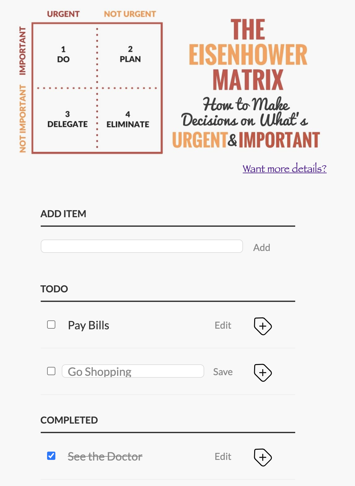

#### [Stage#1](../../) > [Clean Code S1E1](README.md)

# Task "Clean Code S1E1"

<div align="center">
  
</div>

Here is a small single-page [TODO-list application](https://github.com/rolling-scopes-school/clean-code-s1e1).
Your task is to edit and change code – refactor code files, while the functionality of the application must remain the same. Changes must be made according the following guidelines: [html-and-css](materials/html-and-css.md) and [html-and-css-extended](materials/html-and-css-extended.md).

No automatic code formatting tools are expected to be used at this task.

## Implementation Requirements

**Warning!** A reviewer can give 0 points if at least one of the following requirements is not met:

1. Use a personal **public** repository on GitHub to complete the task. Make a fork of the existing project or create a new one named `clean-code-s1e1` and copy the task project files (in this case the commit message for adding the files must start with `"init:"`).
2. One commit must contain changes related to a single point of the guidelines, the commit message must reflect all the changes made in the commit. Intersection of two or more rules in a single commit is acceptable only if compliance of one rule automatically leads to compliance of another one and it is impossible to separate them (all the rules must be listed in a commit message in this case).
3. Prettier or other automatic code formatting tools must not be used.
4. Each commit must be made according to the [commit requirements](https://docs.rs.school/#/git-convention?id=%d0%a2%d1%80%d0%b5%d0%b1%d0%be%d0%b2%d0%b0%d0%bd%d0%b8%d1%8f-%d0%ba-%d0%b8%d0%bc%d0%b5%d0%bd%d0%b0%d0%bc-%d0%ba%d0%be%d0%bc%d0%bc%d0%b8%d1%82%d0%be%d0%b2) and comply consistently with one of the [commit message style](#commit-message-style) options.
5. Create a new branch from `main` and name it `clean-code-s1e1`. All your changes must be made inside this new branch.
6. [The original application functionality](#application-functionality) must remain the same after all your changes or be fixed if necessary.
7. Once the task is completed, create a Pull Request from the branch `clean-code-s1e1` into `main` of your personal **public** repository.

   **Warning!**: if you have forked the project, the default branch to create a PR will be `main` of the task description repository. You MUST change the repository and open a PR into the `main` branch of **YOUR** repository.

8. A Pull Request must be described according to [the following rules](https://docs.rs.school/#/pull-request-review-process?id=%d0%a2%d1%80%d0%b5%d0%b1%d0%be%d0%b2%d0%b0%d0%bd%d0%b8%d1%8f-%d0%ba-pull-request-pr).
9. `main` branch must not be modified.
10. The PR must be open.
11. ❗ Submit your **Pull Request** link once the task is completed.

### Application Functionality:

- Adding a new item to the "TODO" tasks list.
- Editing an item in the "TODO" tasks list.
- Deleting an item from the "TODO" tasks list.
- Marking an item as "COMPLETED" and moving it to the corresponding list via the checkbox.
- Deleting an item from the "COMPLETED" list.
- Editing an item in the "COMPLETED" list.
- Marking an item as incomplete via the checkbox and moving it into the "TODO" tasks list.
- The appearance of the application has not been changed.
- Alternate text is present for all necessary images.
- The delete button animation works.

### Recommendations:

- Carefully rename the attributes, don't miss a single one, including the `.js` files.
- You can deploy the application using `gh-pages` so it will be easier for the students to check your work.

### Commit message style:

You have two commit message styles - choose the one you like more. **Both of them are correct!**

_Commit style №1:_

```
fix(basic-2.2): add Html5 DOCTYPE tag
refactor(extended-2.1): update CSS according to BEM
```

_Commit style №2:_

```
fix: add Html5 DOCTYPE tag according to rule 2.2 in html-and-css.md
refactor: update CSS according to BEM to rule 2.1 in html-and-css-extended.md
```

Commit messages must be written in English.

## Evaluation criteria

**Be lenient, this task requires a lot of work. All disputable issues must be resolved in the higher score way. Stay human!**

**Maximum amount of points for the task +45**

- +2 points for each of 15 list items [beginner guideline](materials/html-and-css.md)\*.
- +5 points for each of 3 list items [advanced guideline](materials/html-and-css-extended.md)\*.

  (\*each rule must be applied throughout the entire project, not just for a piece of code).

- Changes in margins or padding because of HTML tags replacement that insignificantly change the UI must not be considered a mistake, no penalties must be applied. There is also no need to verify the layout of the application with PerfectPixel.

- Please note that the fantasy font used in the application is commonly supported on Windows and Mac. If it doesn't display correctly on Linux, feel free to choose any other suitable font. A different similar font must not be considered a mistake, no penalties must be applied.

## Cross-check

- To review the task you can open the repository locally or on GitHub.
- The cross-check form is built-in on [RS App](https://app.rs.school/) ("Cross-Check: Review"), or you can use a cross-check [checklist](https://rolling-scopes-school.github.io/checklist/) ("Clean code S1E1").
- [Cross-check flow](https://docs.rs.school/#/cross-check-flow).

## Q&A

[A document for questions](https://docs.google.com/spreadsheets/d/1lgzmc72mKCmYvHimvqBNENgKJuXMON8q1f1s4GEnEVI/edit?usp=sharing)

## Hints

- To create the commits you can use [Commitizen](https://github.com/commitizen/cz-cli). Its usage is not required.
- You can use [Husky](https://typicode.github.io/husky/) to verify your commit messages. Its usage is not required.
