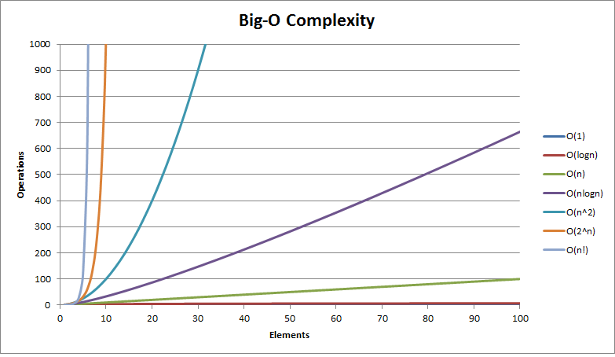
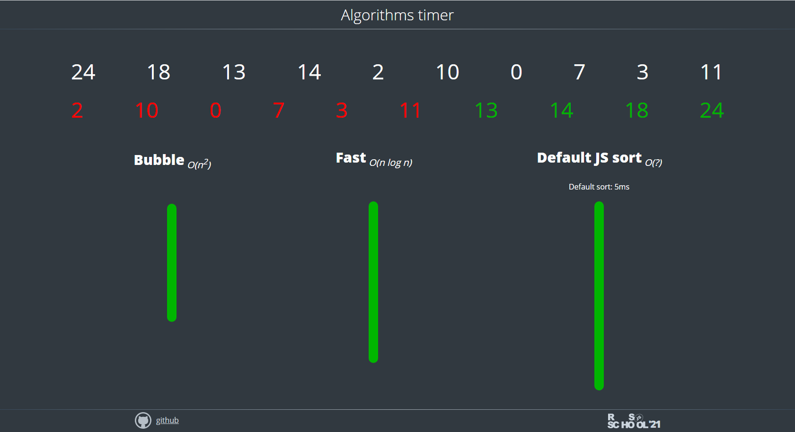

# Algorithms

## Basic Sorting and Searching Algorithms

### Big-О Notation

In programming, Big-O notation indicates the number of steps (processor clock cycles) an algorithm takes to execute. It characterizes the efficiency of a function or a specific algorithm.

Donald Knuth introduced the use of Big-O to assess algorithm complexity.

Read as:

- O(1) – O of one
- O(n) – O of n
- O(n²) - O of n squared
  ...

The faster the execution time of a function increases with the number of elements, the less efficient the algorithm is. Some commonly encountered complexities include:

- О(1)
- O(log n)
- O(n)
- O(n log n)
- O(n²)
- O(n!)

Their efficiencies:



The following demo visually compares the execution speed of some sorting algorithms that differ in their Big-O values _(the image is clickable)_:

[](https://algorithms-timer-demo.netlify.app/)

###### Note

In addition to Big-O notation, there are also other approaches to assessing the time complexity of algorithms.

**Big-Ω (Big-Omega) notation** represents the lower bound of the time complexity of an algorithm. It is used to describe the best-case scenario or the minimum time an algorithm will take to execute.  
For example, if an algorithm has a time complexity of `Ω(f(n))`, it means that the algorithm's running time will not grow slower than a constant multiple of the function `f(n)` as the input size `n` increases.

**Big-Θ (Big-Theta) notation** represents both the upper and lower bounds of the time complexity of an algorithm. It provides a tight, asymptotically precise description of the algorithm's growth rate.  
For example, if an algorithm has a time complexity of `Θ(f(n))`, it means that the running time grows at the same rate as a constant multiple of the function `f(n)` as the input size `n` increases.

In summary, **Big Omega notation** describes the <u>lower bound (best-case)</u> of an algorithm's time complexity, while **Big Theta notation** provides a precise range by capturing <u>both the upper and lower bounds</u>, offering a comprehensive understanding of an algorithm's performance.

**Example: Linear Search**

```js
function linearSearch(arr, target) {
  for (let i = 0; i < arr.length; i++) {
    if (arr[i] === target) {
      return i;
    }
  }
  return -1;
}
```

**Big Omega (Ω) Notation**

Best-case scenario: **Ω(1)**

- The best-case scenario occurs when the target element is found at the very beginning of the array (at index 0).
- In this case, the algorithm would find the target in the first iteration, resulting in a constant time operation.
- The lower bound is Ω(1), indicating that the algorithm can be very efficient in the best-case scenario.

**Big Theta (Θ) Notation**

Average and worst-case scenario: **Θ(n)**

- The average and worst-case scenario occur when the target element is not found in the array or is found at the end of the array.
- In these cases, the algorithm needs to traverse the entire array, checking each element until it finds the target or reaches the end.
- The time complexity is directly proportional to the size of the input array (n).

You can read more about these notations:

- [Big-Ω (Big-Omega) Notation](https://www.khanacademy.org/computing/computer-science/algorithms/asymptotic-notation/a/big-big-omega-notation#:~:text=The%20Big%2DOmega%20notation%20gives,in%20n%20or%20linear%20time.)
- [Big–Θ (Big Theta) Notation](https://www.geeksforgeeks.org/analysis-of-algorithms-big-theta-notation/)

### Bubble Sort

Iterates through a dataset from left to right, comparing values within each pair and moving the smallest to the left. The process repeats until no value can be moved.

The algorithm is simple to implement but inefficient.

#### Complexity (Big-O)

- Best case: **O(n)**
- Average and worst cases: **O(n²)**

#### Implementation

```js
function bubbleSort(arr) {
  const n = arr.length;
  for (let i = 0; i < n - 1; i++) {
    for (let j = 0; j < n - 1 - i; j++) {
      if (arr[j + 1] < arr[j]) {
        let t = arr[j + 1];
        arr[j + 1] = arr[j];
        arr[j] = t;
      }
    }
  }
  return arr;
}
bubbleSort(arr);
```

### Merge sort

Divides the entire dataset into a minimum of two groups. Pairs of values are compared, and the smallest is moved to the left. After sorting within all pairs, the left values of two left pairs are compared, creating a group of four values: two smallest on the left, two largest on the right.  
This process repeats until only one set remains.

One of the fundamental sorting algorithms.

#### Complexity (Big-O)

- Best case: **O(n)**
- Average and worst cases: **O(n log n)**

#### Implementation

```js
function merge(left, right) {
  let sortedArr = [];
  while (left.length && right.length) {
    if (left[0] < right[0]) {
      sortedArr.push(left.shift());
    } else {
      sortedArr.push(right.shift());
    }
  }
  return [...sortedArr, ...left, ...right];
}

function mergeSort(arr) {
  if (arr.length <= 1) return arr;
  let mid = Math.floor(arr.length / 2);
  let left = mergeSort(arr.slice(0, mid));
  let right = mergeSort(arr.slice(mid));
  return merge(left, right);
}

mergeSort([3, 5, 8, 5, 99, 1]); // [1, 3, 5, 5, 8, 99]
```

### Quick Sort

Divides the entire dataset in half by selecting the middle element (also known as `pivot`) and moving all elements smaller than it to the left. The same procedure is iteratively performed on the left part until only two elements remain. The same process is then applied to the right part.  
Data will continuously split until fully sorted.

###### Note

Although the Big-O values here are the same as many other sorting algorithms (and in some cases worse), this algorithm often performs faster in practice, for example, compared to merge sort.

#### Complexity (Big-O)

- Best case: **O(n)**
- Average case: **O(n log n)**
- Worst case: **O(n²)**

#### Implementation

```js
function quickSort(arr) {
  if (arr.length == 0) return [];
  let a = [],
    b = [],
    p = arr[0];

  for (let i = 1; i < arr.length; i++) {
    if (arr[i] < p) a.push(arr[i]);
    else b.push(arr[i]);
  }
  return quickSort(a).concat(p, quickSort(b));
}

quickSort(arr);
```

#### Comparison of Merge Sort and Quick Sort

- Quick sort is often more efficient in practice
- Merge sort **immediately** divides the dataset into the smallest possible groups and then incrementally sorts and merges the groups
- Quick sort **sequentially** divides the dataset by the average value until it is recursively sorted

### Binary Search

#### Implementation

1. Iteration Method

```js
const arr = [-1, 0, 1, 2, 3, 4, 6, 100, 10000];

function binarySearchIterationMethod(arr, i) {
  let left = 0;
  let right = arr.length - 1;
  let mid;

  while (left <= right) {
    mid = Math.floor((right + left) / 2);

    if (arr[mid] === i) {
      return mid;
    } else if (arr[mid] > i) {
      right = mid - 1;
    } else {
      left = mid + 1;
    }
  }

  return -1;
}

binarySearchIterationMethod(arr, 100); // 7
```

2. Recursive Method

```js
function binarySearchRecursiveMethod(arr, i, left = 0, right = arr.length - 1) {
  if (left > right) return -1;
  else {
    let mid = Math.floor((right + left) / 2);
    if (arr[mid] === i) {
      return mid;
    } else if (arr[mid] > i) {
      return binarySearchRecursiveMethod(arr, i, left, mid - 1);
    } else {
      return binarySearchRecursiveMethod(arr, i, mid + 1, right);
    }
  }
}

binarySearchRecursiveMethod(arr, 5); // -1
```

---

#### What to do before the start of the course

- Perform tasks on the [Codewars website](https://www.codewars.com/) and determine the Big-O notation of the algorithms you use.

#### Additional Materials

- [Big O Notation and Time Complexity](https://youtu.be/JgWm6sQwS_I?si=9-3WgSij8pGON3pq)
- [CS50x 2023 Algorithms](https://www.youtube.com/live/4oqjcKenCH8?si=MOf4kjKY0Ra7Lc5t)
- [Sorting Algorithms Visualizations (Playlist)](https://youtube.com/playlist?list=PL2aHrV9pFqNS79ZKnGLw-RG5gH01bcjRZ&si=_HIpEn3bpoRYsMiA)
