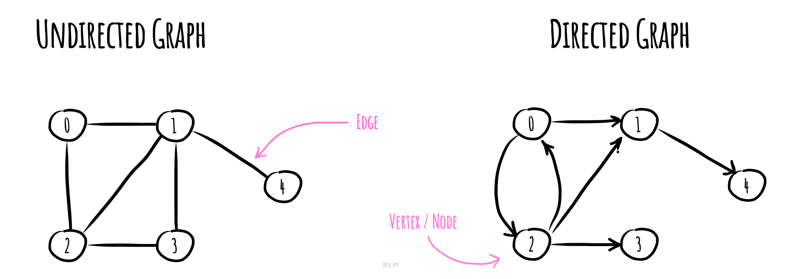

# Data Structures

## Basic Data Structures

- Array
- Linked List
- Stack
- Queue
- Hash Table
- Binary Tree
- Heap
- Graph

### Array

- An ordered set of elements, each accessible by its index (ordinal number in the array)
- Optimal for indexing (retrieving an array element by its number).
- Poor for search, insertion, and deletion unless performed at the very end of the array

#### Complexity (Big-O)

- Indexing: **O(1)**
- Search: **O(n)**
- Binary search: **O(log n)**
- Insertion: **Inadmissible** _(unless performed at the very end of the array)_

###### Note

Learn more about inserting elements in an array [here](https://javascript.info/array#performance)

### Linked List

- Data is stored in nodes, pointing to other nodes. The list looks like nested objects
- Each node has a `value` (the value of that element/node) and `nextNode` (reference to the next element in the linked list).
- Optimal for insertion and deletion (as it only requires shifting the pointer from one element to the next).
- Poor for indexing and searching (difficult to get an element by its number or find an element due to nested structure).

#### Complexity (Big-O)

- Indexing: **O(n)**
- Search: **O(n)**
- Binary search: **O(n)**
- Insertion: **O(1)**

###### Note

In addition to a Linked List, there is also a **Doubly Linked List**: it has, in addition to `nextNode` and `value`, a `previousNode` (value of the node, reference to the next node, and reference to the previous node, respectively).

### Stack

- Usually implemented using a linked list but can be created from an array
- Stacks are **Last-In-First-Out (LIFO)** data structures
- An analogy to a stack is a stack of plates: the last plate added to the stack will be the first one taken
- The head is the only place for inserting and removing elements

#### Complexity (Big-O)

- Indexing: **O(n)**
- Search: **O(n)**
- Binary search: **O(n)**
- Insertion: **O(1)**

### Queue

- Like stacks, queues can be implemented using a linked list or an array
- Queues are **First-In-First-Out (FIFO)** data structures
- An analogy to a queue is a line at a store: the first customer in will be served first
- Elements are removed from the head, and added to the tail

#### Complexity (Big-O)

- Indexing: **O(n)**
- Search: **O(n)**
- Binary search: **O(n)**
- Insertion: **O(1)**

###### Note

In addition to a standard Queue, there exists a specialized data structure known as a **Priority Queue**.

While a regular queue follows a First-In-First-Out (FIFO) principle, a Priority Queue prioritizes elements based on their assigned priorities. This means that the element with the highest priority is served first, distinguishing it from a standard queue where the order of arrival determines service.

### Hash Table

- A hash table is an implementation of an **associative array**, a list of **key-value** pairs that allow you to retrieve a value via a key
- JS object can be considered a form of a hash table, two most common ways to implement hash table in JS are with `Object` and `Map`
- Optimal for search, insertion, and deletion

#### Complexity (Big-O)

- Indexing: **O(1)**
- Search: **O(1)**
- Insertion: **O(1)**

###### Note

Internally a hash table utilizes a **hash function** to transform a key into an index that points to where the value is stored in memory.

A hash function is a method or function that takes an item’s key as an input, assigns a specific index to that key and returns the index whenever the key is looked up. This operation usually returns the same hash for a given key.

Sometimes, a hash function can generate the same index for more than one key. This scenario is referred to as a **hash collision**.

Collisions are a problem because every slot in a hash table is supposed to store a single element.

Hash collisions are usually handled using two common strategies.

1. **Linear probing**
   Linear probing works by skipping over an index that is already filled. It could be achieved by adding an offset value to an already computed index. If that index is also filled, add it again and so on.
   &nbsp;
   _One drawback of using this strategy is that if you don’t pick an offset wisely, you can jump back to where you started and miss out on so many possible positions in the array:_
   &nbsp;
   

2. **Chaining**
   In the chaining strategy, each slot of our hash table holds a pointer to another data structure such as a [linked list](#linked-list) or a [tree](#binary-tree). Every entry at that index will be inserted into the linked list for that index.
   &nbsp;
   As you can see, chaining allows us to hash multiple key-value pairs at the same index in constant time.
   &nbsp;
   _This strategy greatly increases performance, but it is costly in terms of space:_
   &nbsp;
   

### Binary Tree

- A binary tree is a data structure in which each node has a maximum of two child elements: left and right
- The key of the left child node is smaller than that of the parent
- The key of the right child node is larger than that of the parent
- The reason to use trees might be because you want to store information that naturally forms a hierarchy, like the file system on a computer
- Optimal for sorting and searching

#### Complexity (Big-O)

- Indexing: **O(log n)**
- Search: **O(log n)**
- Insertion: **O(log n)**

###### Note

In addition to the binary tree, various types of trees exist:

- Based on the number of children:

  - Ternary Tree
  - N-ary Tree (Generic Tree)

- based on the nodes' values:
  - Binary Search Tree
  - AVL Tree
  - Red-Black Tree
  - Segment Tree

To know more about types of trees, read [this article](https://www.geeksforgeeks.org/types-of-trees-in-data-structures/)

There's also tree-like data structure, called **Trie**.  
It's a tree-like data structure used for efficient storage and retrieval of strings. Each node in the Trie represents a character, and the paths from the root to the nodes form words.  
It's particularly useful for tasks like autocomplete and spell checking.

To learn more about Trie, visit [this link](https://www.geeksforgeeks.org/introduction-to-trie-data-structure-and-algorithm-tutorials/)

### Heap

A Heap is a tree-based data structure which is an almost complete tree that satisfies the **heap property**.

Heap property:

- For a **max heap**: each child node is smaller than its parent node
- For a **min heap**: each child node is greater than its parent node

While heaps have a specific ordering, they <u>do not necessarily have the sorted order that a binary search tree maintains</u>. The ordering in a heap is such that the maximum (or minimum) element can be quickly accessed at the root.

Heaps are commonly used to implement priority queues, allowing efficient retrieval of the highest (or lowest) priority element.  
You encounter heaps when exploring algorithms like **heap sort** or **Dijkstra's shortest path** algorithm.

#### Complexity (Big-O)

For min heap:

- Search: **O(n)**
- Insertion: **O(1)**
- Find-min: **O(1)**
- Delete-min: **O(log n)**

###### Note

The term **heap** is used in two different contexts: one in computer memory, where it refers to a region for dynamic memory allocation, and the other as a data structure, where it refers to a specialized tree-based structure with a specific ordering property.

In terms of memory allocation, in contrast to the stack, which is a region of memory managed by the compiler, the heap is used for memory that needs to be dynamically allocated during runtime.

It is crucial to highlight that <u>the heap as a part of computer memory has nothing to do with the heap data structure</u>.

Find more info about heaps [here](https://onestepcode.com/heap-implementation-javascript/)

### Graph

In Computer Science, a Graph is a non-linear data structure that can be used to represent complex <u>relationships</u> between objects. Graphs are made up of a finite number of nodes (**vertices**) and the edges (**lines** or **arcs**) that connect them.

Graphs can be used to model a wide variety of real-world problems, including social networks, transportation networks, and communication networks. Thus the development of algorithms to handle graphs is of major interest in the field of computer science.

There is a vast variety of types of graphs, here are some of them:

1. **Directed and Undirected Graphs**:
   - **Directed Graph (Digraph)**: Edges have a direction. If there is an edge from vertex A to vertex B, it doesn't imply an edge from B to A.
   - **Undirected Graph**: Edges have no direction. If there is an edge between vertices A and B, it implies an edge between B and A.
2. **Weighted and Unweighted Graphs**:
   - **Weighted Graph**: Edges have associated weights or costs, often representing distances, time, or some other metric.
   - **Unweighted Graph**: Edges have no associated weights; all edges are considered equal.
3. **Cyclic and Acyclic Graphs**:
   - **Cyclic Graph**: Contains at least one cycle, a closed path where the last vertex is the same as the first.
     **Acyclic Graph**: Does not contain any cycles.

To learn more about graphs, visit [this link](https://www.geeksforgeeks.org/graph-data-structure-and-algorithms/)

#### RS School webinars

- [Data Structures with JS (RU)](https://youtu.be/j6w_ZJSYNRU)

#### Additional Materials

- [JavaScript Data Structures (Playlist)](https://youtube.com/playlist?list=PLC3y8-rFHvwg6nsAOfC5Is18KB2DrVOJy&si=5AsAUr8NvY8C3JpZ)
- [CS50x 2023 Data Structures](https://www.youtube.com/live/X8h4dq9Hzq8?si=Z-Pl-anE6_rH9lUS)
