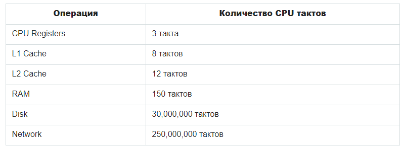

## Операции ввода/вывода

[HOME](../README.md)

### I/O (input/output)

I/O (input/output) означает ввод/вывод

- input - получение информации от сетевых ресурсов, или чтение с диска или файла, или ввод с клавиатуры
- output - вывод информации, например, сохранение на диск или запись в файл, или вывод в консоль

Это самые затратные по времени этапы работы программы. Сравните:


### Блокирующий I/O

Операции input/output происходят синхронно, одна за другой

```js
const connection = db.connect(); // подключаемся к базе данных
const users = connection.query("SELECT * FROM users"); // делаем запрос
console.log(users); // выводим информацию в консоль
```

Это простой в реализации, но очень затратный по времени вариант: программа ждёт **250 миллионов тактов процессора**, пока не произойдёт подключение к базе данных.  
Вторая проблема синхронного I/O - он не отказоустойчив. Если программа не сможет подключиться к базе данных, или если в базе данных не найдётся затребованной информации, программа остановит свою работу.

Синхронный или блокирующий I/O в Node.js используется очень редко:

- если необходимо получить данные, без которых работа программы не может начаться. Например, информацию о настройках
- может использоваться в консольных приложениях, у которых только один пользователь

### Неблокирующий I/O

Неблокирующий I/O происходит асинхронно

```js
db.connect((error, connection) => {
  if (error) throw error;
  connection.query("SELECT * FROM users", (users) => {
    console.log(users);
  });
});
```

В данном примере программа вызывает `db.connect()`, ставит его колбэк в очередь и переходит к выполнению оставшейся синхронной части кода. Когда весь синхронный код выполнен, программа возвращается к выполнению колбэка `db.connect()`.

Первым аргументом колбэка, переданного в `db.connect()`, является ошибка. Если ошибка имеется, то в нашем примере происходит "проброс исключения", в результате которого эта ошибка либо будет обработана в коде выше, либо вывалится в рантайм и "повалит" приложение. Если ошибки нет - `error === null` (в логическом контексте `false`) - функция переходит к работе с базой данных: выполняет `connection.query()` и `console.log()`.

В основе работы Node.js лежат **неблокирующий ввод/вывод** и **асинхронность**. Благодаря этому приложения на Node.js работают быстро и могут обрабатывать большое количество клиентских запросов в единицу времени.
