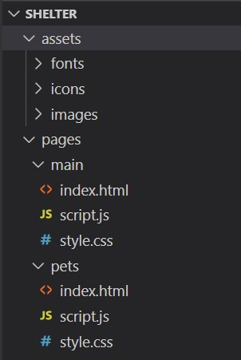

# Shelter

Shelter - это проект, в котором вам предстоит сверстать сайт, состоящий из двух страниц, сделать его адаптивным и интерактивным.

**[Макет Shelter. Figma](https://www.figma.com/file/tKcmzkARtMUFQAR9VLdLkl/shelter-dom)**  

## Этапы выполнения задания

**[Неделя 1](#неделя-1)**: Фиксированная верстка страниц `main` и `pets`.  
- на данном этапе вам предстоит создать фиксированную верстку двух страниц. При фиксированной верстке страницы выглядят одинаково при ширине окна не менее 1280px.  

**[Неделя 2](#неделя-2)**: Добавление адаптивности верстки. 
- на этом этапе вам предстоит адаптировать согласно макету ранее созданные страницы под различную ширину окна до 320px включительно.  

**[Неделя 3](#неделя-3)**: Добавление дополнительного функционала.  
- на этом этапе на ранее сверстанные страницы добавляется дополнительный функционал: слайдер, пагинация, попап.

## Проверка задания

- Задание будет проверяться посредством кросс-чека. **Всего проверки будет 3, на каждом этапе выполнения задания.** [Инструкция по проведению cross-check](https://docs.rs.school/#/cross-check-flow).
  - [Порядок оценки cross-check первого этапа задания (неделя 1)](#порядок-оценки-cross-check-неделя-1).

## Создание собственной копии макета

Первое, что нужно сделать - это создать собственную копию макета в фигме. Для этого:

- авторизуемся в [figma](https://www.figma.com/);
- открываем [макет](https://www.figma.com/file/tKcmzkARtMUFQAR9VLdLkl/shelter-dom);
- на верхней панели инструментов нажимаем на стрелку рядом с названием макета;
- в появившемся меню выбираем пункт *"Duplicate to your drafts"*;
- в главном меню (верхняя левая кнопка) выбираем пункт *"Back to files"*;
- открываем копию макета рядом с которой есть надпись *"In Drafts"*

## Технические требования

Расширение PerfectPixel для Google Chrome можно использовать для того, чтобы сверяться с изображением 
*[Расширение PerfectPixel для Google Chrome](https://chrome.google.com/webstore/detail/perfectpixel-by-welldonec/dkaagdgjmgdmbnecmcefdhjekcoceebi?hl=en)*

Поддержка браузеров: **Google Chrome, Mozilla Firefox**. В первую очередь мы разрабатываем для Google Chrome. Затем проверяем, не «рушит» ли Mozilla Firefox наши стили.

**Запрещается** использование CSS-фреймворков (bootstrap, foundation и т.д.).  
**Запрещается** использование JS-фреймворков (Angular, React, Vue и т.д.).  
**Запрещается** использование устаревших библиотек (jQuery и т.д.).  
**Разрешается** использование актуальных библиотек с набором вспомогательных функций (lodash). Lodash пользоваться можно, как и утилитами для создания слайдера, пагинации, попапов. Однако, рекомендуется пользоваться чистым, или *ванильным* JavaScript.  
**Разрешается** использование иконочных шрифтов, CSS препроцессоров (scss).  
**Рекомендуется** использование [normalize.css](https://necolas.github.io/normalize.css/). 

Обратите внимание на следующие пункты:  
- Основные блоки должны быть точно расположены на заданной ширине экрана так, как в макете Figma.
- Изображения, логотипы (если они есть) должны быть расположены в рамках логического контейнера с правильным подходом по центрированию и расположению. Допускается незначительное отклонение от макета в угоду сеточной или колоночной структуре.
- Иконки, картинки должны сохранять идеальное расстояние до начала соответствующего им текста.
- Иконки, картинки должны сохранять свои пропорции.
- Если использован правильный шрифт, проверьте высоту текста — он должен соответствовать исходнику. Ширина может варьироваться. Но общепринятой практикой является добавление свойства межбуквенного интервала (`letter-spacing`) тексту заголовков, девиза (motto) или цитат.
- Если в строке несколько объектов визуально одинаковой ширины, то ширина содержащих их блоков должна быть одинаковой. Разница размеров изображений не имеет значения, важно совпадение размеров блоков. Если в макете ширина блоков разная, то делать ее все равно нужно одинаковой.
- Некоторые элементы должны быть интерактивными. Макет содержит отдельно спроектированные блоки с описанием того, как выглядит кнопка или элемент с hover-эффектом и без него.

«Интерактивный» означает, что у кнопки или элемента появляется визуальный эффект или анимация (на ваше усмотрение и исходя из макета: анимация курсора, изменение цвета заднего фона, затемнение, нижнее подчеркивание, изменение шрифта) при каких-либо действиях пользователя, например, при наведении курсора. Использовать JavaScript для обработки пользовательских событий в данном задании не обязательно. Обычно, такой эффект реализуют при помощи псевдокласса `:hover` и следующих свойств:
- `cursor: pointer`,
- `background`,
- `text-decoration: underline`,
- `color`.  

## Требования к репозиторию

- Задание выполняется в приватном репозитории школы [Как работать с приватным репозиторием](https://docs.rs.school/#/private-repository?id=Как-работать-с-приватным-репозиторием)
- В приватном репозитории школы создайте ветку с названием `shelter`, в ней создайте папку с названием `shelter`, и в ней разместите файлы проекта. Файлы и папки внутри `shelter` можно именовать на свое усмотрение, а можно воспользоваться примером ниже. Т.к. проект будет содержать несколько страниц (2), то внутри на уровне с `assets` будет располагаться папка `pages`. Внутри `pages`, в папке `main` (папка по имени страницы), будут храниться файлы `.html`, `.css` и `.js`, относящиеся к данной странице. В папке `assets` по-прежнему будут храниться изображения, иконки и файлы шрифтов, если есть. Как называть папки внутри `assets` в зависимости от содержимого: `images`, `icons`, `fonts`. Пример ниже:
- 
- Для деплоя используйте gh-pages [Как сделать деплой задания из приватного репозитория школы](https://docs.rs.school/#/private-repository?id=Как-сделать-деплой-задания-из-приватного-репозитория-школы)
- История коммитов должна отображать процесс разработки приложения. Названия коммитов должны соответствовать [требованиям к коммитам](https://docs.rs.school/#/git-convention)

## Полезные ссылки

Шрифты можно найти здесь:

[Arial, google fonts](https://www.fonts.com/font/monotype/arial?QueryFontType=Web&src=GoogleWebFonts)  
[Georgia, google fonts](https://www.fonts.com/font/microsoft-corporation/georgia?QueryFontType=Web&src=GoogleWebFonts)  

Можно подключать как скачиванием локальных шрифтов, так и подключением шрифтов через url на google fonts. Если вы не можете найти или скачать нужный шрифт, просто замените его шрифтом с тем же типом засечек.

## Неделя 1

Исходная ширина предоставленного макета 1280px. Ширина обертки (wrapper), или т.н. направляющих колонок - 1200px. Размеры внутренних блоков рекомендуется задавать в относительных величинах (%, vw), чтобы не переписывать CSS стили для резиновой верстки.  

При ширине окна выше 1280px верстка должна оставаться по центру, а не растягиваться на всю ширину окна. Для заполнения свободного пространства можно либо растягивать фоны соответствующих блоков на всю ширину окна, либо использовать любой из цветов, присутствующих в [макете](https://www.figma.com/file/tKcmzkARtMUFQAR9VLdLkl/shelter-dom):  


#### Десктоп версия Main (60 баллов)

JPG: **[shelter. main-1280. JPG](shelter-main-1280px.jpg)**  

1. **Header** (`<header>` содержит только логотип и панель навигации)
- Интерактивная панель навигации:
  - по умолчанию должен быть подсвечен элемент `About the shelter`;
  - подсвеченный элемент `About the shelter` может не иметь hover-эффектов.
- Нажатие на `Our pets` перебрасывает нас на страницу *our pets*.
- Нажатие на `Help the shelter` перебрасывает нас на блок *Help*, расположенный на этой же странице (якорная ссылка).
- Нажатие на `Contacts` перебрасывает нас на блок *Footer*, расположенный на этой же странице (якорная ссылка).
- Логотип находится слева. Логотип состоит из текстовых элементов (т.е. не картинка). Нажатие на логотип оставляет нас на текущей странице.
- На странице обязательно должен присутствовать один элемент `<h1>`. Можно сделать его с текстом `Cozy House`.
- Хедер "липким" делать не нужно. Т.е. при скролле он остается на своей позиции.

2. Блок **Not only**
- Кнопка `Make a Friend` должна быть интерактивной.
- Нажатие на `Make a Friend` перебрасывает нас на блок *Our Friends*, расположенный на этой же странице (якорная ссылка).
- Фон блоков можно сделать градиентом.
- Картинка собаки и текст - разные блоки, которые не должны накладываться.

3. Блок **About**
- Внимательно посмотрите, какого вида здесь кавычки.
  
4. Блок **Our Friends**
- Кнопки "влево" и "вправо" должны быть интерактивными.
- Карточки с питомцами должны быть интерактивными при наведении на любую область карточки. Наведение на карточку меняет курсор, делает подсветку кнопки `Learn more` и меняет фон.
- Кнопки `Learn more` должны быть интерактивными.
- Кнопка `Get to know the rest` должна быть интерактивной.
- Нажатие на `Get to know the rest` перебрасывает нас на страницу *our pets*.
  
5. Блок **Help**
- Для позиционирования элементов блока используется сеточная верстка (flexbox или grid).
- Расположение элементов: обязательно 5 сверху, 4 снизу. 
  
6. Блок **In addition**
- Интерактивный блок с номером банковского счета. Номер должен быть ссылкой, которая никуда не ведет.

7. **Footer** (`<footer>` содержит контакты, адрес и изображение):
- При нажатии на email или его иконку должен открываться почтовый сервис. 
- При нажатии на телефон или его иконку должен открываться набор номера.
- При нажатии на локацию должна открываться страница с google maps в отдельном окне с любой локацией на ваш выбор.
- Изображение собаки, адрес и контакты - разные блоки, которые не должны накладываться друг на друга.
- Фон блока можно сделать градиентом.

#### Десктоп версия Our Pets (40 баллов)

JPG: **[shelter. Pets page. JPG](shelter-pets-1280px.jpg)**  

1. **Header** (`<header>` содержит только логотип и панель навигации)
- Интерактивная панель навигации:
  - по умолчанию должен быть подсвечен элемент `Our pets`;
  - подсвеченный элемент `Our pets` может не иметь hover-эффектов.
- Нажатие на `About the shelter` перебрасывает нас на страницу *main*.
- Нажатие на `Help the shelter` перебрасывает нас на блок *Help*, расположенный на странице *main* (якорная ссылка).
- Нажатие на `Contacts` перебрасывает нас на блок *Footer*, расположенный на этой же странице (якорная ссылка).
- Логотип находится слева. Логотип состоит из текстовых элементов (т.е. не картинка). Нажатие на логотип перебрасывает нас на страницу *main*.
- На странице обязательно должен присутствовать один элемент `<h1>`. Можно сделать его с текстом `Cozy House`.
- Хедер должен быть "липким". Т.е. при скролле он всегда показан на странице сверху, сохраняя свою позицию.

2. Блок **Our Friends**
- Четырехколоночный макет.
- Карточки с питомцами должны быть интерактивными при наведении на любую область карточки. Наведение на карточку меняет курсор, делает подсветку кнопки `Learn more` и меняет фон.
- Делать открытие модального окна при нажатии на данном этапе не нужно. 
- Пагинация должна быть интерактивной на доступных кнопках. Это значит, что с позиции (1) мы не можем уйти левее, т.е. в меньшую сторону. У серых кнопок должен присутствовать атрибут `disabled`, `data-disabled` или класс-модификатор.
  
3. **Footer** (`<footer>` содержит контакты, адрес и изображение):
- При нажатии на email или его иконку должен открываться почтовый сервис. 
- При нажатии на телефон или его иконку должен открываться набор номера.
- При нажатии на локацию должна открыться страница с google maps в отдельном окне с любой локацией на ваш выбор.
- Картинка собаки и текст - разные блоки, которые не должны накладываться друг на друга.
- Фон блока можно сделать градиентом.

## Порядок оценки cross-check неделя 1

Открываем на ширине экрана 1280px. Если экран меньше, можно сделать масштабирование, а можно поставить на странице ширину 1280px и смотреть со включенной горизонтальной полосой прокрутки. Если экран шире, можно поставить область уже или сузить окно.

Работа проверяется исключительно по критериям, указанным ниже. Если вы увидели в работе какой-то недочет или ошибку, которые не подпадают под критерии - баллы не снижаются. Но вы можете написать о найденной ошибке в комментариях к выставляемой оценке.

Если в ходе проверки, вы не знаете, снимать или не снимать балл, то не снимайте. Например, если в блоке **You can also make a donation** внутри кнопки вписаны неправильные, другие цифры, то это не будет считаться ошибкой, баллы не снижаем.

❗ Балл не может опуститься ниже **0** за страницу. Если не указано в требованиях отдельно, то для всех неповторяющихся блоков или элементов в состоянии покоя (без `hover`) справедливо:
- Отступы от границ элементов (или наборов элементов) до краев блока, по горизонтали или вертикали, отличаются более чем на 20px: **-1** за каждый блок.
- Отступы внутри набора или сетки между элементами, по горизонтали или вертикали, отличаются более чем на 10px: **-1** за каждый блок.
- Цвет фона блока или элемента отличается от дизайна (не касается положения градиента или растянутого изображения): **-1** за каждый блок.
- Отсутствует элемент или картинка, как фоновая, так и картинка элемента: **-1** за каждый блок.
- Шрифт или семейство шрифтов не подключено, или разница в размере шрифта более чем 4px: **-1** за каждый блок.

Создана страница *main* **+60**.

1. Нет блока **Header**: **-10**.
- Нет логотипа: **-2**.
- Нет панели навигации: **-5**. Панель навигации есть, но не интерактивная: **-1**. Рекомендуется использовать `<nav>`.
- Элемент `About the shelter` не подсвечен: **-1**.
- Элемент `Our pets` не работает как ссылка на страницу *our pets*: **-1**.
- Элемент `Help the shelter` не работает как якорная ссылка на блок *Help*: **-1**.
- Элемент `Contacts` не работает как якорная ссылка на блок *Footer*: **-1**.
- На странице нет элемента `<h1>`: **-2**. Элемент есть, но в количестве больше одного: **-1**.
- Фон сильно отличается от того, что на макете (не имеется ввиду смещенная картинка или градиент): **-1**.
  
2. Нет блока **Not only**: **-5**.
- Нет кнопки `Make a Friend`: **-2**. Кнопка есть, но не интерактивная, или не работает как якорная ссылка на блок *Our Friends*: **-1**.
- Фон сильно отличается от того, что на макете (не имеется ввиду смещенная картинка или градиент): **-1**.
- Нет картинки собаки: **-2**. Картинка собаки есть, но сильно смещена, или накладывается на текст или другие блоки: **-1**.
  
3. Нет блока **About**: **-5**.
- Нет картинки кошки и собаки: **-2**. Картинка есть, но сильно смещена, или накладывается на текст или другие блоки: **-1**.
- Текст заголовка имеет неверные размеры: **-2**.
- Кавычки имеют неправильный вид: **-1**.
  
4. Нет блока **Our Friends**: **-20**.
- Нет кнопки "влево": **-2**. Кнопка есть, но не интерактивная: **-1**.
- Нет кнопки "вправо": **-2**. Кнопка есть, но не интерактивная: **-1**.
- Нет карточек с питомцами: **-10**. Карточки есть, но при этом:
  - Сеточная структура элементов нарушена: **-2**.
  - Количество карточек не соотвествует макету: **-2**.
  - Струтура карточек нарушена (например текст или кнопка сверху над картинкой): **-2**.
  - Карточки не интерактивные: **-2**.
  - Кнопки `Learn more` не меняют цвет при наведении на карточку: **-2**.
- Нет кнопки `Get to know the rest`: **-2**. Кнопка есть, но не интерактивная, или не работает как ссылка на страницу *our pets*: **-1**.
  
5. Нет блока **Help**: **-5**.
- Сеточная структура элементов нарушена (не 5 элементов сверху, 4 снизу): **-2**.
- Изображение одной или более иконок отсутствуют: **-2**.
- Нарушена структура (например текст сверху, иконка снизу) в одном или более элементе: **-1**.
  
6. Нет блока **In addition**: **-5**.
- Нет блока со ссылкой на банковский счет: **-2**. Блок есть есть, но он не интерактивный, или не является ссылкой: **-1**.
- Нет картинки собаки: **-2**. Картинка собаки есть, но сильно смещена, или накладывается на текст или другие блоки: **-1**.
  
7. Нет блока **Footer**: **-10**.
- Сеточная структура элементов нарушена: **-2**.
- Элемент `email` не работает как ссылка на почтовый сервис: **-2**.
- Элемент `телефон` не работает как ссылка на сервис звонков: **-2**.
- Хотя бы один элемент `локация` не работает как ссылка на google maps: **-1**.
- Нет картинки собаки: **-2**. Картинка собаки есть, но сильно смещена, или накладывается на текст или другие блоки: **-1**.
- Фон сильно отличается от того, что на макете (не имеется ввиду смещенная картинка или градиент): **-1**.

Создана страница *our pets* **+40**.

1. Нет блока **Header**: **-10**.
- Нет логотипа: **-2**. Логотип есть, но не работает как ссылка на страницу *main*: **-1**.
- Нет панели навигации: **-5**. Панель навигации есть, но не интерактивная: **-1**. Рекомендуется использовать `<nav>`.
- Элемент `About the shelter` не работает как ссылка на страницу *main*: **-1**.
- Элемент `Our pets` не подсвечен: **-1**.
- Элемент `Help the shelter` не работает как якорная ссылка на блок *Help* страницы *main*: **-1**.
- Элемент `Contacts` не работает как якорная ссылка на блок *Footer*: **-1**.
- На странице нет элемента `<h1>`: **-2**. Элемент есть, но в количестве больше одного: **-1**.
- Фон сильно отличается от того, что на макете: **-1**.
  
2. Нет блока **Our Friends**: **-20**.
- Нет кнопок пагинации: **-10**. Кнопка есть, но:
  - Кнопки одного цвета или фона: **-2**.
  - Кнопки расположены в неверной последовательности: **-2**. 
  - Кнопки "влево" интерактивные: **-1**.
  - Кнопки "вправо" не интерактивные: **-1**.
  - На кружочке страницы нет цифры, или там не единица: **-1**.
  - Кружочек страницы интерактивный: **-1**.
- Нет карточек с питомцами: **-10**. Карточки есть, но при этом:
  - Сеточная структура элементов нарушена: **-2**.
  - Количество карточек не соотвествует макету: **-2**.
  - Струтура карточек нарушена (например текст или кнопка сверху над картинкой): **-2**.
  - Карточки не интерактивные: **-2**.
  - Кнопки `Learn more` не меняют цвет при наведении на карточку: **-2**.
  
3. Нет блока **Footer**: **-10**.
- Сеточная структура элементов нарушена: **-2**.
- Элемент `email` не работает как ссылка на почтовый сервис: **-2**.
- Элемент `телефон` не работает как ссылка на сервис звонков: **-2**.
- Хотя бы один элемент `локация` не работает как ссылка на google maps: **-1**.
- Нет картинки собаки: **-2**. Картинка собаки есть, но сильно смещена, или накладывается на текст или другие блоки: **-1**.
- Фон сильно отличается от того, что на макете (не имеется ввиду смещенная картинка или градиент): **-1**.


## Неделя 2

**🚧 Условия могут быть дополнены**  

Задание будет оцениваться путем изменения размеров окна браузера Google Chrome, или подключением эмуляции устройств. Сделать это можно в панели разработчика, выбрав значение ширины экрана. Выводить проект на реальные мобильные устройства или планшеты **не обязательно**.  

❗ Если, например, при проверке выставлена ширина браузера в 768px, присутствует скролл справа, а картинка не соотвествует разметке макета Tablet-768, то надо сделать эмуляцию в режиме responsive, и выставить ширину в 768. Картинка снизу.  
  

  
**«responsive»** - это размеры, заданные в относительных величинах от ширины окна или родительского блока, которые плавно меняют свои значения при уменьшении или увеличении окна браузера. Главное, чтобы при наложении картинки, например, в 768px на макет шириной 768px, размеры или отступы совпадали.  

❗ Страница не должна разваливаться, что значит, что отступы, размеры блоков, и прочее, не должны уходить за правый край экрана и не должен появляться горизонтальный скролл, до порогового значения (меньше 320px).

## 1280px <= width

Выполняются требования верстки [первой части](#неделя-1) проекта: либо блоки продолжают свой цвет на всю доступную область окна, а сама обертка (1200px) центрируется (при этом градиент также может менять ширину), либо макет занимает максимальную ширину в 1280px и центрируется с равными отступами справа и слева, белого или любого другого цвета из макета (при проверке, если трудно будет смотреть целостность на большом экране, в панели разработчика можно задать элементу body свойство background-color любого контрастного цвета).  

## 768px <= width < 1280px

### Main Page

1. **Header** (`<header>` содержит только логотип и панель навигации)
- Логотип прибивается ближе к верху страницы.
- Отступы слева от логотипа и справа от меню навигации должны быть заданы жестко, как на макете `768px`.
- Хедер "липким" делать не нужно. Т.е. при скролле он остается на своей позиции.
  
2. Блок **Not only**
- Заголовок с текстом "Not only people need a house" должен быть расположен как указано на макете. Т.е. перенос строк должен быть соотвествующим макету. Для этого можно сделать дополнительную обертку которую и центрировать относительно основных блоков. Только отступы могут быть `responsive`, но отступ слева должен совпадать с отступом последующего блока текста.
- Блок с текстом "We offer to give..." должен быть центрирован с равными оступами по краям. Блок с тектом и отступы могут быть `responsive`.
- Кнопка "Make a Friend" должна быть центрирована и иметь жесткие размеры, как на макете `768px`.
- Картинка собаки может быть `responsive`, но смещение должно оставаться в правую сторону пропорциональным, т.е. отступы до правого края могут быть так же `responsive`.
  
3. Блок **About**
- Заголовок с текстом "About the shelter..." должен быть расположен как указано на макете. Т.е. перенос строк должен быть соотвествующим макету. Для этого можно сделать дополнительную обертку которую и центрировать относительно основных блоков. Только отступы могут быть `responsive`, но отступ слева должен совпадать с отступом последующего блока текста.
- Блоки с текстом "Currently..." и "We feed our..." должны быть центрированы с равными оступами по краям. Блок с тектом и отступы могут быть `responsive`.
- Картинка кошки и собаки и отустпы могут быть `responsive`. Главное, чтобы картинка была центрирована.
  
4. Блок **Our Friends**
- Заглавный текст должен быть центрирован. Блок с тектом и отступы могут быть `responsive`.
- Вместо трех блоков с питомцами, теперь должно быть два. Блоки с питомцами имеют жесткие размеры, как на макете `assets`. При этом отступы между блоками, стрелками слайдера или краями экрана могут быть `responsive`.
- Кнопка "Get to know the rest" должна быть центрирована и иметь жесткие размеры, как на макете `768px`.
  
5. Блок **Help**
- Заглавный текст должен быть центрирован. Блок с тектом и отступы могут быть `responsive`.
- Элементы расположены сеткой, 3 х 3. Либо сетка увеличивается пропорционально размерам экркана, либо отступы между элементами и краями экрана можно сделать `responsive`. Структура сетки меняться не должна.
  
6. Блок **In addition**
- Блок с текстом "You can..." должен быть расположен как указано на макете. Т.е. перенос строк должен быть соотвествующим макету. Для этого можно сделать дополнительную обертку которую и центрировать относительно основных блоков. Только отступы могут быть `responsive`, но отступ слева должен совпадать с отступом последующего блока текста.
- Блок с текстом "Name of the bank..." должен быть расположен как указано на макете. Для этого можно сделать дополнительную обертку которую и центрировать относительно основных блоков. Только отступы могут быть `responsive`, но отступ слева должен совпадать с отступом последующей кнопкой.
- Кнопка с номером счета в банке должна быть расположена как указано на макете, и иметь жесткие размеры, как на макете `768px`. Для этого можно сделать дополнительную обертку которую и центрировать относительно основных блоков. Только отступы могут быть `responsive`, но отступ слева должен совпадать с отступом последующего блока текста.
- Блок с текстом "Legal information..." должен быть центрирован с равными оступами по краям. Блок с тектом и отступы могут быть `responsive`.
- Картинка собаки и отустпы могут быть `responsive`. Главное, чтобы картинка была центрирована.
  
7. **Footer** (`<footer>` содержит текст, логотип и панель навигации):
- Тут идет сетка из двух колонок. Обратите внимание, что сам блок с сеткой, должен быть центрирован. Т.е. расстояние слева до первой колонки совпадает с расстонием справа до второй колонки. При этом сами колонки и отступы могут быть `responsive`.
- Картинка собаки и отустпы могут быть `responsive`. Главное, чтобы картинка была центрирована.
  
### Pets Page

1. **Header** (`<header>` содержит только логотип и панель навигации)
- Логотип прибивается ближе к верху страницы.
- Отступы слева от логотипа и справа от меню навигации должны быть заданы жестко, как на макете `768px`.
- Хедер должен быть "липким". Т.е. при скролле он всегда показан на странице сверху, сохраняя свою позицию.
  
2. Блок **Our Friends**
- Заглавный текст должен быть центрирован. Блок с тектом и отступы могут быть `responsive`.
- Сетка становится 2 х 3. Блоки с питомцами имеют жесткие размеры, как на макете `assets`. При этом отступы между блоками, стрелками слайдера или краями экрана могут быть `responsive`.
- Блок с кнопками должен быть центрирован. Размеры кнопок и расстония между ними заданы жестко, как на `assets`, или как на макете `768px`. Отступы до краев экрана могут быть `responsive`.
  
3. **Footer** (`<footer>` содержит текст, логотип и панель навигации):
- Тут идет сетка из двух колонок. Обратите внимание, что сам блок с сеткой, должен быть центрирован. Т.е. расстояние слева до первой колонки совпадает с расстонием справа до второй колонки. При этом сами колонки и отступы могут быть `responsive`.
- Картинка собаки и отустпы могут быть `responsive`. Главное, чтобы картинка была центрирована.
  
## 320px <= width < 768px

### Main Page

1. **Header** (`<header>` содержит только логотип и панель навигации)
- Меню навигации преобразовывается в так называемое бургер меню, которое будет открываться по нажатию и предлагать привычную нам панель навигации.
- Отступ слева от логотипа может быть `responsive`. Отступ справа от меню навигации должны быть задан жестко, как на макете `320px`.
- Хедер "липким" делать не нужно. Т.е. при скролле он остается на своей позиции.
  
2. Блок **Not only**
- Заголовок с текстом "Not only people need a house" должен быть центрирован с равными оступами по краям. Блок с тектом и отступы могут быть `responsive`.
- Блок с текстом "We offer to give..." должен быть центрирован с равными оступами по краям. Блок с тектом и отступы могут быть `responsive`.
- Кнопка "Make a Friend" должна быть центрирована и иметь жесткие размеры, как на макете `320px`.
- Картинка собаки может быть `responsive`, но смещение должно оставаться в правую сторону пропорциональным, т.е. отступы до правого края могут быть так же `responsive`.
  
3. Блок **About**
- Заголовок с текстом "About the shelter..." должен быть центрирован с равными оступами по краям. Блок с тектом и отступы могут быть `responsive`.
- Блоки с текстом "Currently..." и "We feed our..." должны быть центрированы с равными оступами по краям. Блок с тектом и отступы могут быть `responsive`.
- Картинка кошки и собаки и отустпы могут быть `responsive`. Главное, чтобы картинка была центрирована.
  
4. Блок **Our Friends**
- Заглавный текст должен быть центрирован. Блок с тектом и отступы могут быть `responsive`.
- Вместо двух блоков с питомцами, теперь должен быть один. Блок с питомцами имеет жесткие размеры, как на макете `assets`. При этом отступы между стрелками слайдера или краями экрана могут быть `responsive`.
- Кнопка "Get to know the rest" должна быть центрирована и иметь жесткие размеры, как на макете `320px`.
  
5. Блок **Help**
- Заглавный текст должен быть центрирован. Блок с тектом и отступы могут быть `responsive`.
- Элементы расположены сеткой, 2 х 5. Либо сетка увеличивается пропорционально размерам экркана, либо отступы между элементами и краями экрана можно сделать `responsive`. Структура сетки меняться не должна. Последний, девятый элемент сетки должен находиться в сетке слева.
  
6. Блок **In addition**
- Блок с текстом "You can..." должен быть центрирован. Блок с тектом и отступы могут быть `responsive`.
- Блок с текстом "Name of the bank..." должен быть центрирован. Блок с тектом и отступы могут быть `responsive`.
- Кнопка с номером счета в банке должна быть центрирована. Сама кнопка, как и отступы до краев экрана, могут быть `responsive`.
- Блок с текстом "Legal information..." должен быть центрирован с равными оступами по краям. Блок с тектом и отступы могут быть `responsive`.
- Картинка собаки и отустпы могут быть `responsive`. Главное, чтобы картинка была центрирована.
  
7. **Footer** (`<footer>` содержит текст, логотип и панель навигации):
- Одна единственная колонка. Оступы всех элементов до краев экрана должны совпадать. Сама колонка должны быть центрирована. При этом, как сама колонка, так и отступы до краев экрана могут быть `responsive`.
- Картинка собаки и отустпы могут быть `responsive`. Главное, чтобы картинка была центрирована.
  
### Pets Page

1. **Header** (`<header>` содержит только логотип и панель навигации)
- Меню навигации преобразовывается в так называемое бургер меню, которое будет открываться по нажатию и предлагать привычную нам панель навигации.
- Отступ слева от логотипа может быть `responsive`. Отступ справа от меню навигации должны быть задан жестко, как на макете `320px`.
- Хедер должен быть "липким". Т.е. при скролле он всегда показан на странице сверху, сохраняя свою позицию.
  
2. Блок **Our Friends**
- Заглавный текст должен быть центрирован. Блок с тектом и отступы могут быть `responsive`.
- Сетка становится 1 х 3. Блоки с питомцами имеют жесткие размеры, как на макете `assets`. При этом отступы между блоками, стрелками слайдера или краями экрана могут быть `responsive`.
- Блок с кнопками должен быть центрирован. Размеры кнопок и расстония между ними заданы жестко, как на `assets`, или как на макете `320px`. Отступы до краев экрана могут быть `responsive`.
  
3. **Footer** (`<footer>` содержит текст, логотип и панель навигации):
- Одна единственная колонка. Оступы всех элементов до краев экрана должны совпадать. Сама колонка должны быть центрирована. При этом, как сама колонка, так и отступы до краев экрана могут быть `responsive`.
- Картинка собаки и отустпы могут быть `responsive`. Главное, чтобы картинка была центрирована.
  
## width < 320px

Минимальная ширина макета = 320px. После порогового значения расположение верстки значения не имеет. Структура верстки остается такой же, как при ширине 320px. Если в какой-то момент при уменьшении ширины экрана верстка "ломается", это не ошибка.

## Неделя 3 

**🚧 Условия могут быть дополнены**  
  
Каждый из питомцев будет представлять из себя объект с набором данных, например:

```javascript
const pet = {
  name: 'Jennifer',
  img: '../../assets/images/jennifer.png',
  type: 'Dog',
  breed: 'Labrador',
  description: 'Jennifer is a sweet 2 months old Labrador that is patiently waiting to find a new forever home. This girl really enjoys being able to go outside to run and play, but won\'t hesitate to play up a storm in the house if she has all of her favorite toys.',
  age: '2 months',
  inoculations: ['none'],
  diseases: ['none'],
  parasites: ['none'],
}
```

❗ Каждый DOM-объект (блок) с описанием питомца, будь то слайдер, пагинация или попап, будет генерироваться из данных объекта. В объекте могут быть поля, которые вы придумаете и назовете сами, выше приведен лишь пример.
  
**[Данные всех 8 питомцев в формате `JSON`!](https://github.com/rolling-scopes-school/tasks/blob/master/tasks/markups/level-2/shelter/pets.json)**


### Main Page

1. **Header**
- В меню будут работать первые 2 элемента: `About the shelter` и `Our pets`. Остальные 2 пункта меню, хоть и будут присутствовать на странице, но будут неактивными, для чего можно использовать js.
- При нажатии на "Our pets" будет переход на страницу `Pets Page`.
- При нажатии на "About the shelter" страница окажется в начальном положении, т.е. с нулевым отступом сверху.
- При нажатии на логотип перехода не будет, так как мы уже находимся на основной странице.

#### Burger menu
- Бургер меню будет на странице только при width < 768px.
- При нажатии на бургер меню, с правой стороны будет выезжать блок шириной 320px, в котором будут вертикально расположенные и центрированные элементы меню. Должна присутствовать анимация выезда (slide-in).
- В элементах действуют те же правила активности и неактивности, как и в меню на большей ширине экрана.
- Область, выступающая за 320px должна быть затемнена. Свойство затемнения описано в дизайне макета Figma.
- При открытии меню, сама иконка меню поворачивается на 90 градусов. Должна присутствовать анимация поворота (rotate).
- При нажатии вне границ меню, на затемненную область, или на кнопку с иконкой бургер меню, меню должно заехать обратно. Должна присутствовать анимация заезда (slide-out).
- При закрытии меню, сама иконка меню поворачивается обратно на 90 градусов. Должна присутствовать анимация поворота (rotate).
- При нажатии на "About the shelter" страница окажется в начальном положении и меню будет закрыто.
  
2. Блок **Not only**
- При нажатии на кнопку "Make a Friend" будет переход на страницу `Pets Page`.
  
3. Блок **Our Friends**
- При нажатии на кнопку "Get to know the rest" будет переход на страницу `Pets Page`.

#### Slider
- Слайдер должен быть реализован со стрелакми, при нажатии на которые случается переход на новый блок элементов.
- Слайдер бесконечный, не имеет границ, т.е. можно нажимать влево и вправо сколько угодно раз, и каждый раз контент в блоках будет новый. В нашем случае, каждый новый слайд будет содержать **псевдослучайный** набор питомцев, т.е. формироваться из исходных объектов в случайном порядке, с двумя условиями. Во-первых, в самом блоке слайда карточки с птомцами повторяться не будут. Во-вторых, в следующем блоке, дублирующихся карточек с карточками текущего блока, не будет. Например в сладйдере из 3 элементов, следующий выезжающий слайд будет содержать 3 новых карточки питомца, таких, каких не было среди 3х карточек на предыдущем уехавшем слайде.
- При 1280px <= width в блоке слайда 3 питомца.
- При 768px <= width < 1280px в блоке слайда 2 питомца.
- При width < 768px в блоке слайда 1 питомец.

#### Popup
- Попап - это отдельный элемент, который всплывает поверх страницы при нажатии на любое место элемента (блока) с описанием конкретного питомца, и центрируется. Остальная часть страницы затемняется. Цвет тени, форма попапа, кнопка его закрытия определены в дизайне макета Figma.
- В слайдере активные элементы выделаяются более светлым цветом заднего фона, и реагируют на `hover`.
- При нажатии на окно (блок) попапа ничего не происходит.
- При нажатии вне границ попапа, на затемненную область, или на кнопку с крестиком, попап и затемнение должны исчезнуть.
- При наведении мышкой на затемненную область или кнопку с крестиком, т.е. при событии `hover`, кнопка должна получить эффект наведения. Другими словами: кнопка интеректавная. При этом при наведении на окно (блок) самого попапа ничего не происходит.
- При 768px <= width в дизайне попапа есть картинка питомца.
- При width < 768px в дизайне попапа картинки питомца нет.
  
  
### Pets Page

- В меню будут работать первые 2 элемента: `About the shelter` и `Our pets`. Остальные 2 пункта меню, хоть и будут присутствовать на странице, но будут неактивными, для чего можно использовать js.
- При нажатии на "About the shelter" будет переход на страницу `Main Page`.
- При нажатии на "Our Pets" страница окажется в начальном положении, т.е. с нулевым отступом сверху.
- При нажатии на логотип будет переход на страницу `Main Page`.

#### Burger menu
- Бургер меню будет на странице только при width < 768px.
- При нажатии на бургер меню, с правой стороны будет выезжать блок шириной 320px, в котором будут вертикально расположенные и центрированные элементы меню. Должна присутствовать анимация выезда (slide-in).
- В элементах действуют те же правила активности и неактивности, как и в меню на большей ширине экрана.
- Область, выступающая за 320px должна быть затемнена. Свойство затемнения описано в дизайне макета Figma.
- При открытии меню, сама иконка меню поворачивается на 90 градусов. Должна присутствовать анимация поворота (rotate).
- При нажатии вне границ меню, на затемненную область, или на кнопку с иконкой бургер меню, меню должно заехать обратно. Должна присутствовать анимация заезда (slide-out).
- При закрытии меню, сама иконка меню поворачивается обратно на 90 градусов. Должна присутствовать анимация поворота (rotate).
- При нажатии на "Our Pets" страница окажется в начальном положении и меню будет закрыто.
  
2. Блок **Our Friends**

#### Popup
- Попап - это отдельный элемент, который всплывает поверх страницы при нажатии на любое место элемента (блока) с описанием конкретного питомца, и центрируется. Остальная часть страницы затемняется. Цвет тени, форма попапа, кнопка его закрытия определены в дизайне макета Figma.
- В слайдере активные элементы выделаяются более светлым цветом заднего фона, и реагируют на `hover`.
- При нажатии на окно (блок) попапа ничего не происходит.
- При нажатии вне границ попапа, на затемненную область, или на кнопку с крестиком, попап и затемнение должны исчезнуть.
- При наведении мышкой на затемненную область или кнопку с крестиком, т.е. при событии `hover`, кнопка должна получить эффект наведения. Другими словами: кнопка интеректавная. При этом при наведении на окно (блок) самого попапа ничего не происходит.
- При 768px <= width в дизайне попапа есть картинка питомца.
- При width < 768px в дизайне попапа картинки питомца нет.

#### Pagination
- Пагинация представляет из себя переключение страниц (таблиц или слайдов), путем перерисовки одних данных на другие, эффекты при этом могут быть разные: slide, fade. При этом всегда есть первая сраница и последняя.
- Самое важное: *при неизменных размерах области пагинации, возвращаясь на страницу под определнным номером, контент на ней всегда будет одинаков*.
- При загрузке `Our Pets` должен быть сформирован массив из 48 элементов псевдо-случайным образом. Каждый из 8 приведенных на макете питомцев должен встречаться ровно 6 раз. При этом каждые 8, каждые 6, и каждые 3, питомца не должны повторяться. Т.е. на одной странице пагинации не может быть одноврменно два одинаковых питомца.
- При загрузке `Our Pets` всегда должна быть активной первая страница.
- Кнопка `<<` всегда открывает первую страницу
- Кнопка `<` открывает предыдущую до текущей страницы
- Кнопка `>` открывает следующую после текущей страницы
- Кнопка `>>` всегда открывает последнюю страницу
- В кружке по центру указан номер текущей страницы
- Если открыта первая страница, кнопки `<<` и `<` - неактивны.
- Если открыта последняя страница, кнопки `>` и `>>` - неактивны.  
- При 1280px <= width на странице одновременно показаны 8 питомцев, а самих страниц 6. Т.е. при нажатии `>>` открывается шестая страница.
- При 768px <= width < 1280px на странице одновременно показаны 6 питомцев, а самих страниц 8. Т.е. при нажатии `>>` открывается восьмая страница.
- При width < 768px на странице одновременно показаны 3 питомца, а самих страниц 16. Т.е. при нажатии `>>` открывается шестнадцатая страница.
