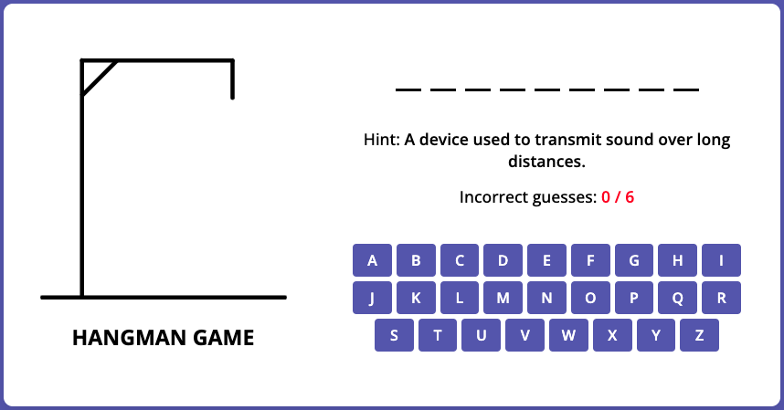

# Hangman

## Task
### Project's Description

[Hangman](https://en.wikipedia.org/wiki/Hangman_(game)) is a classic word game in which you must find the correct answer by guessing guessing letters one at a time.

### Game rules
1. The game is represented by two main parts: the gallows part and the quiz part.
2. At the beginning of the game, the gallows is empty.
3. The quiz part includes:
- a question,
- a secret word (the answer to the question) represented by the blank lines for each letter in the word *(for example, if the secret word is 'address' it will be written like '_ _ _ _ _ _ _')*,
- an incorrect guesses counter,
- a virtual keyboard,
4. The user should be able to use **both virtual** *(by clicking letter buttons)* and **physical keyboards** *(by pressing letter keys)* for playing the game.
5. When the user starts guessing the letters:
- whenever the letter is guessed correctly, this letter appears instead of the corresponding blank line *(for the example mentioned above, if the user clicks or press on the 'd' letter, both 'd's should appear on the screen: '_ d d _ _ _ _')*;
- if the letter is not in the word, **one body part** should be added to the gallows and the incorrect guesses counter should be updated accordingly;
- the clicked/pressed letter should be disabled and it should be reflected in the UI *(for example, by using a different color on the disabled button)*;
6. The body parts appear on the gallows in the following order: head, body, left arm, right arm, left leg, right leg. It means that the user has *6 attempts* to guess the word.
7. The player will continue guessing letters until either the word is solved or all six body parts are on the gallows.
8. At the end of the game, a modal window should appear. It should:
- include the message that either congratulates or informs the user that the game has been lost;
- the secret word (independently whether it was guessed correctly or not);
- a "play again" button.
9. When the user clicks on "play again", the game should start over:
- the gallows should be empty;
- the question should be changed;
- the blank lines should be updated according to the new secret word.
- an incorrect guesses counter should be set to 0.

### Approximate appearance
*This example is purely illustrative. Feel free to change the layout as you wish.*

### Helpful materials
At the [following link](https://www.figma.com/file/ug2NAUiXPpaFDvch5TWUxd/Hangman-game?type=design&node-id=0%3A1&mode=design&t=4Gj7Ayo0yckppNo8-1) you will find:
- examples of the game flow,
- body parts (for those who don't want to design them by themselves).

### Main functional requirements
- The design should be adaptive (or responsive), that includes desktop(1440px <= width), tablet(768px <= width < 1440px) and mobile(360px <= width < 768px). When switching between versions everything should be displayed correctly, all functionality should be present, nothing should disappear or leave beyond the screen.
- Initially, body in the index.html file must be empty, all necessary elements are generated using JS.
- At the beginning of the game, the question-answer pair should be chosen randomly.
- The application can be done in English or in Russian language.

## Repository requirements
- The task should be done in private school's repository.
- The code should be committed to a separate branch named as the task.
- The `main` (or old style master) branch should be empty (contain only files like README.md or .gitignore).
- Commit messages should follow the [guideline](https://docs.rs.school/#/git-convention)
- Once the work is finished, create a pull request from a **development** branch to **main** (or master).
- The pull request name should contain **the task name**.
- The pull request description should be provided according to the [template](https://docs.rs.school/#/pull-request-review-process?id=Требования-к-pull-request-pr).

## Technical requirements
- The application is displayed correctly and functions properly in the latest version of Google Chrome.
- It is **not allowed** to use:
    - CSS frameworks (e.g., `Bootstrap`),
    - JS frameworks (e.g., `Angular`, `React`, `Vue`, etc.),
    - Outdated libraries (e.g. `JQuery`, etc.),
    - `TypeScript`.
- You can use CSS preprocessors (`SASS`, `SCSS`) and `normalize.css`.
- Using JS frameworks (e.g., Angular, React, Vue, etc.) is not allowed.

## CrossCheck Criteria (150 points)
*It is recommended to print the secret word in the browser's console to facilitate the cross-check process.*
- [ ] Responsive/adaptive UI from 1440px to 360px viewport: `+10`
- [ ] The generation of DOM elements is implemented. `body` in the `index.html` is empty (can contain only `script` tag): `+20`
- [ ] The game starts with the correct default view (empty gallows, blank lines for secret word, etc.) and a random question: `+5`
- [ ] The user can play the game by using the virtual keyboard: `+20`
- [ ] The user can play the game by using the physical keyboard: `+20`
- [ ] When the letter is correct, it appears instead of the corresponding blank line. If the letter repeats in the word, all corresponding blank lines should be replaced by it: `+15`
- [ ] When the letter is incorrect:
    - [ ] the incorrect guesses counter is updated: `+5`
    - [ ] a body part is added to the gallows: `+10`
- [ ] The clicked/pressed letter is disabled: `+5`
- [ ] The body parts appear on the gallows in the logical order (head, body, left arm, right arm, left leg, right leg): `+5`
- [ ] When the user runs out of 6 attempts or wins the game, the modal window appears: `+10`
- [ ] The modal window includes the message about the game's outcome (winning or losing), the secret word and the 'play again' button: `+10`
- [ ] When the user clicks the 'play again' button, the game starts over by showing a new question and resetting the gallows, the incorrect guesses counter and the blank lines for the secret word: `+15`

## Useful links:
- [DOM](http://learn.javascript.info/document)
- [Event](http://learn.javascript.info/event-details)
- [An Introduction To DOM Events](https://www.smashingmagazine.com/2013/11/an-introduction-to-dom-events/)
- [Keyboard events](https://learn.javascript.info/keyboard-events)