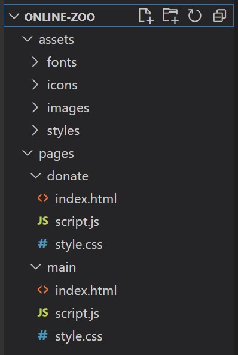

# Online-zoo

Online-zoo - это платформа, где собрана информация о животных из различных зоопарков, имеющих веб-камеры. Предполагается, что пользователь может открыть страницу с ресурсами зоопарка, понаблюдать за кем-либо из животных или сделать пожертвование, на которое будет закуплен корм. В рамках задания, нам предстоит сделать адаптивную верстку и интерактивность главной страницы, и страницы с донатами.

**[PetStory-online](https://www.figma.com/file/ypzT9idgAILaSRVRmDAJxn/online-zoo-3-weeks)**  
Текст ссылки: https://www.figma.com/file/ypzT9idgAILaSRVRmDAJxn/online-zoo-3-weeks

## Этапы выполнения задания

**[Неделя 1](#неделя-1)**: Фиксированная верстка страниц `desktop_petstory` и `desktop_donate`.

- на данном этапе вам предстоит создать фиксированную верстку двух страниц. При фиксированной верстке страницы выглядят одинаково при ширине окна в 1600px. Именно на такой ширине и проводим проверку.

**[Неделя 2](#неделя-2)**: Добавление адаптивности верстки.

- на этом этапе вам предстоит адаптировать согласно макету ранее созданные страницы под различную ширину окна от максимальной до 320px включительно. При этом нужно будет адаптировать и декоративные элементы.

**[Неделя 3](#неделя-3)**: Добавление дополнительного функционала.

- на этом этапе на ранее сверстанные страницы добавляется дополнительный функционал: меню, слайдер, пагинация, попап.

## Проверка задания

- Задание будет проверяться посредством кросс-чека. **Всего проверки будет 3, на каждом этапе выполнения задания.** [Инструкция по проведению cross-check](https://docs.rs.school/#/cross-check-flow).
  - [Порядок оценки cross-check неделя 1](#порядок-оценки-cross-check-неделя-1).
  - [Порядок оценки cross-check неделя 2](#порядок-оценки-cross-check-неделя-2)
  - [Порядок оценки cross-check неделя 3](#порядок-оценки-cross-check-неделя-3)

## Создание собственной копии макета

Первое, что нужно сделать - это создать собственную копию макета в фигме. Для этого:

- авторизуемся в [figma](https://www.figma.com/);
- открываем [макет](https://www.figma.com/file/ypzT9idgAILaSRVRmDAJxn/online-zoo-3-weeks);
- на верхней панели инструментов нажимаем на стрелку рядом с названием макета;
- в появившемся меню выбираем пункт _"Duplicate to your drafts"_;
- в главном меню (верхняя левая кнопка) выбираем пункт _"Back to files"_;
- открываем копию макета рядом с которой есть надпись _"In Drafts"_

## Технические требования

Расширение PerfectPixel для Google Chrome можно использовать для того, чтобы сверяться с изображением
_[Расширение PerfectPixel для Google Chrome](https://chrome.google.com/webstore/detail/perfectpixel-by-welldonec/dkaagdgjmgdmbnecmcefdhjekcoceebi?hl=en)_

Поддержка браузеров: **Google Chrome, Mozilla Firefox**. В первую очередь мы разрабатываем для Google Chrome. Затем проверяем, не «рушит» ли Mozilla Firefox наши стили.

**Запрещается** использование CSS-фреймворков (bootstrap, foundation и т.д.).  
**Запрещается** использование JS-фреймворков (Angular, React, Vue и т.д.).  
**Запрещается** использование устаревших библиотек (jQuery и т.д.).

**Разрешается** использование актуальных библиотек с набором вспомогательных функций (lodash). Lodash пользоваться можно, как и утилитами для создания слайдера, пагинации, попапов. Однако, рекомендуется пользоваться чистым, или _ванильным_ JavaScript.  
**Разрешается** использование иконочных шрифтов, CSS препроцессоров (scss).  
**Рекомендуется** использование [normalize.css](https://necolas.github.io/normalize.css/).

Обратите внимание на следующие пункты:

- Основные блоки должны быть точно расположены на заданной ширине экрана так, как в макете Figma.
- Изображения, логотипы (если они есть) должны быть расположены в рамках логического контейнера с правильным подходом по центрированию и расположению. Допускается незначительное отклонение от макета в угоду сеточной или колоночной структуре.
- Иконки, картинки должны сохранять идеальное расстояние до начала соответствующего им текста.
- Иконки, картинки должны сохранять свои пропорции.
- Если использован правильный шрифт, проверьте высоту текста — он должен соответствовать исходнику. Ширина может варьироваться. Но общепринятой практикой является добавление свойства межбуквенного интервала (`letter-spacing`) тексту заголовков, девиза (motto) или цитат.
- Если в строке несколько объектов визуально одинаковой ширины, то ширина содержащих их блоков должна быть одинаковой. Разница размеров изображений не имеет значения, важно совпадение размеров блоков. Если в макете ширина блоков разная, то делать ее все равно нужно одинаковой.
- Некоторые элементы должны быть интерактивными. Макет содержит отдельно спроектированные блоки с описанием того, как выглядит кнопка или элемент с hover-эффектом и без него.

«Интерактивный» означает, что у кнопки или элемента появляется визуальный эффект или анимация (на ваше усмотрение и исходя из макета: анимация курсора, изменение цвета заднего фона, затемнение, нижнее подчеркивание, изменение шрифта) при каких-либо действиях пользователя, например, при наведении курсора. Использовать JavaScript для обработки пользовательских событий в данном задании не обязательно. Обычно, такой эффект реализуют при помощи псевдокласса `:hover` и следующих свойств:

- `cursor: pointer`,
- `background`,
- `text-decoration: underline`,
- `color`.

## Требования к репозиторию

- Задание выполняется в приватном репозитории школы [Как работать с приватным репозиторием](https://docs.rs.school/#/private-repository?id=Как-работать-с-приватным-репозиторием)
- В приватном репозитории школы создайте ветку с названием `online-zoo`, в ней создайте папку с названием `online-zoo`, и в ней разместите файлы проекта. Файлы и папки внутри `online-zoo` можно именовать на свое усмотрение, а можно воспользоваться примером ниже. Т.к. проект будет содержать несколько страниц (2), то внутри на уровне с `assets` будет располагаться папка `pages`. Внутри `pages`, в папке `main` (папка по имени страницы), будут храниться файлы `.html`, `.css` и `.js`, относящиеся к данной странице. В папке `assets` по-прежнему будут храниться изображения, иконки и файлы шрифтов, если есть. Как называть папки внутри `assets` в зависимости от содержимого: `images`, `icons`, `fonts`. Пример ниже:
- 
- Для деплоя используйте gh-pages [Как сделать деплой задания из приватного репозитория школы](https://docs.rs.school/#/private-repository?id=Как-сделать-деплой-задания-из-приватного-репозитория-школы)
- История коммитов должна отображать процесс разработки приложения. Названия коммитов должны соответствовать [требованиям к коммитам](https://docs.rs.school/#/git-convention)

### Дополнительные требования к репозиторию для выполнения второй и третьей части задания

- задание может выполняться как в той же ветке `online-zoo`, так и в новой ветке.
- если задание выполняется в новой ветке:
  - от ветки `online-zoo` создается новая ветка, например online-zoo-part2`;
  - в новой ветке выполняется работа по заданию;
  - при завершении выполнения в ветку `online-zoo` из ветки `online-zoo-part2` делается **Pull Request** с последующим мержем. Название и содержимое этого PR значения не имеет;
- создается новый деплой вашей работы в ветке `gh-pages` из ветки `online-zoo`. [Как сделать деплой задания из приватного репозитория школы](https://docs.rs.school/#/private-repository?id=Как-сделать-деплой-задания-из-приватного-репозитория-школы);
- актуализируется открытый **Pull Request** в ветку `main` из ветки `online-zoo`. Мерж этого PR не производится.

## Полезные ссылки

## Неделя 1

Выполняется создание всех страниц для ширины экрана **1600px**.

### Технические требования

Максимальный балл: **100**

#### Общие

Все фоновые элементы макета должны растягиваться на всю доступную ширину экрана, если ширина больше 1600px. При этом направляющие должны сохраняться в исходном размере, 1160px. Особенностью этого проекта являются:

- нестандартные размеры,
- дополнительные визуальные элементы.

Для создания вертикальных отступов лучше использовать вертикальные margin на блоках высшего порядка, насколько это возможно. При этом иметь ввиду, что вертикальные margin могут схлопнуться.

Для создания многоколоночных структур, или элементов имеющих относительное горизонтальное расположение, должно быть использовано одно из свойств:

- display: flex
- display: grid
- display: inline-block

❗ Соблюдение отступов между элементами важнее, чем размеры этих элементов. Часто можно увидеть некрасивые значения (вроде 369px х 548px), но это лишь значит, что размеры рассчитывались с учетом расстояния между направляющими и отступов между элементами.

#### Landing (70 баллов)

1. **Header** (`<header>` содержит только логотип, панель навигации)

- Логотип находится слева. Нажатие на логотип работает по принципу нажатия на `About`, перебрасывает нас на текущую страницу, на _petstory (Landing)_.
- Интерактивная панель навигации. Нажатия на элементы меню, для которых страниц не существует, могут ничего не делать.
- Должен быть подсвечен элемент `About`. И он должен перестать быть интерактивным.
- Нажатие на `Donate`перебрасывает нас на страницу _donate_.
- Нажатие на `Designed by ©` перебрасывает нас на оригинальную страницу [Figma](https://www.figma.com/file/jfEFwkXVj1WRq7sUHDr8os/PetStory-online).
- На странице обязательно должен присутствовать один элемент `<h1>`. В нем должен быть текст `PetStory Online`.
- Хедер "липким" делать не нужно. Т.е. при скролле он остается на своей позиции.

2. Блок **Watch your favorite animal online**

- Задний фон является картинкой.
- Кнопка `Watch online` должна быть интерактивной. При нажатии может ничего не происходить.

3. Блок **The Backstage**

- Картинка и текст - двухколоночный макет.

4. Блок **Pets**

- Кнопки влево и вправо должны быть интерактивными. При нажатии может ничего не происходить.
- Карточки животных должны быть интерактивными.
- ❗ При наведении курсора должна быть анимация выезда текста снизу картинки, где будет информация о названии животного и локации с затемненным задним фоном. Сама картинка, но не карточка, должна [увеличиваться на 10px в каждом направлении относительно центра](https://thoughtbot.com/blog/transitions-and-transforms).
- Кнопка `Choose your favorite` должна быть интерактивной. При нажатии может ничего не происходить.

5. Блок **Pick and feed a friend**

- Текст `Emergency support Fund` должна быть ссылкой. Нажатие перебрасывает нас на _donate_.
- Кнопка `Feed a friend now` должна быть интерактивной. Нажатие перебрасывает нас на _donate_.

6. Блок **Testimonials**

- Полоска прогресса должна быть интерактивной. Начинаем в крайней левой позиции. При нажатии может ничего не происходить.
- Кнопка `Leave feedback` должна быть интерактивной. При нажатии может ничего не происходить.

7. **Footer** (`<footer>` содержит меню, логотипы, кнопки доната и соц. сетей):

- Нажатие на логотип работает по принципу нажатия на About, перебрасывает нас на верх текущей страницы, на _petstory (Landing)_.
- Кнопка `Donate for volunteers` должна быть интерактивной. Нажатие перебрасывает нас на _donate_.
- Интерактивная панель соцсетей. Нажатия на соцсети (иконка + текст) могут вести просто на заглавные страницы соответствующих ресурсов.
- Email - поле `input` с типом `email`.
- Кнопка `submit` должна быть в положении _mistake_. Если поле `email` проходит валидацию, то переходит в состояние _default_.
- Интерактивная панель навигации. Нажатия на элементы меню, для которых страниц не существует, могут ничего не делать.
- Должен быть подсвечен элемент `About`. И он должен перестать быть интерактивным.
- ❗ Если нет возможности подобрать необходимую толщину текста, используйте близкие значения [насыщенности](https://developer.mozilla.org/ru/docs/Web/CSS/font-weight), +-100.

#### Donate (30 баллов)

1. **Header** (`<header>` содержит только логотип, панель навигации)

- Логотип находится слева. Нажатие на логотип работает по принципу нажатия на `About`, перебрасывает нас на текущую страницу, на _petstory (Landing)_.
- Интерактивная панель навигации. Нажатия на элементы меню, для которых страниц не существует, могут ничего не делать.
- Нажатие на `About` перебрасывает нас на _petstory (Landing)_.
- Нажатие на `Donate` может ничего не делать. Либо может переводить на страницу _donate_.
- Нажатие на `Designed by ©` перебрасывает нас на оригинальную страницу [Figma](https://www.figma.com/file/jfEFwkXVj1WRq7sUHDr8os/PetStory-online).
- На странице обязательно должен присутствовать один элемент `<h1>`. В нем должен быть текст `PetStory Online`.
- Хедер "липким" делать не нужно. Т.е. при скролле он остается на своей позиции.

2. Блок **Pick and feed a friend**

- Зона в радиусе 20px от желтой точки должна быть интерактивной. При нажатии может ничего не происходить.
- Another amount - поле `input` типа `number` со [cкрытыми стрелками](https://www.w3schools.com/howto/howto_css_hide_arrow_number.asp). Знак $ должен всегда присутствовать внутри поля. Должно стоять ограничение в 4 символа.
- `Monthly` и `Once` - взаимоисключающие поля `input` типа `radio`.
- ❗ Поле `Once` должно быть активировано по умолчанию. Т.е. при открытии страницы, или перезагрузке.
- Кнопка `Feed a friend now` должна быть интерактивной. При нажатии может ничего не происходить.

3. **Footer** (`<footer>` содержит меню, логотипы, кнопки доната и соц. сетей):

- Нажатие на логотип работает по принципу нажатия на About, перебрасывает нас на верх текущей страницы, на _petstory (Landing)_.
- Кнопка `Donate for volunteers` должна быть интерактивной. Нажатие может ничего не делать. Либо может переводить на страницу _donate_.
- Интерактивная панель соцсетей. Нажатия на соцсети (иконка + текст) могут вести просто на заглавные страницы соответствующих ресурсов.
- Email - поле `input` с типом `email`.
- Кнопка `submit` должна быть в положении _mistake_. Если поле `email` проходит валидацию, то переходит в состояние _default_.
- Интерактивная панель навигации. Нажатия на элементы меню, для которых страниц не существует, могут ничего не делать.
- Нажатие на `About` перебрасывает нас на _petstory (Landing)_.
- ❗ Если нет возможности подобрать необходимую толщину текста, используйте близкие значения [насыщенности](https://developer.mozilla.org/ru/docs/Web/CSS/font-weight), +-100.

## Порядок оценки cross-check неделя 1

Открываем на ширине экрана 1600px. Если экран меньше, можно сделать масштабирование, а можно поставить на странице ширину 1600px и смотреть со включенной горизонтальной плосой прокрутки. Если экран шире, можно поставить область уже или сузить окно.

❗ Балл не может опуститься ниже **0** за страницу. Также, штрафных баллов не может быть больше, чем за отсуствие блока (Например, если есть блок `header`, а штрафных баллов набралось больше, чем 20, то снимаем 20). Если не указано в требованиях отдельно, то для всех неповторяющихся блоков или элементов в состоянии покоя (без `hover`) справедливо:

- Отступы от границ элементов (или наборов элементов) до краев блока, по горизонтали или вертикали, отличаются более чем на 20px: **-5** единожды за каждый блок.
- Отступы внутри набора или сетки между элементами, по горизонтали или вертикали, отличаются более чем на 10px: **-5** единожды за каждый блок.
- Отсутствует элемент или картинка, как фоновая, так и картинка элемента: **-5** единожды за каждый блок. Если картинка или элемент присутствует на странице, имеет правильные размеры и отступы, но нарушен дизайн: **-2** единожды за каждый блок.
- Цвет фона блока или элемента сильно отличается от дизайна (Отличие по одному из каналов rgb более чем на 34. Например, #bbb и #ddd - не ошибка, больше - ошибка): **-2** единожды за каждый блок.
- Шрифт или семейство шрифтов не подключено, или разница в размере шрифта более чем 4px: **-2** единожды за каждый блок.

Создана страница _Landing_: **+70**. Иначе, если страница не существует, ставим **0**, и переходим к следующей странице.

1. Нет блока **Header**: **-20**.

- Нет логотипа: **-5**. Логотип есть, но он не работает как ссылка на _petstory (Landing)_: **-2**.
- Нет панели навигации: **-10**. Панель навигации есть, но не интерактивная: **-5**.
- Нет элемента `About`, или он не подсвечен: **-2**.
- Нет элемента `Map`, или он не интерактивный: **-2**.
- Нет элемента `Zoos`, или он не интерактивный: **-2**.
- Нет элемента `Donate`, или он не интерактивный, или не работает как ссылка на _donate_: **-2**.
- Нет элемента `Contact Us`, или он не интерактивный: **-2**.
- Нет элемента `Designed by ©`, или он не интерактивный, или он не работает как ссылка на оригинальную страницу _Figma_: **-2**.
- Нет элемента `<h1>`: **-5**. Элемент есть, но в количестве больше одного: **-2**.
- Рекомендуется хедер "липким" не делать. Если он "липкий", то баллы не снижаем.

2. Нет блока **Watch your favorite animal online**: **-10**.

- Нет кнопки `Watch online`: **-5**. Кнопка есть, но не интерактивная: **-2**.
- ❗Если кнопка `watch online` имеет текст "wath online" - ошибкой не считаем, баллы не снимаем.
- Нет фоновой картинки: **-5**.

3. Нет блока **The Backstage**: **-10**.

- Нет картинки растения справа: **-5**.

4. Нет блока **Pets**: **-30**.

- Нет кнопки вправо: **-5**. Нет кнопки влево: **-5**. Кнопки есть, но они не интерактивные: **-2**.
- Нет карточки животного: **-5** за каждую. Карточка есть, но не интерактивная, или нет анимации текста на затемненном фоне (фон может быть градиентом): **-2** за каждую. Ниже будут указаны примеры анимаций, которые засчитываем как верные:
- - Затемняется картинка (накладывается полупрозрачный фон, или сама картинка становится полупрозрачной) и всплывает скрытая надпись (светлая или темная значения не имеет, главное чтобы на фоне картинки читалась). Надпись может быть как сверху картинки, так и в центре, или даже на незначительном расстоянии снизу.
- - Затемняется картинка и текст под картинкой всплывает наверх, при этом исходное состояние текста может как сохраняться, так и отсутствовать.
- - Текст описания выезжает вместе с фоном.
- - Поверх картинки без затемнения всплывает текст из-под картинки наверх, и затемняется сам блок с текстом (при этом цвет текста может стать белым, например).
- Рекомендуется использовать анимацию с увеличением на 10px в каждом направлении. Если величина увеличения другая, или увеличения нет, баллы не снижаем.
- Скорость анимации значения не имеет, но важно, чтобы было не нулевое значение времени анимации. При любой скорости баллы не снижаем.
- Нет кнопки `Choose your favorite`: **-5**. Кнопка есть, но не интерактивная, или не работает как ссылка на `Map`: **-2**.
- Нет картинки растения слева: **-5**. Нет картинки растения справа: **-5**.

5. Нет блока **Pick and feed a friend**: **-10**.

- Нет кнопки `Feed a friend now`: **-5**. Кнопка есть, но не интерактивная: **-2**.
- Текст `Emergency support Fund` не является ссылкой, или не работает как ссылка на _donate_: **-2**.
- Рекомендуется делать стрелки одного размера. Если стрелки разных размеров, баллы не снижаем.

6. Нет блока **Testimonials**: **-10**.

- Нет кнопки `Leave feedback`: **-5**. Кнопка есть, но не интерактивная: **-2**.
- Нет полоски прогресса: **-5**. Нарушен дизайн полоски: **-2**.
- Рекомендуется полоску прогресса делать через `input type range`, и стилизовать соотвествующе. Если элемент выполнен не через `input type range`, то баллы не снимаем.
- Нет картинки растения справа: **-5**.

7. Нет блока **Footer**: **-20**.

- Нет логотипа: **-5**. Логотип есть, но он не работает как ссылка на _petstory (Landing)_: **-2**.
- Нет кнопки `Donate for volunteers`: **-5**. Кнопка есть, но не интерактивная, или не работает как ссылка на _donate_: **-2**.
- Нет хотя бы одной иконки соцсетей: **-5** за весь набор элементов.
- Все иконки соцсетей есть, но хотя бы одна не интерактивная: **-2** за весь набор элементов.
- Нет поля `<input>` "Input your email" : **-5**. Поле есть, но не указан тип `email`: **-2**.
- Рекомендуется пометить `<input>` атрибутом required. За его отсуствие баллы не снимаем.
- Рекомендуется все поле обернуть в элемент `<form>`. За его отсуствие баллы не снимаем.
- Нет кнопки `Submit`: **-5**. Кнопка есть, но не интерактивная: **-2**.
- Рекомендуется для кнопки `Submit` использование стиля _default_, пока поле ввода не будет сфокусировано. Если кнопка по умолчанию стиля _active_ или _mistake_, баллы не снимаем.
- Нет элемента `About`, или он не подсвечен: **-2**.
- Нет элемента `Map`, или он не интерактивный: **-2**.
- Нет элемента `Zoos`, или он не интерактивный: **-2**.
- Нет элемента `Contact Us`, или он не интерактивный: **-2**.

Создана страница _donate_: **+30**. Иначе, если страница не существует, ставим **0**.

1. Нет блока **Header**: **-20**.

- Нет логотипа: **-5**. Логотип есть, но он не работает как ссылка на _petstory (Landing)_: **-2**.
- Нет панели навигации: **-10**. Панель навигации есть, но не интерактивная: **-5**.
- Нет элемента `About`, или он не работает как ссылка на _petstory (Landing)_: **-2**.
- Нет элемента `Map`, или он не интерактивный: **-2**.
- Нет элемента `Zoos`, или он не интерактивный: **-2**.
- Нет элемента `Donate`, или он не подсвечен: **-2**.
- Нет элемента `Contact Us`, или он не интерактивный: **-2**.
- Нет элемента `Designed by ©`, или он не интерактивный, или он не работает как ссылка на оригинальную страницу _Figma_: **-2**.
- Нет элемента `<h1>`: **-5**. Элемент есть, но в количестве больше одного: **-2**.
- Рекомендуется хедер "липким" не делать.

2. Нет блока **Pick and feed a friend**: **-30**.

- Зона в радиусе 20px хотя бы от одной желтой точки не интерактивная: **-5** за весь блок.
- Нет поля `<input>` "Another amount" : **-5**. Поле есть, но не указан тип `number`: **-2**.
- Нет поля `<input>` "Monthly" : **-5**. Поле есть, но не указан тип `radio`: **-2**.
- Нет поля `<input>` "Once" : **-5**. Поле есть, но не указан тип `radio`, или оно не выбрано как значение по умолчанию: **-2**.
- Есть поля "Monthly" и "Once", но они не взаимоисключающие: **-5**.
- Нет кнопки `Feed a friend now`: **-5**. Кнопка есть, но она не интерактивная: **-2**.

3. Нет блока **Footer**: **-20**.

- Нет логотипа: **-5**. Логотип есть, но он не работает как ссылка на _petstory (Landing)_: **-2**.
- Нет кнопки `Donate for volunteers`: **-5**. Кнопка есть, но не интерактивная, или не работает как ссылка на _donate_: **-2**.
- Нет хотя бы одной иконки соцсетей: **-5** за весь набор элементов.
- Все иконки соцсетей есть, но хотя бы одна не интерактивная: **-2** за весь набор элементов.
- Нет поля `<input>` "Input your email" : **-5**. Поле есть, но не указан тип `email`: **-2**.
- Рекомендуется пометить `<input>` атрибутом required. За его отсуствие баллы не снимаем.
- Рекомендуется все поле обернуть в элемент `<form>`. За его отсуствие баллы не снимаем.
- Нет кнопки `Submit`: **-5**. Кнопка есть, но не интерактивная: **-2**.
- Рекомендуется для кнопки `Submit` использование стиля _default_, пока поле ввода не будет сфокусировано. Если кнопка по умолчанию стиля _active_ или _mistake_, баллы не снимаем.
- Нет элемента `About`, или он не работает как ссылка на _petstory (Landing)_: **-2**.
- Нет элемента `Map`, или он не интерактивный: **-2**.
- Нет элемента `Zoos`, или он не интерактивный: **-2**.
- Нет элемента `Contact Us`, или он не интерактивный: **-2**.

## Неделя 2

Сверстанные страницы адаптируются под следующую ширину экрана устройства:

- 1600px (уже будет готово)
- 1000px
- 640px
- 320px

### Технические требования

Максимальный балл: **100**

#### Общие

Точки перехода могут быть произвольными. Оценивать, насколько правильно и удобно они подобраны, мы не будем. Ниже будут периведены рекомендации для тех, кто еще не выполнял задание:

1. (max-width: 1600px) или (max-width: 1599px) - Переход между состояниями фиксированной колонки и отзывчивой.

-- Опционально (max-width: 1599px) или (max-width: 1440px) или (max-width: 1280px) или (max-width: 1220px)  
2. (max-width: 1000px) - Изменение расположения кнопок врпаво/влево в блоке `Pets`. Обратите внимание, что карточки могут быть другие при изменеии ширины экрана, последовательность карточек (названия, картинки) - роли не играют. Изменение количества отзывов в блоке `Testimonials`, при этом сам текст в отзыве роли не играет, важен только размер.

-- Опционально (max-width: 999px) или (max-width: 980px) или (max-width: 768px)  
3. (max-width: 640px) - Замена меню в хедере на бургер меню. Хедер становится фиксированным. Потеря или преобразование некоторых элементов, и изменение расположения в блоках `The backstage`, `Pick and feed a friend`. Изменение количества, размера и отступов карточек животных в блоке `Pets`. Изменение расположения отзывов в блоке `Testimonials`.

-- Опционально (max-width: 639px) или (max-width: 600px)  
4. (max-width: 320px) - Потеря или преобразование некоторых элементов, и изменение расположения в блоках `The backstage`, `Pick and feed a friend`. Изменение количества, размера и отступов карточек животных в блоке `Pets`. Изменение расположения отзывов в блоке `Testimonials`.

Общие обозначения:

1. **Указанные** элементы - это элементы, которые прописаны в требованиях, и для которых указаны штрафные баллы за такой тип ошибки. Помимо этого, если ошибку для элементов, например, хедера или футера, мы уже указывали, а она идентично повторяется для других размеров или страниц, повторно баллы не снимаем.
2. _Отступы_ между элементами - это вертикальные и горизонтальные отступы между соседними элементами, как правило в одном списке или в одной сетке.
3. _Расположение_ элементов - это обозначение отступов от элемента до краев экрана или других элементов. Для текста учитываются отступы слева и сверху первой строки (точка начала текста), если текст выровнен по левому краю, или в заголовках. Что касается перехода из положения, когда все элементы выравнены по левому краю, в центральное положение, то тут можно смотреть отступы самого блока, и наличие свойств позиционирования контента по центру.
4. _Вид_ элементов - это обозначение внешнего вида элементов. Например, если происходит переход от маленькой круглой кнопки к большой квадратной, то акцентируется внимание на соотвествии внешнего вида тому, что приведен в дизайне.
5. _Количество_ элементов - это требование соотвествия количества элементов в дизайне. Например, при переходе на меньший размер экрана количество элементов уменьшается с 6 до 4х. Количество элементов больше или меньше 4х, в таком случае, будет считаться ошибкой.

❗ Обратите внимание на эти пункты:

1. Изменение элементов со сменой концепции лучше сделать через скрытие/отображение элементов. Например, замена картинок стрелок на другие в блоке `Pick and feed a friend`. Также, в некоторых случаях, будет проще работать с ними в js.
2. Бургер-меню может быть не активным. Т.е. если при нажатии на него ничего не проиходит, то баллы снимать не будем.
3. На странице _Donate_, поле `Another amount` может находиться по ценру страницы, это не ошибка, баллы не снимаем.

## Порядок оценки cross-check неделя 2

1. После выставления определенной ширины, при проверке размеров и отступов между элементами, внутри набора элментов или сетки, по горизонтали или вертикали, считаем отличие более чем на 10px. Можно использовать расширение PixelPerfect.
2. Проверяем страницы на отзывчивость, каждую, кроме повторяющихся Zoos.

### Страница Landing

Открываем страницу **Landing**, и изменяем размеры окна. Если при этом страница ведет себя адаптивно, т.е. меняет дизайн и расположение элементов, ставим **+60**. Иначе, если страница статична, и сохраняет размер 1600px, ставим **0**, и переходим к проеврке следующей страницы.

#### Выставляем Landing на 1000px. Смотрим отличия (> 10px) и снимаем баллы (но не более -30), если нарушены следующие пункты:

- Отступы между элментами меню в хедере: **-5**.
- Расположение элементов в блоке `Watch your favorite animal online`: **-5**.
- Расположение элементов в блоке `The Backstage`: **-5**.
- ❗ Не пропало растение в блоке `The Backstage`: **-5**. Растение может исчезнуть резко, может плавно уходить за край экрана.
- Расположение или отступы между карточками животных в блоке `Pets`: **-5**. При этом последовательность (очередность) карточек не учитваем.
- Расположение или отступы между кнопками вправо/влево в блоке `Pets`: **-5**.
- Расположение или вид растений справа или слева в блоке `Pets`: **-5**.
- Количество, расположение или отступы между отзывами в блоке `Testimonials`: **-5**. При этом то, какой именно текст в отзывах - не учитваем.
- Расположение кнопки `leave feedback` в блоке `Testimonials`: **-5**.
- Расположение или вид растения справа в блоке `Testimonials`: **-5**.
- Отступы между иконками и именами соцсетей в футере: **-5**.
- Отступы между элментами меню в футере: **-5**.
- ❗ Следующие пункты проверяем только для страницы _Donate_! На странице _Landing_ была допущена ошибка с отступами, поэтому, если отступ от края будет 43px, а не 30px, баллы не снимаем.
- Расположение элементов внутри формы `Subscribe to our news` в футере: **-5**.
- Расположение кнопки `donate for volunteers` в футере: **-5**.

#### Выставляем Landing на 640px. Смотрим отличия (> 10px) и снимаем баллы (но не более -30), если нарушены следующие пункты:

- Меню не преобразовано в бургер меню в хедере: **-5**.
- ❗ Хедер не стал фиксированным: **-10**.
- Расположение элементов в блоке `Watch your favorite animal online`: **-5**.
- Расположение элементов в блоке `The Backstage`: **-5**.
- ❗ Не появилось растение в блоке `The Backstage`: **-5**. Растение может появиться резко, может плавно выходить из-за края экрана.
- Количество, расположение или отступы между карточками животных в блоке `Pets`: **-5**.
- Расположение или отступы между кнопками вправо/влево в блоке `Pets`: **-5**.
- Вид растений справа или слева в блоке `Pets`: **-5**.
- Расположение элементов в блоке `Pick and feed a friend`: **-5**.
- ❗ Вид стрелок в блоке `Pick and feed a friend`: **-5**.
- Вид, расположение или отступы между отзывами в блоке `Testimonials`: **-5**.
- Расположение кнопки `leave feedback` в блоке `Testimonials`: **-5**.
- Вид растения справа в блоке `Testimonials`: **-5**.
- ❗ Не пропала форма `Subscribe to our news` в футере: **-5**. Она должна скрыться
- Расположение кнопки `donate for volunteers` в футере: **-5**.
- Расположение или отступы между иконками соцсетей в футере: **-5**.
- ❗ Если рядом с иконками соцсетей будут видны имена, это не ошибка, баллы не снимаем.
- Отступы между элментами меню в футере: **-5**.

#### Выставляем Landing на 320px. Смотрим отличия (> 10px) и снимаем баллы, если нарушены следующие пункты:

- Нет бургер меню в хедере: **-5**.
- Расположение элементов в блоке `Watch your favorite animal online`: **-5**.
- Расположение элементов в блоке `The Backstage`: **-5**.
- ❗ Точность расположения растения в блоке `The Backstage` не оцениваем, и баллы за то, что его нет, не снимаем. Однако, если растение наезжает на текст: **-5**.
- Количество, расположение или отступы между карточками животных в блоке `Pets`: **-5**.
- ❗ Расположение элементов в блоке `Pets` не оцениваем. На дизайне шириной 320px была допущена ошибка с отступами, и если колонка с карточками будет не центрирована, а отстоять от края на 10px - это не ошибка, баллы не снимаем.
- ❗ Не пропали кнопки вправо/влево в блоке `Pets`: **-5**.
- Вид растений справа или слева в блоке `Pets`: **-5**.
- Расположение элементов в блоке `Pick and feed a friend`: **-5**.
- Вид стрелок в блоке `Pick and feed a friend`: **-5**.
- Расположение или отступы между отзывами в блоке `Testimonials`: **-5**.
- Расположение кнопки `leave feedback` в блоке `Testimonials`: **-5**.
- Расположение или вид растения справа в блоке `Testimonials`: **-5**.
- Расположение или вид основного логотипа в футере: **-5**.
- Расположение или отступы между иконками соцсетей в футере: **-5**.
- Расположение кнопки `donate for volunteers` в футере: **-5**.
- Отступы между элментами меню в футере: **-5**.

#### Проверяем на резиновый дизайн (Responsive).

Пошагово выполняем следующие действия:

1. Растягиваем страницу на ширину больше 1600px, либо уменьшаем масштаб.
2. Изменяем ширину страницы до размеров от 1599px до 1001px.
3. Изменяем ширину страницы до размеров от 999px до 641px.
4. Изменяем ширину страницы до размеров от 639px до 321px.
5. Меньше 320px - не смотрим!  
   И оцениваем:

- В какой-либо момент сужения до 338px появляется горизонтальная полоса прокрутки: **-30** единожды.
- При проверке граничных значений, отсуствует хотя бы один элемент, помимо **указанных** или фоновых элементов, или есть лишний: **-5** единожды за каждый промежуток.
- Есть элементы, помимо **указанных** или фоновых элементов, которые обрезаются или выходят за край экрана, хотя в дизайне они вписаны в границы: **-5** единожды за каждый промежуток.
- В какой-либо момент элементы, кроме **указанных** или фоновых элементов, наезжают на другие элементы, хотя во всех дизайнах между ними есть отступ: **-5** единожды за каждый промежуток.

### Страница Donate

Открываем страницу **Donate**, и изменяем размеры окна. Если при этом страница ведет себя адаптивно, т.е. меняет дизайн и расположение элементов, ставим **+40**. Иначе, если страница статична, и сохраняет размер 1600px, ставим **0**, и переходим к проеврке следующей страницы.

#### Выставляем Donate на 1000px. Смотрим отличия (> 10px) и снимаем баллы (но не более -20), если нарушены следующие пункты:

- Отступы между элментами меню в хедере: **-5**.
- Расположение элементов в блоке `Pick and feed a friend`: **-5**.
- Расположение поля `Another amount`: **-5**.
- Расположение элементов внутри формы `Subscribe to our news` в футере: **-5**.
- Расположение кнопки `donate for volunteers` в футере: **-5**.
- Отступы между иконками и именами соцсетей в футере: **-5**.
- Отступы между элментами меню в футере: **-5**.

#### Выставляем Donate на 640px. Смотрим отличия (> 10px) и снимаем баллы (но не более -20), если нарушены следующие пункты:

- Меню не преобразовано в бургер меню в хедере: **-5**.
- ❗ Хедер не стал фиксированным: **-10**.
- Расположение элементов в блоке `Pick and feed a friend`: **-5**.
- ❗ Не пропала форма `Subscribe to our news` в футере: **-5**. Она должна скрыться
- Расположение кнопки `donate for volunteers` в футере: **-5**.
- Расположение или отступы между иконками соцсетей в футере: **-5**.
- ❗ Если рядом с иконками соцсетей будут видны имена, это не ошибка, баллы не снимаем.
- Отступы между элментами меню в футере: **-5**.

#### Выставляем Donate на 320px. Смотрим отличия (> 10px) и снимаем баллы (но не более -20), если нарушены следующие пункты:

- Нет бургер меню в хедере: **-5**.
- Расположение элементов в блоке `Pick and feed a friend`: **-5**.
- Вид или расположение основного логотипа в футере: **-5**.
- Расположение или отступы между иконками соцсетей в футере: **-5**.
- Расположение кнопки `donate for volunteers` в футере: **-5**.
- Отступы между элментами меню в футере: **-5**.

#### Проверяем на резиновый дизайн (Responsive).

Пошагово выполняем следующие действия:

1. Растягиваем страницу на ширину больше 1600px, либо уменьшаем масштаб.
2. Изменяем ширину страницы до размеров от 1599px до 1001px.
3. Изменяем ширину страницы до размеров от 999px до 641px.
4. Изменяем ширину страницы до размеров от 639px до 321px.
5. Меньше 320px - не смотрим!  
   И оцениваем:

- В какой-либо момент сужения до 338px появляется горизонтальная полоса прокрутки: **-20** единожды.
- При проверке граничных значений, отсуствует хотя бы один элемент, помимо **указанных** или фоновых элементов, или есть лишний: **-5** единожды за каждый промежуток.
- Есть элементы, помимо **указанных** или фоновых элементов, которые обрезаются или выходят за край экрана, хотя в дизайне они вписаны в границы: **-5** единожды за каждый промежуток.
- В какой-либо момент элементы, кроме **указанных** или фоновых элементов, наезжают на другие элементы, хотя во всех дизайнах между ними есть отступ: **-5** единожды за каждый промежуток.

## Неделя 3

Добавление JavaScript.

Максимальный балл: **100**

### Технические требования

#### Общие

Проверять и оценивать качество дизайна не будем. Орфографические ошибки также не учитываем. Некоторые термины:

1. Карусель подразумавет плавное перелиствание элементов слева направо, или наоборот. Т.е. должна быть анимация.
2. Попап - модальное окно, которое выскакивает поверх экрана, и не дает пользователю возможности использовать остальное приложение, пока он его не закроет.

#### Landing & Donate

1. **Меню** в хедере, как только панель навигации превращается в бургер-меню.

- Должно открываться по нажатию.
- При открытии появляется меню, как на дизайне. Однако, на дизайне не хватает "крестика", т.е. кнопки закрытия, поэтому ее нужно добвать на свой вкус.
- Область под открытым меню затемняется на всю доступную высоту экрана (накладывается полупрозрачный фон).
- Нажатие на крестик или нажатие на затемненную область должны закрывать меню.
- При закрытии, затемненная область под меню должна исчезнуть.

#### Landing

1. **Карусель** в блоке Pets.

- Должно происходить перелистывание блоков вправо/влево по нажатию на соответствующую кнопку бесконечно. Т.е. последовательная генерация и удаление блоков, либо замена на уже существующие и перестановка их вперед и назад.  
  [Видео: карусель со стрелочками на чистом js](https://www.youtube.com/watch?v=rkz6LURkbBw)  
  [Статья: карусель со стрелочками на чистом js](https://habr.com/ru/post/327246/)  
  [Пример: карусель со стрелочками на чистом js](https://codepen.io/tuesta/pen/QoMqBY)  
  [Базовое слайдшоу, в том числе автоматическое](https://www.w3schools.com/howto/howto_js_slideshow.asp)
- Порядок картинок генерируется в случайной последовательности! При этом, в одном слайде все картинки должны быть уникальными.
- В блоке, где отображается 6 карточек животных, перелистывание должно происходить сразу по 6 элементов. При меньшем количестве, перелистываться будет меньшее количество элементов внутри.

2. **Карусель** в блоке Testimonials для ширины экрана 1600px и 1000px.

- Должны быть сгенерированы как минимум 11 отзывов. Они могут быть любым текстом, как и имена, и фотограии пользователей.
- Всего в интервалах будет 8 значений. Или диапазон значений от 0 до 7: 0, 1, 2, 3, 4, 5, 6, 7.
- Полоса прогресса должна быть привязана к конкретному промежуточному интервалу.  
  [Пример полосы прогресса](https://codepen.io/juanbrujo/pen/uIqaw)
- Сдвиг на единицу, будет означать пояление всего одного нового отзыва.
- Перелистывание отзывов также должно происходить путем движения ползунка на полосе прогресса. В самом крайнем левом положении ползунка будут видны первые отзывы. В крайнем правом положении ползунка будут видны последние отзывы. Рекомендуется уменьшить размер оранжевого ползунка до 1/8 (12,5%) от общей длины полосы. Можно оставить в таком виде, как он есть.
- При переходе с 1600px на 1000px количество интервалов может увелиться на 1. А может остаться в количестве 8 значений. Засчитываются об варианта.

3. **Попап** при нажатии на отзыв в блоке Testimonials.

- Попап должен открываться по нажатию на отзыв.
- При открытии появляется отзыв, как на дизайне, а также область вокруг отзыва затемняется (накладывается полупрозрачный фон).
- Нажатие на отзыв, или нажатие на затемненную область должны закрывать попап.
- При закрытии, затемненная область под попапом должна исчезнуть.

#### Donate

1. **Панель Amount** в блоке Pick and feed a friend.

- При нажатии на кружок поверх суммы, он должен стать подсвеченным, а предыдущий активный кружок стать неактивным.
- Указанная сумма при нажатии на кружочек должна быть записана в поле Another amount.
- Обязательное поле Another amount должно быть ограничено 4 символами типа number.
- На старте отображения страницы должно быть введено число 100, и быть подсвечен соответствующий элемент (3й справа).
- Если в поле Another amount ввести число, которое совпадает с одной из сумм в полоске Amount сверху, соответствующий кружок должен стать подсвеченным.

## Порядок оценки cross-check неделя 3

1. Открываем окно брузера на всю ширину экрана. Если оно больше 1600px, то уменьшаем до 1600px, или меньше, но не менее 1000px. Если окно меньше 1000px, то увеличиваем до 1000px, или больше, но не более 1600px.
2. При проверке, отклонения элементов или блоков от дизайна не учитываем, кроме элементов, которые указанны в ТЗ, и баллы за ошибки дизайна не снимаем.
3. Баллы в рамках одной задачи не могут опуститься ниже 0. Например, в задаче указано **+10**, а в ходе проеверки вы насчитали _-18_. Тогда, выходное количество баллов, которое поставим за задачу, будет **0**.

#### Landing & Donate

1. Если по нажатию на бургер-меню, **Меню** в хедере открывается, ставим **+20**. Если меню по нажатию не открывается - ставим **0** за этот пункт и переходим к следуюшему.

- Отсутствует затемнение или крестик: **-5**. А так же учитыватся пункты снизу.
- При нажатии на крестик или затемненную область меню не закрывается: **-5**.
- Проверяем About и Donate. Элементы меню не работают как ссылки: **-5**.

#### Landing

1. **Карусель** в блоке Pets сделана и реагирует на нажатие кнопок вправо/влево **+20**. Баллы снимаем, если нарушены следующие пункты:

- С момента загрузки, нажимаем несколько раз кнопку "влево", хотя бы 5 раз, смотрим чтобы карточки (все, или одна колонка) перелистывались постоянно. Если появляется граничное условие, и кнопка исчезает или перестает работать (карточки по нажатию перестают перелистываться). **-5**.
- С момента загрузки, нажимаем несколько раз кнопку "вправо", хотя бы 5 раз, смотрим чтобы карточки (все, или одна колонка) перелистывались постоянно. Если появляется граничное условие, и кнопка исчезает или перестает работать (карточки по нажатию перестают перелистываться). **-5**.
- Во время статичного отображения слайда (не во время анимации), карточки повторяются. **-5**.
- Попробуйте перезагрузить страницу, и полистать влево и врпаво. Если при этом значения повторяются. **-5**. Стартовый набор карточек может оставаться одинаковым.

2. **Карусель** в блоке Testimonials сдалана и реагирует на движение ползунка **+20**. Баллы снимаем, если:

- При количестве интервалов от 1 до 6, а также от 10 и выше: **-5**.
- Перелистывание в обратном напрвлении показывет заново сгенерированные отзывы: **-5**.

3. Если по нажатию на отзыв он появляется целиком, ставим **+20**. Если по нажатию отзыв не открывается - ставим **0** за этот пункт и переходим к следующему.

- Отсутствует затемнение: **-5**. А так же учитыватся пункты снизу.
- При нажатии на затемненную область попап не закрывается: **-5**.
- Проверяем About и Donate. Элементы меню не работают как ссылки: **-5**..

#### Donate

1. **Панель Amount** в блоке Pick and feed a friend сделана и реагирует на нажатия кружков в панели сумм **+20**. Проверяем:

- При нажатии на кружок поверх суммы, он должен стать подсвеченным, а предыдущий активный кружок стать неактивным. Если условие не выполняется: **-5**.
- Указанная сумма при нажатии на кружочек не записывается в поле Another amount: **-5**.
- Обязательное поле Another amount должно быть ограничено 4 символами типа number. Если не ограничено, или ограничено не четыремя симаолами: **-5**.
- На старте отображения страницы должно быть введено число 100, и быть подсвечен соответствующий элемент (3й справа). Если нет: **-5**.
- Если в поле Another amount ввести число, которое совпадает с одной из сумм в полоске Amount сверху, соответствующий кружок должен стать подсвеченным. Если нет: **-5**.
