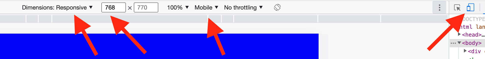

# Shelter

Shelter - это проект, в котором вам предстоит сверстать сайт, состоящий из двух страниц, сделать его адаптивным и интерактивным.

**[Макет Shelter. Figma](https://www.figma.com/file/tKcmzkARtMUFQAR9VLdLkl/shelter-dom)**

## Этапы выполнения задания

**[Неделя 1](#неделя-1)**: Фиксированная верстка страниц `main` и `pets`.

- на данном этапе вам предстоит создать фиксированную верстку двух страниц. При фиксированной верстке страницы выглядят одинаково при ширине окна не менее 1280px.

**[Неделя 2](#неделя-2)**: Добавление адаптивности верстки.

- на этом этапе вам предстоит адаптировать согласно макету ранее созданные страницы под различную ширину окна до 320px включительно.

**[Неделя 3](#неделя-3)**: Добавление дополнительного функционала.

- на этом этапе на ранее сверстанные страницы добавляется дополнительный функционал: слайдер, пагинация, попап.

## Проверка задания

- Задание будет проверяться посредством кросс-чека. **Всего проверки будет 3, на каждом этапе выполнения задания.** [Инструкция по проведению cross-check](https://docs.rs.school/#/cross-check-flow).
  - [Порядок оценки cross-check первого этапа задания (неделя 1)](#порядок-оценки-cross-check-неделя-1).
  - [Порядок оценки cross-check неделя 2](#порядок-оценки-cross-check-неделя-2)
  - [Порядок оценки cross-check неделя 3](#порядок-оценки-cross-check-неделя-3)

## Создание собственной копии макета

Первое, что нужно сделать - это создать собственную копию макета в фигме. Для этого:

- авторизуемся в [figma](https://www.figma.com/);
- открываем [макет](https://www.figma.com/file/tKcmzkARtMUFQAR9VLdLkl/shelter-dom);
- на верхней панели инструментов нажимаем на стрелку рядом с названием макета;
- в появившемся меню выбираем пункт _"Duplicate to your drafts"_;
- в главном меню (верхняя левая кнопка) выбираем пункт _"Back to files"_;
- открываем копию макета рядом с которой есть надпись _"In Drafts"_

## Технические требования

Расширение PerfectPixel для Google Chrome можно использовать для того, чтобы сверяться с изображением
_[Расширение PerfectPixel для Google Chrome](https://chrome.google.com/webstore/detail/perfectpixel-by-welldonec/dkaagdgjmgdmbnecmcefdhjekcoceebi?hl=en)_

Поддержка браузеров: **Google Chrome, Mozilla Firefox**. В первую очередь мы разрабатываем для Google Chrome. Затем проверяем, не «рушит» ли Mozilla Firefox наши стили.

**Запрещается** использование CSS-фреймворков (bootstrap, foundation и т.д.).
**Запрещается** использование JS-фреймворков (Angular, React, Vue и т.д.).
**Запрещается** использование устаревших библиотек (jQuery и т.д.).
**Разрешается** использование актуальных библиотек с набором вспомогательных функций (lodash). Lodash пользоваться можно, как и утилитами для создания слайдера, пагинации, попапов. Однако, рекомендуется пользоваться чистым, или _ванильным_ JavaScript.
**Разрешается** использование иконочных шрифтов, CSS препроцессоров (scss).
**Рекомендуется** использование [normalize.css](https://necolas.github.io/normalize.css/).

Обратите внимание на следующие пункты:

- Основные блоки должны быть точно расположены на заданной ширине экрана так, как в макете Figma.
- Изображения, логотипы (если они есть) должны быть расположены в рамках логического контейнера с правильным подходом по центрированию и расположению. Допускается незначительное отклонение от макета в угоду сеточной или колоночной структуре.
- Иконки, картинки должны сохранять идеальное расстояние до начала соответствующего им текста.
- Иконки, картинки должны сохранять свои пропорции.
- Если использован правильный шрифт, проверьте высоту текста — он должен соответствовать исходнику. Ширина может варьироваться. Но общепринятой практикой является добавление свойства межбуквенного интервала (`letter-spacing`) тексту заголовков, девиза (motto) или цитат.
- Если в строке несколько объектов визуально одинаковой ширины, то ширина содержащих их блоков должна быть одинаковой. Разница размеров изображений не имеет значения, важно совпадение размеров блоков. Если в макете ширина блоков разная, то делать ее все равно нужно одинаковой.
- Некоторые элементы должны быть интерактивными. Макет содержит отдельно спроектированные блоки с описанием того, как выглядит кнопка или элемент с hover-эффектом и без него.

«Интерактивный» означает, что у кнопки или элемента появляется визуальный эффект или анимация (на ваше усмотрение и исходя из макета: анимация курсора, изменение цвета заднего фона, затемнение, нижнее подчеркивание, изменение шрифта) при каких-либо действиях пользователя, например, при наведении курсора. Использовать JavaScript для обработки пользовательских событий в данном задании не обязательно. Обычно, такой эффект реализуют при помощи псевдокласса `:hover` и следующих свойств:

- `cursor: pointer`,
- `background`,
- `text-decoration: underline`,
- `color`.

## Требования к репозиторию

- Задание выполняется в приватном репозитории школы [Как работать с приватным репозиторием](https://docs.rs.school/#/private-repository?id=Как-работать-с-приватным-репозиторием)
- В приватном репозитории школы создайте ветку с названием `shelter`, в ней создайте папку с названием `shelter`, и в ней разместите файлы проекта. Файлы и папки внутри `shelter` можно именовать на свое усмотрение, а можно воспользоваться примером ниже. Т.к. проект будет содержать несколько страниц (2), то внутри на уровне с `assets` будет располагаться папка `pages`. Внутри `pages`, в папке `main` (папка по имени страницы), будут храниться файлы `.html`, `.css` и `.js`, относящиеся к данной странице. В папке `assets` по-прежнему будут храниться изображения, иконки и файлы шрифтов, если есть. Как называть папки внутри `assets` в зависимости от содержимого: `images`, `icons`, `fonts`. Пример ниже:
- 
- Для деплоя используйте gh-pages [Как сделать деплой задания из приватного репозитория школы](https://docs.rs.school/#/private-repository?id=Как-сделать-деплой-задания-из-приватного-репозитория-школы)
- История коммитов должна отображать процесс разработки приложения. Названия коммитов должны соответствовать [требованиям к коммитам](https://docs.rs.school/#/git-convention)

### Дополнительные требования к репозиторию для выполнения второй и третьей части задания

- задание может выполняться как в той же ветке `shelter`, так и в новой ветке.
- если задание выполняется в новой ветке:
  - от ветки `shelter` создается новая ветка, например `shelter-part2`;
  - в новой ветке выполняется работа по заданию;
  - при завершении выполнения в ветку `shelter` из ветки `shelter-part2` делается **Pull Request** с последующим мержем. Название и содержимое этого PR значения не имеет;
- создается новый деплой вашей работы в ветке `gh-pages` из ветки `shelter`. [Как сделать деплой задания из приватного репозитория школы](https://docs.rs.school/#/private-repository?id=Как-сделать-деплой-задания-из-приватного-репозитория-школы);
- актуализируется открытый **Pull Request** в ветку `main` из ветки `shelter`. Мерж этого PR не производится.

## Полезные ссылки

Шрифты можно найти здесь:

[Arial, google fonts](https://www.fonts.com/font/monotype/arial?QueryFontType=Web&src=GoogleWebFonts)
[Georgia, google fonts](https://www.fonts.com/font/microsoft-corporation/georgia?QueryFontType=Web&src=GoogleWebFonts)

Можно подключать как скачиванием локальных шрифтов, так и подключением шрифтов через url на google fonts. Если вы не можете найти или скачать нужный шрифт, просто замените его шрифтом с тем же типом засечек.

## Неделя 1

Исходная ширина предоставленного макета 1280px. Ширина обертки (wrapper), или т.н. направляющих колонок - 1200px. Размеры внутренних блоков рекомендуется задавать в относительных величинах (%, vw), чтобы не переписывать CSS стили для резиновой верстки.

При ширине окна выше 1280px верстка должна оставаться по центру, а не растягиваться на всю ширину окна. Для заполнения свободного пространства можно либо растягивать фоны соответствующих блоков на всю ширину окна, либо использовать любой из цветов, присутствующих в [макете](https://www.figma.com/file/tKcmzkARtMUFQAR9VLdLkl/shelter-dom):


#### Десктоп версия Main (60 баллов)

JPG: **[shelter. main-1280. JPG](main-1280px.jpg)**

1. **Header** (`<header>` содержит только логотип и панель навигации)

- Интерактивная панель навигации:
  - по умолчанию должен быть подсвечен элемент `About the shelter`;
  - подсвеченный элемент `About the shelter` может не иметь hover-эффектов.
- Нажатие на `Our pets` перебрасывает нас на страницу _our pets_.
- Нажатие на `Help the shelter` перебрасывает нас на блок _Help_, расположенный на этой же странице (якорная ссылка).
- Нажатие на `Contacts` перебрасывает нас на блок _Footer_, расположенный на этой же странице (якорная ссылка).
- Логотип находится слева. Логотип состоит из текстовых элементов (т.е. не картинка). Нажатие на логотип оставляет нас на текущей странице.
- На странице обязательно должен присутствовать один элемент `<h1>`. Можно сделать его с текстом `Cozy House`.
- Хедер "липким" делать не нужно. Т.е. при скролле он остается на своей позиции.

2. Блок **Not only**

- Кнопка `Make a Friend` должна быть интерактивной.
- Нажатие на `Make a Friend` перебрасывает нас на блок _Our Friends_, расположенный на этой же странице (якорная ссылка).
- Фон блоков можно сделать градиентом.
- Картинка собаки и текст - разные блоки, которые не должны накладываться.

3. Блок **About**

- Внимательно посмотрите, какого вида здесь кавычки.

4. Блок **Our Friends**

- Кнопки "влево" и "вправо" должны быть интерактивными.
- Карточки с питомцами должны быть интерактивными при наведении на любую область карточки. Наведение на карточку меняет курсор, делает подсветку кнопки `Learn more` и меняет фон.
- Кнопки `Learn more` должны быть интерактивными.
- Кнопка `Get to know the rest` должна быть интерактивной.
- Нажатие на `Get to know the rest` перебрасывает нас на страницу _our pets_.

5. Блок **Help**

- Для позиционирования элементов блока используется сеточная верстка (flexbox или grid).
- Расположение элементов: обязательно 5 сверху, 4 снизу.

6. Блок **In addition**

- Интерактивный блок с номером банковского счета. Номер должен быть ссылкой, которая никуда не ведет.

7. **Footer** (`<footer>` содержит контакты, адрес и изображение):

- При нажатии на email или его иконку должен открываться почтовый сервис.
- При нажатии на телефон или его иконку должен открываться набор номера.
- При нажатии на локацию должна открываться страница с google maps в отдельном окне с любой локацией на ваш выбор.
- Изображение собаки, адрес и контакты - разные блоки, которые не должны накладываться друг на друга.
- Фон блока можно сделать градиентом.

#### Десктоп версия Our Pets (40 баллов)

JPG: **[shelter. Pets page. JPG](shelter-pets-1280px.jpg)**

1. **Header** (`<header>` содержит только логотип и панель навигации)

- Интерактивная панель навигации:
  - по умолчанию должен быть подсвечен элемент `Our pets`;
  - подсвеченный элемент `Our pets` может не иметь hover-эффектов.
- Нажатие на `About the shelter` перебрасывает нас на страницу _main_.
- Нажатие на `Help the shelter` перебрасывает нас на блок _Help_, расположенный на странице _main_ (якорная ссылка).
- Нажатие на `Contacts` перебрасывает нас на блок _Footer_, расположенный на этой же странице (якорная ссылка).
- Логотип находится слева. Логотип состоит из текстовых элементов (т.е. не картинка). Нажатие на логотип перебрасывает нас на страницу _main_.
- На странице обязательно должен присутствовать один элемент `<h1>`. Можно сделать его с текстом `Cozy House`.
- Хедер должен быть "липким". Т.е. при скролле он всегда показан на странице сверху, сохраняя свою позицию.

2. Блок **Our Friends**

- Четырехколоночный макет.
- Карточки с питомцами должны быть интерактивными при наведении на любую область карточки. Наведение на карточку меняет курсор, делает подсветку кнопки `Learn more` и меняет фон.
- Делать открытие модального окна при нажатии на данном этапе не нужно.
- Пагинация должна быть интерактивной на доступных кнопках. Это значит, что с позиции (1) мы не можем уйти левее, т.е. в меньшую сторону. У серых кнопок должен присутствовать атрибут `disabled`, `data-disabled` или класс-модификатор.

3. **Footer** (`<footer>` содержит контакты, адрес и изображение):

- При нажатии на email или его иконку должен открываться почтовый сервис.
- При нажатии на телефон или его иконку должен открываться набор номера.
- При нажатии на локацию должна открыться страница с google maps в отдельном окне с любой локацией на ваш выбор.
- Картинка собаки и текст - разные блоки, которые не должны накладываться друг на друга.
- Фон блока можно сделать градиентом.

## Порядок оценки cross-check неделя 1

Открываем на ширине экрана 1280px. Если экран меньше, можно сделать масштабирование, а можно поставить на странице ширину 1280px и смотреть со включенной горизонтальной полосой прокрутки. Если экран шире, можно поставить область уже или сузить окно. При наличии вертикального скролла, в некоторых случаях, ширина может не совпадать с той, что показывает значение в панели разработчика (смещение может быть до 17px). При проверке учитывайте этот нюанс, и убедитесь, что ширина задана верно.

Работа проверяется исключительно по критериям, указанным ниже. Если вы увидели в работе какой-то недочет или ошибку, которые не подпадают под критерии - баллы не снижаются. Но вы можете написать о найденной ошибке в комментариях к выставляемой оценке.

Если в ходе проверки, вы не знаете, снимать или не снимать балл, то не снимайте. Например, если в блоке **You can also make a donation** внутри кнопки вписаны неправильные, другие цифры, то это не будет считаться ошибкой, баллы не снижаем.

❗ Балл не может опуститься ниже **0** за страницу. Если не указано в требованиях отдельно, то для всех неповторяющихся блоков или элементов в состоянии покоя (без `hover`) справедливо:

- Отступы от границ элементов (или наборов элементов) до краев блока, по горизонтали или вертикали, отличаются более чем на 20px: **-1** за каждый блок.
- Отступы внутри набора или сетки между элементами, по горизонтали или вертикали, отличаются более чем на 10px: **-1** за каждый блок.
- Цвет фона блока или элемента отличается от дизайна (не касается положения градиента или растянутого изображения): **-1** за каждый блок.
- Отсутствует элемент или картинка, как фоновая, так и картинка элемента: **-1** за каждый блок.
- Шрифт или семейство шрифтов не подключено, или разница в размере шрифта более чем 4px: **-1** за каждый блок.

Создана страница _main_ **+60**.

1. Нет блока **Header**: **-10**.

- Нет логотипа: **-2**.
- Нет панели навигации: **-5**. Панель навигации есть, но не интерактивная: **-1**. Рекомендуется использовать `<nav>`.
- Элемент `About the shelter` не подсвечен: **-1**.
- Элемент `Our pets` не работает как ссылка на страницу _our pets_: **-1**.
- Элемент `Help the shelter` не работает как якорная ссылка на блок _Help_: **-1**.
- Элемент `Contacts` не работает как якорная ссылка на блок _Footer_: **-1**.
- На странице нет элемента `<h1>`: **-2**. Элемент есть, но в количестве больше одного: **-1**.
- Фон сильно отличается от того, что на макете (не имеется ввиду смещенная картинка или градиент): **-1**.

2. Нет блока **Not only**: **-5**.

- Нет кнопки `Make a Friend`: **-2**. Кнопка есть, но не интерактивная, или не работает как якорная ссылка на блок _Our Friends_: **-1**.
- Фон сильно отличается от того, что на макете (не имеется ввиду смещенная картинка или градиент): **-1**.
- Нет картинки собаки: **-2**. Картинка собаки есть, но сильно смещена, или накладывается на текст или другие блоки: **-1**.

3. Нет блока **About**: **-5**.

- Нет картинки кошки и собаки: **-2**. Картинка есть, но сильно смещена, или накладывается на текст или другие блоки: **-1**.
- Текст заголовка имеет неверные размеры: **-2**.
- Кавычки имеют неправильный вид: **-1**.

4. Нет блока **Our Friends**: **-20**.

- Нет кнопки "влево": **-2**. Кнопка есть, но не интерактивная: **-1**.
- Нет кнопки "вправо": **-2**. Кнопка есть, но не интерактивная: **-1**.
- Нет карточек с питомцами: **-10**. Карточки есть, но при этом:
  - Сеточная структура элементов нарушена: **-2**.
  - Количество карточек не соответствует макету: **-2**.
  - Структура карточек нарушена (например текст или кнопка сверху над картинкой): **-2**.
  - Карточки не интерактивные: **-2**.
  - Кнопки `Learn more` не меняют цвет при наведении на карточку: **-2**.
- Нет кнопки `Get to know the rest`: **-2**. Кнопка есть, но не интерактивная, или не работает как ссылка на страницу _our pets_: **-1**.

5. Нет блока **Help**: **-5**.

- Сеточная структура элементов нарушена (не 5 элементов сверху, 4 снизу): **-2**.
- Изображение одной или более иконок отсутствуют: **-2**.
- Нарушена структура (например текст сверху, иконка снизу) в одном или более элементе: **-1**.

6. Нет блока **In addition**: **-5**.

- Нет блока со ссылкой на банковский счет: **-2**. Блок есть есть, но он не интерактивный, или не является ссылкой: **-1**.
- Нет картинки собаки: **-2**. Картинка собаки есть, но сильно смещена, или накладывается на текст или другие блоки: **-1**.

7. Нет блока **Footer**: **-10**.

- Сеточная структура элементов нарушена: **-2**.
- Элемент `email` не работает как ссылка на почтовый сервис: **-2**.
- Элемент `телефон` не работает как ссылка на сервис звонков: **-2**.
- Хотя бы один элемент `локация` не работает как ссылка на google maps: **-1**.
- Нет картинки собаки: **-2**. Картинка собаки есть, но сильно смещена, или накладывается на текст или другие блоки: **-1**.
- Фон сильно отличается от того, что на макете (не имеется ввиду смещенная картинка или градиент): **-1**.

Создана страница _our pets_ **+40**.

1. Нет блока **Header**: **-10**.

- Нет логотипа: **-2**. Логотип есть, но не работает как ссылка на страницу _main_: **-1**.
- Нет панели навигации: **-5**. Панель навигации есть, но не интерактивная: **-1**. Рекомендуется использовать `<nav>`.
- Элемент `About the shelter` не работает как ссылка на страницу _main_: **-1**.
- Элемент `Our pets` не подсвечен: **-1**.
- Элемент `Help the shelter` не работает как якорная ссылка на блок _Help_ страницы _main_: **-1**.
- Элемент `Contacts` не работает как якорная ссылка на блок _Footer_: **-1**.
- На странице нет элемента `<h1>`: **-2**. Элемент есть, но в количестве больше одного: **-1**.
- Фон сильно отличается от того, что на макете: **-1**.

2. Нет блока **Our Friends**: **-20**.

- Нет кнопок пагинации: **-10**. Кнопка есть, но:
  - Кнопки одного цвета или фона: **-2**.
  - Кнопки расположены в неверной последовательности: **-2**.
  - Кнопки "влево" интерактивные: **-1**.
  - Кнопки "вправо" не интерактивные: **-1**.
  - На кружочке страницы нет цифры, или там не единица: **-1**.
  - Кружочек страницы интерактивный: **-1**.
- Нет карточек с питомцами: **-10**. Карточки есть, но при этом:
  - Сеточная структура элементов нарушена: **-2**.
  - Количество карточек не соответствует макету: **-2**.
  - Структура карточек нарушена (например текст или кнопка сверху над картинкой): **-2**.
  - Карточки не интерактивные: **-2**.
  - Кнопки `Learn more` не меняют цвет при наведении на карточку: **-2**.

3. Нет блока **Footer**: **-10**.

- Сеточная структура элементов нарушена: **-2**.
- Элемент `email` не работает как ссылка на почтовый сервис: **-2**.
- Элемент `телефон` не работает как ссылка на сервис звонков: **-2**.
- Хотя бы один элемент `локация` не работает как ссылка на google maps: **-1**.
- Нет картинки собаки: **-2**. Картинка собаки есть, но сильно смещена, или накладывается на текст или другие блоки: **-1**.
- Фон сильно отличается от того, что на макете (не имеется ввиду смещенная картинка или градиент): **-1**.

## Неделя 2

Обратите внимание на дополнения:

- **[Дополнительные требования к репозиторию](#дополнительные-требования-к-репозиторию-для-выполнения-второй-и-третьей-части-задания)**
- **[Первый абзац в разделе: Порядок оценки cross-check неделя 1](#порядок-оценки-cross-check-неделя-1)**

### Особенности проверки

Задание будет оцениваться путем изменения размеров окна браузера Google Chrome, или подключением эмуляции устройств через панель разработчика (DevTools -> Toogle Device Toolbar), выбрав значение ширины экрана. Выводить проект на реальные мобильные устройства или планшеты **не обязательно**.

❗ Убедитесь, что при проверке у вас отсутствует вертикальная полоса прокрутки, т.к. она "съедает" часть пространства отзывчивой верстки своей шириной. Чтобы ее отключить, необходимо выбрать режим эмуляции `Responsive`, а так же установить тип устройства `Mobile`. Если тип устройства не отображается, в верхней панели `device toolbar` нажмите на три точки справа и выберите `Add device type`.



**«responsive»** - это размеры, заданные в относительных величинах от ширины окна или родительского блока, которые плавно меняют свои значения при уменьшении или увеличении окна браузера. Главное, чтобы при наложении картинки, например, в 768px на макет шириной 768px, размеры или отступы совпадали.

❗ Страница не должна разваливаться, что значит, что отступы, размеры блоков, и прочее, не должны уходить за правый край экрана и не должен появляться горизонтальный скролл, до порогового значения (меньше 320px).

## 1280px <= width

Выполняются требования верстки [первой части](#неделя-1) проекта: либо блоки продолжают свой цвет на всю доступную область окна, а сама обертка (1200px) центрируется (при этом градиент также может менять ширину), либо макет занимает максимальную ширину в 1280px и центрируется с равными отступами справа и слева, белого или любого другого цвета из макета (при проверке, если трудно будет смотреть целостность на большом экране, в панели разработчика можно задать элементу body свойство background-color любого контрастного цвета).

## 768px <= width < 1280px

### Main Page

1. **Header** (`<header>` содержит только логотип и панель навигации)

- Логотип прибивается ближе к верху страницы.
- Отступы слева от логотипа и справа от меню навигации должны быть заданы жестко, как на макете `768px`.
- Хедер "липким" делать не нужно. Т.е. при скролле он остается на своей позиции.

2. Блок **Not only**

- Заголовок с текстом "Not only people need a house" должен быть расположен как указано на макете. Т.е. перенос строк должен быть соответствующим макету. Для этого можно сделать дополнительную обертку, которую и центрировать относительно основных блоков. Только отступы могут быть `responsive`, но отступ слева должен совпадать с отступом последующего блока текста.
- Блок с текстом "We offer to give..." должен быть центрирован с равными отступами по краям. Блок с текстом и отступы могут быть `responsive`.
- Кнопка "Make a Friend" должна быть центрирована и иметь жесткие размеры, как на макете `768px`.
- Картинка собаки может быть `responsive`, но смещение должно оставаться в правую сторону пропорциональным, т.е. отступы до правого края могут быть так же `responsive`.

3. Блок **About**

- Заголовок с текстом "About the shelter..." должен быть расположен как указано на макете. Т.е. перенос строк должен быть соответствующим макету. Для этого можно сделать дополнительную обертку, которую и центрировать относительно основных блоков. Только отступы могут быть `responsive`, но отступ слева должен совпадать с отступом последующего блока текста.
- Блоки с текстом "Currently..." и "We feed our..." должны быть центрированы с равными отступами по краям. Блок с текстом и отступы могут быть `responsive`.
- Картинка кошки и собаки ее отступы могут быть `responsive`. Главное, чтобы картинка была центрирована.

4. Блок **Our Friends**

- Заголовок блока должен быть центрирован. Блок с текстом и отступы могут быть `responsive`.
- Вместо трех блоков с питомцами, теперь должно быть два. Блоки с питомцами имеют жесткие размеры, как на макете `assets`. При этом отступы между блоками, стрелками слайдера или краями экрана могут быть `responsive`.
- Кнопка "Get to know the rest" должна быть центрирована и иметь жесткие размеры, как на макете `768px`.

5. Блок **Help**

- Заголовок блока должен быть центрирован. Блок с текстом и отступы могут быть `responsive`.
- Элементы расположены сеткой, 3 х 3. Либо сетка увеличивается пропорционально размерам экрана, либо отступы между элементами и краями экрана можно сделать `responsive`. Структура сетки меняться не должна.

6. Блок **In addition**

- Блок с текстом "You can..." должен быть расположен как указано на макете. Т.е. перенос строк должен быть соответствующим макету. Для этого можно сделать дополнительную обертку, которую и центрировать относительно основных блоков. Только отступы могут быть `responsive`, но отступ слева должен совпадать с отступом последующего блока текста.
- Блок с текстом "Name of the bank..." должен быть расположен как указано на макете. Для этого можно сделать дополнительную обертку, которую и центрировать относительно основных блоков. Только отступы могут быть `responsive`, но отступ слева должен совпадать с отступом последующей кнопки.
- Кнопка с номером счета в банке должна быть расположена, как указано на макете, и иметь жесткие размеры, как на макете `768px`. Для этого можно сделать дополнительную обертку, которую и центрировать относительно основных блоков. Только отступы могут быть `responsive`, но отступ слева должен совпадать с отступом последующего блока текста.
- Блок с текстом "Legal information..." должен быть центрирован с равными отступами по краям. Блок с текстом и отступы могут быть `responsive`.
- Картинка собаки и отступы могут быть `responsive`. Главное, чтобы картинка была центрирована.

7. **Footer** (`<footer>` содержит контакты, адрес и изображение):

- Тут идет сетка из двух колонок. Обратите внимание, что сам блок с сеткой должен быть центрирован. Т.е. расстояние слева до первой колонки совпадает с расстоянием справа до второй колонки. При этом сами колонки и отступы могут быть `responsive`.
- Картинка собаки и отступы могут быть `responsive`. Главное, чтобы картинка была центрирована.

### Pets Page

1. **Header** (`<header>` содержит только логотип и панель навигации)

- Логотип прибивается ближе к верху страницы.
- Отступы слева от логотипа и справа от меню навигации должны быть заданы жестко, как на макете `768px`.
- Хедер должен быть "липким". Т.е. при скролле он всегда показан на странице сверху, сохраняя свою позицию.

2. Блок **Our Friends**

- Заглавный текст должен быть центрирован. Блок с текстом и отступы могут быть `responsive`.
- Сетка становится 2 х 3. Блоки с питомцами имеют жесткие размеры, как на макете `assets`. При этом отступы между блоками или краями экрана могут быть `responsive`.
- Блок с кнопками должен быть центрирован. Размеры кнопок и расстояния между ними заданы жестко, как на `assets`, или как на макете `768px`. Отступы до краев экрана могут быть `responsive`.

3. **Footer** (`<footer>` содержит контакты, адрес и изображение):

- Тут идет сетка из двух колонок. Обратите внимание, что сам блок с сеткой, должен быть центрирован. Т.е. расстояние слева до первой колонки совпадает с расстоянием справа до второй колонки. При этом сами колонки и отступы могут быть `responsive`.
- Картинка собаки и отступы могут быть `responsive`. Главное, чтобы картинка была центрирована.

## 320px <= width < 768px

### Main Page

1. **Header** (`<header>` содержит только логотип и бургер меню)

- Меню навигации преобразовывается в так называемое бургер меню, которое будет открываться по нажатию и предлагать привычную нам панель навигации. Логотип дублируется в открытом меню, хотя на макете этого не видно. Однако, если вы сделали так, что меню открывается, а логотип с основной страницы пропадает - это не ошибка, баллы сниматься не будут.
- Отступ слева от логотипа может быть `responsive`. Отступ справа от меню навигации должен быть задан жестко, как на макете `320px`.
- Хедер "липким" делать не нужно. Т.е. при скролле он остается на своей позиции.

2. Блок **Not only**

- Заголовок с текстом "Not only people need a house" должен быть центрирован с равными отступами по краям. Блок с текстом и отступы могут быть `responsive`.
- Блок с текстом "We offer to give..." должен быть центрирован с равными отступами по краям. Блок с текстом и отступы могут быть `responsive`.
- Кнопка "Make a Friend" должна быть центрирована и иметь жесткие размеры, как на макете `320px`.
- Картинка собаки может быть `responsive`, но смещение должно оставаться в правую сторону пропорциональным, т.е. отступы до правого края могут быть так же `responsive`.

3. Блок **About**

- Заголовок с текстом "About the shelter..." должен быть центрирован с равными отступами по краям. Блок с текстом и отступы могут быть `responsive`.
- Блоки с текстом "Currently..." и "We feed our..." должны быть центрированы с равными отступами по краям. Блок с текстом и отступы могут быть `responsive`.
- Картинка кошки и собаки и отступы могут быть `responsive`. Главное, чтобы картинка была центрирована.

4. Блок **Our Friends**

- Заголовок блока должен быть центрирован. Блок с текстом и отступы могут быть `responsive`.
- Вместо двух блоков с питомцами, теперь должен быть один. Блок с питомцами имеет жесткие размеры, как на макете `assets`. При этом отступы между стрелками слайдера или краями экрана могут быть `responsive`.
- Кнопка "Get to know the rest" должна быть центрирована и иметь жесткие размеры, как на макете `320px`.

5. Блок **Help**

- Заголовок блока должен быть центрирован. Блок с текстом и отступы могут быть `responsive`.
- Элементы расположены сеткой, 2 х 5. Либо сетка увеличивается пропорционально размерам экрана, либо отступы между элементами и краями экрана можно сделать `responsive`. Структура сетки меняться не должна. Последний, девятый элемент сетки должен находиться в сетке слева.

6. Блок **In addition**

- Блок с текстом "You can..." должен быть центрирован. Блок с текстом и отступы могут быть `responsive`.
- Блок с текстом "Name of the bank..." должен быть центрирован. Блок с текстом и отступы могут быть `responsive`.
- Кнопка с номером счета в банке должна быть центрирована. Сама кнопка, как и отступы до краев экрана, могут быть `responsive`.
- Блок с текстом "Legal information..." должен быть центрирован с равными отступами по краям. Блок с текстом и отступы могут быть `responsive`.
- Картинка собаки и отступы могут быть `responsive`. Главное, чтобы картинка была центрирована.

7. **Footer** (`<footer>` содержит текст, логотип и панель навигации):

- Одна единственная колонка. Отступы всех элементов до краев экрана должны совпадать. Сама колонка должна быть центрирована. При этом, как сама колонка, так и отступы до краев экрана, могут быть `responsive`.
- Картинка собаки и отступы могут быть `responsive`. Главное, чтобы картинка была центрирована.

### Pets Page

1. **Header** (`<header>` содержит только логотип и бургер меню)

- Меню навигации преобразовывается в так называемое бургер меню, которое будет открываться по нажатию и предлагать привычную нам панель навигации. Логотип дублируется в открытом меню, хотя на макете этого не видно. Однако, если вы сделали так, что меню открывается, а логотип с основной страницы пропадает - это не ошибка, баллы сниматься не будут.
- Отступ слева от логотипа может быть `responsive`. Отступ справа от меню навигации должны быть задан жестко, как на макете `320px`.
- Хедер должен быть "липким". Т.е. при скролле он всегда показан на странице сверху, сохраняя свою позицию.

2. Блок **Our Friends**

- Заголовок блока должен быть центрирован. Блок с текстом и отступы могут быть `responsive`.
- Сетка становится 1 х 3. Блоки с питомцами имеют жесткие размеры, как на макете `assets`. При этом отступы между блоками или краями экрана могут быть `responsive`.
- Блок с кнопками должен быть центрирован. Размеры кнопок и расстояния между ними заданы жестко, как на `assets`, или как на макете `320px`. Отступы до краев экрана могут быть `responsive`.

3. **Footer** (`<footer>` содержит контакты, адрес и изображение):

- Одна единственная колонка. Отступы всех элементов до краев экрана должны совпадать. Сама колонка должна быть центрирована. При этом, как сама колонка, так и отступы до краев экрана, могут быть `responsive`.
- Картинка собаки и отступы могут быть `responsive`. Главное, чтобы картинка была центрирована.

## width < 320px

Минимальная ширина макета = 320px. После порогового значения расположение верстки значения не имеет. Структура верстки остается такой же, как при ширине 320px. Если в какой-то момент при уменьшении ширины экрана верстка "ломается", это не ошибка.

## Порядок оценки cross-check неделя 2

❗ **Важное замечание #1**: При изменении ширины с использованием инструментов разработчика (dev tools) и наличии вертикальной полосы прокрутки, расхождение может составлять до 17px (стандартная ширина вертикальной полосы прокрутки). В таком случае надо либо изменить ширину на величину этого расхождения, либо перейти в [режим просмотра страницы на устройстве](#особенности-проверки), чтобы вертикальной полосы прокрутки не было.  
❗ **Важное замечание #2**: При масштабировании экрана (например, zoom+ 125%) реальная ширина может отличаться на 1-2 пикселя. Например, реальное значение может быть 767 или 769, хотя инструменты разработчика будут показывать 768. Поэтому надо сдвинуть до точки перехода, несмотря на отличие.  
❗ **Важное замечание #3**: Единственненный блок, в котором элементы не обязательно должны соблюдать структуру - это блок `Help`. Если элементы идут как перечисляемые элементы, то при проверке на резиновую верстку, отступы от края блока до элементов, а также количество в ряду не учитываются и баллы не снижаются. Также не оценивается, центрируются ли элементы или прибиты к левому краю. Однако нарушение размеров учитывается, будьте внимательны!  
❗ **Важное замечание #4**: Проверка полного соответствия макетам по Perfect Pixel происходит только на соответствующих контрольных точках - 1280px, 768px, 320px. На всех промежуточных величинах допускается отсутствие точного следования отступам и размерам, но рекомендуется следовать принципам расположения тех или иных элементов, не отмеченных в конкретных требованиях.

---

❗ **Ознакомьтесь с некоторыми определениями**:

- **Нарушение отступов** - это ситуация, когда расстояние между элементами, или расстояние от элемента до края контейнера, в котором он содержится, отличается от заданного на макете более чем на 10 пикселей по высоте или ширине.
  Рассмотрим ситуацию на примере блока `our friends`. Вы, скорее всего, будете знать примерное расстояние между элементами на глаз. Однако, вас смущает отступ кнопки "влево" от края экрана слева. Расстояние от кнопки "влево" до левой границы блока 40px на ширине экрана 1280px. Значит, выставив ширину 1280px, смотрим расстояние. Если оно отличается на величину до 10px включительно (например 50px или 30px) - баллы не снимаем. Однако, если отступы больше этих значений (например 51px или 29px) - снимаем указанное количество баллов.
- **Нарушение размеров** - это ситуация, когда размеры элементов (кнопок, картинок, карточек животных, иконок) отличаются от заданного на макете более чем на 10 пикселей по высоте или ширине. Проверку проводим таким же образом, как и при нарушении отступов, и если отличия большие, снимаем указанное количество баллов.
- Длину текста и слов по ширине, а также порядок переноса слов по строкам, мы **не учитываем при проверке**.
- **Уникальная ошибка** - это новая найденная ошибка в проверяемом блоке. Независимо от того, сколько раз эта ошибка повторяется в проверяемом блоке, указанное количество баллов снимается только 1 раз.  
  Например, съехала кнопка во всех карточках животных. Снимать баллы будем лишь один раз, т.к. скорее всего сломан общий стиль. Если карточка со съехавшей кнопкой одна (а в остальных кнопка находится на своем месте) - все равно снимаем указанное количество баллов. Т.е. нет разницы, ошибка в одном повторяющемся элементе, или в нескольких.

### Общая проверка поведения приложения при изменении ширины окна

Хоть при растягивании экрана на 4k, хоть при уменьшении до 320px не должна теряться целостность приложения. При плавном изменении размера мы не учитываем точных подсчетов расположения элементов. На данном этапе в браузере **Google Chrome** проверяется:

- отсутствие горизонтальной полосы прокрутки на любой ширине экрана до 320px включительно;
- элементы не должны выходить за боковые границы экрана\* при любой ширине экрана до 320px включительно.

  Если, оба условия в браузере **Google Chrome** выполняются (сайт ведет себя отзывчиво, элементы и общая структура меняет размеры вместе с изменением ширины, не появляется горизонтальная полоса прокрутки и элементы не выходят за боковые стороны окна), то ставим **+50** за каждую страницу. В сумме за 2 страницы ставим **+100**.
  Если на странице появляется горизонтальная полоса прокрутки или происходит заход контента за боковую границу экрана, ставим **0** за страницу.\*\*

  После проверки отзывчивости верстки в браузере Google Chrome выполняется аналогичная проверка в браузере **Mozilla Firefox**, при которой:

- если при изменении размера окна браузера от максимума до 320px появляется горизонтальная полоса прокрутки, или контент выходит за пределы экрана, **снимается -20**.
- если при изменении размера окна браузера от максимума до 320px горизонтальная полоса прокрутки не появляется, контент не выходит за пределы экрана, но появляются какие-то другие проблемы в верстке (отличные от тех, что были в Google Chrome) - **снимается -5 за каждую** с описанием проблемы, но **не более -20**.

  Максимальное количество баллов, которое можно вычесть при наличии ошибок во время проверки в браузере **Mozilla Firefox** - **-20**.\*\*\*

  \* _на ширине экрана <768px за боковую границу экрана может заходить бургер-меню. Т.к. это нормальная практика, ошибкой это не считается, если при этом на странице не появляется горизонтальная прокрутка._  
  \*\* _если во время общей проверки за страницу выставляется 0, дальнейшие критерии, относящиеся к этой странице, не проверяются._  
  \*\*\* _дальнейшая проверка происходит только в браузере Google Chrome_

### 1280px <= width (максимально -10 баллов за страницу)

При проверке на больших экранах допустимо:
**1) фоны блоков растягиваются на всю ширину окна**, при этом сам контент находится в центре экрана и соответствует макету;
**2) верстка занимает максимальную ширину 1280px** и соответствует макету, центрируется с равными отступами слева и справа, свободное пространство заполнено любым цветом;

Для любого из случаев выше **считается ошибкой**, если контент не центрируется, т.е. прижат к правой или левой стороне. В случае такой ошибки **снимается -10** баллов за страницу.
Если контент центрирован, проверяется соответствие макету 1280px, для этого:

- выставляем ширину окна в 1280px
- проверяем отсутствие нарушений отступов или нарушений размеров.
  За каждую уникальную ошибку в нарушении отступов или нарушении размеров снимается **-3**, **но не более -10 суммарно**.

**3) контент растягивается по всей ширине окна**:

В этом случае производится дополнительная проверка следующих условий:

#### Main Page

Смотрим, выполняются ли следующие условия резиновой верстки:

- Фон растянут на `Header` и блок `Not only`.
- Картинка собаки в блоке `Not only` не пересекается с текстом.
- Все параграфы с текстом справа от картинки кошки и собаки выравнены по левому краю в блоке `About the shelter`.
- В блоке `Our friends` текст, слайдер и кнопка снизу центрированы.
- Все параграфы с текстом и ссылка с номером карты справа от картинки собаки выравнены по левому краю в блоке `In addition`.
- Иконки и текст в обоих колонках выравнены по левому краю своих колонок в блоке `Footer`.

Если условия нарушены, снимается **-5** за каждый пункт.  
Если блоки или элементы выходят за рамки экрана, или накладываются друг на друга, снимается **-5** за каждую уникальную ошибку.

Выполняется проверка соответствия макету main-1280, для чего:

- выставляем ширину окна в 1280px
- проверяем отсутствие нарушений отступов или нарушений размеров.
  За каждую уникальную ошибку в нарушении отступов или нарушении размеров снимается **-3**, **но не более -10 суммарно, включая снижение баллов за нарушение условий резиновой верстки**.

#### Pets Page

Смотрим, выполняются ли следующие условия резиновой верстки:

- `Header` всегда видимый, и находится сверху страницы, в том числе при скролле.
- В блоке `Our friends` находится 8 карточек питомцев, 2 ряда по 4 элемента.
- В блоке `Our friends` все элементы и блоки с элементами центрированы. Если в пагинации найден недочет или неточность верстки, прежде чем снижать балл, убедитесь, что после того, как вы выставили ширину и сделали **перезагрузку страницы**, проблема все еще существует.
- При открытии страницы, в пагинации должно быть число "1", а кнопки слева неактивны.
- Иконки и текст в обеих колонках выравнены по левому краю своих колонок в блоке `Footer`.

Если условия нарушены, снимается **-5** за каждый пункт.  
Если блоки или элементы выходят за рамки экрана, или накладываются друг на друга, снимается **-5** за каждую уникальную ошибку.

Выполняется проверка соответствия макету our-pets-1280, для чего:

- выставляем ширину окна в 1280px
- проверяем отсутствие нарушений отступов или нарушений размеров.
  За каждую уникальную ошибку в нарушении отступов или нарушении размеров снимается **-3**, **но не более -10 суммарно, включая снижение баллов за нарушение условий резиновой верстки**.

### 768px <= width < 1280px (максимально -15 баллов за страницу)

#### Main Page

Смотрим, выполняются ли следующие условия резиновой верстки:

- Фон растянут на `Header` и блок `Not only`.
- Картинка собаки снизу в блоке `Not only` не пересекается с текстом.
- Все параграфы с текстом выравнены по левому краю в блоке `Not only`. Сами блоки центрированы.
- Кнопка "Make a friend" центрирована.
- Все параграфы с текстом выравнены по левому краю в блоке `About the shelter`. Сами блоки центрированы.
- В блоке `Our friends` текст, слайдер и кнопка снизу центрированы.
- В блоке `Our friends` в слайдере 2 карточки питомцев.
- Все параграфы с текстом, а также ссылка с номером карты, выравнены по левому краю в блоке `In addition`. Сами блоки центрированы.
- Иконки и текст в обеих колонках выравнены по левому краю своих колонок в блоке `Footer`.
- Картинка собаки снизу в блоке `Footer` не пересекается с текстом.

Если условия нарушены, снимается **-5** за каждый пункт.  
Если блоки или элементы выходят за рамки экрана, или накладываются друг на друга, снимается **-5** за каждую уникальную ошибку.

Выполняется проверка соответствия макету main-768, для чего:

- выставляем ширину окна в 768px
- проверяем отсутствие нарушений отступов или нарушений размеров.
  За каждую уникальную ошибку в нарушении отступов или нарушении размеров снимается **-3**, **но не более -15 суммарно, включая снижение баллов за нарушение условий резиновой верстки**.

#### Pets Page

Смотрим, выполняются ли условия резиновой верстки:

- `Header` всегда видимый, находится сверху страницы, в том числе при скролле.
- В блоке `Our friends` находится 6 карточек питомцев, 3 ряда по 2 элемента.
- В блоке `Our friends` все элементы и блоки с элементами центрированы. Если в пагинации найден недочет или неточность верстки, прежде чем снижать балл, убедитесь, что после того, как вы выставили ширину и сделали **перезагрузку страницы**, проблема все еще существует.
- При открытии страницы в пагинации должно быть число "1", а кнопки слева неактивны.
- Картинка собаки снизу в блоке `Footer` не пересекается с текстом.

Если условия нарушены, снимается **-5** за каждый пункт.  
Если блоки или элементы выходят за рамки экрана, или накладываются друг на друга, снимается **-5** за каждую уникальную ошибку.

Выполняется проверка соответствия макету our-pets-768, для чего:

- выставляем ширину окна в 768px
- проверяем отсутствие нарушений отступов или нарушений размеров.
  За каждую уникальную ошибку в нарушении отступов или нарушении размеров снимается **-3**, **но не более -15 суммарно, включая снижение баллов за нарушение условий резиновой верстки**.

### 320px <= width < 768px (максимально -15 баллов за страницу)

#### Main Page

Смотрим, выполняются ли следующие условия резиновой верстки:

- Фон растянут на `Header` и блок `Not only`.
- Меню в `Header` скрывается (становится бургер меню), в `Header` появляется бургер-иконка.
- Все параграфы с текстом и кнопка центрированы в блоке `Not only`.
- Картинка собаки снизу в блоке `Not only` не пересекается с текстом.
- Все параграфы с текстом центрированы в блоке `About the shelter`. При этом текст в параграфах, но не заголовке, выравнен по ширине параграфа.
- В блоке `Our friends` текст, карточка в слайдере, блок с кнопками слайдера и кнопка снизу центрированы.
- В блоке `Our friends` в слайдере 1 карточка питомца.
- Все параграфы с текстом, а также ссылка с номером карты, центрированы в блоке `In addition`. При этом текст в параграфах, но не заголовках и ссылке с номером карты, выравнен по ширине параграфа.
- Заголовки с текстом, иконка и адрес email, иконка и номер телефона и картинка собаки в самом низу центрированы в блоке `Footer`.
- Иконки локации и адреса выравнены по левому краю, а сам блок центрирован. Если локации и иконки целиком центрированы - это не ошибка, баллы не снимаем!

Если условия нарушены, снимается **-5** за каждый пункт.  
Если блоки или элементы выходят за рамки экрана, или накладываются друг на друга, снимается **-5** за каждую уникальную ошибку.

Выполняется проверка соответствия макету main-320, для чего:

- выставляем ширину окна в 320px
- проверяем отсутствие нарушений отступов или нарушений размеров.
  За каждую уникальную ошибку в нарушении отступов или нарушении размеров снимается **-3**, **но не более -15 суммарно, включая снижение баллов за нарушение условий резиновой верстки**.

#### Pets Page

Смотрим, выполняются ли условия резиновой верстки:

- `Header` всегда видимый, и находится сверху страницы, в том числе при скролле.
- Меню в `Header` скрывается (становится бургер меню), в `Header` появляется бургер-иконка.
- В блоке `Our friends` находится 3 карточки питомцев, 1 колонка с 3 элементами.
- В блоке `Our friends` все элементы и блоки с элементами центрированы. Если в пагинации найден недочет или неточность верстки, прежде чем снижать балл, убедитесь, что после того, как вы выставили ширину и сделали **перезагрузку страницы**, проблема все еще существует.
- При открытии страницы, в пагинации должно быть число "1", а кнопки слева неактивны.
- Заголовки с текстом, иконка и адрес email, иконка и номер телефона и картинка собаки в самом низу центрированы в блоке `Footer`.
- Иконки локации и адреса выравнены по левому краю, а сам блок центрирован. Если локации и иконки целиком центрированы - это не ошибка, баллы не снимаем!

Выполняется проверка соответствия макету our-pets-320, для чего:

- выставляем ширину окна в 320px
- проверяем отсутствие нарушений отступов или нарушений размеров.
  За каждую уникальную ошибку в нарушении отступов или нарушении размеров снимается **-3**, **но не более -15 суммарно, включая снижение баллов за нарушение условий резиновой верстки**.

## Неделя 3

Каждый из питомцев будет представлять из себя объект с набором данных, например:

```javascript
const pet = {
  name: "Jennifer",
  img: "../../assets/images/jennifer.png",
  type: "Dog",
  breed: "Labrador",
  description:
    "Jennifer is a sweet 2 months old Labrador that is patiently waiting to find a new forever home. This girl really enjoys being able to go outside to run and play, but won't hesitate to play up a storm in the house if she has all of her favorite toys.",
  age: "2 months",
  inoculations: ["none"],
  diseases: ["none"],
  parasites: ["none"],
};
```

❗ Каждый DOM-объект (блок) с описанием питомца, будь то слайдер, пагинация или попап, будет генерироваться из данных объекта. В объекте могут быть поля, которые вы придумаете и назовете сами, выше приведен лишь пример.

**[Данные всех 8 питомцев в формате `JSON`!](https://github.com/rolling-scopes-school/tasks/blob/master/tasks/markups/level-2/shelter/pets.json)**

### Main Page

#### Burger menu

- Бургер меню будет на странице только при width < 768px.
- При нажатии на бургер меню, с правой стороны будет выезжать блок шириной 320px, и высотой во всю высоту окна браузера, в котором будут вертикально расположенные и центрированные элементы меню. Должна присутствовать анимация выезда (slide-in).
- В элементах действуют те же правила активности и неактивности, как и в меню на большей ширине экрана. Например, при нажатии на `Contacts`, нас должно перебросить на блок _Footer_, а меню должно закрыться.
- Область, выступающая за 320px должна быть затемнена. Свойство затемнения описано в дизайне макета Figma.
- При открытии меню, сама иконка меню поворачивается на 90 градусов. Должна присутствовать анимация поворота (rotate). Вертикальный скролл должен стать неактивным.
- При нажатии вне границ меню, на затемненную область, или на кнопку с иконкой бургер меню, меню должно заехать обратно. Должна присутствовать анимация заезда (slide-out).
- При закрытии меню, сама иконка меню поворачивается обратно на 90 градусов. Должна присутствовать анимация поворота (rotate). Вертикальный скролл должен стать вновь активным.
- Логотип в бургер меню дублируется с основным. При этом допускается сделать так, чтобы при открытии бургер меню логотип самой страницы исчезал или переносился на свое место в бургер меню.

#### Carousel

- Слайдер должен быть реализован со стрелками, при нажатии на которые случается переход на новый блок элементов.
- Слайдер бесконечный, не имеет границ, т.е. можно нажимать влево и вправо сколько угодно раз, и каждый раз контент в блоках будет новый. В нашем случае, каждый новый слайд будет содержать **псевдослучайный** набор питомцев, т.е. генерироваться из исходных объектов в случайном порядке, с двумя условиями. Во-первых, в самом блоке слайда карточки с питомцами повторяться не будут. Во-вторых, в следующем блоке, дублирующихся карточек с карточками текущего блока, не будет. Например в слайдере из 3 элементов, следующий выезжающий слайд будет содержать 3 новых карточки питомца, таких, каких не было среди 3х карточек на предыдущем уехавшем слайде.
- Допускается реализация любого из двух сценариев:
  - При нажатии кнопки "влево" или "вправо", независимо от последовательности нажатия, всегда генерируется новый контент.
  - Допускается сохранение одного предшествующего слайда, т.е. при нажатии последовательно "влево", "вправо", "влево" (или обратная последовательность) возвращается тот контент, который был перед первым нажатием "влево" (или "вправо" при обратной последовательности). Все остальные слайды генерируют новый контент.
- При обновлении страницы карточки могут быть любыми, а не только теми, что на дизайне figma.
- При 1280px <= width в блоке слайда 3 питомца.
- При 768px <= width < 1280px в блоке слайда 2 питомца.
- При width < 768px в блоке слайда 1 питомец.
- Переключение поведения карточек животных при изменении ширины делать не нужно. Проверка на разной ширине окна браузера будет осуществляться с перезагрузкой страницы.

#### Popup

- Попап - это модальное окно, отдельный элемент, который всплывает поверх страницы при нажатии на любое место карточки с описанием конкретного питомца, и центрируется. Остальная часть страницы затемняется. Цвет тени, форма попапа, кнопка его закрытия определены в дизайне макета Figma.
- При открытии попапа вертикальный скролл должен стать неактивным.
- При нажатии на окно (блок) попапа ничего не происходит.
- При нажатии вне границ попапа, на затемненную область, или на кнопку с крестиком, попап и затемнение должны исчезнуть.
- При наведении мышкой на затемненную область или кнопку с крестиком, т.е. при событии `hover`, кнопка должна получить эффект наведения. Другими словами: кнопка интерактивная. При этом при наведении на окно (блок) самого попапа ничего не происходит.
- При закрытии попапа вертикальный скролл должен стать вновь активным.
- При 768px <= width в дизайне попапа есть картинка питомца.
- При width < 768px в дизайне попапа картинки питомца нет.

### Pets Page

#### Burger menu

- Бургер меню будет на странице только при width < 768px.
- При нажатии на бургер меню, с правой стороны будет выезжать блок шириной 320px, и высотой во всю высоту окна браузера, в котором будут вертикально расположенные и центрированные элементы меню. Должна присутствовать анимация выезда (slide-in).
- Цвет шрифта и фон такие же, как у меню в блоке _header_.
- Область, выступающая за 320px должна быть затемнена. Свойство затемнения описано в дизайне макета Figma.
- В элементах действуют те же правила активности и неактивности, как и в меню на большей ширине экрана. Например, при нажатии на `Contacts`, нас должно перебросить на блок _Footer_, а меню должно закрыться.
- При открытии меню, сама иконка меню поворачивается на 90 градусов. Должна присутствовать анимация поворота (rotate). Вертикальный скролл должен стать неактивным.
- При нажатии вне границ меню, на затемненную область, или на кнопку с иконкой бургер меню, меню должно заехать обратно. Должна присутствовать анимация заезда (slide-out).
- При закрытии меню, сама иконка меню поворачивается обратно на 90 градусов. Должна присутствовать анимация поворота (rotate). Вертикальный скролл должен стать вновь активным.
- Логотип в бургер меню дублируется с основным. При этом допускается сделать так, чтобы при открытии бургер меню логотип самой страницы исчезал или переносился на свое место в бургер меню.

#### Popup

- Попап - это модальное окно, отдельный элемент, который всплывает поверх страницы при нажатии на любое место карточки с описанием конкретного питомца, и центрируется. Остальная часть страницы затемняется. Цвет тени, форма попапа, кнопка его закрытия определены в дизайне макета Figma.
- При открытии попапа вертикальный скролл должен стать неактивным.
- При нажатии на окно (блок) попапа ничего не происходит.
- При нажатии вне границ попапа, на затемненную область, или на кнопку с крестиком, попап и затемнение должны исчезнуть.
- При наведении мышкой на затемненную область или кнопку с крестиком, т.е. при событии `hover`, кнопка должна получить эффект наведения. Другими словами: кнопка интерактивная. При этом при наведении на окно (блок) самого попапа ничего не происходит.
- При закрытии попапа вертикальный скролл должен стать вновь активным.
- При 768px <= width в дизайне попапа есть картинка питомца.
- При width < 768px в дизайне попапа картинки питомца нет.

#### Pagination

- Пагинация представляет из себя переключение страниц (таблиц или слайдов), путем перерисовки одних данных на другие, эффекты при этом могут быть разные: slide, fade. При этом всегда есть первая страница и последняя.
- Самое важное: _при неизменных размерах области пагинации, возвращаясь на страницу под определенным номером, контент на ней всегда будет одинаков_.
- При загрузке `Our Pets` должен быть сформирован массив из 48 элементов псевдо-случайным образом. Каждый из 8 приведенных на макете питомцев должен встречаться ровно 6 раз. При этом каждые 8, каждые 6, и каждые 3, питомца на странице не должны повторяться. Т.е. на одной странице пагинации не может быть одновременно два одинаковых питомца.
- При загрузке, или перезагрузке окна браузера, в `Our Pets` всегда должна быть активной первая страница.
- Кнопка `<<` всегда открывает первую страницу.
- Кнопка `<` открывает предыдущую до текущей страницы.
- Кнопка `>` открывает следующую после текущей страницы.
- Кнопка `>>` всегда открывает последнюю страницу.
- В кружке по центру указан номер текущей страницы.
- Если открыта первая страница, кнопки `<<` и `<` - неактивны.
- Если открыта последняя страница, кнопки `>` и `>>` - неактивны.
- При 1280px <= width на странице одновременно показаны 8 питомцев, а самих страниц 6. Т.е. при нажатии `>>` открывается шестая страница.
- При 768px <= width < 1280px на странице одновременно показаны 6 питомцев, а самих страниц 8. Т.е. при нажатии `>>` открывается восьмая страница.
- При width < 768px на странице одновременно показаны 3 питомца, а самих страниц 16. Т.е. при нажатии `>>` открывается шестнадцатая страница.
- Переключение поведения карточек животных при изменении ширины делать не нужно. Проверка на разной ширине окна браузера будет осуществляться с перезагрузкой страницы.

## Порядок оценки cross-check неделя 3

Максимальный балл за выполнение всех условий: **100**.

### Main Page & Pets Page

#### Burger menu

При ширине страницы width < 768px реализовано _бургер-меню_ на обеих страницах: **+20**.  
 _Если бургер-меню реализовано только на одной странице или не реализовано совсем - баллы за этот пункт не выставляются, требования к реализации бургер-меню не проверяются_

_Бургер-меню_ на каждой странице должно удовлетворять следующим требованиям:

- _Бургер-меню_ присутствует на странице только при width < 768px.
- При нажатии на _бургер-меню_, с правой стороны выезжает блок шириной 320px и высотой на всю высоту экрана, в котором вертикально расположены и центрированы элементы меню. Выезд сверху, а не справа, ошибкой не считается, но в таком случае заезжать меню тоже должно вверх, а не вправо.
- При открытии _бургер-меню_ плавно выезжает из-за правой (или верхней) границы экрана (slide-in).
- При открытии _бургер-меню_ иконка меню плавно поворачивается на 90 градусов (rotate).
- После открытия _бургер-меню_ вертикальный скролл основной страницы становится неактивным. В самом меню может быть активный скролл, если все пункты меню не вмещаются по высоте окна браузера.
- В элементах меню действуют те же правила активности и неактивности, как и в меню на большей ширине экрана.
- Область, выступающая за 320px, затемнена.
- При нажатии вне границ меню на затемненную область или на кнопку с иконкой меню, _бургер-меню_ заезжает обратно.
- При закрытии _бургер-меню_ плавно заезжает за правую (или верхнюю) границу экрана (slide-out).
- При закрытии _бургер-меню_ иконка меню плавно поворачивается обратно на 90 градусов (rotate).
- После закрытия _бургер-меню_ вертикальный скролл вновь становится активным.
- При нажатии на "About the shelter" (на странице `main`) или "Our pets" (на странице `our pets`) страница оказывается в начальном положении, меню закрывается.
- При нажатии на "About the shelter" (на странице `our pets`) или "Our pets" (на странице `main`) происходит переход на соответствующую страницу.
- При нажатии на "Help" страница прокручивается к блоку _help_ с последующим закрытием меню (со страницы `main`), или перебрасывает нас к блоку _help_ страницы `main` (со страницы `our pets`)
- При нажатии на "Contacts" страница прокручивается к блоку _Footer_, меню закрывается.

За каждое нарушение указанных требований снимается **-3** балла, но не более -20.

---

#### Popup

_Попап_ реализован на обеих страницах: **+15**.  
 _Если попап реализован только на одной странице или не реализован совсем - баллы за этот пункт не выставляются, требования к реализации попап не проверяются_

_Попап_ на каждой странице должен удовлетворять следующим требованиям:

- При нажатии на любое место карточки (блока) с описанием конкретного питомца появляется _попап_, его контент без учета крестика в правом верхнем углу центрируется по ширине и высоте экрана.
- Остальная часть страницы вне попапа затемняется.
- После открытия попапа вертикальный скролл становится неактивным. Однако, скролл может быть в самом попапе, если по высоте он больше, чем окно браузера.
- При нажатии на окно (блок) попапа ничего не происходит.
- При наведении мышкой на затемненную область или кнопку с крестиком, т.е. при событии `hover`, кнопка получает эффект наведения. Другими словами: кнопка интерактивная.
- При нажатии вне границ попапа на затемненную область или на кнопку с крестиком, попап и затемнение исчезают.
- После закрытия вертикальный скролл вновь становится активным.
- Картинка питомца присутствует при 768px <= width и отсутствует при 768px > width.

За каждое нарушение указанных требований снимается **-3** балла, но не более -15.

❗**Обратите внимание:** Анимация всплытия и скрытия попапа желательна, но не обязательна. Отсутствие анимации - это не ошибка, баллы за ее отсутствие не снижаются!

---

### Main Page

#### Carousel

При нажатии кнопок _влево_ или _вправо_ происходит перелистывание слайдов: **+25**.  
 _Если при нажатии на кнопки влево или вправо слайды не меняются - баллы за этот пункт не выставляются, требования к реализации карусели не проверяются_

Карусель должна удовлетворять следующим требованиям:

- При нажатии на стрелки происходит переход к новому блоку элементов.
- Смена блоков происходит с анимацией карусели. Время анимации и тайминг функция значения не имеют.
- Карусель бесконечна, не имеет границ, т.е. можно нажимать влево и вправо сколько угодно раз, и каждый раз контент в блоках будет новый. При этом, следующие сценарии не считаются ошибкой:
  - при перелистывании вправо и влево карточки каждый раз генерируются заново, не сохраняя предшествующего состояния.
  - карточки сохраняют любое количество предыдущих состояний. Например, нажимая кнопку _вправо_, сгенерируется новый блок. А после нажатия кнопки _влево_ будет отображен блок с предыдущими элементами, к которым мы вернулись.
- Каждый новый слайд содержит **псевдослучайный** набор карточек животных, т.е. формируется из исходных объектов в случайном порядке со следующими условиями:
  - в текущем блоке слайда карточки с питомцами не повторяются.
  - в следующем блоке нет дублирования карточек с текущим блоком. Например в слайдере из 3 элементов, следующий выезжающий слайд будет содержать 3 (из 8 доступных) новых карточки питомца, таких, каких не было среди 3х карточек на предыдущем уехавшем слайде.
  - если карточки сохраняют предыдущие состояния, убедитесь, что после перезагрузки страницы, будут формироваться другие последовательности карточек. Стартовый слайд может быть одинаковым при загрузке страницы, однако, при перелистывании вправо или влево должен генерироваться новый набор карточек. Если вы видите, что последовательность такая же, как была до перезагрузки, то выполните перезагрузку еще несколько раз. Если после 4х перезагрузок результат не изменился - считаем ошибкой!
- Производится три проверки на трех разных значениях ширины окна браузера, **с перезагрузкой страницы после установки ширины**:
  - при 1280px <= width в блоке слайда 3 карточки питомцев. При нажатии на стрелку все 3 карточки заменяются на новые.
  - при 768px <= width < 1280px в блоке слайда 2 карточки питомцев. При нажатии на стрелку обе карточки заменяются на новые.
  - при width < 768px в блоке слайда 1 карточка питомца. При нажатии на стрелку карточка меняется на новую.

За каждое нарушение указанных требований (как пунктов, так и подпунктов) снимается **-5** баллов, но не более -25.

---

### Pets Page

#### Pagination

При нажатии кнопок _влево_ или _вправо_ происходит перелистывание страниц с карточками животных: **+40**.  
 _Если при нажатии на кнопки влево или вправо страницы не меняются - баллы за этот пункт не выставляются, требования к реализации пагинации не проверяются_

Пагинация должна удовлетворять следующим требованиям:

- При переключении страниц данные меняются (при 1280px <= width карточки питомцев меняют свой порядок).
- При каждой загрузке или перезагрузке страницы `Our Pets` в браузере всегда активной является первая страница.
- Кнопка `<<` всегда открывает первую страницу.
- Кнопка `<` открывает предыдущую до текущей страницы.
- Кнопка `>` открывает следующую после текущей страницы.
- Кнопка `>>` всегда открывает последнюю страницу.
- В кружке по центру указан номер текущей страницы. При переключении страниц номер меняется на актуальный.
- При открытии первой страницы кнопки `<<` и `<` неактивны.
- При открытии последней страницы кнопки `>` и `>>` неактивны.
- Каждая новая страница пагинации содержит **псевдослучайный** набор питомцев, т.е. формируется из исходных объектов в случайном порядке со следующими условиями:
  - При неизменных размерах области пагинации, в том числе размерах окна браузера, возвращаясь на страницу под определенным номером, контент на ней всегда будет одинаков. Т.е. карточки питомцев будут в том же расположении, что и были до перехода на другие страницы.
  - При загрузке `Our Pets` формируется массив из 48 объектов питомцев. Каждый из 8 приведенных на макете питомцев должен встречаться ровно 6 раз.
  - При каждой загрузке набор элементов, отображенных на странице пагинации, должен формироваться случайно. Для этого делаем перезагрузку вкладки браузера 4 или более раза, и смотрим, чтобы порядок карточек питомцев в пагинации менялся. При этом, если есть вопросы при переходе между media query, то перезагрузку можно делать на уже измененном размере экрана.
  - Каждые 8, каждые 6, и каждые 3 карточки питомцев на странице не должны повторяться. Т.е. на одной странице пагинации не может быть одновременно два одинаковых питомца.
- Производится три проверки на трех разных значениях ширины окна браузера, **с перезагрузкой страницы после установки ширины**:
  - При 1280px <= width на странице одновременно показаны 8 неповторяющихся карточек питомцев, а самих страниц - 6. Т.е. при нажатии `>>` открывается шестая страница.
  - При 768px <= width < 1280px на странице одновременно показаны 6 неповторяющихся карточек питомцев, а самих страниц - 8. Т.е. при нажатии `>>` открывается восьмая страница.
  - При width < 768px на странице одновременно показаны 3 неповторяющиеся карточки питомцев, а самих страниц - 16. Т.е. при нажатии `>>` открывается шестнадцатая страница.

За каждое нарушение указанных требований (как пунктов, так и подпунктов) снимается **-5** баллов, но не более -40.

❗**Обратите внимание:** Эффекты переключения страниц пагинации могут быть, а могут и не быть. Отсутствие эффектов **не является ошибкой, баллы за их отсутствие не снижаются!**

---
