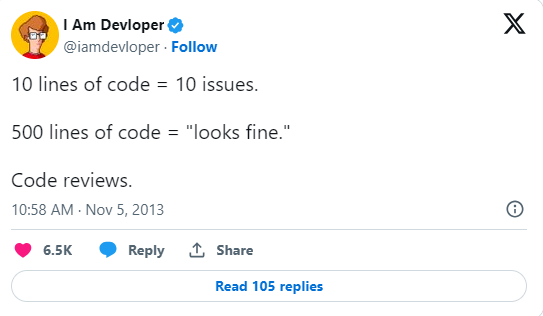

# [Stage #2](../../) Code Review Basics and Best Practices 💻

## Module Overview 📚

The "Code Review Basics and Best Practices" module is designed to equip students with the knowledge and skills necessary for conducting effective code reviews. This module covers the importance of code reviews in software development, techniques for performing code reviews, and best practices for providing constructive feedback.

## Learning Objectives 🎯

Students will:

- Understand the purpose and importance of code reviews in the software development lifecycle.
- Learn the techniques and tools used in conducting code reviews.
- Explore best practices for providing constructive, respectful, and effective feedback during code reviews.
- Develop skills in identifying code quality issues, such as bugs, code smells, and performance issues.
- Gain insight into the roles and responsibilities of both the reviewer and the developer during the code review process.

## Approximate Module Completion Time ⏱️

- **4 hours**

## Theory 📖

Students are encouraged to explore the following resources:

1. **Introduction to Code Reviews:**

   - [What is Code Review?](https://www.atlassian.com/agile/software-development/code-reviews)
   - [Code Review Best Practices by Michaela Greiler](https://www.michaelagreiler.com/code-review-best-practices/)

2. **Code Review Best Practices:**

   - [Code Review Guidelines for Humans](https://mtlynch.io/human-code-reviews-1/)
   - [Google's Code Review Guidelines - Looking for](https://google.github.io/eng-practices/review/reviewer/looking-for.html)
   - [Google's Code Review Guidelines - Writing Comments](https://google.github.io/eng-practices/review/reviewer/comments.html)

3. **Tools and Techniques:**

   - [Popular Code Review Tools](https://www.softwaretestinghelp.com/code-review-tools/)
   - [Code Review Best Practices on Roadmap.sh](https://roadmap.sh/best-practices/code-review)
   - [GitHub's Code Review Tool](https://github.com/features/code-review/)

4. **Webinars:**

   - [Code Review [RU]](https://www.youtube.com/watch?v=lRtUJFuIyv0)

## Practice 💻

- Complete the task ['Code Review'](../../tasks/code-review/)
- Complete the test "[St2] Code Review" in the RS-App > Auto Test.

## Additional Resources 📘

1. [Best Practices for Peer Code Review](https://smartbear.com/learn/code-review/best-practices-for-peer-code-review/)
2. [Code Review Pyramid](https://www.morling.dev/blog/the-code-review-pyramid/)
