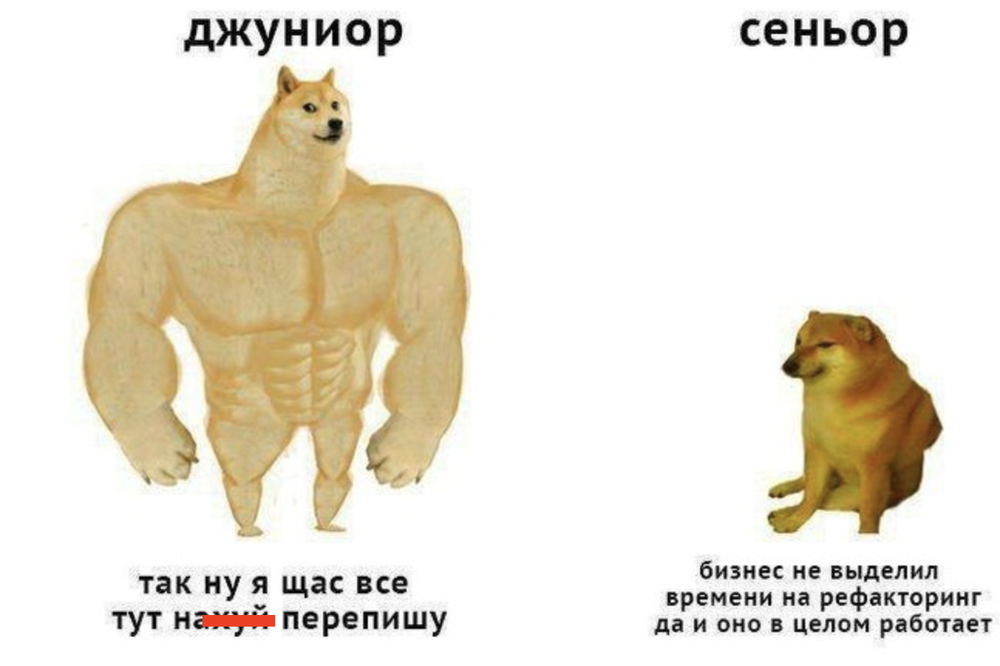
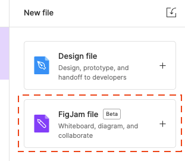
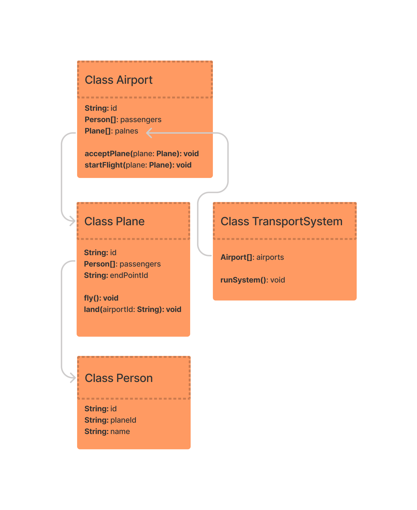
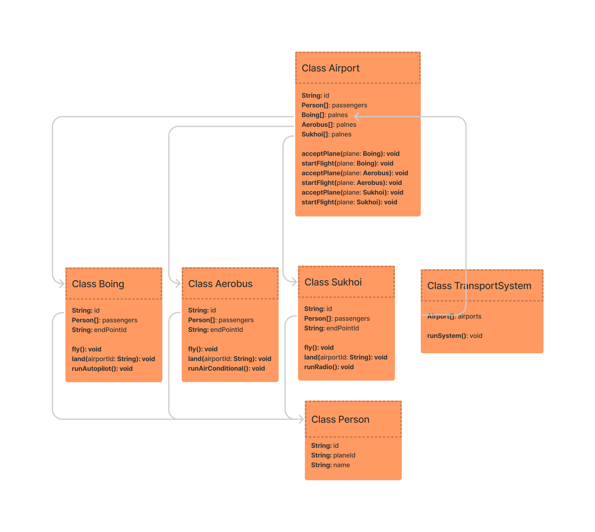
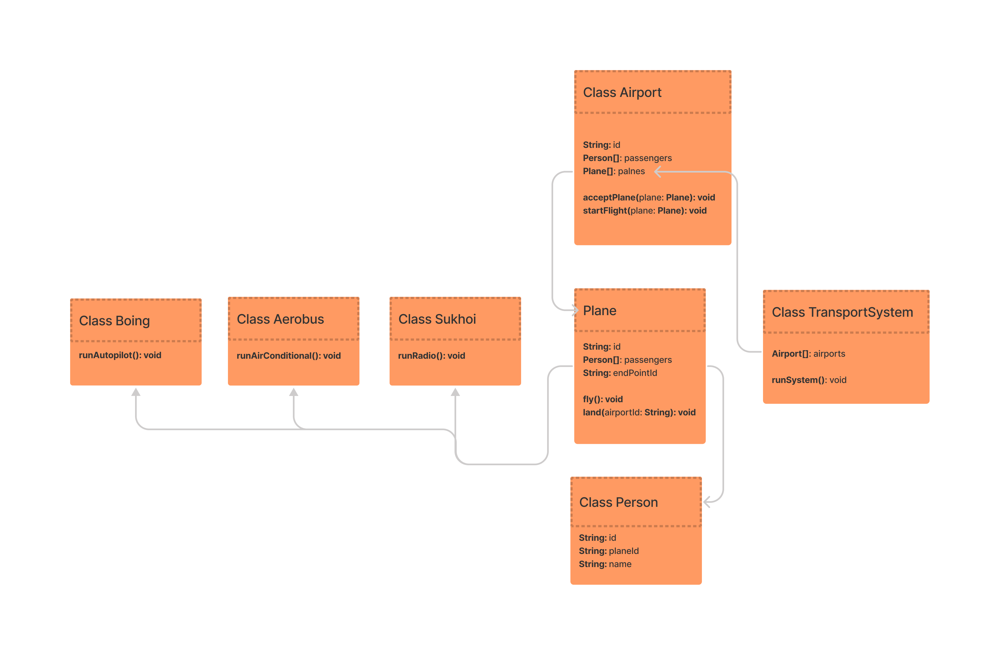

## Объектно ориентированное программирование (Базовые принципы)

&nbsp;&nbsp;&nbsp;&nbsp; С момента своего появления, Объектно ориентированное программирование (ООП) было и остается одной из самых популярных 
парадигм, которая позволяет писать модульный расширяемый код с использованием хорошо зарекомендовавших
себя практик. 
 
&nbsp;&nbsp;&nbsp;&nbsp; ООП включает в себя принципы, которые позволяют сократить дублирование кода до минимума, 
а так же более четко выявлять составные логические части программы, ограничивая области потенциальной ошибки. 
Четкая логическая структура программы в свою очередь позволяет выявлять наиболее удачные варианты построения
программы в ["паттерны проектирования"](../design-patterns/README.md) которые по факту являются общепринятыми лучшими практиками программирования,
способные помочь в построении программ любой сложности. 

&nbsp;&nbsp;&nbsp;&nbsp; Теперь давайте попробуем ответить на вопрос - в чем была главная идея ООП? Объекты - это философское понятие и 
появились они задолго до появления первых языков программирования. Все что вы видите вокруг себя: монитор, 
свой ноутбук, смартфон, кресло на котором сидите, стол на котором стоит ваш ПК - все это является объектами с 
точки зрения философии. А весь окружающий мир - не что иное, как композиции этих объектов. Человеку очень 
удобно работать с объектами, так как мы взаимодействуем с ними с самого детства. Именно это и явилось
причиной по которой эти принципы решили перенести в программирование, для того чтобы сделать написание
программ более интуитивно понятным для любого человека. Каждый из принципов связан с остальными, и как правило их
рассматривают все вместе.

Теперь давайте коротко перечислим все принципы ООП:

- Полиморфизм
- Наследование
- Инкапсуляция
---
- Абстракция
- Композиция

Теперь рассмотрим все основные принципы по отдельности:

## Абстракция

&nbsp;&nbsp;&nbsp;&nbsp; Абстракция является краеугольным камнем ООП. Но сначала отвлечемся и поговорим об
еще одном важном принципе программирования - [Big Design Up Front \(BDUF\)](https://en.wikipedia.org/wiki/Big_Design_Up_Front)
или если по-русски: сначала думаем, потом делаем. Слышали такую поговорку - Семь раз 
отмерь, один раз отрежь? Это как раз оно. Принцип интуитивно понятный и я настоятельно рекомендую им пользоваться всегда. 
Junior-разработчики, как правило - очень порывистые люди:



&nbsp;&nbsp;&nbsp;&nbsp; Это иногда может сыграть с ними злую шутку, так что в первую очередь, на старте вашей успешной карьеры, возьмите
этот принцип на вооружение. 

&nbsp;&nbsp;&nbsp;&nbsp; Но как же это все связанно с абстракцией? Ответ - напрямую. До того как вы напишите
первую строчку кода, в ООП парадигме вам необходимо продумать структуру вашей программы. Выделить
все ["Абстрактные модели"](https://ru.wikipedia.org/wiki/%D0%90%D0%B1%D1%81%D1%82%D1%80%D0%B0%D0%BA%D1%82%D0%BD%D0%B0%D1%8F_%D0%BC%D0%BE%D0%B4%D0%B5%D0%BB%D1%8C)
и продумать за что отвечать и какие методы и свойства должна нести каждая из них.

&nbsp;&nbsp;&nbsp;&nbsp; Что нам в этом может помочь? [Unified Modeling Language (UML)](https://ru.wikipedia.org/wiki/UML),
а также инструменты, которые позволяют удобно с ним работать. Стоит ли много времени уделять UML диаграммам?
Нет, достаточно просто запомнить что это язык построения диаграмм, базово запомнить принцип их построения, а далее
взять за правило, сначала хотя бы базово строить диаграмму, хоть минимально подумать о том, как части системы 
будут взаимодействовать друг с другом и только после этого начинать разработку. Это позволит
вам выявить самые дорогие и сложные ошибки - ошибки проектирования программы, до того как они больно ударят
по вам. 

&nbsp;&nbsp;&nbsp;&nbsp; Чем опасны ошибки проектирования? Ошибки в коде - это неприятно, они могут быть 
простыми и сложными, но как правило они всегда имеют решение. Ошибки проектирования, выявленные на этапе написания
кода - это самое опасное, что может быть для программиста, ведь для смены архитектуры придется выкинуть или максимально
отрефакторить весь написанный до этого код. Это всегда съедает очень много времени и ДЕНЕГ заказчика и может
отрицательно сказаться на вашей карьере. Хотите быть успешными? Тогда вперед! Вот инструменты которые вам помогут
с проектированием вашей программы написанной в ООП стиле:

 - новый функционал в [Figma](https://www.figma.com/)



- [DrawIO](https://www.draw.io/) - удобный инструмент для построения диаграмм любого вида.
- [miro](https://miro.com/)

*Все диаграммы в этом readme сделаны в figma

### Практика:

&nbsp;&nbsp;&nbsp;&nbsp; Давайте я покажу как этим пользоваться на практике. Напишем модель аэропорта? Модель будет максимально 
упрощенной, тем не менее она должна решать какую-то задачу. В нашем случае - это перемещение объекта "пассажир" из одного 
аэропорта в другой. Уже сейчас мы можем выделить несколько абстракций исходя из поставленной задачи: 
- Аэропорт - точка старта и назначения, точка концентрации самолетов и пассажиров
- Самолет - транспорт который перевезет пассажиров из одного аэропорта в другой
- Пассажир - объект которому нужно переместиться из одного аэропорта в другой 

Приступим. Диаграмму будем делать в фигме:



Самостоятельная работа - добавьте к диаграммам пилотов и бортпроводника. Пилоты должны управлять самолетом,
бортпроводники должны помогать пассажирам.

## Наследование

Дублирование кода это плохо. Дублирование кода, как правило, является самым простым способом решения задачи в лоб, но оно
всегда приводит к разбуханию кодовой базы и увеличению сложности программы, а это в свою очередь не позволяет
быстро понимать что именно происходит в программе. В общем случае нужно стараться свести дублирование кода к минимуму и всегда
придерживаться принципа [Don't Repeat Yourself(DRY)](https://ru.wikipedia.org/wiki/Don%E2%80%99t_repeat_yourself) - не
повторяйтесь. 

&nbsp;&nbsp;&nbsp;&nbsp; Наследование - это принцип ООП, который позволяет сводить дублирование кода к минимуму. С его
помощью при ПРАВИЛЬНО ПОСТРОЕННОЙ АБСТРАКЦИИ (смотри предыдущий путь) можно переиспользовать методы и свойства объектов. 
Само наследование как термин вам должно быть знакомо из биологии, это как раз возможность биологических организмов передавать
признаки от родителей к детям. Давайте продолжим развивать наш пример с аэропортом. Что будет если мы попытаемся
добавить типы самолетов? Давайте посмотрим на диаграмму:
 
 

&nbsp;&nbsp;&nbsp;&nbsp; Что мы видим? Мы добавили всего три типа самолетов (а их намного больше), а в итоге у нас добавилось три поля и 6 методов в 
аэропорт и еще три одинаковых класса по одному для каждого типа. Получается что на каждое N добавление типа нам нужно 
делать N изменений в коде проекта. А что будет если мы решим добавить какие-то изменения в самолеты? Наша кодовая база
превратиться в настоящий токсичный ад, который будет питаться вашими нервами. 

&nbsp;&nbsp;&nbsp;&nbsp; Как нам поможет наследование? Посмотрите внимательно на классы самолетов. Что мы видим? Они все одинаковые, а значит мы можем вынести повторяющиеся части в абстрактный класс, 
отнаследовать от него все наши типы самолетов. Само собой применять этот прием нужно только в случае если у типов есть какая-либо 
разница в поведении. Посмотрим на новую модель? 

 
 
При этом нам абсолютно неважно сколько типов самолета нужно ввести в проект.

Самостоятельная работа - обратите внимание, что и у пассажиров, и у созданных вами в предыдущей самостоятельной работе
людей (бортпроводников и пилотов) есть общие поля, как минимум имя и id. Плюс к тому, все они люди. Зачем нам одинаковые 
поля в нескольких классах? Давайте поправим это с помощью наследования! Вперед! За дело!

## Композиция

&nbsp;&nbsp;&nbsp;&nbsp; Композиция это мощный инструмент расширения функционала объекта. Он также знаком вам из реальной жизни. Как пример - стол за которым
вы сидите, вы и ваш компьютер - являются композицией объектов. С помощью композиции объекты получают новые функции
без необходимости их имплементации. 

&nbsp;&nbsp;&nbsp;&nbsp; Посмотрите внимательно на диаграмму которую мы создали выше, в частности на Аэропорт 
и Самолет. Они содержат массивы, но сами методы массивов не нужно реализовывать в этих классах, ведь они уже реализованы
в служебном классе Array. Таким образом мы получаем все возможности массива без написания нового массива. Сложно? 
Думаю для новичков это действительно может быть сложно для понимания. Давайте пример попроще. Все мы видели, например, 
машину. Автомобиль это литой объект? Нет. Она состоит из составных частей, отдельных объектов, каждый из которых несет какие-то
свои свойства, не свойственные другим деталям автомобиля. Но можем ли мы назвать допустим колесо автомобиля, автомобилем?
Нет. Автомобиль будет автомобилем только тогда, когда мы соберем его в одно единое целое из составных частей. Это и есть 
композиция.

&nbsp;&nbsp;&nbsp;&nbsp; В общем случае, если у вас есть выбор между расширением функционала через наследование и композицией - всегда 
выбирайте КОМПОЗИЦИЮ. Большое количество наследующихся друг от друга объектов, как правило, приводят к усложнению системы,
что приводит к большому количеству ошибок и более сложной адаптации новичков.

Самостоятельная работа - Найдите минимум три примера композиции в диаграмме нашей транспортной системы.

## Полиморфизм

&nbsp;&nbsp;&nbsp;&nbsp; Полиморфизм также пришел в программирование из реальной жизни. Посмотрите вокруг, на каждом шагу вы увидите объекты, которые
несмотря на разные типы, можно использовать одинаково. Например, любое устройство можно подключить к стандартной розетке через
стандартную вилку, и неважно компьютер это или электрочайник - все они начнут получать питание из электросети города. 
Именно способность разных объектов выполнять одинаковые действия и называется полиморфизмом в программировании.

&nbsp;&nbsp;&nbsp;&nbsp; Кстати давайте посмотрим на диаграмму выше. Что мы видим? Есть три типа самолетов, но во всех местах мы используем один 
тип от которого мы отнаследовались. 

Инструменты полиморфизма:
 - наследование от классов
 - абстрактные классы
 - интерфейсы
 
Когда мы наследуемся от какого-то класса или имплементируем какой-либо интерфейс - мы обязаны реализовать все его методы. Взамен мы получаем уверенность в том, что поведение программы не будет меняться даже при том, что используются разные типы объектов.
Это является одним из важнейших свойств которое используется во многих паттернах проектирования.
  
Самостоятельная работа - Согласитесь пассажиры бывают разными. Кто-то является Очень Важной Персоной, а кто-то взял
билет на распродаже. Но все они для самолета являются пассажирами. Давайте добавим еще как минимум 2 типа пассажиров.
А так же ответьте на вопрос: Является ли полиморфизмом, возможность любых самолетов садиться в
аэропортах, вне зависимости от типа этих самолетов?
   
## Инкапсуляция

&nbsp;&nbsp;&nbsp;&nbsp; Очень часто приходится слышать, что инкапсуляция - это сокрытие внутреннего состояния. Отчасти
это верно, но на самом деле, инкапсуляция - это нечто более обширное. Сокрытие внутреннего состояния - это всего лишь инструмент
инкапсуляции. Сама инкапсуляция сокрыта на уровне построения модели и абстракций. Ее суть заключается в построении
удобного, понятного и безопасного интерфейса взаимодействия пользователя и объекта. 

&nbsp;&nbsp;&nbsp;&nbsp; Давайте рассмотрим пример хорошей инкапсуляции. Все мы хоть раз в жизни видели автомобили
и хоть раз на нем ездили. Сам по себе, любой современный автомобиль - это сложный механизм, сочетание сложнейшей
электроники и четко выверенной механики. Но разве нужно быть автомехаником и инженером чтобы его просто водить?
Нет, у всех автомобилей четко выделен удобный интерфейс:

- Руль 
- Педали
- Рычаг коробки передач

&nbsp;&nbsp;&nbsp;&nbsp; Это все главные элементы управления которые позволяют ездить на автомобиле даже несовершеннолетним. Более того, хорошо
инкапсулированный интерфейс выступает поддержкой для остальных принципов, так как от хорошо инкапсулированного объекта
значительно проще отнаследоваться. 

&nbsp;&nbsp;&nbsp;&nbsp; Но давайте вернемся к примеру с автомобилем. Вы же понимаете что устройство 
автомобиля намного сложнее? Что было бы, если бы рядовому пользователю было доступно регулирование впрыска топлива в двигатель? 
Или автоматизированные механизмы подачи масла? Да, возможно кто-то бы и смог использовать ресурсы автомобиля более эффективно,
но большая часть пользователей, с большой вероятностью, в короткий срок вывели бы свой автомобиль из строя. Все эти элементы 
опасны для обычного пользователя, а значит они должны быть от него сокрыты.  

Инструменты инкапсуляции:

- Модификаторы доступа 

Самостоятельная работа - Мы уже говорили про автомобиль. А давайте теперь для верности создадим класс автомобиля, который
должен иметь: 
  - цилиндры и поршни, вращающие коленчатый вал
  - коленчатый вал, который должен вращаться
  - тормозные колодки, которые должны уметь сжиматься
  - охлаждающая жидкость, которая должна поступать в радиатор для охлаждения двигателя
  - сцепление, позволяющее включить передачу 
  - педали сцепления, газа и тормоза
  - ячейку и ключ зажигания
  - руль
  - рычаг коробки передач
  
 Само собой реальная машина намного сложнее, но нам хватит и этого. Прочитайте еще раз про инкапсуляцию, а затем
 напишите класс автомобиля который правильно инкапсулирует его функционал. 
 
 Все методы само собой условные и должны просто выводить в консоль сообщение вроде "Водитель нажал на педаль тормоза"

 ## Давайте теперь переведем диаграмму в код:
 
```typescript

class Person {
  constructor(
    public id: string,
    public name: string,
    public planeId: string
  ) {}
}

class Plane {
  constructor(
    public id: string,
    public passengers: Person[] = [],
    public endpointId: string,
  ){
  }

  fly(startAirport: Airport): void {
    console.log('Plane is fly!')
    startAirport.startFlight(this.id);
  };

  land(airports: Airport[], airportId: string): void {
    console.log('Plane landing successful!')
    const endPointAirport: Airport | undefined = airports.find((airport: Airport) => airport.id === airportId);

    if (endPointAirport) {
      endPointAirport.acceptPlane(this);
    }
  };
}

class Sukhoi extends Plane {
  runRadio(): void {
    console.log('Radio is on')
  }
}

class Boing extends Plane {
  runAutopilot(): void {
    console.log('Autopilot is on')
  }
}

class Aerobus extends Plane {
  runAirconditional(): void {
    console.log('Airconditional is on')
  }
}

class TransportSystem {
  constructor(
    public airports: Airport[] = []
  ) {
    const personsFirst = [
      new Person('1', 'jack', '1'),
      new Person('2', 'Nick', '1'),
      new Person('3', 'Rick', '1'),
    ]
    const personsSecond = [
      new Person('4', 'Jenny', '2'),
      new Person('5', 'Robert', '2'),
      new Person('6', 'Soniya', '2'),
    ]

    const firstAircrfts = [
      new Aerobus('1', personsFirst, '2'),
      new Sukhoi('2', personsSecond, '2'),
    ];

    this.airports = [
      new Airport('1', firstAircrfts, []),
      new Airport('2')
    ]
  }

  runSystem(): void {
    const [firstPort] = this.airports;

    firstPort.planes.forEach(plane => {
      plane.fly(firstPort);
      plane.land(this.airports, plane.endpointId)
    })
  }
}

class Airport {
  constructor(
    public id: string,
    public planes: Plane[] = [],
    public passengers: Person[] = []
  ) {}

  public startFlight(planeId: string): void {
    this.planes = this.planes.filter(({id}) => id !== planeId);
  }

  public acceptPlane(plane: Plane): void {
    this.planes.push(plane);
    this.passengers = [
      ...this.passengers,
      ...plane.passengers
    ]
    plane.passengers = [];
  }
}

```
## Практика
Вам необходимо пройти тест "OOP Test" в RS APP > Auto Test
## Полезные статьи

- [короткая статья на tproger](https://tproger.ru/translations/oop-principles-cheatsheet/)
- [неплохая статья на хабре](https://habr.com/ru/post/463125/)