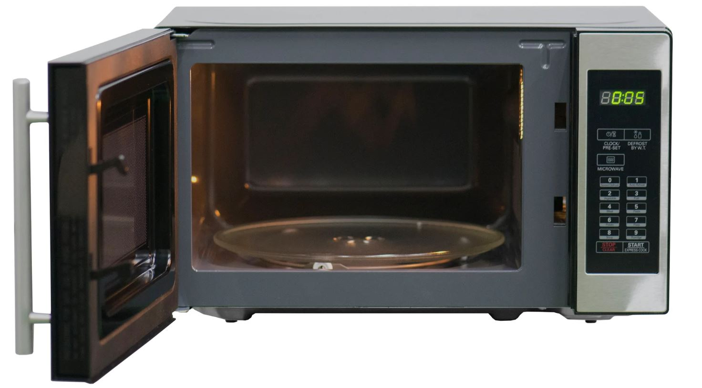

# Объектно-ориентированное программирование

## Определение и базовые принципы

Объектно-ориентированное программирование (далее — ООП) — одна из наиболее популярных методологий программирования. В рамках ООП мы рассматриваем программу как совокупность объектов, выполняющих различные функции и взаимодействующих друг с другом. Объекты являются экземплярами определенного класса, а классы образуют иерархию наследования.

Базовые принципы ООП:

- **Наследование**
- **Инкапсуляция**
- **Полиморфизм**

Иногда к ним добавляют **Абстракцию**

### Наследование

Как уже было сказано ранее, классы образуют иерархию наследования. Наследование — это механизм, позволяющий описать новый класс на основе уже существующего с добавлением новых свойств и методов. Новый класс называется потомком (дочерним, производным), а класс, на основе которого происходит создание нового, называется родителем (предком, базовым).
Например, у нас есть базовый класс `Person`:

```ts
class Person {
  public name: string;
  public age: number;

  constructor(name: string, age: number) {
    this.name = name;
    this.age = age;
  }

  public sayHi() {
    console.log(`Hello, my name is ${this.name}!`);
  }
}

const somePerson = new Person("John", 22);

somePerson.sayHi(); // Hello, my name is John!
```

У него есть различные свойства (`name`, `age`) и метод `sayHi`. Предположим, что мы хотим создать класс Employee, который должен иметь те же свойства и методы, что и Person, но помимо них иметь дополнительное свойство `salary`. Конечно, мы можем создать еще один класс аналогичным образом:

```ts
class Person {
  public name: string;
  public age: number;

  constructor(name: string, age: number) {
    this.name = name;
    this.age = age;
  }

  public sayHi() {
    console.log(`Hello, my name is ${this.name}!`);
  }
}

const somePerson = new Person("John", 22);

somePerson.sayHi(); // Hello, my name is John!

class Employee {
  public name: string;
  public age: number;
  salary: number;

  constructor(name: string, age: number, salary: number) {
    this.name = name;
    this.age = age;
    this.salary = salary;
  }

  public sayHi() {
    console.log(`Hello, my name is ${this.name}!`);
  }
}

const someEmployee = new Employee("Kumar", 33, 2500);

somePerson.sayHi(); // Hello, my name is Kumar!
```

Однако при таком подходе большое количество кода повторяется, что противоречит принципу [DRY](https://en.wikipedia.org/wiki/Don%27t_repeat_yourself). Вместо этого мы можем создать класс `Employee` **на основе** класса `Person`:

```ts
class Person {
  public name: string;
  public age: number;

  constructor(name: string, age: number) {
    this.name = name;
    this.age = age;
  }

  public sayHi() {
    console.log(`Hello, my name is ${this.name}!`);
  }
}

// Contains properties and methods from Person + salary
class Employee extends Person {
  public salary: number;

  constructor(name: string, age: number, salary: number) {
    super(name, age);
    this.salary = salary;
  }
}

const someEmployee = new Employee("Kumar", 33, 2500);
someEmployee.sayHi(); // Hello, my name is Kumar!
```

В нашем примере класс Employee наследует от класса Person. При необходимости иерархия наследования может быть более сложной:

```ts
class Person {
  public name: string;
  public age: number;

  constructor(name: string, age: number) {
    this.name = name;
    this.age = age;
  }

  public sayHi() {
    console.log(`Hello, my name is ${this.name}!`);
  }
}

// Contains properties and methods from Person + salary
class Employee extends Person {
  public salary: number;

  constructor(name: string, age: number, salary: number) {
    super(name, age);
    this.salary = salary;
  }
}

// Contains properties and methods from Employee + department
class Manager extends Employee {
  public department: string;

  constructor(name: string, age: number, salary: number, department: string) {
    super(name, age, salary);
    this.department = department;
  }
}
```

### Инкапсуляция

В ООП одним объектам чаще всего не нужно и даже вредно знать внутреннее устройство других объектов для того, чтобы успешно с ними взаимодействовать. Аналогия из реального мира: микроволновая печь имеет сложное внутреннее устройство  
  
И если мы захотим использовать ее без защитного кожуха, то мы можем ее сломать или получить удар током. Для того, чтобы воспользоваться микроволновкой, нам не нужно в деталях понимать ее устройство и принцип работы, она предоставляет нам удобный и безопасный способ взаимодействия - через интерфейс пользователя  
  
В качестве примера рассмотрим класс `Timer`:

```ts
class Timer {
  private maxInterval: number;
  private minInterval: number;
  private currentTimer?: number;
  private interval?: number;
  private count: number;

  constructor(interval: number) {
    this.validateTimeout(interval);
    this.interval = interval;
    this.maxInterval = 1000;
    this.minInterval = 100;
    this.count = 1;
  }

  public start() {
    if (this.currentTimer) {
      console.log("Timer already started");
      return;
    }

    this.currentTimer = setInterval(() => {
      console.log(`Tick ${this.count++}`);
    }, this.interval);
  }

  public stop() {
    if (!this.currentTimer) {
      console.log("Timer already stopped");
      return;
    }

    this.clear();
  }

  public reset() {
    this.stop();
    this.start();
  }

  private clear() {
    clearInterval(this.currentTimer);
    this.count = 1;
    this.currentTimer = undefined;
  }

  private validateTimeout(timeout: number) {
    if (timeout < this.minInterval || timeout > this.maxInterval) {
      throw new Error(
        `Invalid interval! The allowed values are in the range from ${this.minInterval} to ${this.maxInterval}`,
      );
    }
  }
}
```

Класс общается с внешним миром посредством интерфейса - получает снаружи только необходимое для инициализации значение `interval` и предоставляет для взаимодействия публичный API - методы `start`, `stop` и `reset`, которые позволяют его использовать

```ts
const timer = new Timer(500);

timer.start();

timer.reset();

timer.stop();
```

В то же время его внутреннее устройство неважно и детали имплементации недоступны снаружи.

### Полиморфизм

Принцип полиморфизма в ООП позволяет нам иметь множество реализаций одного интерфейса в классах-наследниках в зависимости от выполняемых задач. Например, у нас есть базовый **абстрактный** класс `Transport`.

```ts
abstract class Transport {
  type: string;
  model: string;

  constructor(type: string, model: string) {
    this.type = type;
    this.model = model;
  }

  // Abstract method
  abstract move(): void;
}
```

Абстрактным он называется потому, что содержит абстрактный метод `move` и не предполагает создания своих экземпляров напрямую.

```ts
const transport = new Transport("Car", "Porsche"); // Error
```

Абстрактный метод `move` не реализуется для класса, в котором описан, однако должен быть реализован для его неабстрактных потомков:

```ts
abstract class Transport {
    type: string;
    model: string;

    constructor(type: string, model: string) {
        this.type = type;
        this.model = model;
    }

    // Abstract method
    abstract move(): void;
}

class Car extends Transport {
    constructor(type: string, model: string) {
        super(type, model)
    }

    public move(): {
        console.log('Moving on the road');
    }
}

class Plane extends Transport {
    constructor(type: string, model: string) {
        super(type, model)
    }

    public move() {
        console.log('Flying in the sky');
    }
}

class Ship extends Transport {
    constructor(type: string, model: string) {
        super(type, model)
    }

    public move() {
        console.log('Moving on the water');
    }
}
```

Как мы видим из примера, различные виды транспорта имеют метод `move`, но каждый из них реализует его по своему, что и является проявлением полиморфизма.

### Абстракция

Принцип абстракции в ООП означает, что каждый объект описывается минимальным количеством полей и методов, при этом с достаточной точностью для решаемой задачи. Чем меньше характеристик содержит объект, тем лучше абстракция. В качестве примера абстракции можно рассмотреть вышеописанный класс `Timer` - он содержит только минимально необходимые для своей работы публичные методы в интерфейсе, при этом несущественные детали их реализации скрыты внутри и не имеют значения для его использования.

## Практика

Вам необходимо пройти тест "OOP Test" в RS APP > Auto Test

## Полезные статьи

- [короткая статья на tproger](https://tproger.ru/translations/oop-principles-cheatsheet/)
- [неплохая статья на хабре](https://habr.com/ru/post/463125/)
