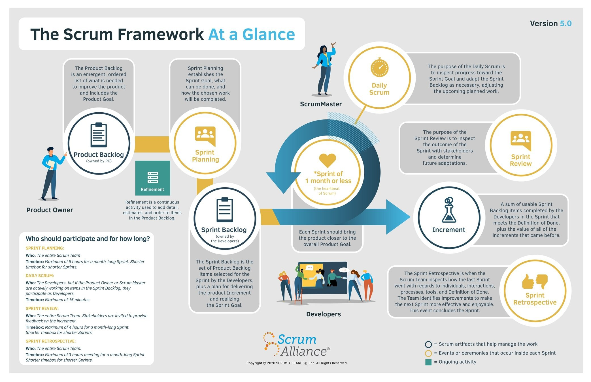

# [Stage#2.](../../) Scrum

## Module Overview 📚

In this module, students will explore Agile project management and product development frameworks, focusing on Scrum, a flexible project management method, and Kanban, a framework for visualizing and managing work. Through understanding these methodologies, students will acquire valuable insights into effectively managing projects, fostering collaboration within teams, and adapting to changing requirements in dynamic environments.

## Learning Objectives 🎯

Students will:

- Gain understanding of the Agile project management and product development approach.
- Learn the Scrum framework, a flexible project management methodology, including its key components such as sprints, roles, artifacts, and events.
- Familiarize themselves with the Kanban framework, another approach to project management, including its key elements such as visual boards, work in progress (WIP) limits, continuous delivery, and pull system.
- Understand the key distinctions between the Scrum and Kanban frameworks to adeptly select and implement the most suitable methodology for their projects.

## Approximate Module Completion Time ⏱️

- **4 hours**

## Theory 📖

Students are encouraged to study the following resources:

1. **Agile:**

   - [The Agile Coach](https://www.atlassian.com/agile)
   - [Agile Project Management](https://www.atlassian.com/agile/project-management)
   - [Manifesto for Agile Software Development](https://agilemanifesto.org/)

2. **Agile Frameworks:**

   - [Kanban](https://www.atlassian.com/agile/kanban)
   - [What is Scrum and how to get started](https://www.atlassian.com/agile/scrum)
   - [Kanban vs. Scrum: which agile are you?](https://www.atlassian.com/agile/kanban/kanban-vs-scrum)

## Practice 💻

- Complete the test "[St2] Scrum. Kanban" in the RS-App > Auto Test.

## Additional Resources 📘

Expand your knowledge with these additional materials:

- **To Read:**

  - [Kanban vs. Scrum: What's the Difference?](https://www.coursera.org/articles/kanban-vs-scrum)
  - [Scrum poker for agile projects](https://www.atlassian.com/blog/platform/scrum-poker-for-agile-projects)
  - [Scrumban](https://www.productplan.com/glossary/scrumban/)
  - [What is Lean methodology?](https://www.atlassian.com/agile/project-management/lean-methodology)
  - [5 Key DevOps principles](https://www.atlassian.com/devops/what-is-devops)
  - [DevOps vs. Agile](https://www.atlassian.com/devops/what-is-devops/agile-vs-devops)

- **To Watch:**

  - [Agile Methodology Tutorial for Beginners](https://www.youtube.com/watch?v=KNBHQ0pyaG8)
  - [Google Project Management Certificate Playlist](https://www.youtube.com/playlist?list=PLTZYG7bZ1u6puLWxUtqAjZkIB4dB_JFzk)

- **Tools:**

  - [Story Point Poker](https://storypoint.poker/)
  - [EasyRetro](https://easyretro.io/)
