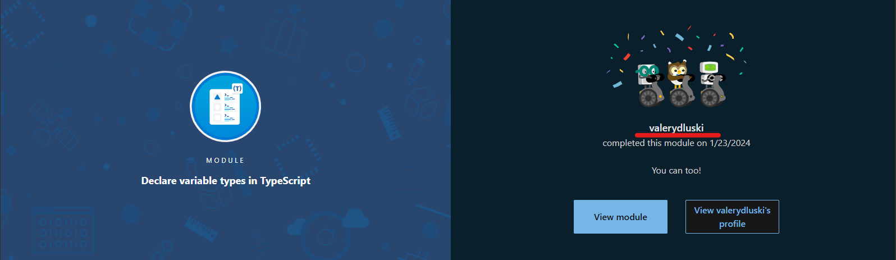

# TypeScript Essentials

## Overview

Dive into the world of TypeScript and enhance your JavaScript skills with this comprehensive learning path. We've handpicked a series of modules from Microsoft Learn to provide you with a deep understanding of TypeScript's capabilities. Your goal is to complete each module, earn badges, and compile these badges in a Markdown (MD) file as a testament to your TypeScript expertise.

### 📌 Important Note

- The name on each badge must match the student's GitHub username to ensure accurate recognition and record-keeping.
  

### 📖 Modules to Complete

1. **[Getting Started with TypeScript](https://learn.microsoft.com/en-us/training/modules/typescript-get-started/)**: Discover the basics of TypeScript and understand how it enhances JavaScript development.
2. **[Declare Variable Types in TypeScript](https://learn.microsoft.com/en-us/training/modules/typescript-declare-variable-types/)**: Learn how to define and use variable types for more robust code.
3. **[Implement Interfaces in TypeScript](https://learn.microsoft.com/en-us/training/modules/typescript-implement-interfaces/)**: Master the use of interfaces to enforce structure on objects and classes.
4. **[Develop Typed Functions in TypeScript](https://learn.microsoft.com/en-us/training/modules/typescript-develop-typed-functions/)**: Explore how to create and use typed functions for clearer, more predictable code.
5. **[Declare and Instantiate Classes in TypeScript](https://learn.microsoft.com/en-us/training/modules/typescript-declare-instantiate-classes/)**: Get hands-on experience with classes, one of the core concepts of TypeScript.
6. **[Generics in TypeScript](https://learn.microsoft.com/en-us/training/modules/typescript-generics/)**: Understand how to use generics for creating reusable and flexible components.
7. **[Work with External Libraries in TypeScript](https://learn.microsoft.com/en-us/training/modules/typescript-work-external-libraries/)**: Learn to integrate and utilize external libraries in your TypeScript projects.
8. **[Organize Code with Namespaces in TypeScript](https://learn.microsoft.com/en-us/training/modules/typescript-namespaces-organize-code/)**: Dive into organizing code effectively using namespaces.

### 📝 Task Requirements

- **Complete Each Module**: Go through the modules thoroughly and absorb the concepts.
- **Earn Badges**: Each module completion will reward you with a badge. Collect these badges as proof of your learning.
- **Compile Badges in Markdown**:
  - Create an MD file where you'll list all the badges earned.
  - Ensure to link each badge to its corresponding module for easy reference.
  - Your Markdown file should be well-organized and visually appealing.

### 🛠️ Markdown File Example

```markdown
# My TypeScript Journey: Earned Badges 🏆

## Badges Overview

Here is a collection of badges I earned from completing Microsoft Learn's TypeScript modules:

1. **Getting Started with TypeScript**: [Badge](badge-link)
2. **Declare Variable Types in TypeScript**: [Badge](https://learn.microsoft.com/api/achievements/share/en-us/ValeryDluski/HYTXXB38?sharingId=10189BC4D7E76BC1)
3. **Implement Interfaces in TypeScript**: [Badge](badge-link)
4. **Develop Typed Functions in TypeScript**: [Badge](badge-link)
5. **Declare and Instantiate Classes in TypeScript**: [Badge](badge-link)
6. **Generics in TypeScript**: [Badge](badge-link)
7. **Work with External Libraries in TypeScript**: [Badge](badge-link)
8. **Organize Code with Namespaces in TypeScript**: [Badge](badge-link)

## Reflections

[Add your personal reflections on what you learned in each module and how it contributes to your development skills]
```

## 🚀 Working with Repository Rules

### Repository Setup

1. **Private School Repository**: All work must be done in a private school repository.

### Branch Management

1. **Create Branch**: Begin by creating a new branch `typescript-essentials` from the `main` branch.

### Pull Requests

1. **Open Pull Request**: Once you complete a module, open a pull request (PR) from `typescript-essentials` to `main`.
2. **PR Description**: Format the PR description in accordance with the [PR Description requirements](https://docs.rs.school/#/en/pull-request-review-process?id=description-example).

## 💼 Task Submission to Cross-Check Rules

1. **Cross-Check Submission**: Submit your task for cross-check by deploying your Markdown file with all your badges and reflections to `gh-pages`. Submit the link to the deployed Markdown file on `gh-pages` for cross-check evaluation in the RS App.

### Evaluation Criteria: 📋

### CrossCheck Criteria (50 points): ✅

[Cross-Check-Criteria](./CrossCheckCriteria.md)

## 🌟 Final Goal

Upon completing these modules, you'll not only deepen your understanding of TypeScript but also have a personalized showcase of your learning journey. This documentation will serve as a valuable asset in your portfolio, demonstrating your commitment and expertise in TypeScript.

Best of luck, and happy learning!
