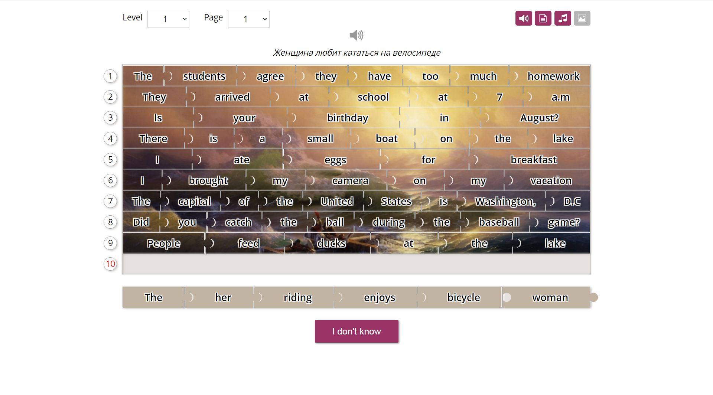
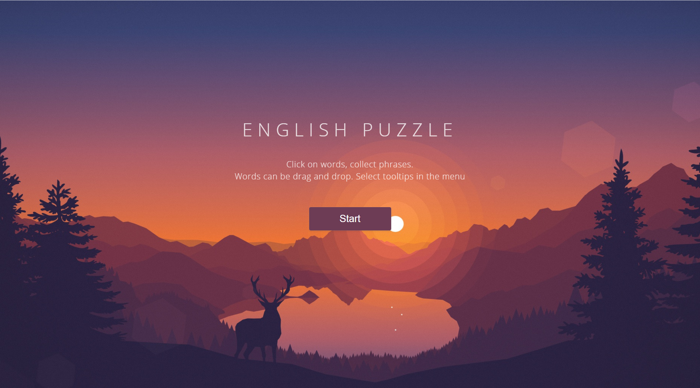
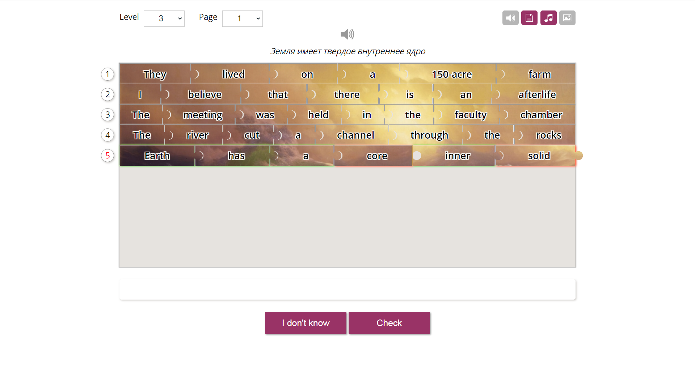
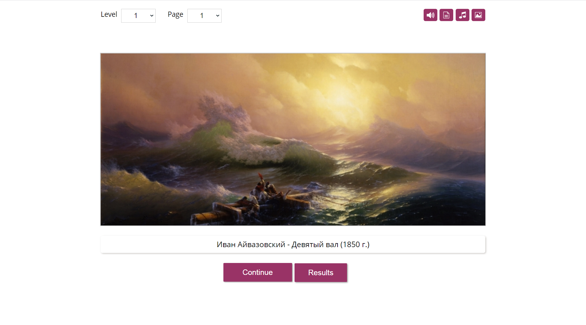
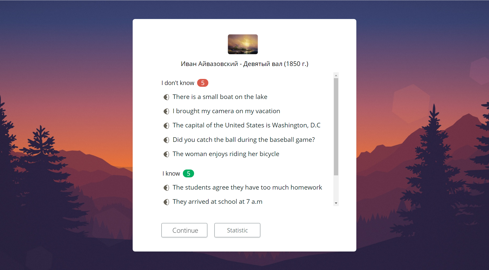

# RSS Puzzle Task Overview 🧩

## Introduction 🌟

**RSS Puzzle** is an interactive mini-game aimed at enhancing English language skills. Players assemble sentences from jumbled words, inspired by Lingualeo's Phrase Constructor training. The game integrates various levels of difficulty, hint options, and a unique puzzle-like experience with artwork.

## Prototype 🚀

- **Inspiration**: Lingualeo's Phrase Constructor training.
- **Testing**: Available at [Lingualeo](https://lingualeo.com/ru/training/phrasePuzzle) after registration and adding sentences from [recommended phrasebooks](https://lingualeo.com/ru/dictionary/sets-recommended-phrasebooks).

## Application Structure 🏗️

### Core Components

- **User Name Entry**: Personalized access with name storage in local storage 📝.
- **Global Toolbar**: Includes logout functionality 🔙.
- **Start Screen**: Welcomes users with game information and a 'Start' button 🌐.
- **Main Game Page**: Features gameplay area with word cards, hint options, sentence assembly, and round progression ⚙️🔊✍️📋.
- **Statistics Page**: Displays round performance, sentence categorization, audio pronunciation, and artwork information 🖼️.

### Data Set 📚

- **Word Collection**: A set of 3600 English words sorted by difficulty, accessible [here](https://github.com/rolling-scopes-school/rss-puzzle-data/tree/main/data).
- **Audio Files**: Pronunciation audio files available [here](https://github.com/rolling-scopes-school/rss-puzzle-data/tree/main/files).

## Functional Blocks 🧱

### User Interaction

- **Level and Round Selection**: Choose from six difficulty levels and various rounds 🎚️.
- **Sentence Assembly**: Drag-and-drop functionality for forming sentences 👆.
- **Hint Options**: Includes translation, pronunciation, and puzzle image hints 💡.
- **Statistics and Progress Tracking**: Review performance and artwork on the statistics page 📊.

### Gameplay Mechanics

- **Artwork Puzzle**: Assemble sentences to reveal parts of an artwork puzzle 🧩.
- **Interactive Hints**: Toggle hints for enhanced gameplay experience 🔄.
- **Progressive Difficulty**: Gradual increase in challenge across levels 📈.

## Image Resources for Artwork Puzzles 🌠

- **Original Data**: Available at [this GitHub repository](https://github.com/rolling-scopes-school/rss-puzzle-data/tree/main/images).
- **Custom Collection**: Option for students to create their own image collection.

## Gameplay Workflow 🎮

1. **Name Entry**: Required for game access 🚪.
2. **Start Screen**: Introduction and transition to gameplay 🌐.
3. **Round Playthrough**: Engage in sentence assembly, utilize hints, and progress through rounds 🔁.
4. **Results and Reflection**: Review round statistics and artwork achievements 📈📉.

## Repository Rules 🗃️

[Repository Rules](./RepositoryRules.md)

## Technical Requirements 🛠️

- **Language**: Application written in TypeScript.
- **Allowed**: Use of preprocessors and lodash.
- **Prohibited**: Frameworks like Angular, Vue, React, etc.
- **Prohibited**: jQuery.

## Submission Rules 📤

### Cross-Check

- **Deployment**: Submit the link to the deployed application.
- **Platform**: Submit on RS App, [Cross-Check Submit](https://app.rs.school/course/student/cross-check-submit?course=js-fe-2023Q4).

### Mentor Review

- **Pull Request**: Submit the link to the pull request with detailed description and self-assessment.
- **Platform**: Submit for mentor review on the student dashboard in RS App, [Student Dashboard](https://app.rs.school/course/student/dashboard?course=js-fe-2023Q4).

## Evaluation Criteria: 📋

### CrossCheck Criteria (245 points): ✅

[Cross-Check Criteria](./CrossCheckCriteria.md)

### Mentors Check Criteria (170 points): ✅

[Mentors Check Criteria](./MentorsCheckCriteria.md)

## 🌟 Final Goal

Upon completing these modules, you'll not only deepen your understanding of TypeScript but also have a personalized showcase of your learning journey. This documentation will serve as a valuable asset in your portfolio, demonstrating your commitment and expertise in TypeScript.

May you find the perfect sequence for your words as you navigate through the challenges of this puzzle game. Best of luck, and happy linguistic journey! 🎉🔍

## Q&A Session

[RSS Puzzle Q&A [RU]](https://youtu.be/81om13PW1h0)
