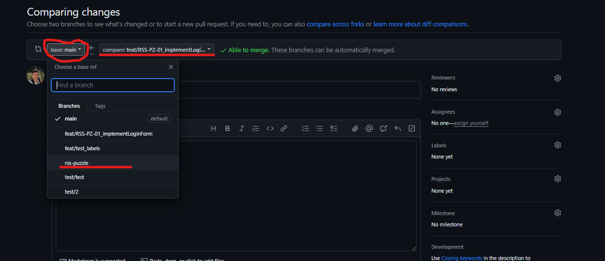
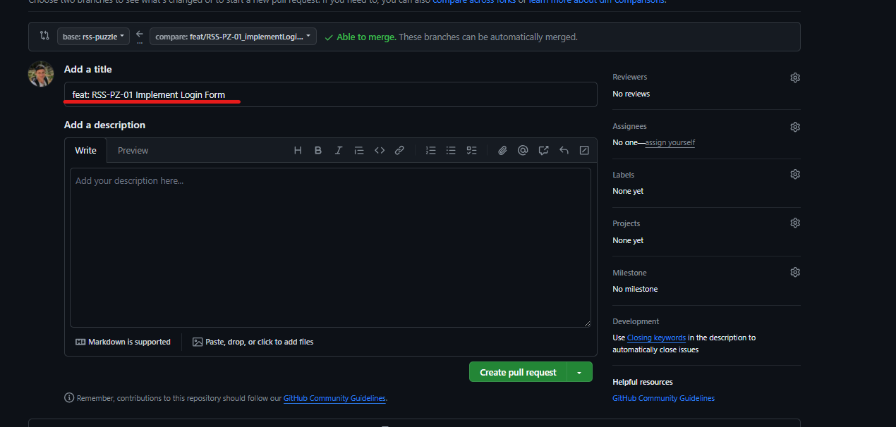
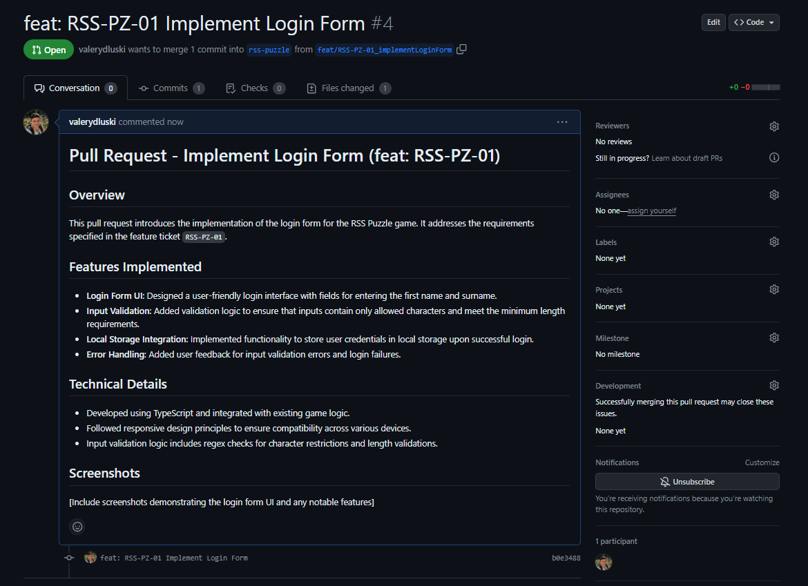
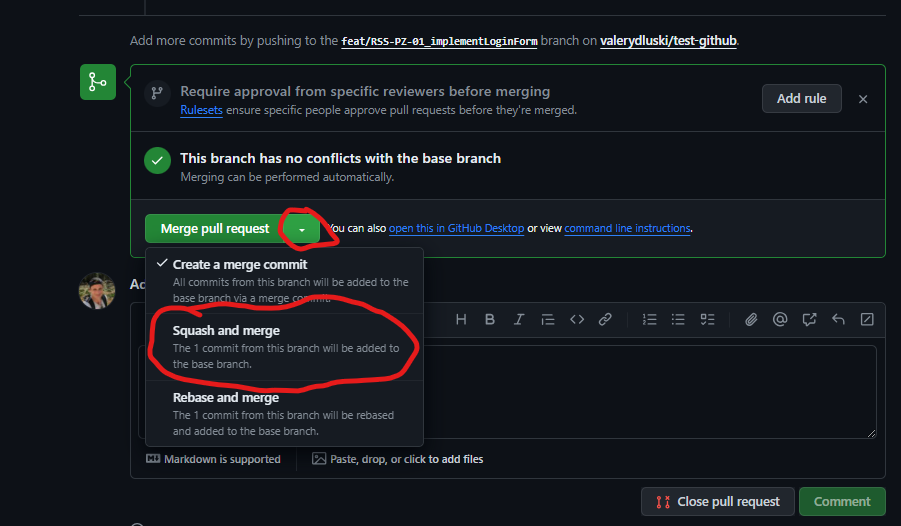

## Repository Rules for RSS Puzzle 🗃️🚀

### Working in the Repository

- **Repository**: Utilize the private school repository for all development work.
- **Base Branch**: Use the `rss-puzzle` branch as the starting point for new features.

### Feature Development and Branch Naming

- **Feature Branches**: Create a new branch for each feature or fix. Branch off from `rss-puzzle`.
- **Naming Convention**: Name branches with a clear reference to the feature or issue, e.g., `feat/RSS-PZ-01_implementLoginForm`. If there is no pre-existing issue number, you may create your own for organizational purposes.

### Pull Requests (PRs)

- **Creating PRs**: Upon completing a feature, create a pull request from your feature branch to the `rss-puzzle` branch.
- **PR Title**: Format the title to reflect the content, e.g., `feat: RSS-PZ-01 Implement Login Form`.
- **PR Description**: Briefly describe the work done in the PR for clarity and tracking.
- **Attention to Target Branch**: Ensure the PR is targeting the `rss-puzzle` branch for merging.

### Merging and Updating

- **Squash and Merge**: Use the squash merging strategy to combine all commits from the feature branch into a single commit when merging into `rss-puzzle`.
- **Updating Local Branch**: After merging, pull the latest changes from the remote `rss-puzzle` branch using `git pull`.
- **Continuing Development**: For new features, branch off again from the updated `rss-puzzle`.

### Screenshot Illustration

