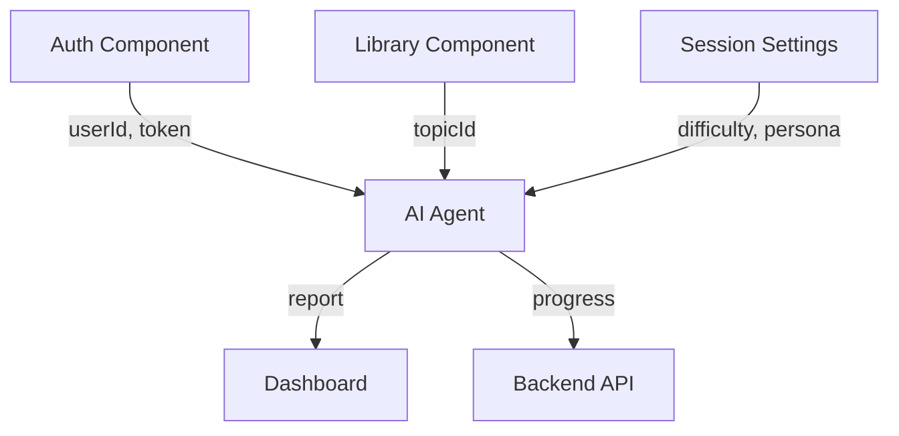

# RS Tandem: AI Agent Component

> **Сложность:** ⭐⭐⭐⭐
> **Время:** 4-6 недель (рекомендуется брать целиком одному человеку)

---

### AI Agent ⭐⭐⭐⭐

**Описание:** Полноценный AI-интервьюер. Один сложный компонент, который включает несколько подсистем.

**Что входит в компонент:**
1. **Chat UI** — интерфейс чата
2. **LLM Backend** — интеграция с моделью
3. **Streaming** — реальное время ответов
4. **Context Manager** — управление историей диалога

**Функциональность:**
- Чат с AI-агентом
- Streaming ответов (эффект печатной машинки)
- Markdown rendering (код, списки)
- Память контекста в рамках сессии

**Технические требования:**
- **No "Magic" SDKs:** Логика общения с LLM на чистом JS/TS (без LangChain, Vercel AI SDK)
- **Custom Streaming:** `fetch` + `ReadableStream`
- **Context Awareness:** Агент помнит контекст беседы

**Рекомендация:** Один человек из команды берет этот компонент целиком.


## ⚠️ Важно: Что нужно изучить

Этот компонент требует знаний, которые **не входят в обязательную программу RS School**:

| Технология | Статус в программе | Нужно изучить |
|------------|-------------------|---------------|
| **Streaming API** | ❌ Не изучается | Да (ReadableStream) |
| **LLM/AI APIs** | ❌ Не изучается | Да (OpenAI format) |
| **Backend разработка** | ⚠️ Базовые знания | Углубить (Node/Express) |
| **WebSockets / SSE** | ✅ Fun Chat | Опционально |

---

## 📋 Что включает компонент

AI Agent — это **один сложный компонент**, который включает несколько подсистем:

```
AI Agent Component
├── Chat UI (Frontend)
│   ├── Message List
│   ├── Input Field
│   └── Streaming Display
├── Streaming Parser (Frontend)
│   └── Markdown Renderer
├── Context Manager (Backend)
│   ├── History Storage
│   └── Token Optimization
└── LLM Integration (Backend)
    ├── API Client
    └── Prompt Templates
```

---

## 🔗 Интеграция с другими компонентами

AI Agent не работает изолированно — он связан с другими частями приложения:



### Что AI Agent получает:

| От компонента | Данные | Описание |
|---------------|--------|----------|
| **Auth** | `userId`, `token` | Идентификация пользователя |
| **Library** | `topicId` | Выбранная тема (Core JS, TypeScript, etc.) |
| **Session Settings** | `difficulty`, `persona`, `language` | Настройки сессии |

### Что AI Agent отправляет:

| В компонент | Данные | Описание |
|-------------|--------|----------|
| **Dashboard** | `report` | Отчет о сессии (оценка, рекомендации) |
| **Backend API** | `progress` | Прогресс пользователя |
| **Backend API** | `history` | История чата для сохранения |

---

## 🎯 Функциональность

### Обязательная (Baseline)

1. **Чат с AI-агентом**
   - Пользователь отправляет сообщение
   - Агент отвечает
   - История сохраняется в рамках сессии

2. **Streaming ответов**
   - Ответ появляется постепенно (эффект "печатной машинки")
   - Реализация через `fetch` + `ReadableStream` (или SSE)

3. **Markdown rendering**
   - Агент может отвечать с кодом, списками, ссылками
   - Код подсвечивается (Syntax Highlighting)

### Опциональная (Advanced)

| Фича | Сложность | Описание |
|------|-----------|----------|
| **Agent Persona** | ⭐⭐ | Разные стили общения (строгий/добрый) |
| **Smart Context** | ⭐⭐⭐ | Умная обрезка истории для экономии токенов |
| **Robust Streaming** | ⭐⭐⭐ | Markdown без "глитчей" при рендеринге |
| **Tool Calling** | ⭐⭐⭐⭐ | Агент может вызывать функции (валидация кода) |

---

## 🛠️ Технические требования

### 1. No "Magic" SDKs ❌

**Запрещено использовать:** LangChain, Vercel AI SDK, AutoGPT.
**Разрешено:** `openai` (только как HTTP клиент), `marked`, `prismjs`.

**Цель:** Понять, как работают LLM "под капотом", а не просто импортировать библиотеку.

### 2. Custom Streaming (Frontend) 

### 3. OpenAI Compatible API
Используйте провайдеры, совместимые с форматом OpenAI. Это позволяет менять модели, меняя только `baseURL`.

| Провайдер | URL | Примечание |
|-----------|-----|------------|
| **Groq** | console.groq.com | 🚀 Очень быстрый, есть Free Tier |
| **NVIDIA Build** | build.nvidia.com | ✅ Free credits |
| **OpenAI** | api.openai.com | 💰 Платно |
| **Ollama** | localhost:11434 | 🏠 Локально (бесплатно) |

---

## 🧪 Mock Mode (Как разрабатывать без боли)

**Проблема:** При разработке UI вы будете обновлять страницу сотни раз. Если каждый раз дергать реальный API:
1. Закончатся лимиты/деньги.
2. Будете ждать ответа по 5 секунд.

**Решение:** Реализуйте Mock-режим.

```typescript
// api/mock-ai.ts
export async function* mockStreamResponse(message: string) {
  const mockAnswer = "Это **тестовый ответ** от агента.\n\nВот пример кода:\n```js\nconsole.log('Hello');\n```";
  
  const tokens = mockAnswer.split(/(.{1,5})/g); // Разбиваем на кусочки
  
  for (const token of tokens) {
    await new Promise(r => setTimeout(r, 50)); // Эмуляция задержки
    yield token;
  }
}
```

---

## 🔧 Tool Calling (Advanced ⭐⭐⭐⭐)

**Что это:** Агент сам решает, когда вызвать функцию (например, проверить синтаксис кода).

### Пример сценария

1. **User:** "Вот мой код: `functon test() {}`"
2. **LLM:** Видит ошибку, решает вызвать инструмент `check_syntax`.
3. **Backend:** Выполняет функцию `check_syntax`.
4. **Backend:** Возвращает результат агенту.
5. **LLM:** Формирует ответ пользователю: "У вас опечатка в слове function".

---

### Agent Persona: Примеры

**Строгий интервьюер (`strict`):**
```
Ты — строгий технический интервьюер в крупной IT-компании.

Правила:
1. НЕ принимай размытые ответы ("ну это типа...", "наверное...")
2. Требуй уточнения: "А что насчет...?", "Ты не упомянул..."
3. Оценивай каждый ответ по шкале 1-5
4. НЕ давай подсказок, пока кандидат не попросит
```

**Помогающий ментор (`helpful`):**
```
Ты — дружелюбный ментор, который помогает подготовиться к собеседованию.

Правила:
1. Если кандидат затрудняется — дай наводящий вопрос
2. После неправильного ответа — объясни правильный
3. Хвали за хорошие ответы
4. Предлагай примеры кода для иллюстрации
```

---

## 📚 Примеры вопросов для агента

Агент должен уметь задавать вопросы по темам из RS School:

### Core JS (из technical-screening)

| Тема | Пример вопроса |
|------|----------------|
| **Data types** | Какие примитивные типы данных есть в JavaScript? |
| **Type conversions** | Что вернет `[] == ![]`? Объясни почему. |
| **Closures** | Объясни, что такое замыкание. Приведи пример. |
| **this** | Как определяется значение `this` в разных контекстах? |
| **Prototypes** | Как работает прототипное наследование? |
| **Event Loop** | Объясни порядок выполнения: `setTimeout`, `Promise`, синхронный код. |

### Async/Promises

| Тема | Пример вопроса |
|------|----------------|
| **Promise states** | Какие состояния может иметь Promise? |
| **Promise.all** | Напиши свою реализацию `Promise.all`. |
| **async/await** | В чем преимущества async/await перед .then()? |
| **Error handling** | Как обрабатывать ошибки в async функциях? |

### TypeScript

| Тема | Пример вопроса |
|------|----------------|
| **Types vs Interfaces** | В чем разница между `type` и `interface`? |
| **Generics** | Напиши generic функцию для работы с массивами. |
| **Utility types** | Объясни `Partial`, `Pick`, `Omit`. |
| **unknown vs any** | Когда использовать `unknown` вместо `any`? |

---

## ⚠️ Типичные ошибки

Избегайте этих проблем:

| Ошибка | Почему плохо | Как исправить |
|--------|--------------|---------------|
| **API ключ в коде** | Утечка ключа → деньги/бан | Используйте `.env` + `.gitignore` |
| **Весь контекст каждый раз** | Дорого, лимит токенов | Context Manager с обрезкой |
| **Нет обработки ошибок** | Пользователь не понимает | try/catch, сообщения об ошибках |
| **Синхронный Markdown** | UI зависает | Используйте `requestAnimationFrame` |
| **Нет AbortController** | Нельзя отменить запрос | Добавьте кнопку "Отмена" |
| **Игнор rate limits** | Бан от провайдера | Добавьте retry с backoff |
| **Нет таймаута** | Зависание при проблемах | `AbortSignal.timeout(30000)` |
| **Markdown глитчи** | Код рендерится криво | Буферизация чанков |


---

## 📊 Критерии оценки

> **Подробности:** См. [EVALUATION_GUIDE.md](./EVALUATION_GUIDE.md)

AI Agent оценивается экспертным жюри по 4 критериям:
- **Technical Complexity** — сложность задачи (AI Agent = 8-10 из 10)
- **Code Quality** — качество кода и архитектуры
- **UX/UI** — удобство интерфейса чата
- **Presentation** — умение объяснить, как это работает

---

## ✅ Чеклист перед сдачей

### Baseline (обязательно)

- [ ] Чат работает: ввод → ответ
- [ ] Streaming работает: ответ появляется постепенно
- [ ] Markdown рендерится (код, списки, ссылки)
- [ ] История сохраняется в рамках сессии
- [ ] API ключи НЕ в коде (только `.env`)
- [ ] Приложение не падает при ошибках сети

### Advanced (продвинутые фичи)

- [ ] Agent Persona: есть минимум 2 разных стиля
- [ ] Smart Context: история обрезается при превышении лимита
- [ ] Tool Calling: агент вызывает минимум 1 инструмент
- [ ] Robust Streaming: Markdown без глитчей
- [ ] Prompt Protection: агент не выдает System Prompt

### UX

- [ ] Индикатор "Агент думает..."
- [ ] Кнопка "Отменить генерацию"
- [ ] Сообщения об ошибках понятны пользователю
- [ ] Можно скопировать код из ответа агента

### Интеграция

- [ ] Получает `topicId` от Library
- [ ] Отправляет `report` в Dashboard
- [ ] Сохраняет `history` на бэкенде

---

## 📚 Ресурсы для изучения

### Streaming API
- [MDN: ReadableStream](https://developer.mozilla.org/en-US/docs/Web/API/ReadableStream)
- [Server-Sent Events (SSE)](https://developer.mozilla.org/en-US/docs/Web/API/Server-sent_events)

### LLM APIs
- [OpenAI API Documentation](https://platform.openai.com/docs)
- [Groq Documentation](https://console.groq.com/docs)
- [Ollama](https://ollama.ai/)

### Prompt Engineering
- [OpenAI Prompt Engineering Guide](https://platform.openai.com/docs/guides/prompt-engineering)

---
