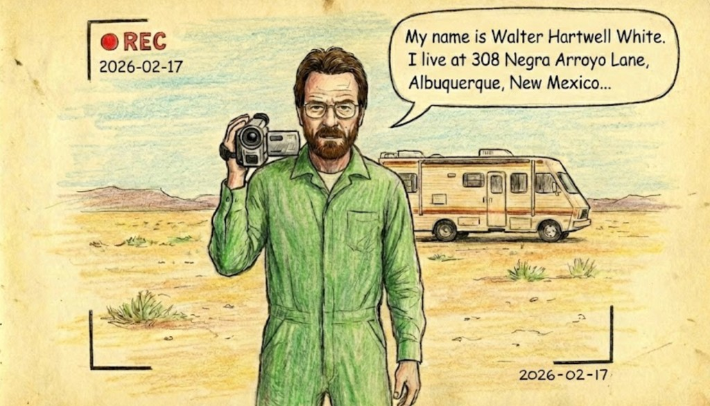

# RS Tandem: Development Diary

Дневник является **обязательным** артефактом этого проекта.

> "Мы — это то, что мы делаем изо дня в день. Совершенство — это не действие, а привычка."
> — Аристотель

В этом проекте у вас много свободы выбора: что именно делать и как. Поэтому, чтобы мы могли понять ваш личный прогресс, мы просим вас вести дневник разработки. В реальных проектах это может встречаться в виде официального Architecture Design Log, но в нашем случае это будет что-то более простое и не настолько формальное.

Дневник — это мощный способ еще раз подумать над тем, что вы делаете, и кратко изложить суть работы, пусть не другому человеку, но MD-файлу :) Это еще одна возможность для дополнительного повторения, "переваривания информации" и рефлексии.

В дневнике разработки я прошу вас фиксировать ваш прогресс, возникшие проблемы, принятые решения и всё, что вы считаете нужным. Вы можете эмулировать "stand up" церемонию, принятую в Scrum (Что было сделано вчера/сегодня? Проблемы? Блокеры?).

Кроме этого, дневник поможет подготовить рассказ для финальной презентации и отвечать на стандартные вопросы типа: "Расскажите о трех сложных проблемах, которые вы решили".

---

## 📋 Правила ведения

1. **Личный формат:** Каждый студент ведет свой отдельный дневник.
2. **Локация:** Все дневники хранятся в папке `development-notes` в корне репозитория.
3. **Структура папок:**
```
/development-notes
  /github-username-1
     github-username-1-2025-02-05.md
     github-username-1-2025-02-07.md
     ...
  /github-username-2
     github-username-2-2025-02-05.md
     ...

```
4. **Формат файла:** Markdown. Имя файла: `github-username-YYYY-MM-DD.md`
5. **Частота:** Минимум **2 записи в неделю**.
6. **Честность (No Backdating):** Запись должна быть закоммичена в **тот же или на следующий день**.
* *Запрещено:* Писать 10 отчетов в воскресенье вечером и коммитить их пачкой. Мы проверяем историю Git.
* Если у вас нет времени написать полноценный отчет в тот же день, вы можете закоммитить только опорные фразы/моменты, а остальную часть дописать в течение недели.
7. **Напоминание в календаре:** Добавьте напоминание в свой календарь, что надо потратить 15 минут на ведение дневника.
8. **"Hand made":** При разработке Tandem вы можете использовать AI. Но конкретно дневник вам надо писать лично (допускаются только фиксы грамматических ошибок через AI).
9. **Скриншоты, гифки, ссылки на PRы и Issues** в дневнике категорически приветствуются!
10. **Язык ведения дневника**: Русский или Английский
11. **Финальный Merge**: Перед сдачей проекта объедините все ваши записи в один общий файл username-merged.md в хронологическом порядке. Отдельные файлы удалять не нужно — они подтверждают регулярность вашей работы. Общий файл нужен для удобства жюри, чтобы вашу историю можно было прочитать как единый рассказ.
12. **Подробности разработки 2 личных Feature Component**
При разработке Tandem вы можете использовать AI. Однако **минимум 2 Feature Component** должны быть разработаны **лично вами**.

**Что это значит на практике:**
- В дневнике должно прослеживаться описание разработки **минимум 2 компонентов**
- Для каждого компонента: какие проблемы возникли, как решали, что изучили (не обязательно писать это за один день, можно за неделю или даже две)

## Пример структуры записи

```markdown
# Дата: 2025-02-05

- **Что было сделано:** ...
- **Проблемы:** ...
- **Решения (или попытки):** ...
- **Мысли / Планы:** Что буду делать дальше?
- **Затраченное время:** 3 часа

```

### Пример

Пока у меня нет реального примера дневника по разработке RS Tandem. Буду рад вставить сюда ваш пример позже.
А пока привожу пример дневника, который я писал на основе своего проекта с сыном — игры для Roblox.

#### Дата: 2025-01-25

Собрались с Глебом попробовать сделать игру в Roblox, используя Cursor. Было ноль понимания, как это можно сделать.
Попросили ChatGPT провести deep research на эту тему. Выбрали название проекта — "Гладиатор", чтобы это ни значило (скорее всего там будет очень мало от древнеримских гладиаторов).
Поставили Roblox Studio. Поставили Cursor AI. Прочитали, как организовать совместную работу с агентом. Поставили и настроили плагин ROJO (так как Roblox Studio — это графическая среда, а из прочтения отчета стало ясно, что крупные гейм-студии пишут код отдельно и хранят его в Git).

Глеб долго разбирался с интерфейсом Cursor, и особенно зачем нужен плагин ROJO. Сам по себе ROJO позволяет писать кодом то, что можно сделать в Roblox Studio руками в интерфейсе.
Первое, что решили запрограммировать — сделать Intro Cut Scene (анимированное появление частиц, которые в итоге формируют надпись Gladiator).
Попросили Cursor вести версионность и отображать ее в игре, чтобы понимать, видим ли мы актуальную версию исходников в Roblox Studio.
С 14-й попытки Intro Cut Scene стала похожа на то, что ожидалось для нашего MVP.
Появилась другая проблема — нет возможности менять всё в Roblox Studio, так как накатываемые изменения, приходящие от ROJO, перетирают уровень. Решили продолжить с этой проблемы на следующий день.

**Проблемы:** общая архитектура проекта, взаимодействие Cursor <> Roblox Studio, использование плагина ROJO.
**Код:** [Ссылка на PR или коммиты]

#### Дата: 2025-01-26

Чтобы поправить проблему синхронизации, добавили `Agents.md`. Час убили на то, чтобы понять, что имеет смысл писать в него в этом проекте. Все равно он остался, на мой взгляд, сырой. По факту сейчас он декларирует сферы ответственности — что может менять CursorAI в исходниках, а что в Roblox Studio может делать Глеб (уровни, предметы, NPC и т.д.).
Пайплайн выглядит так: Глеб добавляет NPC, ставит его где надо, выбирает скин, а дальше просит Cursor дописать логику. Конфликты исчезли. С 5-6 попытки NPC стал показывать интерфейс диалога.

Строить Колизей самим было лень. Но делать его через ROJO неудобно. Настроили MCP протокол для Roblox Studio. В итоге Cursor смог кастомизировать уровень, не ломая Глебины изменения (что-то он делал через ROJO, что-то через MCP). Но Колизей все равно получился отстой... Хотя некоторые возможности MCP (например настройка освещения) оказались полезны. Записали сделать нормальный Колизей в TODO :D

**Проблемы:** конфигурация `Agents.md`, разделение сфер ответственности, MCP протокол для Roblox Studio.
**Код:** [Ссылка на PR или коммиты]

#### Дата: 2025-01-27

Начали разбираться с кастомизацией персонажей. Оказалось, что есть 6- и 15-суставные персонажи, которых можно кастомизировать с Blender. Поставили Blender. Интерфейс — боль. Мучались 2 часа, решили попробовать генерить с AI, но результатом не сильно довольны. Вернулись к Blender, начали смотреть туториал для новичков.

**Проблемы:** много непонятной терминологии — риги, mesh, форматы фигур, сложный интерфейс Blender, возможности по импорту/экспорту моделей между Roblox Studio <> Blender.
**Код:** [Ссылка на PR или коммиты]

#### Дата: 2025-01-28

Смотрели видосы по Blender: `https://www.youtube.com/watch?v=kVcY7K-JA1Y` и т.д.

---

## Итого

Я верю, что в рамках проекта Tandem можно написать много интересных заметок на совершенно разные темы - от процессов авторизации/аутентификации, разработки различных графических компонентов, протоколов работы с API, написания back-end или работы с DB. Истории изучения и использования AI инструментов — тоже более чем приветствуются.
А может, какие-то проблемы и особенности командной разработки.
Таким образом, к концу проекта у вас будет история вашего личного вклада, проблемы, с которыми вы столкнулись и которые решили. И будет возможность точно выбрать что-то подходящее для презентации.

## План Б.

Если по какой-либо причине вы не вели дневник в течение одной или двух недель, вам необходимо записать видео ролик. Если не вели месяц или вообще - два видео ролика.   

**Требования к видео:**
1.  **Объем:** Выберите один Feature Component из тех, что вы реализовали.
2.  **Сценарий:** Удалите его код. Напишите его заново в реальном времени. Это аналогично тому, что иногда просят на live coding intreview.
3.  **Комментарии:** Вы обязаны объяснять вслух свои решения: почему выбрана такая архитектура компонента, какие альтернативы рассматривались, как компонент интегрируется с остальным приложением, как обрабатываются edge cases (ошибки сети, пустые данные и т.д.).
4.  **Длительность:** от 10 минут.


## Критерии оценки Development Diary (Max 100 points)

### Порог допуска к защите финального проекта (pass/fail)

| Требование | Статус |
|------------|--------|
| Дневник разработки существует, заполнен регулярно, записи закоммичены своевременно | must pass |
| **Описан в дневнике или снят на видео процесс разработки минимум 2 личных Feature Component** | must pass |


### Критерии качества (0-100 баллов)

| Баллы | Уровень | Описание |
|-------|---------|----------|
| **20** | Формальный | Краткие записи без деталей ("сделал X") |
| **60** | Регулярный | Минимум 2 записи/неделю, виден прогресс, описаны 2 компонента |
| **80** | Детальный | Есть описание проблем и решений, понятен ход мысли |
| **100** | Рефлексивный | Глубокая рефлексия, сравнение вариантов имплементации, видно что написано не для галочки |


