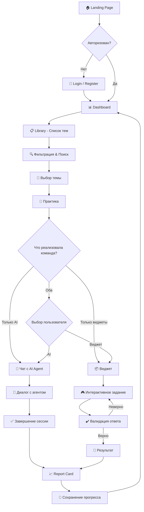

# RS Tandem: Main User Journey

> ⚠️ **Это пример User Flow, а не строгое требование.**
>
> Конкретная реализация приложения зависит от вашей команды и компонентов, которые вы успеете сделать. Проект рассчитан на 4-6 недель, и вы можете реализовать только те компоненты, на которые хватит времени.
>
> **Приложение может быть не законченным** — это нормально. Главное: то, что сделано, должно работать и быть качественным.
- **Приложение может иметь:** AI Agent, виджеты, или оба
- **Минимум для защиты:** 2 компонента от каждого участника проекта
- **Приложение может быть оформлено в другой тематике:** Например, RPG где герой получает очки/деньги на рашения задачек от NPC после чего может их тратить на покупку шмота, подсказки в будуших квестах и т.д.
- Визуальный стиль - на ваше усмотрение. 
- Звуковое оформление, геймификация - все крайне привествуется. 

---

## Пример основного сценария

```
Landing Page → Регистрация/Вход → Dashboard → Выбор темы → Практика → Фидбек → Dashboard
```




---

## Способ практики

Способ практики **зависит от того, что реализовала команда**:

| Реализация команды | Что видит пользователь |
|-------------------|------------------------|
| Только AI Agent | Практика = чат с AI |
| Только виджеты | Практика = виджеты |
| AI Agent + виджеты | Пользователь выбирает |

**Пример:** Если команда сделала AI Agent + виджеты, пользователь может выбрать:
- "Практика с AI" → чат с агентом
- "Memory Game" → виджет про Garbage Collection
- "Async Sorter" → виджет про Event Loop

---

## Страницы приложения

| Страница | URL | Описание | Компонент |
|----------|-----|----------|-----------|
| Landing | `/` | Главная для гостей | Landing Page |
| Login | `/login` | Вход | Auth |
| Register | `/register` | Регистрация | Auth |
| Dashboard | `/dashboard` | Главная + История сессий | Dashboard |
| Library | `/library` | Список тем | Library |
| Practice | `/practice/:topicId` | Практика (AI или виджет) | AI Agent / Widgets |
| Profile | `/profile` | Профиль пользователя | Profile |


---

## Способы практики

### 1. AI Agent

```
Выбор темы → Чат с агентом → Ответы → Report Card
```

**Компоненты:**
- AI Chat UI
- Streaming Parser
- Context Manager
- Report Card (опционально)

> ⚠️ **Сложный компонент.** Подробности см. в [AI_AGENT.md](./AI_AGENT.md)

### 2. Виджеты

```
Выбор темы → Загрузка виджета → Решение → Валидация → Результат
```

**Компоненты:**
- Widget Engine
- Конкретный виджет (Memory Game, Stack Builder, Async Sorter и т.д.)
- Report Card (опционально)

### 3. Комбинация

Приложение может иметь И AI Agent, И виджеты. Пользователь выбирает способ практики.

---

## 📚 Темы для практики

Tandem помогает готовиться к техническим интервью по темам:

### Core JS
Вопросы из [technical-screening](../../modules/technical-screening/README.md):
- Data types, Type conversions
- Closures, this, Prototypes
- Event Loop, Async/Promises
- Strict comparison

### TypeScript
- Types vs Interfaces
- Generics, Utility types
- unknown vs any

### Algorithms
- Big O notation
- Sorting, Searching
- Data structures

### Frontend
- HTML/CSS basics
- DOM API
- Browser APIs

---

## Примеры UI

### Dashboard (с историей)

```
┌─────────────────────────────────────────────────────────┐
│  Tandem                              [Profile] [Logout] │
├─────────────────────────────────────────────────────────┤
│                                                         │
│  Привет, Иван! 👋                                       │
│                                                         │
│  ┌─────────────────────┐  ┌─────────────────────┐      │
│  │  📊 Прогресс        │  │  🔥 Streak: 5 дней  │      │
│  │  ████████░░ 80%     │  │                     │      │
│  └─────────────────────┘  └─────────────────────┘      │
│                                                         │
│  📜 История сессий:                                     │
│  ┌─────────────────────────────────────────────────┐   │
│  │ Core JS (AI)   │ 85/100  │ 2 дня назад │ [→]   │   │
│  │ Algorithms     │ 72/100  │ 3 дня назад │ [→]   │   │
│  │ TypeScript     │ 90/100  │ 5 дней назад│ [→]   │   │
│  └─────────────────────────────────────────────────┘   │
│  [1] [2] [3]  (Pagination)                             │
│                                                         │
│  [Начать практику]                                      │
│                                                         │
└─────────────────────────────────────────────────────────┘
```

### Library (Выбор темы)

```
┌─────────────────────────────────────────────────────────┐
│  Tandem > Library                    [Profile] [Logout] │
├─────────────────────────────────────────────────────────┤
│                                                         │
│  Выберите тему для практики                             │
│                                                         │
│  🔍 [Поиск...]  [Фильтр: Все ▼]  [Сложность: Все ▼]   │
│                                                         │
│  ┌─────────────────────────────────────────────────┐   │
│  │ 📘 Core JS                                       │   │
│  │ Замыкания, прототипы, this, event loop          │   │
│  │ Сложность: ⭐⭐⭐  │  Прогресс: 80%  │ [Начать] │   │
│  └─────────────────────────────────────────────────┘   │
│                                                         │
│  ┌─────────────────────────────────────────────────┐   │
│  │ 📗 TypeScript                                    │   │
│  │ Типы, generics, utility types                   │   │
│  │ Сложность: ⭐⭐⭐  │  Прогресс: 60%  │ [Начать] │   │
│  └─────────────────────────────────────────────────┘   │
│                                                         │
│  [1] [2] [3] ... [10]  (Pagination)                    │
│                                                         │
└─────────────────────────────────────────────────────────┘
```

### Practice (AI Agent)

```
┌─────────────────────────────────────────────────────────┐
│  Tandem > Core JS > Practice         [End Session]      │
├─────────────────────────────────────────────────────────┤
│                                                         │
│  ┌─────────────────────────────────────────────────┐   │
│  │ 🤖 Agent:                                        │   │
│  │ Объясни разницу между `==` и `===` в            │   │
│  │ JavaScript. Приведи примеры, когда результат    │   │
│  │ будет отличаться.                               │   │
│  └─────────────────────────────────────────────────┘   │
│                                                         │
│  ┌─────────────────────────────────────────────────┐   │
│  │ 👤 You:                                          │   │
│  │ == сравнивает значения с приведением типов,     │   │
│  │ а === сравнивает без приведения...              │   │
│  └─────────────────────────────────────────────────┘   │
│                                                         │
│  ┌─────────────────────────────────────────────────┐   │
│  │ 🤖 Agent:                                        │   │
│  │ Отлично! Можешь привести пример, когда          │   │
│  │ `[] == false` вернет true, а `[] === false`     │   │
│  │ вернет false? ▌ (streaming...)                  │   │
│  └─────────────────────────────────────────────────┘   │
│                                                         │
│  ┌─────────────────────────────────────────────────┐   │
│  │ [Введите ответ...]                              │   │
│  │                                        [Отправить]│   │
│  └─────────────────────────────────────────────────┘   │
│                                                         │
└─────────────────────────────────────────────────────────┘
```

### Practice (Widget - Async Sorter)

```
┌─────────────────────────────────────────────────────────┐
│  Tandem > Core JS > Async Sorter      [Skip] [Submit]   │
├─────────────────────────────────────────────────────────┤
│                                                         │
│  В каком порядке выведутся console.log?                 │
│  Перетащи блоки в правильные очереди:                   │
│                                                         │
│  Код:                                                   │
│  ┌───────────────────────────────────────────────┐     │
│  │ console.log('1');                              │     │
│  │ setTimeout(() => console.log('2'), 0);         │     │
│  │ Promise.resolve().then(() => console.log('3'));│     │
│  │ console.log('4');                              │     │
│  └───────────────────────────────────────────────┘     │
│                                                         │
│  ┌────────────┐ ┌────────────┐ ┌────────────┐          │
│  │ Call Stack │ │ Microtasks │ │ Macrotasks │          │
│  │            │ │            │ │            │          │
│  │ [1] [4]    │ │ [3]        │ │ [2]        │          │
│  └────────────┘ └────────────┘ └────────────┘          │
│                                                         │
│  Итоговый порядок: [ 1 ] [ 4 ] [ 3 ] [ 2 ]             │
│                                                         │
│                                     [Run Loop] ▶️       │
│                                                         │
└─────────────────────────────────────────────────────────┘
```

### Profile

```
┌─────────────────────────────────────────────────────────┐
│  Tandem > Profile                           [Logout]    │
├─────────────────────────────────────────────────────────┤
│                                                         │
│  ┌─────────┐                                            │
│  │  👤     │  Иван Петров                               │
│  │  Avatar │  ivan@example.com                          │
│  │  [Edit] │  Joined: January 2025                      │
│  └─────────┘                                            │
│                                                         │
│  ┌─────────────────────────────────────────────────┐   │
│  │ 📊 Статистика                                    │   │
│  │                                                  │   │
│  │ Всего сессий:     25                             │   │
│  │ Средний балл:     82/100                         │   │
│  │ Лучшая тема:      TypeScript (90%)               │   │
│  │ Streak:           🔥 5 дней                      │   │
│  └─────────────────────────────────────────────────┘   │
│                                                         │
│  ┌─────────────────────────────────────────────────┐   │
│  │ ⚙️ Настройки                                     │   │
│  │                                                  │   │
│  │ Тема:     [Light ▼]                              │   │
│  │ Язык:     [Русский ▼]                            │   │
│  │                                                  │   │
│  │ [Сменить пароль]  [Выйти из аккаунта]           │   │
│  └─────────────────────────────────────────────────┘   │
│                                                         │
└─────────────────────────────────────────────────────────┘
```

---

## ⚠️ Error States & Edge Cases

### Сетевые ошибки

```
┌─────────────────────────────────────────────────────────┐
│  ⚠️ Ошибка сети                                         │
│                                                         │
│  Не удалось загрузить данные.                          │
│  Проверьте подключение к интернету.                    │
│                                                         │
│  [Повторить]                                            │
└─────────────────────────────────────────────────────────┘
```

### AI Agent не отвечает

```
┌─────────────────────────────────────────────────────────┐
│  🤖 Agent: ⏳ Думаю...                                   │
│                                                         │
│  ⏱️ Если ответ не появится в течение 30 секунд,        │
│     нажмите [Отменить] и повторите вопрос.             │
│                                                         │
│  [Отменить]                                             │
└─────────────────────────────────────────────────────────┘
```

### Таймаут AI

```
┌─────────────────────────────────────────────────────────┐
│  ⚠️ Агент не отвечает                                   │
│                                                         │
│  Сервис временно недоступен.                           │
│  Ваш прогресс сохранен.                                │
│                                                         │
│  [Попробовать снова]  [Вернуться на Dashboard]         │
└─────────────────────────────────────────────────────────┘
```

### Потеря соединения во время сессии

```
┌─────────────────────────────────────────────────────────┐
│  ⚠️ Соединение потеряно                                 │
│                                                         │
│  Не беспокойтесь! Ваш прогресс сохранен локально.      │
│  При восстановлении соединения данные                  │
│  синхронизируются автоматически.                       │
│                                                         │
│  🔄 Восстановление соединения...                        │
└─────────────────────────────────────────────────────────┘
```

### Пустой список (Empty State)

```
┌─────────────────────────────────────────────────────────┐
│  📭 Нет истории сессий                                  │
│                                                         │
│  Вы еще не проходили практику.                         │
│  Начните с выбора темы!                                │
│                                                         │
│  [Начать практику]                                      │
└─────────────────────────────────────────────────────────┘
```

### Валидация форм

```
┌─────────────────────────────────────────────────────────┐
│  Email:    [ivan@example]                               │
│            ⚠️ Неверный формат email                     │
│                                                         │
│  Пароль:   [••••]                                       │
│            ⚠️ Минимум 8 символов                        │
└─────────────────────────────────────────────────────────┘
```

---

## State Persistence

### Что сохраняется при перезагрузке:

| Данные | Где хранится | Восстановление |
|--------|--------------|----------------|
| Auth token | LocalStorage | Автоматически |
| Текущая сессия (AI) | LocalStorage + Backend | При входе |
| История чата | Backend | Загружается с сервера |
| Состояние виджета | LocalStorage | Автоматически |
| Прогресс | Backend | Загружается с сервера |
| Настройки (тема, язык) | LocalStorage | Автоматически |

### Сценарии восстановления:

1. **Закрыл вкладку посередине AI сессии:**
   - При возврате: "У вас есть незавершенная сессия. Продолжить?"

2. **Обновил страницу во время виджета:**
   - Состояние восстанавливается автоматически

3. **Потерял интернет:**
   - Данные сохраняются локально
   - Синхронизация при восстановлении соединения

---

