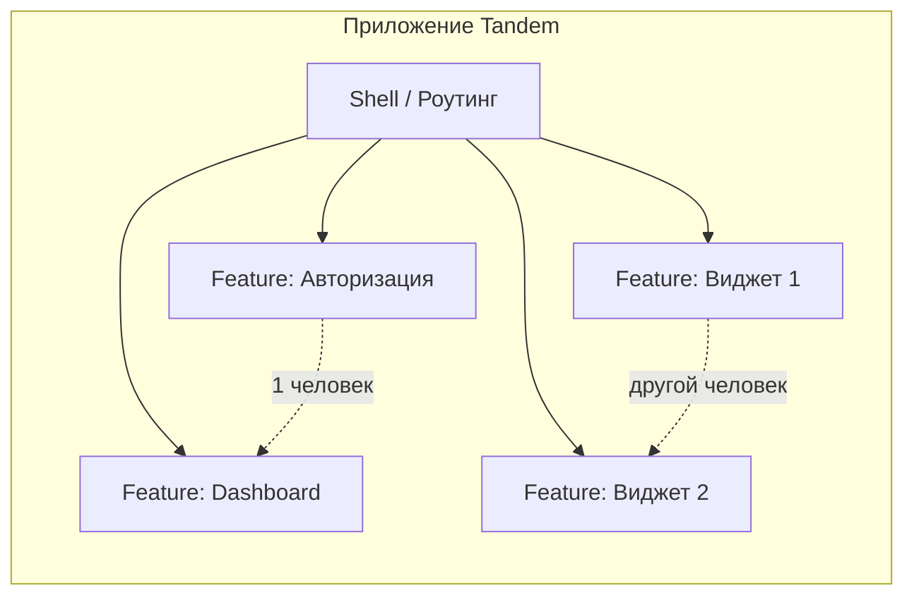
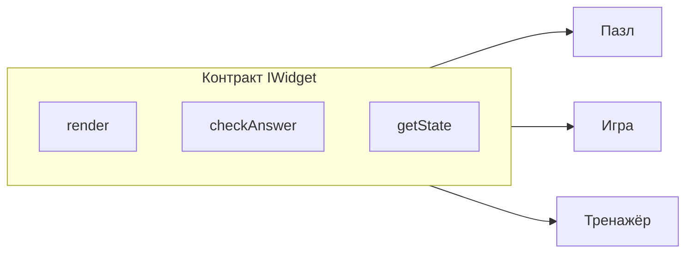
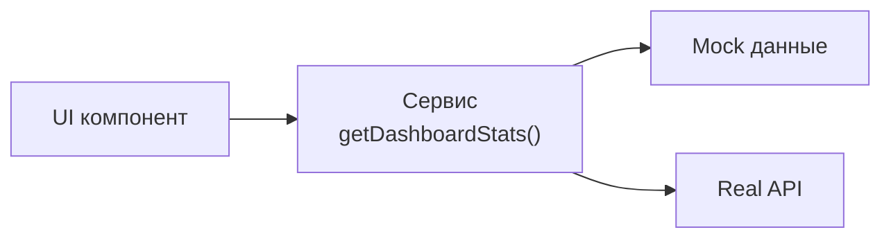
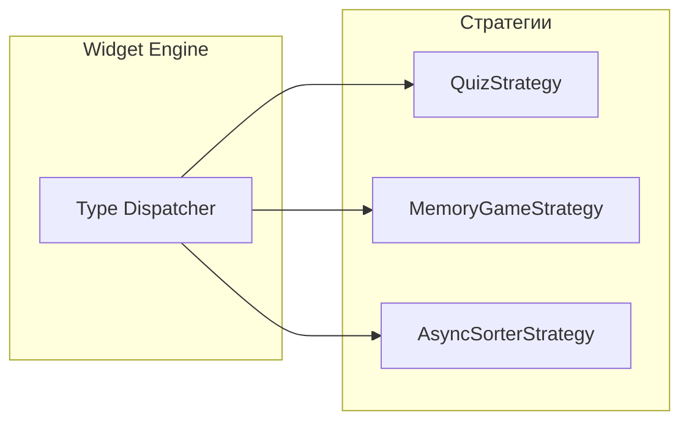

# Архитектурный брифинг для студентов Tandem

Краткий мини-брифинг перед выдачей задания: ключевые идеи, которые стоит держать в голове при планировании и разработке.

---

## 1. Компонентный подход (Feature Component)

В программе вы уже сталкивались с **модульной архитектурой** и разделением на компоненты. В Tandem это оформлено явно:

- **Feature Component** — один самодостаточный блок: экран, сервис, AI-модуль и т.п.
- У каждого компонента **одна зона ответственности**.
- Минимум **2 компонента на человека** — это не «2 страницы», а 2 законченные фичи с понятными границами.

**Зачем напоминать:** чтобы все одинаково понимали «компонент»: не просто папка в коде, а фича с чёткими входами/выходами и ответственностью. Это снижает путаницу при делении работы в команде.

**Где хранить данные (Global vs Local):**  
Компоненты самодостаточны — значит, не всё должно лететь в общий стор. **Global Store (Zustand/Context):** только то, что нужно всему приложению (авторизация, тема, язык, тосты). **Local State:** всё остальное (значение инпута, открыт ли модал, текущий шаг в виджете) живёт внутри Feature Component. Не выносите состояние виджета в глобальный стор, если виджет может существовать в двух экземплярах — иначе получите конфликты.

---

## 2. Полиморфизм: виджеты и способы хранения данных

### Виджеты

Разные типы заданий (пазл, игра, тренажёр) можно реализовать через **общий интерфейс**: один контракт, разные реализации. Тогда движок приложения не знает деталей конкретного виджета — только вызывает одинаковые методы (например, `render`, `checkAnswer`, `getState`). Добавить новый виджет = реализовать тот же интерфейс.

### Хранение данных

Слой доступа к данным (API Service Layer / Repository) тоже строится по принципу **одного интерфейса, разных реализаций**:

- Один и тот же метод, например `getDashboardStats()`.
- Под капотом — **mock** (для разработки без бэкенда) или **реальный API** (после готовности сервера).
- UI не меняется при переключении mock ↔ real — меняется только реализация сервиса (или флаг `VITE_USE_MOCK`).

Подробнее — в [ARCHITECTURE_AND_API.md](ARCHITECTURE_AND_API.md).

**Виджеты: один интерфейс — разные реализации**

**Данные: один сервис — mock или real API**

**Data Contracts First (контракты вперёд):**  
Главная боль командной работы — фронт ждёт бэкенд, а потом выясняется, что поля называются по-разному. **Сначала `types.ts`, потом код.** Прежде чем писать логику виджета или API, согласуйте файл с типами (Data Contracts). Это ваш «мирный договор»: при согласованном интерфейсе `Widget` один человек пишет движок, другой — верстает виджет, и в конце всё сходится.

**Зачем напоминать:** без этого многие делают жёстко зашитые реализации (виджет под один тип задачи, UI с прямыми вызовами `fetch`). Краткое объяснение на 2–3 минуты задаёт ожидаемую архитектуру и отсылает к документу.

---

## 3. Разделяй и властвуй (стратегия работы)

Проект большой: LLM, backend, стриминг, редактор кода и т.д. Важно не пытаться охватить всё сразу:

- **Выберите 2 компонента по силам** и доведите их до конца.
- Компоненты в Tandem специально разной сложности (от авторизации до LLM-агента) — можно выбрать по интересам и возможностям.
- «Разделяй и властвуй» здесь = разбить проект на такие компоненты и делать по одному (или по два на человека), а не хвататься за всё подряд.

Это совпадает с правилом «минимум 2 компонента на студента» и снижает перегрузку и незаконченные фичи.

---

## 4. Паттерны, которые рекомендуется изучить

В [PERSONAL_SCORE.md](PERSONAL_SCORE.md) за **явное и обоснованное применение паттернов** и за **выделение API Layer** начисляются баллы (+10 за каждый). Ниже — паттерны, которые прямо полезны в примерах Tandem (Widget Trainer, Codenames, AI Prep App) и которые решают типичные проблемы проекта.

---

### 4.1 Repository / API Service Layer

**Как работает:**  
UI и бизнес-логика не обращаются к данным напрямую (никаких `fetch` или запросов к БД в компонентах). Вместо этого они вызывают методы сервиса: `getDashboardStats()`, `getWidgetById()`, `submitAnswer()`. Сервис решает, откуда взять данные: из мока, из REST API или из WebSocket.

**Зачем в проекте:**

- Параллельная разработка: фронт не ждёт готовности бэкенда.
- Один переключатель `VITE_USE_MOCK=true/false` — и приложение работает с моком или с реальным API без правок в UI.
- Изоляция: смена эндпоинта или способа хранения не ломает компоненты.

**Какую проблему решает:**  
Убирает жёсткую связку «UI ↔ конкретный URL/БД». Компоненты перестают знать _как_ данные получены — только _что_ они получили (типизированный результат).

**Обработка ошибок (архитектурно):**  
Не размазывайте `try/catch` по каждому компоненту. **API Layer** ловит сетевые ошибки и выбрасывает типизированные исключения (`AuthError`, `NetworkError`). **UI** использует ErrorBoundary или глобальный обработчик, чтобы показывать пользователю тосты («Нет интернета», «Сессия истекла»), а не белый экран. Ошибка не должна «тихо» падать в консоль.

**Где в примерах:**

- [ARCHITECTURE_AND_API.md](ARCHITECTURE_AND_API.md) — полное описание и примеры.
- Widget Trainer: `getWidgetById()`, `submitAnswer()` через API-слой; Codenames: работа с комнатами и игрой через сервисы/WebSocket.

---

### 4.2 Strategy (для виджетов)

**Как работает:**  
Есть общий интерфейс (контракт): например, «принять данные виджета, отрендерить UI, собрать ответ, при необходимости проверить локально». Каждый тип виджета (Quiz, Memory Game, Async Sorter и т.д.) — отдельная реализация этой стратегии. Движок не содержит `switch (widget.type)` с десятком веток: он хранит карту «тип → стратегия» и вызывает `strategy.render(widget, onAnswer)`.

**Зачем в проекте:**

- Добавление нового вида задания = новый файл-стратегия и регистрация в карте; остальной код не трогается.
- Каждый виджет тестируется изолированно.
- TypeScript проверяет соответствие типов (payload и answer для каждого типа).

**Какую проблему решает:**  
Раздутый `switch/case` и нарушение Open/Closed Principle. Без Strategy каждый новый виджет заставляет править один и тот же большой метод.

**Где в примерах:**

- [examples/01-widget-trainer/widget-engine.md](examples/01-widget-trainer/widget-engine.md) — сравнение «плохо: switch» и «хорошо: Strategy», пример кода и преимущества.

---

### 4.3 State Machine (для игр и сложных сценариев)

**Как работает:**  
Состояние приложения (или игры) явно описано как набор **состояний** и **переходов**. Например: `WaitingForPlayers → GameActive → (RedClue → RedGuess → CheckPhase → BlueClue → …) → GameOver`. Только определённые действия переводят из одного состояния в другое; в коде это проверяется в одном месте (серверная логика или клиентское зеркало).

**Зачем в проекте:**

- Многопользовательские и игровые сценарии (Codenames: ход команды, подсказка, угадывание, фаза проверки знаний).
- Один источник правды на сервере: все клиенты получают обновления состояния по WebSocket.
- Меньше багов вида «кнопка доступна не в той фазе» — переходы явные и централизованные.

**Какую проблему решает:**  
Хаос из флагов и «если залогинен и игра началась и не пауза и…». State Machine заменяет это на явный граф состояний и переходов.

**Где в примерах:**

- [examples/02-codenames-game/game-engine.md](examples/02-codenames-game/game-engine.md) — серверная и клиентская State Machine (Mermaid stateDiagram), правила переходов, фаза Check.

---

### 4.4 Discriminated Union (типизация в TypeScript)

**Как работает:**  
Общий тип — объединение нескольких типов с общим полем-дискриминатором (часто `type`). Например: `type Widget = QuizWidget | TrueFalseWidget | AsyncSorterWidget | …`, где у каждого варианта `type: 'quiz' | 'true-false' | 'async-sorter' | …`. В `switch (widget.type)` TypeScript автоматически сужает тип в каждой ветке. Для полноты можно использовать exhaustive check: `default: assertNever(widget)` — тогда забытый `case` приведёт к ошибке компиляции.

**Зачем в проекте:**

- Безопасная работа с разными видами виджетов (и другими сущностями с вариантами): автодополнение и проверка типов для `payload` и ответов.
- Контракты API и данные с сервера описываются одним union-типом — меньше `any` и runtime-ошибок.

**Какую проблему решает:**  
Неточные типы («вот объект, в нём то ли options, то ли blocks — смотри сам») и падения в рантайме из-за неучтённого варианта.

**Где в примерах:**

- [examples/01-widget-trainer/widget-engine.md](examples/01-widget-trainer/widget-engine.md) — Discriminated Unions и `assertNever`.
- [examples/01-widget-trainer/data-contracts.md](examples/01-widget-trainer/data-contracts.md), [examples/02-codenames-game/data-contracts.md](examples/02-codenames-game/data-contracts.md) — типы виджетов, комнат, игр.

---

### 4.5 Сводка: паттерн → где применить в Tandem

| Паттерн                            | Где применить                                                                | Баллы (PERSONAL_SCORE)   |
| ---------------------------------- | ---------------------------------------------------------------------------- | ------------------------ |
| **API Service Layer / Repository** | Любой экран, работающий с данными; mock/real переключение                    | API Layer +10            |
| **Strategy**                       | Движок виджетов, типы заданий (Quiz, Memory Game, сортировка и т.д.)         | Design Patterns +10      |
| **State Machine**                  | Игры (Codenames), сложные сценарии с фазами (Lobby → Game → Check → Results) | Design Patterns +10      |
| **Discriminated Union**            | Типы виджетов, сообщения WebSocket, контракты API                            | Качество кода, типизация |

---

## 5. Чек-лист: До первой строчки кода

Прежде чем писать компоненты, договоритесь в команде об этих трёх вещах. Это сэкономит часы рефакторинга.

### 5.1 Контракты данных (Data Contracts)

Создайте файл `types.ts` (или `contracts.d.ts`) и опишите в нём интерфейсы сущностей.

- Как выглядит объект `User`?
- Какой JSON отдаёт API для виджета?
- Какие пропсы принимает `WidgetEngine`?

**Почему это важно:** бэкенд и фронт могут работать параллельно, используя эти типы как закон.

### 5.2 Глобальное vs локальное состояние

Договоритесь, какие данные живут в глобальном сторе (Zustand/Redux/Context), а какие — внутри компонентов.

- **Global:** авторизация, тема, язык, список уведомлений (тосты).
- **Local:** значение инпута, статус загрузки конкретной кнопки, открыт ли аккордеон.

### 5.3 Обработка ошибок

Решите, как вы будете показывать ошибки пользователю.

- Архитектурно правильный вариант: **глобальная система тостов**.
- API-слой ловит ошибку → выбрасывает типизированное исключение или кидает событие → Toast показывает сообщение («Нет интернета», «Сессия истекла»).
- Не допускайте «тихих» падений в консоль и белого экрана вместо понятного сообщения.

---

Материал можно использовать как текст для короткого (5–10 минут) брифинга перед выдачей задания или как черновик для добавления в ARCHITECTURE_AND_API.md.
