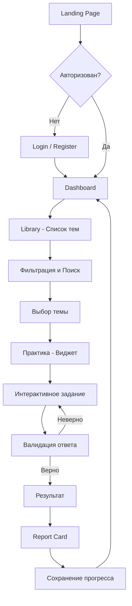

# Пример 1: Widget Trainer

Пример приложения — интерактивный тренажер с визуальными заданиями. По желанию студенты могут реализовать модуль интеграции с LLM.

## Концепция

Классическое SPA для подготовки к интервью:
- Пользователь выбирает тему (Core JS, TypeScript, Algorithms)
- Решает интерактивные задания (виджеты)
- Видит прогресс и историю сессий

## Ключевые фичи

- Dashboard с прогрессом и историей сессий
- Библиотека тем с фильтрацией и поиском
- Интерактивные виджеты: Quiz, Memory Game, Async Sorter, Stack Builder
- Система XP и Streaks
- Responsive design

## User Flow

```
Landing Page → Регистрация/Вход → Dashboard → Выбор темы → Практика → Фидбек → Dashboard
```



---

## Страницы приложения

| Страница | URL | Описание | Компонент |
|----------|-----|----------|-----------|
| Landing | `/` | Главная для гостей | Landing Page |
| Login | `/login` | Вход | Auth |
| Register | `/register` | Регистрация | Auth |
| Dashboard | `/dashboard` | Главная + История сессий | Dashboard |
| Library | `/library` | Список тем | Library |
| Practice | `/practice/:topicId` | Практика (виджет) | Widget Engine |
| Profile | `/profile` | Профиль пользователя | Profile |
| 404 | `/*` | Страница не найдена | Not Found |

---

## Примеры UI

### Dashboard

```
┌─────────────────────────────────────────────────────────┐
│  Tandem                              [Profile] [Logout] │
├─────────────────────────────────────────────────────────┤
│                                                         │
│  Привет, Иван!                                          │
│                                                         │
│  ┌─────────────────────┐  ┌─────────────────────┐      │
│  │  Прогресс           │  │  Streak: 5 дней     │      │
│  │  ████████░░ 80%     │  │                     │      │
│  └─────────────────────┘  └─────────────────────┘      │
│                                                         │
│  История сессий:                                        │
│  ┌─────────────────────────────────────────────────┐   │
│  │ Core JS       │ 85/100  │ 2 дня назад │ [→]    │   │
│  │ Algorithms    │ 72/100  │ 3 дня назад │ [→]    │   │
│  │ TypeScript    │ 90/100  │ 5 дней назад│ [→]    │   │
│  └─────────────────────────────────────────────────┘   │
│  [1] [2] [3]  (Pagination)                             │
│                                                         │
│  [Начать практику]                                      │
│                                                         │
└─────────────────────────────────────────────────────────┘
```

### Library (Выбор темы)

```
┌─────────────────────────────────────────────────────────┐
│  Tandem > Library                    [Profile] [Logout] │
├─────────────────────────────────────────────────────────┤
│                                                         │
│  Выберите тему для практики                             │
│                                                         │
│  [Поиск...]  [Фильтр: Все]  [Сложность: Все]           │
│                                                         │
│  ┌─────────────────────────────────────────────────┐   │
│  │ Core JS                                         │   │
│  │ Замыкания, прототипы, this, event loop          │   │
│  │ Сложность: 3    │  Прогресс: 80%  │ [Начать]   │   │
│  └─────────────────────────────────────────────────┘   │
│                                                         │
│  ┌─────────────────────────────────────────────────┐   │
│  │ TypeScript                                      │   │
│  │ Типы, generics, utility types                   │   │
│  │ Сложность: 3    │  Прогресс: 60%  │ [Начать]   │   │
│  └─────────────────────────────────────────────────┘   │
│                                                         │
│  [1] [2] [3] ... [10]  (Pagination)                    │
│                                                         │
└─────────────────────────────────────────────────────────┘
```

### Practice (Widget - Async Sorter)

```
┌─────────────────────────────────────────────────────────┐
│  Tandem > Core JS > Async Sorter      [Skip] [Submit]   │
├─────────────────────────────────────────────────────────┤
│                                                         │
│  В каком порядке выведутся console.log?                 │
│  Перетащи блоки в правильные очереди:                   │
│                                                         │
│  Код:                                                   │
│  ┌───────────────────────────────────────────────┐     │
│  │ console.log('1');                              │     │
│  │ setTimeout(() => console.log('2'), 0);         │     │
│  │ Promise.resolve().then(() => console.log('3'));│     │
│  │ console.log('4');                              │     │
│  └───────────────────────────────────────────────┘     │
│                                                         │
│  ┌────────────┐ ┌────────────┐ ┌────────────┐          │
│  │ Call Stack │ │ Microtasks │ │ Macrotasks │          │
│  │            │ │            │ │            │          │
│  │ [1] [4]    │ │ [3]        │ │ [2]        │          │
│  └────────────┘ └────────────┘ └────────────┘          │
│                                                         │
│  Итоговый порядок: [ 1 ] [ 4 ] [ 3 ] [ 2 ]             │
│                                                         │
│                                        [Run Loop]       │
│                                                         │
└─────────────────────────────────────────────────────────┘
```

---

## Примеры интерактивных виджетов

### Widget Engine

**Описание:** Движок для загрузки виджетов по JSON-схеме. 

**Функциональность:**
- Получение схемы от backend
- Динамическая загрузка виджетов
- Общий интерфейс для всех виджетов
- Валидация ответов

---

## Легкие виджеты

### Quiz Widget

Классический тест с выбором одного ответа.

```json
{
  "type": "quiz",
  "question": "Что вернет typeof null?",
  "options": ["null", "undefined", "object", "NaN"],
  "correctIndex": 2
}
```

---

### True/False Widget

Утверждение — правда или ложь?

```json
{
  "type": "true-false",
  "statement": "Promise.all() возвращает результаты в порядке завершения промисов",
  "correct": false,
  "explanation": "Promise.all() сохраняет порядок входного массива"
}
```

---

### Code Completion Widget

Заполни пропуски в коде.

```json
{
  "type": "code-completion",
  "code": "const result = arr.___(x => x > 0);",
  "blanks": ["___"],
  "correctAnswers": ["filter"]
}
```

---

### Code Ordering Widget

Расставь строки кода в правильном порядке (Drag & Drop).

```json
{
  "type": "code-ordering",
  "description": "Реализуй debounce функцию",
  "lines": [
    "return function(...args) {",
    "let timeout;",
    "clearTimeout(timeout);",
    "timeout = setTimeout(() => fn(...args), delay);",
    "};"
  ],
  "correctOrder": [1, 0, 2, 3, 4]
}
```

---

## Средние виджеты

### Memory Game: «Be the Garbage Collector»

#### Концепция

Вместо того чтобы писать сложный алгоритм, который сам находит мусор, мы просим студента стать Garbage Collector'ом.

#### Сценарий

1. **Слева:** Визуальный граф объектов (кружочки) и ссылок (стрелочки). Все запутано.
2. **Справа:** Короткий код, который только что выполнился. Например: `user = null;` или `list.next = null;`.
3. **Задача:** "Кликни на все объекты, которые должны быть удалены из памяти после выполнения этого кода".

#### UI Механика

* **Корневой объект (Root):** Всегда подсвечен (например, `window`).
* **Состояние:** Изначально все объекты "живые".
* **Действие:** Пользователь кликает на объекты, помечая их как "Dead" (красный цвет).
* **Валидация (Кнопка "Collect"):**
  * Если помечен объект, до которого *можно* добраться от Root → **Ошибка** ("Удалили живой объект!").
  * Если не помечен объект, до которого *нельзя* добраться → **Ошибка** ("Memory Leak! Вы пропустили мусор").

#### Техническая реализация (JSON-driven)

Студенту не нужно парсить код. Сценарий задается жестко:

```json
{
  "codeSnippet": "let a = {val: 1};\nlet b = a;\na = null;",
  "objects": [
    { "id": 1, "label": "Object {val:1}" },
    { "id": 2, "label": "Variable 'a'" },
    { "id": 3, "label": "Variable 'b'" }
  ],
  "links": [
    { "from": 3, "to": 1 }
  ],
  "garbageIds": [2]
}
```

#### Что проверяет:

* Понимание **Reachability** (достижимости).
* Понимание **Reference Counting** vs **Mark-and-Sweep**.
* Понимание циклических ссылок (когда два объекта ссылаются друг на друга, но недостижимы из корня).

---

### Stack Builder: "Call Stack Game"

#### Концепция

Студент должен вручную "исполнить" роль интерпретатора, управляя стеком вызовов.

#### Сценарий

1. **Слева:** Код с вложенными вызовами функций или рекурсией. Активная строка кода подсвечивается.
2. **По центру:** Пустой "стакан" (Stack).
3. **Снизу:** Блоки с именами функций (`main`, `funcA`, `funcB`, `console.log`).
4. **Задача:** "Воспроизведи состояние стека на момент, когда код остановился на строке 5".

#### UI Механика (Drag & Drop)

* Пользователь перетаскивает блоки в стакан.
* Блоки ложатся друг на друга (LIFO).
* Можно выкидывать блоки из стакана (симуляция `return`).
* **Усложнение:** Пошаговый режим. Пользователь жмет "Next Line" и должен либо добавить функцию в стек, либо убрать её.

#### Техническая реализация

Сценарий описывает правильное состояние стека для каждого шага.

```json
{
  "steps": [
    {
      "line": 10,
      "code": "factorial(2)",
      "correctStack": ["main", "factorial(3)", "factorial(2)"]
    }
  ]
}
```

#### Что проверяет:

* Понимание принципа **LIFO** (Last In, First Out).
* Понимание **Рекурсии** (почему стек растет).
* Понимание порядка выполнения синхронного кода.

---

### Async Sorter: "Event Loop Game"

#### Концепция

Самый популярный вопрос на собеседованиях: "В каком порядке выведутся console.log?". Этот виджет геймифицирует этот вопрос.

#### Сценарий

1. **Сверху:** Код с миксом из `console.log`, `setTimeout`, `Promise.resolve().then()`.
2. **Снизу:** Четыре зоны (Buckets):
   * **Call Stack** (Синхронно / Сейчас)
   * **Microtasks** (Promise, queueMicrotask)
   * **Macrotasks** (setTimeout, setInterval)
   * **Console / Output** (Итоговый вывод)

3. **Задача:** Распределить строчки кода (блоки) по правильным зонам или выстроить итоговую очередь выполнения.

#### UI Механика (Sorting / D&D)

* Пользователь видит блоки с кодом (например, `setTimeout(..., 0)`).
* Перетаскивает их в правильную очередь.
* Нажимает "Run Loop".
* Виджет анимирует, как Event Loop забирает задачи: Сначала Stack → Потом ВСЕ Microtasks → Потом ОДНА Macrotask.

#### Что проверяет:

* Разницу между **Microtasks** и **Macrotasks**.
* Понимание того, что `setTimeout(0)` не срабатывает мгновенно.
* Порядок выполнения промисов.

---

