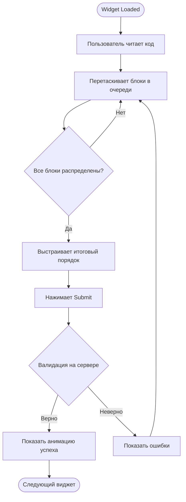
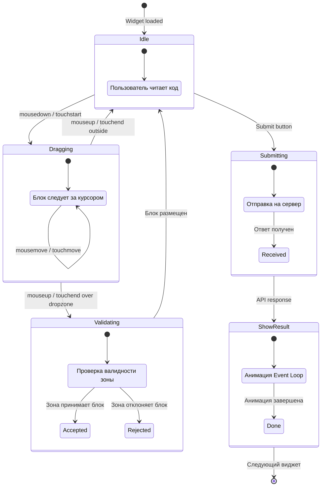
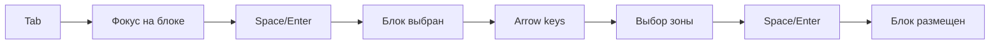
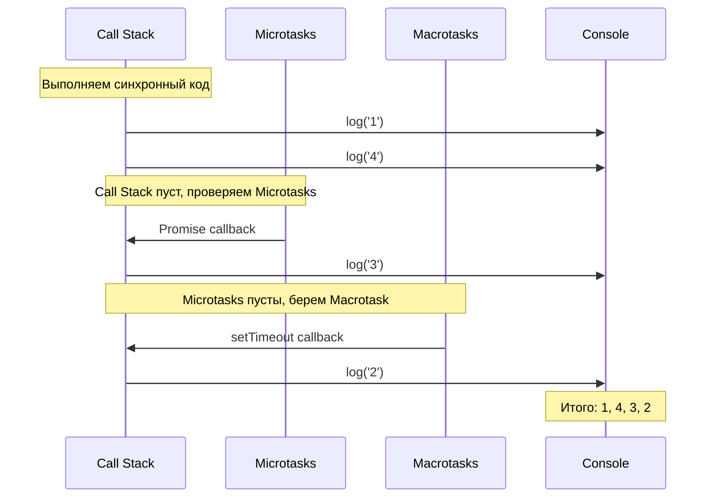

# Async Sorter: Event Loop Game

Этот документ описывает сложный виджет "Async Sorter" — интерактивную игру для изучения Event Loop в JavaScript.

## Концепция

Самый популярный вопрос на собеседованиях: "В каком порядке выведутся console.log?". Этот виджет геймифицирует этот вопрос.

**Цель:** Пользователь распределяет блоки кода по очередям (Call Stack, Microtasks, Macrotasks) и определяет итоговый порядок вывода.

## User Flow



## State Machine



## UI Layout

```
┌─────────────────────────────────────────────────────────┐
│  Tandem > Core JS > Async Sorter      [Skip] [Submit]   │
├─────────────────────────────────────────────────────────┤
│                                                         │
│  В каком порядке выведутся console.log?                 │
│  Перетащи блоки в правильные очереди:                   │
│                                                         │
│  Код:                                                   │
│  ┌───────────────────────────────────────────────┐     │
│  │ console.log('1');                              │     │
│  │ setTimeout(() => console.log('2'), 0);         │     │
│  │ Promise.resolve().then(() => console.log('3'));│     │
│  │ console.log('4');                              │     │
│  └───────────────────────────────────────────────┘     │
│                                                         │
│  ┌────────────┐ ┌────────────┐ ┌────────────┐          │
│  │ Call Stack │ │ Microtasks │ │ Macrotasks │          │
│  │            │ │            │ │            │          │
│  │ [1] [4]    │ │ [3]        │ │ [2]        │          │
│  │            │ │            │ │            │          │
│  └────────────┘ └────────────┘ └────────────┘          │
│                                                         │
│  Итоговый порядок вывода:                               │
│  ┌─────────────────────────────────────────────────┐   │
│  │ [ 1 ] [ 4 ] [ 3 ] [ 2 ]                         │   │
│  └─────────────────────────────────────────────────┘   │
│                                                         │
│                                        [Run Loop]       │
│                                                         │
└─────────────────────────────────────────────────────────┘
```

## JSON Schema

```json
{
  "id": "async-001",
  "type": "async-sorter",
  "version": 1,
  "difficulty": 2,
  "tags": ["event-loop", "microtasks", "macrotasks"],
  "payload": {
    "codeSnippet": "console.log('1');\nsetTimeout(() => console.log('2'), 0);\nPromise.resolve().then(() => console.log('3'));\nconsole.log('4');",
    "blocks": [
      { "id": "b1", "code": "console.log('1')", "label": "1" },
      { "id": "b2", "code": "setTimeout callback", "label": "2" },
      { "id": "b3", "code": "Promise.then callback", "label": "3" },
      { "id": "b4", "code": "console.log('4')", "label": "4" }
    ]
  }
}
```

**Answer:**

```typescript
interface AsyncSorterAnswer {
  callStack: string[];      // ["b1", "b4"]
  microtasks: string[];     // ["b3"]
  macrotasks: string[];     // ["b2"]
  outputOrder: string[];    // ["b1", "b4", "b3", "b2"]
}
```

---

## Drag & Drop Implementation

### Mouse Events (Desktop)

```typescript
interface DragState {
  isDragging: boolean;
  draggedBlockId: string | null;
  startX: number;
  startY: number;
  currentX: number;
  currentY: number;
  sourceZone: ZoneType | null;
}

type ZoneType = 'pool' | 'callStack' | 'microtasks' | 'macrotasks' | 'output';

// Event handlers
function onMouseDown(event: MouseEvent, blockId: string) {
  state.isDragging = true;
  state.draggedBlockId = blockId;
  state.startX = event.clientX;
  state.startY = event.clientY;
  // Clone element for visual feedback
  createDragGhost(blockId, event.clientX, event.clientY);
}

function onMouseMove(event: MouseEvent) {
  if (!state.isDragging) return;
  updateDragGhostPosition(event.clientX, event.clientY);
  highlightDropZone(event.clientX, event.clientY);
}

function onMouseUp(event: MouseEvent) {
  if (!state.isDragging) return;
  const targetZone = getDropZoneAt(event.clientX, event.clientY);
  if (targetZone) {
    moveBlockToZone(state.draggedBlockId, targetZone);
  }
  resetDragState();
}
```

### Touch Events (Mobile)

```typescript
// Touch API requires separate handling
function onTouchStart(event: TouchEvent, blockId: string) {
  const touch = event.touches[0];
  state.isDragging = true;
  state.draggedBlockId = blockId;
  state.startX = touch.clientX;
  state.startY = touch.clientY;

  // Prevent scrolling while dragging
  event.preventDefault();

  createDragGhost(blockId, touch.clientX, touch.clientY);
}

function onTouchMove(event: TouchEvent) {
  if (!state.isDragging) return;
  const touch = event.touches[0];

  // Prevent scrolling
  event.preventDefault();

  updateDragGhostPosition(touch.clientX, touch.clientY);
  highlightDropZone(touch.clientX, touch.clientY);
}

function onTouchEnd(event: TouchEvent) {
  if (!state.isDragging) return;

  // Use changedTouches for touchend
  const touch = event.changedTouches[0];
  const targetZone = getDropZoneAt(touch.clientX, touch.clientY);

  if (targetZone) {
    moveBlockToZone(state.draggedBlockId, targetZone);
  }

  resetDragState();
}
```

### Drop Zone Detection

```typescript
function getDropZoneAt(x: number, y: number): ZoneType | null {
  const zones: Array<{ element: HTMLElement; type: ZoneType }> = [
    { element: document.querySelector('.call-stack-zone')!, type: 'callStack' },
    { element: document.querySelector('.microtasks-zone')!, type: 'microtasks' },
    { element: document.querySelector('.macrotasks-zone')!, type: 'macrotasks' },
    { element: document.querySelector('.output-zone')!, type: 'output' },
  ];

  for (const zone of zones) {
    const rect = zone.element.getBoundingClientRect();
    if (
      x >= rect.left &&
      x <= rect.right &&
      y >= rect.top &&
      y <= rect.bottom
    ) {
      return zone.type;
    }
  }

  return null;
}
```

---

## Touch API: Mobile Specifics

### Проблемы и решения

| Проблема | Решение |
|----------|---------|
| Scroll конфликтует с drag | `event.preventDefault()` на touchmove |
| 300ms delay на tap | CSS `touch-action: manipulation` |
| Нет hover state | Показывать подсказку при touchstart |
| Мелкие элементы | Минимум 44x44px touch target |
| Нет right-click | Long press для альтернативных действий |

### CSS для мобильных

```css
.drag-block {
  /* Минимальный touch target */
  min-width: 44px;
  min-height: 44px;

  /* Отключаем выделение текста */
  user-select: none;
  -webkit-user-select: none;

  /* Отключаем контекстное меню */
  -webkit-touch-callout: none;

  /* Быстрый тап */
  touch-action: manipulation;
}

.drop-zone {
  /* Увеличенная область для drop на мобильных */
  padding: 20px;

  /* Визуальная обратная связь */
  transition: background-color 0.2s;
}

.drop-zone.highlight {
  background-color: rgba(0, 128, 255, 0.2);
}
```

### Pointer Events API (современный подход)

```typescript
// Унифицированный API для mouse и touch
function onPointerDown(event: PointerEvent, blockId: string) {
  // Захватываем pointer для элемента
  (event.target as HTMLElement).setPointerCapture(event.pointerId);

  state.isDragging = true;
  state.draggedBlockId = blockId;
  createDragGhost(blockId, event.clientX, event.clientY);
}

function onPointerMove(event: PointerEvent) {
  if (!state.isDragging) return;
  updateDragGhostPosition(event.clientX, event.clientY);
  highlightDropZone(event.clientX, event.clientY);
}

function onPointerUp(event: PointerEvent) {
  if (!state.isDragging) return;
  const targetZone = getDropZoneAt(event.clientX, event.clientY);
  if (targetZone) {
    moveBlockToZone(state.draggedBlockId, targetZone);
  }
  resetDragState();
}
```

---

## Accessibility (A11y)

### Keyboard Navigation

Для получения +10 баллов за A11y, необходимо поддерживать управление с клавиатуры.



### Реализация

```typescript
interface A11yState {
  focusedBlockId: string | null;
  selectedBlockId: string | null;
  focusedZone: ZoneType | null;
}

function onKeyDown(event: KeyboardEvent) {
  switch (event.key) {
    case 'Tab':
      // Стандартная навигация по блокам
      break;

    case ' ':
    case 'Enter':
      if (a11yState.selectedBlockId) {
        // Разместить блок в текущей зоне
        if (a11yState.focusedZone) {
          moveBlockToZone(a11yState.selectedBlockId, a11yState.focusedZone);
          a11yState.selectedBlockId = null;
          announceToScreenReader(`Block placed in ${a11yState.focusedZone}`);
        }
      } else if (a11yState.focusedBlockId) {
        // Выбрать блок для перемещения
        a11yState.selectedBlockId = a11yState.focusedBlockId;
        announceToScreenReader('Block selected. Use arrow keys to choose zone.');
      }
      event.preventDefault();
      break;

    case 'ArrowLeft':
    case 'ArrowRight':
      if (a11yState.selectedBlockId) {
        // Переключение между зонами
        a11yState.focusedZone = getNextZone(a11yState.focusedZone, event.key);
        announceToScreenReader(`Zone: ${a11yState.focusedZone}`);
        event.preventDefault();
      }
      break;

    case 'Escape':
      // Отмена выбора
      a11yState.selectedBlockId = null;
      announceToScreenReader('Selection cancelled');
      break;
  }
}

function announceToScreenReader(message: string) {
  const announcer = document.getElementById('sr-announcer');
  if (announcer) {
    announcer.textContent = message;
  }
}
```

### ARIA атрибуты

```html
<!-- Live region для screen readers -->
<div id="sr-announcer" aria-live="polite" aria-atomic="true" class="sr-only"></div>

<!-- Draggable block -->
<div
  class="drag-block"
  role="button"
  tabindex="0"
  aria-grabbed="false"
  aria-label="console.log('1'). Press Space to select, then use arrow keys to move."
>
  1
</div>

<!-- Drop zone -->
<div
  class="drop-zone"
  role="listbox"
  aria-label="Call Stack zone. Contains synchronous operations."
  aria-dropeffect="move"
>
  <!-- Blocks here -->
</div>
```

### CSS для A11y

```css
/* Скрыть визуально, но оставить для screen readers */
.sr-only {
  position: absolute;
  width: 1px;
  height: 1px;
  padding: 0;
  margin: -1px;
  overflow: hidden;
  clip: rect(0, 0, 0, 0);
  white-space: nowrap;
  border: 0;
}

/* Видимый фокус */
.drag-block:focus {
  outline: 3px solid #005fcc;
  outline-offset: 2px;
}

/* Выбранный блок */
.drag-block[aria-grabbed="true"] {
  background-color: #e0f0ff;
  border: 2px dashed #005fcc;
}

/* Активная зона */
.drop-zone:focus-within {
  outline: 2px solid #005fcc;
}
```

---

## Анимация Event Loop

После успешного ответа показываем анимацию работы Event Loop:



### Реализация анимации

```typescript
async function animateEventLoop(answer: AsyncSorterAnswer) {
  const delay = (ms: number) => new Promise(r => setTimeout(r, ms));

  // 1. Выполняем Call Stack
  for (const blockId of answer.callStack) {
    highlightBlock(blockId, 'executing');
    await delay(500);
    moveToOutput(blockId);
    await delay(300);
  }

  // 2. Выполняем Microtasks
  for (const blockId of answer.microtasks) {
    highlightZone('microtasks');
    await delay(200);
    highlightBlock(blockId, 'executing');
    await delay(500);
    moveToOutput(blockId);
    await delay(300);
  }

  // 3. Выполняем Macrotasks
  for (const blockId of answer.macrotasks) {
    highlightZone('macrotasks');
    await delay(200);
    highlightBlock(blockId, 'executing');
    await delay(500);
    moveToOutput(blockId);
    await delay(300);
  }

  showSuccessMessage();
}
```

---

## Эстимейт: Async Sorter

| Задача | Min | Max | Avg | Примечание |
|--------|-----|-----|-----|------------|
| UI Layout (HTML/CSS) | 3ч | 5ч | 4ч | Три зоны + output |
| Mouse D&D | 4ч | 8ч | 6ч | Базовая функциональность |
| Touch D&D | 4ч | 8ч | 6ч | Touch API, тестирование на устройствах |
| A11y (клавиатура) | 5ч | 10ч | 7.5ч | ARIA, screen reader support |
| Анимация Event Loop | 2ч | 4ч | 3ч | CSS transitions + JS |
| Валидация + API | 2ч | 3ч | 2.5ч | Интеграция с backend |
| Баг-фиксы, edge cases | 3ч | 6ч | 4.5ч | Отладка D&D — это сложно |
| **Итого** | **23ч** | **44ч** | **33.5ч** |

> **Важно:** D&D — одна из самых сложных задач во фронтенде. Закладывайте время на отладку. Тестируйте на реальных устройствах, не только в эмуляторе.

---

## Типичные ошибки

### 1. Scroll во время drag на мобильных

```typescript
// Плохо: страница скроллится при перетаскивании
function onTouchMove(event: TouchEvent) {
  updatePosition(event.touches[0]);
  // Забыли preventDefault
}

// Хорошо
function onTouchMove(event: TouchEvent) {
  event.preventDefault(); // Блокируем scroll
  updatePosition(event.touches[0]);
}
```

### 2. Потеря pointer при выходе за пределы элемента

```typescript
// Плохо: события слушаются только на элементе
block.addEventListener('mousemove', onMouseMove);

// Хорошо: слушаем на document
document.addEventListener('mousemove', onMouseMove);
document.addEventListener('mouseup', onMouseUp);
```

### 3. Нет визуальной обратной связи

```typescript
// Плохо: пользователь не понимает, куда можно бросить
function onDrag() {
  updateGhostPosition();
}

// Хорошо: подсвечиваем валидные зоны
function onDrag() {
  updateGhostPosition();
  highlightValidDropZones();
  showDropPreview();
}
```

### 4. Жесткая привязка к правильному ответу

```typescript
// Плохо: ответы в коде
const correctOrder = ['b1', 'b4', 'b3', 'b2'];

// Хорошо: валидация через API
const verdict = await api.submitAnswer(widgetId, userAnswer);
```
