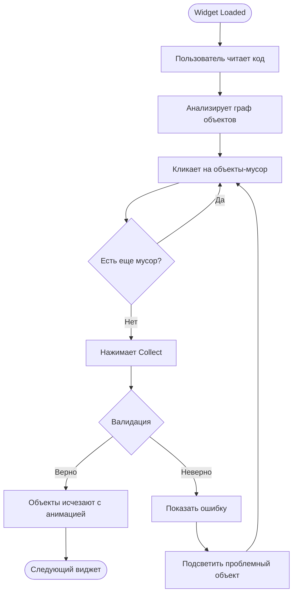
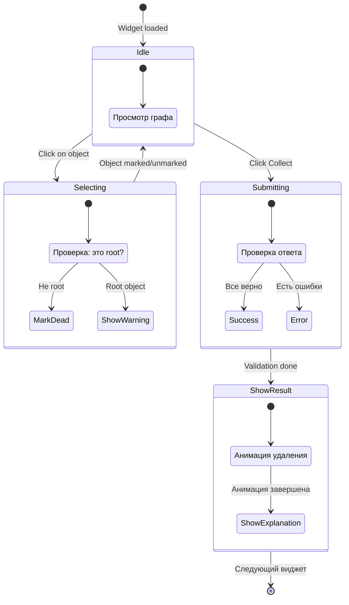
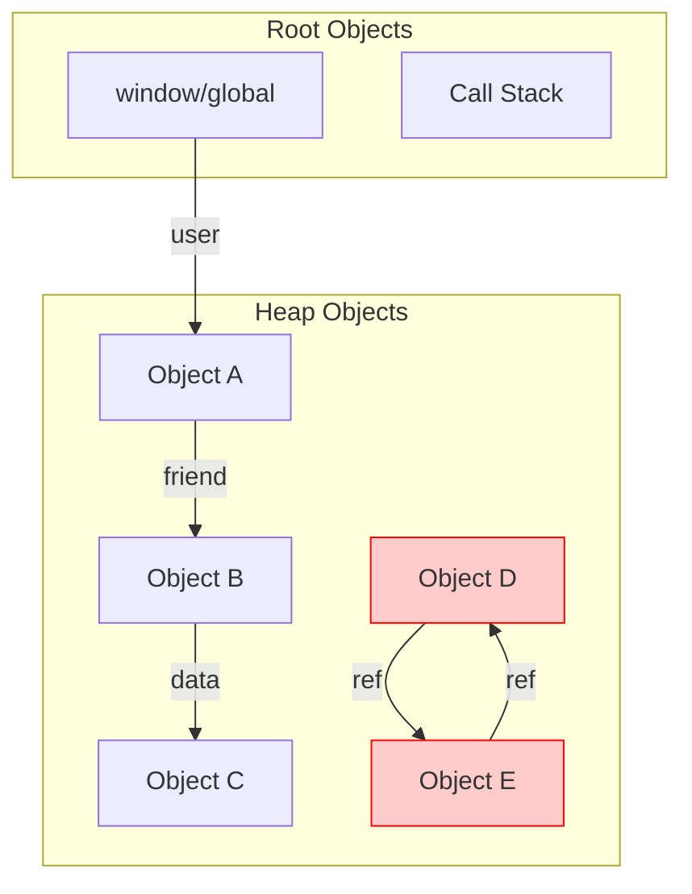

# Memory Game: Be the Garbage Collector

Этот документ описывает сложный виджет "Memory Game" — интерактивную игру для изучения работы Garbage Collector в JavaScript.

## Концепция

Вместо того чтобы писать сложный алгоритм, который сам находит мусор, мы просим студента **стать Garbage Collector'ом**.

**Цель:** Пользователь смотрит на граф объектов и код, который только что выполнился, и кликает на объекты, которые должны быть удалены из памяти.

## Чему учит этот виджет

1. **Reachability (Достижимость)** — основной принцип GC в JS
2. **Mark-and-Sweep** vs **Reference Counting** — разница подходов
3. **Циклические ссылки** — почему они не проблема для Mark-and-Sweep
4. **Root objects** — что считается корнем (global, window, текущий стек)

## User Flow



## State Machine



## Граф объектов



В этом примере:

- **A, B, C** — достижимы от Global через цепочку ссылок (живые)
- **D, E** — образуют цикл, но недостижимы от Root (мусор)

## UI Layout

```
┌─────────────────────────────────────────────────────────┐
│  Tandem > Core JS > Memory Game       [Skip] [Collect]  │
├─────────────────────────────────────────────────────────┤
│                                                         │
│  Код, который выполнился:                               │
│  ┌───────────────────────────────────────────────┐     │
│  │ let a = {val: 1};                              │     │
│  │ let b = a;                                     │     │
│  │ a = null;  // <-- только что выполнилось      │     │
│  └───────────────────────────────────────────────┘     │
│                                                         │
│  Кликни на объекты, которые станут мусором:             │
│                                                         │
│  ┌───────────────────────────────────────────────┐     │
│  │                                               │     │
│  │     [window]                                  │     │
│  │        │                                      │     │
│  │        ▼                                      │     │
│  │   ┌─────────┐        ┌─────────┐             │     │
│  │   │ var 'a' │───X    │ var 'b' │             │     │
│  │   │  null   │        │   ●───────────┐       │     │
│  │   └─────────┘        └─────────┘     │       │     │
│  │                                      │       │     │
│  │                            ┌─────────▼─────┐ │     │
│  │                            │ Object {val:1}│ │     │
│  │                            │    ЖИВОЙ      │ │     │
│  │                            └───────────────┘ │     │
│  │                                              │     │
│  └───────────────────────────────────────────────┘     │
│                                                         │
│  Помечено как мусор: 0 объектов                         │
│                                                         │
└─────────────────────────────────────────────────────────┘
```

## JSON Schema

```json
{
  "id": "gc-001",
  "type": "memory-game",
  "version": 1,
  "difficulty": 2,
  "tags": ["garbage-collection", "memory", "reachability"],
  "payload": {
    "codeSnippet": "let a = {val: 1};\nlet b = a;\na = null;",
    "highlightedLine": 3,
    "objects": [
      { "id": "var-a", "label": "Variable 'a'", "x": 100, "y": 150 },
      { "id": "var-b", "label": "Variable 'b'", "x": 250, "y": 150 },
      { "id": "obj-1", "label": "Object {val:1}", "x": 350, "y": 250 }
    ],
    "links": [{ "from": "var-b", "to": "obj-1", "label": "ref" }],
    "rootIds": ["global"],
    "rootLinks": [
      { "from": "global", "to": "var-a" },
      { "from": "global", "to": "var-b" }
    ]
  }
}
```

> **Примечание:** `garbageIds` не отправляется клиенту в Real Mode. В этом примере мусора нет — Object {val:1} достижим через var 'b'.

### Пример с мусором

```json
{
  "id": "gc-002",
  "type": "memory-game",
  "version": 1,
  "difficulty": 3,
  "tags": ["garbage-collection", "cycles"],
  "payload": {
    "codeSnippet": "let obj1 = {};\nlet obj2 = {};\nobj1.ref = obj2;\nobj2.ref = obj1;\nobj1 = null;\nobj2 = null;",
    "highlightedLine": 6,
    "objects": [
      { "id": "var-1", "label": "Variable 'obj1'", "x": 100, "y": 100 },
      { "id": "var-2", "label": "Variable 'obj2'", "x": 100, "y": 200 },
      { "id": "heap-1", "label": "Object #1", "x": 300, "y": 100 },
      { "id": "heap-2", "label": "Object #2", "x": 300, "y": 200 }
    ],
    "links": [
      { "from": "heap-1", "to": "heap-2", "label": "ref" },
      { "from": "heap-2", "to": "heap-1", "label": "ref" }
    ],
    "rootIds": ["global"],
    "rootLinks": [
      { "from": "global", "to": "var-1" },
      { "from": "global", "to": "var-2" }
    ]
  }
}
```

В этом примере:

- `var-1` и `var-2` теперь указывают на `null`
- `heap-1` и `heap-2` образуют цикл, но недостижимы от root
- **Правильный ответ:** пометить `heap-1` и `heap-2` как мусор

## Алгоритм валидации (на сервере)

```typescript
interface ValidationInput {
  objects: MemoryObject[];
  links: MemoryLink[];
  rootIds: string[];
  rootLinks: { from: string; to: string }[];
  markedAsGarbage: string[]; // Ответ пользователя
}

function validateGarbageCollection(input: ValidationInput): ValidationResult {
  // 1. Построить граф достижимости
  const reachable = new Set<string>();

  // 2. BFS/DFS от корней
  const queue = [...input.rootIds];

  // Добавить объекты, связанные с корнями
  for (const link of input.rootLinks) {
    if (input.rootIds.includes(link.from)) {
      queue.push(link.to);
    }
  }

  while (queue.length > 0) {
    const current = queue.shift()!;
    if (reachable.has(current)) continue;
    reachable.add(current);

    // Найти все ссылки из текущего объекта
    for (const link of input.links) {
      if (link.from === current && !reachable.has(link.to)) {
        queue.push(link.to);
      }
    }
  }

  // 3. Определить мусор (объекты, недостижимые от корней)
  const objectIds = input.objects.map((o) => o.id);
  const actualGarbage = objectIds.filter((id) => !reachable.has(id));

  // 4. Сравнить с ответом пользователя
  const userMarked = new Set(input.markedAsGarbage);
  const actualSet = new Set(actualGarbage);

  const missedGarbage = actualGarbage.filter((id) => !userMarked.has(id));
  const wronglyMarked = input.markedAsGarbage.filter(
    (id) => !actualSet.has(id),
  );

  return {
    isCorrect: missedGarbage.length === 0 && wronglyMarked.length === 0,
    errors: {
      memoryLeak: missedGarbage, // "Пропустили мусор"
      killedAlive: wronglyMarked, // "Удалили живой объект"
    },
    explanation: generateExplanation(missedGarbage, wronglyMarked),
  };
}
```

## Визуализация графа

### SVG-based rendering

```typescript
interface GraphRenderer {
  container: SVGElement;
  objects: Map<string, SVGGElement>;
  links: SVGLineElement[];

  render(data: MemoryGamePayload): void;
  markAsGarbage(objectId: string): void;
  unmarkGarbage(objectId: string): void;
  highlightError(objectId: string, type: "missed" | "wrong"): void;
  animateCollection(garbageIds: string[]): Promise<void>;
}

function createObjectNode(obj: MemoryObject): SVGGElement {
  const group = document.createElementNS("http://www.w3.org/2000/svg", "g");
  group.setAttribute("transform", `translate(${obj.x}, ${obj.y})`);

  // Фон
  const rect = document.createElementNS("http://www.w3.org/2000/svg", "rect");
  rect.setAttribute("width", "120");
  rect.setAttribute("height", "50");
  rect.setAttribute("rx", "8");
  rect.setAttribute("class", "object-node");

  // Текст
  const text = document.createElementNS("http://www.w3.org/2000/svg", "text");
  text.textContent = obj.label;
  text.setAttribute("x", "60");
  text.setAttribute("y", "30");
  text.setAttribute("text-anchor", "middle");

  group.appendChild(rect);
  group.appendChild(text);

  // Обработчик клика
  group.addEventListener("click", () => toggleGarbageMark(obj.id));

  return group;
}

function createLink(
  from: MemoryObject,
  to: MemoryObject,
  label?: string,
): SVGGElement {
  const group = document.createElementNS("http://www.w3.org/2000/svg", "g");

  // Линия
  const line = document.createElementNS("http://www.w3.org/2000/svg", "line");
  line.setAttribute("x1", String(from.x + 120)); // Правый край from
  line.setAttribute("y1", String(from.y + 25)); // Центр по высоте
  line.setAttribute("x2", String(to.x)); // Левый край to
  line.setAttribute("y2", String(to.y + 25));
  line.setAttribute("class", "object-link");
  line.setAttribute("marker-end", "url(#arrowhead)");

  group.appendChild(line);

  // Подпись (опционально)
  if (label) {
    const text = document.createElementNS("http://www.w3.org/2000/svg", "text");
    const midX = (from.x + 120 + to.x) / 2;
    const midY = (from.y + to.y + 50) / 2;
    text.setAttribute("x", String(midX));
    text.setAttribute("y", String(midY - 5));
    text.setAttribute("class", "link-label");
    text.textContent = label;
    group.appendChild(text);
  }

  return group;
}
```

### CSS для состояний

```css
.object-node {
  fill: #ffffff;
  stroke: #333333;
  stroke-width: 2;
  cursor: pointer;
  transition: all 0.3s ease;
}

.object-node:hover {
  fill: #f0f0f0;
}

/* Живой объект (достижим от root) */
.object-node.alive {
  fill: #e8f5e9;
  stroke: #4caf50;
}

/* Помечен как мусор пользователем */
.object-node.marked-garbage {
  fill: #ffebee;
  stroke: #f44336;
  stroke-dasharray: 5, 5;
}

/* Ошибка: пропустили мусор */
.object-node.error-missed {
  fill: #fff3e0;
  stroke: #ff9800;
  animation: pulse 1s infinite;
}

/* Ошибка: удалили живой */
.object-node.error-wrong {
  fill: #ffcdd2;
  stroke: #d32f2f;
  animation: shake 0.5s;
}

/* Root объект (нельзя удалить) */
.object-node.root {
  fill: #e3f2fd;
  stroke: #1976d2;
  stroke-width: 3;
  cursor: not-allowed;
}

.object-link {
  stroke: #666666;
  stroke-width: 2;
  fill: none;
}

/* Битая ссылка (после a = null) */
.object-link.broken {
  stroke: #cccccc;
  stroke-dasharray: 3, 3;
}

@keyframes pulse {
  0%,
  100% {
    opacity: 1;
  }
  50% {
    opacity: 0.5;
  }
}

@keyframes shake {
  0%,
  100% {
    transform: translateX(0);
  }
  25% {
    transform: translateX(-5px);
  }
  75% {
    transform: translateX(5px);
  }
}
```

## Анимация GC

После правильного ответа показываем анимацию "сборки мусора":

```typescript
async function animateGarbageCollection(garbageIds: string[]): Promise<void> {
  const delay = (ms: number) => new Promise((r) => setTimeout(r, ms));

  // 1. Подсветить все объекты-мусор
  for (const id of garbageIds) {
    const node = getObjectNode(id);
    node.classList.add("collecting");
    await delay(200);
  }

  await delay(500);

  // 2. Fade out с эффектом "растворения"
  for (const id of garbageIds) {
    const node = getObjectNode(id);
    node.style.transition = "opacity 0.5s, transform 0.5s";
    node.style.opacity = "0";
    node.style.transform = "scale(0.5)";
  }

  await delay(600);

  // 3. Удалить из DOM
  for (const id of garbageIds) {
    const node = getObjectNode(id);
    node.remove();
  }

  // 4. Показать сообщение об успехе
  showMessage("Memory freed successfully!");
}
```

## Audio Feedback

```typescript
const sounds = {
  markGarbage: new Audio("/sounds/mark.mp3"),
  unmarkGarbage: new Audio("/sounds/unmark.mp3"),
  collect: new Audio("/sounds/collect.mp3"),
  error: new Audio("/sounds/error.mp3"),
  success: new Audio("/sounds/success.mp3"),
};

function toggleGarbageMark(objectId: string) {
  const isMarked = state.markedGarbage.has(objectId);

  if (isMarked) {
    state.markedGarbage.delete(objectId);
    sounds.unmarkGarbage.play();
  } else {
    state.markedGarbage.add(objectId);
    sounds.markGarbage.play();
  }

  updateUI();
}

async function onCollect() {
  const result = await api.submitAnswer(widgetId, {
    markedAsGarbage: [...state.markedGarbage],
  });

  if (result.isCorrect) {
    sounds.collect.play();
    await animateGarbageCollection([...state.markedGarbage]);
    sounds.success.play();
  } else {
    sounds.error.play();
    highlightErrors(result.errors);
  }
}
```

---

## Эстимейт: Memory Game

| Задача                                 | Min     | Max     | Avg     | Примечание                  |
| -------------------------------------- | ------- | ------- | ------- | --------------------------- |
| SVG граф (рендеринг объектов и связей) | 4ч      | 8ч      | 6ч      | Позиционирование, стрелки   |
| Интерактивность (клик для пометки)     | 2ч      | 4ч      | 3ч      | Toggle состояния            |
| Визуализация состояний (CSS)           | 2ч      | 4ч      | 3ч      | Цвета, анимации             |
| Анимация GC                            | 2ч      | 4ч      | 3ч      | Fade out, сообщения         |
| Audio API интеграция                   | 1ч      | 2ч      | 1.5ч    | Звуки на события            |
| Валидация + API                        | 2ч      | 4ч      | 3ч      | Интеграция с backend        |
| Генерация сценариев (контент)          | 3ч      | 6ч      | 4.5ч    | 5-10 задач разной сложности |
| **Итого**                              | **16ч** | **32ч** | **24ч** |

---

## Правила для создания сценариев

### 1. Четко определять корни

```json
{
  "rootIds": ["global"],
  "rootLinks": [{ "from": "global", "to": "var-x" }]
}
```

### 2. Показывать момент "после выполнения"

Всегда указывайте, какая строка только что выполнилась:

```json
{
  "codeSnippet": "let a = {};\nlet b = a;\na = null;",
  "highlightedLine": 3 // "a = null" только что выполнилось
}
```

### 3. Включать разные типы сценариев

| Тип                                | Пример                              | Сложность |
| ---------------------------------- | ----------------------------------- | --------- |
| Простая очистка                    | `a = null`                          | Easy      |
| Цепочка ссылок                     | `a.b.c`, обнуляем `a`               | Medium    |
| Циклические ссылки                 | Два объекта ссылаются друг на друга | Hard      |
| Сохранение через другую переменную | `b = a; a = null` — объект жив      | Medium    |
| Closure сохраняет ссылку           | Объект в замыкании остается живым   | Hard      |

### 4. Давать понятные объяснения

```json
{
  "explanation": {
    "ru": "Object {val:1} остается живым, потому что на него ссылается переменная 'b'. Хотя 'a' теперь null, объект достижим через 'b' → он не мусор.",
    "en": "Object {val:1} stays alive because variable 'b' still references it. Although 'a' is now null, the object is reachable through 'b' → not garbage."
  }
}
```

---

## Типичные ошибки

### 1. Забыть про rootIds

```json
// Плохо: непонятно, откуда начинать обход
{
  "objects": [...],
  "links": [...]
}

// Хорошо: явно указаны корни
{
  "objects": [...],
  "links": [...],
  "rootIds": ["global"],
  "rootLinks": [...]
}
```

### 2. Неправильная интерпретация Reference Counting

Reference Counting НЕ используется в современных JS движках для основного GC. Циклические ссылки не являются проблемой для Mark-and-Sweep.

```javascript
// Эти объекты БУДУТ собраны, несмотря на цикл
let a = {};
let b = {};
a.ref = b;
b.ref = a;
a = null;
b = null;
// После этого оба объекта — мусор (недостижимы от root)
```

### 3. Путать переменную и объект

```javascript
let a = { val: 1 };
let b = a;
a = null;
// Переменная 'a' теперь null
// Но Object {val:1} ЖИВ, потому что 'b' на него ссылается
```

### 4. Забыть про замыкания

```javascript
function createCounter() {
  let count = { value: 0 }; // Этот объект живет пока живет counter
  return () => count.value++;
}
const counter = createCounter();
// Object {value: 0} НЕ мусор — он в замыкании функции counter
```
