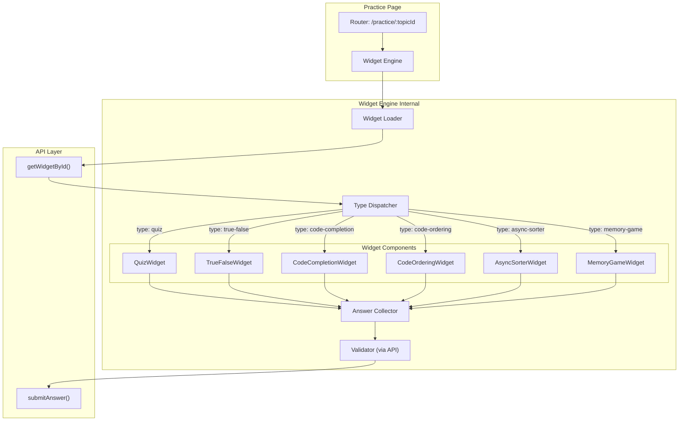
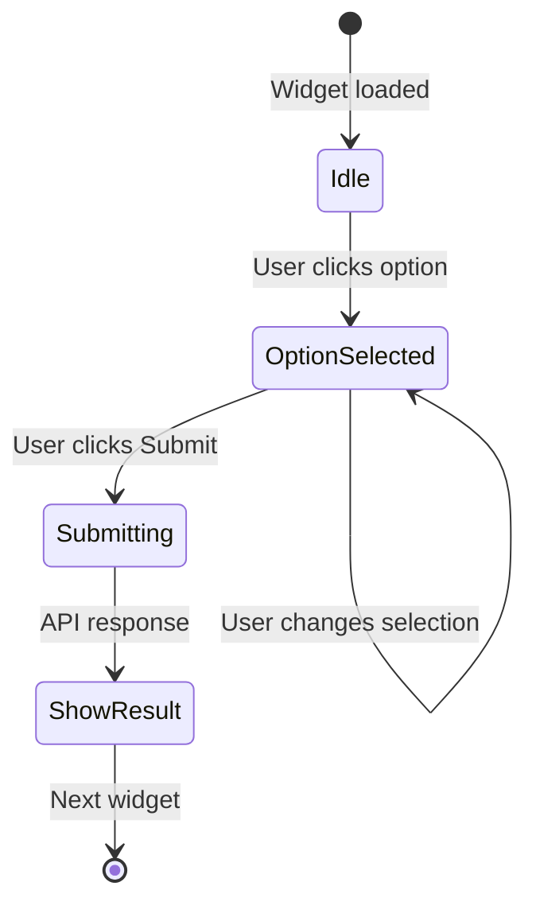
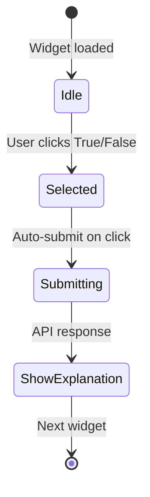
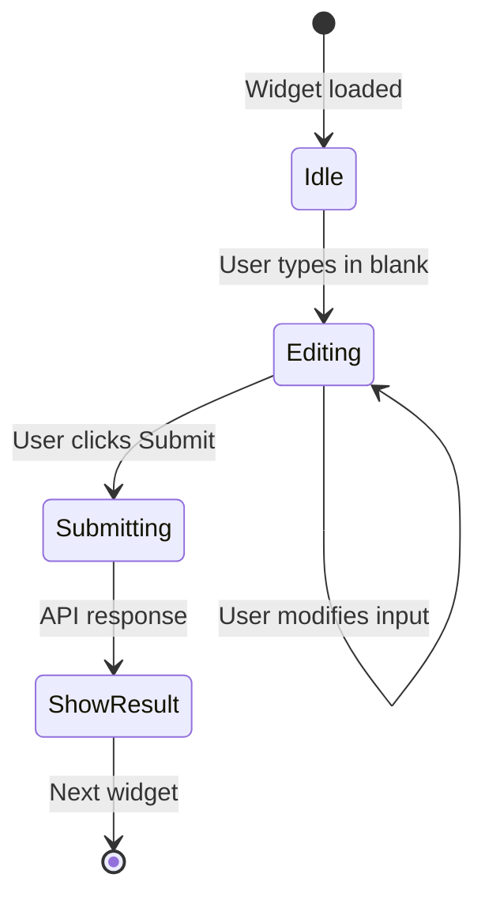
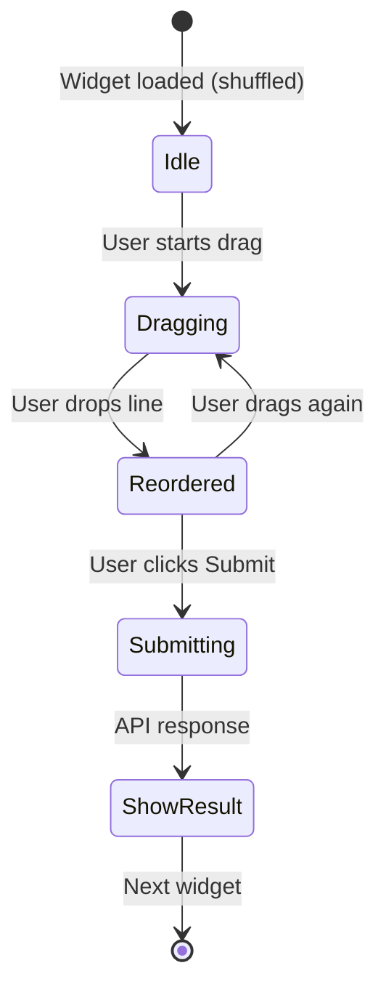

# Widget Engine: Архитектура и простые виджеты

Этот документ описывает архитектуру универсального движка виджетов и реализацию простых виджетов (Quiz, True/False, Code Completion, Code Ordering).

## Концепция

Widget Engine — это компонент, который:
1. Получает JSON-схему виджета от API
2. Определяет тип виджета по полю `type`
3. Рендерит соответствующий UI
4. Собирает ответ пользователя
5. Отправляет ответ на валидацию

## Архитектура



## Паттерн: Strategy vs Switch/Case

### Проблема

Наивная реализация через `switch/case`:

```typescript
// Плохо: огромный switch, сложно поддерживать
function renderWidget(widget: Widget) {
  switch (widget.type) {
    case 'quiz':
      return renderQuiz(widget);
    case 'true-false':
      return renderTrueFalse(widget);
    // ... 10+ типов виджетов
    default:
      throw new Error(`Unknown widget type: ${widget.type}`);
  }
}
```

### Решение: Strategy Pattern

```typescript
// Интерфейс для всех виджетов
interface WidgetStrategy<T extends Widget, A> {
  type: T['type'];
  render(widget: T, onAnswer: (answer: A) => void): HTMLElement;
  validate(answer: A): boolean; // Для Mock Mode
}

// Реализация для Quiz
const quizStrategy: WidgetStrategy<QuizWidget, QuizAnswer> = {
  type: 'quiz',
  render(widget, onAnswer) {
    // Создаем UI для quiz
    const container = document.createElement('div');
    // ...
    return container;
  },
  validate(answer) {
    // Для Mock Mode
    return answer.selectedIndex === this.correctIndex;
  }
};

// Регистрация стратегий
const strategies = new Map<WidgetType, WidgetStrategy<any, any>>();
strategies.set('quiz', quizStrategy);
strategies.set('true-false', trueFalseStrategy);
// ...

// Использование
function renderWidget(widget: Widget, onAnswer: (answer: unknown) => void) {
  const strategy = strategies.get(widget.type);
  if (!strategy) {
    throw new Error(`Unknown widget type: ${widget.type}`);
  }
  return strategy.render(widget, onAnswer);
}
```

### Преимущества Strategy Pattern

1. **Расширяемость**: добавление нового виджета = новый файл, без изменения существующего кода
2. **Тестируемость**: каждая стратегия тестируется изолированно
3. **Типизация**: TypeScript проверяет соответствие типов
4. **Разделение ответственности**: каждый виджет знает только о себе

---

## Discriminated Unions для типизации

```typescript
// Базовый тип с дискриминатором
interface BaseWidget {
  id: string;
  type: WidgetType;
  version: number;
  difficulty: 1 | 2 | 3;
  tags: string[];
}

// Discriminated Union
type Widget =
  | (BaseWidget & { type: 'quiz'; payload: QuizPayload })
  | (BaseWidget & { type: 'true-false'; payload: TrueFalsePayload })
  | (BaseWidget & { type: 'code-completion'; payload: CodeCompletionPayload })
  | (BaseWidget & { type: 'code-ordering'; payload: CodeOrderingPayload })
  | (BaseWidget & { type: 'async-sorter'; payload: AsyncSorterPayload })
  | (BaseWidget & { type: 'memory-game'; payload: MemoryGamePayload });

// TypeScript сам сужает тип внутри switch
function processWidget(widget: Widget) {
  switch (widget.type) {
    case 'quiz':
      // TypeScript знает, что widget.payload это QuizPayload
      console.log(widget.payload.options);
      break;
    case 'async-sorter':
      // TypeScript знает, что widget.payload это AsyncSorterPayload
      console.log(widget.payload.blocks);
      break;
  }
}
```

### Типичные ошибки TS и как их избежать

```typescript
// Ошибка: Type 'string' is not assignable to type 'never'
// Причина: не все типы обработаны в switch

// Решение: exhaustive check
function assertNever(x: never): never {
  throw new Error(`Unexpected value: ${x}`);
}

function getWidgetTitle(widget: Widget): string {
  switch (widget.type) {
    case 'quiz':
      return 'Quiz';
    case 'true-false':
      return 'True/False';
    // Если забыли case, TS покажет ошибку здесь:
    default:
      return assertNever(widget);
  }
}
```

---

## Простые виджеты

### Quiz Widget

Классический тест с выбором одного ответа.



**JSON Schema:**

```json
{
  "id": "quiz-001",
  "type": "quiz",
  "version": 1,
  "difficulty": 1,
  "tags": ["typeof", "basics"],
  "payload": {
    "question": {
      "ru": "Что вернет typeof null?",
      "en": "What does typeof null return?"
    },
    "options": [
      { "ru": "null", "en": "null" },
      { "ru": "undefined", "en": "undefined" },
      { "ru": "object", "en": "object" },
      { "ru": "NaN", "en": "NaN" }
    ]
  }
}
```

**UI:**

```
┌─────────────────────────────────────────────────────────┐
│  Что вернет typeof null?                                │
│                                                         │
│  ○ null                                                 │
│  ○ undefined                                            │
│  ● object                    ← выбрано                  │
│  ○ NaN                                                  │
│                                                         │
│                                        [Submit]         │
└─────────────────────────────────────────────────────────┘
```

**Answer Type:**

```typescript
interface QuizAnswer {
  selectedIndex: number;
}
```

---

### True/False Widget

Утверждение — правда или ложь?



**JSON Schema:**

```json
{
  "id": "tf-001",
  "type": "true-false",
  "version": 1,
  "difficulty": 1,
  "tags": ["promises", "order"],
  "payload": {
    "statement": {
      "ru": "Promise.all() возвращает результаты в порядке завершения промисов",
      "en": "Promise.all() returns results in order of completion"
    },
    "explanation": {
      "ru": "Promise.all() сохраняет порядок входного массива, независимо от времени выполнения",
      "en": "Promise.all() preserves input array order, regardless of completion time"
    }
  }
}
```

**UI:**

```
┌─────────────────────────────────────────────────────────┐
│  Promise.all() возвращает результаты в порядке          │
│  завершения промисов                                    │
│                                                         │
│     ┌──────────┐      ┌──────────┐                     │
│     │   TRUE   │      │  FALSE   │  ← нажато           │
│     └──────────┘      └──────────┘                     │
│                                                         │
│  ✓ Верно! Promise.all() сохраняет порядок входного     │
│    массива, независимо от времени выполнения            │
│                                                         │
└─────────────────────────────────────────────────────────┘
```

**Answer Type:**

```typescript
interface TrueFalseAnswer {
  value: boolean;
}
```

---

### Code Completion Widget

Заполни пропуски в коде.



**JSON Schema:**

```json
{
  "id": "cc-001",
  "type": "code-completion",
  "version": 1,
  "difficulty": 2,
  "tags": ["array-methods", "filter"],
  "payload": {
    "code": "const result = arr.___(x => x > 0);",
    "blanks": ["___"],
    "hints": [
      {
        "ru": "Этот метод возвращает новый массив с элементами, прошедшими проверку",
        "en": "This method returns a new array with elements that pass the test"
      }
    ]
  }
}
```

**UI:**

```
┌─────────────────────────────────────────────────────────┐
│  Заполни пропуски в коде:                               │
│                                                         │
│  ┌───────────────────────────────────────────────┐     │
│  │ const result = arr.[filter](x => x > 0);      │     │
│  │                     ↑ input                   │     │
│  └───────────────────────────────────────────────┘     │
│                                                         │
│  💡 Подсказка: Этот метод возвращает новый массив      │
│     с элементами, прошедшими проверку                   │
│                                                         │
│                                        [Submit]         │
└─────────────────────────────────────────────────────────┘
```

**Answer Type:**

```typescript
interface CodeCompletionAnswer {
  values: string[];  // ["filter"]
}
```

---

### Code Ordering Widget

Расставь строки кода в правильном порядке (Drag & Drop).



**JSON Schema:**

```json
{
  "id": "co-001",
  "type": "code-ordering",
  "version": 1,
  "difficulty": 2,
  "tags": ["debounce", "closures"],
  "payload": {
    "description": {
      "ru": "Расставь строки кода для реализации debounce функции",
      "en": "Arrange the code lines to implement a debounce function"
    },
    "lines": [
      "return function(...args) {",
      "let timeout;",
      "clearTimeout(timeout);",
      "timeout = setTimeout(() => fn(...args), delay);",
      "};"
    ]
  }
}
```

**UI:**

```
┌─────────────────────────────────────────────────────────┐
│  Расставь строки кода для реализации debounce функции   │
│                                                         │
│  function debounce(fn, delay) {                         │
│    ┌─────────────────────────────────────────────┐     │
│  1 │ let timeout;                                 │ ≡   │
│    └─────────────────────────────────────────────┘     │
│    ┌─────────────────────────────────────────────┐     │
│  2 │ return function(...args) {                  │ ≡   │
│    └─────────────────────────────────────────────┘     │
│    ┌─────────────────────────────────────────────┐     │
│  3 │ clearTimeout(timeout);                      │ ≡   │
│    └─────────────────────────────────────────────┘     │
│    ┌─────────────────────────────────────────────┐     │
│  4 │ timeout = setTimeout(() => fn(...args)...   │ ≡   │
│    └─────────────────────────────────────────────┘     │
│    ┌─────────────────────────────────────────────┐     │
│  5 │ };                                          │ ≡   │
│    └─────────────────────────────────────────────┘     │
│  }                                                      │
│                                                         │
│                                        [Submit]         │
└─────────────────────────────────────────────────────────┘
```

**Answer Type:**

```typescript
interface CodeOrderingAnswer {
  order: number[];  // [1, 0, 2, 3, 4] — индексы в правильном порядке
}
```

---

## Эстимейт: Widget Engine

| Задача | Min | Max | Avg |
|--------|-----|-----|-----|
| Архитектура (Strategy pattern, типы) | 3ч | 5ч | 4ч |
| Widget Loader + Dispatcher | 2ч | 4ч | 3ч |
| Quiz Widget | 2ч | 4ч | 3ч |
| True/False Widget | 1ч | 2ч | 1.5ч |
| Code Completion Widget | 2ч | 4ч | 3ч |
| Code Ordering Widget (D&D) | 3ч | 6ч | 4.5ч |
| Answer Collector + API интеграция | 2ч | 4ч | 3ч |
| **Итого Widget Engine** | **15ч** | **29ч** | **22ч** |

> **Примечание:** Эстимейт включает время на борьбу с TypeScript generics и discriminated unions. Для студентов без опыта работы со сложной типизацией закладывайте ближе к Max.

---

## Типичные ошибки

### 1. "any" вместо типизации

```typescript
// Плохо
function renderWidget(widget: any) { ... }

// Хорошо
function renderWidget<T extends Widget>(widget: T) { ... }
```

### 2. Мутация состояния

```typescript
// Плохо: мутируем исходные данные
widget.payload.options.sort();

// Хорошо: создаем копию
const shuffledOptions = [...widget.payload.options].sort(() => Math.random() - 0.5);
```

### 3. Отсутствие exhaustive check

```typescript
// Плохо: новый тип виджета не обрабатывается
switch (widget.type) {
  case 'quiz': return renderQuiz(widget);
  // Забыли добавить новый тип — нет ошибки компиляции
}

// Хорошо: TypeScript ругается, если не все типы обработаны
switch (widget.type) {
  case 'quiz': return renderQuiz(widget);
  default: return assertNever(widget);
}
```

### 4. Хранение правильных ответов на клиенте

```typescript
// Плохо: ответы в коде
const isCorrect = answer === widget.payload.correctIndex;

// Хорошо: валидация через API
const verdict = await api.submitAnswer(widget.id, answer);
const isCorrect = verdict.isCorrect;
```
