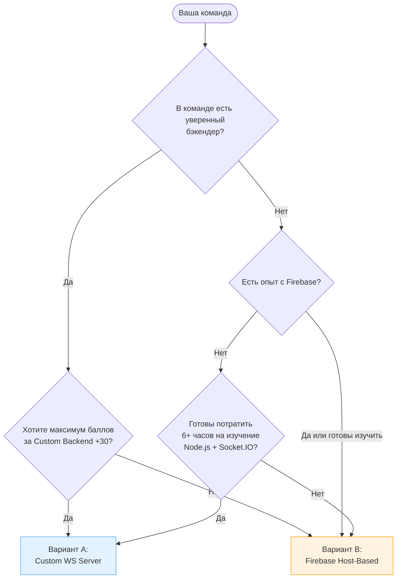

# Codenames — Interview Edition: Архитектурные варианты

Документация для примера проекта **Codenames — Interview Edition** разделена на **два архитектурных варианта**. Основная концепция, правила игры и UI mockups находятся в [02-codenames-game.md](../02-codenames-game.md).

---

## Какой вариант выбрать?



---

## Сравнение вариантов

| Аспект | Вариант A: Custom WS | Вариант B: Firebase Host-Based |
|--------|----------------------|-------------------------------|
| **Серверная часть** | Node.js + Express + Socket.IO | Нет сервера — браузер хоста = «сервер» |
| **State Machine** | Работает на сервере | Работает в браузере создателя комнаты |
| **Синхронизация** | WebSocket (Socket.IO) | Firebase Realtime Database (`onValue`) |
| **Деплой** | Vercel (FE) + Render (BE) | Vercel (FE) + Firebase проект |
| **Сложность** | Высокая (WS, State Machine на сервере, reconnect) | Средняя (Firebase SDK, Host Authority) |
| **Bus Factor** | Высокий — WS-Dev = SPOF | Низкий — все фронтендеры могут работать с Firebase |
| **Баллы: Custom Backend** | **+30** | — |
| **Баллы: Real-time / WS** | **+20** | **+20** (Firebase subscriptions) |
| **Баллы: BaaS CRUD** | +15 (Firestore) | **+15** (Firebase RTDB) |
| **Макс. Personal Features (Backend-Dev)** | ~125 | ~95 |
| **Холодный старт** | Да (Render free tier спит) | Нет |
| **Хост закрыл вкладку** | Сервер продолжает | **Game Over** (допустимо для учебного проекта) |

### Баллы: итого по команде

| Роль | Вариант A | Вариант B | Разница |
|------|-----------|-----------|---------|
| Великий Мёрдж (Lead) | ~685 | ~685 | ≈0 |
| Тихий Сокет (Backend / Firebase) | ~705 | ~675 | **-30** |
| Быстрый Рендер (Board) | ~655 | ~655 | ≈0 |
| Зоркий Линтер (Check) | ~650 | ~650 | ≈0 |
| Мудрый Мок (AI) | ~665 | ~665 | ≈0 |
| Ловкий Роутер (Lobby) | ~665 | ~665 | ≈0 |

> **Вывод:** Вариант B проигрывает ~30 баллов только для Backend-Dev (нет Custom Backend +30). Для остальных 5 человек разница минимальна. Выбирайте вариант исходя из навыков команды, а не баллов.

---

## Кодовые имена команды

Во всех документах используются JS/Frontend-тематические позывные:

| Роль | Кодовое имя | Перевод | Зона ответственности |
|------|-------------|---------|----------------------|
| Lead | **Великий Мёрдж** | Great Merge | Auth, CI/CD, Deployment, API Layer |
| Backend-Dev (A) / Firebase-Dev (B) | **Тихий Сокет** | Silent Socket | WS Server (A) / Firebase интеграция (B) |
| Board-Dev | **Быстрый Рендер** | Fast Render | Game Board UI, Card Component, Animations |
| Check-Dev | **Зоркий Линтер** | Sharp-Eyed Linter | Check Phase Popup, Question Bank, i18n |
| AI-Dev | **Мудрый Мок** | Wise Mock | AI Mock, Solo Mode, Landing Page |
| Lobby-Dev | **Ловкий Роутер** | Nimble Router | Lobby, Results, Profile, Responsive |

---

## Структура документации

```
02-codenames-game.md              # Product Spec (правила + UI mockups) — общий
02-codenames-game/
├── README.md                     # Сравнение вариантов (вы здесь)
├── variant-a/                    # Custom WS (Node.js + Socket.IO)
│   ├── README.md                 # Навигация + "Почему Custom WS"
│   ├── scoring-and-plan.md       # Расчёт баллов + 6-недельный план
│   ├── data-contracts.md         # TypeScript типы + WS протокол + API
│   ├── game-engine.md            # Server State Machine + Board Gen
│   ├── check-phase.md            # Проверка знаний (попап + банк вопросов)
│   ├── ai-spymaster.md           # AI Mock + Solo Mode
│   └── risks-and-mitigations.md  # WS-специфичные риски
└── variant-b/                    # Firebase Host-Based
    ├── README.md                 # Навигация + "Почему Firebase"
    ├── scoring-and-plan.md       # Расчёт баллов + 6-недельный план
    ├── data-contracts.md         # TypeScript типы + Firebase schema
    ├── game-engine.md            # Host-Based State Machine
    ├── check-phase.md            # Проверка знаний (Firebase events)
    ├── ai-spymaster.md           # AI Mock + Solo Mode
    └── risks-and-mitigations.md  # Firebase-специфичные риски
```

---

## Как использовать

1. **Прочитайте правила** — [02-codenames-game.md](../02-codenames-game.md) (общий для обоих вариантов)
2. **Выберите вариант** — используйте flowchart и таблицу сравнения выше
3. **Перейдите в папку варианта** — [variant-a/](./variant-a/) или [variant-b/](./variant-b/)
4. **Начните с scoring-and-plan.md** — поймите баллы, роли и сроки
5. **Согласуйте контракты** — data-contracts.md определяет типы и протоколы
6. **Изучите риски** — risks-and-mitigations.md до начала кодинга
