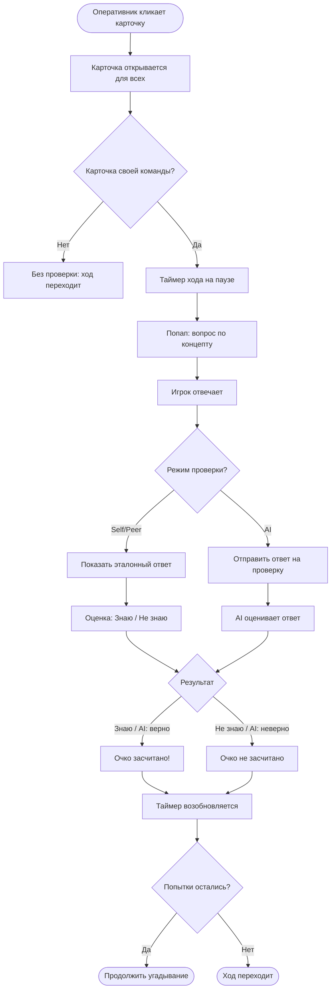
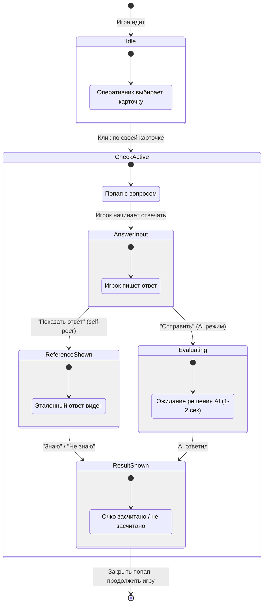
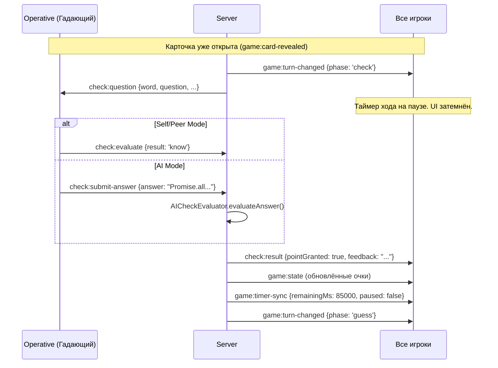

# Check Phase: Проверка знаний

Этот документ описывает фазу проверки знаний — уникальный образовательный компонент Codenames Interview Edition. После клика по карточке своей команды игра ставится на паузу и появляется попап с вопросом по выбранному JS/TS концепту.

## Концепция

Самый популярный вопрос на собеседованиях — "Расскажи про X". Check Phase геймифицирует этот момент: слово угадано, но очко засчитывается **только если игрок может объяснить концепт**.

**Цель:** Карточка открывается сразу (все видят, что слово "угадано"), но **очко команде засчитывается только при успешной проверке**. Это превращает Codenames из простой настольной игры в инструмент подготовки к интервью.

## User Flow



## State Machine



## UI Layout: Попап проверки

Игра на паузе, таймер остановлен, фон затемнён.

### Режим Self/Peer

```
┌─────────────────────────────────────────────────────────────┐
│  ░░░░░░░░░░░░░░░░░ (затемнённое поле) ░░░░░░░░░░░░░░░░░░░  │
│  ░░░                                                   ░░░  │
│  ░░░  ┌─────────────────────────────────────────────┐  ░░░  │
│  ░░░  │  Проверка знаний                     [×]    │  ░░░  │
│  ░░░  ├─────────────────────────────────────────────┤  ░░░  │
│  ░░░  │                                             │  ░░░  │
│  ░░░  │  Слово: closure                             │  ░░░  │
│  ░░░  │                                             │  ░░░  │
│  ░░░  │  Вопрос:                                    │  ░░░  │
│  ░░░  │  Что такое замыкание? Приведите пример.     │  ░░░  │
│  ░░░  │                                             │  ░░░  │
│  ░░░  │  Ваш ответ (опционально):                   │  ░░░  │
│  ░░░  │  ┌─────────────────────────────────────┐    │  ░░░  │
│  ░░░  │  │ Замыкание - это функция, которая... │    │  ░░░  │
│  ░░░  │  └─────────────────────────────────────┘    │  ░░░  │
│  ░░░  │                                             │  ░░░  │
│  ░░░  │  [Показать ответ]                           │  ░░░  │
│  ░░░  │                                             │  ░░░  │
│  ░░░  └─────────────────────────────────────────────┘  ░░░  │
│  ░░░                                                   ░░░  │
│  ░░░░░░░░░░░░░░░░░░░░░░░░░░░░░░░░░░░░░░░░░░░░░░░░░░░░░░░  │
└─────────────────────────────────────────────────────────────┘
```

**После нажатия "Показать ответ":**

```
┌─────────────────────────────────────────────────────────┐
│  Проверка знаний                                 [×]    │
├─────────────────────────────────────────────────────────┤
│                                                         │
│  Слово: closure                                         │
│                                                         │
│  Вопрос:                                                │
│  Что такое замыкание? Приведите пример.                 │
│                                                         │
│  Эталонный ответ:                                       │
│  ┌─────────────────────────────────────────────┐       │
│  │ Замыкание — это функция, которая запоминает │       │
│  │ переменные из внешней области видимости,     │       │
│  │ даже когда эта область уже завершила         │       │
│  │ выполнение.                                  │       │
│  │                                               │       │
│  │ Пример:                                       │       │
│  │ function counter() {                          │       │
│  │   let count = 0;                              │       │
│  │   return () => ++count;                       │       │
│  │ }                                             │       │
│  └─────────────────────────────────────────────┘       │
│                                                         │
│       [  Знаю  ✓  ]        [  Не знаю  ✗  ]           │
│                                                         │
└─────────────────────────────────────────────────────────┘
```

### Режим AI

```
┌─────────────────────────────────────────────────────────┐
│  Проверка знаний (AI)                            [×]    │
├─────────────────────────────────────────────────────────┤
│                                                         │
│  Слово: Promise                                         │
│                                                         │
│  Вопрос:                                                │
│  В чём разница между Promise.all и Promise.allSettled? │
│                                                         │
│  Ваш ответ:                                             │
│  ┌─────────────────────────────────────────────┐       │
│  │ Promise.all реджектится при первой ошибке,  │       │
│  │ а allSettled ждёт все промисы и возвращает  │       │
│  │ массив с status: fulfilled или rejected     │       │
│  └─────────────────────────────────────────────┘       │
│                                                         │
│                     [Отправить на проверку]              │
│                                                         │
│  ─────────────────────────────────────────────────────  │
│                                                         │
│  ✓ Очко засчитано!                                     │
│  AI: "Ответ верный. Promise.all завершается при        │
│  первом reject, а Promise.allSettled ждёт все."        │
│                                                         │
│                        [OK]                              │
│                                                         │
└─────────────────────────────────────────────────────────┘
```

---

## Режимы проверки

### Self/Peer — Само/взаимооценка

Простой режим, не требующий AI.

| Шаг | Действие | Кто |
|-----|----------|-----|
| 1 | Вопрос отображается | Система |
| 2 | Игрок формулирует ответ (устно или письменно) | Игрок |
| 3 | Нажимает "Показать ответ" | Игрок |
| 4 | Эталонный ответ отображается | Система |
| 5 | Оценка: "Знаю" / "Не знаю" | Игрок или команда соперника |
| 6 | Очко засчитывается при "Знаю" | Система |

**Кто оценивает:**
- **Self** — сам игрок (честная система)
- **Peer** — команда соперника нажимает "Знаю" / "Не знаю" (соревновательный элемент)

Режим выбирается при создании комнаты в Room Settings.

### AI — Проверка через AI (мокнута)

| Шаг | Действие | Кто |
|-----|----------|-----|
| 1 | Вопрос отображается | Система |
| 2 | Игрок пишет ответ в текстовое поле | Игрок |
| 3 | Нажимает "Отправить на проверку" | Игрок |
| 4 | AI оценивает ответ (mock: 1-2 сек) | AI Mock |
| 5 | Результат: очко засчитано/нет + feedback | Система |

> **Мок:** Реализация через `AICheckEvaluatorService` — keyword matching с реалистичной задержкой. Подробнее в [ai-spymaster.md](./ai-spymaster.md).

---

## Question Bank (Банк вопросов)

### Структура данных

```typescript
interface QuestionBank {
  [word: string]: CheckQuestion[];  // Несколько вопросов на слово
}

interface CheckQuestion {
  id: string;
  word: string;                    // JS/TS концепт
  question: string;                // Текст вопроса
  referenceAnswer: string;         // Эталонный ответ
  difficulty: 1 | 2 | 3;
  tags: string[];
}
```

### Правило выбора вопроса

```typescript
function selectQuestion(word: string, bank: QuestionBank): CheckQuestion {
  const questions = bank[word];
  if (!questions || questions.length === 0) {
    // Fallback: базовый вопрос
    return {
      id: `fallback-${word}`,
      word,
      question: `Объясните концепт "${word}" своими словами.`,
      referenceAnswer: `Ожидается объяснение ${word} с примером.`,
      difficulty: 1,
      tags: [],
    };
  }
  // Случайный вопрос из доступных
  return questions[Math.floor(Math.random() * questions.length)];
}
```

### Примеры вопросов (10+ концептов)

| Слово | Вопрос | Сложность |
|-------|--------|-----------|
| closure | Что такое замыкание? Приведите пример. | 1 |
| closure | Как замыкания могут приводить к утечкам памяти? | 3 |
| Promise | В чём разница между Promise.all и Promise.allSettled? | 2 |
| Promise | Что произойдет, если в then бросить ошибку? | 2 |
| hoisting | Как работает hoisting для let vs var? | 1 |
| hoisting | Почему TDZ (Temporal Dead Zone) существует для let/const? | 3 |
| prototype | Как работает цепочка прототипов? | 2 |
| prototype | В чём разница между `__proto__` и `prototype`? | 3 |
| event loop | В каком порядке выполняются microtask и macrotask? | 2 |
| event loop | Что произойдёт, если microtask добавит ещё один microtask? | 3 |
| this | Как определяется значение this в arrow function? | 2 |
| this | Назовите 4 правила определения this. | 2 |
| localStorage | В чём отличие от sessionStorage? | 1 |
| localStorage | Какой лимит объёма данных? Что будет при превышении? | 2 |
| WeakMap | Когда использовать WeakMap вместо Map? | 3 |
| WeakMap | Как WeakMap связан со сборкой мусора? | 3 |
| generics | Зачем нужны дженерики в TypeScript? Приведите пример. | 2 |
| async/await | Чем async/await лучше цепочки .then()? | 1 |
| async/await | Как обработать ошибку в async функции? | 2 |
| Proxy | Для чего используется Proxy в JavaScript? | 3 |
| Symbol | Зачем нужны символы? Приведите use case. | 3 |
| spread | Делает ли spread глубокое копирование? | 2 |
| Map | В чём отличие Map от обычного объекта? | 2 |

---

## Интеграция с игровым процессом

### Когда срабатывает Check Phase

```typescript
// В game-engine.ts на сервере
function handleGuess(game: Game, cardId: string, playerId: string) {
  const card = game.board.find(c => c.id === cardId);
  card.status = 'revealed';

  if (card.color === game.currentTurn) {
    // Своя карточка → запускаем Check Phase
    game.currentPhase = 'check';
    game.checkPlayerId = playerId;

    // Выбираем вопрос
    const question = selectQuestion(card.word, questionBank);

    // Паузим таймер
    pauseTimer(game);

    // Отправляем вопрос ТОЛЬКО угадавшему игроку
    sendToPlayer(playerId, 'check:question', question);

    // Всем остальным — уведомление, что идёт проверка
    broadcastExcept(playerId, 'game:turn-changed', {
      team: game.currentTurn,
      phase: 'check',
    });
  }
}
```

### WebSocket события Check Phase



### Поведение таймера

| Событие | Таймер хода | Check таймер |
|---------|-------------|--------------|
| Check начинается | ПАУЗА | Старт (опц. 30 сек) |
| Игрок отвечает | — | — |
| Check завершается | ВОЗОБНОВЛЕНИЕ | Стоп |
| Check timeout | — | Очко не засчитано |

```typescript
// Клиент: показ попапа
function showCheckPopup(question: CheckQuestion): void {
  // 1. Затемнить фон
  overlay.classList.add('active');

  // 2. Показать попап
  popup.innerHTML = renderCheckPopup(question, roomSettings.checkMode);

  // 3. Показать таймер Check (опционально)
  if (CHECK_TIMER_ENABLED) {
    startCheckTimer(30); // 30 секунд на ответ
  }
}

// Клиент: закрытие попапа
function closeCheckPopup(result: CheckResult): void {
  // 1. Показать результат (1 сек)
  showResultAnimation(result.pointGranted);

  setTimeout(() => {
    // 2. Убрать попап
    overlay.classList.remove('active');
    popup.innerHTML = '';

    // 3. Обновить счёт
    updateScoreDisplay();
  }, 1000);
}
```

---

## Реализация попапа

### HTML структура

```html
<!-- Overlay -->
<div class="check-overlay" id="check-overlay">
  <div class="check-popup" role="dialog" aria-modal="true" aria-label="Проверка знаний">

    <header class="check-popup__header">
      <h2>Проверка знаний</h2>
      <span class="check-popup__mode-badge">Self/Peer</span>
    </header>

    <div class="check-popup__body">
      <div class="check-popup__word">
        Слово: <strong id="check-word"></strong>
      </div>

      <div class="check-popup__question">
        <p id="check-question-text"></p>
      </div>

      <!-- Поле ввода (для AI режима — обязательное, для Self/Peer — опциональное) -->
      <div class="check-popup__answer-input">
        <textarea id="check-answer" placeholder="Ваш ответ..."></textarea>
      </div>

      <!-- Self/Peer: кнопка "Показать ответ" -->
      <div class="check-popup__reference" id="check-reference" hidden>
        <h3>Эталонный ответ:</h3>
        <p id="check-reference-text"></p>
      </div>
    </div>

    <footer class="check-popup__footer" id="check-actions">
      <!-- Кнопки зависят от режима и шага -->
    </footer>

  </div>
</div>
```

### CSS для модального окна

```css
.check-overlay {
  position: fixed;
  inset: 0;
  background: rgba(0, 0, 0, 0.6);
  backdrop-filter: blur(4px);
  display: none;
  align-items: center;
  justify-content: center;
  z-index: 1000;
}

.check-overlay.active {
  display: flex;
}

.check-popup {
  background: var(--bg-primary);
  border-radius: 16px;
  box-shadow: 0 20px 60px rgba(0, 0, 0, 0.3);
  max-width: 520px;
  width: 90%;
  max-height: 80vh;
  overflow-y: auto;
  animation: popupEnter 0.3s ease-out;
}

@keyframes popupEnter {
  from {
    opacity: 0;
    transform: scale(0.9) translateY(20px);
  }
  to {
    opacity: 1;
    transform: scale(1) translateY(0);
  }
}

.check-popup__word {
  font-size: 18px;
  padding: 16px 24px;
  border-bottom: 1px solid var(--border-color);
}

.check-popup__word strong {
  color: var(--accent-color);
  font-size: 22px;
}

.check-popup__question {
  padding: 16px 24px;
  font-size: 16px;
  line-height: 1.5;
}

.check-popup__answer-input textarea {
  width: 100%;
  min-height: 80px;
  padding: 12px;
  border: 2px solid var(--border-color);
  border-radius: 8px;
  font-size: 14px;
  resize: vertical;
  margin: 0 24px;
  box-sizing: border-box;
}

.check-popup__reference {
  background: var(--bg-secondary);
  margin: 0 24px;
  padding: 16px;
  border-radius: 8px;
  border-left: 4px solid var(--accent-color);
}

.check-popup__footer {
  display: flex;
  gap: 12px;
  padding: 16px 24px;
  justify-content: center;
}

/* Кнопки */
.btn-know {
  background: #4caf50;
  color: white;
  padding: 12px 32px;
  border-radius: 8px;
  font-size: 16px;
  font-weight: 600;
}

.btn-dont-know {
  background: #f44336;
  color: white;
  padding: 12px 32px;
  border-radius: 8px;
  font-size: 16px;
  font-weight: 600;
}

/* Результат */
.check-result {
  text-align: center;
  padding: 24px;
  font-size: 20px;
  font-weight: 600;
}

.check-result.granted {
  color: #4caf50;
}

.check-result.denied {
  color: #f44336;
}
```

---

## Эстимейт: Check Phase

| Задача | Min | Max | Avg | Кто | Примечание |
|--------|-----|-----|-----|-----|------------|
| Popup UI (HTML/CSS, modal, overlay) | 3ч | 5ч | 4ч | Check | Анимация входа/выхода |
| Self/Peer evaluation flow | 3ч | 6ч | 4.5ч | Check | "Показать ответ" → оценка |
| AI evaluation flow (mock integration) | 3ч | 5ч | 4ч | Check | Подключение к AICheckEvaluator |
| Question Bank: структура + 20 вопросов | 3ч | 6ч | 4.5ч | Check | Начальный контент |
| Timer pause/resume integration | 2ч | 4ч | 3ч | Check + WS-Dev | Координация с сервером |
| WebSocket integration (events) | 2ч | 4ч | 3ч | Check | check:question, check:result |
| Анимации (popup enter/exit, result) | 1ч | 3ч | 2ч | Check | CSS transitions |
| Расширение до 40+ вопросов | 4ч | 8ч | 6ч | Check + All | Контент на все слова |
| **Итого** | **21ч** | **41ч** | **31ч** | | |

> **Примечание:** Основная сложность — координация с игровым процессом. Попап должен корректно блокировать взаимодействие с полем, останавливать таймер и возобновлять игру. Тестируйте edge cases: что если Check timeout? Что если игрок дисконнектится во время Check?

---

## Типичные ошибки

### 1. Попап не блокирует клики по полю

```typescript
// Плохо: игрок кликает по полю пока попап открыт
function onCardClick(cardId: string) {
  sendGuess(cardId);
}

// Хорошо: проверяем фазу
function onCardClick(cardId: string) {
  if (gameState.currentPhase === 'check') return;
  if (!canGuess(currentUserId, gameState)) return;
  sendGuess(cardId);
}
```

### 2. Таймер не ставится на паузу

```typescript
// Плохо: таймер продолжает тикать во время Check
// Игрок тратит время на ответ, а ход уже кончился

// Хорошо: сервер управляет таймером
// При check:question → pauseTimer()
// При check:result → resumeTimer()
```

### 3. Вопрос отображается всем

```typescript
// Плохо: вопрос виден всем
broadcast('check:question', question);

// Хорошо: вопрос только угадавшему
sendToPlayer(playerId, 'check:question', question);
// Остальным: просто уведомление о фазе Check
broadcastExcept(playerId, 'game:turn-changed', { phase: 'check' });
```

### 4. Нет fallback-вопроса

```typescript
// Плохо: для слова нет вопросов → crash
const question = questionBank[word][0]; // undefined!

// Хорошо: fallback
const questions = questionBank[word];
const question = questions?.length
  ? questions[Math.floor(Math.random() * questions.length)]
  : createFallbackQuestion(word);
```
