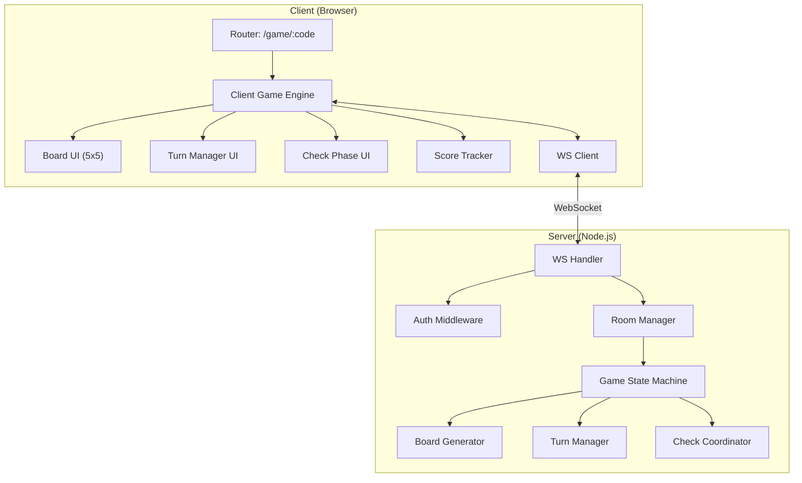
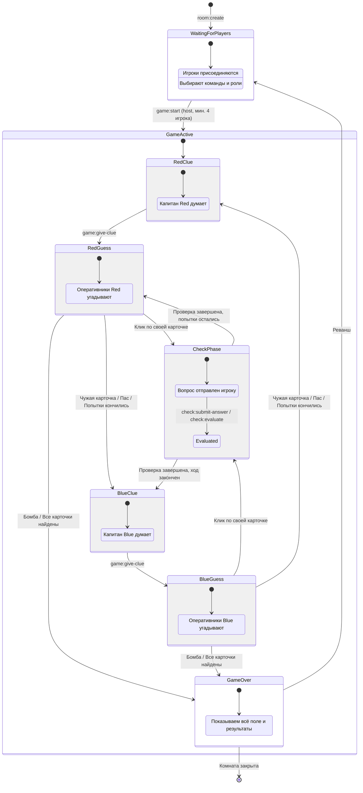
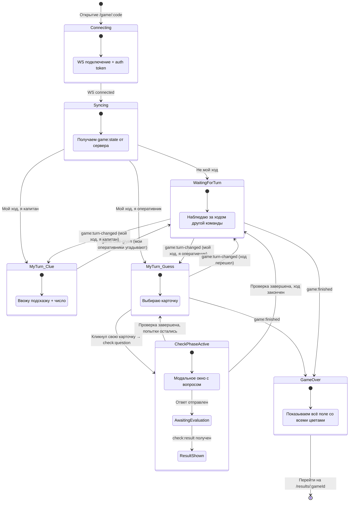
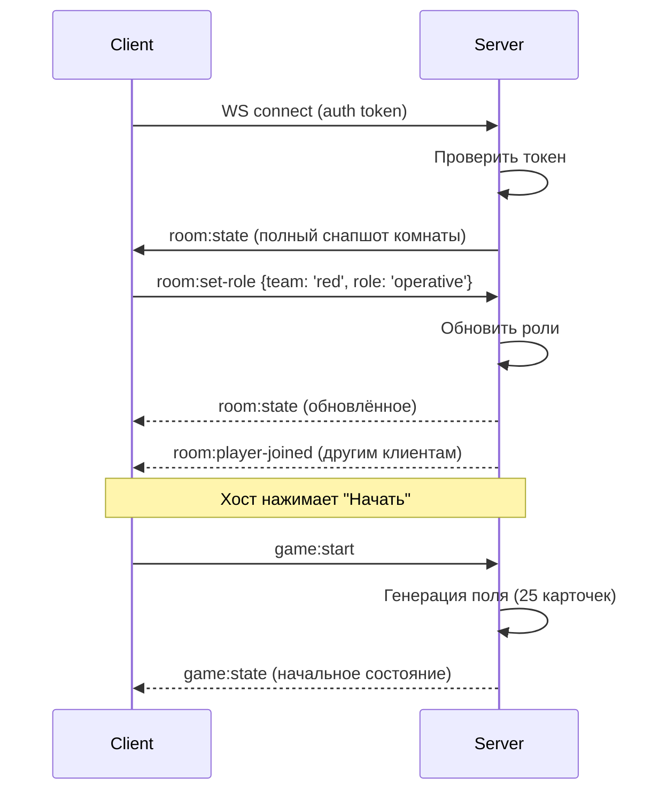
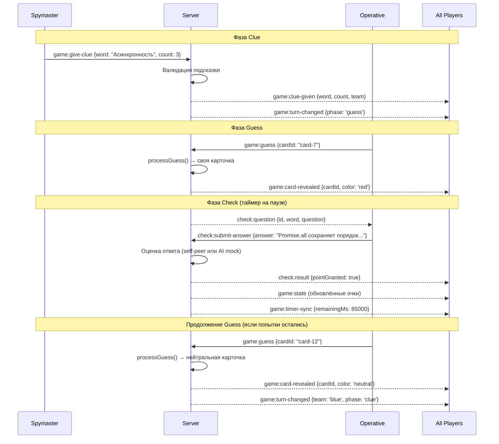
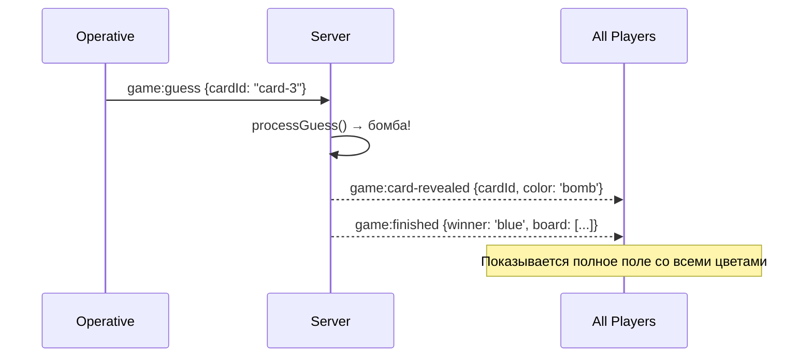
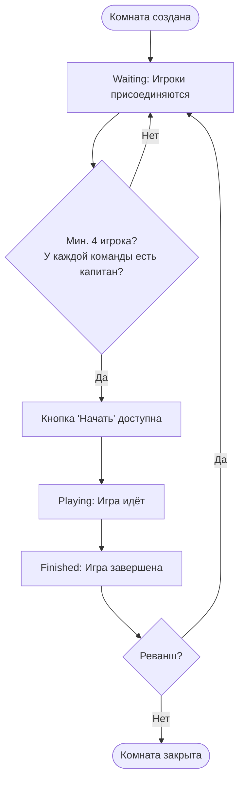

# Game Engine: Архитектура и State Machine

Этот документ описывает архитектуру игрового движка Codenames — серверную state machine, WebSocket протокол, управление комнатами и генерацию поля.

## Концепция

Game Engine — это серверный компонент, который:
1. Управляет жизненным циклом комнат (создание → игра → завершение)
2. Поддерживает авторитетное состояние игры (единственный источник правды)
3. Обрабатывает действия игроков через WebSocket
4. Фильтрует состояние для каждого игрока (капитан видит цвета, оперативники — нет)
5. Координирует фазы хода: подсказка → угадывание → проверка знаний

Клиентская часть — это зеркало серверного состояния с UI логикой.

## Архитектура



## Серверная State Machine (авторитетная)

Сервер — единственный источник правды. Все переходы состояний происходят только на сервере. Клиенты получают уведомления.



### Правила перехода ходов

```typescript
function processGuess(game: Game, cardId: string, playerId: string): GuessResult {
  const card = game.board.find(c => c.id === cardId);
  if (!card || card.status === 'revealed') {
    return { error: 'INVALID_CARD' };
  }

  // Открываем карточку
  card.status = 'revealed';

  const currentTeam = game.currentTurn;

  if (card.color === 'bomb') {
    // Бомба → мгновенный проигрыш
    game.winner = currentTeam === 'red' ? 'blue' : 'red';
    game.currentPhase = 'finished';
    return { action: 'game-over', reason: 'bomb' };
  }

  if (card.color === currentTeam) {
    // Своя карточка → фаза Check
    game.currentPhase = 'check';
    game.teams[currentTeam].cardsLeft--;

    // Проверяем победу
    if (game.teams[currentTeam].cardsLeft === 0) {
      return { action: 'check-then-win' };
    }

    game.guessesRemaining--;
    return { action: 'check', cardId };
  }

  if (card.color === 'neutral') {
    // Нейтральная → ход переходит
    return { action: 'end-turn', reason: 'neutral' };
  }

  // Карточка соперника → ход переходит, соперник получает очко
  const opponent = currentTeam === 'red' ? 'blue' : 'red';
  game.teams[opponent].cardsLeft--;

  if (game.teams[opponent].cardsLeft === 0) {
    game.winner = opponent;
    game.currentPhase = 'finished';
    return { action: 'game-over', reason: 'opponent-complete' };
  }

  return { action: 'end-turn', reason: 'opponent-card' };
}
```

---

## Клиентская State Machine (зеркало + UI)

Клиент отражает серверное состояние и добавляет UI-специфичные переходы.



---

## WebSocket: Диаграммы взаимодействия

### Подключение к игре



### Ход игры (Clue → Guess → Check)



### Окончание игры



---

## Room Management

### Жизненный цикл комнаты



### Генерация кода комнаты

```typescript
function generateRoomCode(): string {
  const adjectives = ['js', 'ts', 'react', 'node', 'algo', 'css', 'html', 'git'];
  const nouns = ['masters', 'ninjas', 'pros', 'devs', 'coders', 'wizards', 'gurus', 'hackers'];
  const num = Math.floor(Math.random() * 99).toString().padStart(2, '0');
  const adj = adjectives[Math.floor(Math.random() * adjectives.length)];
  const noun = nouns[Math.floor(Math.random() * nouns.length)];
  return `${adj}-${noun}-${num}`;
}

// Пример: "js-masters-42", "ts-wizards-07"
```

### Генерация игрового поля

```typescript
function generateBoard(wordBank: WordEntry[]): Card[] {
  // 1. Перемешиваем и берём 25 слов
  const shuffled = shuffle([...wordBank]);
  const words = shuffled.slice(0, 25);

  // 2. Распределяем цвета: 9 red, 8 blue, 7 neutral, 1 bomb
  // Red идёт первой, поэтому у Red на 1 карточку больше
  const colors: CardColor[] = [
    ...Array(9).fill('red' as CardColor),
    ...Array(8).fill('blue' as CardColor),
    ...Array(7).fill('neutral' as CardColor),
    'bomb' as CardColor,
  ];
  const shuffledColors = shuffle(colors);

  // 3. Создаём карточки
  return words.map((entry, i) => ({
    id: `card-${i}`,
    word: entry.word,
    color: shuffledColors[i],
    status: 'hidden' as CardStatus,
    position: i,
  }));
}

function shuffle<T>(array: T[]): T[] {
  // Fisher-Yates shuffle
  for (let i = array.length - 1; i > 0; i--) {
    const j = Math.floor(Math.random() * (i + 1));
    [array[i], array[j]] = [array[j], array[i]];
  }
  return array;
}
```

---

## Фильтрация состояния: Spymaster vs Operative

> **Критически важно:** Сервер НИКОГДА не отправляет цвета скрытых карточек оперативникам. Нарушение этого правила позволит увидеть ответы через DevTools.

```typescript
function getGameStateForPlayer(game: Game, playerId: string): GameStateForPlayer {
  const isSpymaster =
    game.teams.red.spymasterId === playerId ||
    game.teams.blue.spymasterId === playerId;

  return {
    board: game.board.map(card => ({
      id: card.id,
      word: card.word,
      status: card.status,
      // Капитан видит все цвета. Оперативник — только открытых карточек
      color: (card.status === 'revealed' || isSpymaster) ? card.color : null,
      position: card.position,
    })),
    currentTurn: game.currentTurn,
    currentPhase: game.currentPhase,
    clue: game.clue,
    guessesRemaining: game.guessesRemaining,
    teams: {
      red: { ...game.teams.red },
      blue: { ...game.teams.blue },
    },
    isSpymaster,
    turnEndTime: game.turnEndTime,
  };
}
```

### Пример: что видит капитан vs оперативник

**Капитан (Spymaster):**
```
┌─────────┬─────────┬─────────┬─────────┬─────────┐
│ closure │prototype│ Promise │  this   │hoisting │
│   RED   │  BLUE   │   RED   │ NEUTRAL │   RED   │
├─────────┼─────────┼─────────┼─────────┼─────────┤
│  event  │  scope  │  async  │  class  │  arrow  │
│  loop   │  chain  │  await  │  BOMB   │  func   │
│  BLUE   │   RED   │  BLUE   │  ████   │ NEUTRAL │
└─────────┴─────────┴─────────┴─────────┴─────────┘
```

**Оперативник (Operative):**
```
┌─────────┬─────────┬─────────┬─────────┬─────────┐
│ closure │prototype│ Promise │  this   │hoisting │
│    ?    │    ?    │    ?    │    ?    │    ?    │
├─────────┼─────────┼─────────┼─────────┼─────────┤
│  event  │  scope  │  async  │  class  │  arrow  │
│  loop   │  chain  │  await  │         │  func   │
│    ?    │    ?    │    ?    │    ?    │    ?    │
└─────────┴─────────┴─────────┴─────────┴─────────┘
```

---

## Design Patterns

### Observer Pattern для WebSocket событий

```typescript
type EventHandler<T = unknown> = (payload: T) => void;

class GameEventBus {
  private listeners = new Map<string, Set<EventHandler>>();

  on<T>(event: string, handler: EventHandler<T>): void {
    if (!this.listeners.has(event)) {
      this.listeners.set(event, new Set());
    }
    this.listeners.get(event)!.add(handler as EventHandler);
  }

  off(event: string, handler: EventHandler): void {
    this.listeners.get(event)?.delete(handler);
  }

  emit<T>(event: string, payload: T): void {
    this.listeners.get(event)?.forEach(handler => handler(payload));
  }
}

// Использование
const bus = new GameEventBus();

bus.on<Clue>('game:clue-given', (clue) => {
  updateClueDisplay(clue);
});

bus.on<{ cardId: string; color: CardColor }>('game:card-revealed', ({ cardId, color }) => {
  animateCardReveal(cardId, color);
});
```

### State Pattern для фаз игры

```typescript
interface GamePhaseHandler {
  phase: GamePhase;
  canGiveClue(playerId: string, game: Game): boolean;
  canGuess(playerId: string, game: Game): boolean;
  canEndTurn(playerId: string, game: Game): boolean;
  getUIState(): PhaseUIState;
}

interface PhaseUIState {
  boardClickable: boolean;
  clueInputVisible: boolean;
  endTurnVisible: boolean;
  timerActive: boolean;
  overlayActive: boolean;        // для Check Phase
}

// Реализация для фазы угадывания
class GuessPhaseHandler implements GamePhaseHandler {
  phase: GamePhase = 'guess';

  canGiveClue(): boolean { return false; }

  canGuess(playerId: string, game: Game): boolean {
    const team = getPlayerTeam(playerId, game);
    return team === game.currentTurn
      && !isSpymaster(playerId, game)
      && game.guessesRemaining > 0;
  }

  canEndTurn(playerId: string, game: Game): boolean {
    const team = getPlayerTeam(playerId, game);
    return team === game.currentTurn && !isSpymaster(playerId, game);
  }

  getUIState(): PhaseUIState {
    return {
      boardClickable: true,
      clueInputVisible: false,
      endTurnVisible: true,
      timerActive: true,
      overlayActive: false,
    };
  }
}
```

---

## Таймер: серверный авторитет

### Проблема

Клиентский таймер и серверный таймер расходятся из-за задержек сети.

### Решение

Сервер отправляет `turnEndTime` (абсолютный timestamp), клиент вычисляет оставшееся время.

```typescript
// Сервер: при начале хода
function startTurn(game: Game): void {
  game.turnEndTime = Date.now() + game.settings.turnTimeSeconds * 1000;
  broadcast('game:timer-sync', { remainingMs: game.settings.turnTimeSeconds * 1000 });
}

// Сервер: при Check Phase — паузим таймер
function pauseTimer(game: Game): void {
  game.pausedRemainingMs = game.turnEndTime - Date.now();
  broadcast('game:timer-sync', { remainingMs: game.pausedRemainingMs, paused: true });
}

// Сервер: после Check Phase — возобновляем
function resumeTimer(game: Game): void {
  game.turnEndTime = Date.now() + game.pausedRemainingMs;
  broadcast('game:timer-sync', { remainingMs: game.pausedRemainingMs, paused: false });
}

// Клиент: отображение таймера
function updateTimerDisplay(turnEndTime: number, paused: boolean): void {
  if (paused) return;

  const remaining = Math.max(0, turnEndTime - Date.now());
  const seconds = Math.ceil(remaining / 1000);
  const minutes = Math.floor(seconds / 60);
  const secs = seconds % 60;
  timerElement.textContent = `${minutes}:${secs.toString().padStart(2, '0')}`;

  if (remaining <= 0) {
    timerElement.textContent = 'Ожидание...';  // Сервер решит
  }
}
```

---

## UI: Игровое поле

### Layout

```
┌─────────────────────────────────────────────────────────────┐
│  CODENAMES: Interview Edition          Room: js-masters-42   │
│                                                              │
│  Red: 5 left    Blue: 4 left    Timer: 1:45                 │
├──────────────────────────────────────────────────────────────┤
│                                                              │
│  ┌──────────┬──────────┬──────────┬──────────┬──────────┐   │
│  │ closure  │prototype │ Promise  │   this   │ hoisting │   │
│  │          │          │          │          │          │   │
│  ├──────────┼──────────┼──────────┼──────────┼──────────┤   │
│  │  event   │  scope   │  async   │  class   │  arrow   │   │
│  │  loop    │  chain   │  await   │          │  func    │   │
│  ├──────────┼──────────┼──────────┼──────────┼──────────┤   │
│  │  spread  │   rest   │destructur│ template │  Symbol  │   │
│  │          │          │ing       │          │          │   │
│  ├──────────┼──────────┼──────────┼──────────┼──────────┤   │
│  │ WeakMap  │  Proxy   │ Reflect  │ iterator │generator │   │
│  │          │          │          │          │          │   │
│  ├──────────┼──────────┼──────────┼──────────┼──────────┤   │
│  │  BigInt  │ private  │  static  │  super   │ extends  │   │
│  │          │          │          │          │          │   │
│  └──────────┴──────────┴──────────┴──────────┴──────────┘   │
│                                                              │
│  ──────────────────────────────────────────────────────────  │
│  Капитан говорит: "Асинхронность, 3"                        │
│                                                              │
│  Кликни на слово, чтобы угадать!           [Закончить ход]  │
│                                                              │
└──────────────────────────────────────────────────────────────┘
```

### CSS для карточек

```css
.card {
  display: flex;
  align-items: center;
  justify-content: center;
  padding: 12px 8px;
  border: 2px solid #ddd;
  border-radius: 8px;
  cursor: pointer;
  font-size: 14px;
  font-weight: 500;
  text-align: center;
  transition: all 0.3s ease;
  user-select: none;
  min-height: 60px;
}

.card:hover:not(.revealed) {
  transform: translateY(-2px);
  box-shadow: 0 4px 8px rgba(0, 0, 0, 0.15);
}

.card.revealed.red    { background: #ef5350; color: white; }
.card.revealed.blue   { background: #42a5f5; color: white; }
.card.revealed.neutral { background: #bdbdbd; color: #333; }
.card.revealed.bomb   { background: #212121; color: white; }

/* Вид капитана: подсветка цветов на скрытых карточках */
.spymaster-view .card.hidden.red    { border-color: #ef5350; background: #ffebee; }
.spymaster-view .card.hidden.blue   { border-color: #42a5f5; background: #e3f2fd; }
.spymaster-view .card.hidden.neutral { border-color: #bdbdbd; background: #fafafa; }
.spymaster-view .card.hidden.bomb   { border-color: #212121; background: #424242; color: white; }

/* Анимация открытия карточки */
@keyframes cardFlip {
  0%   { transform: rotateY(0deg); }
  50%  { transform: rotateY(90deg); }
  100% { transform: rotateY(0deg); }
}

.card.revealing {
  animation: cardFlip 0.6s ease-in-out;
}
```

---

## Эстимейт: Game Engine

| Задача | Min | Max | Avg | Кто | Примечание |
|--------|-----|-----|-----|-----|------------|
| WS Server scaffold (Express + Socket.IO) | 3ч | 6ч | 4.5ч | WS-Dev | Setup, middleware |
| Room management (create/join/leave/roles) | 4ч | 8ч | 6ч | WS-Dev | Валидация, edge cases |
| Game state machine (сервер) | 8ч | 16ч | 12ч | WS-Dev | Ядро всей игры |
| Board generation + color assignment | 2ч | 4ч | 3ч | WS-Dev | Fisher-Yates, 9/8/7/1 |
| Turn management + timer sync | 4ч | 8ч | 6ч | WS-Dev | Пауза на Check, resume |
| Spymaster/Operative view filtering | 2ч | 4ч | 3ч | WS-Dev | Безопасность |
| Auth middleware (token verification) | 2ч | 4ч | 3ч | Lead + WS-Dev | Firebase Admin SDK |
| Client WS integration + EventBus | 3ч | 6ч | 4.5ч | Board | Подписки на события |
| Game Board UI (5x5 grid, card component) | 5ч | 10ч | 7.5ч | Board | HTML/CSS |
| Card animations (flip, reveal) | 3ч | 6ч | 4.5ч | Board | CSS transitions |
| Turn indicator, clue display, score | 2ч | 4ч | 3ч | Board | UI компоненты |
| Integration testing (WS + client) | 4ч | 8ч | 6ч | Board + WS-Dev | Mock server + real |
| **Итого** | **42ч** | **84ч** | **63ч** | | |

> **Примечание:** Game State Machine — самая сложная часть. Там много edge cases: одновременные клики, дисконнект во время хода, Check Phase посреди угадывания. Закладывайте время на отладку.

---

## Типичные ошибки

### 1. Отправка цветов оперативникам

```typescript
// Плохо: отправляем всё состояние всем
io.to(roomCode).emit('game:state', game);

// Хорошо: фильтруем для каждого
for (const socket of room.sockets) {
  const state = getGameStateForPlayer(game, socket.data.userId);
  socket.emit('game:state', state);
}
```

### 2. Доверие клиенту

```typescript
// Плохо: клиент решает, правильный ли ход
socket.on('game:guess-result', (result) => {
  game.applyResult(result); // Клиент может подменить!
});

// Хорошо: сервер проверяет всё
socket.on('game:guess', ({ cardId }) => {
  const result = processGuess(game, cardId, socket.data.userId);
  if (result.error) {
    socket.emit('error', { message: result.error });
    return;
  }
  broadcast(roomCode, 'game:card-revealed', { cardId, color: card.color });
});
```

### 3. Race condition при одновременных кликах

```typescript
// Плохо: два оперативника кликают одновременно
// Оба клика обрабатываются, состояние ломается

// Хорошо: блокировка на время обработки
class GameRoom {
  private processing = false;

  async handleGuess(playerId: string, cardId: string) {
    if (this.processing) {
      return { error: 'ACTION_IN_PROGRESS' };
    }
    this.processing = true;
    try {
      return processGuess(this.game, cardId, playerId);
    } finally {
      this.processing = false;
    }
  }
}
```

### 4. Потеря состояния при дисконнекте

```typescript
// Плохо: комната удаляется при дисконнекте
socket.on('disconnect', () => {
  roomManager.removeRoom(socket.roomCode); // Все теряют прогресс!
});

// Хорошо: грейсфул обработка
socket.on('disconnect', () => {
  const room = roomManager.getRoom(socket.roomCode);
  room.markPlayerDisconnected(socket.data.userId);

  // Даём 60 секунд на переподключение
  setTimeout(() => {
    if (room.isPlayerStillDisconnected(socket.data.userId)) {
      room.removePlayer(socket.data.userId);
      broadcast(socket.roomCode, 'room:player-left', { playerId: socket.data.userId });
    }
  }, 60_000);
});
```
