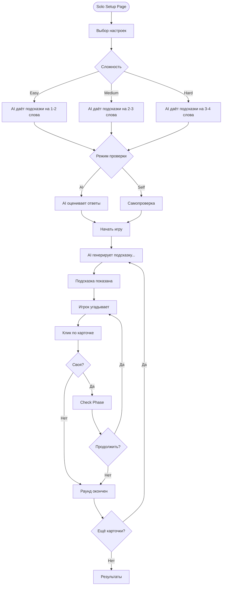
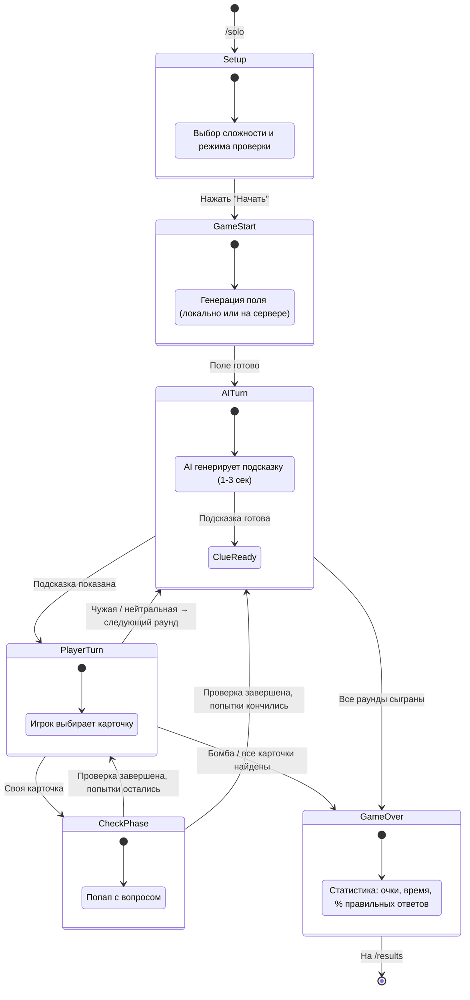

# AI Spymaster & Mock Implementation Guide

Этот документ описывает AI интерфейсы и стратегию мокирования для Codenames. **Все AI компоненты мокнуты** с чистыми интерфейсами, чтобы реальная AI интеграция могла быть подключена позже без изменения остального кода.

## Концепция

Два AI компонента в игре:

1. **AI Spymaster** — генерирует подсказки в Solo Mode (играет роль капитана)
2. **AI Check Evaluator** — оценивает ответы в фазе проверки знаний

Оба компонента реализованы через интерфейсы. Мок-реализации используют простые алгоритмы (категории слов, keyword matching) и реалистичные задержки. Позже интерфейсы реализуются через LLM API.

## Архитектура: Interface-First Design

```
┌─────────────────────────────────────────────────────────────┐
│                    Solo Game Mode                            │
│              (использует AI Spymaster)                       │
├─────────────────────────────────────────────────────────────┤
│                    Check Phase                               │
│              (использует AI Evaluator)                       │
└───────────────┬──────────────────────┬──────────────────────┘
                │                      │
                ▼                      ▼
┌──────────────────────────┐  ┌──────────────────────────┐
│  AISpymasterService      │  │  AICheckEvaluatorService  │
│  (interface)             │  │  (interface)              │
└──────────┬───────────────┘  └──────────┬───────────────┘
     ┌─────┴─────┐                 ┌─────┴─────┐
     ▼           ▼                 ▼           ▼
┌──────────┐ ┌──────────┐   ┌──────────┐ ┌──────────┐
│   Mock   │ │   Real   │   │   Mock   │ │   Real   │
│Spymaster │ │Spymaster │   │Evaluator │ │Evaluator │
│          │ │ (future) │   │          │ │ (future) │
│ Category │ │          │   │ Keyword  │ │          │
│ matching │ │ LLM API  │   │ matching │ │ LLM API  │
│          │ │ + prompt │   │          │ │ + prompt │
│ 1-3 сек  │ │          │   │ 0.8-2 с  │ │          │
│ задержка │ │          │   │ задержка │ │          │
└──────────┘ └──────────┘   └──────────┘ └──────────┘
```

## AI Interfaces

### AISpymasterService

```typescript
interface AISpymasterService {
  /**
   * Генерирует подсказку для Solo Mode.
   * Мок: категориальный подбор.
   * Real: LLM генерация.
   */
  generateClue(context: SpymasterContext): Promise<AIClue>;
}

interface SpymasterContext {
  myWords: string[]; // Мои слова (неоткрытые)
  opponentWords: string[]; // Слова соперника
  neutralWords: string[]; // Нейтральные
  bombWord: string; // Бомба
  revealedWords: string[]; // Уже открытые
  moveHistory: Move[]; // История ходов
  difficulty: "easy" | "medium" | "hard";
}

interface AIClue {
  word: string; // Слово-подсказка
  count: number; // Количество связанных слов
  reasoning?: string; // Объяснение (для debug/display)
  confidence: number; // 0-1
}
```

### AICheckEvaluatorService

```typescript
interface AICheckEvaluatorService {
  /**
   * Оценивает ответ игрока в фазе Check.
   * Мок: keyword matching.
   * Real: LLM оценка.
   */
  evaluateAnswer(context: CheckEvaluationContext): Promise<AICheckResult>;
}

interface CheckEvaluationContext {
  concept: string; // "localStorage"
  question: string; // "В чём отличие от sessionStorage?"
  playerAnswer: string; // Ответ игрока
  referenceAnswer: string; // Эталонный ответ
}

interface AICheckResult {
  pointGranted: boolean;
  feedback: string; // "Ответ верный" / "Не хватает ключевых моментов"
  confidence: number; // 0-1
}
```

---

## Pre-generation: Оффлайн контент

Перед тем как реализовывать любой AI-мок (даже самый простой), стоит подготовить **статические данные** для игры. Это отдельный этап, который делается один раз и обеспечивает стабильную работу приложения.

### Идея

1. Берём список из **100 JS/TS концептов** (closure, hoisting, Promise, generics, event loop и т.д.)
2. Используем **ChatGPT / Claude** (вручную или через API) для генерации JSON с вопросами, вариантами ответов и эталонными объяснениями
3. Кладём результат в файл `questions.json` прямо в репозиторий
4. В игре используем этот **статический контент** вместо вызовов AI в рантайме

### Формат questions.json

```json
{
  "concepts": [
    {
      "word": "closure",
      "category": "область видимости",
      "questions": [
        {
          "question": "Что такое замыкание в JavaScript?",
          "referenceAnswer": "Замыкание — это функция, которая запоминает и имеет доступ к переменным из внешней (лексической) области видимости, даже после того как внешняя функция завершила выполнение.",
          "keywords": [
            "функция",
            "внешняя область",
            "лексическое окружение",
            "доступ",
            "переменные"
          ]
        },
        {
          "question": "Приведите практический пример использования замыкания.",
          "referenceAnswer": "Счётчик: function makeCounter() { let count = 0; return () => ++count; }. Каждый вызов makeCounter() создаёт независимый счётчик благодаря замыканию.",
          "keywords": [
            "счётчик",
            "приватная переменная",
            "фабрика",
            "состояние"
          ]
        }
      ]
    },
    {
      "word": "Promise",
      "category": "асинхронность",
      "questions": [
        {
          "question": "Чем Promise отличается от callback?",
          "referenceAnswer": "Promise — это объект, представляющий результат асинхронной операции. В отличие от callback, Promise позволяет цепочку через .then(), единообразную обработку ошибок через .catch() и избавляет от callback hell.",
          "keywords": [
            "объект",
            "асинхронная операция",
            "then",
            "catch",
            "цепочка",
            "callback hell"
          ]
        }
      ]
    }
  ]
}
```

### Как генерировать

Открываем ChatGPT или Claude и пишем:

```
Сгенерируй JSON для 100 JavaScript/TypeScript концептов.
Для каждого концепта дай:
- word: название концепта
- category: одна из категорий (асинхронность, типизация, область видимости, наследование, хранение данных, массивы, коллекции, модули, обработка ошибок, DOM, метапрограммирование, сеть)
- 2-3 вопроса с referenceAnswer и keywords

Формат: JSON, язык вопросов: русский.
```

Генерацию можно разбить на несколько запросов (по 10-20 концептов за раз) и склеить результат.

### Преимущества

- **100% стабильность** — данные лежат в репозитории, ничего не ломается в рантайме
- **Нет "AI упал"** — нет зависимости от внешних API
- **Нет "API key протух"** — не нужны ключи для работы
- **Нет "AI вернул мусор"** — все вопросы проверены заранее
- **Работает офлайн** — можно демонстрировать без интернета
- **Быстрые ответы** — нет задержки на API вызовы (задержка только искусственная для UX)

### Когда добавлять реальный AI

Реальную AI интеграцию (вызовы LLM API в рантайме) стоит добавлять **только если осталось время на неделе 6** — как "вишенку на торте". До этого момента статический `questions.json` + моки полностью покрывают все потребности игры.

---

## Mock Implementation: AI Spymaster

Реализация AI Spymaster строится **поуровнево** — от максимально простого к более сложному. Не пытайтесь написать универсальный алгоритм на неделе 3. Начните с hardcoded данных и усложняйте по мере необходимости.

### Уровень 0: Hardcoded MVP (для демо)

Самый простой вариант мока — **таблица предопределённых подсказок**. Для первого демо на неделе 3 этого достаточно. Не нужен никакой алгоритм — просто lookup по ключам.

```typescript
const HARDCODED_CLUES: Record<string, { clue: string; words: string[] }> = {
  "closure,hoisting,scope": {
    clue: "область видимости",
    words: ["closure", "hoisting", "scope"],
  },
  "Promise,async/await,event loop": {
    clue: "асинхронность",
    words: ["Promise", "async/await", "event loop"],
  },
  "generics,interface,type": {
    clue: "типизация",
    words: ["generics", "interface", "type"],
  },
  "prototype,class,extends": {
    clue: "наследование",
    words: ["prototype", "class", "extends"],
  },
  "localStorage,sessionStorage,cookie": {
    clue: "хранение данных",
    words: ["localStorage", "sessionStorage", "cookie"],
  },
  "map,filter,reduce": { clue: "массивы", words: ["map", "filter", "reduce"] },
  "Map,Set,WeakMap": { clue: "коллекции", words: ["Map", "Set", "WeakMap"] },
  "import,export,default": {
    clue: "модули",
    words: ["import", "export", "default"],
  },
  "try/catch,Error,throw": {
    clue: "обработка ошибок",
    words: ["try/catch", "Error", "throw"],
  },
  "querySelector,addEventListener,event delegation": {
    clue: "DOM",
    words: ["querySelector", "addEventListener", "event delegation"],
  },
  "Proxy,Reflect,Symbol": {
    clue: "метапрограммирование",
    words: ["Proxy", "Reflect", "Symbol"],
  },
  "fetch,WebSocket,CORS": {
    clue: "сеть",
    words: ["fetch", "WebSocket", "CORS"],
  },
  "var,let,const": {
    clue: "объявление переменных",
    words: ["var", "let", "const"],
  },
  "setTimeout,setInterval,requestAnimationFrame": {
    clue: "таймеры",
    words: ["setTimeout", "setInterval", "requestAnimationFrame"],
  },
  "spread,rest,destructuring": {
    clue: "синтаксис ES6",
    words: ["spread", "rest", "destructuring"],
  },
  // ... 10-15 предопределённых комбинаций
};

class HardcodedSpymasterService implements AISpymasterService {
  async generateClue(context: SpymasterContext): Promise<AIClue> {
    // Симулируем "думание"
    await this.delay(1000 + Math.random() * 2000);

    const unrevealed = context.myWords.filter(
      (w) => !context.revealedWords.includes(w),
    );

    // Ищем совпадение в таблице
    for (const [key, value] of Object.entries(HARDCODED_CLUES)) {
      const keyWords = key.split(",");
      const matchingWords = unrevealed.filter((w) => keyWords.includes(w));

      if (matchingWords.length >= 2) {
        return {
          word: value.clue,
          count: matchingWords.length,
          reasoning: `Hardcoded: нашёл ${matchingWords.length} слов в группе "${value.clue}"`,
          confidence: 0.9,
        };
      }
    }

    // Fallback: одно слово
    return {
      word: "JavaScript",
      count: 1,
      reasoning: "Fallback: нет совпадений в таблице",
      confidence: 0.3,
    };
  }

  private delay(ms: number): Promise<void> {
    return new Promise((resolve) => setTimeout(resolve, ms));
  }
}
```

**Почему этого хватает для демо:** на неделе 3 важно показать работающий game loop, UI, WebSocket подключение. AI подсказка — это одна строка текста на экране. Hardcoded lookup прекрасно справляется. Не тратьте время на "умный" алгоритм, пока базовый флоу не работает.

### Уровень 1: Category Matching (для финальной версии, недели 4-5)

Более реалистичный мок, который использует предопределённую карту категорий слов. Для каждой категории подбирается подсказка, связывающая максимум слов из своей команды, избегая слов соперника и бомбы.

```typescript
// Предопределённая карта категорий
const WORD_CATEGORIES: Record<string, string[]> = {
  асинхронность: [
    "Promise",
    "async/await",
    "event loop",
    "setTimeout",
    "callback",
    "microtask",
  ],
  типизация: ["generics", "interface", "type", "enum", "any", "unknown"],
  "область видимости": [
    "closure",
    "scope",
    "hoisting",
    "var",
    "let",
    "const",
    "IIFE",
  ],
  наследование: ["prototype", "class", "extends", "super", "this", "new"],
  "хранение данных": [
    "localStorage",
    "sessionStorage",
    "cookie",
    "IndexedDB",
    "Cache API",
  ],
  массивы: [
    "map",
    "filter",
    "reduce",
    "forEach",
    "spread",
    "rest",
    "destructuring",
  ],
  коллекции: ["Map", "Set", "WeakMap", "WeakSet", "iterator", "generator"],
  модули: ["import", "export", "default", "namespace", "barrel"],
  "обработка ошибок": [
    "try/catch",
    "Error",
    "throw",
    "finally",
    "Promise.catch",
  ],
  DOM: [
    "querySelector",
    "addEventListener",
    "event delegation",
    "shadow DOM",
    "template",
  ],
  метапрограммирование: ["Proxy", "Reflect", "Symbol", "decorator", "WeakRef"],
  сеть: ["fetch", "XMLHttpRequest", "WebSocket", "CORS", "HTTP"],
};

class MockSpymasterService implements AISpymasterService {
  async generateClue(context: SpymasterContext): Promise<AIClue> {
    // Симулируем "думание" (1-3 секунды)
    await this.delay(1000 + Math.random() * 2000);

    const unrevealed = context.myWords.filter(
      (w) => !context.revealedWords.includes(w),
    );

    // Находим лучшую категорию
    const bestMatch = this.findBestCategoryMatch(
      unrevealed,
      context.opponentWords,
      context.bombWord,
      context.difficulty,
    );

    return bestMatch;
  }

  private findBestCategoryMatch(
    myWords: string[],
    opponentWords: string[],
    bombWord: string,
    difficulty: "easy" | "medium" | "hard",
  ): AIClue {
    let bestCategory = "";
    let bestCount = 0;
    let bestConfidence = 0;

    for (const [category, words] of Object.entries(WORD_CATEGORIES)) {
      // Сколько моих слов попадает в категорию
      const myMatches = myWords.filter((w) =>
        words.some((cw) => cw.toLowerCase() === w.toLowerCase()),
      );

      // Сколько слов соперника попадает (опасность)
      const opponentMatches = opponentWords.filter((w) =>
        words.some((cw) => cw.toLowerCase() === w.toLowerCase()),
      );

      // Бомба в категории?
      const bombMatch = words.some(
        (cw) => cw.toLowerCase() === bombWord.toLowerCase(),
      );

      if (bombMatch) continue; // Никогда не подсказываем категорию с бомбой

      // Оценка: свои минус чужие
      const score = myMatches.length - opponentMatches.length * 2;

      if (
        score > bestCount ||
        (score === bestCount && myMatches.length > bestCount)
      ) {
        bestCategory = category;
        bestCount = myMatches.length;
        bestConfidence = score / myWords.length;
      }
    }

    // Ограничиваем count по сложности
    const maxCount =
      difficulty === "easy" ? 2 : difficulty === "medium" ? 3 : 4;
    const clueCount = Math.min(bestCount, maxCount);

    // Fallback: если нет совпадений, берём случайное слово
    if (bestCount === 0) {
      return {
        word: this.getRandomFallbackClue(myWords),
        count: 1,
        reasoning: "Fallback: прямая ассоциация со словом",
        confidence: 0.3,
      };
    }

    return {
      word: bestCategory,
      count: clueCount,
      reasoning: `Связал ${clueCount} слов через категорию "${bestCategory}"`,
      confidence: Math.min(0.9, 0.5 + bestConfidence),
    };
  }

  private getRandomFallbackClue(words: string[]): string {
    // Простые ассоциации для fallback
    const associations: Record<string, string> = {
      closure: "замок",
      Promise: "обещание",
      prototype: "прародитель",
      "async/await": "ожидание",
      this: "контекст",
      hoisting: "подъём",
      scope: "область",
      class: "чертёж",
      Map: "карта",
      Set: "набор",
    };

    const word = words[Math.floor(Math.random() * words.length)];
    return associations[word] || "JavaScript";
  }

  private delay(ms: number): Promise<void> {
    return new Promise((resolve) => setTimeout(resolve, ms));
  }
}
```

### Уровень 2: Real LLM (будущее, опционально)

Реальная интеграция с LLM API (OpenAI, Anthropic и т.д.). Реализуется **только если осталось время** после полировки основного функционала. Промпты для этого уровня описаны в секции "Будущая AI интеграция" ниже.

### Рекомендуемый план по неделям

| Неделя     | Уровень                           | Что делаем                                 |
| ---------- | --------------------------------- | ------------------------------------------ |
| Неделя 3   | Уровень 0: Hardcoded MVP          | Lookup-таблица, первое демо game loop      |
| Недели 4-5 | Уровень 1: Category Matching      | Алгоритм категорий, реалистичные подсказки |
| Неделя 6   | Уровень 2: Real LLM (опционально) | Только если всё остальное готово           |

### Пример работы мока (Уровень 1)

**Входные данные:**

```typescript
context = {
  myWords: ["closure", "hoisting", "scope", "Promise", "Map"],
  opponentWords: ["prototype", "class", "extends"],
  neutralWords: ["spread", "rest", "BigInt"],
  bombWord: "eval",
  revealedWords: [],
  moveHistory: [],
  difficulty: "medium",
};
```

**Результат:**

```typescript
{
  word: 'область видимости',    // Категория, покрывающая closure, hoisting, scope
  count: 3,
  reasoning: 'Связал 3 слов через категорию "область видимости"',
  confidence: 0.7,
}
```

---

## Mock Implementation: AI Check Evaluator

### Стратегия: Keyword Matching

Мок извлекает ключевые слова из эталонного ответа и проверяет, содержит ли ответ игрока достаточное количество этих слов.

```typescript
class MockCheckEvaluatorService implements AICheckEvaluatorService {
  async evaluateAnswer(
    context: CheckEvaluationContext,
  ): Promise<AICheckResult> {
    // Симулируем "думание AI" (0.8-2 секунды)
    await this.delay(800 + Math.random() * 1200);

    const keywords = this.extractKeywords(context.referenceAnswer);
    const playerWords = context.playerAnswer.toLowerCase();

    // Считаем совпадения
    const matches = keywords.filter((kw) =>
      playerWords.includes(kw.toLowerCase()),
    );
    const matchRatio =
      keywords.length > 0 ? matches.length / keywords.length : 0;

    // Порог: 30% ключевых слов = засчитано (мок мягкий)
    const pointGranted = matchRatio >= 0.3;

    // Генерируем feedback
    const feedback = this.generateFeedback(
      pointGranted,
      matches,
      keywords,
      context.concept,
    );

    return {
      pointGranted,
      feedback,
      confidence: matchRatio,
    };
  }

  private extractKeywords(text: string): string[] {
    // Убираем стоп-слова, извлекаем значимые слова
    const stopWords = new Set([
      "это",
      "и",
      "в",
      "на",
      "что",
      "как",
      "не",
      "для",
      "с",
      "по",
      "а",
      "но",
      "из",
      "к",
      "от",
      "до",
      "при",
      "или",
      "же",
      "то",
      "the",
      "is",
      "a",
      "an",
      "in",
      "on",
      "for",
      "to",
      "of",
      "and",
    ]);

    return text
      .toLowerCase()
      .replace(/[^\wа-яё\s]/gi, "")
      .split(/\s+/)
      .filter((word) => word.length > 3 && !stopWords.has(word))
      .slice(0, 10); // Максимум 10 ключевых слов
  }

  private generateFeedback(
    granted: boolean,
    matches: string[],
    allKeywords: string[],
    concept: string,
  ): string {
    if (granted && matches.length >= allKeywords.length * 0.7) {
      return `Отличный ответ! Вы хорошо понимаете ${concept}.`;
    }
    if (granted) {
      return `Ответ засчитан. Можно было также упомянуть: ${allKeywords
        .filter((k) => !matches.includes(k))
        .slice(0, 2)
        .join(", ")}.`;
    }
    return `Ответ не засчитан. Ключевые моменты, которых не хватило: ${allKeywords
      .filter((k) => !matches.includes(k))
      .slice(0, 3)
      .join(", ")}.`;
  }

  private delay(ms: number): Promise<void> {
    return new Promise((resolve) => setTimeout(resolve, ms));
  }
}
```

### Пример работы мока

**Входные данные:**

```typescript
context = {
  concept: "localStorage",
  question: "В чём отличие от sessionStorage?",
  playerAnswer:
    "localStorage сохраняет данные навсегда, а sessionStorage только на время сессии вкладки",
  referenceAnswer:
    "localStorage сохраняет данные без срока давности, данные сохраняются при закрытии браузера. sessionStorage хранит данные только в рамках текущей сессии: данные удаляются при закрытии вкладки.",
};
```

**Извлечённые ключевые слова:** `['localstorage', 'сохраняет', 'данные', 'давности', 'закрытии', 'браузера', 'sessionstorage', 'сессии', 'удаляются', 'вкладки']`

**Совпадения в ответе:** `['localstorage', 'сохраняет', 'данные', 'sessionstorage', 'сессии', 'вкладки']` — 6 из 10 (60%)

**Результат:**

```typescript
{
  pointGranted: true,  // 60% > 30% порог
  feedback: 'Ответ засчитан. Можно было также упомянуть: давности, закрытии.',
  confidence: 0.6,
}
```

---

## Переключение Mock / Real

```typescript
// ai/index.ts
import { HardcodedSpymasterService } from "./hardcoded-spymaster";
import { MockSpymasterService } from "./mock-spymaster";
import { MockCheckEvaluatorService } from "./mock-check-evaluator";
// import { RealSpymasterService } from './real-spymaster';       // Future
// import { RealCheckEvaluatorService } from './real-check-evaluator'; // Future

const USE_MOCK_AI = import.meta.env.VITE_USE_MOCK_AI !== "false";

export const aiSpymaster: AISpymasterService = USE_MOCK_AI
  ? new MockSpymasterService()
  : new MockSpymasterService(); // TODO: заменить на RealSpymasterService

export const aiCheckEvaluator: AICheckEvaluatorService = USE_MOCK_AI
  ? new MockCheckEvaluatorService()
  : new MockCheckEvaluatorService(); // TODO: заменить на RealCheckEvaluatorService
```

### Тестирование моков

```typescript
// ai/__tests__/mock-spymaster.test.ts
import { describe, it, expect } from "vitest";
import { MockSpymasterService } from "../mock-spymaster";

describe("MockSpymasterService", () => {
  const service = new MockSpymasterService();

  it("should generate a clue with count > 0", async () => {
    const clue = await service.generateClue({
      myWords: ["closure", "hoisting", "scope"],
      opponentWords: ["class", "extends"],
      neutralWords: ["BigInt"],
      bombWord: "eval",
      revealedWords: [],
      moveHistory: [],
      difficulty: "medium",
    });

    expect(clue.word).toBeTruthy();
    expect(clue.count).toBeGreaterThan(0);
    expect(clue.confidence).toBeGreaterThan(0);
  });

  it("should never suggest a clue matching the bomb word category", async () => {
    // ... test that bomb word category is avoided
  });

  it("should respect difficulty level for count", async () => {
    const easyClue = await service.generateClue({
      myWords: ["closure", "hoisting", "scope", "let", "var"],
      opponentWords: [],
      neutralWords: [],
      bombWord: "eval",
      revealedWords: [],
      moveHistory: [],
      difficulty: "easy",
    });

    expect(easyClue.count).toBeLessThanOrEqual(2);
  });
});
```

---

## Solo Mode

### Концепция

Solo Mode позволяет играть одному. AI играет роль капитана (Spymaster) одной из команд. Игрок — оперативник. Соперничество идёт "против себя" или "против таймера".

### User Flow



### Solo Game State Machine



### Solo Mode: особенности реализации

| Аспект                 | Multiplayer                    | Solo                   |
| ---------------------- | ------------------------------ | ---------------------- |
| WebSocket              | Реальное подключение           | Не нужен (или Mock WS) |
| Spymaster              | Живой человек                  | AI Mock                |
| Таймер                 | Синхронизация сервер ↔ клиент | Только клиентский      |
| Check Mode             | Настраивается хостом           | По умолчанию AI        |
| Соперник               | Другая команда                 | Нет (играет один)      |
| Сохранение результатов | На сервере                     | Локально или REST API  |

```typescript
// Solo game loop (упрощённый)
class SoloGameController {
  private game: Game;
  private spymaster: AISpymasterService;
  private evaluator: AICheckEvaluatorService;

  async startRound(): Promise<void> {
    // 1. AI генерирует подсказку
    const context = this.buildSpymasterContext();
    const clue = await this.spymaster.generateClue(context);

    // 2. Показываем подсказку
    this.ui.showClue(clue);
    this.game.clue = { word: clue.word, count: clue.count, ... };
    this.game.guessesRemaining = clue.count + 1;  // +1 по правилам

    // 3. Ждём действий игрока (через UI events)
  }

  async handleGuess(cardId: string): Promise<void> {
    const card = this.game.board.find(c => c.id === cardId);
    card.status = 'revealed';

    this.ui.revealCard(cardId, card.color);

    if (card.color === 'bomb') {
      return this.endGame('lose');
    }

    if (card.color === this.game.currentTurn) {
      // Своя карточка → Check Phase
      await this.runCheckPhase(card.word);
      this.game.guessesRemaining--;

      if (this.isAllFound()) return this.endGame('win');
      if (this.game.guessesRemaining <= 0) return this.startRound();
      // Иначе: продолжаем угадывать
    } else {
      // Чужая или нейтральная → раунд окончен
      this.startRound();
    }
  }
}
```

---

## UI: Solo Setup Page

```
┌─────────────────────────────────────────────────────────────┐
│  CODENAMES: Interview Edition          Solo Mode             │
├─────────────────────────────────────────────────────────────┤
│                                                              │
│  Настройки игры с AI                                        │
│                                                              │
│  Сложность:                                                 │
│  ┌──────────┐  ┌──────────┐  ┌──────────┐                  │
│  │   Easy   │  │  Medium  │  │   Hard   │                  │
│  │ 1-2 слова│  │ 2-3 слова│  │ 3-4 слова│                  │
│  └──────────┘  └──────────┘  └──────────┘                  │
│                    ↑ выбрано                                  │
│                                                              │
│  Режим проверки:                                            │
│  ○ Самопроверка (Показать ответ → Знаю/Не знаю)           │
│  ● AI проверка (AI оценивает ваш ответ)     ← выбрано      │
│                                                              │
│  Таймер на ход:                                             │
│  ○ Без таймера                                               │
│  ● 2 минуты                                 ← выбрано       │
│  ○ 1 минута                                                  │
│                                                              │
│                                                              │
│                     [  Начать игру  ]                        │
│                                                              │
└─────────────────────────────────────────────────────────────┘
```

---

## Будущая AI интеграция (промпты для документации)

> Эти промпты НЕ реализуются сейчас. Они описаны для будущей интеграции с LLM.

### Промпт для AI Spymaster

```
You are a Codenames Spymaster for the {team} team.
Board state:
- Your words (not yet revealed): {myWords}
- Opponent words: {opponentWords}
- Neutral words: {neutralWords}
- Bomb: {bombWord}
- Already revealed: {revealedWords}

Rules:
1. Give exactly ONE word as a clue and a number
2. The clue must relate to {number} of your words
3. NEVER give a clue that relates to the bomb word
4. Avoid clues that relate to opponent words
5. The clue cannot be any word on the board

Respond in format: CLUE, NUMBER
Example: "Асинхронность, 3"
```

### Промпт для AI Check Evaluator

```
You are evaluating a player's understanding of a JavaScript/TypeScript concept.

Concept: {concept}
Question: "{question}"
Player's answer: "{playerAnswer}"
Reference answer: "{referenceAnswer}"

Evaluate whether the player demonstrates understanding of the core concept.
Be lenient - they don't need to use the exact same words, just show understanding.

Respond in JSON format:
{
  "pointGranted": true/false,
  "feedback": "one sentence of feedback"
}
```

---

## Эстимейт: AI + Solo Mode

| Задача                                      | Min     | Max     | Avg       | Кто           | Примечание                         |
| ------------------------------------------- | ------- | ------- | --------- | ------------- | ---------------------------------- |
| Interface definitions (TypeScript)          | 2ч      | 3ч      | 2.5ч      | Eric (AI-Dev) | Оба сервиса                        |
| Pre-generation questions.json               | 2ч      | 4ч      | 3ч        | Eric (AI-Dev) | 100 концептов через ChatGPT/Claude |
| Hardcoded Spymaster (Level 0)               | 1ч      | 2ч      | 1.5ч      | Eric (AI-Dev) | Lookup-таблица для первого демо    |
| Mock Spymaster (category matching, Level 1) | 4ч      | 8ч      | 6ч        | Eric (AI-Dev) | WORD_CATEGORIES + алгоритм         |
| Mock Check Evaluator (keyword matching)     | 3ч      | 6ч      | 4.5ч      | Eric (AI-Dev) | Keyword extraction + scoring       |
| Solo Setup page (UI)                        | 2ч      | 4ч      | 3ч        | Eric (AI-Dev) | Настройки, кнопки                  |
| Solo Game Controller (game loop)            | 5ч      | 10ч     | 7.5ч      | Eric (AI-Dev) | Оркестрация AI + game              |
| Landing page                                | 2ч      | 4ч      | 3ч        | Eric (AI-Dev) | Описание игры, кнопки              |
| 404 page                                    | 1ч      | 2ч      | 1.5ч      | Eric (AI-Dev) | Not Found                          |
| Unit тесты моков                            | 3ч      | 5ч      | 4ч        | Eric (AI-Dev) | Edge cases                         |
| **Итого**                                   | **25ч** | **48ч** | **36.5ч** |               |                                    |

### Распределение ролей в команде

| Имя                | Роль      | Зона ответственности                 |
| ------------------ | --------- | ------------------------------------ |
| Alice (Lead)       | Lead      | Архитектура, code review, интеграция |
| Boris (WS-Dev)     | WS-Dev    | WebSocket сервер, Socket.IO, события |
| Victor (Board-Dev) | Board-Dev | Игровое поле, карточки, анимации     |
| Diana (Check-Dev)  | Check-Dev | Check Phase, вопросы, оценка ответов |
| Eric (AI-Dev)      | AI-Dev    | AI моки, Solo Mode, questions.json   |
| Felix (Lobby-Dev)  | Lobby-Dev | Лобби, роутинг, создание комнат      |

> **Примечание:** Mock Spymaster — самая интересная часть. Хороший мок создаёт иллюзию "умного AI" за счёт предопределённых категорий и случайности. Чем больше категорий в WORD_CATEGORIES, тем реалистичнее. Но начинайте с Уровня 0 (hardcoded) — для первого демо этого более чем достаточно.

---

## Типичные ошибки

### 1. AI отвечает мгновенно

```typescript
// Плохо: мок отвечает за 1 мс — нереалистично
async generateClue(context: SpymasterContext): Promise<AIClue> {
  return { word: 'JavaScript', count: 1 };
}

// Хорошо: симулируем "думание"
async generateClue(context: SpymasterContext): Promise<AIClue> {
  await delay(1000 + Math.random() * 2000);  // 1-3 сек
  return this.calculate(context);
}
```

### 2. Мок подсказывает бомбу

```typescript
// Плохо: не проверяем бомбу
// Мок может выдать "метапрограммирование", а бомба — "Proxy"

// Хорошо: явная проверка
if (bombMatch) continue; // Пропускаем категорию с бомбой
```

### 3. Слишком строгий Check Evaluator

```typescript
// Плохо: точное совпадение
const pointGranted = playerAnswer === referenceAnswer;
// Никто не наберёт очки!

// Хорошо: keyword matching с мягким порогом (30%)
const matchRatio = matches.length / keywords.length;
const pointGranted = matchRatio >= 0.3;
```

### 4. Нет fallback при пустом ответе

```typescript
// Плохо: crash на пустом ответе
const keywords = extractKeywords(playerAnswer); // []
const ratio = matches.length / keywords.length; // NaN!

// Хорошо: обработка пустого
if (!playerAnswer.trim()) {
  return {
    pointGranted: false,
    feedback: "Ответ не предоставлен.",
    confidence: 0,
  };
}
```
