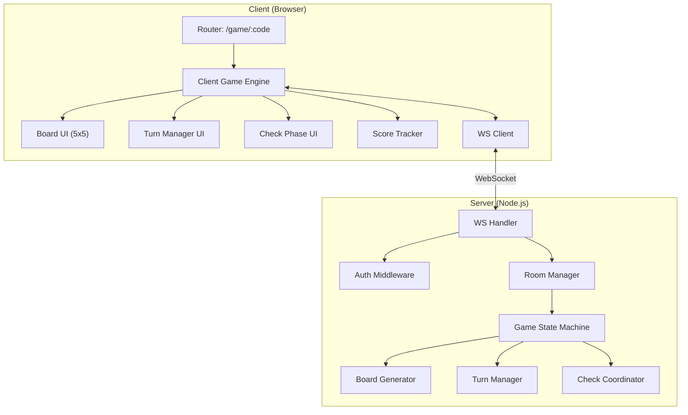
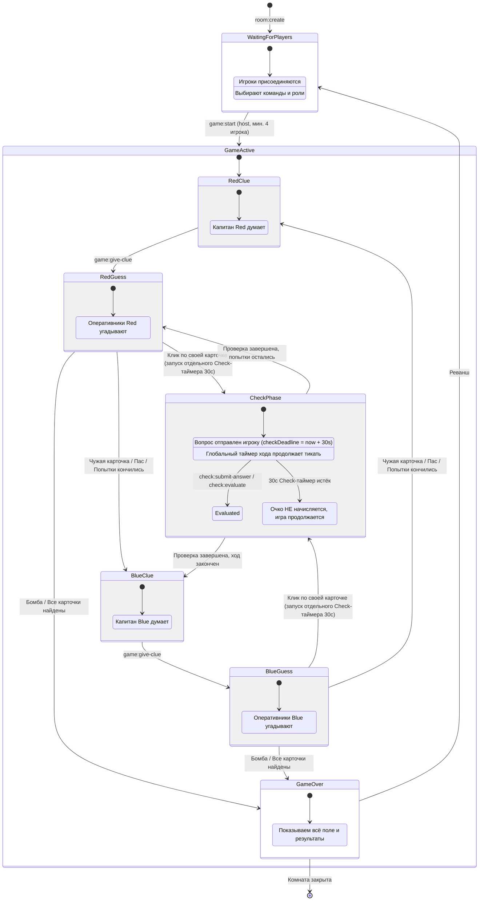
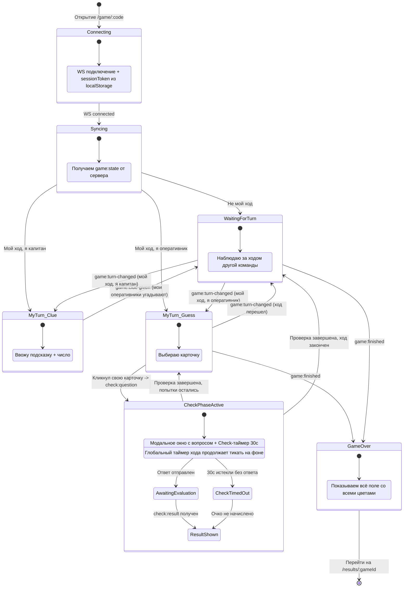
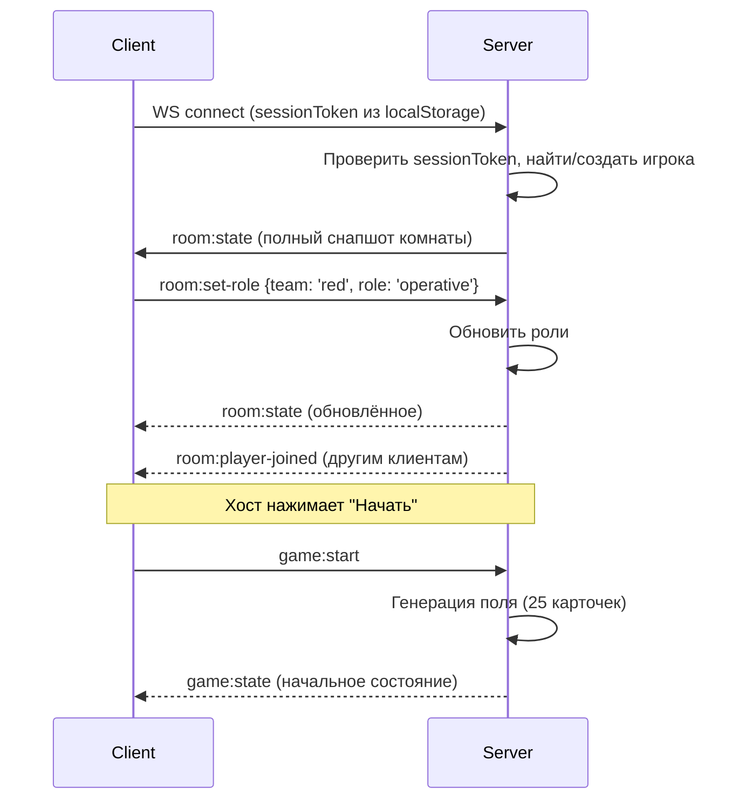
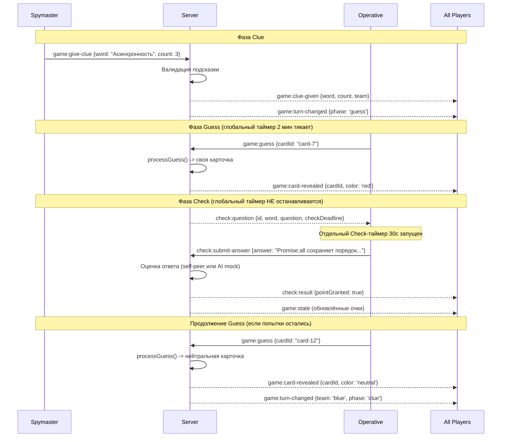
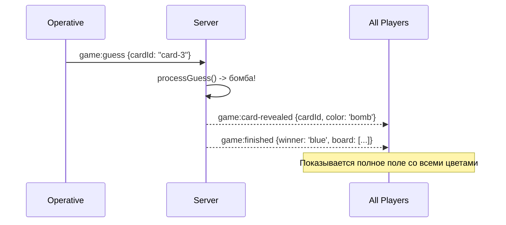
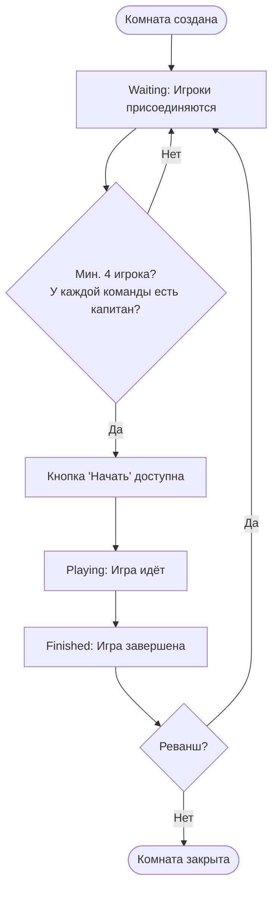

# Game Engine: Архитектура и State Machine

Этот документ описывает архитектуру игрового движка Codenames — серверную state machine, WebSocket протокол, управление комнатами и генерацию поля.

## Концепция

Game Engine — это серверный компонент, который:

1. Управляет жизненным циклом комнат (создание -> игра -> завершение)
2. Поддерживает авторитетное состояние игры (единственный источник правды)
3. Обрабатывает действия игроков через WebSocket
4. Фильтрует состояние для каждого игрока (капитан видит цвета, оперативники — нет)
5. Координирует фазы хода: подсказка -> угадывание -> проверка знаний

Клиентская часть — это зеркало серверного состояния с UI логикой.

## Архитектура



## Серверная State Machine (авторитетная)

Сервер — единственный источник правды. Все переходы состояний происходят только на сервере. Клиенты получают уведомления.



### Правила перехода ходов

```typescript
function processGuess(
  game: Game,
  cardId: string,
  playerId: string,
): GuessResult {
  const card = game.board.find((c) => c.id === cardId);
  if (!card || card.status === "revealed") {
    return { error: "INVALID_CARD" };
  }

  // Открываем карточку
  card.status = "revealed";

  const currentTeam = game.currentTurn;

  if (card.color === "bomb") {
    // Бомба -> мгновенный проигрыш
    game.winner = currentTeam === "red" ? "blue" : "red";
    game.currentPhase = "finished";
    return { action: "game-over", reason: "bomb" };
  }

  if (card.color === currentTeam) {
    // Своя карточка -> фаза Check (глобальный таймер НЕ останавливается)
    game.currentPhase = "check";
    game.teams[currentTeam].cardsLeft--;

    // Проверяем победу
    if (game.teams[currentTeam].cardsLeft === 0) {
      return { action: "check-then-win" };
    }

    game.guessesRemaining--;
    return { action: "check", cardId };
  }

  if (card.color === "neutral") {
    // Нейтральная -> ход переходит
    return { action: "end-turn", reason: "neutral" };
  }

  // Карточка соперника -> ход переходит, соперник получает очко
  const opponent = currentTeam === "red" ? "blue" : "red";
  game.teams[opponent].cardsLeft--;

  if (game.teams[opponent].cardsLeft === 0) {
    game.winner = opponent;
    game.currentPhase = "finished";
    return { action: "game-over", reason: "opponent-complete" };
  }

  return { action: "end-turn", reason: "opponent-card" };
}
```

---

## Клиентская State Machine (зеркало + UI)

Клиент отражает серверное состояние и добавляет UI-специфичные переходы.



---

## WebSocket: Диаграммы взаимодействия

### Подключение к игре



### Ход игры (Clue -> Guess -> Check)



### Окончание игры



---

## Room Management

### Жизненный цикл комнаты



### Генерация кода комнаты

```typescript
function generateRoomCode(): string {
  const adjectives = [
    "js",
    "ts",
    "react",
    "node",
    "algo",
    "css",
    "html",
    "git",
  ];
  const nouns = [
    "masters",
    "ninjas",
    "pros",
    "devs",
    "coders",
    "wizards",
    "gurus",
    "hackers",
  ];
  const num = Math.floor(Math.random() * 99)
    .toString()
    .padStart(2, "0");
  const adj = adjectives[Math.floor(Math.random() * adjectives.length)];
  const noun = nouns[Math.floor(Math.random() * nouns.length)];
  return `${adj}-${noun}-${num}`;
}

// Пример: "js-masters-42", "ts-wizards-07"
```

### Генерация игрового поля

```typescript
function generateBoard(wordBank: WordEntry[]): Card[] {
  // 1. Перемешиваем и берём 25 слов
  const shuffled = shuffle([...wordBank]);
  const words = shuffled.slice(0, 25);

  // 2. Распределяем цвета: 9 red, 8 blue, 7 neutral, 1 bomb
  // Red идёт первой, поэтому у Red на 1 карточку больше
  const colors: CardColor[] = [
    ...Array(9).fill("red" as CardColor),
    ...Array(8).fill("blue" as CardColor),
    ...Array(7).fill("neutral" as CardColor),
    "bomb" as CardColor,
  ];
  const shuffledColors = shuffle(colors);

  // 3. Создаём карточки
  return words.map((entry, i) => ({
    id: `card-${i}`,
    word: entry.word,
    color: shuffledColors[i],
    status: "hidden" as CardStatus,
    position: i,
  }));
}

function shuffle<T>(array: T[]): T[] {
  // Fisher-Yates shuffle
  for (let i = array.length - 1; i > 0; i--) {
    const j = Math.floor(Math.random() * (i + 1));
    [array[i], array[j]] = [array[j], array[i]];
  }
  return array;
}
```

---

## Фильтрация состояния: Spymaster vs Operative

> **Критически важно:** Сервер НИКОГДА не отправляет цвета скрытых карточек оперативникам. Нарушение этого правила позволит увидеть ответы через DevTools.

```typescript
function getGameStateForPlayer(
  game: Game,
  playerId: string,
): GameStateForPlayer {
  const isSpymaster =
    game.teams.red.spymasterId === playerId ||
    game.teams.blue.spymasterId === playerId;

  return {
    board: game.board.map((card) => ({
      id: card.id,
      word: card.word,
      status: card.status,
      // Капитан видит все цвета. Оперативник — только открытых карточек
      color: card.status === "revealed" || isSpymaster ? card.color : null,
      position: card.position,
    })),
    currentTurn: game.currentTurn,
    currentPhase: game.currentPhase,
    clue: game.clue,
    guessesRemaining: game.guessesRemaining,
    teams: {
      red: { ...game.teams.red },
      blue: { ...game.teams.blue },
    },
    isSpymaster,
    turnEndTime: game.turnEndTime,
  };
}
```

### Пример: что видит капитан vs оперативник

**Капитан (Spymaster):**

```
+----------+----------+----------+----------+----------+
| closure  |prototype | Promise  |   this   | hoisting |
|   RED    |  BLUE    |   RED    | NEUTRAL  |   RED    |
+----------+----------+----------+----------+----------+
|  event   |  scope   |  async   |  class   |  arrow   |
|  loop    |  chain   |  await   |  BOMB    |  func    |
|  BLUE    |   RED    |  BLUE    |  %%%%    | NEUTRAL  |
+----------+----------+----------+----------+----------+
```

**Оперативник (Operative):**

```
+----------+----------+----------+----------+----------+
| closure  |prototype | Promise  |   this   | hoisting |
|    ?     |    ?     |    ?     |    ?     |    ?     |
+----------+----------+----------+----------+----------+
|  event   |  scope   |  async   |  class   |  arrow   |
|  loop    |  chain   |  await   |          |  func    |
|    ?     |    ?     |    ?     |    ?     |    ?     |
+----------+----------+----------+----------+----------+
```

---

## Design Patterns

### Observer Pattern для WebSocket событий

```typescript
type EventHandler<T = unknown> = (payload: T) => void;

class GameEventBus {
  private listeners = new Map<string, Set<EventHandler>>();

  on<T>(event: string, handler: EventHandler<T>): void {
    if (!this.listeners.has(event)) {
      this.listeners.set(event, new Set());
    }
    this.listeners.get(event)!.add(handler as EventHandler);
  }

  off(event: string, handler: EventHandler): void {
    this.listeners.get(event)?.delete(handler);
  }

  emit<T>(event: string, payload: T): void {
    this.listeners.get(event)?.forEach((handler) => handler(payload));
  }
}

// Использование
const bus = new GameEventBus();

bus.on<Clue>("game:clue-given", (clue) => {
  updateClueDisplay(clue);
});

bus.on<{ cardId: string; color: CardColor }>(
  "game:card-revealed",
  ({ cardId, color }) => {
    animateCardReveal(cardId, color);
  },
);
```

### State Pattern для фаз игры

```typescript
interface GamePhaseHandler {
  phase: GamePhase;
  canGiveClue(playerId: string, game: Game): boolean;
  canGuess(playerId: string, game: Game): boolean;
  canEndTurn(playerId: string, game: Game): boolean;
  getUIState(): PhaseUIState;
}

interface PhaseUIState {
  boardClickable: boolean;
  clueInputVisible: boolean;
  endTurnVisible: boolean;
  turnTimerActive: boolean; // глобальный таймер хода (2 мин)
  checkTimerActive: boolean; // отдельный Check-таймер (30с)
  overlayActive: boolean; // для Check Phase
}

// Реализация для фазы угадывания
class GuessPhaseHandler implements GamePhaseHandler {
  phase: GamePhase = "guess";

  canGiveClue(): boolean {
    return false;
  }

  canGuess(playerId: string, game: Game): boolean {
    const team = getPlayerTeam(playerId, game);
    return (
      team === game.currentTurn &&
      !isSpymaster(playerId, game) &&
      game.guessesRemaining > 0
    );
  }

  canEndTurn(playerId: string, game: Game): boolean {
    const team = getPlayerTeam(playerId, game);
    return team === game.currentTurn && !isSpymaster(playerId, game);
  }

  getUIState(): PhaseUIState {
    return {
      boardClickable: true,
      clueInputVisible: false,
      endTurnVisible: true,
      turnTimerActive: true,
      checkTimerActive: false,
      overlayActive: false,
    };
  }
}

// Реализация для фазы проверки
class CheckPhaseHandler implements GamePhaseHandler {
  phase: GamePhase = "check";

  canGiveClue(): boolean {
    return false;
  }
  canGuess(): boolean {
    return false;
  }
  canEndTurn(): boolean {
    return false;
  }

  getUIState(): PhaseUIState {
    return {
      boardClickable: false,
      clueInputVisible: false,
      endTurnVisible: false,
      turnTimerActive: true, // глобальный таймер НЕ останавливается
      checkTimerActive: true, // Check-таймер 30с активен
      overlayActive: true,
    };
  }
}
```

---

## Таймер: серверный авторитет

### Проблема

Клиентский таймер и серверный таймер расходятся из-за задержек сети.

### Решение: два независимых таймера

Глобальный таймер хода (2 минуты) тикает **всегда** и **никогда не останавливается** — даже во время Check Phase. Когда игрок кликает карточку и начинается фаза Check, сервер запускает **отдельный Check-таймер на 30 секунд**. Если 30 секунд истекают без ответа, очко не начисляется и игра продолжается.

Сервер отправляет `turnEndTime` (абсолютный timestamp для глобального таймера) и `checkDeadline` (абсолютный timestamp для Check-таймера).

```typescript
// Сервер: при начале хода
function startTurn(game: Game): void {
  game.turnEndTime = Date.now() + game.settings.turnTimeSeconds * 1000; // 2 мин
  broadcast("game:timer-sync", {
    turnEndTime: game.turnEndTime,
  });
}

// Сервер: при Check Phase — запускаем ОТДЕЛЬНЫЙ 30с таймер
// Глобальный таймер хода продолжает тикать!
function startCheckTimer(game: Game, playerId: string): void {
  const CHECK_DURATION_MS = 30_000;
  game.checkDeadline = Date.now() + CHECK_DURATION_MS;

  // Отправляем вопрос с дедлайном Check-таймера
  sendToPlayer(playerId, "check:question", {
    id: game.currentCheck.id,
    word: game.currentCheck.word,
    question: game.currentCheck.question,
    checkDeadline: game.checkDeadline,
  });

  // Серверный таймаут: если игрок не ответил за 30с — очко не начисляется
  game.checkTimeout = setTimeout(() => {
    if (game.currentPhase === "check") {
      game.currentPhase = "guess";
      broadcast("check:result", { pointGranted: false, reason: "timeout" });
    }
  }, CHECK_DURATION_MS);
}

// Сервер: игрок ответил до истечения Check-таймера
function handleCheckAnswer(game: Game, playerId: string, answer: string): void {
  clearTimeout(game.checkTimeout);
  const pointGranted = evaluateAnswer(game.currentCheck, answer);
  game.currentPhase = "guess";
  broadcast("check:result", { pointGranted });
}

// Клиент: отображение ДВУХ таймеров
function updateTimerDisplay(
  turnEndTime: number,
  checkDeadline: number | null,
): void {
  // 1. Глобальный таймер хода — тикает всегда
  const turnRemaining = Math.max(0, turnEndTime - Date.now());
  const seconds = Math.ceil(turnRemaining / 1000);
  const minutes = Math.floor(seconds / 60);
  const secs = seconds % 60;
  turnTimerElement.textContent = `${minutes}:${secs.toString().padStart(2, "0")}`;

  if (turnRemaining <= 0) {
    turnTimerElement.textContent = "Ожидание..."; // Сервер решит
  }

  // 2. Check-таймер — отображается только во время Check Phase
  if (checkDeadline) {
    const checkRemaining = Math.max(0, checkDeadline - Date.now());
    const checkSeconds = Math.ceil(checkRemaining / 1000);
    checkTimerElement.textContent = `${checkSeconds}с`;
    checkTimerElement.classList.toggle("urgent", checkSeconds <= 10);

    if (checkRemaining <= 0) {
      checkTimerElement.textContent = "Время вышло!";
    }
  }
}
```

> **Почему два таймера?** Раньше глобальный таймер ставился на паузу во время Check Phase (`pauseTimer()`/`resumeTimer()`). Это создавало проблемы: (1) десинхронизация при потере пакетов, (2) злоупотребление — команда могла затягивать Check Phase, чтобы обсуждать ходы, (3) лишняя сложность кода. С двумя независимыми таймерами всё проще и честнее: глобальный таймер всегда тикает, а Check Phase имеет свой собственный строгий дедлайн в 30 секунд.

---

## Optimistic UI: мгновенная обратная связь

### Проблема

На медленных соединениях (мобильный интернет, высокий ping) между кликом по карточке и ответом сервера проходит заметная задержка. Игрок кликает — и ничего не происходит 200-500мс. Это ощущается как "тормоза".

### Решение: Optimistic Updates

Когда игрок кликает карточку, клиент **мгновенно** показывает анимацию (спиннер / переворот карточки), **не дожидаясь** ответа сервера. Если сервер вернёт ошибку — откатываем визуальное состояние.

```typescript
class OptimisticBoardController {
  private pendingGuesses = new Map<string, CardState>();

  async handleCardClick(cardId: string): Promise<void> {
    const card = this.getCard(cardId);
    if (!card || card.status === "revealed") return;

    // 1. Сохраняем текущее состояние для возможного отката
    this.pendingGuesses.set(cardId, { ...card });

    // 2. МГНОВЕННО показываем анимацию переворота (до ответа сервера)
    card.status = "pending";
    this.renderCard(cardId, "flipping"); // CSS-анимация переворота

    try {
      // 3. Отправляем на сервер
      const result = await this.socket.emitWithAck("game:guess", { cardId });

      // 4. Сервер ответил — применяем реальный результат
      card.status = "revealed";
      card.color = result.color;
      this.renderCard(cardId, "revealed");
    } catch (error) {
      // 5. Ошибка — ОТКАТ к предыдущему состоянию
      const saved = this.pendingGuesses.get(cardId)!;
      Object.assign(card, saved);
      this.renderCard(cardId, "hidden");
      this.showToast("Ход не принят. Попробуйте ещё раз.");
    } finally {
      this.pendingGuesses.delete(cardId);
    }
  }

  private renderCard(
    cardId: string,
    state: "hidden" | "flipping" | "revealed",
  ): void {
    const el = document.querySelector(`[data-card-id="${cardId}"]`);
    if (!el) return;

    el.className = `card ${state}`;

    if (state === "flipping") {
      // Показываем спиннер / полупрозрачный переворот
      el.classList.add("optimistic-pending");
    }
  }
}
```

```css
/* Optimistic UI: карточка в процессе подтверждения */
.card.flipping {
  animation: cardFlip 0.6s ease-in-out;
  opacity: 0.7;
}

.card.optimistic-pending {
  position: relative;
}

.card.optimistic-pending::after {
  content: "";
  position: absolute;
  top: 50%;
  left: 50%;
  width: 20px;
  height: 20px;
  margin: -10px 0 0 -10px;
  border: 2px solid #999;
  border-top-color: transparent;
  border-radius: 50%;
  animation: spin 0.6s linear infinite;
}

@keyframes spin {
  to {
    transform: rotate(360deg);
  }
}
```

> **Ключевой принцип:** 90% кликов будут успешными. Оптимизируем под успешный сценарий, а ошибку обрабатываем откатом. Игрок видит мгновенную реакцию даже при ping 300мс.

---

## UI: Игровое поле

### Layout

```
+--------------------------------------------------------------+
|  CODENAMES: Interview Edition          Room: js-masters-42    |
|                                                               |
|  Red: 5 left    Blue: 4 left    Timer: 1:45                  |
+---------------------------------------------------------------+
|                                                               |
|  +----------+----------+----------+----------+----------+     |
|  | closure  |prototype | Promise  |   this   | hoisting |     |
|  |          |          |          |          |          |     |
|  +----------+----------+----------+----------+----------+     |
|  |  event   |  scope   |  async   |  class   |  arrow   |     |
|  |  loop    |  chain   |  await   |          |  func    |     |
|  +----------+----------+----------+----------+----------+     |
|  |  spread  |   rest   |destructur| template |  Symbol  |     |
|  |          |          |ing       |          |          |     |
|  +----------+----------+----------+----------+----------+     |
|  | WeakMap  |  Proxy   | Reflect  | iterator |generator |     |
|  |          |          |          |          |          |     |
|  +----------+----------+----------+----------+----------+     |
|  |  BigInt  | private  |  static  |  super   | extends  |     |
|  |          |          |          |          |          |     |
|  +----------+----------+----------+----------+----------+     |
|                                                               |
|  -----------------------------------------------------------  |
|  Капитан говорит: "Асинхронность, 3"                         |
|                                                               |
|  Кликни на слово, чтобы угадать!           [Закончить ход]   |
|                                                               |
+---------------------------------------------------------------+
```

### CSS для карточек

```css
.card {
  display: flex;
  align-items: center;
  justify-content: center;
  padding: 12px 8px;
  border: 2px solid #ddd;
  border-radius: 8px;
  cursor: pointer;
  font-size: 14px;
  font-weight: 500;
  text-align: center;
  transition: all 0.3s ease;
  user-select: none;
  min-height: 60px;
}

.card:hover:not(.revealed) {
  transform: translateY(-2px);
  box-shadow: 0 4px 8px rgba(0, 0, 0, 0.15);
}

.card.revealed.red {
  background: #ef5350;
  color: white;
}
.card.revealed.blue {
  background: #42a5f5;
  color: white;
}
.card.revealed.neutral {
  background: #bdbdbd;
  color: #333;
}
.card.revealed.bomb {
  background: #212121;
  color: white;
}

/* Вид капитана: подсветка цветов на скрытых карточках */
.spymaster-view .card.hidden.red {
  border-color: #ef5350;
  background: #ffebee;
}
.spymaster-view .card.hidden.blue {
  border-color: #42a5f5;
  background: #e3f2fd;
}
.spymaster-view .card.hidden.neutral {
  border-color: #bdbdbd;
  background: #fafafa;
}
.spymaster-view .card.hidden.bomb {
  border-color: #212121;
  background: #424242;
  color: white;
}

/* Анимация открытия карточки */
@keyframes cardFlip {
  0% {
    transform: rotateY(0deg);
  }
  50% {
    transform: rotateY(90deg);
  }
  100% {
    transform: rotateY(0deg);
  }
}

.card.revealing {
  animation: cardFlip 0.6s ease-in-out;
}
```

---

## DevTools Panel (God Mode)

Для отладки игровой логики на неделях 4-5 крайне полезна специальная панель разработчика, которая экономит десятки часов ручного тестирования.

### Условие отображения

Панель отображается **только на localhost** (или при наличии флага `VITE_DEV_TOOLS=true`). В продакшн-сборке панель полностью отсутствует в бандле.

```typescript
const isDev =
  window.location.hostname === "localhost" ||
  import.meta.env.VITE_DEV_TOOLS === "true";

if (isDev) {
  renderDevToolsPanel();
}
```

### Кнопки панели

| Кнопка                    | Действие                                                  | Зачем нужно                                   |
| ------------------------- | --------------------------------------------------------- | --------------------------------------------- |
| **Reset Game State**      | Сбрасывает игру в начальное состояние (Lobby)             | Быстрый перезапуск без пересоздания комнаты   |
| **Become Spymaster Red**  | Назначает текущего пользователя капитаном Red без логина  | Не нужно открывать 4 вкладки для тестирования |
| **Become Spymaster Blue** | Назначает текущего пользователя капитаном Blue без логина | Аналогично                                    |
| **Reveal All Cards**      | Показывает цвета всех карточек (как для Spymaster)        | Проверка корректности генерации поля          |
| **Force End Turn**        | Принудительно завершает текущий ход                       | Тестирование смены ходов без угадывания       |
| **Add Bot Player**        | Добавляет бота-заглушку в комнату                         | Набрать минимум 4 игрока одной вкладкой       |

### Реализация

```typescript
class DevToolsPanel {
  constructor(
    private socket: Socket,
    private game: GameStateMachine,
  ) {}

  render(): HTMLElement {
    const panel = document.createElement("div");
    panel.className = "devtools-panel";
    panel.innerHTML = `
      <div class="devtools-header">DevTools (God Mode)</div>
      <button data-action="reset">Reset Game State</button>
      <button data-action="spymaster-red">Become Spymaster Red</button>
      <button data-action="spymaster-blue">Become Spymaster Blue</button>
      <button data-action="reveal-all">Reveal All Cards</button>
      <button data-action="force-end-turn">Force End Turn</button>
      <button data-action="add-bot">Add Bot Player</button>
    `;

    panel.addEventListener("click", (e) => {
      const action = (e.target as HTMLElement).dataset.action;
      if (action) this.handleAction(action);
    });

    return panel;
  }

  private handleAction(action: string): void {
    // Все команды отправляются на сервер через специальный dev-канал
    this.socket.emit("dev:command", { action });
  }
}
```

```css
.devtools-panel {
  position: fixed;
  bottom: 10px;
  right: 10px;
  background: #1a1a2e;
  color: #0f0;
  border: 1px solid #0f0;
  border-radius: 8px;
  padding: 12px;
  z-index: 9999;
  font-family: "Courier New", monospace;
  font-size: 12px;
}

.devtools-panel button {
  display: block;
  width: 100%;
  margin: 4px 0;
  padding: 6px 10px;
  background: #16213e;
  color: #0f0;
  border: 1px solid #0f0;
  border-radius: 4px;
  cursor: pointer;
  font-family: inherit;
}

.devtools-panel button:hover {
  background: #0f3460;
}
```

> **Почему это важно:** Без God Mode панели для каждого теста приходится: открыть 4 вкладки, залогиниться в каждой, распределить роли, начать игру, дать подсказку, угадать карточку... Это 2-3 минуты на каждый тест-кейс. С панелью — 5 секунд. За недели 4-5 это экономит десятки часов.

---

## Headless State Machine Testing

### Принцип

`GameStateMachine` — это **чистый класс** без зависимостей от WebSocket, DOM или сети. Вся игровая логика (переходы фаз, подсчёт очков, проверка победы, обработка бомбы) живёт в нём. Это позволяет покрыть 90% логики **быстрыми юнит-тестами** без поднятия сервера.

### Пример юнит-тестов

```typescript
import { describe, it, expect } from "vitest";
import { GameStateMachine } from "../engine/GameStateMachine";

describe("GameStateMachine", () => {
  it("должен перейти в фазу check при угадывании своей карточки", () => {
    const game = new GameStateMachine();
    game.addPlayer("p1", "red", "operative");
    game.addPlayer("p2", "red", "spymaster");
    game.addPlayer("p3", "blue", "operative");
    game.addPlayer("p4", "blue", "spymaster");
    game.startGame();
    game.giveClue("p2", "Асинхронность", 3);

    const result = game.processGuess("p1", "card-1");

    expect(result.action).toBe("check");
  });

  it("должен завершить игру при клике на бомбу", () => {
    const game = new GameStateMachine();
    game.addPlayer("p1", "red", "operative");
    game.addPlayer("p2", "red", "spymaster");
    game.addPlayer("p3", "blue", "operative");
    game.addPlayer("p4", "blue", "spymaster");
    game.startGame();
    game.giveClue("p2", "Тест", 1);

    // Находим карточку-бомбу
    const bombCard = game.getBoard().find((c) => c.color === "bomb")!;
    const result = game.processGuess("p1", bombCard.id);

    expect(result.action).toBe("game-over");
    expect(result.reason).toBe("bomb");
    expect(game.getWinner()).toBe("blue");
  });

  it("должен передать ход при клике на нейтральную карточку", () => {
    const game = new GameStateMachine();
    game.addPlayer("p1", "red", "operative");
    game.addPlayer("p2", "red", "spymaster");
    game.addPlayer("p3", "blue", "operative");
    game.addPlayer("p4", "blue", "spymaster");
    game.startGame();
    game.giveClue("p2", "Тест", 1);

    const neutralCard = game.getBoard().find((c) => c.color === "neutral")!;
    const result = game.processGuess("p1", neutralCard.id);

    expect(result.action).toBe("end-turn");
    expect(game.getCurrentTurn()).toBe("blue");
  });

  it("не должен начислять очко при таймауте Check Phase", () => {
    const game = new GameStateMachine();
    game.addPlayer("p1", "red", "operative");
    game.addPlayer("p2", "red", "spymaster");
    game.addPlayer("p3", "blue", "operative");
    game.addPlayer("p4", "blue", "spymaster");
    game.startGame();
    game.giveClue("p2", "Тест", 2);

    const ownCard = game.getBoard().find((c) => c.color === "red")!;
    game.processGuess("p1", ownCard.id);

    // Симулируем таймаут Check Phase
    const result = game.checkTimedOut();

    expect(result.pointGranted).toBe(false);
    expect(game.getCurrentPhase()).toBe("guess");
  });
});
```

### Стратегия тестирования

| Уровень                     | Что тестируем                                                     | Покрытие                        | Скорость                        |
| --------------------------- | ----------------------------------------------------------------- | ------------------------------- | ------------------------------- |
| **Unit (GameStateMachine)** | Все переходы состояний, edge cases, подсчёт очков                 | 90% логики                      | Мгновенно (~50мс на весь suite) |
| **Integration (WS)**        | Клиент подключается к серверу, отправляет событие, получает ответ | Транспортный слой               | Быстро (~2с)                    |
| **E2E (Browser)**           | Полный сценарий в браузере                                        | "Клиент подключается к серверу" | Медленно (~30с)                 |

> **Правило:** E2E тесты должны проверять только одно: "клиент подключается к серверу, отправляет событие и получает корректный ответ". Вся бизнес-логика покрывается юнит-тестами `GameStateMachine`. Это даёт быстрый feedback loop при разработке и надёжную защиту от регрессий.

---

## Идентификация игрока: sessionToken

### Проблема socket.id

`socket.id` меняется при каждом переподключении. Если игрок обновил страницу или пропало соединение, сервер не может сопоставить нового `socket.id` с предыдущим игроком.

### Решение: sessionToken

Каждый игрок идентифицируется по `sessionToken` — UUID, хранящемуся в `localStorage`. При первом входе в приложение генерируется токен, при последующих — отправляется при каждом WS-подключении.

```typescript
// Клиент: получаем или создаём sessionToken
function getSessionToken(): string {
  let token = localStorage.getItem("codenames_session_token");
  if (!token) {
    token = crypto.randomUUID();
    localStorage.setItem("codenames_session_token", token);
  }
  return token;
}

// Клиент: подключение к WS с sessionToken
const socket = io(SERVER_URL, {
  auth: {
    sessionToken: getSessionToken(),
  },
});
```

```typescript
// Сервер: идентификация игрока по sessionToken (а не socket.id)
io.use((socket, next) => {
  const { sessionToken } = socket.handshake.auth;
  if (!sessionToken) {
    return next(new Error("SESSION_TOKEN_REQUIRED"));
  }

  // Привязываем sessionToken к сокету
  socket.data.sessionToken = sessionToken;

  // Ищем существующего игрока по sessionToken (реконнект)
  const existingPlayer = playerStore.findByToken(sessionToken);
  if (existingPlayer) {
    socket.data.playerId = existingPlayer.id;
    existingPlayer.socketId = socket.id; // Обновляем socket.id
    existingPlayer.connected = true;
  }

  next();
});
```

> Полный flow аутентификации и восстановления сессии описан в [data-contracts.md](./data-contracts.md).

---

## Обработка дисконнекта и реконнекта

```typescript
// Сервер: обработка дисконнекта по sessionToken
socket.on("disconnect", () => {
  const { sessionToken } = socket.data;
  const room = roomManager.getRoomByPlayerToken(sessionToken);
  if (!room) return;

  room.markPlayerDisconnected(sessionToken);
  broadcast(room.code, "room:player-disconnected", { sessionToken });

  // Даём 60 секунд на переподключение
  setTimeout(() => {
    const player = room.getPlayerByToken(sessionToken);
    if (player && !player.connected) {
      room.removePlayer(sessionToken);
      broadcast(room.code, "room:player-left", { sessionToken });
    }
  }, 60_000);
});

// Сервер: реконнект — игрок подключается с тем же sessionToken
socket.on("room:rejoin", ({ roomCode }) => {
  const { sessionToken } = socket.data;
  const room = roomManager.getRoom(roomCode);
  const player = room?.getPlayerByToken(sessionToken);

  if (player) {
    player.connected = true;
    player.socketId = socket.id; // Обновляем socket.id
    socket.join(roomCode);

    // Отправляем полное состояние для восстановления UI
    const state = getGameStateForPlayer(room.game, player.id);
    socket.emit("game:state", state);

    broadcast(roomCode, "room:player-reconnected", { sessionToken });
  }
});
```

> **Важно:** `socket.id` используется только как транспортный адрес для отправки сообщений конкретному сокету. Вся логика идентификации игроков, их ролей и прогресса привязана к `sessionToken`. Это обеспечивает бесшовный реконнект: игрок обновляет страницу -> новый `socket.id` -> сервер находит его по `sessionToken` -> восстанавливает состояние.

---

## Эстимейт: Game Engine

| Задача                                     | Min     | Max     | Avg       | Кто                                 | Примечание                   |
| ------------------------------------------ | ------- | ------- | --------- | ----------------------------------- | ---------------------------- |
| WS Server scaffold (Express + Socket.IO)   | 3ч      | 6ч      | 4.5ч      | Boris (WS-Dev)                      | Setup, middleware            |
| Room management (create/join/leave/roles)  | 4ч      | 8ч      | 6ч        | Boris (WS-Dev)                      | Валидация, edge cases        |
| Game state machine (сервер)                | 8ч      | 16ч     | 12ч       | Boris (WS-Dev)                      | Ядро всей игры               |
| Board generation + color assignment        | 2ч      | 4ч      | 3ч        | Boris (WS-Dev)                      | Fisher-Yates, 9/8/7/1        |
| Turn management + dual timer sync          | 4ч      | 8ч      | 6ч        | Boris (WS-Dev)                      | Глобальный 2мин + Check 30с  |
| Spymaster/Operative view filtering         | 2ч      | 4ч      | 3ч        | Boris (WS-Dev)                      | Безопасность                 |
| Auth middleware (sessionToken + Firebase)  | 2ч      | 4ч      | 3ч        | Alice (Lead) + Boris (WS-Dev)       | Token verification           |
| Client WS integration + EventBus           | 3ч      | 6ч      | 4.5ч      | Victor (Board-Dev)                  | Подписки на события          |
| Game Board UI (5x5 grid, card component)   | 5ч      | 10ч     | 7.5ч      | Victor (Board-Dev)                  | HTML/CSS                     |
| Card animations (flip, reveal, optimistic) | 3ч      | 6ч      | 4.5ч      | Victor (Board-Dev)                  | CSS transitions + rollback   |
| Turn indicator, clue display, score        | 2ч      | 4ч      | 3ч        | Victor (Board-Dev)                  | UI компоненты                |
| DevTools Panel (God Mode)                  | 2ч      | 4ч      | 3ч        | Alice (Lead)                        | Debug-панель, localhost only |
| Headless state machine unit tests          | 3ч      | 6ч      | 4.5ч      | Diana (Check-Dev)                   | Vitest, 90% покрытие логики  |
| Integration testing (WS + client)          | 4ч      | 8ч      | 6ч        | Victor (Board-Dev) + Boris (WS-Dev) | Mock server + real           |
| **Итого**                                  | **47ч** | **94ч** | **70.5ч** |                                     |                              |

> **Примечание:** Game State Machine — самая сложная часть. Там много edge cases: одновременные клики, дисконнект во время хода, Check Phase посреди угадывания, таймаут Check-таймера при активном глобальном таймере. Закладывайте время на отладку. DevTools Panel и юнит-тесты окупаются уже на первой неделе активной разработки движка.

---

## Типичные ошибки

### 1. Отправка цветов оперативникам

```typescript
// Плохо: отправляем всё состояние всем
io.to(roomCode).emit("game:state", game);

// Хорошо: фильтруем для каждого
for (const socket of room.sockets) {
  const state = getGameStateForPlayer(game, socket.data.userId);
  socket.emit("game:state", state);
}
```

### 2. Доверие клиенту

```typescript
// Плохо: клиент решает, правильный ли ход
socket.on("game:guess-result", (result) => {
  game.applyResult(result); // Клиент может подменить!
});

// Хорошо: сервер проверяет всё
socket.on("game:guess", ({ cardId }) => {
  const result = processGuess(game, cardId, socket.data.userId);
  if (result.error) {
    socket.emit("error", { message: result.error });
    return;
  }
  broadcast(roomCode, "game:card-revealed", { cardId, color: card.color });
});
```

### 3. Race condition при одновременных кликах

```typescript
// Плохо: два оперативника кликают одновременно
// Оба клика обрабатываются, состояние ломается

// Хорошо: блокировка на время обработки
class GameRoom {
  private processing = false;

  async handleGuess(playerId: string, cardId: string) {
    if (this.processing) {
      return { error: "ACTION_IN_PROGRESS" };
    }
    this.processing = true;
    try {
      return processGuess(this.game, cardId, playerId);
    } finally {
      this.processing = false;
    }
  }
}
```

### 4. Идентификация по socket.id вместо sessionToken

```typescript
// Плохо: используем socket.id для идентификации игрока
socket.on("disconnect", () => {
  roomManager.removeRoom(socket.roomCode); // Все теряют прогресс!
});

// Плохо: socket.id меняется при переподключении
socket.on("game:guess", ({ cardId }) => {
  const player = game.getPlayer(socket.id); // После реконнекта — другой id!
});

// Хорошо: идентифицируем по sessionToken
socket.on("disconnect", () => {
  const { sessionToken } = socket.data;
  const room = roomManager.getRoomByPlayerToken(sessionToken);
  room.markPlayerDisconnected(sessionToken);

  // Даём 60 секунд на переподключение
  setTimeout(() => {
    const player = room.getPlayerByToken(sessionToken);
    if (player && !player.connected) {
      room.removePlayer(sessionToken);
      broadcast(room.code, "room:player-left", { sessionToken });
    }
  }, 60_000);
});
```
