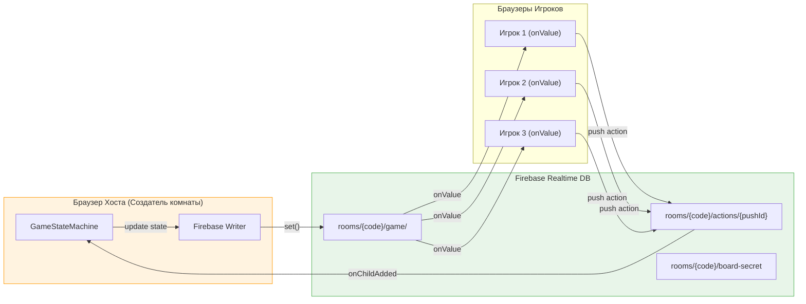

# Вариант B: Firebase Host-Based Architecture

Полная документация для реализации Codenames **без собственного сервера**. Создатель комнаты (Host) запускает State Machine в своём браузере, Firebase Realtime Database синхронизирует состояние между игроками.

> **Product Spec** (правила, UI mockups): [02-codenames-game.md](../../02-codenames-game.md)
> **Сравнение вариантов**: [../README.md](../README.md)

---

## Почему Firebase Host-Based?

- **Нет сервера** — ноль настройки DevOps, не нужно деплоить Node.js на Render
- **Бесплатно** — Firebase Free Tier (Spark) покрывает учебный проект
- **Нет холодного старта** — ментор открывает игру и сразу играет
- **Низкий Bus Factor** — все фронтендеры знают JSON и могут работать с Firebase
- **Real-time +20** — Firebase subscriptions (`onValue`) считаются как real-time фича
- **BaaS +15** — работа с облачной БД

### Когда НЕ выбирать этот вариант

- Хотите максимум баллов для Backend-Dev (Custom Backend +30 недоступен)
- Хотите production-like серверную архитектуру для портфолио
- Вам важна устойчивость к отключению хоста (если хост закрыл вкладку — Game Over)
- Команда хочет более глубокий backend-опыт → [Вариант A](../variant-a/)

---

## Ключевая идея: Host Authority

**Принцип:**

1. Игроки пишут команды в `rooms/{code}/actions/{pushId}` (push)
2. Хост подписан на `onChildAdded` — получает команды
3. Хост прогоняет команду через `GameStateMachine`
4. Хост записывает обновлённое состояние в `rooms/{code}/game/`
5. Все клиенты подписаны через `onValue` — автоматическая синхронизация

**Хост закрыл вкладку = Game Over.** Для учебного проекта это допустимо.

---

## Команда

| Имя        | Роль         | Компоненты                                                                |
| ---------- | ------------ | ------------------------------------------------------------------------- |
| **Alice**  | Lead         | Auth, CI/CD, Deployment, API Layer, Theme Switcher, Global Error Handling |
| **Boris**  | Firebase-Dev | Firebase Setup, Realtime DB Schema, Security Rules, Host Logic            |
| **Victor** | Board-Dev    | Game Board UI (5x5), Card Component, Animations, Client State Sync        |
| **Diana**  | Check-Dev    | Check Phase Popup, Question Bank, Evaluation Modes, i18n                  |
| **Eric**   | AI-Dev       | AI Mock Interfaces, Solo Mode, Landing Page, 404                          |
| **Felix**  | Lobby-Dev    | Lobby, Results Page, Profile, Player Stats, Responsive                    |

---

## Стек проекта

- **TypeScript** (strict mode)
- **Firebase** (Auth + Realtime Database + Hosting)
- **Shared Types** (общая папка `src/shared/` для типов)
- **Vitest** (Unit Tests) + **Playwright** (E2E Tests)
- **AI: ВСЕ МОКНУТО** (категориальный подбор + keyword matching)

---

## Навигация по документам

| Документ                                               | Описание                                                                                  | Когда читать                  |
| ------------------------------------------------------ | ----------------------------------------------------------------------------------------- | ----------------------------- |
| [scoring-and-plan.md](./scoring-and-plan.md)           | Расчёт баллов (6 человек), 6-недельный план работ, Cut Scope Strategy                     | На этапе планирования         |
| [data-contracts.md](./data-contracts.md)               | TypeScript типы, Firebase Realtime DB schema, AI интерфейсы, Shared Types                 | Перед началом разработки      |
| [game-engine.md](./game-engine.md)                     | Host-Based State Machine, Firebase sync, Board Generation, DevTools, Headless Testing     | При разработке Game Engine    |
| [check-phase.md](./check-phase.md)                     | Фаза проверки знаний: попап, банк вопросов, Self/Peer и AI режимы, отдельный Check-таймер | При разработке Check Phase    |
| [ai-spymaster.md](./ai-spymaster.md)                   | AI интерфейсы + Mock Implementation (вкл. hardcoded MVP), Solo Mode, AI Pre-generation    | При разработке AI / Solo Mode |
| [risks-and-mitigations.md](./risks-and-mitigations.md) | Host Disconnect, Firebase Quotas, Cheating, Bus Factor                                    | На всех этапах проекта        |

---

## Ключевые особенности этого варианта

- **Нет сервера** — вся логика в браузере хоста + Firebase
- **Firebase Free Tier** — бесплатно для учебного проекта (~100 одновременных подключений)
- **Instant start** — нет холодного старта, игра запускается мгновенно
- **Низкий Bus Factor** — любой фронтендер может работать с Firebase
- **Security Rules** — Firebase Rules защищают секретные данные (цвета карточек)
- **DevTools панель** — God Mode для отладки на localhost
- **Check Phase** — уникальная образовательная механика: очки только за знания
- **620-660 баллов** достижимы без реального AI и фреймворков
