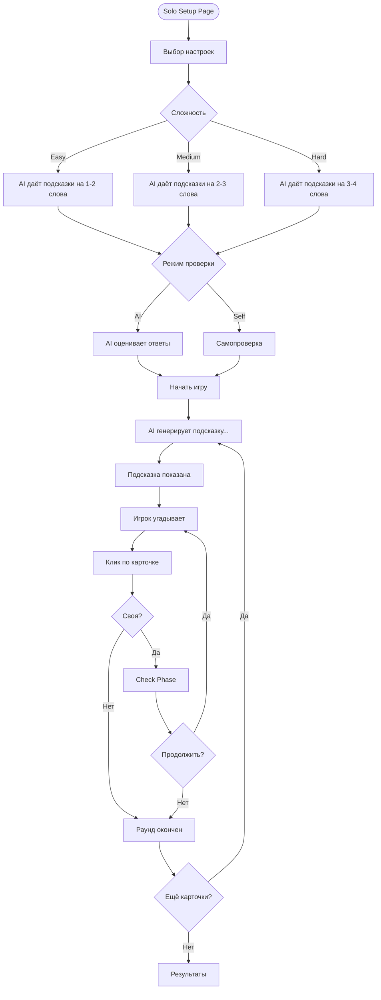
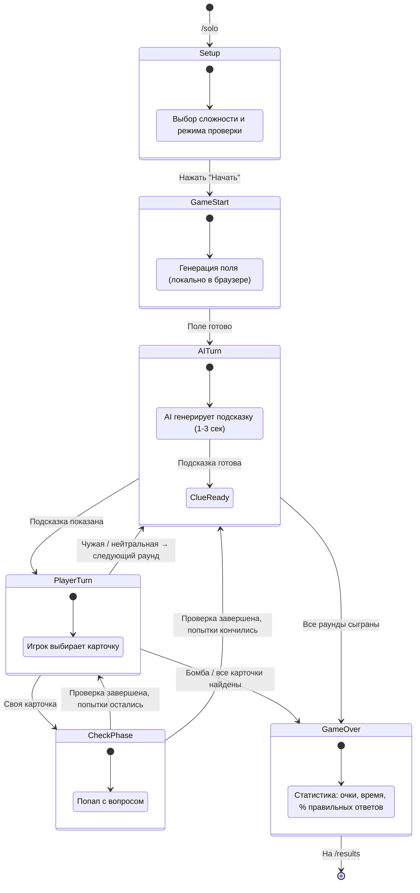

# AI Spymaster & Mock Implementation Guide (Variant B — Firebase)

Этот документ описывает AI интерфейсы и стратегию мокирования для Codenames: Interview Edition в **Variant B (Firebase Host-Based Architecture)**. **Все AI компоненты мокнуты** с чистыми интерфейсами, чтобы реальная AI интеграция могла быть подключена позже без изменения остального кода.

> **Отличие от Variant A (WebSocket):** В Firebase-архитектуре Solo Mode работает **полностью локально в браузере** — без Firebase Realtime DB, без WebSocket-сервера. Game loop, AI мок и state machine крутятся на клиенте. Это упрощает реализацию Solo Mode, но не меняет AI интерфейсы — они идентичны.

---

## 1. Концепция

Два AI компонента в игре:

1. **AI Spymaster** — генерирует подсказки в Solo Mode (играет роль капитана)
2. **AI Check Evaluator** — оценивает ответы в фазе проверки знаний

Оба компонента реализованы через интерфейсы. Мок-реализации используют простые алгоритмы (категории слов, keyword matching) и реалистичные задержки. Позже интерфейсы реализуются через LLM API.

### Почему интерфейсы важны именно в Firebase-архитектуре

В Variant B Multiplayer работает через Firebase Realtime DB — хост пишет состояние в Firebase, клиенты подписываются на изменения. Solo Mode, напротив, **не использует Firebase вообще** — вся логика локальная. Интерфейсы позволяют одному и тому же `AISpymasterService` работать:

- В Solo Mode — напрямую в браузере
- В будущем Multiplayer AI-режиме — через Cloud Functions (Firebase backend)

Ответственный за AI-компоненты: **Eric (AI-Dev)**.

---

## 2. Архитектура: Interface-First Design

```
┌─────────────────────────────────────────────────────────────┐
│                    Solo Game Mode                            │
│              (использует AI Spymaster)                       │
│         Работает ЛОКАЛЬНО — Firebase не нужен                │
├─────────────────────────────────────────────────────────────┤
│                    Check Phase                               │
│              (использует AI Evaluator)                       │
│      Solo: локально / Multiplayer: через Firebase Host      │
└───────────────┬──────────────────────┬──────────────────────┘
                │                      │
                ▼                      ▼
┌──────────────────────────┐  ┌──────────────────────────┐
│  AISpymasterService      │  │  AICheckEvaluatorService  │
│  (interface)             │  │  (interface)              │
└──────────┬───────────────┘  └──────────┬───────────────┘
     ┌─────┴─────┐                 ┌─────┴─────┐
     ▼           ▼                 ▼           ▼
┌──────────┐ ┌──────────┐   ┌──────────┐ ┌──────────┐
│   Mock   │ │   Real   │   │   Mock   │ │   Real   │
│Spymaster │ │Spymaster │   │Evaluator │ │Evaluator │
│          │ │ (future) │   │          │ │ (future) │
│ Category │ │          │   │ Keyword  │ │          │
│ matching │ │ LLM API  │   │ matching │ │ LLM API  │
│          │ │ + prompt │   │          │ │ + prompt │
│ 1-3 сек  │ │          │   │ 0.8-2 с  │ │          │
│ задержка │ │          │   │ задержка │ │          │
└──────────┘ └──────────┘   └──────────┘ └──────────┘
```

### Как это вписывается в Firebase-архитектуру

```
┌──────────────────────────────────────────────────────────────────┐
│                        Multiplayer Mode                          │
│                                                                  │
│   Host Browser                    Client Browser                 │
│  ┌──────────────┐               ┌──────────────┐                │
│  │ Game Logic   │──── Firebase ──│  UI only     │                │
│  │ Host writes  │   Realtime DB  │  Reads state │                │
│  │ state to DB  │               │  from DB     │                │
│  └──────────────┘               └──────────────┘                │
│                                                                  │
├──────────────────────────────────────────────────────────────────┤
│                        Solo Mode                                 │
│                                                                  │
│   Browser (всё локально)                                        │
│  ┌──────────────────────────────────────────┐                   │
│  │ SoloGameController                        │                   │
│  │  ├─ GameStateMachine (локальный стейт)   │                   │
│  │  ├─ AISpymasterService (мок)             │                   │
│  │  ├─ AICheckEvaluatorService (мок)        │                   │
│  │  └─ UI (тот же Board компонент)          │                   │
│  └──────────────────────────────────────────┘                   │
│                                                                  │
│   Firebase НЕ используется в Solo Mode                          │
└──────────────────────────────────────────────────────────────────┘
```

---

## 3. AI Interfaces

### AISpymasterService

```typescript
interface AISpymasterService {
  /**
   * Генерирует подсказку для Solo Mode.
   * Мок: категориальный подбор.
   * Real: LLM генерация.
   */
  generateClue(context: SpymasterContext): Promise<AIClue>;
}

interface SpymasterContext {
  myWords: string[]; // Мои слова (неоткрытые)
  opponentWords: string[]; // Слова соперника
  neutralWords: string[]; // Нейтральные
  bombWord: string; // Бомба
  revealedWords: string[]; // Уже открытые
  moveHistory: Move[]; // История ходов
  difficulty: "easy" | "medium" | "hard";
}

interface AIClue {
  word: string; // Слово-подсказка
  count: number; // Количество связанных слов
  reasoning?: string; // Объяснение (для debug/display)
  confidence: number; // 0-1
}
```

### AICheckEvaluatorService

```typescript
interface AICheckEvaluatorService {
  /**
   * Оценивает ответ игрока в фазе Check.
   * Мок: keyword matching.
   * Real: LLM оценка.
   */
  evaluateAnswer(context: CheckEvaluationContext): Promise<AICheckResult>;
}

interface CheckEvaluationContext {
  concept: string; // "localStorage"
  question: string; // "В чём отличие от sessionStorage?"
  playerAnswer: string; // Ответ игрока
  referenceAnswer: string; // Эталонный ответ
}

interface AICheckResult {
  pointGranted: boolean;
  feedback: string; // "Ответ верный" / "Не хватает ключевых моментов"
  confidence: number; // 0-1
}
```

### Где живут интерфейсы в структуре проекта

```
src/
├── ai/
│   ├── interfaces.ts              ← Все AI интерфейсы
│   ├── index.ts                   ← Фабрика (Mock / Real переключение)
│   ├── hardcoded-spymaster.ts     ← Уровень 0
│   ├── mock-spymaster.ts          ← Уровень 1
│   ├── mock-check-evaluator.ts    ← Keyword matching
│   └── __tests__/
│       ├── mock-spymaster.test.ts
│       └── mock-check-evaluator.test.ts
├── solo/
│   ├── SoloGameController.ts      ← Контроллер (без Firebase!)
│   ├── SoloSetupPage.tsx          ← Настройки Solo Mode
│   └── SoloResultsPage.tsx        ← Результаты
├── firebase/
│   ├── ...                        ← Только для Multiplayer
│   └── (Solo Mode сюда НЕ входит)
└── data/
    └── questions.json             ← Pre-generated контент
```

> **Eric** работает в папках `src/ai/` и `src/solo/`. Файлы в `src/firebase/` — зона ответственности **Тихого Сокета (Firebase-Dev)**.

---

## 4. Pre-generation: Оффлайн контент

Перед тем как реализовывать любой AI-мок (даже самый простой), стоит подготовить **статические данные** для игры. Это отдельный этап, который делается один раз и обеспечивает стабильную работу приложения.

### Идея

1. Берём список из **100 JS/TS концептов** (closure, hoisting, Promise, generics, event loop и т.д.)
2. Используем **ChatGPT / Claude** (вручную или через API) для генерации JSON с вопросами, вариантами ответов и эталонными объяснениями
3. Кладём результат в файл `questions.json` прямо в репозиторий
4. В игре используем этот **статический контент** вместо вызовов AI в рантайме

### Формат questions.json

```json
{
  "concepts": [
    {
      "word": "closure",
      "category": "область видимости",
      "questions": [
        {
          "question": "Что такое замыкание в JavaScript?",
          "referenceAnswer": "Замыкание — это функция, которая запоминает и имеет доступ к переменным из внешней (лексической) области видимости, даже после того как внешняя функция завершила выполнение.",
          "keywords": [
            "функция",
            "внешняя область",
            "лексическое окружение",
            "доступ",
            "переменные"
          ]
        },
        {
          "question": "Приведите практический пример использования замыкания.",
          "referenceAnswer": "Счётчик: function makeCounter() { let count = 0; return () => ++count; }. Каждый вызов makeCounter() создаёт независимый счётчик благодаря замыканию.",
          "keywords": [
            "счётчик",
            "приватная переменная",
            "фабрика",
            "состояние"
          ]
        }
      ]
    },
    {
      "word": "Promise",
      "category": "асинхронность",
      "questions": [
        {
          "question": "Чем Promise отличается от callback?",
          "referenceAnswer": "Promise — это объект, представляющий результат асинхронной операции. В отличие от callback, Promise позволяет цепочку через .then(), единообразную обработку ошибок через .catch() и избавляет от callback hell.",
          "keywords": [
            "объект",
            "асинхронная операция",
            "then",
            "catch",
            "цепочка",
            "callback hell"
          ]
        }
      ]
    }
  ]
}
```

### Как генерировать

Открываем ChatGPT или Claude и пишем:

```
Сгенерируй JSON для 100 JavaScript/TypeScript концептов.
Для каждого концепта дай:
- word: название концепта
- category: одна из категорий (асинхронность, типизация, область видимости, наследование, хранение данных, массивы, коллекции, модули, обработка ошибок, DOM, метапрограммирование, сеть)
- 2-3 вопроса с referenceAnswer и keywords

Формат: JSON, язык вопросов: русский.
```

Генерацию можно разбить на несколько запросов (по 10-20 концептов за раз) и склеить результат.

### Преимущества

- **100% стабильность** — данные лежат в репозитории, ничего не ломается в рантайме
- **Нет "AI упал"** — нет зависимости от внешних API
- **Нет "API key протух"** — не нужны ключи для работы
- **Нет "AI вернул мусор"** — все вопросы проверены заранее
- **Работает офлайн** — можно демонстрировать без интернета
- **Быстрые ответы** — нет задержки на API вызовы (задержка только искусственная для UX)

### Когда добавлять реальный AI

Реальную AI интеграцию (вызовы LLM API в рантайме) стоит добавлять **только если осталось время на неделе 6** — как "вишенку на торте". До этого момента статический `questions.json` + моки полностью покрывают все потребности игры.

> **Совет от Мудрого Мока:** Генерируйте `questions.json` на первой же неделе работы — он нужен и для Solo Mode, и для Check Phase в Multiplayer. Чем раньше готов контент, тем проще всем остальным.

---

## 5. Mock Implementation: AI Spymaster

Реализация AI Spymaster строится **поуровнево** — от максимально простого к более сложному. Не пытайтесь написать универсальный алгоритм на неделе 3. Начните с hardcoded данных и усложняйте по мере необходимости.

### Уровень 0: Hardcoded MVP (для демо)

Самый простой вариант мока — **таблица предопределённых подсказок**. Для первого демо на неделе 3 этого достаточно. Не нужен никакой алгоритм — просто lookup по ключам.

```typescript
const HARDCODED_CLUES: Record<string, { clue: string; words: string[] }> = {
  "closure,hoisting,scope": {
    clue: "область видимости",
    words: ["closure", "hoisting", "scope"],
  },
  "Promise,async/await,event loop": {
    clue: "асинхронность",
    words: ["Promise", "async/await", "event loop"],
  },
  "generics,interface,type": {
    clue: "типизация",
    words: ["generics", "interface", "type"],
  },
  "prototype,class,extends": {
    clue: "наследование",
    words: ["prototype", "class", "extends"],
  },
  "localStorage,sessionStorage,cookie": {
    clue: "хранение данных",
    words: ["localStorage", "sessionStorage", "cookie"],
  },
  "map,filter,reduce": { clue: "массивы", words: ["map", "filter", "reduce"] },
  "Map,Set,WeakMap": { clue: "коллекции", words: ["Map", "Set", "WeakMap"] },
  "import,export,default": {
    clue: "модули",
    words: ["import", "export", "default"],
  },
  "try/catch,Error,throw": {
    clue: "обработка ошибок",
    words: ["try/catch", "Error", "throw"],
  },
  "querySelector,addEventListener,event delegation": {
    clue: "DOM",
    words: ["querySelector", "addEventListener", "event delegation"],
  },
  "Proxy,Reflect,Symbol": {
    clue: "метапрограммирование",
    words: ["Proxy", "Reflect", "Symbol"],
  },
  "fetch,WebSocket,CORS": {
    clue: "сеть",
    words: ["fetch", "WebSocket", "CORS"],
  },
  "var,let,const": {
    clue: "объявление переменных",
    words: ["var", "let", "const"],
  },
  "setTimeout,setInterval,requestAnimationFrame": {
    clue: "таймеры",
    words: ["setTimeout", "setInterval", "requestAnimationFrame"],
  },
  "spread,rest,destructuring": {
    clue: "синтаксис ES6",
    words: ["spread", "rest", "destructuring"],
  },
  // ... 10-15 предопределённых комбинаций
};

class HardcodedSpymasterService implements AISpymasterService {
  async generateClue(context: SpymasterContext): Promise<AIClue> {
    // Симулируем "думание"
    await this.delay(1000 + Math.random() * 2000);

    const unrevealed = context.myWords.filter(
      (w) => !context.revealedWords.includes(w),
    );

    // Ищем совпадение в таблице
    for (const [key, value] of Object.entries(HARDCODED_CLUES)) {
      const keyWords = key.split(",");
      const matchingWords = unrevealed.filter((w) => keyWords.includes(w));

      if (matchingWords.length >= 2) {
        return {
          word: value.clue,
          count: matchingWords.length,
          reasoning: `Hardcoded: нашёл ${matchingWords.length} слов в группе "${value.clue}"`,
          confidence: 0.9,
        };
      }
    }

    // Fallback: одно слово
    return {
      word: "JavaScript",
      count: 1,
      reasoning: "Fallback: нет совпадений в таблице",
      confidence: 0.3,
    };
  }

  private delay(ms: number): Promise<void> {
    return new Promise((resolve) => setTimeout(resolve, ms));
  }
}
```

**Почему этого хватает для демо:** на неделе 3 важно показать работающий game loop, UI, базовое взаимодействие с Firebase Realtime DB (для Multiplayer). AI подсказка — это одна строка текста на экране. Hardcoded lookup прекрасно справляется. Не тратьте время на "умный" алгоритм, пока базовый флоу не работает.

> **Разделение ответственности:** Пока **Boris (Firebase-Dev)** настраивает Firebase Realtime DB и Security Rules для Multiplayer, **Eric (AI-Dev)** спокойно пишет Hardcoded MVP для Solo Mode — эти задачи не пересекаются.

### Уровень 1: Category Matching (для финальной версии, недели 4-5)

Более реалистичный мок, который использует предопределённую карту категорий слов. Для каждой категории подбирается подсказка, связывающая максимум слов из своей команды, избегая слов соперника и бомбы.

```typescript
// Предопределённая карта категорий
const WORD_CATEGORIES: Record<string, string[]> = {
  асинхронность: [
    "Promise",
    "async/await",
    "event loop",
    "setTimeout",
    "callback",
    "microtask",
  ],
  типизация: ["generics", "interface", "type", "enum", "any", "unknown"],
  "область видимости": [
    "closure",
    "scope",
    "hoisting",
    "var",
    "let",
    "const",
    "IIFE",
  ],
  наследование: ["prototype", "class", "extends", "super", "this", "new"],
  "хранение данных": [
    "localStorage",
    "sessionStorage",
    "cookie",
    "IndexedDB",
    "Cache API",
  ],
  массивы: [
    "map",
    "filter",
    "reduce",
    "forEach",
    "spread",
    "rest",
    "destructuring",
  ],
  коллекции: ["Map", "Set", "WeakMap", "WeakSet", "iterator", "generator"],
  модули: ["import", "export", "default", "namespace", "barrel"],
  "обработка ошибок": [
    "try/catch",
    "Error",
    "throw",
    "finally",
    "Promise.catch",
  ],
  DOM: [
    "querySelector",
    "addEventListener",
    "event delegation",
    "shadow DOM",
    "template",
  ],
  метапрограммирование: ["Proxy", "Reflect", "Symbol", "decorator", "WeakRef"],
  сеть: ["fetch", "XMLHttpRequest", "WebSocket", "CORS", "HTTP"],
};

class MockSpymasterService implements AISpymasterService {
  async generateClue(context: SpymasterContext): Promise<AIClue> {
    // Симулируем "думание" (1-3 секунды)
    await this.delay(1000 + Math.random() * 2000);

    const unrevealed = context.myWords.filter(
      (w) => !context.revealedWords.includes(w),
    );

    // Находим лучшую категорию
    const bestMatch = this.findBestCategoryMatch(
      unrevealed,
      context.opponentWords,
      context.bombWord,
      context.difficulty,
    );

    return bestMatch;
  }

  private findBestCategoryMatch(
    myWords: string[],
    opponentWords: string[],
    bombWord: string,
    difficulty: "easy" | "medium" | "hard",
  ): AIClue {
    let bestCategory = "";
    let bestCount = 0;
    let bestConfidence = 0;

    for (const [category, words] of Object.entries(WORD_CATEGORIES)) {
      // Сколько моих слов попадает в категорию
      const myMatches = myWords.filter((w) =>
        words.some((cw) => cw.toLowerCase() === w.toLowerCase()),
      );

      // Сколько слов соперника попадает (опасность)
      const opponentMatches = opponentWords.filter((w) =>
        words.some((cw) => cw.toLowerCase() === w.toLowerCase()),
      );

      // Бомба в категории?
      const bombMatch = words.some(
        (cw) => cw.toLowerCase() === bombWord.toLowerCase(),
      );

      if (bombMatch) continue; // Никогда не подсказываем категорию с бомбой

      // Оценка: свои минус чужие
      const score = myMatches.length - opponentMatches.length * 2;

      if (
        score > bestCount ||
        (score === bestCount && myMatches.length > bestCount)
      ) {
        bestCategory = category;
        bestCount = myMatches.length;
        bestConfidence = score / myWords.length;
      }
    }

    // Ограничиваем count по сложности
    const maxCount =
      difficulty === "easy" ? 2 : difficulty === "medium" ? 3 : 4;
    const clueCount = Math.min(bestCount, maxCount);

    // Fallback: если нет совпадений, берём случайное слово
    if (bestCount === 0) {
      return {
        word: this.getRandomFallbackClue(myWords),
        count: 1,
        reasoning: "Fallback: прямая ассоциация со словом",
        confidence: 0.3,
      };
    }

    return {
      word: bestCategory,
      count: clueCount,
      reasoning: `Связал ${clueCount} слов через категорию "${bestCategory}"`,
      confidence: Math.min(0.9, 0.5 + bestConfidence),
    };
  }

  private getRandomFallbackClue(words: string[]): string {
    // Простые ассоциации для fallback
    const associations: Record<string, string> = {
      closure: "замок",
      Promise: "обещание",
      prototype: "прародитель",
      "async/await": "ожидание",
      this: "контекст",
      hoisting: "подъём",
      scope: "область",
      class: "чертёж",
      Map: "карта",
      Set: "набор",
    };

    const word = words[Math.floor(Math.random() * words.length)];
    return associations[word] || "JavaScript";
  }

  private delay(ms: number): Promise<void> {
    return new Promise((resolve) => setTimeout(resolve, ms));
  }
}
```

### Уровень 2: Real LLM (будущее, опционально)

Реальная интеграция с LLM API (OpenAI, Anthropic и т.д.). Реализуется **только если осталось время** после полировки основного функционала. Промпты для этого уровня описаны в секции "Будущая AI интеграция" ниже.

В Firebase-архитектуре реальный LLM можно вызывать:

- **Из браузера** напрямую (через API ключ — плохо для безопасности, но допустимо для учебного проекта)
- **Через Firebase Cloud Functions** (предпочтительно — ключ хранится на сервере)

```typescript
// Пример: вызов LLM через Cloud Function
class RealSpymasterService implements AISpymasterService {
  async generateClue(context: SpymasterContext): Promise<AIClue> {
    // Вызываем Firebase Cloud Function
    const generateClue = httpsCallable(functions, "generateAIClue");
    const result = await generateClue({ context });
    return result.data as AIClue;
  }
}
```

> **Eric** реализует Уровень 2 только на неделе 6 и только если Уровень 1 полностью протестирован.

### Рекомендуемый план по неделям

| Неделя     | Уровень                           | Что делаем                                 |
| ---------- | --------------------------------- | ------------------------------------------ |
| Неделя 3   | Уровень 0: Hardcoded MVP          | Lookup-таблица, первое демо game loop      |
| Недели 4-5 | Уровень 1: Category Matching      | Алгоритм категорий, реалистичные подсказки |
| Неделя 6   | Уровень 2: Real LLM (опционально) | Только если всё остальное готово           |

### Пример работы мока (Уровень 1)

**Входные данные:**

```typescript
context = {
  myWords: ["closure", "hoisting", "scope", "Promise", "Map"],
  opponentWords: ["prototype", "class", "extends"],
  neutralWords: ["spread", "rest", "BigInt"],
  bombWord: "eval",
  revealedWords: [],
  moveHistory: [],
  difficulty: "medium",
};
```

**Результат:**

```typescript
{
  word: 'область видимости',    // Категория, покрывающая closure, hoisting, scope
  count: 3,
  reasoning: 'Связал 3 слов через категорию "область видимости"',
  confidence: 0.7,
}
```

**Что увидит игрок:**

```
┌─────────────────────────────────────────┐
│  AI Spymaster думает...                 │
│  ████████████░░░░  (прогресс-бар)       │
│                                          │
│  Подсказка:  ОБЛАСТЬ ВИДИМОСТИ, 3       │
│                                          │
│  Угадайте 3 слова (+ 1 бонусная попытка)│
└─────────────────────────────────────────┘
```

---

## 6. Mock Implementation: AI Check Evaluator

### Стратегия: Keyword Matching

Мок извлекает ключевые слова из эталонного ответа и проверяет, содержит ли ответ игрока достаточное количество этих слов.

```typescript
class MockCheckEvaluatorService implements AICheckEvaluatorService {
  async evaluateAnswer(
    context: CheckEvaluationContext,
  ): Promise<AICheckResult> {
    // Симулируем "думание AI" (0.8-2 секунды)
    await this.delay(800 + Math.random() * 1200);

    const keywords = this.extractKeywords(context.referenceAnswer);
    const playerWords = context.playerAnswer.toLowerCase();

    // Считаем совпадения
    const matches = keywords.filter((kw) =>
      playerWords.includes(kw.toLowerCase()),
    );
    const matchRatio =
      keywords.length > 0 ? matches.length / keywords.length : 0;

    // Порог: 30% ключевых слов = засчитано (мок мягкий)
    const pointGranted = matchRatio >= 0.3;

    // Генерируем feedback
    const feedback = this.generateFeedback(
      pointGranted,
      matches,
      keywords,
      context.concept,
    );

    return {
      pointGranted,
      feedback,
      confidence: matchRatio,
    };
  }

  private extractKeywords(text: string): string[] {
    // Убираем стоп-слова, извлекаем значимые слова
    const stopWords = new Set([
      "это",
      "и",
      "в",
      "на",
      "что",
      "как",
      "не",
      "для",
      "с",
      "по",
      "а",
      "но",
      "из",
      "к",
      "от",
      "до",
      "при",
      "или",
      "же",
      "то",
      "the",
      "is",
      "a",
      "an",
      "in",
      "on",
      "for",
      "to",
      "of",
      "and",
    ]);

    return text
      .toLowerCase()
      .replace(/[^\wа-яё\s]/gi, "")
      .split(/\s+/)
      .filter((word) => word.length > 3 && !stopWords.has(word))
      .slice(0, 10); // Максимум 10 ключевых слов
  }

  private generateFeedback(
    granted: boolean,
    matches: string[],
    allKeywords: string[],
    concept: string,
  ): string {
    if (granted && matches.length >= allKeywords.length * 0.7) {
      return `Отличный ответ! Вы хорошо понимаете ${concept}.`;
    }
    if (granted) {
      return `Ответ засчитан. Можно было также упомянуть: ${allKeywords
        .filter((k) => !matches.includes(k))
        .slice(0, 2)
        .join(", ")}.`;
    }
    return `Ответ не засчитан. Ключевые моменты, которых не хватило: ${allKeywords
      .filter((k) => !matches.includes(k))
      .slice(0, 3)
      .join(", ")}.`;
  }

  private delay(ms: number): Promise<void> {
    return new Promise((resolve) => setTimeout(resolve, ms));
  }
}
```

### Где используется Check Evaluator

В Firebase-архитектуре Check Evaluator используется в двух режимах:

| Режим                  | Где выполняется         | Как вызывается                                                         |
| ---------------------- | ----------------------- | ---------------------------------------------------------------------- |
| Solo Mode              | Локально в браузере     | `SoloGameController` вызывает `evaluator.evaluateAnswer()` напрямую    |
| Multiplayer (AI Check) | На стороне Host-клиента | Host вызывает `evaluator.evaluateAnswer()`, результат пишет в Firebase |

### Пример работы мока

**Входные данные:**

```typescript
context = {
  concept: "localStorage",
  question: "В чём отличие от sessionStorage?",
  playerAnswer:
    "localStorage сохраняет данные навсегда, а sessionStorage только на время сессии вкладки",
  referenceAnswer:
    "localStorage сохраняет данные без срока давности, данные сохраняются при закрытии браузера. sessionStorage хранит данные только в рамках текущей сессии: данные удаляются при закрытии вкладки.",
};
```

**Извлечённые ключевые слова:** `['localstorage', 'сохраняет', 'данные', 'давности', 'закрытии', 'браузера', 'sessionstorage', 'сессии', 'удаляются', 'вкладки']`

**Совпадения в ответе:** `['localstorage', 'сохраняет', 'данные', 'sessionstorage', 'сессии', 'вкладки']` — 6 из 10 (60%)

**Результат:**

```typescript
{
  pointGranted: true,  // 60% > 30% порог
  feedback: 'Ответ засчитан. Можно было также упомянуть: давности, закрытии.',
  confidence: 0.6,
}
```

---

## 7. Переключение Mock / Real

```typescript
// ai/index.ts
import { HardcodedSpymasterService } from "./hardcoded-spymaster";
import { MockSpymasterService } from "./mock-spymaster";
import { MockCheckEvaluatorService } from "./mock-check-evaluator";
// import { RealSpymasterService } from './real-spymaster';       // Future
// import { RealCheckEvaluatorService } from './real-check-evaluator'; // Future

const USE_MOCK_AI = import.meta.env.VITE_USE_MOCK_AI !== "false";

export const aiSpymaster: AISpymasterService = USE_MOCK_AI
  ? new MockSpymasterService()
  : new MockSpymasterService(); // TODO: заменить на RealSpymasterService

export const aiCheckEvaluator: AICheckEvaluatorService = USE_MOCK_AI
  ? new MockCheckEvaluatorService()
  : new MockCheckEvaluatorService(); // TODO: заменить на RealCheckEvaluatorService
```

> **Примечание для Firebase-варианта:** В будущем `RealSpymasterService` может вызывать Firebase Cloud Functions вместо прямых HTTP-запросов к LLM API. Это безопаснее — API ключ хранится в Firebase Environment, а не на клиенте.

### Тестирование моков

```typescript
// ai/__tests__/mock-spymaster.test.ts
import { describe, it, expect } from "vitest";
import { MockSpymasterService } from "../mock-spymaster";

describe("MockSpymasterService", () => {
  const service = new MockSpymasterService();

  it("should generate a clue with count > 0", async () => {
    const clue = await service.generateClue({
      myWords: ["closure", "hoisting", "scope"],
      opponentWords: ["class", "extends"],
      neutralWords: ["BigInt"],
      bombWord: "eval",
      revealedWords: [],
      moveHistory: [],
      difficulty: "medium",
    });

    expect(clue.word).toBeTruthy();
    expect(clue.count).toBeGreaterThan(0);
    expect(clue.confidence).toBeGreaterThan(0);
  });

  it("should never suggest a clue matching the bomb word category", async () => {
    const clue = await service.generateClue({
      myWords: ["Proxy", "Reflect", "Symbol"],
      opponentWords: [],
      neutralWords: [],
      bombWord: "decorator", // В категории "метапрограммирование"
      revealedWords: [],
      moveHistory: [],
      difficulty: "medium",
    });

    // Не должен предложить "метапрограммирование", т.к. бомба в той же категории
    expect(clue.word).not.toBe("метапрограммирование");
  });

  it("should respect difficulty level for count", async () => {
    const easyClue = await service.generateClue({
      myWords: ["closure", "hoisting", "scope", "let", "var"],
      opponentWords: [],
      neutralWords: [],
      bombWord: "eval",
      revealedWords: [],
      moveHistory: [],
      difficulty: "easy",
    });

    expect(easyClue.count).toBeLessThanOrEqual(2);
  });
});
```

```typescript
// ai/__tests__/mock-check-evaluator.test.ts
import { describe, it, expect } from "vitest";
import { MockCheckEvaluatorService } from "../mock-check-evaluator";

describe("MockCheckEvaluatorService", () => {
  const service = new MockCheckEvaluatorService();

  it("should grant point for answer with enough keywords", async () => {
    const result = await service.evaluateAnswer({
      concept: "closure",
      question: "Что такое замыкание?",
      playerAnswer:
        "Функция, которая имеет доступ к переменным из внешней области видимости",
      referenceAnswer:
        "Замыкание — это функция, которая запоминает и имеет доступ к переменным из внешней области видимости.",
    });

    expect(result.pointGranted).toBe(true);
    expect(result.confidence).toBeGreaterThan(0.3);
  });

  it("should not grant point for empty answer", async () => {
    const result = await service.evaluateAnswer({
      concept: "closure",
      question: "Что такое замыкание?",
      playerAnswer: "",
      referenceAnswer: "Замыкание — это функция...",
    });

    expect(result.pointGranted).toBe(false);
  });

  it("should provide helpful feedback", async () => {
    const result = await service.evaluateAnswer({
      concept: "Promise",
      question: "Чем Promise отличается от callback?",
      playerAnswer: "Promise это объект",
      referenceAnswer:
        "Promise — это объект, представляющий результат асинхронной операции с цепочкой через then и catch.",
    });

    expect(result.feedback).toBeTruthy();
    expect(result.feedback.length).toBeGreaterThan(10);
  });
});
```

---

## 8. Solo Mode

### Концепция

Solo Mode позволяет играть одному. AI играет роль капитана (Spymaster) одной из команд. Игрок — оперативник. Соперничество идёт "против себя" или "против таймера".

> **Ключевое отличие Firebase-варианта:** В Solo Mode **Firebase Realtime DB не используется**. Вся логика (state machine, AI, таймер) работает локально в браузере. Это означает:
>
> - Не нужно настраивать Security Rules для Solo
> - Не нужно платить за Firebase reads/writes в Solo
> - Solo Mode работает даже если Firebase полностью недоступен
> - Проще тестировать — нет зависимости от внешних сервисов

### User Flow



### Solo Game State Machine



### Solo Mode: особенности реализации

| Аспект     | Multiplayer                         | Solo                                   |
| ---------- | ----------------------------------- | -------------------------------------- |
| Firebase   | Realtime DB + Host Logic            | Локальная state machine (без Firebase) |
| Spymaster  | Живой человек                       | AI Mock                                |
| Таймер     | Host пишет `turnEndTime` в Firebase | Только клиентский (`setTimeout`)       |
| Check Mode | Настраивается хостом                | По умолчанию AI                        |
| Соперник   | Другая команда                      | Нет (играет один)                      |
| Сохранение | Firebase (через Host)               | Локально (`localStorage`) или REST API |

### Подробнее о различиях

**Firebase (Multiplayer):** Хост-клиент пишет состояние игры в Firebase Realtime DB. Все остальные клиенты подписываются на изменения через `onValue()`. Ходы валидируются Security Rules.

**Локальная state machine (Solo):** Состояние игры хранится в обычном объекте (или reactive state, например, через Zustand/Redux/Signals). Нет подписок на Firebase, нет Security Rules, нет сетевых задержек. Всё работает мгновенно (кроме искусственной задержки AI).

```typescript
// Сравнение: как обновляется состояние

// Multiplayer (Host пишет в Firebase)
async function makeMove(roomId: string, cardId: string) {
  const cardRef = ref(db, `rooms/${roomId}/board/${cardId}`);
  await update(cardRef, { status: "revealed" });
  // Все клиенты автоматически получат обновление
}

// Solo (локальное обновление)
function makeMove(cardId: string) {
  gameState.board[cardId].status = "revealed";
  renderBoard(); // Обновляем UI напрямую
}
```

### Solo Game Controller

В Firebase-варианте `SoloGameController` работает **полностью в браузере** — без Firebase, без сетевых вызовов. Это значительно упрощает реализацию по сравнению с WebSocket-вариантом.

```typescript
// Solo game loop — всё локально, Firebase не используется
class SoloGameController {
  // Вся логика локальная — Firebase не используется
  // GameStateMachine работает напрямую в браузере
  private game: GameStateMachine;
  private spymaster: AISpymasterService;
  private evaluator: AICheckEvaluatorService;
  private ui: GameUI;
  private timer: ReturnType<typeof setTimeout> | null = null;

  constructor(
    settings: SoloSettings,
    spymaster: AISpymasterService,
    evaluator: AICheckEvaluatorService,
  ) {
    this.game = new GameStateMachine(settings);
    this.spymaster = spymaster;
    this.evaluator = evaluator;
    this.ui = new GameUI();
  }

  async startRound(): Promise<void> {
    // 1. AI генерирует подсказку (локально, без Firebase)
    const context = this.buildSpymasterContext();
    this.ui.showThinking();
    const clue = await this.spymaster.generateClue(context);

    // 2. Показываем подсказку
    this.ui.showClue(clue);
    this.game.setClue({ word: clue.word, count: clue.count });
    this.game.setGuessesRemaining(clue.count + 1); // +1 по правилам

    // 3. Запускаем клиентский таймер (если настроен)
    if (this.game.settings.timerSeconds > 0) {
      this.startClientTimer(this.game.settings.timerSeconds);
    }

    // 4. Ждём действий игрока (через UI events)
  }

  async handleGuess(cardId: string): Promise<void> {
    const card = this.game.revealCard(cardId);

    this.ui.revealCard(cardId, card.color);

    if (card.color === "bomb") {
      return this.endGame("lose");
    }

    if (card.color === this.game.currentTeam) {
      // Своя карточка -> Check Phase
      await this.runCheckPhase(card.word);
      this.game.decrementGuesses();

      if (this.game.isAllFound()) return this.endGame("win");
      if (this.game.guessesRemaining <= 0) return this.startRound();
      // Иначе: продолжаем угадывать
    } else {
      // Чужая или нейтральная -> раунд окончен
      this.startRound();
    }
  }

  private async runCheckPhase(word: string): Promise<void> {
    const questionData = this.game.getQuestionForWord(word);

    // Показываем вопрос
    const playerAnswer = await this.ui.showQuestionPopup(questionData.question);

    // AI оценивает ответ (локально, без Firebase)
    const result = await this.evaluator.evaluateAnswer({
      concept: word,
      question: questionData.question,
      playerAnswer,
      referenceAnswer: questionData.referenceAnswer,
    });

    // Показываем результат
    this.ui.showCheckResult(result);

    if (result.pointGranted) {
      this.game.addScore(1);
    }
  }

  private startClientTimer(seconds: number): void {
    // В Solo Mode таймер чисто клиентский — не нужна синхронизация через Firebase
    this.timer = setTimeout(() => {
      this.ui.showTimeUp();
      this.startRound();
    }, seconds * 1000);
  }

  private endGame(result: "win" | "lose"): void {
    if (this.timer) clearTimeout(this.timer);

    const stats = this.game.getStats();

    // Сохраняем результат локально
    this.saveToLocalStorage(stats);

    this.ui.showGameOver(result, stats);
  }

  private saveToLocalStorage(stats: GameStats): void {
    const history = JSON.parse(localStorage.getItem("solo-history") || "[]");
    history.push({
      ...stats,
      date: new Date().toISOString(),
    });
    localStorage.setItem("solo-history", JSON.stringify(history));
  }

  private buildSpymasterContext(): SpymasterContext {
    return {
      myWords: this.game.getUnrevealedTeamWords(),
      opponentWords: this.game.getOpponentWords(),
      neutralWords: this.game.getNeutralWords(),
      bombWord: this.game.getBombWord(),
      revealedWords: this.game.getRevealedWords(),
      moveHistory: this.game.getMoveHistory(),
      difficulty: this.game.settings.difficulty,
    };
  }
}
```

### Почему Solo Mode проще в Firebase-варианте

В WebSocket-варианте (Variant A) Solo Mode должен либо:

- Поднимать mock WebSocket-сервер на клиенте
- Или дублировать game logic на клиенте отдельно от серверной логики

В Firebase-варианте (Variant B) проблема проще:

- Multiplayer: Host-клиент управляет стейтом через Firebase
- Solo: тот же game logic работает локально, просто без записи в Firebase

Это **уменьшает объём кода** — не нужно мокировать WebSocket-подключение. `SoloGameController` просто использует `GameStateMachine` напрямую.

```
Variant A (WebSocket):
  Solo → нужен Mock WS / дублирование серверной логики
  Сложность: ★★★☆☆

Variant B (Firebase):
  Solo → просто используем GameStateMachine без Firebase
  Сложность: ★★☆☆☆
```

### Сохранение результатов Solo Mode

В Solo Mode результаты можно сохранять несколькими способами:

```typescript
// Вариант 1: localStorage (простой, рекомендуется для MVP)
function saveSoloResult(stats: GameStats): void {
  const key = "codenames-solo-history";
  const history = JSON.parse(localStorage.getItem(key) || "[]");
  history.push({
    date: new Date().toISOString(),
    score: stats.score,
    totalCards: stats.totalCards,
    correctAnswers: stats.correctAnswers,
    timeSpent: stats.timeSpent,
    difficulty: stats.difficulty,
  });
  localStorage.setItem(key, JSON.stringify(history));
}

// Вариант 2: Firebase (опционально, если хотим синхронизацию)
async function saveSoloResultToFirebase(
  userId: string,
  stats: GameStats,
): Promise<void> {
  const resultRef = ref(db, `users/${userId}/soloHistory`);
  await push(resultRef, {
    ...stats,
    timestamp: serverTimestamp(),
  });
}
```

> **Рекомендация от Мудрого Мока:** Начните с `localStorage` — это проще и не требует аутентификации. Firebase-сохранение можно добавить позже, когда **Boris (Firebase-Dev)** настроит Firebase Auth.

---

## 9. UI: Solo Setup Page

```
┌─────────────────────────────────────────────────────────────┐
│  CODENAMES: Interview Edition          Solo Mode             │
├─────────────────────────────────────────────────────────────┤
│                                                              │
│  Настройки игры с AI                                        │
│                                                              │
│  Сложность:                                                 │
│  ┌──────────┐  ┌──────────┐  ┌──────────┐                  │
│  │   Easy   │  │  Medium  │  │   Hard   │                  │
│  │ 1-2 слова│  │ 2-3 слова│  │ 3-4 слова│                  │
│  └──────────┘  └──────────┘  └──────────┘                  │
│                    ↑ выбрано                                  │
│                                                              │
│  Режим проверки:                                            │
│  ○ Самопроверка (Показать ответ → Знаю/Не знаю)           │
│  ● AI проверка (AI оценивает ваш ответ)     ← выбрано      │
│                                                              │
│  Таймер на ход:                                             │
│  ○ Без таймера                                               │
│  ● 2 минуты                                 ← выбрано       │
│  ○ 1 минута                                                  │
│                                                              │
│                                                              │
│                     [  Начать игру  ]                        │
│                                                              │
│  ────────────────────────────────────────────               │
│  История игр:                                                │
│  │ 05.02 — Medium — 7/9 карточек — 82% ответов             │
│  │ 03.02 — Easy   — 9/9 карточек — 91% ответов             │
│  └──────────────────────────────────────────                 │
│                                                              │
└─────────────────────────────────────────────────────────────┘
```

> **Примечание:** В Firebase-варианте Solo Setup Page не требует аутентификации и не взаимодействует с Firebase. История загружается из `localStorage`. Это делает страницу полностью автономной.

### Компонент SoloSetupPage

```typescript
// solo/SoloSetupPage.tsx (псевдокод)
function SoloSetupPage() {
  const [difficulty, setDifficulty] = useState<'easy' | 'medium' | 'hard'>('medium');
  const [checkMode, setCheckMode] = useState<'ai' | 'self'>('ai');
  const [timerSeconds, setTimerSeconds] = useState(120);
  const [history, setHistory] = useState<GameStats[]>([]);

  useEffect(() => {
    // Загружаем историю из localStorage (не из Firebase)
    const saved = localStorage.getItem('codenames-solo-history');
    if (saved) setHistory(JSON.parse(saved));
  }, []);

  function handleStart() {
    // Создаём контроллер и запускаем игру
    // Никакого Firebase — всё локально
    const controller = new SoloGameController(
      { difficulty, checkMode, timerSeconds },
      aiSpymaster,       // Из ai/index.ts
      aiCheckEvaluator,  // Из ai/index.ts
    );
    navigate('/solo/game', { state: { controller } });
  }

  return (
    <div>
      <h1>Solo Mode</h1>
      <DifficultySelector value={difficulty} onChange={setDifficulty} />
      <CheckModeSelector value={checkMode} onChange={setCheckMode} />
      <TimerSelector value={timerSeconds} onChange={setTimerSeconds} />
      <button onClick={handleStart}>Начать игру</button>
      <SoloHistory games={history} />
    </div>
  );
}
```

---

## 10. Будущая AI интеграция (промпты для документации)

> Эти промпты НЕ реализуются сейчас. Они описаны для будущей интеграции с LLM. В Firebase-архитектуре вызов LLM лучше делать через **Cloud Functions** — так API ключ не попадает на клиент.

### Промпт для AI Spymaster

```
You are a Codenames Spymaster for the {team} team.
Board state:
- Your words (not yet revealed): {myWords}
- Opponent words: {opponentWords}
- Neutral words: {neutralWords}
- Bomb: {bombWord}
- Already revealed: {revealedWords}

Rules:
1. Give exactly ONE word as a clue and a number
2. The clue must relate to {number} of your words
3. NEVER give a clue that relates to the bomb word
4. Avoid clues that relate to opponent words
5. The clue cannot be any word on the board

Respond in format: CLUE, NUMBER
Example: "Асинхронность, 3"
```

### Промпт для AI Check Evaluator

```
You are evaluating a player's understanding of a JavaScript/TypeScript concept.

Concept: {concept}
Question: "{question}"
Player's answer: "{playerAnswer}"
Reference answer: "{referenceAnswer}"

Evaluate whether the player demonstrates understanding of the core concept.
Be lenient - they don't need to use the exact same words, just show understanding.

Respond in JSON format:
{
  "pointGranted": true/false,
  "feedback": "one sentence of feedback"
}
```

### Архитектура вызова LLM в Firebase

```
┌─────────────────┐      ┌──────────────────────┐      ┌────────────┐
│  Browser         │      │  Firebase Cloud       │      │  LLM API   │
│                  │      │  Functions             │      │  (OpenAI)  │
│  SoloController  │─────→│  generateAIClue()     │─────→│            │
│  или             │ HTTP │  evaluateAIAnswer()   │ HTTP │            │
│  Host (Multi)    │←─────│                        │←─────│            │
│                  │      │  API_KEY в env         │      │            │
└─────────────────┘      └──────────────────────┘      └────────────┘
```

> **Совет от Великого Мёрджа:** Настройка Cloud Functions — отдельная задача. Не включайте её в скоуп Мудрого Мока. Если команда решит подключить реальный LLM, пусть **Boris (Firebase-Dev)** настроит Cloud Function, а **Eric (AI-Dev)** подготовит промпты и парсинг ответа.

---

## 11. Эстимейт: AI + Solo Mode

| Задача                                      | Min     | Max     | Avg     | Кто           | Примечание                         |
| ------------------------------------------- | ------- | ------- | ------- | ------------- | ---------------------------------- |
| Interface definitions (TypeScript)          | 2ч      | 3ч      | 2.5ч    | Eric (AI-Dev) | Оба сервиса                        |
| Pre-generation questions.json               | 2ч      | 4ч      | 3ч      | Eric (AI-Dev) | 100 концептов через ChatGPT/Claude |
| Hardcoded Spymaster (Level 0)               | 1ч      | 2ч      | 1.5ч    | Eric (AI-Dev) | Lookup-таблица для первого демо    |
| Mock Spymaster (category matching, Level 1) | 4ч      | 8ч      | 6ч      | Eric (AI-Dev) | WORD_CATEGORIES + алгоритм         |
| Mock Check Evaluator (keyword matching)     | 3ч      | 6ч      | 4.5ч    | Eric (AI-Dev) | Keyword extraction + scoring       |
| Solo Setup page (UI)                        | 2ч      | 4ч      | 3ч      | Eric (AI-Dev) | Настройки, история, кнопки         |
| Solo Game Controller (game loop)            | 4ч      | 8ч      | 6ч      | Eric (AI-Dev) | Проще чем в Variant A — нет WS     |
| Landing page                                | 2ч      | 4ч      | 3ч      | Eric (AI-Dev) | Описание игры, кнопки              |
| 404 page                                    | 1ч      | 2ч      | 1.5ч    | Eric (AI-Dev) | Not Found                          |
| Unit тесты моков                            | 3ч      | 5ч      | 4ч      | Eric (AI-Dev) | Edge cases                         |
| **Итого**                                   | **24ч** | **46ч** | **35ч** |               |                                    |

> **Сравнение с Variant A:** В WebSocket-варианте Solo Game Controller оценивается в 5-10ч (avg 7.5ч), потому что нужно мокировать WebSocket или дублировать серверную логику. В Firebase-варианте — 4-8ч (avg 6ч), потому что game loop просто работает локально без сетевых абстракций. Итого: **24-46ч** вместо 25-48ч.

### Разбивка по неделям

| Неделя   | Задачи Мудрого Мока                                    | Часов |
| -------- | ------------------------------------------------------ | ----- |
| Неделя 3 | Interface definitions + Pre-generation + Hardcoded MVP | 5-9ч  |
| Неделя 4 | Mock Spymaster Level 1 + Mock Check Evaluator          | 7-14ч |
| Неделя 5 | Solo Setup Page + Solo Game Controller + Landing + 404 | 9-18ч |
| Неделя 6 | Unit тесты + полировка + (опционально) Real LLM        | 3-5ч  |

### Зависимости от других участников

| Задача Мудрого Мока    | Зависит от                                        | Блокируется?     |
| ---------------------- | ------------------------------------------------- | ---------------- |
| AI интерфейсы          | Ничего                                            | Нет              |
| Pre-generation JSON    | Ничего                                            | Нет              |
| Hardcoded Spymaster    | AI интерфейсы                                     | Нет (делает сам) |
| Mock Spymaster Level 1 | AI интерфейсы                                     | Нет (делает сам) |
| Mock Check Evaluator   | questions.json (формат)                           | Нет (делает сам) |
| Solo Setup Page        | UI kit от Быстрого Рендера                        | Частично         |
| Solo Game Controller   | GameStateMachine (архитектура от Великого Мёрджа) | Да               |
| Landing page           | Дизайн от Быстрого Рендера                        | Частично         |
| 404 page               | Роутинг от Ловкого Роутера                        | Частично         |

> **Alice (Lead)** должен обеспечить, чтобы `GameStateMachine` был готов к неделе 4, иначе **Eric** не сможет начать Solo Game Controller вовремя.

---

## 12. Типичные ошибки

### 1. AI отвечает мгновенно

```typescript
// Плохо: мок отвечает за 1 мс — нереалистично
async generateClue(context: SpymasterContext): Promise<AIClue> {
  return { word: 'JavaScript', count: 1, confidence: 0.5 };
}

// Хорошо: симулируем "думание"
async generateClue(context: SpymasterContext): Promise<AIClue> {
  await delay(1000 + Math.random() * 2000);  // 1-3 сек
  return this.calculate(context);
}
```

**Почему это важно:** Без задержки UI "мигает" — подсказка появляется мгновенно, и игрок не чувствует, что AI "думает". Прогресс-бар / спиннер теряют смысл. **Victor (Board-Dev)** добавит анимацию "думания", но она работает только если есть задержка.

### 2. Мок подсказывает бомбу

```typescript
// Плохо: не проверяем бомбу
// Мок может выдать "метапрограммирование", а бомба — "Proxy"

// Хорошо: явная проверка
if (bombMatch) continue; // Пропускаем категорию с бомбой
```

**Почему это важно:** Если AI-мок подсказывает категорию с бомбой, игрок может нажать на бомбу и проиграть. Это не баг — но плохой UX. AI Spymaster "знает" расположение всех карточек и не должен наводить на бомбу.

### 3. Слишком строгий Check Evaluator

```typescript
// Плохо: точное совпадение
const pointGranted = playerAnswer === referenceAnswer;
// Никто не наберёт очки!

// Хорошо: keyword matching с мягким порогом (30%)
const matchRatio = matches.length / keywords.length;
const pointGranted = matchRatio >= 0.3;
```

**Почему это важно:** Игра должна быть fun. Если мок слишком строгий, никто не набирает очки и мотивация играть пропадает. Порог 30% — это баланс между "слишком легко" и "невозможно". **Diana (Check-Dev)** может настроить порог через UI позже.

### 4. Нет fallback при пустом ответе

```typescript
// Плохо: crash на пустом ответе
const keywords = extractKeywords(playerAnswer); // []
const ratio = matches.length / keywords.length; // NaN!

// Хорошо: обработка пустого
if (!playerAnswer.trim()) {
  return {
    pointGranted: false,
    feedback: "Ответ не предоставлен.",
    confidence: 0,
  };
}
```

### 5. Solo Mode пытается писать в Firebase

```typescript
// Плохо: Solo Mode зависит от Firebase
async handleGuess(cardId: string) {
  const cardRef = ref(db, `rooms/${this.roomId}/board/${cardId}`);
  await update(cardRef, { status: 'revealed' });  // Зачем Firebase в Solo?!
}

// Хорошо: Solo Mode полностью локальный
handleGuess(cardId: string) {
  this.game.revealCard(cardId);  // Локальное обновление
  this.ui.revealCard(cardId);    // Обновляем UI напрямую
}
```

**Почему это важно:** В Firebase-варианте Solo Mode **не должен** использовать Firebase. Это бесплатные reads/writes, которые не нужны. Кроме того, если Firebase недоступен (нет интернета), Solo Mode должен работать автономно.

### 6. Нет обработки ошибки при загрузке questions.json

```typescript
// Плохо: предполагаем, что файл всегда доступен
const questions = await fetch("/data/questions.json").then((r) => r.json());
// Если файл не загрузился — вся игра ломается

// Хорошо: fallback на встроенные вопросы
let questions: QuestionsData;
try {
  questions = await fetch("/data/questions.json").then((r) => r.json());
} catch {
  console.warn("questions.json не загрузился, используем встроенные вопросы");
  questions = FALLBACK_QUESTIONS; // Минимальный набор в коде
}
```

---

## Распределение ролей в команде

| Имя                  | Роль         | Зона ответственности                             |
| -------------------- | ------------ | ------------------------------------------------ |
| Alice (Lead)         | Lead         | Архитектура, code review, интеграция             |
| Boris (Firebase-Dev) | Firebase-Dev | Firebase Realtime DB, Security Rules, Host Logic |
| Victor (Board-Dev)   | Board-Dev    | Игровое поле, карточки, анимации                 |
| Diana (Check-Dev)    | Check-Dev    | Check Phase, вопросы, оценка ответов             |
| Eric (AI-Dev)        | AI-Dev       | AI моки, Solo Mode, questions.json               |
| Felix (Lobby-Dev)    | Lobby-Dev    | Лобби, роутинг, создание комнат                  |

### Взаимодействие Мудрого Мока с командой

```
                    Alice (Lead)
                     │ Архитектура,
                     │ GameStateMachine
                     ▼
    ┌────────── Eric (AI-Dev) ──────────┐
    │                                          │
    │  Solo Mode, AI моки, questions.json       │
    │                                          │
    └──┬──────────────┬────────────────────┬───┘
       │              │                    │
       ▼              ▼                    ▼
  Victor  Diana     Felix
  (UI компоненты) (Check Phase        (Роутинг на
  (Board для       интеграция)        /solo, /solo/game)
   Solo Mode)
```

- **Eric** даёт **Зоркому Линтеру** интерфейс `AICheckEvaluatorService` — Линтер интегрирует его в Check Phase UI
- **Eric** использует Board-компоненты от **Быстрого Рендера** в Solo Mode
- **Eric** согласовывает с **Ловким Роутером** маршруты `/solo`, `/solo/game`, `/solo/results`
- **Boris (Firebase-Dev)** и **Eric** работают независимо — Solo Mode не трогает Firebase

> **Примечание:** Mock Spymaster — самая интересная часть. Хороший мок создаёт иллюзию "умного AI" за счёт предопределённых категорий и случайности. Чем больше категорий в `WORD_CATEGORIES`, тем реалистичнее. Но начинайте с Уровня 0 (hardcoded) — для первого демо этого более чем достаточно.
