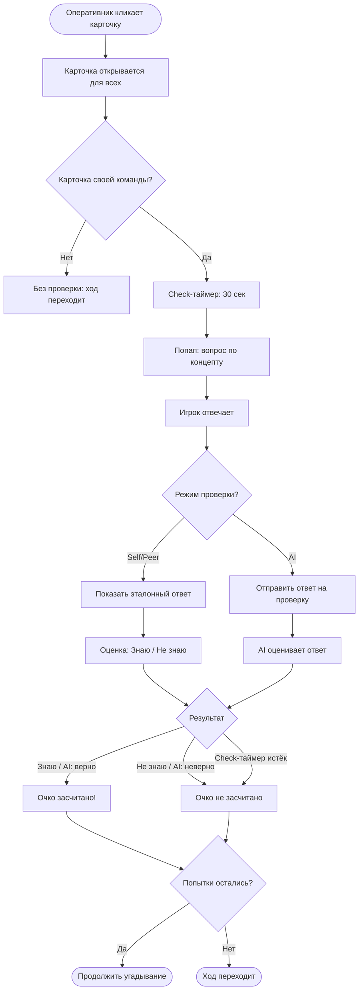
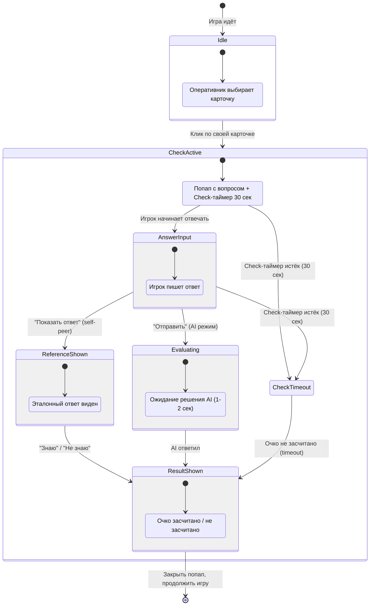
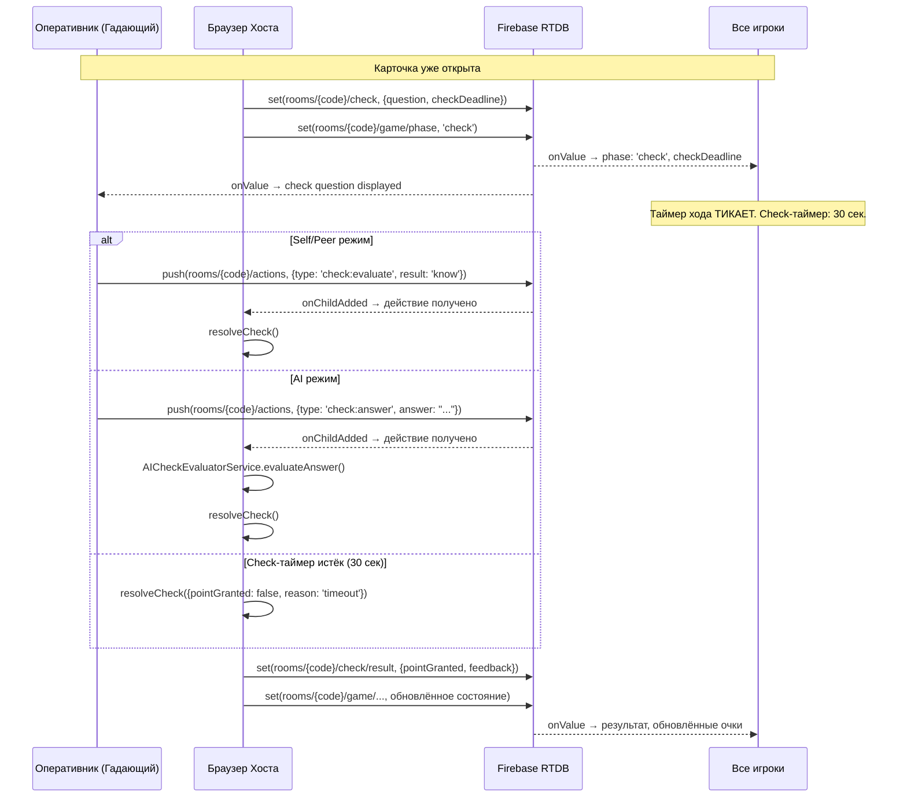

# Check Phase: Проверка знаний (Вариант B — Firebase Host-Based)

Этот документ описывает фазу проверки знаний — уникальный образовательный компонент Codenames Interview Edition. После клика по карточке своей команды появляется попап с вопросом по выбранному JS/TS концепту. Таймер хода **продолжает тикать**, но запускается отдельный **Check-таймер на 30 секунд**.

> **Архитектура:** В Варианте B нет собственного сервера. Хост (создатель комнаты) управляет Check Phase из своего браузера. Firebase Realtime Database синхронизирует состояние между игроками. Подробнее: [README.md](./README.md).

---

## Концепция

Самый популярный вопрос на собеседованиях — "Расскажи про X". Check Phase геймифицирует этот момент: слово угадано, но очко засчитывается **только если игрок может объяснить концепт**.

**Цель:** Карточка открывается сразу (все видят, что слово "угадано"), но **очко команде засчитывается только при успешной проверке**. Это превращает Codenames из простой настольной игры в инструмент подготовки к интервью.

**Ключевое отличие от Варианта A:** Check Phase целиком управляется хостом (браузер создателя комнаты). Хост выбирает вопрос, запускает Check-таймер, обрабатывает результат и записывает итоги в Firebase. Сервера нет — вся логика на клиенте хоста.

---

## User Flow



---

## State Machine



---

## UI Layout: Попап проверки

Check-таймер: 30 сек (обратный отсчёт). Таймер хода продолжает тикать. Фон затемнён.

### Режим Self/Peer

```
┌─────────────────────────────────────────────────────────────┐
│  ░░░░░░░░░░░░░░░░░ (затемнённое поле) ░░░░░░░░░░░░░░░░░░░  │
│  ░░░                                                   ░░░  │
│  ░░░  ┌─────────────────────────────────────────────┐  ░░░  │
│  ░░░  │  Проверка знаний          ⏱ 00:27    [×]    │  ░░░  │
│  ░░░  ├─────────────────────────────────────────────┤  ░░░  │
│  ░░░  │                                             │  ░░░  │
│  ░░░  │  Слово: closure                             │  ░░░  │
│  ░░░  │                                             │  ░░░  │
│  ░░░  │  Вопрос:                                    │  ░░░  │
│  ░░░  │  Что такое замыкание? Приведите пример.     │  ░░░  │
│  ░░░  │                                             │  ░░░  │
│  ░░░  │  Ваш ответ (опционально):                   │  ░░░  │
│  ░░░  │  ┌─────────────────────────────────────┐    │  ░░░  │
│  ░░░  │  │ Замыкание - это функция, которая... │    │  ░░░  │
│  ░░░  │  └─────────────────────────────────────┘    │  ░░░  │
│  ░░░  │                                             │  ░░░  │
│  ░░░  │  [Показать ответ]                           │  ░░░  │
│  ░░░  │                                             │  ░░░  │
│  ░░░  └─────────────────────────────────────────────┘  ░░░  │
│  ░░░                                                   ░░░  │
│  ░░░░░░░░░░░░░░░░░░░░░░░░░░░░░░░░░░░░░░░░░░░░░░░░░░░░░░░  │
└─────────────────────────────────────────────────────────────┘
```

**После нажатия "Показать ответ":**

```
┌─────────────────────────────────────────────────────────┐
│  Проверка знаний                    ⏱ 00:14      [×]    │
├─────────────────────────────────────────────────────────┤
│                                                         │
│  Слово: closure                                         │
│                                                         │
│  Вопрос:                                                │
│  Что такое замыкание? Приведите пример.                 │
│                                                         │
│  Эталонный ответ:                                       │
│  ┌─────────────────────────────────────────────┐       │
│  │ Замыкание — это функция, которая запоминает │       │
│  │ переменные из внешней области видимости,     │       │
│  │ даже когда эта область уже завершила         │       │
│  │ выполнение.                                  │       │
│  │                                               │       │
│  │ Пример:                                       │       │
│  │ function counter() {                          │       │
│  │   let count = 0;                              │       │
│  │   return () => ++count;                       │       │
│  │ }                                             │       │
│  └─────────────────────────────────────────────┘       │
│                                                         │
│       [  Знаю  ✓  ]        [  Не знаю  ✗  ]           │
│                                                         │
└─────────────────────────────────────────────────────────┘
```

> **Внимание: уязвимость Peer-режима в соревновательной игре**
>
> В режиме **Peer** (когда команда соперника оценивает ответ) есть известная проблема: противники мотивированы нажать "Не знаю" **даже если ответ правильный**, чтобы не дать сопернику очко. Это рациональная стратегия в соревновательной игре.
>
> **Возможные смягчения:**
> - **Роль "Судья"** — независимый наблюдатель (ментор, зритель) оценивает ответы обеих команд
> - **Голосование обеих команд** — решение принимается, если хотя бы один из оппонентов подтвердил правильность
> - **Принять как есть** — для демо-проекта это допустимо, как в настольных играх с "честной системой"
>
> Режим выбирается при создании комнаты. Для демо и учебных целей проблема не критична.

### Режим AI

```
┌─────────────────────────────────────────────────────────┐
│  Проверка знаний (AI)                 ⏱ 00:22    [×]    │
├─────────────────────────────────────────────────────────┤
│                                                         │
│  Слово: Promise                                         │
│                                                         │
│  Вопрос:                                                │
│  В чём разница между Promise.all и Promise.allSettled? │
│                                                         │
│  Ваш ответ:                                             │
│  ┌─────────────────────────────────────────────┐       │
│  │ Promise.all реджектится при первой ошибке,  │       │
│  │ а allSettled ждёт все промисы и возвращает  │       │
│  │ массив с status: fulfilled или rejected     │       │
│  └─────────────────────────────────────────────┘       │
│                                                         │
│                     [Отправить на проверку]              │
│                                                         │
│  ─────────────────────────────────────────────────────  │
│                                                         │
│  ✓ Очко засчитано!                                     │
│  AI: "Ответ верный. Promise.all завершается при        │
│  первом reject, а Promise.allSettled ждёт все."        │
│                                                         │
│                        [OK]                              │
│                                                         │
└─────────────────────────────────────────────────────────┘
```

---

## Режимы проверки

### Self/Peer — Само/взаимооценка

Простой режим, не требующий AI.

| Шаг | Действие | Кто |
|-----|----------|-----|
| 1 | Вопрос отображается, Check-таймер (30 сек) запущен | Система (хост) |
| 2 | Игрок формулирует ответ (устно или письменно) | Игрок |
| 3 | Нажимает "Показать ответ" | Игрок |
| 4 | Эталонный ответ отображается | Система |
| 5 | Оценка: "Знаю" / "Не знаю" | Игрок или команда соперника |
| 6 | Очко засчитывается при "Знаю" | Система (хост записывает результат в Firebase) |
| 7 | Если Check-таймер истёк — очко не засчитано автоматически | Система (хост обрабатывает timeout) |

**Кто оценивает:**
- **Self** — сам игрок (честная система)
- **Peer** — команда соперника нажимает "Знаю" / "Не знаю" (соревновательный элемент)

Режим выбирается при создании комнаты в Room Settings.

### AI — Проверка через AI (мокнута)

| Шаг | Действие | Кто |
|-----|----------|-----|
| 1 | Вопрос отображается, Check-таймер (30 сек) запущен | Система (хост) |
| 2 | Игрок пишет ответ в текстовое поле | Игрок |
| 3 | Нажимает "Отправить на проверку" | Игрок |
| 4 | Ответ отправляется через Firebase, хост получает и вызывает AI | AI Mock на хосте |
| 5 | Результат: очко засчитано/нет + feedback | Система (хост записывает в Firebase) |
| 6 | Если Check-таймер истёк до ответа — очко не засчитано | Система (хост обрабатывает timeout) |

> **Мок:** Реализация через `AICheckEvaluatorService` — keyword matching с реалистичной задержкой. AI работает **в браузере хоста**. Подробнее в [ai-spymaster.md](./ai-spymaster.md).

---

## Банк вопросов: кто пишет контент

> **Это задача для ВСЕЙ команды, а не только для Зоркого Линтера (Check-Dev).**

На поле 25 слов, для каждого нужно минимум 2-4 вопроса разной сложности. Итого в банке нужно **~100 вопросов**. Один человек физически не успеет написать качественный контент за отведённое время.

### Распределение

| Кто | Кодовое имя | Кол-во вопросов | Дедлайн |
|-----|-------------|-----------------|---------|
| Великий Мёрдж (Lead) | Lead | >= 15 вопросов | Конец недели 3 |
| Тихий Сокет (Firebase-Dev) | Firebase-Dev | >= 15 вопросов | Конец недели 3 |
| Быстрый Рендер (Board-Dev) | Board-Dev | >= 15 вопросов | Конец недели 3 |
| Зоркий Линтер (Check-Dev) | Check-Dev | >= 15 вопросов | Конец недели 3 |
| Мудрый Мок (AI-Dev) | AI-Dev | >= 15 вопросов | Конец недели 3 |
| Ловкий Роутер (Lobby-Dev) | Lobby-Dev | >= 15 вопросов | Конец недели 3 |

**Итого: >= 90 вопросов от команды**, Зоркий Линтер (Check-Dev) добирает до 100+.

### Формат вопроса (JSON)

Каждый участник создаёт файл `questions-{github-username}.json`:

```json
[
  {
    "id": "closure-01-vasiliy",
    "word": "closure",
    "question": "Что такое замыкание? Приведите пример использования.",
    "referenceAnswer": "Замыкание — это функция, которая запоминает переменные из внешней области видимости, даже после завершения внешней функции. Пример: function counter() { let count = 0; return () => ++count; }",
    "difficulty": 1,
    "tags": ["scope", "functions"]
  }
]
```

### Чеклист качества вопроса

- [ ] Вопрос однозначный — нет двойного толкования
- [ ] Эталонный ответ содержит ключевые слова для AI-проверки
- [ ] Сложность адекватна (1 — базовый, 2 — средний, 3 — продвинутый)
- [ ] Есть хотя бы один пример кода в referenceAnswer (для сложности 2-3)
- [ ] Вопрос реально встречается на собеседованиях
- [ ] Нет опечаток и грамматических ошибок

### Peer Review контента

**Зоркий Линтер (Check-Dev)** выполняет peer review ВСЕХ вопросов:
- Проверяет по чеклисту качества
- Объединяет в единый `question-bank.json`
- Добавляет fallback-вопросы для слов без покрытия
- Финальный мёрж — до конца недели 4

---

## Question Bank (Банк вопросов)

### Структура данных

```typescript
interface QuestionBank {
  [word: string]: CheckQuestion[];  // Несколько вопросов на слово
}

interface CheckQuestion {
  id: string;
  word: string;                    // JS/TS концепт
  question: string;                // Текст вопроса
  referenceAnswer: string;         // Эталонный ответ
  difficulty: 1 | 2 | 3;
  tags: string[];
}
```

### Правило выбора вопроса

```typescript
// Используется хостом при запуске Check Phase
function selectQuestion(word: string, bank: QuestionBank): CheckQuestion {
  const questions = bank[word];
  if (!questions || questions.length === 0) {
    // Fallback: базовый вопрос
    return {
      id: `fallback-${word}`,
      word,
      question: `Объясните концепт "${word}" своими словами.`,
      referenceAnswer: `Ожидается объяснение ${word} с примером.`,
      difficulty: 1,
      tags: [],
    };
  }
  // Случайный вопрос из доступных
  return questions[Math.floor(Math.random() * questions.length)];
}
```

### Примеры вопросов (10+ концептов)

| Слово | Вопрос | Сложность |
|-------|--------|-----------|
| closure | Что такое замыкание? Приведите пример. | 1 |
| closure | Как замыкания могут приводить к утечкам памяти? | 3 |
| Promise | В чём разница между Promise.all и Promise.allSettled? | 2 |
| Promise | Что произойдет, если в then бросить ошибку? | 2 |
| hoisting | Как работает hoisting для let vs var? | 1 |
| hoisting | Почему TDZ (Temporal Dead Zone) существует для let/const? | 3 |
| prototype | Как работает цепочка прототипов? | 2 |
| prototype | В чём разница между `__proto__` и `prototype`? | 3 |
| event loop | В каком порядке выполняются microtask и macrotask? | 2 |
| event loop | Что произойдёт, если microtask добавит ещё один microtask? | 3 |
| this | Как определяется значение this в arrow function? | 2 |
| this | Назовите 4 правила определения this. | 2 |
| localStorage | В чём отличие от sessionStorage? | 1 |
| localStorage | Какой лимит объёма данных? Что будет при превышении? | 2 |
| WeakMap | Когда использовать WeakMap вместо Map? | 3 |
| generics | Зачем нужны дженерики в TypeScript? Приведите пример. | 2 |
| async/await | Чем async/await лучше цепочки .then()? | 1 |
| async/await | Как обработать ошибку в async функции? | 2 |
| Proxy | Для чего используется Proxy в JavaScript? | 3 |
| Symbol | Зачем нужны символы? Приведите use case. | 3 |
| spread | Делает ли spread глубокое копирование? | 2 |
| Map | В чём отличие Map от обычного объекта? | 2 |

---

## Интеграция с игровым процессом

### Когда срабатывает Check Phase

В Варианте B вся игровая логика работает **в браузере хоста**. Хост подписан на `rooms/{code}/actions` через `onChildAdded` и обрабатывает каждое действие игрока через `GameStateMachine`. Результаты записываются обратно в Firebase.

```typescript
// В host/state-machine.ts — на браузере хоста
function handleGuess(game: Game, cardId: string, playerId: string) {
  const card = game.board.find(c => c.id === cardId);
  card.status = 'revealed';

  if (card.color === game.currentTurn) {
    // Своя карточка — запускаем Check Phase
    game.currentPhase = 'check';
    game.checkPlayerId = playerId;

    // Хост выбирает вопрос из банка
    const question = selectQuestion(card.word, questionBank);
    const checkDeadline = Date.now() + 30_000;

    // Хост пишет Check-данные в Firebase
    set(ref(db, `rooms/${code}/check`), {
      playerId,
      question: {
        id: question.id,
        word: question.word,
        question: question.question,
        // ВАЖНО: referenceAnswer НЕ пишется в Firebase!
        // Игрок не должен видеть эталонный ответ до нажатия "Показать ответ".
        // referenceAnswer хранится только в памяти хоста.
      },
      checkDeadline,
      status: 'pending',
    });

    // Хост обновляет фазу игры в Firebase
    set(ref(db, `rooms/${code}/game/phase`), 'check');

    // Хост запускает локальный Check-таймер
    setTimeout(() => {
      if (game.currentPhase === 'check') {
        resolveCheck(game, { pointGranted: false, reason: 'timeout' });
      }
    }, 30_000);
  }
}
```

### Обработка результата на хосте

```typescript
// В host/state-machine.ts — обработка действий игрока
function handleCheckAction(game: Game, action: PlayerAction) {
  if (action.type === 'check:evaluate') {
    // Self/Peer режим: игрок нажал "Знаю" или "Не знаю"
    const pointGranted = action.payload.result === 'know';
    resolveCheck(game, {
      pointGranted,
      reason: pointGranted ? 'self-confirmed' : 'self-denied',
    });
  }

  if (action.type === 'check:answer') {
    // AI режим: игрок отправил текстовый ответ
    // AI работает в браузере хоста (мок)
    const aiResult = AICheckEvaluatorService.evaluateAnswer({
      question: game.currentCheckQuestion,
      playerAnswer: action.payload.answer,
    });

    setTimeout(() => {
      resolveCheck(game, {
        pointGranted: aiResult.isCorrect,
        reason: aiResult.isCorrect ? 'ai-approved' : 'ai-denied',
        feedback: aiResult.feedback,
      });
    }, aiResult.mockDelay);
  }
}

// Запись результата Check Phase в Firebase
function resolveCheck(game: Game, result: CheckResult) {
  game.currentPhase = 'guess';

  if (result.pointGranted) {
    game.scores[game.currentTurn]++;
  }

  // Результат Check — в Firebase
  set(ref(db, `rooms/${code}/check/result`), {
    pointGranted: result.pointGranted,
    reason: result.reason,
    feedback: result.feedback ?? null,
  });

  // Обновлённое состояние игры — в Firebase
  set(ref(db, `rooms/${code}/game`), serializeGameState(game));
}
```

---

## Firebase-события Check Phase



### Firebase-пути для Check Phase

| Путь в Firebase | Кто пишет | Что содержит |
|-----------------|-----------|--------------|
| `rooms/{code}/check` | Хост | Текущая Check-сессия: playerId, question, checkDeadline, status |
| `rooms/{code}/check/result` | Хост | Результат: pointGranted, reason, feedback |
| `rooms/{code}/game/phase` | Хост | Текущая фаза: `'check'` / `'guess'` / `'clue'` |
| `rooms/{code}/game/scores` | Хост | Обновлённые очки команд |
| `rooms/{code}/actions/{pushId}` | Игрок | Действие: `check:evaluate` или `check:answer` |

> **Безопасность:** `referenceAnswer` **никогда не записывается** в Firebase до запроса. Он хранится только в памяти хоста. Если записать referenceAnswer в `rooms/{code}/check`, любой игрок прочитает его через `onValue`.

### Сравнение с Вариантом A (WebSocket)

| Аспект | Вариант A (WebSocket) | Вариант B (Firebase) |
|--------|----------------------|---------------------|
| Кто выбирает вопрос | Сервер | Хост (браузер) |
| Кто запускает Check-таймер | Сервер | Хост (setTimeout) |
| Как игрок отправляет ответ | `ws.emit('check:evaluate')` | `push(actions, {type: 'check:evaluate'})` |
| Как приходит вопрос | `ws.on('check:question')` | `onValue(rooms/{code}/check)` |
| Как приходит результат | `ws.on('check:result')` | `onValue(rooms/{code}/check/result)` |
| referenceAnswer | На сервере (память) | На хосте (память браузера) |
| Отказоустойчивость | Сервер стабилен | Хост закрыл вкладку = Game Over |

---

## Поведение таймера

| Событие | Таймер хода (2 мин) | Check-таймер (30 сек) |
|---------|---------------------|------------------------|
| Check начинается | **ТИКАЕТ ВСЕГДА** | Старт: 30 сек обратный отсчёт |
| Игрок отвечает | ТИКАЕТ | — |
| Check завершается (ответ дан) | ТИКАЕТ | Стоп, очищается |
| Check timeout (30 сек истекли) | ТИКАЕТ | Очко **не засчитано**, игра продолжается |
| Таймер хода истёк | Ход переходит | Сбрасывается (если был активен) |

> **Важно:** Таймер хода (2 мин) **никогда не ставится на паузу**. Check-таймер — это отдельный, независимый обратный отсчёт. Это создаёт давление: игрок не может бесконечно думать над вопросом, и время хода тоже утекает.

```typescript
// Клиент: подписка на Check Phase через Firebase
import { ref, onValue } from 'firebase/database';

onValue(ref(db, `rooms/${code}/game/phase`), (snapshot) => {
  const phase = snapshot.val();
  if (phase === 'check') {
    onValue(ref(db, `rooms/${code}/check`), (checkSnap) => {
      const checkData = checkSnap.val();
      if (checkData && checkData.playerId === currentUserId) {
        // Этот игрок должен отвечать — показываем попап
        showCheckPopup(checkData.question, checkData.checkDeadline);
      } else {
        // Остальные видят уведомление "Идёт проверка..."
        showCheckNotification(checkData.checkDeadline);
      }
    }, { onlyOnce: true });
  }
});

// Показ попапа с Check-таймером
function showCheckPopup(question: CheckQuestion, checkDeadline: number): void {
  overlay.classList.add('active');
  popup.innerHTML = renderCheckPopup(question, roomSettings.checkMode);
  startCheckCountdown(checkDeadline);
}

// Закрытие попапа
function closeCheckPopup(result: CheckResult): void {
  clearCheckTimer();
  showResultAnimation(result.pointGranted);

  setTimeout(() => {
    overlay.classList.remove('active');
    popup.innerHTML = '';
    // Счёт обновится автоматически через onValue
  }, 1000);
}
```

### Отправка ответа через Firebase

```typescript
import { ref, push } from 'firebase/database';

// Self/Peer режим: игрок нажимает "Знаю" или "Не знаю"
function submitCheckEvaluation(result: 'know' | 'dont-know'): void {
  push(ref(db, `rooms/${code}/actions`), {
    type: 'check:evaluate',
    playerId: currentUserId,
    payload: { result },
    timestamp: Date.now(),
  });
}

// AI режим: игрок отправляет текстовый ответ
function submitCheckAnswer(answer: string): void {
  push(ref(db, `rooms/${code}/actions`), {
    type: 'check:answer',
    playerId: currentUserId,
    payload: { answer },
    timestamp: Date.now(),
  });
}
```

---

## Реализация попапа

### HTML структура

```html
<!-- Overlay -->
<div class="check-overlay" id="check-overlay">
  <div class="check-popup" role="dialog" aria-modal="true" aria-label="Проверка знаний">

    <header class="check-popup__header">
      <h2>Проверка знаний</h2>
      <div class="check-popup__timer" id="check-timer">⏱ 00:30</div>
      <span class="check-popup__mode-badge">Self/Peer</span>
    </header>

    <div class="check-popup__body">
      <div class="check-popup__word">
        Слово: <strong id="check-word"></strong>
      </div>

      <div class="check-popup__question">
        <p id="check-question-text"></p>
      </div>

      <!-- Поле ввода (для AI режима — обязательное, для Self/Peer — опциональное) -->
      <div class="check-popup__answer-input">
        <textarea id="check-answer" placeholder="Ваш ответ..."></textarea>
      </div>

      <!-- Self/Peer: кнопка "Показать ответ" -->
      <div class="check-popup__reference" id="check-reference" hidden>
        <h3>Эталонный ответ:</h3>
        <p id="check-reference-text"></p>
      </div>
    </div>

    <footer class="check-popup__footer" id="check-actions">
      <!-- Кнопки зависят от режима и шага -->
    </footer>

  </div>
</div>
```

### CSS для модального окна

```css
.check-overlay {
  position: fixed;
  inset: 0;
  background: rgba(0, 0, 0, 0.6);
  backdrop-filter: blur(4px);
  display: none;
  align-items: center;
  justify-content: center;
  z-index: 1000;
}

.check-overlay.active { display: flex; }

.check-popup {
  background: var(--bg-primary);
  border-radius: 16px;
  box-shadow: 0 20px 60px rgba(0, 0, 0, 0.3);
  max-width: 520px;
  width: 90%;
  max-height: 80vh;
  overflow-y: auto;
  animation: popupEnter 0.3s ease-out;
}

@keyframes popupEnter {
  from { opacity: 0; transform: scale(0.9) translateY(20px); }
  to { opacity: 1; transform: scale(1) translateY(0); }
}

.check-popup__header {
  display: flex;
  align-items: center;
  gap: 12px;
  padding: 16px 24px;
  border-bottom: 1px solid var(--border-color);
}

.check-popup__timer {
  font-size: 18px;
  font-weight: 700;
  font-variant-numeric: tabular-nums;
  color: var(--accent-color);
}

.check-popup__timer.warning {
  color: #f44336;
  animation: timerPulse 1s infinite;
}

@keyframes timerPulse {
  0%, 100% { opacity: 1; }
  50% { opacity: 0.5; }
}

.check-popup__word { font-size: 18px; padding: 16px 24px; }
.check-popup__word strong { color: var(--accent-color); font-size: 22px; }
.check-popup__question { padding: 16px 24px; font-size: 16px; line-height: 1.5; }

.check-popup__answer-input textarea {
  width: 100%;
  min-height: 80px;
  padding: 12px;
  border: 2px solid var(--border-color);
  border-radius: 8px;
  font-size: 14px;
  resize: vertical;
  margin: 0 24px;
  box-sizing: border-box;
}

.check-popup__reference {
  background: var(--bg-secondary);
  margin: 0 24px;
  padding: 16px;
  border-radius: 8px;
  border-left: 4px solid var(--accent-color);
}

.check-popup__footer { display: flex; gap: 12px; padding: 16px 24px; justify-content: center; }

.btn-know { background: #4caf50; color: white; padding: 12px 32px; border-radius: 8px; font-weight: 600; }
.btn-dont-know { background: #f44336; color: white; padding: 12px 32px; border-radius: 8px; font-weight: 600; }

.check-result { text-align: center; padding: 24px; font-size: 20px; font-weight: 600; }
.check-result.granted { color: #4caf50; }
.check-result.denied { color: #f44336; }
```

---

## Эстимейт: Check Phase

| Задача | Min | Max | Avg | Кто | Примечание |
|--------|-----|-----|-----|-----|------------|
| Popup UI (HTML/CSS, модальное окно, overlay) | 3ч | 5ч | 4ч | Зоркий Линтер (Check-Dev) | Анимация входа/выхода |
| Self/Peer evaluation flow | 3ч | 6ч | 4.5ч | Зоркий Линтер (Check-Dev) | "Показать ответ" -> оценка |
| AI evaluation flow (мок-интеграция) | 3ч | 5ч | 4ч | Зоркий Линтер (Check-Dev) | Подключение к AICheckEvaluator на хосте |
| Question Bank: структура + 20 вопросов | 3ч | 6ч | 4.5ч | Зоркий Линтер (Check-Dev) | Начальный контент |
| Check-таймер (30 сек) интеграция | 2ч | 4ч | 3ч | Зоркий Линтер + Тихий Сокет | Отдельный таймер, checkDeadline в Firebase |
| Firebase-интеграция (пути, onValue, push) | 2ч | 4ч | 3ч | Зоркий Линтер (Check-Dev) | rooms/{code}/check, rooms/{code}/actions |
| Анимации (popup enter/exit, результат) | 1ч | 3ч | 2ч | Зоркий Линтер (Check-Dev) | CSS transitions |
| Банк вопросов: сбор от команды (90+) | 4ч | 8ч | 6ч | ВСЯ КОМАНДА | Каждый >= 15 вопросов |
| Peer review вопросов + мёрж | 2ч | 4ч | 3ч | Зоркий Линтер (Check-Dev) | Проверка по чеклисту |
| **Итого** | **23ч** | **45ч** | **34ч** | | |

> **Примечание:** Основная сложность — координация с хостом. Попап должен корректно блокировать взаимодействие с полем и закрываться по истечении Check-таймера (30 сек). Таймер хода при этом **продолжает тикать**. В Firebase нельзя записывать `referenceAnswer` — иначе любой игрок прочитает его через `onValue`. Тестируйте edge cases: что если Check-таймер истёк? Что если таймер хода истёк во время Check? Что если хост закрыл вкладку во время Check?

---

## Типичные ошибки

### 1. Попап не блокирует клики по полю

```typescript
// Плохо: игрок кликает по полю пока попап открыт
function onCardClick(cardId: string) {
  push(ref(db, `rooms/${code}/actions`), { type: 'guess', payload: { cardId } });
}

// Хорошо: проверяем фазу перед отправкой
function onCardClick(cardId: string) {
  if (gameState.currentPhase === 'check') return;
  if (!canGuess(currentUserId, gameState)) return;
  push(ref(db, `rooms/${code}/actions`), { type: 'guess', payload: { cardId } });
}
```

### 2. Нет отдельного Check-таймера

```typescript
// Плохо: надеемся, что игрок сам нажмёт кнопку.
// Нет ограничения по времени — игрок может думать вечно.

// Хорошо: хост запускает Check-таймер (30 сек)
const checkDeadline = Date.now() + 30_000;
set(ref(db, `rooms/${code}/check`), { ...checkData, checkDeadline });

setTimeout(() => {
  if (game.currentPhase === 'check') {
    resolveCheck(game, { pointGranted: false, reason: 'timeout' });
  }
}, 30_000);
// Таймер хода при этом ПРОДОЛЖАЕТ тикать
```

### 3. Вопрос отображается всем игрокам без разграничения

```typescript
// Плохо: всем показываем одинаковый попап с полем ввода

// Хорошо: текстовое поле ответа показываем ТОЛЬКО оперативнику
onValue(ref(db, `rooms/${code}/check`), (snapshot) => {
  const checkData = snapshot.val();
  if (checkData.playerId === currentUserId) {
    showCheckPopup(checkData.question, checkData.checkDeadline);
  } else {
    showCheckNotification(checkData.checkDeadline);
  }
});
```

### 4. Нет fallback-вопроса

```typescript
// Плохо: для слова нет вопросов — crash
const question = questionBank[word][0]; // undefined!

// Хорошо: fallback
const questions = questionBank[word];
const question = questions?.length
  ? questions[Math.floor(Math.random() * questions.length)]
  : createFallbackQuestion(word);
```

### 5. referenceAnswer записан в Firebase (специфика Варианта B)

```typescript
// КРИТИЧЕСКАЯ ОШИБКА: referenceAnswer записан в путь, видимый всем
set(ref(db, `rooms/${code}/check`), {
  playerId,
  question: {
    id: question.id,
    word: question.word,
    question: question.question,
    referenceAnswer: question.referenceAnswer, // ВСЕ прочитают через onValue!
  },
  checkDeadline,
  status: 'pending',
});

// Хорошо: referenceAnswer хранится ТОЛЬКО в памяти хоста
set(ref(db, `rooms/${code}/check`), {
  playerId,
  question: {
    id: question.id,
    word: question.word,
    question: question.question,
    // referenceAnswer НЕ записываем в Firebase
  },
  checkDeadline,
  status: 'pending',
});
```

> **Почему это критично:** В Firebase Realtime Database все данные по пути `rooms/{code}/check` доступны каждому подписчику через `onValue`. В отличие от WebSocket (Вариант A), где сервер может отправить данные конкретному игроку (`sendToPlayer`), Firebase не имеет такой гранулярности. Поэтому `referenceAnswer` **никогда** не должен попадать в общедоступный путь до запроса "Показать ответ".

### Как показать referenceAnswer в Self/Peer режиме

```typescript
// Игрок нажимает "Показать ответ" — отправляет действие через Firebase
function requestReferenceAnswer(): void {
  push(ref(db, `rooms/${code}/actions`), {
    type: 'check:show-reference',
    playerId: currentUserId,
    timestamp: Date.now(),
  });
}

// Хост получает действие и записывает referenceAnswer
function handleShowReference(game: Game, action: PlayerAction) {
  if (action.type === 'check:show-reference') {
    const question = game.currentCheckQuestion;
    // Записываем — игрок УЖЕ попросил показать ответ
    set(ref(db, `rooms/${code}/check/referenceAnswer`), question.referenceAnswer);
  }
}

// Клиент подписан на появление referenceAnswer
onValue(ref(db, `rooms/${code}/check/referenceAnswer`), (snapshot) => {
  const answer = snapshot.val();
  if (answer) {
    showReferenceAnswer(answer);
    showEvaluationButtons(); // "Знаю" / "Не знаю"
  }
});
```

---

## Итого

Check Phase — главная образовательная механика Codenames Interview Edition. В Варианте B (Firebase Host-Based) вся логика проверки работает в браузере хоста:

1. **Хост выбирает вопрос** из банка и записывает в `rooms/{code}/check`
2. **Игрок видит попап** через подписку `onValue`
3. **Игрок отвечает** через `push` в `rooms/{code}/actions`
4. **Хост обрабатывает ответ** (self/peer/AI) и записывает результат
5. **Все игроки видят результат** через `onValue`

Ключевые правила:
- **Таймер хода НИКОГДА не ставится на паузу** во время Check Phase
- **Check-таймер: 30 секунд** — отдельный, независимый обратный отсчёт
- **referenceAnswer НЕ записывается в Firebase** до запроса игрока
- **Каждый член команды пишет >= 15 вопросов** (итого >= 90 от команды)
- **Зоркий Линтер (Check-Dev)** — ответственный за попап, flow и peer review контента
- **Тихий Сокет (Firebase-Dev)** — помогает с Firebase-путями и Security Rules
