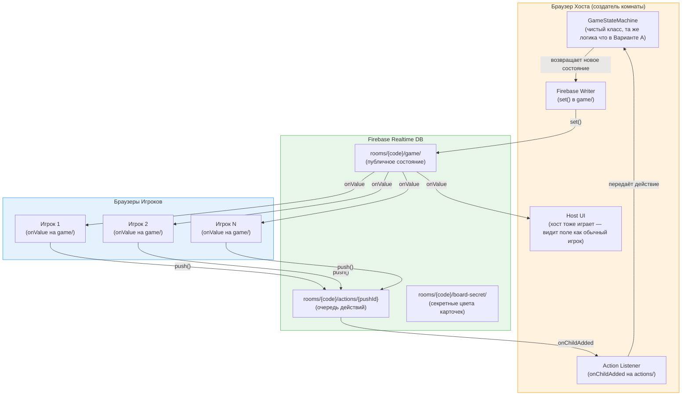
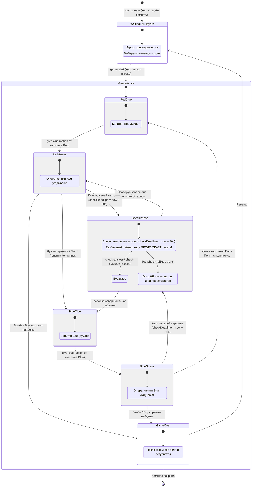
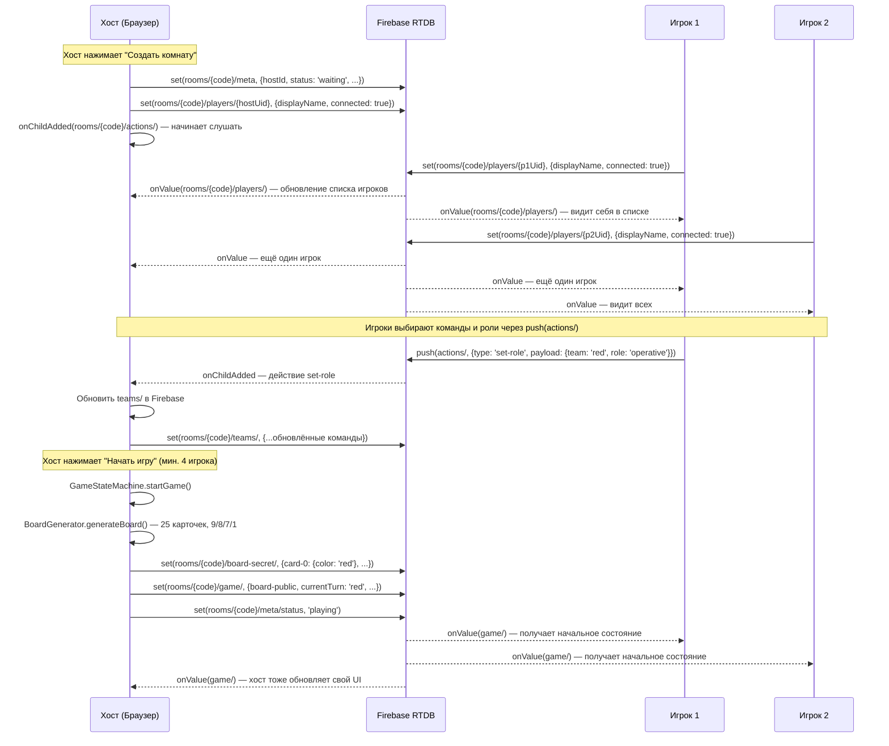
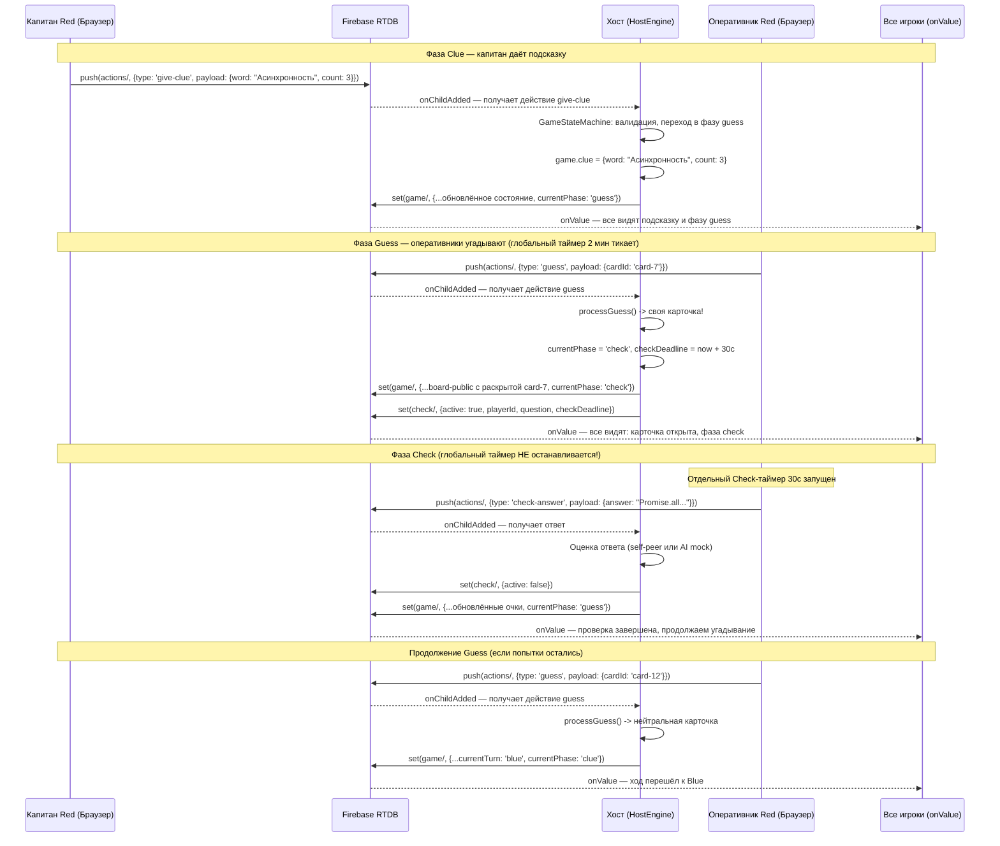
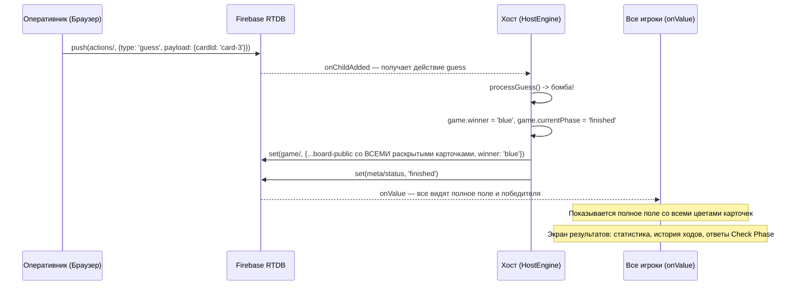
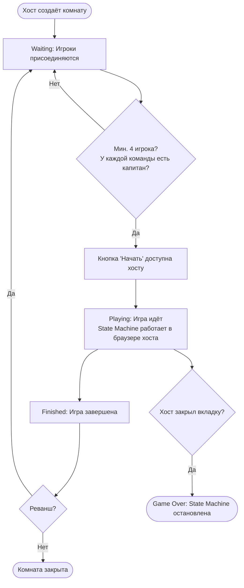
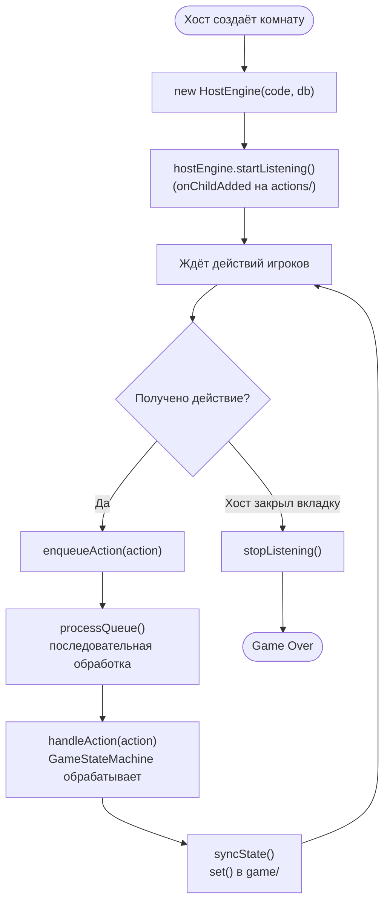
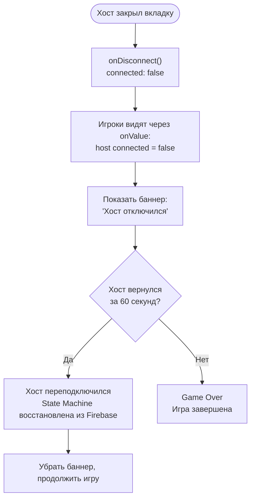

# Game Engine: Host-Based State Machine на Firebase

Этот документ описывает архитектуру игрового движка Codenames для **Варианта B** — браузер создателя комнаты (Host) запускает `GameStateMachine`, а Firebase Realtime Database синхронизирует состояние между всеми игроками.

> **Ключевое отличие от Варианта A:** В Варианте A State Machine работает на Node.js сервере (WS). В Варианте B State Machine работает **в браузере хоста**. Класс `GameStateMachine` — тот же самый чистый класс без зависимостей от транспорта. Меняется только обёртка: вместо WS Handler — `HostEngine` (слушает Firebase `actions/`), вместо WS Client — `ClientEngine` (слушает Firebase `game/`).

---

## 1. Концепция

Game Engine в Варианте B — это **Host Authority Model**:

1. **Хост (Host)** — игрок, создавший комнату. Его браузер запускает `GameStateMachine` — чистый класс, управляющий всеми переходами состояний игры
2. **Хост подписан** на `rooms/{code}/actions/` через `onChildAdded` — получает действия всех игроков
3. **Хост обрабатывает** каждое действие через `GameStateMachine` (валидация, переходы, подсчёт очков)
4. **Хост записывает** обновлённое состояние в `rooms/{code}/game/` через `set()`
5. **Все клиенты** (включая хоста) подписаны на `rooms/{code}/game/` через `onValue` — получают обновления автоматически
6. **Firebase Security Rules** гарантируют, что только хост может писать в `game/` и читать `board-secret/`

**Хост закрыл вкладку = Game Over.** Для учебного проекта это допустимо. Подробнее об обработке отключения хоста — в разделе [Presence System](#16-presence-system-онлайн-статус-и-обнаружение-отключения-хоста).

> **Почему это работает:** `GameStateMachine` — чистый класс без побочных эффектов. Ему всё равно, где он запускается — на сервере или в браузере. Вся игровая логика (фазы, переходы, подсчёт очков, проверка победы) инкапсулирована внутри. Транспортный слой (Firebase vs WebSocket) — это просто обёртка, которая передаёт действия на вход и забирает состояние на выход.

---

## 2. Архитектура

### Общая схема



### Компоненты на стороне хоста

| Компонент          | Ответственный              | Описание                                                                    |
| ------------------ | -------------------------- | --------------------------------------------------------------------------- |
| `GameStateMachine` | Тихий Сокет (Firebase-Dev) | Чистый класс: переходы состояний, processGuess, подсчёт очков               |
| `HostEngine`       | Тихий Сокет (Firebase-Dev) | Обёртка: слушает `actions/`, прогоняет через State Machine, пишет в `game/` |
| `BoardGenerator`   | Тихий Сокет (Firebase-Dev) | Генерация 25 карточек, Fisher-Yates shuffle, распределение цветов 9/8/7/1   |
| `ActionQueue`      | Тихий Сокет (Firebase-Dev) | Очередь обработки действий (предотвращение race conditions)                 |

### Компоненты на стороне клиента

| Компонент      | Ответственный              | Описание                                                       |
| -------------- | -------------------------- | -------------------------------------------------------------- |
| `ClientEngine` | Быстрый Рендер (Board-Dev) | Обёртка: подписка на `game/`, отправка действий через `push()` |
| `BoardUI`      | Быстрый Рендер (Board-Dev) | Игровое поле 5x5, карточки, анимации                           |
| `TurnUI`       | Быстрый Рендер (Board-Dev) | Индикатор хода, подсказка, таймер                              |
| `CheckUI`      | Зоркий Линтер (Check-Dev)  | Попап проверки знаний, Check-таймер                            |
| `ScoreUI`      | Быстрый Рендер (Board-Dev) | Счёт команд, оставшиеся карточки                               |

### Сравнение с Вариантом A

| Аспект                     | Вариант A (WS Server)                  | Вариант B (Firebase Host)                      |
| -------------------------- | -------------------------------------- | ---------------------------------------------- |
| Где работает State Machine | Node.js сервер                         | Браузер хоста                                  |
| Транспорт команд           | `socket.emit()`                        | `push()` в Firebase                            |
| Получение состояния        | `socket.on()`                          | `onValue()` из Firebase                        |
| Авторитет                  | Сервер — единственный источник правды  | Хост — единственный источник правды            |
| Устойчивость               | Сервер работает 24/7                   | Хост закрыл вкладку = Game Over                |
| Задержка                   | ~50-100мс (WS)                         | ~100-300мс (Firebase RTDB)                     |
| Настройка                  | Node.js + Express + Socket.IO + Render | Firebase Free Tier (нулевая настройка сервера) |

---

## 3. Серверная (Host) State Machine

Хост — единственный источник правды. Все переходы состояний происходят только в браузере хоста. Клиенты получают обновления через `onValue`.

### Диаграмма состояний



### Правила перехода ходов

| Событие                         | Текущая фаза     | Переход                                                          |
| ------------------------------- | ---------------- | ---------------------------------------------------------------- |
| Клик по своей карточке          | `guess`          | `check` (запуск Check-таймера 30с, глобальный таймер продолжает) |
| Клик по нейтральной карточке    | `guess`          | Смена хода на другую команду                                     |
| Клик по карточке соперника      | `guess`          | Смена хода + соперник получает "раскрытие"                       |
| Клик по бомбе                   | `guess`          | `finished` (мгновенный проигрыш)                                 |
| Пас / Попытки кончились         | `guess`          | Смена хода на другую команду                                     |
| Все карточки команды найдены    | `guess`          | `finished` (победа)                                              |
| Check-таймер истёк (30с)        | `check`          | Возврат в `guess` (очко не начисляется)                          |
| Ответ на вопрос оценён          | `check`          | Возврат в `guess` или смена хода                                 |
| Глобальный таймер истёк (2 мин) | `clue` / `guess` | Смена хода на другую команду                                     |

---

## 4. Функция processGuess

Чистая функция, одинаковая для обоих вариантов. Не зависит ни от Firebase, ни от WebSocket. Может быть протестирована юнит-тестами без поднятия инфраструктуры.

```typescript
// src/shared/game-logic.ts
// Чистая функция — без побочных эффектов, без зависимостей от Firebase

function processGuess(
  game: Game,
  cardId: string,
  playerId: string,
): GuessResult {
  const card = game.board.find((c) => c.id === cardId);
  if (!card || card.status === "revealed") {
    return { error: "INVALID_CARD" };
  }

  // Открываем карточку
  card.status = "revealed";

  const currentTeam = game.currentTurn;

  if (card.color === "bomb") {
    // Бомба -> мгновенный проигрыш текущей команды
    game.winner = currentTeam === "red" ? "blue" : "red";
    game.currentPhase = "finished";
    return { action: "game-over", reason: "bomb" };
  }

  if (card.color === currentTeam) {
    // Своя карточка -> фаза Check (глобальный таймер НЕ останавливается!)
    game.currentPhase = "check";
    game.teams[currentTeam].cardsLeft--;

    // Проверяем победу (все карточки команды найдены)
    if (game.teams[currentTeam].cardsLeft === 0) {
      return { action: "check-then-win" };
    }

    game.guessesRemaining--;
    return { action: "check", cardId };
  }

  if (card.color === "neutral") {
    // Нейтральная -> ход переходит к другой команде
    return { action: "end-turn", reason: "neutral" };
  }

  // Карточка соперника -> ход переходит, соперник получает раскрытие
  const opponent = currentTeam === "red" ? "blue" : "red";
  game.teams[opponent].cardsLeft--;

  if (game.teams[opponent].cardsLeft === 0) {
    // Все карточки соперника найдены -> соперник побеждает
    game.winner = opponent;
    game.currentPhase = "finished";
    return { action: "game-over", reason: "opponent-complete" };
  }

  return { action: "end-turn", reason: "opponent-card" };
}
```

### Типы результата

```typescript
// src/shared/types.ts

type GuessResult =
  | { error: "INVALID_CARD" }
  | { action: "game-over"; reason: "bomb" | "opponent-complete" }
  | { action: "check"; cardId: string }
  | { action: "check-then-win" }
  | { action: "end-turn"; reason: "neutral" | "opponent-card" };
```

> **Примечание:** Функция `processGuess` мутирует объект `game` напрямую. Это допустимо, потому что хост работает с единственным экземпляром состояния. Если нужна иммутабельность (например, для Redux DevTools), можно обернуть в `structuredClone(game)` перед вызовом.

---

## 5. Firebase: Диаграммы взаимодействия

### Создание комнаты и начало игры



### Ход игры: Подсказка -> Угадывание -> Проверка



### Окончание игры



---

## 6. Room Management

### Жизненный цикл комнаты



### Генерация кода комнаты

```typescript
// src/shared/room-utils.ts
// Генерация уникального кода — одинаково для обоих вариантов

function generateRoomCode(): string {
  const adjectives = [
    "js",
    "ts",
    "react",
    "node",
    "algo",
    "css",
    "html",
    "git",
  ];
  const nouns = [
    "masters",
    "ninjas",
    "pros",
    "devs",
    "coders",
    "wizards",
    "gurus",
    "hackers",
  ];
  const num = Math.floor(Math.random() * 99)
    .toString()
    .padStart(2, "0");
  const adj = adjectives[Math.floor(Math.random() * adjectives.length)];
  const noun = nouns[Math.floor(Math.random() * nouns.length)];
  return `${adj}-${noun}-${num}`;
}

// Примеры: "js-masters-42", "ts-wizards-07", "react-ninjas-13"
```

### Генерация игрового поля

```typescript
// src/shared/board-generator.ts
// Чистая функция — используется хостом при старте игры

function generateBoard(wordBank: WordEntry[]): Card[] {
  // 1. Перемешиваем и берём 25 слов
  const shuffled = shuffle([...wordBank]);
  const words = shuffled.slice(0, 25);

  // 2. Распределяем цвета: 9 red, 8 blue, 7 neutral, 1 bomb
  // Red ходит первой, поэтому у Red на 1 карточку больше
  const colors: CardColor[] = [
    ...Array(9).fill("red" as CardColor),
    ...Array(8).fill("blue" as CardColor),
    ...Array(7).fill("neutral" as CardColor),
    "bomb" as CardColor,
  ];
  const shuffledColors = shuffle(colors);

  // 3. Создаём карточки
  return words.map((entry, i) => ({
    id: `card-${i}`,
    word: entry.word,
    color: shuffledColors[i], // Секретный цвет — ТОЛЬКО для хоста!
    status: "hidden" as CardStatus,
    position: i,
  }));
}

// Fisher-Yates shuffle — криптографически не нужен, но честный рандом
function shuffle<T>(array: T[]): T[] {
  for (let i = array.length - 1; i > 0; i--) {
    const j = Math.floor(Math.random() * (i + 1));
    [array[i], array[j]] = [array[j], array[i]];
  }
  return array;
}
```

### Создание комнаты хостом

```typescript
// src/host/room-creator.ts
import { set, ref } from "firebase/database";
import { db, auth } from "../firebase/config";
import { generateRoomCode } from "../shared/room-utils";
import { generateBoard } from "../shared/board-generator";

async function createRoom(settings: RoomSettings): Promise<string> {
  const user = auth.currentUser;
  if (!user) throw new Error("AUTH_REQUIRED");

  const code = generateRoomCode();

  // Записываем метаданные комнаты
  await set(ref(db, `rooms/${code}/meta`), {
    code,
    hostId: user.uid, // Хост = создатель комнаты = владелец State Machine
    status: "waiting",
    settings,
    createdAt: Date.now(),
  });

  // Добавляем хоста как игрока
  await set(ref(db, `rooms/${code}/players/${user.uid}`), {
    displayName: user.displayName || "Хост",
    team: null,
    role: null,
    connected: true,
    lastSeen: Date.now(),
  });

  return code;
}
```

---

## 7. Фильтрация состояния: Host vs Players

> **Критически важно:** Хост НИКОГДА не записывает цвета скрытых карточек в `rooms/{code}/game/board-public/`. Нарушение этого правила позволит любому игроку открыть DevTools и увидеть ответы. Firebase Security Rules — вторая линия защиты, но первая линия — это правильная запись данных хостом.

### Три уровня доступа к данным

```
+-------------------------------------------------------------------+
|                     Firebase Realtime DB                           |
|                                                                   |
|  rooms/{code}/                                                    |
|  ├── board-secret/         <- ТОЛЬКО хост может читать/писать     |
|  │   ├── card-0: { color: 'red' }                                |
|  │   ├── card-1: { color: 'blue' }                               |
|  │   └── ...                                                      |
|  │                                                                |
|  ├── game/                 <- Все могут читать, ТОЛЬКО хост пишет |
|  │   ├── board-public/                                            |
|  │   │   ├── card-0: { word: 'closure', status: 'hidden',        |
|  │   │   │              color: null }    <- null! Цвет скрыт      |
|  │   │   ├── card-1: { word: 'Promise', status: 'revealed',      |
|  │   │   │              color: 'red' }   <- Раскрыта = цвет виден |
|  │   │   └── ...                                                  |
|  │   ├── currentTurn: 'red'                                       |
|  │   ├── currentPhase: 'guess'                                    |
|  │   └── ...                                                      |
|  │                                                                |
|  └── spymaster-view/       <- Опциональный узел для капитанов     |
|      ├── red/              <- Только Spymaster Red может читать   |
|      │   └── {cardId}: { color: CardColor }                       |
|      └── blue/             <- Только Spymaster Blue может читать  |
|          └── {cardId}: { color: CardColor }                       |
+-------------------------------------------------------------------+
```

### Логика записи публичной карточки (в хосте)

```typescript
// src/host/firebase-writer.ts

// Хост конвертирует внутреннюю карточку в публичную
function toPublicCard(card: Card): FirebasePublicCard {
  return {
    word: card.word,
    status: card.status,
    // КЛЮЧЕВОЙ МОМЕНТ: скрытая карточка НЕ получает цвет в публичном поле!
    color: card.status === "revealed" ? card.color : null,
    position: card.position,
  };
}

// Хост записывает обновлённое публичное поле
async function syncBoardPublic(roomCode: string, board: Card[]): Promise<void> {
  const publicBoard: Record<string, FirebasePublicCard> = {};
  for (const card of board) {
    publicBoard[card.id] = toPublicCard(card);
  }
  await set(ref(db, `rooms/${roomCode}/game/board-public`), publicBoard);
}
```

### Пример: что видит оперативник vs капитан

**Оперативник (Operative) — через `onValue(game/board-public/)`:**

```
+----------+----------+----------+----------+----------+
| closure  |prototype | Promise  |   this   | hoisting |
|    ?     |    ?     |  RED     |    ?     |    ?     |
+----------+----------+----------+----------+----------+
|  event   |  scope   |  async   |  class   |  arrow   |
|  loop    |  chain   |  await   |          |  func    |
|    ?     |    ?     |    ?     |    ?     |    ?     |
+----------+----------+----------+----------+----------+
```

> Оперативник видит `color: null` для скрытых карточек и реальный цвет для раскрытых (Promise = RED).

**Капитан (Spymaster) — через `onValue(spymaster-view/{team}/)`:**

```
+----------+----------+----------+----------+----------+
| closure  |prototype | Promise  |   this   | hoisting |
|   RED    |  BLUE    |  RED     | NEUTRAL  |   RED    |
+----------+----------+----------+----------+----------+
|  event   |  scope   |  async   |  class   |  arrow   |
|  loop    |  chain   |  await   |  BOMB    |  func    |
|  BLUE    |   RED    |  BLUE    |  %%%%    | NEUTRAL  |
+----------+----------+----------+----------+----------+
```

> Капитан видит цвета всех карточек через отдельный узел, защищённый Security Rules.

### Spymaster View: два подхода

**Подход 1 (рекомендуемый) — отдельный узел `spymaster-view/`:**

```typescript
// Хост записывает цвета для капитанов при старте игры
async function writeSpymasterViews(
  roomCode: string,
  board: Card[],
): Promise<void> {
  const spymasterData: Record<string, { color: CardColor }> = {};
  for (const card of board) {
    spymasterData[card.id] = { color: card.color };
  }

  // Одинаковые данные для обоих капитанов,
  // но Security Rules разрешают чтение только соответствующему spymaster
  await set(ref(db, `rooms/${roomCode}/spymaster-view/red`), spymasterData);
  await set(ref(db, `rooms/${roomCode}/spymaster-view/blue`), spymasterData);
}
```

**Подход 2 (простой) — капитан является хостом:**

В простейшей реализации капитан Red всегда является хостом. Хост читает `board-secret/` напрямую. Для второго капитана (Blue) хост пишет отдельный узел. Этот подход проще, но менее гибкий.

---

## 8. Класс HostEngine

`HostEngine` — центральный класс на стороне хоста. Он связывает чистую `GameStateMachine` с Firebase: слушает действия, обрабатывает их и записывает обновлённое состояние.

```typescript
// src/host/host-engine.ts
import { Database, ref, set, onChildAdded, push } from "firebase/database";
import { GameStateMachine } from "../shared/state-machine";
import { PlayerAction, FirebaseGameState } from "../shared/firebase-schema";
import {
  gameRef,
  actionsRef,
  checkRef,
  boardSecretRef,
} from "../firebase/paths";

class HostEngine {
  private game: GameStateMachine;
  private db: Database;
  private roomCode: string;
  private actionQueue: PlayerAction[] = [];
  private processing = false;
  private unsubscribeActions: (() => void) | null = null;
  private checkTimeout: ReturnType<typeof setTimeout> | null = null;

  constructor(roomCode: string, db: Database) {
    this.roomCode = roomCode;
    this.db = db;
    this.game = new GameStateMachine();
  }

  /** Начать слушать действия игроков */
  startListening(): void {
    this.unsubscribeActions = onChildAdded(
      actionsRef(this.roomCode),
      (snapshot) => {
        const action = snapshot.val() as PlayerAction;
        this.enqueueAction(action);
      },
    );
  }

  /** Остановить прослушивание (при закрытии комнаты или выходе хоста) */
  stopListening(): void {
    if (this.unsubscribeActions) {
      this.unsubscribeActions();
      this.unsubscribeActions = null;
    }
    if (this.checkTimeout) {
      clearTimeout(this.checkTimeout);
      this.checkTimeout = null;
    }
  }

  /** Инициализировать игру: сгенерировать поле, записать начальное состояние */
  async initGame(wordBank: WordEntry[]): Promise<void> {
    const board = this.game.startGame(wordBank);

    // Записать секретные цвета (доступно только хосту через Security Rules)
    const secretData: Record<string, { color: CardColor }> = {};
    for (const card of board) {
      secretData[card.id] = { color: card.color };
    }
    await set(boardSecretRef(this.roomCode), secretData);

    // Записать публичное состояние
    await this.syncState();
  }

  /** Поставить действие в очередь обработки */
  private enqueueAction(action: PlayerAction): void {
    this.actionQueue.push(action);
    this.processQueue();
  }

  /** Обработать очередь последовательно (предотвращение race conditions) */
  private async processQueue(): Promise<void> {
    if (this.processing) return; // Уже обрабатываем — новое действие подождёт
    this.processing = true;

    while (this.actionQueue.length > 0) {
      const action = this.actionQueue.shift()!;
      await this.handleAction(action);
    }

    this.processing = false;
  }

  /** Обработать одно действие игрока */
  private async handleAction(action: PlayerAction): Promise<void> {
    const { type, playerId, payload } = action;

    switch (type) {
      case "set-role":
        this.game.setPlayerRole(
          playerId,
          payload.team as TeamColor,
          payload.role as "spymaster" | "operative",
        );
        break;

      case "give-clue":
        this.game.giveClue(
          playerId,
          payload.word as string,
          payload.count as number,
        );
        break;

      case "guess": {
        const result = this.game.processGuess(
          playerId,
          payload.cardId as string,
        );

        if (result.action === "check" || result.action === "check-then-win") {
          // Запустить Check Phase: отдельный 30с таймер
          await this.startCheckPhase(playerId, payload.cardId as string);
        }

        if (result.action === "end-turn") {
          this.game.switchTurn();
        }
        break;
      }

      case "end-turn":
        this.game.switchTurn();
        break;

      case "check-answer":
        await this.handleCheckAnswer(playerId, payload.answer as string);
        break;

      case "check-evaluate":
        await this.handleCheckEvaluate(
          playerId,
          payload.result as "know" | "dont-know",
        );
        break;

      default:
        console.warn(`Неизвестный тип действия: ${type}`);
        return; // Не синхронизируем состояние для неизвестных действий
    }

    // Записать обновлённое состояние в Firebase
    await this.syncState();
  }

  /** Запустить Check Phase с таймером 30 секунд */
  private async startCheckPhase(
    playerId: string,
    cardId: string,
  ): Promise<void> {
    const CHECK_DURATION_MS = 30_000;
    const checkDeadline = Date.now() + CHECK_DURATION_MS;

    // Получить вопрос для слова на карточке
    const card = this.game.getCard(cardId);
    const question = await this.getQuestionForWord(card.word);

    // Записать состояние Check Phase в Firebase
    await set(checkRef(this.roomCode), {
      active: true,
      playerId,
      questionId: question.id,
      question: question.question,
      checkDeadline,
    });

    // Серверный (хостовый) таймаут: если игрок не ответил за 30с
    this.checkTimeout = setTimeout(async () => {
      if (this.game.getCurrentPhase() === "check") {
        this.game.checkTimedOut();
        await set(checkRef(this.roomCode), {
          active: false,
          playerId: "",
          questionId: "",
          question: "",
          checkDeadline: 0,
        });
        await this.syncState();
      }
    }, CHECK_DURATION_MS);
  }

  /** Обработать ответ игрока на вопрос Check Phase */
  private async handleCheckAnswer(
    playerId: string,
    answer: string,
  ): Promise<void> {
    if (this.checkTimeout) {
      clearTimeout(this.checkTimeout);
      this.checkTimeout = null;
    }
    // В режиме self-peer — ждём оценки от другого игрока
    // В режиме AI — оцениваем сразу через mock/real evaluator
    const settings = this.game.getSettings();
    if (settings.checkMode === "ai") {
      const result = await aiCheckEvaluator.evaluateAnswer({
        concept: this.game.getCurrentCheckWord(),
        question: this.game.getCurrentCheckQuestion(),
        playerAnswer: answer,
        referenceAnswer: this.game.getCurrentCheckReferenceAnswer(),
      });
      this.game.resolveCheck(result.pointGranted);
      await set(checkRef(this.roomCode), {
        active: false,
        playerId: "",
        questionId: "",
        question: "",
        checkDeadline: 0,
      });
    }
    // В self-peer режиме: ждём action check-evaluate от оценщика
  }

  /** Обработать оценку от другого игрока (self-peer режим) */
  private async handleCheckEvaluate(
    evaluatorId: string,
    result: "know" | "dont-know",
  ): Promise<void> {
    if (this.checkTimeout) {
      clearTimeout(this.checkTimeout);
      this.checkTimeout = null;
    }
    this.game.resolveCheck(result === "know");
    await set(checkRef(this.roomCode), {
      active: false,
      playerId: "",
      questionId: "",
      question: "",
      checkDeadline: 0,
    });
  }

  /** Записать текущее состояние игры в Firebase */
  private async syncState(): Promise<void> {
    const state = this.game.getPublicState();
    await set(gameRef(this.roomCode), state);
  }

  /** Получить вопрос для слова (из банка вопросов) */
  private async getQuestionForWord(word: string): Promise<CheckQuestion> {
    // Загрузить вопросы из JSON-файла или Firebase
    const questions = await getQuestionsForWord(word);
    // Выбрать случайный вопрос, который ещё не использовался в этой игре
    const unused = questions.filter((q) => !this.game.isQuestionUsed(q.id));
    return unused.length > 0
      ? unused[Math.floor(Math.random() * unused.length)]
      : questions[0]; // Если все использованы — повторить
  }
}
```

### Жизненный цикл HostEngine



---

## 9. Класс ClientEngine

`ClientEngine` — клиентский класс, через который все игроки (включая хоста, для отображения UI) получают состояние и отправляют действия.

```typescript
// src/client/client-engine.ts
import { Database, ref, onValue, push } from "firebase/database";
import { GameStateForPlayer, PlayerAction } from "../shared/firebase-schema";
import { gameRef, actionsRef, checkRef } from "../firebase/paths";
import { auth } from "../firebase/config";

class ClientEngine {
  private db: Database;
  private roomCode: string;
  private unsubscribers: Array<() => void> = [];

  constructor(roomCode: string, db: Database) {
    this.roomCode = roomCode;
    this.db = db;
  }

  /** Подписаться на обновления игрового состояния */
  subscribeToGame(callback: (state: FirebaseGameState) => void): void {
    const unsub = onValue(gameRef(this.roomCode), (snapshot) => {
      const state = snapshot.val() as FirebaseGameState | null;
      if (state) {
        callback(state);
      }
    });
    this.unsubscribers.push(unsub);
  }

  /** Подписаться на обновления Check Phase */
  subscribeToCheck(callback: (check: CheckState | null) => void): void {
    const unsub = onValue(checkRef(this.roomCode), (snapshot) => {
      callback(snapshot.val() as CheckState | null);
    });
    this.unsubscribers.push(unsub);
  }

  /** Подписаться на цвета для капитана (spymaster-view) */
  subscribeToSpymasterView(
    team: TeamColor,
    callback: (colors: Record<string, { color: CardColor }>) => void,
  ): void {
    const spymasterRef = ref(
      this.db,
      `rooms/${this.roomCode}/spymaster-view/${team}`,
    );
    const unsub = onValue(spymasterRef, (snapshot) => {
      const data = snapshot.val();
      if (data) callback(data);
    });
    this.unsubscribers.push(unsub);
  }

  /** Отправить действие хосту (push в очередь actions/) */
  sendAction(
    type: PlayerAction["type"],
    payload: Record<string, unknown> = {},
  ): void {
    const user = auth.currentUser;
    if (!user) throw new Error("AUTH_REQUIRED");

    push(actionsRef(this.roomCode), {
      type,
      playerId: user.uid,
      payload,
      timestamp: Date.now(),
    });
  }

  /** Удобные методы для частых действий */
  giveClue(word: string, count: number): void {
    this.sendAction("give-clue", { word, count });
  }

  guessCard(cardId: string): void {
    this.sendAction("guess", { cardId });
  }

  endTurn(): void {
    this.sendAction("end-turn");
  }

  submitCheckAnswer(answer: string): void {
    this.sendAction("check-answer", { answer });
  }

  evaluateCheck(result: "know" | "dont-know"): void {
    this.sendAction("check-evaluate", { result });
  }

  /** Отписаться от всех подписок (при уходе со страницы игры) */
  destroy(): void {
    for (const unsub of this.unsubscribers) {
      unsub();
    }
    this.unsubscribers = [];
  }
}
```

### Использование ClientEngine в UI

```typescript
// src/pages/game/game-page.ts
// Пример подключения ClientEngine к UI-компонентам

const clientEngine = new ClientEngine(roomCode, db);

// Подписка на обновления игрового состояния
clientEngine.subscribeToGame((state) => {
  // Обновить доску
  boardUI.update(state["board-public"]);

  // Обновить индикатор хода
  turnUI.update(state.currentTurn, state.currentPhase);

  // Обновить счёт
  scoreUI.update(state.teams);

  // Обновить таймер (глобальный)
  timerUI.update(state.turnEndTime);

  // Обновить подсказку
  clueUI.update(state.clue);
});

// Подписка на Check Phase
clientEngine.subscribeToCheck((check) => {
  if (check && check.active && check.playerId === currentUserId) {
    // Показать попап с вопросом
    checkUI.showQuestion(check.question, check.checkDeadline);
  } else {
    checkUI.hide();
  }
});

// Клик по карточке
boardUI.onCardClick((cardId) => {
  clientEngine.guessCard(cardId);
});

// Кнопка "Закончить ход"
turnUI.onEndTurn(() => {
  clientEngine.endTurn();
});

// При уходе со страницы — отписаться
window.addEventListener("beforeunload", () => {
  clientEngine.destroy();
});
```

---

## 10. Design Patterns

### Observer Pattern: Firebase Subscriptions

Firebase `onValue` и `onChildAdded` — это готовая реализация Observer Pattern. Подписчики автоматически получают обновления при изменении данных.

```typescript
// Паттерн Observer через Firebase — подписка на изменения
onValue(gameRef(roomCode), (snapshot) => {
  // Этот колбэк вызывается при КАЖДОМ изменении game/
  const state = snapshot.val();
  updateUI(state);
});

// Паттерн Observer через Firebase — подписка на новые действия
onChildAdded(actionsRef(roomCode), (snapshot) => {
  // Этот колбэк вызывается при КАЖДОМ новом action (push)
  const action = snapshot.val();
  processAction(action);
});
```

### EventBus для внутренних UI-событий

Хотя Firebase обеспечивает синхронизацию данных между браузерами, внутри одного браузера UI-компонентам нужен способ общаться. Для этого используется EventBus.

```typescript
// src/shared/event-bus.ts
type EventHandler<T = unknown> = (payload: T) => void;

class GameEventBus {
  private listeners = new Map<string, Set<EventHandler>>();

  on<T>(event: string, handler: EventHandler<T>): void {
    if (!this.listeners.has(event)) {
      this.listeners.set(event, new Set());
    }
    this.listeners.get(event)!.add(handler as EventHandler);
  }

  off(event: string, handler: EventHandler): void {
    this.listeners.get(event)?.delete(handler);
  }

  emit<T>(event: string, payload: T): void {
    this.listeners.get(event)?.forEach((handler) => handler(payload));
  }
}

// Использование внутри UI (не для Firebase-синхронизации!)
const uiBus = new GameEventBus();

// Один компонент эмитирует
uiBus.emit<{ cardId: string }>("ui:card-clicked", { cardId: "card-7" });

// Другой компонент подписан
uiBus.on<{ cardId: string }>("ui:card-clicked", ({ cardId }) => {
  // Показать анимацию выбора
  highlightCard(cardId);
  // Отправить действие хосту
  clientEngine.guessCard(cardId);
});
```

### State Pattern для фаз игры

```typescript
// src/shared/phase-handlers.ts

interface GamePhaseHandler {
  phase: GamePhase;
  canGiveClue(playerId: string, game: Game): boolean;
  canGuess(playerId: string, game: Game): boolean;
  canEndTurn(playerId: string, game: Game): boolean;
  getUIState(): PhaseUIState;
}

interface PhaseUIState {
  boardClickable: boolean;
  clueInputVisible: boolean;
  endTurnVisible: boolean;
  turnTimerActive: boolean; // глобальный таймер хода (2 мин)
  checkTimerActive: boolean; // отдельный Check-таймер (30с)
  overlayActive: boolean; // для Check Phase
}

// Реализация для фазы угадывания
class GuessPhaseHandler implements GamePhaseHandler {
  phase: GamePhase = "guess";

  canGiveClue(): boolean {
    return false;
  }

  canGuess(playerId: string, game: Game): boolean {
    const team = getPlayerTeam(playerId, game);
    return (
      team === game.currentTurn &&
      !isSpymaster(playerId, game) &&
      game.guessesRemaining > 0
    );
  }

  canEndTurn(playerId: string, game: Game): boolean {
    const team = getPlayerTeam(playerId, game);
    return team === game.currentTurn && !isSpymaster(playerId, game);
  }

  getUIState(): PhaseUIState {
    return {
      boardClickable: true,
      clueInputVisible: false,
      endTurnVisible: true,
      turnTimerActive: true, // глобальный таймер тикает
      checkTimerActive: false,
      overlayActive: false,
    };
  }
}

// Реализация для фазы проверки знаний
class CheckPhaseHandler implements GamePhaseHandler {
  phase: GamePhase = "check";

  canGiveClue(): boolean {
    return false;
  }
  canGuess(): boolean {
    return false;
  }
  canEndTurn(): boolean {
    return false;
  }

  getUIState(): PhaseUIState {
    return {
      boardClickable: false,
      clueInputVisible: false,
      endTurnVisible: false,
      turnTimerActive: true, // Глобальный таймер НЕ останавливается!
      checkTimerActive: true, // Отдельный Check-таймер 30с
      overlayActive: true, // Попап с вопросом
    };
  }
}

// Реализация для фазы подсказки
class CluePhaseHandler implements GamePhaseHandler {
  phase: GamePhase = "clue";

  canGiveClue(playerId: string, game: Game): boolean {
    const team = getPlayerTeam(playerId, game);
    return team === game.currentTurn && isSpymaster(playerId, game);
  }

  canGuess(): boolean {
    return false;
  }
  canEndTurn(): boolean {
    return false;
  }

  getUIState(): PhaseUIState {
    return {
      boardClickable: false,
      clueInputVisible: true,
      endTurnVisible: false,
      turnTimerActive: true,
      checkTimerActive: false,
      overlayActive: false,
    };
  }
}
```

---

## 11. Таймер: два независимых таймера

### Проблема

В Варианте A сервер является авторитетом по таймеру. В Варианте B хост выполняет ту же роль: записывает абсолютные timestamp'ы (`turnEndTime`, `checkDeadline`) в Firebase. Клиенты рассчитывают оставшееся время локально по формуле `remaining = deadline - Date.now()`.

### Решение: два независимых таймера

Глобальный таймер хода (2 минуты) тикает **всегда** и **никогда не останавливается** — даже во время Check Phase. Когда игрок угадывает свою карточку и начинается фаза Check, хост записывает **отдельный `checkDeadline`**. Check-таймер на 30 секунд тикает параллельно с глобальным.

```mermaid
gantt
    title Два независимых таймера
    dateFormat ss
    axisFormat %S с

    section Глобальный таймер (2 мин)
    Тикает ВСЕГДА, НЕ останавливается :active, t1, 00, 120s

    section Check-таймер (30с)
    Не активен              :done, c0, 00, 35s
    Check Phase активна     :crit, c1, 35, 30s
    Не активен              :done, c2, 65, 55s
```



### Хост: управление таймерами

```typescript
// src/host/timer-manager.ts

// При начале хода — хост записывает дедлайн глобального таймера
function startTurn(game: Game, roomCode: string): void {
  game.turnEndTime = Date.now() + game.settings.turnTimeSeconds * 1000; // 2 мин

  // Записать в Firebase — все клиенты увидят через onValue
  set(ref(db, `rooms/${roomCode}/game/turnEndTime`), game.turnEndTime);

  // Хост запускает setTimeout для авторитетного переключения хода
  setTimeout(() => {
    if (game.currentPhase !== "finished") {
      game.switchTurn();
      syncState(roomCode, game);
    }
  }, game.settings.turnTimeSeconds * 1000);
}

// При Check Phase — хост запускает ОТДЕЛЬНЫЙ 30с таймер
// Глобальный таймер хода продолжает тикать!
function startCheckTimer(game: Game, roomCode: string, playerId: string): void {
  const CHECK_DURATION_MS = 30_000;
  game.checkDeadline = Date.now() + CHECK_DURATION_MS;

  // Записать в Firebase — клиент увидит попап + Check-таймер
  set(ref(db, `rooms/${roomCode}/check`), {
    active: true,
    playerId,
    questionId: game.currentCheck.id,
    question: game.currentCheck.question,
    checkDeadline: game.checkDeadline,
  });

  // Хостовый таймаут: если игрок не ответил за 30с — очко не начисляется
  game.checkTimeout = setTimeout(() => {
    if (game.currentPhase === "check") {
      game.currentPhase = "guess";
      game.checkResult = { pointGranted: false, reason: "timeout" };

      set(ref(db, `rooms/${roomCode}/check`), {
        active: false,
        playerId: "",
        questionId: "",
        question: "",
        checkDeadline: 0,
      });
      syncState(roomCode, game);
    }
  }, CHECK_DURATION_MS);
}

// При получении ответа до истечения Check-таймера
function handleCheckAnswer(game: Game, roomCode: string, answer: string): void {
  clearTimeout(game.checkTimeout);

  const pointGranted = evaluateAnswer(game.currentCheck, answer);
  game.currentPhase = "guess";

  set(ref(db, `rooms/${roomCode}/check`), {
    active: false,
    playerId: "",
    questionId: "",
    question: "",
    checkDeadline: 0,
  });
  syncState(roomCode, game);
}
```

### Клиент: отображение двух таймеров

```typescript
// src/pages/game/timer-display.ts

// Клиент отображает два независимых таймера на основе timestamp'ов из Firebase
function updateTimerDisplay(
  turnEndTime: number,
  checkDeadline: number | null,
): void {
  // 1. Глобальный таймер хода — тикает ВСЕГДА
  const turnRemaining = Math.max(0, turnEndTime - Date.now());
  const seconds = Math.ceil(turnRemaining / 1000);
  const minutes = Math.floor(seconds / 60);
  const secs = seconds % 60;
  turnTimerElement.textContent = `${minutes}:${secs.toString().padStart(2, "0")}`;

  // Подсветка при малом остатке времени
  turnTimerElement.classList.toggle("urgent", seconds <= 15);

  if (turnRemaining <= 0) {
    turnTimerElement.textContent = "Ожидание..."; // Хост решит (переключение хода)
  }

  // 2. Check-таймер — отображается только во время Check Phase
  if (checkDeadline) {
    const checkRemaining = Math.max(0, checkDeadline - Date.now());
    const checkSeconds = Math.ceil(checkRemaining / 1000);
    checkTimerElement.textContent = `${checkSeconds}с`;
    checkTimerElement.classList.toggle("urgent", checkSeconds <= 10);

    if (checkRemaining <= 0) {
      checkTimerElement.textContent = "Время вышло!";
    }
  }
}

// Запуск requestAnimationFrame для плавного обновления
function startTimerLoop(
  turnEndTime: number,
  checkDeadline: number | null,
): void {
  function tick() {
    updateTimerDisplay(turnEndTime, checkDeadline);
    if (
      turnEndTime - Date.now() > 0 ||
      (checkDeadline && checkDeadline - Date.now() > 0)
    ) {
      requestAnimationFrame(tick);
    }
  }
  requestAnimationFrame(tick);
}
```

> **Почему два таймера?** Ранее глобальный таймер ставился на паузу во время Check Phase. Это создавало проблемы: (1) десинхронизация при потере пакетов, (2) злоупотребление — команда затягивала Check Phase для обсуждения стратегии, (3) лишняя сложность. С двумя независимыми таймерами всё проще: глобальный таймер всегда тикает, а Check Phase имеет свой строгий дедлайн 30 секунд. Подробнее: [check-phase.md](./check-phase.md).

---

## 12. Optimistic UI: мгновенная обратная связь

### Проблема

В Варианте B задержка между действием игрока и обновлением состояния выше, чем в Варианте A: действие проходит путь `push() -> Firebase -> onChildAdded (хост) -> processGuess -> set() -> Firebase -> onValue (клиент)`. Это 200-500мс. Игрок кликает карточку — и видит задержку.

### Решение: Optimistic Updates

Клиент **мгновенно** показывает анимацию переворота карточки, **не дожидаясь** обновления из Firebase. Если хост вернёт другое состояние — откатываем визуальное отображение.

```typescript
// src/pages/game/optimistic-board.ts

class OptimisticBoardController {
  private pendingGuesses = new Map<string, CardState>();

  async handleCardClick(cardId: string): Promise<void> {
    const card = this.getCard(cardId);
    if (!card || card.status === "revealed") return;

    // 1. Сохраняем текущее состояние для возможного отката
    this.pendingGuesses.set(cardId, { ...card });

    // 2. МГНОВЕННО показываем анимацию переворота (до подтверждения хоста)
    card.status = "pending";
    this.renderCard(cardId, "flipping"); // CSS-анимация переворота

    // 3. Отправляем действие хосту через Firebase
    clientEngine.guessCard(cardId);

    // 4. НЕ ждём ответа — Firebase onValue обновит состояние автоматически
    // Когда придёт onValue с обновлённым состоянием:
    //   - если карточка раскрыта — подтверждаем (убираем pending)
    //   - если состояние не изменилось — откатываем
  }

  /** Вызывается при получении обновления из Firebase (onValue) */
  handleStateUpdate(boardPublic: Record<string, FirebasePublicCard>): void {
    for (const [cardId, savedState] of this.pendingGuesses) {
      const serverCard = boardPublic[cardId];
      if (serverCard && serverCard.status === "revealed") {
        // Хост подтвердил — убираем pending, показываем реальный цвет
        this.renderCard(cardId, "revealed", serverCard.color);
        this.pendingGuesses.delete(cardId);
      }
    }

    // Таймаут отката: если через 3с хост не подтвердил — откатываем
    setTimeout(() => {
      for (const [cardId, savedState] of this.pendingGuesses) {
        this.renderCard(cardId, "hidden");
        this.pendingGuesses.delete(cardId);
        this.showToast("Ход не принят. Попробуйте ещё раз.");
      }
    }, 3000);
  }

  private renderCard(
    cardId: string,
    state: "hidden" | "flipping" | "revealed",
    color?: CardColor,
  ): void {
    const el = document.querySelector(`[data-card-id="${cardId}"]`);
    if (!el) return;

    el.className = `card ${state}`;
    if (color) el.classList.add(color);

    if (state === "flipping") {
      el.classList.add("optimistic-pending");
    }
  }
}
```

### CSS для Optimistic UI

```css
/* Карточка в процессе подтверждения хостом */
.card.flipping {
  animation: cardFlip 0.6s ease-in-out;
  opacity: 0.7;
}

.card.optimistic-pending {
  position: relative;
}

.card.optimistic-pending::after {
  content: "";
  position: absolute;
  top: 50%;
  left: 50%;
  width: 20px;
  height: 20px;
  margin: -10px 0 0 -10px;
  border: 2px solid #999;
  border-top-color: transparent;
  border-radius: 50%;
  animation: spin 0.6s linear infinite;
}

@keyframes cardFlip {
  0% {
    transform: rotateY(0deg);
  }
  50% {
    transform: rotateY(90deg);
  }
  100% {
    transform: rotateY(0deg);
  }
}

@keyframes spin {
  to {
    transform: rotate(360deg);
  }
}
```

> **Отличие от Варианта A:** В Варианте A Optimistic UI использует `socket.emitWithAck()` — промис, который резолвится при получении ответа сервера. В Варианте B Firebase `push()` не возвращает подтверждения от хоста. Поэтому мы полагаемся на `onValue`: когда хост обработает действие и обновит `game/`, клиент получит обновление автоматически. Если обновление не пришло за 3 секунды — откатываем.

---

## 13. DevTools Panel (God Mode)

Для отладки игровой логики крайне полезна панель разработчика. В Варианте B панель взаимодействует напрямую с `HostEngine` (если текущий пользователь — хост) вместо отправки WS-событий.

### Условие отображения

Панель отображается **только на localhost** (или при наличии флага `VITE_DEV_TOOLS=true`). В продакшн-сборке панель полностью отсутствует.

```typescript
const isDev =
  window.location.hostname === "localhost" ||
  import.meta.env.VITE_DEV_TOOLS === "true";

if (isDev) {
  renderDevToolsPanel();
}
```

### Кнопки панели

| Кнопка                    | Действие                                       | Зачем нужно                                 |
| ------------------------- | ---------------------------------------------- | ------------------------------------------- |
| **Reset Game State**      | Сбрасывает игру в начальное состояние (Lobby)  | Быстрый перезапуск без пересоздания комнаты |
| **Become Spymaster Red**  | Назначает текущего пользователя капитаном Red  | Не нужно открывать 4 вкладки                |
| **Become Spymaster Blue** | Назначает текущего пользователя капитаном Blue | Аналогично                                  |
| **Reveal All Cards**      | Показывает цвета всех карточек                 | Проверка корректности генерации поля        |
| **Force End Turn**        | Принудительно завершает текущий ход            | Тестирование смены ходов                    |
| **Add Bot Player**        | Добавляет бота-заглушку в комнату              | Набрать мин. 4 игрока одной вкладкой        |
| **Skip Check Phase**      | Завершает текущую Check Phase без оценки       | Быстрое прохождение игры                    |

### Реализация

```typescript
// src/dev/devtools-panel.ts

class DevToolsPanel {
  constructor(
    private hostEngine: HostEngine | null, // null если текущий пользователь — не хост
    private clientEngine: ClientEngine,
    private roomCode: string,
  ) {}

  render(): HTMLElement {
    const panel = document.createElement("div");
    panel.className = "devtools-panel";
    panel.innerHTML = `
      <div class="devtools-header">DevTools (God Mode) — Firebase Host</div>
      <button data-action="reset">Reset Game State</button>
      <button data-action="spymaster-red">Become Spymaster Red</button>
      <button data-action="spymaster-blue">Become Spymaster Blue</button>
      <button data-action="reveal-all">Reveal All Cards</button>
      <button data-action="force-end-turn">Force End Turn</button>
      <button data-action="add-bot">Add Bot Player</button>
      <button data-action="skip-check">Skip Check Phase</button>
    `;

    panel.addEventListener("click", (e) => {
      const action = (e.target as HTMLElement).dataset.action;
      if (action) this.handleAction(action);
    });

    return panel;
  }

  private handleAction(action: string): void {
    if (this.hostEngine) {
      // Текущий пользователь — хост: вызываем методы HostEngine напрямую
      // Это быстрее, чем отправка через Firebase push()
      switch (action) {
        case "reset":
          this.hostEngine.resetGame();
          break;
        case "reveal-all":
          this.hostEngine.revealAllCards();
          break;
        case "force-end-turn":
          this.hostEngine.forceEndTurn();
          break;
        case "add-bot":
          this.hostEngine.addBotPlayer();
          break;
        case "skip-check":
          this.hostEngine.skipCheckPhase();
          break;
        default:
          // Для ролей — отправляем как обычное действие
          this.clientEngine.sendAction("set-role", {
            team: action === "spymaster-red" ? "red" : "blue",
            role: "spymaster",
          });
      }
    } else {
      // Не хост — отправляем dev-action через push()
      // Хост обработает, если у него включён dev-mode
      this.clientEngine.sendAction("dev-command" as any, { action });
    }
  }
}
```

### CSS панели

```css
.devtools-panel {
  position: fixed;
  bottom: 10px;
  right: 10px;
  background: #1a1a2e;
  color: #0f0;
  border: 1px solid #0f0;
  border-radius: 8px;
  padding: 12px;
  z-index: 9999;
  font-family: "Courier New", monospace;
  font-size: 12px;
  max-width: 250px;
}

.devtools-panel button {
  display: block;
  width: 100%;
  margin: 4px 0;
  padding: 6px 10px;
  background: #16213e;
  color: #0f0;
  border: 1px solid #0f0;
  border-radius: 4px;
  cursor: pointer;
  font-family: inherit;
}

.devtools-panel button:hover {
  background: #0f3460;
}

.devtools-header {
  font-weight: bold;
  margin-bottom: 8px;
  text-align: center;
  border-bottom: 1px solid #0f0;
  padding-bottom: 4px;
}
```

> **Почему это важно:** Без God Mode для каждого теста приходится: открыть 4 вкладки, залогиниться в каждой, распределить роли, начать игру, дать подсказку, угадать карточку... Это 2-3 минуты на каждый тест. С панелью — 5 секунд. На неделях 3-5 это экономит десятки часов.

---

## 14. Headless State Machine Testing

### Принцип

`GameStateMachine` — это **чистый класс** без зависимостей от Firebase, DOM или сети. Вся игровая логика (переходы фаз, подсчёт очков, проверка победы, обработка бомбы) инкапсулирована внутри. Это позволяет покрыть 90% логики **быстрыми юнит-тестами** без Firebase Emulator.

> **Одинаково для обоих вариантов:** Тесты `GameStateMachine` идентичны в Вариантах A и B, потому что класс не зависит от транспорта.

### Пример юнит-тестов

```typescript
// src/shared/__tests__/state-machine.test.ts
import { describe, it, expect } from "vitest";
import { GameStateMachine } from "../state-machine";

describe("GameStateMachine", () => {
  // Хелпер: создать игру с 4 игроками
  function createTestGame(): GameStateMachine {
    const game = new GameStateMachine();
    game.addPlayer("p1", "red", "operative");
    game.addPlayer("p2", "red", "spymaster");
    game.addPlayer("p3", "blue", "operative");
    game.addPlayer("p4", "blue", "spymaster");
    game.startGame();
    game.giveClue("p2", "Асинхронность", 3);
    return game;
  }

  it("должен перейти в фазу check при угадывании своей карточки", () => {
    const game = createTestGame();

    // Находим карточку Red
    const ownCard = game.getBoard().find((c) => c.color === "red")!;
    const result = game.processGuess("p1", ownCard.id);

    expect(result.action).toBe("check");
    expect(game.getCurrentPhase()).toBe("check");
  });

  it("должен завершить игру при клике на бомбу", () => {
    const game = createTestGame();

    // Находим бомбу
    const bombCard = game.getBoard().find((c) => c.color === "bomb")!;
    const result = game.processGuess("p1", bombCard.id);

    expect(result.action).toBe("game-over");
    expect(result.reason).toBe("bomb");
    expect(game.getWinner()).toBe("blue"); // Red кликнула бомбу -> Blue победила
  });

  it("должен передать ход при клике на нейтральную карточку", () => {
    const game = createTestGame();

    const neutralCard = game.getBoard().find((c) => c.color === "neutral")!;
    const result = game.processGuess("p1", neutralCard.id);

    expect(result.action).toBe("end-turn");
    expect(result.reason).toBe("neutral");
  });

  it("должен уменьшить cardsLeft соперника при клике на его карточку", () => {
    const game = createTestGame();
    const initialBlueCards = game.getTeam("blue").cardsLeft;

    const blueCard = game.getBoard().find((c) => c.color === "blue")!;
    game.processGuess("p1", blueCard.id);

    expect(game.getTeam("blue").cardsLeft).toBe(initialBlueCards - 1);
  });

  it("не должен начислять очко при таймауте Check Phase", () => {
    const game = createTestGame();
    const ownCard = game.getBoard().find((c) => c.color === "red")!;
    game.processGuess("p1", ownCard.id);

    // Симулируем таймаут Check Phase
    const result = game.checkTimedOut();

    expect(result.pointGranted).toBe(false);
    expect(game.getCurrentPhase()).toBe("guess");
  });

  it("должен отклонить клик по уже открытой карточке", () => {
    const game = createTestGame();
    const ownCard = game.getBoard().find((c) => c.color === "red")!;

    // Первый клик — успешный
    game.processGuess("p1", ownCard.id);
    game.resolveCheck(true);

    // Второй клик по той же карточке — ошибка
    const result = game.processGuess("p1", ownCard.id);
    expect(result.error).toBe("INVALID_CARD");
  });

  it("должен корректно считать guessesRemaining", () => {
    const game = createTestGame(); // подсказка: "Асинхронность, 3"
    expect(game.getGuessesRemaining()).toBe(4); // count + 1

    const ownCard = game.getBoard().find((c) => c.color === "red")!;
    game.processGuess("p1", ownCard.id);
    game.resolveCheck(true);

    expect(game.getGuessesRemaining()).toBe(3);
  });
});
```

### Стратегия тестирования

| Уровень                             | Что тестируем                                      | Покрытие              | Скорость          |
| ----------------------------------- | -------------------------------------------------- | --------------------- | ----------------- |
| **Unit (GameStateMachine)**         | Все переходы состояний, edge cases, подсчёт очков  | 90% логики            | Мгновенно (~50мс) |
| **Unit (HostEngine mock)**          | Очередь действий, обработка Check Phase, таймеры   | Хостовая обёртка      | Быстро (~200мс)   |
| **Integration (Firebase Emulator)** | `push()` -> `onChildAdded` -> `set()` -> `onValue` | Транспорт             | Средне (~2с)      |
| **E2E (Browser)**                   | Полный сценарий: два браузера, один хост           | "Всё работает вместе" | Медленно (~30с)   |

> **Правило:** E2E тесты проверяют только одно: "два браузера могут играть вместе через Firebase". Вся бизнес-логика покрывается юнит-тестами `GameStateMachine`. Это обеспечивает быстрый feedback loop.

---

## 15. Firebase Security Rules для игрового состояния

Security Rules — **единственная** линия защиты от читерства в Варианте B. Без них любой игрок может открыть DevTools, прочитать `board-secret` и увидеть все цвета.

```json
{
  "rules": {
    "rooms": {
      "$code": {
        "meta": {
          ".read": true,
          ".write": "auth != null"
        },
        "teams": {
          ".read": true,
          ".write": "auth != null"
        },
        "players": {
          ".read": true,
          "$playerId": {
            ".write": "$playerId === auth.uid"
          }
        },
        "game": {
          ".read": true,
          ".write": "data.parent().child('meta/hostId').val() === auth.uid"
        },
        "board-secret": {
          ".read": "data.parent().child('meta/hostId').val() === auth.uid",
          ".write": "data.parent().child('meta/hostId').val() === auth.uid"
        },
        "spymaster-view": {
          "red": {
            ".read": "data.parent().parent().child('teams/red/spymasterId').val() === auth.uid || data.parent().parent().child('meta/hostId').val() === auth.uid",
            ".write": "data.parent().parent().child('meta/hostId').val() === auth.uid"
          },
          "blue": {
            ".read": "data.parent().parent().child('teams/blue/spymasterId').val() === auth.uid || data.parent().parent().child('meta/hostId').val() === auth.uid",
            ".write": "data.parent().parent().child('meta/hostId').val() === auth.uid"
          }
        },
        "actions": {
          ".read": "data.parent().child('meta/hostId').val() === auth.uid",
          ".write": "auth != null"
        },
        "check": {
          ".read": true,
          ".write": "data.parent().child('meta/hostId').val() === auth.uid"
        },
        "history": {
          ".read": true,
          ".write": "data.parent().child('meta/hostId').val() === auth.uid"
        }
      }
    }
  }
}
```

### Разбор правил безопасности

| Узел                   | `.read`                        | `.write`         | Почему                                                 |
| ---------------------- | ------------------------------ | ---------------- | ------------------------------------------------------ |
| `meta/`                | Все                            | Авторизованные   | Метаданные видны всем, создание — любой авторизованный |
| `teams/`               | Все                            | Авторизованные   | Выбор команд — общая операция                          |
| `players/{id}`         | Все                            | Только сам игрок | Игрок пишет только свои данные                         |
| `game/`                | Все                            | Только хост      | Все видят состояние, менять может только хост          |
| `board-secret/`        | Только хост                    | Только хост      | **Главная защита** от читерства                        |
| `spymaster-view/red/`  | Только Spymaster Red или хост  | Только хост      | Цвета для капитана Red                                 |
| `spymaster-view/blue/` | Только Spymaster Blue или хост | Только хост      | Цвета для капитана Blue                                |
| `actions/`             | Только хост                    | Авторизованные   | Игроки пишут команды, хост их обрабатывает             |
| `check/`               | Все                            | Только хост      | Check Phase видна всем, управляет хост                 |
| `history/`             | Все                            | Только хост      | История для отображения результатов                    |

### Тестирование Security Rules

```bash
# Используйте Firebase Emulator Suite для локального тестирования правил
firebase emulators:start --only database

# Запуск тестов Security Rules
firebase emulators:exec "npx vitest run src/firebase/__tests__/rules.test.ts"
```

```typescript
// src/firebase/__tests__/rules.test.ts
import { describe, it, expect } from "vitest";
import {
  initializeTestEnvironment,
  assertSucceeds,
  assertFails,
} from "@firebase/rules-unit-testing";

describe("Firebase Security Rules", () => {
  it("хост может читать board-secret", async () => {
    const hostAuth = { uid: "host-uid" };
    const hostDb = testEnv.authenticatedContext(hostAuth.uid).database();
    // ... настройка rooms/{code}/meta/hostId = 'host-uid'
    await assertSucceeds(hostDb.ref("rooms/test/board-secret").once("value"));
  });

  it("обычный игрок НЕ может читать board-secret", async () => {
    const playerDb = testEnv.authenticatedContext("player-uid").database();
    await assertFails(playerDb.ref("rooms/test/board-secret").once("value"));
  });

  it("только хост может писать в game/", async () => {
    const playerDb = testEnv.authenticatedContext("player-uid").database();
    await assertFails(playerDb.ref("rooms/test/game/currentTurn").set("blue"));
  });
});
```

---

## 16. Presence System: онлайн-статус и обнаружение отключения хоста

Firebase Realtime Database имеет встроенный механизм `onDisconnect` — идеально подходит для отслеживания подключений.

### Настройка Presence для игрока

```typescript
// src/firebase/presence.ts
import { ref, set, onDisconnect, onValue } from "firebase/database";
import { db, auth } from "./config";

/** Настроить отслеживание подключения для игрока */
export function setupPresence(roomCode: string): void {
  const user = auth.currentUser;
  if (!user) return;

  const connectedRef = ref(db, ".info/connected");
  const playerConnectedRef = ref(
    db,
    `rooms/${roomCode}/players/${user.uid}/connected`,
  );
  const playerLastSeenRef = ref(
    db,
    `rooms/${roomCode}/players/${user.uid}/lastSeen`,
  );

  onValue(connectedRef, (snap) => {
    if (snap.val() === true) {
      // Подключены — ставим connected: true
      set(playerConnectedRef, true);
      set(playerLastSeenRef, Date.now());

      // При отключении — автоматически ставим connected: false
      onDisconnect(playerConnectedRef).set(false);
      onDisconnect(playerLastSeenRef).set(Date.now());
    }
  });
}
```

### Обнаружение отключения хоста

```typescript
// src/client/host-watcher.ts
import { ref, onValue } from "firebase/database";
import { db } from "../firebase/config";

/** Следить за подключением хоста — если хост ушёл, показать предупреждение */
export function watchHostConnection(
  roomCode: string,
  hostId: string,
  onHostDisconnect: () => void,
  onHostReconnect: () => void,
): () => void {
  const hostConnectedRef = ref(
    db,
    `rooms/${roomCode}/players/${hostId}/connected`,
  );

  return onValue(hostConnectedRef, (snap) => {
    const isConnected = snap.val();
    if (isConnected === false) {
      onHostDisconnect();
    } else if (isConnected === true) {
      onHostReconnect();
    }
  });
}

// Использование в UI:
watchHostConnection(
  roomCode,
  hostId,
  () => {
    // Хост отключился — показать предупреждение
    showWarningBanner(
      "Хост отключился. Игра приостановлена. Ждём переподключения...",
    );
    disableGameInteractions();
  },
  () => {
    // Хост вернулся — убрать предупреждение
    hideWarningBanner();
    enableGameInteractions();
  },
);
```

### Обработка отключения хоста



> **Преимущество перед Вариантом A:** Не нужен sessionToken и серверная `Map<sessionToken, SessionRecord>`. Firebase Auth + `onDisconnect` + `onValue` дают reconnect "из коробки". Если игрок нажал F5, Firebase Auth восстанавливает сессию, `onValue` восстанавливает состояние, `connected: true` ставится автоматически.

> **Ограничение:** Если хост закрыл вкладку, State Machine перестаёт работать. Для учебного проекта это допустимо. Продвинутая реализация: хост при каждом обновлении сохраняет полное состояние `GameStateMachine` в Firebase (сериализация). Новый хост может десериализовать и продолжить. Это задача уровня "Could Have". Подробнее: [risks-and-mitigations.md](./risks-and-mitigations.md).

---

## 17. UI: Игровое поле

### Layout

```
+--------------------------------------------------------------+
|  CODENAMES: Interview Edition          Room: js-masters-42    |
|                                         Host: Тихий Сокет     |
|                                                               |
|  Red: 5 left    Blue: 4 left    Timer: 1:45    Check: --     |
+---------------------------------------------------------------+
|                                                               |
|  +----------+----------+----------+----------+----------+     |
|  | closure  |prototype | Promise  |   this   | hoisting |     |
|  |          |          |  [RED]   |          |          |     |
|  +----------+----------+----------+----------+----------+     |
|  |  event   |  scope   |  async   |  class   |  arrow   |     |
|  |  loop    |  chain   |  await   |          |  func    |     |
|  +----------+----------+----------+----------+----------+     |
|  |  spread  |   rest   |destructur| template |  Symbol  |     |
|  |          |          |ing       |          |          |     |
|  +----------+----------+----------+----------+----------+     |
|  | WeakMap  |  Proxy   | Reflect  | iterator |generator |     |
|  |          |          |          |          |          |     |
|  +----------+----------+----------+----------+----------+     |
|  |  BigInt  | private  |  static  |  super   | extends  |     |
|  |          |          |          |          |          |     |
|  +----------+----------+----------+----------+----------+     |
|                                                               |
|  -----------------------------------------------------------  |
|  Капитан говорит: "Асинхронность, 3"                         |
|                                                               |
|  Кликни на слово, чтобы угадать!           [Закончить ход]   |
|                                                               |
+---------------------------------------------------------------+
```

### CSS для карточек

```css
.game-board {
  display: grid;
  grid-template-columns: repeat(5, 1fr);
  gap: 8px;
  padding: 16px;
  max-width: 800px;
  margin: 0 auto;
}

.card {
  display: flex;
  align-items: center;
  justify-content: center;
  padding: 12px 8px;
  border: 2px solid #ddd;
  border-radius: 8px;
  cursor: pointer;
  font-size: 14px;
  font-weight: 500;
  text-align: center;
  transition: all 0.3s ease;
  user-select: none;
  min-height: 60px;
  background: #fff;
}

.card:hover:not(.revealed):not(.flipping) {
  transform: translateY(-2px);
  box-shadow: 0 4px 8px rgba(0, 0, 0, 0.15);
}

/* Раскрытые карточки */
.card.revealed.red {
  background: #ef5350;
  color: white;
  cursor: default;
}
.card.revealed.blue {
  background: #42a5f5;
  color: white;
  cursor: default;
}
.card.revealed.neutral {
  background: #bdbdbd;
  color: #333;
  cursor: default;
}
.card.revealed.bomb {
  background: #212121;
  color: white;
  cursor: default;
}

/* Вид капитана: подсветка цветов на скрытых карточках */
.spymaster-view .card.hidden.red {
  border-color: #ef5350;
  background: #ffebee;
}
.spymaster-view .card.hidden.blue {
  border-color: #42a5f5;
  background: #e3f2fd;
}
.spymaster-view .card.hidden.neutral {
  border-color: #bdbdbd;
  background: #fafafa;
}
.spymaster-view .card.hidden.bomb {
  border-color: #212121;
  background: #424242;
  color: white;
}

/* Анимация открытия карточки */
@keyframes cardReveal {
  0% {
    transform: rotateY(0deg);
  }
  50% {
    transform: rotateY(90deg);
  }
  100% {
    transform: rotateY(0deg);
  }
}

.card.revealing {
  animation: cardReveal 0.6s ease-in-out;
}

/* Отключённые карточки (не мой ход / Check Phase) */
.card.disabled {
  opacity: 0.6;
  cursor: not-allowed;
  pointer-events: none;
}
```

---

## 18. Эстимейт: Game Engine

| Задача                                     | Min     | Max      | Avg       | Кто                                                     | Примечание                             |
| ------------------------------------------ | ------- | -------- | --------- | ------------------------------------------------------- | -------------------------------------- |
| Firebase проект + Realtime DB setup        | 2ч      | 4ч       | 3ч        | Тихий Сокет (Firebase-Dev)                              | Создание проекта, конфигурация SDK     |
| Firebase Security Rules v1                 | 2ч      | 3ч       | 2.5ч      | Тихий Сокет (Firebase-Dev)                              | Базовая защита board-secret            |
| Firebase Security Rules v2 (детальная)     | 2ч      | 4ч       | 3ч        | Тихий Сокет (Firebase-Dev) + Великий Мёрдж (Lead)       | Spymaster view, валидация              |
| GameStateMachine (чистый класс)            | 8ч      | 16ч      | 12ч       | Тихий Сокет (Firebase-Dev)                              | Ядро игры — все переходы, processGuess |
| HostEngine (Firebase обёртка)              | 4ч      | 8ч       | 6ч        | Тихий Сокет (Firebase-Dev)                              | onChildAdded, ActionQueue, syncState   |
| ClientEngine (Firebase подписка)           | 3ч      | 5ч       | 4ч        | Быстрый Рендер (Board-Dev)                              | onValue, push, подписки                |
| Board generation + цвета 9/8/7/1           | 2ч      | 4ч       | 3ч        | Тихий Сокет (Firebase-Dev)                              | Fisher-Yates, генерация                |
| Room management (create/join/leave)        | 4ч      | 8ч       | 6ч        | Тихий Сокет (Firebase-Dev)                              | Валидация, edge cases                  |
| Turn management + два таймера              | 4ч      | 8ч       | 6ч        | Тихий Сокет (Firebase-Dev)                              | Глобальный 2мин + Check 30с            |
| Spymaster/Operative фильтрация             | 2ч      | 4ч       | 3ч        | Тихий Сокет (Firebase-Dev)                              | board-secret, spymaster-view           |
| Presence System (onDisconnect)             | 2ч      | 3ч       | 2.5ч      | Тихий Сокет (Firebase-Dev)                              | Обнаружение отключения хоста           |
| Game Board UI (5x5, карточки, CSS)         | 5ч      | 10ч      | 7.5ч      | Быстрый Рендер (Board-Dev)                              | HTML/CSS, адаптивность                 |
| Card animations (flip, reveal, optimistic) | 3ч      | 6ч       | 4.5ч      | Быстрый Рендер (Board-Dev)                              | CSS transitions + откат                |
| Turn indicator, clue display, score        | 2ч      | 4ч       | 3ч        | Быстрый Рендер (Board-Dev)                              | UI-компоненты                          |
| DevTools Panel (God Mode)                  | 2ч      | 4ч       | 3ч        | Великий Мёрдж (Lead)                                    | Debug-панель, localhost only           |
| Headless state machine unit tests          | 3ч      | 6ч       | 4.5ч      | Зоркий Линтер (Check-Dev)                               | Vitest, 90% покрытие логики            |
| Integration testing (Firebase Emulator)    | 4ч      | 8ч       | 6ч        | Быстрый Рендер (Board-Dev) + Тихий Сокет (Firebase-Dev) | Emulator + real flow                   |
| **Итого**                                  | **54ч** | **105ч** | **79.5ч** |                                                         |                                        |

> **Примечание:** `GameStateMachine` — самая сложная задача (12ч avg). Много edge cases: одновременные клики, отключение хоста во время хода, Check Phase посреди угадывания, таймаут Check-таймера при активном глобальном таймере. **Тихий Сокет (Firebase-Dev)** должен начинать эту задачу с первых дней недели 2. DevTools Panel и юнит-тесты окупаются уже на первой неделе активной разработки движка — не откладывайте их.

> **Сравнение с Вариантом A (70.5ч avg):** Firebase-вариант чуть дороже (+9ч) из-за дополнительных задач: Security Rules, HostEngine обёртка, Presence System. Но эти задачи проще серверного WS-кода (Express + Socket.IO).

---

## 19. Типичные ошибки

### 1. Отправка board-secret всем игрокам

```typescript
// ПЛОХО: хост записывает секретные цвета в публичное состояние
await set(ref(db, `rooms/${code}/game/board-public/card-0`), {
  word: "closure",
  status: "hidden",
  color: "red", // Цвет доступен ВСЕМ через onValue!
});

// ХОРОШО: секретные цвета — только в board-secret (защищено Security Rules)
// Публичное поле: color = null для скрытых карточек
await set(ref(db, `rooms/${code}/game/board-public/card-0`), {
  word: "closure",
  status: "hidden",
  color: null, // Цвет скрыт! Только хост знает реальный цвет
});

// Секретные цвета — отдельный узел, защищённый Security Rules
await set(ref(db, `rooms/${code}/board-secret/card-0`), {
  color: "red", // Только хост может прочитать
});
```

### 2. Отсутствие валидации действий на хосте

```typescript
// ПЛОХО: хост доверяет данным из push()
onChildAdded(actionsRef(code), (snapshot) => {
  const action = snapshot.val();
  // Что если action.type = 'guess', но сейчас фаза 'clue'?
  // Что если action.playerId подделан?
  game.applyAction(action); // Нет валидации!
});

// ХОРОШО: хост валидирует каждое действие
onChildAdded(actionsRef(code), (snapshot) => {
  const action = snapshot.val() as PlayerAction;

  // Проверяем: это действительно ход текущей команды?
  if (!isValidAction(game, action)) {
    console.warn("Отклонено невалидное действие:", action);
    return; // Игнорируем — не обновляем состояние
  }

  game.applyAction(action);
  syncState();
});

function isValidAction(game: Game, action: PlayerAction): boolean {
  // 1. Действие соответствует текущей фазе?
  if (action.type === "guess" && game.currentPhase !== "guess") return false;
  if (action.type === "give-clue" && game.currentPhase !== "clue") return false;

  // 2. Это ход правильной команды?
  const playerTeam = getPlayerTeam(action.playerId, game);
  if (playerTeam !== game.currentTurn) return false;

  // 3. У игрока правильная роль для этого действия?
  if (action.type === "give-clue" && !isSpymaster(action.playerId, game))
    return false;
  if (action.type === "guess" && isSpymaster(action.playerId, game))
    return false;

  return true;
}
```

### 3. Race condition: несколько действий одновременно

```typescript
// ПЛОХО: два оперативника кликают одновременно — оба onChildAdded
// приходят почти одновременно, и оба обрабатываются параллельно
onChildAdded(actionsRef(code), async (snapshot) => {
  const action = snapshot.val();
  await handleAction(action); // Два вызова параллельно — состояние ломается!
});

// ХОРОШО: очередь действий с последовательной обработкой
class ActionQueue {
  private queue: PlayerAction[] = [];
  private processing = false;

  enqueue(action: PlayerAction): void {
    this.queue.push(action);
    this.processNext();
  }

  private async processNext(): Promise<void> {
    if (this.processing || this.queue.length === 0) return;
    this.processing = true;

    while (this.queue.length > 0) {
      const action = this.queue.shift()!;
      await handleAction(action); // Строго последовательно!
    }

    this.processing = false;
  }
}

const actionQueue = new ActionQueue();

onChildAdded(actionsRef(code), (snapshot) => {
  const action = snapshot.val() as PlayerAction;
  actionQueue.enqueue(action); // Встаёт в очередь — обрабатывается по одному
});
```

### 4. Использование update() вместо set() для состояния игры

```typescript
// ПЛОХО: update() может привести к частичному состоянию
// Если хост вызывает update() на board-public,
// а клиент читает между двумя update-вызовами — получит неконсистентные данные
await update(ref(db, `rooms/${code}/game`), {
  currentPhase: "guess",
});
await update(ref(db, `rooms/${code}/game/board-public/card-7`), {
  status: "revealed",
  color: "red",
});
// Между двумя update: фаза = guess, но карточка ещё не раскрыта!

// ХОРОШО: set() — атомарная запись всего состояния
const state = game.getPublicState();
await set(ref(db, `rooms/${code}/game`), state);
// Клиент получает через onValue полностью консистентное состояние
```

> **Исключение:** `update()` допустим для небольших независимых обновлений (например, `connected: true` для presence). Но для игрового состояния используйте `set()` — атомарная запись всего объекта `game/`.

### 5. Отсутствие обработки отключения хоста

```typescript
// ПЛОХО: игроки не знают, что хост ушёл — игра "зависает" навсегда
clientEngine.subscribeToGame((state) => {
  updateUI(state);
});
// Если хост закрыл вкладку — onValue больше не будет вызываться с новыми данными
// Игроки видят "замороженное" состояние и не понимают, что происходит

// ХОРОШО: отслеживаем подключение хоста
watchHostConnection(
  roomCode,
  hostId,
  () => {
    showWarningBanner("Хост отключился. Игра приостановлена.");
    disableGameInteractions();
  },
  () => {
    hideWarningBanner();
    enableGameInteractions();
  },
);
```

### 6. Утечка подписок Firebase

```typescript
// ПЛОХО: onValue при каждом входе на страницу, без отписки
function enterGame(roomCode: string) {
  onValue(gameRef(roomCode), (snap) => {
    // При переходе обратно на Lobby и снова в Game —
    // подписка дублируется! Два onValue, потом три, четыре...
  });
}

// ХОРОШО: ClientEngine хранит все отписки и вызывает их при уходе
const clientEngine = new ClientEngine(roomCode, db);
clientEngine.subscribeToGame(updateUI);

// При уходе со страницы:
window.addEventListener("beforeunload", () => clientEngine.destroy());
// Или в роутере:
router.onNavigateAway(() => clientEngine.destroy());
```

### 7. Не очищать actions/ после обработки

```typescript
// ПЛОХО: actions/ растёт бесконечно — при переподключении хоста
// onChildAdded вызовется для ВСЕХ старых actions заново!
onChildAdded(actionsRef(code), (snapshot) => {
  handleAction(snapshot.val());
});

// ХОРОШО: хост удаляет обработанные actions
onChildAdded(actionsRef(code), async (snapshot) => {
  const action = snapshot.val() as PlayerAction;
  await handleAction(action);
  // Удалить обработанное действие, чтобы при реконнекте не обработать повторно
  await remove(snapshot.ref);
});

// ИЛИ: хост запоминает последний обработанный pushId
// и при старте пропускает уже обработанные
let lastProcessedTimestamp = 0;

onChildAdded(actionsRef(code), (snapshot) => {
  const action = snapshot.val() as PlayerAction;
  if (action.timestamp <= lastProcessedTimestamp) return; // Пропустить старое
  lastProcessedTimestamp = action.timestamp;
  handleAction(action);
});
```

---

## Связанные документы

| Документ                                               | Что там                                                           | Когда читать               |
| ------------------------------------------------------ | ----------------------------------------------------------------- | -------------------------- |
| [data-contracts.md](./data-contracts.md)               | TypeScript типы, Firebase RTDB schema, AI интерфейсы              | Перед началом разработки   |
| [check-phase.md](./check-phase.md)                     | Фаза проверки знаний: попап, банк вопросов, Self/Peer и AI режимы | При разработке Check Phase |
| [ai-spymaster.md](./ai-spymaster.md)                   | AI интерфейсы + Mock (вкл. hardcoded MVP), Solo Mode              | При разработке AI / Solo   |
| [scoring-and-plan.md](./scoring-and-plan.md)           | Расчёт баллов, 6-недельный план, Cut Scope Strategy               | На этапе планирования      |
| [risks-and-mitigations.md](./risks-and-mitigations.md) | Host Disconnect, Firebase Quotas, Cheating, Bus Factor            | На всех этапах проекта     |
