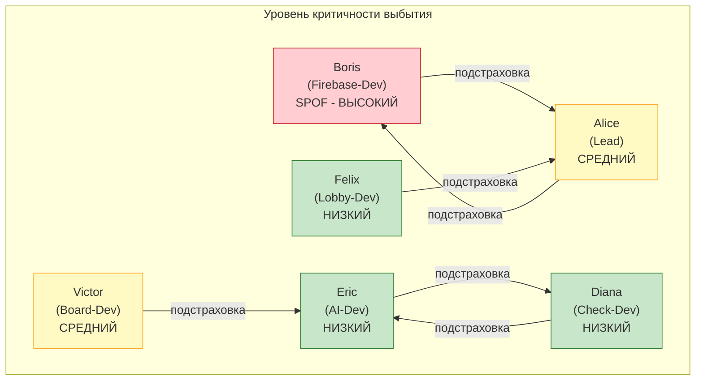
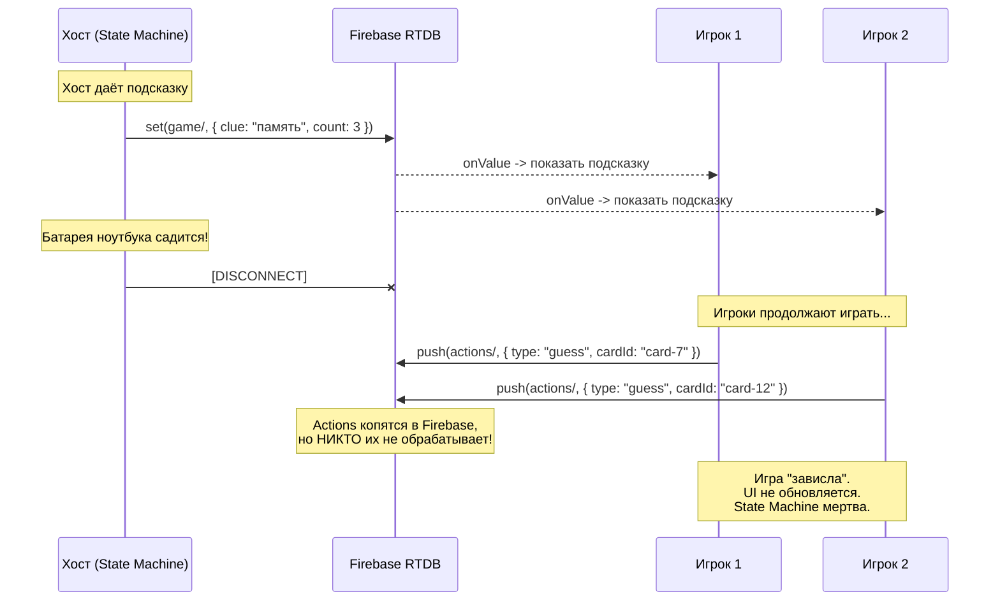
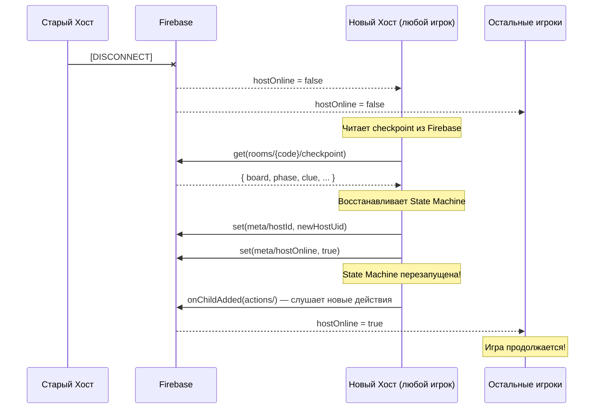
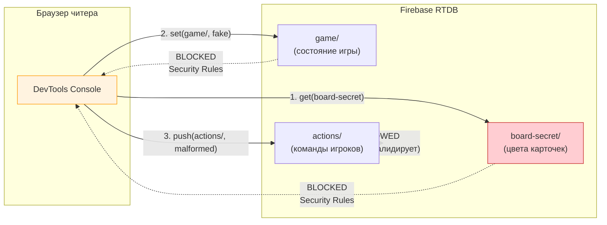
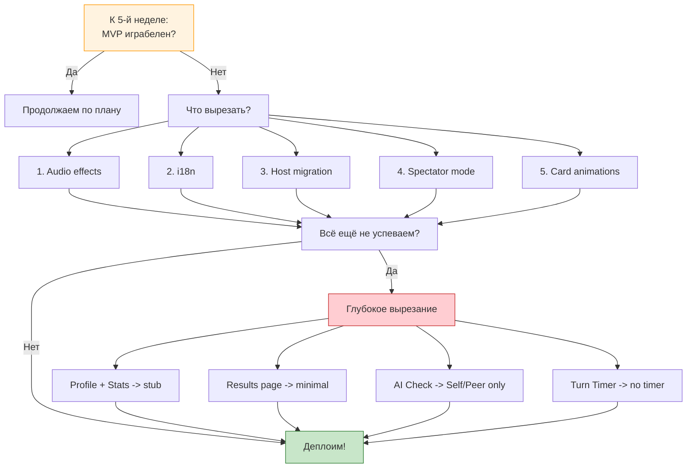

# Risks & Mitigations: Codenames — Interview Edition (Вариант B: Firebase Host-Based)

Этот документ описывает типичные риски при разработке Codenames с **Firebase Host-Based** архитектурой и стратегии их минимизации.

> **Ключевое отличие от Варианта A:** Профиль рисков кардинально другой. Нет проблем с WS-отладкой, холодным стартом, привязкой к `socket.id`. Вместо этого: отключение хоста, лимиты Firebase, читерство через клиентский SDK, Security Rules.

---

## 1. Bus Factor (6 человек)

### Риск

Команда из 6 человек — это высокая вероятность, что кто-то "отвалится" или заболеет. Статистика показывает, что в больших командах 1-2 человека часто снижают активность к финалу.

### Митигация

1. **Парное владение кодом** — каждый модуль должны понимать минимум 2 человека
2. **Документация в коде** — JSDoc для сложной логики (State Machine, Security Rules)
3. **Code Review** — все PR проходят через 2 ревьюера (ротация пар)
4. **Weekly demos** — каждый показывает свой прогресс команде

### Сценарии

| Кто выбыл            | Неделя | Что делать                                                                            |
| -------------------- | ------ | ------------------------------------------------------------------------------------- |
| Alice (Lead)         | 1-2    | Boris берёт CI/CD, Felix берёт Auth                                                   |
| Alice (Lead)         | 3-5    | Убрать Theme Switcher, упростить auth                                                 |
| Boris (Firebase-Dev) | 1-2    | Менее критично, чем Вариант A! Firebase проще WS-сервера. Alice подхватывает Firebase |
| Boris (Firebase-Dev) | 3-5    | Упростить Security Rules, убрать Host-специфичные оптимизации                         |
| Victor (Board-Dev)   | 1-2    | Eric берёт Board (упрощённый)                                                         |
| Victor (Board-Dev)   | 3-5    | Без анимаций, базовая сетка                                                           |
| Diana (Check-Dev)    | 1-2    | Eric берёт Check Phase (Self/Peer only)                                               |
| Diana (Check-Dev)    | 3-5    | Self/Peer only, 20 вопросов                                                           |
| Eric (AI-Dev)        | 1-2    | Diana берёт Solo Mode, подсказки hardcoded                                            |
| Eric (AI-Dev)        | 3-5    | Solo с рандомными подсказками                                                         |
| Felix (Lobby-Dev)    | 1-2    | Alice берёт Lobby (минимальный)                                                       |
| Felix (Lobby-Dev)    | 3-5    | Минимальный Lobby, без Results/Profile                                                |

> **Самый критичный:** Boris (Firebase-Dev). Но в Варианте B SPOF менее острый: Firebase SDK знакомее фронтендерам, чем Socket.IO на бэкенде. Lead может подхватить Firebase за 1-2 дня.

### Визуализация зависимостей



---

## 2. Boris — Firebase-Dev (SPOF, но менее критичный)

> **ВНИМАНИЕ!** Это самый опасный (но не катастрофический) риск проекта. В отличие от Варианта A, где SPOF WS-Dev'а блокирует всю команду, Firebase-Dev SPOF менее жёсткий — но всё равно требует митигации.

### Почему Firebase-Dev SPOF мягче, чем WS-Dev SPOF

| Фактор             | Вариант A (WS-Dev)                           | Вариант B (Firebase-Dev)                            |
| ------------------ | -------------------------------------------- | --------------------------------------------------- |
| Технология         | Socket.IO + Node.js (серверный код)          | Firebase SDK (клиентский код)                       |
| Знакомство команде | Только 1-2 человека знают бэкенд             | Все фронтендеры могут работать с Firebase           |
| Сервер             | Custom сервер, нужно деплоить и поддерживать | Нет своего сервера, Firebase = облачный сервис      |
| Security Rules     | Нет аналога — логика в коде сервера          | JSON-конфигурация, читаемая всей командой           |
| Документация       | Socket.IO docs + собственная архитектура     | Firebase docs — отличная, с примерами               |
| Время на замену    | 3-5 дней (если есть опыт бэкенда)            | 1-2 дня (Lead уже знает Firebase после pair-сессий) |

### Что именно делает Boris (Firebase-Dev)

| Компонент                        | Сложность | Может ли Lead подхватить?                                          |
| -------------------------------- | --------- | ------------------------------------------------------------------ |
| Firebase Setup (config, Auth)    | Низкая    | Да, если была pair-сессия                                          |
| Realtime DB Schema (paths, refs) | Средняя   | Да, схема задокументирована в data-contracts.md                    |
| Security Rules                   | Средняя   | Да, это JSON с простой логикой                                     |
| Host State Machine               | Высокая   | Частично — Lead должен знать основы после парного программирования |
| Action Listener (onChildAdded)   | Средняя   | Да, стандартный паттерн Firebase                                   |
| Presence / onDisconnect          | Средняя   | Да, хорошо документировано в Firebase docs                         |

### Обязательная митигация

1. **Alice (Lead) обязан pair-программить с Тихим Сокетом на неделях 1-2.** Это не опционально. Lead должен понимать Firebase-код достаточно, чтобы подхватить в случае проблем
2. **`data-contracts.md` должен быть "высечен в камне" в первые 3 дня.** Firebase-схема, пути, типы — согласованы и зафиксированы. После этого фронтенд-разработчики могут работать с моками
3. **Mock Firebase Client создаётся параллельно с реальным.** Victor (Board-Dev) и Diana (Check-Dev) работают через мок с первого дня
4. **Ежедневный check-in Тихого Сокета** — каждый день отвечает в чат: "Что сделал / Что блокирует / Нужна ли помощь"
5. **Если Boris выбывает до конца недели 2** — Alice (Lead) подхватывает Firebase-код. В отличие от Варианта A, здесь не нужен "экстренный pivot" — Firebase уже выбран, нужно просто продолжить работу

### Индикаторы раннего предупреждения

Если к **концу недели 1** выполняется хотя бы одно из условий — активируйте план B:

- [ ] Firebase-проект не создан, Realtime DB не подключена
- [ ] Нет ни одного passing unit-теста на State Machine
- [ ] Boris не сделал ни одного PR за неделю
- [ ] data-contracts.md не согласован командой
- [ ] Security Rules не написаны даже в базовом виде

---

## 3. Host Disconnect = Game Over (УНИКАЛЬНЫЙ РИСК ВАРИАНТА B)

> **Это САМЫЙ БОЛЬШОЙ риск Варианта B.** Аналога в Варианте A нет, потому что там State Machine работает на сервере, который не зависит от вкладки браузера.

### Суть проблемы

В Firebase Host-Based архитектуре создатель комнаты (Host) запускает `GameStateMachine` **в своём браузере**. Если Host закрывает вкладку:

1. State Machine останавливается
2. Никто не обрабатывает `actions/` из Firebase
3. Игровое состояние замирает
4. Все остальные игроки видят "замёрзшую" игру



### Сценарий провала

1. Хост играет за Spymaster, даёт подсказку
2. У хоста садится батарея / пропадает Wi-Fi / крашится браузер
3. Остальные игроки видят замёрзшую игру — их действия пишутся в Firebase, но никто их не обрабатывает
4. Игра застряла. Восстановиться невозможно (State Machine была в памяти хоста)

### Митигация

#### 1. Presence system с `onDisconnect`

```typescript
// src/firebase/host-presence.ts
import { ref, set, onDisconnect, onValue } from "firebase/database";
import { db, auth } from "./config";

/** Хост настраивает onDisconnect при входе в комнату */
export function setupHostPresence(roomCode: string): void {
  const user = auth.currentUser;
  if (!user) return;

  const hostOnlineRef = ref(db, `rooms/${roomCode}/meta/hostOnline`);

  // Хост онлайн
  set(hostOnlineRef, true);

  // При отключении — автоматически поставить false
  onDisconnect(hostOnlineRef).set(false);
}

/** Все игроки следят за статусом хоста */
export function watchHostPresence(
  roomCode: string,
  onHostDisconnected: () => void,
  onHostReconnected: () => void,
): () => void {
  const hostOnlineRef = ref(db, `rooms/${roomCode}/meta/hostOnline`);

  const unsubscribe = onValue(hostOnlineRef, (snap) => {
    if (snap.val() === false) {
      onHostDisconnected();
    } else if (snap.val() === true) {
      onHostReconnected();
    }
  });

  return unsubscribe;
}
```

#### 2. Экран "Хост отключился"

Вместо замёрзшей игры показываем внятное сообщение:

```typescript
// src/components/host-disconnected-overlay.ts

function showHostDisconnectedUI(): void {
  const overlay = document.createElement("div");
  overlay.className = "host-disconnected-overlay";
  overlay.innerHTML = `
    <div class="host-disconnected-modal">
      <h2>Хост отключился</h2>
      <p>Создатель комнаты потерял соединение.</p>
      <p>Игра приостановлена. Ожидаем переподключения...</p>
      <div class="spinner"></div>
      <p class="hint">Если хост не вернётся в течение 60 секунд,
      игра будет завершена.</p>
    </div>
  `;
  document.body.appendChild(overlay);
}
```

#### 3. Периодическое сохранение состояния (State Checkpointing)

Хост записывает полное состояние State Machine в Firebase каждые 10 секунд:

```typescript
// src/host/state-checkpoint.ts
import { ref, set } from "firebase/database";
import { db } from "../firebase/config";

const CHECKPOINT_INTERVAL = 10_000; // 10 секунд

export function startCheckpointing(
  roomCode: string,
  getState: () => GameInternalState,
): () => void {
  const intervalId = setInterval(() => {
    const state = getState();
    set(ref(db, `rooms/${roomCode}/checkpoint`), {
      ...state,
      checkpointedAt: Date.now(),
    });
  }, CHECKPOINT_INTERVAL);

  return () => clearInterval(intervalId);
}
```

#### 4. Host Migration (Could Have)

Если хост отключился, другой игрок может стать новым хостом:



> **Важно:** Host Migration — сложная фича (Could Have). Для MVP достаточно показать экран "Хост отключился" и завершить игру. Host Migration добавляет ~8-12 часов разработки.

#### 5. Предупреждение в лобби

Показать предупреждение создателю комнаты ДО начала игры:

```
  ╔══════════════════════════════════════════╗
  ║  Вы — Хост (создатель комнаты).         ║
  ║                                          ║
  ║  Не закрывайте эту вкладку во время      ║
  ║  игры! Если вы отключитесь, игра         ║
  ║  остановится для всех участников.        ║
  ║                                          ║
  ║  Убедитесь, что:                         ║
  ║  - Ноутбук заряжен                       ║
  ║  - Wi-Fi стабилен                        ║
  ║  - Вкладка не будет закрыта              ║
  ╚══════════════════════════════════════════╝
```

### Чеклист для Host Disconnect

- [ ] `onDisconnect` настроен для `meta/hostOnline`
- [ ] Все игроки подписаны на `meta/hostOnline` через `onValue`
- [ ] Экран "Хост отключился" показывается вместо замёрзшей игры
- [ ] Таймер 60 секунд на переподключение хоста
- [ ] Предупреждение в лобби для создателя комнаты
- [ ] (Could Have) Периодическое сохранение checkpoint
- [ ] (Could Have) Host Migration

---

## 4. Firebase Quotas (Free Tier — Spark Plan)

### Лимиты бесплатного плана

| Ресурс                    | Лимит       | Комментарий                                            |
| ------------------------- | ----------- | ------------------------------------------------------ |
| Одновременные подключения | 100         | Каждый `onValue`/`onChildAdded` = подключение          |
| Передача данных           | 10 ГБ/месяц | Каждое обновление `game/` рассылается всем подписчикам |
| Хранилище                 | 1 ГБ        | Комнаты, история, вопросы                              |
| Записей в секунду         | 10,000      | Не проблема для учебного проекта                       |
| Чтений в секунду          | 100,000     | Не проблема                                            |

### Риск

Одна игровая комната с 6 игроками генерирует:

- 6 подписок на `game/` (onValue)
- 1 подписка хоста на `actions/` (onChildAdded)
- 6 подписок на `meta/hostOnline` (presence)
- 6 подписок на `players/` (список игроков)
- **Итого: ~19 подключений на комнату**

При 5 одновременных комнатах = ~95 подключений. Это уже близко к лимиту в 100.

### Сценарий провала

1. Команда делает демо ментору
2. Параллельно другая группа тестирует свою комнату
3. Firebase возвращает ошибку: `QUOTA_EXCEEDED`
4. Новые подключения отклоняются. Демо сломано

### Митигация

#### 1. Батчинг записей

```typescript
// Плохо: 5 отдельных записей
set(ref(db, `rooms/${code}/game/currentTurn`), "blue");
set(ref(db, `rooms/${code}/game/currentPhase`), "clue");
set(ref(db, `rooms/${code}/game/guessesRemaining`), 0);
set(ref(db, `rooms/${code}/game/clue`), null);
set(ref(db, `rooms/${code}/game/turnEndTime`), Date.now() + 120000);

// Хорошо: 1 запись через update
import { update } from "firebase/database";
update(ref(db, `rooms/${code}/game`), {
  currentTurn: "blue",
  currentPhase: "clue",
  guessesRemaining: 0,
  clue: null,
  turnEndTime: Date.now() + 120000,
});
```

#### 2. Throttle записей

```typescript
// src/host/throttled-writer.ts

class ThrottledFirebaseWriter {
  private pendingState: Partial<FirebaseGameState> | null = null;
  private writeTimeout: ReturnType<typeof setTimeout> | null = null;
  private readonly MIN_WRITE_INTERVAL = 200; // мс

  write(roomCode: string, state: Partial<FirebaseGameState>): void {
    this.pendingState = { ...this.pendingState, ...state };

    if (!this.writeTimeout) {
      this.writeTimeout = setTimeout(() => {
        if (this.pendingState) {
          update(ref(db, `rooms/${roomCode}/game`), this.pendingState);
          this.pendingState = null;
        }
        this.writeTimeout = null;
      }, this.MIN_WRITE_INTERVAL);
    }
  }

  /** Немедленная запись (для критических обновлений: game over, card reveal) */
  writeImmediate(roomCode: string, state: Partial<FirebaseGameState>): void {
    if (this.writeTimeout) {
      clearTimeout(this.writeTimeout);
      this.writeTimeout = null;
    }
    const merged = { ...this.pendingState, ...state };
    this.pendingState = null;
    update(ref(db, `rooms/${roomCode}/game`), merged);
  }
}
```

#### 3. Очистка старых комнат (TTL)

```typescript
// src/firebase/room-cleanup.ts

const ROOM_TTL_MS = 24 * 60 * 60 * 1000; // 24 часа

/** Удалить комнаты старше 24 часов */
export async function cleanupStaleRooms(): Promise<void> {
  const roomsSnapshot = await get(ref(db, "rooms"));
  const now = Date.now();

  roomsSnapshot.forEach((roomSnap) => {
    const meta = roomSnap.child("meta").val();
    if (meta && now - meta.createdAt > ROOM_TTL_MS) {
      remove(ref(db, `rooms/${roomSnap.key}`));
    }
  });
}
```

#### 4. Мониторинг

- Открыть Firebase Console -> Realtime Database -> Usage
- Следить за количеством подключений в реальном времени
- Для демо: убедиться, что работает только 1-2 комнаты одновременно

### Чеклист Firebase Quotas

- [ ] Все записи батчатся через `update()`, а не `set()` по отдельности
- [ ] Записи throttle-ятся (не чаще 1 раза в 200мс)
- [ ] Старые комнаты очищаются (TTL: 24 часа)
- [ ] Мониторинг в Firebase Console настроен
- [ ] Для демо: не больше 2 комнат одновременно

---

## 5. Читерство через Firebase (Firebase-Specific)

### Риск

Firebase клиентский SDK работает **в браузере**. Это означает, что любой игрок может открыть DevTools и:

1. Попытаться прочитать `board-secret/` (секретные цвета карточек)
2. Записать напрямую в `rooms/{code}/game/` (минуя Host)
3. Отправить невалидное действие в `actions/`
4. Прочитать `actions/` других игроков



### Сценарий провала

1. Студент открывает DevTools во время игры
2. Выполняет: `firebase.database().ref('rooms/abc/board-secret').once('value').then(s => console.log(s.val()))`
3. Видит все цвета карточек — знает, где бомба, где свои, где чужие
4. Выигрывает игру, не отвечая на вопросы

### Митигация

#### 1. Security Rules (обязательно!)

```json
{
  "rules": {
    "rooms": {
      "$code": {
        "board-secret": {
          ".read": "data.parent().child('meta/hostId').val() === auth.uid",
          ".write": "data.parent().child('meta/hostId').val() === auth.uid"
        },
        "game": {
          ".read": true,
          ".write": "data.parent().child('meta/hostId').val() === auth.uid"
        },
        "actions": {
          ".read": "data.parent().child('meta/hostId').val() === auth.uid",
          ".write": "auth !== null"
        }
      }
    }
  }
}
```

**Разбор правил:**

| Узел            | Кто читает  | Кто пишет            | Защита от              |
| --------------- | ----------- | -------------------- | ---------------------- |
| `board-secret/` | Только хост | Только хост          | Подсматривание цветов  |
| `game/`         | Все         | Только хост          | Подмена состояния игры |
| `actions/`      | Только хост | Любой авторизованный | Чтение чужих действий  |

#### 2. Host валидирует все действия

```typescript
// src/host/action-validator.ts

function validateAction(action: PlayerAction, gameState: Game): boolean {
  switch (action.type) {
    case "give-clue":
      // Только Spymaster текущей команды может давать подсказку
      if (gameState.currentPhase !== "clue") return false;
      if (!isCurrentTeamSpymaster(action.playerId, gameState)) return false;
      if (!action.payload.word || !action.payload.count) return false;
      return true;

    case "guess":
      // Только Operative текущей команды может угадывать
      if (gameState.currentPhase !== "guess") return false;
      if (!isCurrentTeamOperative(action.playerId, gameState)) return false;
      if (isCardRevealed(action.payload.cardId, gameState)) return false;
      return true;

    case "end-turn":
      // Только Operative текущей команды
      if (gameState.currentPhase !== "guess") return false;
      if (!isCurrentTeamOperative(action.playerId, gameState)) return false;
      return true;

    default:
      return false;
  }
}
```

#### 3. Для учебного проекта: Security Rules достаточны

В production-проекте потребовались бы Cloud Functions для серверной валидации. Для учебного проекта Firebase Security Rules + валидация на стороне Host дают достаточную защиту.

> **Важно:** Security Rules должны быть настроены **ДО первого деплоя**. Firebase по умолчанию открыт для всех (`".read": true, ".write": true`). Не забудьте убрать эти правила!

---

## 6. Firebase Offline Behavior

### Риск

Firebase SDK имеет встроенную поддержку offline-режима. Это звучит хорошо, но создаёт неожиданные проблемы:

| Проблема        | Описание                                                                               |
| --------------- | -------------------------------------------------------------------------------------- |
| Stale state     | Игрок видит устаревшее состояние, принимает решения на основе старых данных            |
| Action burst    | Действия копятся офлайн, отправляются разом при восстановлении связи                   |
| Phantom actions | Игрок думает, что нажатие не сработало, нажимает повторно                              |
| Desync          | Один игрок офлайн, остальные продолжают — при возврате он видит совершенно другое поле |

### Сценарий провала

1. У игрока кратковременно пропадает Wi-Fi (5-10 секунд)
2. Firebase SDK переходит в offline-режим (тихо, без ошибок!)
3. Игрок кликает карточку — действие сохраняется в локальном кеше
4. Wi-Fi возвращается — действие отправляется в Firebase
5. Но за эти 10 секунд ход уже перешёл к другой команде!
6. Хост получает действие, которое невалидно в текущей фазе

### Митигация

#### 1. Детектирование online/offline статуса

```typescript
// src/firebase/connection-status.ts
import { ref, onValue } from "firebase/database";
import { db } from "./config";

export function watchConnectionStatus(
  onOnline: () => void,
  onOffline: () => void,
): () => void {
  const connectedRef = ref(db, ".info/connected");

  const unsubscribe = onValue(connectedRef, (snap) => {
    if (snap.val() === true) {
      onOnline();
    } else {
      onOffline();
    }
  });

  return unsubscribe;
}
```

#### 2. Баннер "Нет подключения"

```typescript
// src/components/connection-banner.ts

function showOfflineBanner(): void {
  const banner = document.getElementById("offline-banner");
  if (banner) {
    banner.style.display = "flex";
    banner.textContent = "Нет подключения к серверу. Ожидаем восстановления...";
  }
}

function hideOfflineBanner(): void {
  const banner = document.getElementById("offline-banner");
  if (banner) {
    banner.style.display = "none";
  }
}
```

#### 3. Блокировка действий в офлайн-режиме

```typescript
// src/firebase/actions.ts

let isOnline = true;

watchConnectionStatus(
  () => {
    isOnline = true;
  },
  () => {
    isOnline = false;
  },
);

export function sendAction(
  roomCode: string,
  type: PlayerAction["type"],
  payload: Record<string, unknown>,
): void {
  if (!isOnline) {
    showToast("Нет подключения. Дождитесь восстановления связи.");
    return;
  }

  const user = auth.currentUser;
  if (!user) throw new Error("AUTH_REQUIRED");

  push(actionsRef(roomCode), {
    type,
    playerId: user.uid,
    payload,
    timestamp: Date.now(),
  });
}
```

---

## 7. Game State Sync & Race Conditions

### Риск

Несколько игроков отправляют действия одновременно. В Варианте A сервер обрабатывает события через очередь. В Варианте B хост получает действия через `onChildAdded`, который гарантирует порядок push-ключей.

### Сценарии

| Сценарий                            | Что происходит                                       | Как ломается                                       |
| ----------------------------------- | ---------------------------------------------------- | -------------------------------------------------- |
| 2 клика одновременно                | Хост обрабатывает первый push-ключ                   | Второй клик может быть невалидным (фаза сменилась) |
| Клик во время Check                 | Игрок кликает карточку пока попап открыт             | Фаза нарушена                                      |
| Disconnect хоста во время обработки | Хост отключился между чтением action и записью state | Состояние частично обновлено                       |
| Timer race                          | Клиент думает, что время есть, хост уже закончил ход | Клик отклонён                                      |

### Почему Firebase помогает

Firebase push-ключи генерируются хронологически. `onChildAdded` вызывается строго в порядке push-ключей. Это означает, что хост обрабатывает действия **строго по порядку** — как очередь FIFO.

```
Firebase push keys (хронологические):
  -NqX1a2b3c  →  { type: "guess", cardId: "card-7" }   ← обрабатывается первым
  -NqX1a2b3d  →  { type: "guess", cardId: "card-12" }  ← обрабатывается вторым
  -NqX1a2b3e  →  { type: "end-turn" }                   ← обрабатывается третьим
```

### Митигация

#### 1. Action Lock на стороне хоста

```typescript
// src/host/state-machine.ts

class GameStateMachine {
  private actionLock = false;

  async processAction(action: PlayerAction): Promise<void> {
    if (this.actionLock) {
      console.warn("Action dropped: lock is active", action);
      return;
    }

    this.actionLock = true;
    try {
      if (!validateAction(action, this.state)) {
        console.warn("Invalid action:", action);
        return;
      }

      this.state = applyAction(this.state, action);
      await this.writeStateToFirebase();
    } finally {
      this.actionLock = false;
    }
  }
}
```

#### 2. Phase Guard на клиенте

```typescript
// src/pages/game/board-controller.ts

function onCardClick(cardId: string): void {
  // Guard: проверяем фазу на клиенте
  if (gameState.currentPhase !== "guess") return;
  if (!isMyTurn(currentUserId, gameState)) return;
  if (isCardRevealed(cardId, gameState)) return;

  // Optimistic UI
  highlightCard(cardId, "selecting");

  // Отправляем в Firebase
  sendAction(roomCode, "guess", { cardId });
}
```

#### 3. Cleanup обработанных действий

```typescript
// src/host/action-listener.ts

function processAndCleanup(
  roomCode: string,
  actionKey: string,
  action: PlayerAction,
): void {
  stateMachine.processAction(action);

  // Удаляем обработанное действие (чтобы не обработать повторно при рестарте)
  remove(ref(db, `rooms/${roomCode}/actions/${actionKey}`));
}
```

---

## 8. Turn Timer Desync

### Риск

Таймер хоста и таймер клиента расходятся из-за задержек Firebase. Клиент показывает "0:05", а хост уже закончил ход.

### Новая механика таймеров (два таймера одновременно)

Глобальный таймер хода **никогда не ставится на паузу**. Check Phase имеет свой отдельный 30-секундный таймер:

| Событие                 | Глобальный таймер хода | Check таймер (30 сек)   |
| ----------------------- | ---------------------- | ----------------------- |
| Ход начинается          | Старт                  | --                      |
| Check начинается        | Продолжает тикать      | Старт                   |
| Игрок отвечает на Check | Продолжает тикать      | Стоп                    |
| Check timeout (30 сек)  | Продолжает тикать      | Очко не засчитано       |
| Глобальный таймер истёк | Ход заканчивается      | Стоп (если был активен) |

### Митигация

1. **Хост — авторитет по таймеру** — записывает `turnEndTime` (абсолютный timestamp) в Firebase
2. **Клиент вычисляет** остаток: `remaining = turnEndTime - Date.now()`
3. **Два таймера на клиенте** — глобальный (остаток хода) и Check (30 сек обратный отсчёт)
4. **"Ожидание..."** когда клиентский таймер истёк, но хост ещё не обновил состояние
5. **`requestAnimationFrame`** вместо `setInterval` для обновления UI таймера

```typescript
// src/components/timer/turn-timer.ts

function startTimerDisplay(turnEndTime: number): void {
  function tick() {
    const remaining = Math.max(0, turnEndTime - Date.now());

    if (remaining <= 0) {
      timerElement.textContent = "Ожидание...";
      timerElement.classList.add("expired");
      return;
    }

    const seconds = Math.ceil(remaining / 1000);
    timerElement.textContent = formatTime(seconds);

    if (seconds <= 10) {
      timerElement.classList.add("warning");
    }

    requestAnimationFrame(tick);
  }

  requestAnimationFrame(tick);
}

// src/components/timer/check-timer.ts

function startCheckTimer(durationSec: number = 30): void {
  const checkEndTime = Date.now() + durationSec * 1000;

  function tickCheck() {
    const remaining = Math.max(0, checkEndTime - Date.now());

    if (remaining <= 0) {
      checkTimerElement.textContent = "Время вышло!";
      return;
    }

    const seconds = Math.ceil(remaining / 1000);
    checkTimerElement.textContent = `${seconds} сек`;

    if (seconds <= 5) {
      checkTimerElement.classList.add("urgent");
    }

    requestAnimationFrame(tickCheck);
  }

  requestAnimationFrame(tickCheck);
}
```

---

## 9. Question Bank Quality

### Риск

Плохие вопросы убивают игру:

- Слишком простые вопросы — все получают очки без усилий
- Слишком сложные — никто не получает очки, фрустрация
- Неточные эталонные ответы — AI мок неправильно оценивает
- Не хватает вопросов — одно и то же повторяется

### Митигация

1. **Peer review** банка вопросов до запуска
2. **Несколько вопросов на слово** (минимум 2) — случайный выбор
3. **Difficulty levels** — Easy / Medium / Hard
4. **Эталонные ответы включают ключевые слова** — для корректной работы мока
5. **Fallback вопрос** — если для слова нет вопросов
6. **Каждый из 6 участников пишет >= 15 вопросов** (итого >= 90)

### Чеклист качества вопроса

- [ ] Вопрос однозначно понятен
- [ ] Эталонный ответ содержит 3+ ключевых слова
- [ ] Сложность соответствует уровню (1/2/3)
- [ ] Вопрос проверяет понимание, а не запоминание
- [ ] Нет опечаток в вопросе и ответе

### Пример хорошего vs плохого вопроса

```
Плохо:
  Вопрос: "Что такое Promise?"
  Ответ: "Объект для асинхронных операций."
  Проблема: Ответ слишком короткий, keyword matching не работает.

Хорошо:
  Вопрос: "Что такое Promise и какие у него три состояния?"
  Ответ: "Promise — это объект, представляющий результат асинхронной
  операции. У Promise три состояния: pending (ожидание), fulfilled
  (успех) и rejected (ошибка). Promise создаётся через конструктор
  new Promise((resolve, reject) => {...})."
  Почему лучше: конкретный вопрос, развёрнутый ответ с ключевыми словами.
```

---

## 10. 6-Person Coordination Overhead

### Риск

Больше людей = больше коммуникации, больше merge конфликтов, больше координационных накладных расходов. Закон Амдаля: не всё параллелизуется.

### Проблемы

| Проблема                   | При 3 людях     | При 6 людях                                                |
| -------------------------- | --------------- | ---------------------------------------------------------- |
| Merge конфликты            | Редко           | Часто (особенно в `types.ts`, `firebase-schema.ts`)        |
| Код-ревью                  | 1 ревьюер на PR | 2 ревьюера, дольше ждать                                   |
| Синки                      | 30 мин/неделю   | 30-45 мин/неделю                                           |
| Принятие решений           | Быстро          | Долгие обсуждения                                          |
| Зависимости между задачами | Мало            | Много (Boris блокирует Быстрого Рендера и Ловкого Роутера) |

### Митигация

1. **Чёткие границы модулей** — каждый работает в своей папке
2. **Контракты сначала, код потом** — data-contracts.md согласован до начала кодинга
3. **2 ревьюера на PR** — ротация пар (не всегда одни и те же)
4. **Async коммуникация** для решений — GitHub Issues, не чат
5. **Синки <= 30 минут** — строгий тайм-бокс
6. **Feature branches** с осмысленными именами — `feat/firebase-host-logic`, `feat/check-phase-popup`

### Структура папок (минимизация конфликтов)

```
src/
├── shared/          <- Все (осторожно с конфликтами!)
├── firebase/        <- Alice (Lead) + Boris (Firebase-Dev)
├── host/            <- Boris (Firebase-Dev)
├── ai/              <- Eric (AI-Dev)
├── pages/
│   ├── landing/     <- Eric (AI-Dev)
│   ├── lobby/       <- Felix (Lobby-Dev)
│   ├── room/        <- Boris (Firebase-Dev) + Felix (Lobby-Dev)
│   ├── game/        <- Victor (Board-Dev)
│   ├── solo/        <- Eric (AI-Dev)
│   ├── results/     <- Felix (Lobby-Dev)
│   ├── profile/     <- Felix (Lobby-Dev)
│   └── auth/        <- Alice (Lead)
├── components/
│   ├── board/       <- Victor (Board-Dev)
│   ├── check/       <- Diana (Check-Dev)
│   ├── timer/       <- Victor (Board-Dev)
│   └── common/      <- Все (осторожно с конфликтами!)
└── ...
```

> **Отличие от Варианта A:** Нет папки `server/`. Вся серверная логика = `src/host/` (State Machine в браузере хоста) + `src/firebase/` (конфигурация и хелперы). Это уменьшает количество merge-конфликтов, потому что нет разделения на два проекта (frontend/backend).

---

## 11. CI/CD: Firebase Deployment

### Риск

Деплоймент в Варианте B проще, чем в Варианте A (нет отдельного backend на Render), но есть свои нюансы:

| Компонент                  | Куда деплоится                | Как                               |
| -------------------------- | ----------------------------- | --------------------------------- |
| Frontend                   | Vercel (или Firebase Hosting) | Auto-deploy при push в main       |
| Firebase Realtime Database | Firebase Cloud (уже в облаке) | Не нужен деплой                   |
| Security Rules             | Firebase Project              | `firebase deploy --only database` |
| Environment Variables      | Vercel Dashboard              | `VITE_FIREBASE_*` ключи           |

### Проблемы

| Проблема                     | Описание                                                                | Митигация                                                |
| ---------------------------- | ----------------------------------------------------------------------- | -------------------------------------------------------- |
| Security Rules не задеплоены | Правила по умолчанию = открыто для всех                                 | `firebase deploy --only database` в CI/CD                |
| Environment variables утекли | Firebase API ключи в коде                                               | `.env` + `.gitignore`, ключи в Vercel Dashboard          |
| CORS (Firebase Hosting)      | Firebase Hosting не всегда нужен, но если используется — CORS настроить | `firebase.json` с rewrites                               |
| Stale Rules                  | Обновили Rules локально, но не задеплоили                               | Добавить `firebase deploy --only database` в CI pipeline |

### Чеклист CI/CD (неделя 1)

- [ ] Frontend деплоится на Vercel при push в main
- [ ] Firebase-проект создан, Realtime DB включена
- [ ] Security Rules задеплоены через `firebase deploy --only database`
- [ ] Environment variables настроены в Vercel
- [ ] "Hello World" доступен по URL
- [ ] HTTPS работает

### Пример GitHub Actions для Security Rules

```yaml
# .github/workflows/deploy-rules.yml
name: Deploy Firebase Rules
on:
  push:
    branches: [main]
    paths:
      - "database.rules.json"

jobs:
  deploy:
    runs-on: ubuntu-latest
    steps:
      - uses: actions/checkout@v4
      - uses: FirebaseExtended/action-hosting-deploy@v0
        with:
          repoToken: "${{ secrets.GITHUB_TOKEN }}"
          firebaseServiceAccount: "${{ secrets.FIREBASE_SERVICE_ACCOUNT }}"
          channelId: live
      - run: npx firebase-tools deploy --only database --token "${{ secrets.FIREBASE_TOKEN }}"
```

> **Преимущество перед Вариантом A:** Не нужно деплоить backend на Render, не нужен CORS между frontend и backend, не нужен UptimeRobot для пингования. Всё работает через Firebase Cloud — "холодного старта" нет.

---

## 12. Cut Scope Strategy (MoSCoW)

Заранее определите приоритеты. Если не успеваете — режьте снизу.

### Must Have (без этого не сдать)

- [ ] Auth (Login/Register)
- [ ] Lobby (создание/вход в комнату)
- [ ] Game Board (5x5, клик, открытие)
- [ ] Firebase Host Logic (State Machine в браузере хоста)
- [ ] Check Phase (Self/Peer минимум)
- [ ] Solo Mode (мокнутый AI Spymaster)
- [ ] Unit Tests 20%+
- [ ] E2E Tests (3 сценария)
- [ ] README с описанием
- [ ] Deployment (Vercel + Firebase)

### Should Have (нужно для хороших баллов)

- [ ] AI Check evaluation mode (мок)
- [ ] Turn Timer
- [ ] Card flip animations
- [ ] Theme Switcher
- [ ] Responsive design
- [ ] Profile + Stats
- [ ] Results page с деталями
- [ ] 40+ вопросов
- [ ] Host disconnect handling
- [ ] Protected Routes

### Could Have (бонусы)

- [ ] Host migration (новый хост подхватывает игру)
- [ ] i18n (+10 баллов)
- [ ] Audio effects (+5 баллов)
- [ ] Unit Tests 50%+
- [ ] Spectator mode

### Won't Have (откладываем)

- Реальная AI интеграция
- Voice Chat (WebRTC)
- Tournaments
- OAuth (Google/GitHub)
- PWA / Offline mode
- 3D визуализации
- Cloud Functions

### Правило 5-й недели

> Если к началу 5-й недели MVP не играбелен — примените Cut Scope. Лучше сдать 70% в идеальном состоянии, чем 100% с багами.

### Дерево решений по вырезанию



---

## 13. Типичные ошибки (чеклист)

### Архитектура

- [ ] TypeScript strict — нет `any`
- [ ] Цвета карточек защищены Security Rules (`board-secret` недоступен не-хосту)
- [ ] API Layer абстрагирует Mock/Real (Firebase и AI отдельно)
- [ ] Типы из `data-contracts.md` используются везде
- [ ] Хост — единственный источник правды (через Security Rules `.write` только для Host)

### Firebase

- [ ] Security Rules настроены **ДО** первого деплоя
- [ ] `board-secret` недоступен не-хосту (проверить через Firebase Console -> Rules Playground)
- [ ] `game/` state пишет ТОЛЬКО хост
- [ ] `actions/` пишут только авторизованные пользователи (`auth !== null`)
- [ ] `onDisconnect` настроен для presence (хост и игроки)
- [ ] Старые комнаты очищаются (TTL: 24 часа)
- [ ] Firebase environment variables не коммитятся в репозиторий (`.env` в `.gitignore`)
- [ ] Батчинг записей через `update()` вместо множества `set()`
- [ ] `database.rules.json` хранится в репозитории и деплоится через CI/CD

### UI/UX

- [ ] Check Phase блокирует клики по полю
- [ ] Два таймера: глобальный (2 мин) тикает всегда, Check (30 сек) отдельно
- [ ] Loading states для async операций
- [ ] "Хост отключился" экран (а не замёрзший UI)
- [ ] "Нет подключения" баннер при offline
- [ ] Global Error Handling (Toast)
- [ ] 404 Page
- [ ] Предупреждение для хоста: "Не закрывайте вкладку!"

### Тесты

- [ ] Unit Tests для State Machine (чистые функции)
- [ ] Unit Tests для AI моков
- [ ] E2E Tests работают в Mock Mode
- [ ] Security Rules тестируются через Firebase Emulator Suite

### Деплой

- [ ] CI/CD настроен с недели 1
- [ ] Firebase Security Rules задеплоены
- [ ] Environment variables в Vercel (не в коде!)
- [ ] HTTPS работает
- [ ] `firebase deploy --only database` при изменении Rules

### Документация

- [ ] README с скриншотами
- [ ] Дневник с первой недели
- [ ] PR с понятными описаниями
- [ ] data-contracts.md актуален
- [ ] Firebase-схема задокументирована

---

## 14. Сравнение рисков: Вариант A vs Вариант B

| Риск                | Вариант A (WebSocket)             | Вариант B (Firebase Host)                      |
| ------------------- | --------------------------------- | ---------------------------------------------- |
| **SPOF**            | WS-Dev: критичный (custom server) | Firebase-Dev: менее критичный (SDK знакомее)   |
| **Cold Start**      | Render засыпает через 15 мин      | Нет проблемы (Firebase всегда online)          |
| **Host Disconnect** | Сервер стабилен                   | **ГЛАВНЫЙ РИСК:** вкладка хоста = Game Over    |
| **Debugging**       | WS-отладка сложная                | Firebase Console + обычный DevTools            |
| **socket.id**       | Ловушка для новичков              | Нет аналога (Firebase Auth = стабильный uid)   |
| **Cheating**        | Сервер закрыт по умолчанию        | Клиентский SDK = нужны Security Rules          |
| **Quotas**          | Нет лимитов (свой сервер)         | 100 подключений, 10 ГБ/мес                     |
| **CORS**            | Настройка между FE и BE           | Нет проблемы (всё через Firebase SDK)          |
| **Offline**         | WS disconnects + reconnect        | Firebase offline cache = неожиданное поведение |
| **Race Conditions** | Очередь на сервере                | Push keys + onChildAdded = FIFO                |
| **Деплоймент**      | 2 сервиса (Vercel + Render)       | 1 сервис (Vercel) + Firebase Cloud             |
| **Timer desync**    | WS-latency ~50-100ms              | Firebase latency ~100-300ms                    |

---

## 15. Карточка быстрой проверки

Распечатайте и повесьте над рабочим местом:

```
┌─────────────────────────────────────────────┐
│  BEFORE MERGE                               │
├─────────────────────────────────────────────┤
│  [ ] TypeScript strict -- нет any           │
│  [ ] Тесты проходят                         │
│  [ ] Code review (2 approvals)              │
│  [ ] Работает в Mock Mode                   │
│  [ ] Security Rules не сломаны              │
│  [ ] Дневник обновлён                       │
│  [ ] Host = единственный writer в game/     │
│  [ ] board-secret закрыт от не-хостов       │
└─────────────────────────────────────────────┘

┌─────────────────────────────────────────────┐
│  WEEKLY CHECK                               │
├─────────────────────────────────────────────┤
│  [ ] Prod deployment работает (Vercel)      │
│  [ ] Firebase Rules задеплоены              │
│  [ ] Нет console.log в prod                 │
│  [ ] Mock и Real синхронизированы           │
│  [ ] Issues актуальны                       │
│  [ ] Question Bank проверен                 │
│  [ ] onDisconnect настроен для хоста        │
│  [ ] Firebase quotas в норме (<50%)         │
│  [ ] Старые комнаты очищены                 │
└─────────────────────────────────────────────┘
```

### Ежедневный мини-чеклист для Тихого Сокета (Firebase-Dev)

```
┌─────────────────────────────────────────────┐
│  DAILY CHECK (Firebase-Dev)                 │
├─────────────────────────────────────────────┤
│  [ ] Firebase Console: ошибки?              │
│  [ ] Security Rules: тесты проходят?        │
│  [ ] Presence: onDisconnect работает?       │
│  [ ] State Machine: unit tests зелёные?     │
│  [ ] Checkpointing: state записывается?     │
│  [ ] Actions: очередь не копится?           │
└─────────────────────────────────────────────┘
```
