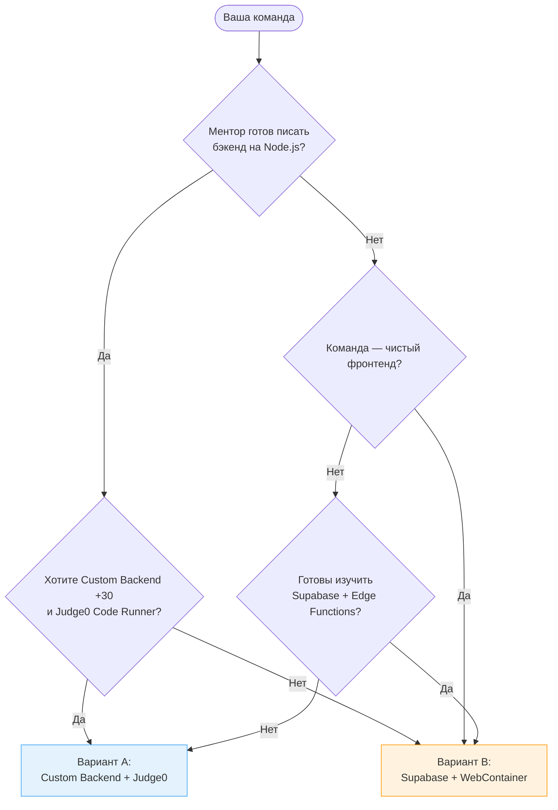
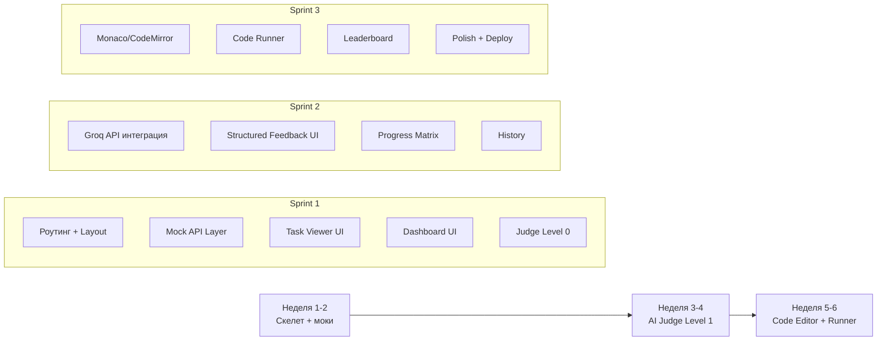

# AI Prep App — Архитектурные варианты

Документация для примера проекта **AI Prep App** (тренажёр подготовки к собеседованиям). Основная концепция, UI mockups и описание фич — в [03-ai-prep-app.md](../03-ai-prep-app.md).

---

## Какой вариант выбрать?



---

## Сравнение вариантов

| Аспект                | Вариант A: Custom Backend            | Вариант B: Supabase + WebContainer          |
| --------------------- | ------------------------------------ | ------------------------------------------- |
| **Бэкенд**            | Node.js + Express + PostgreSQL       | Supabase (Auth + DB + Edge Functions)       |
| **Code Runner**       | Judge0 API (SaaS или self-hosted)    | WebContainer (StackBlitz) в браузере        |
| **AI Judge**          | Backend endpoint → Groq/OpenAI       | Supabase Edge Function → Groq               |
| **Авторизация**       | Custom JWT (bcrypt + middleware)     | Supabase Auth (Google, GitHub)              |
| **Хранение контента** | PostgreSQL таблицы                   | Supabase PostgreSQL (та же схема + RLS)     |
| **Сложность**         | Высокая (Docker, Judge0, API design) | Средняя (SDK, Edge Functions, WebContainer) |
| **Лучше для**         | Команда с ментором-бэкендером        | Фронтенд-команда, ментор фокусируется на AI |

### Баллы: Personal Features по ролям

| Роль                  | Вариант A | Вариант B | Разница |
| --------------------- | --------- | --------- | ------- |
| Nika (Editor-Dev)     | ~115      | ~120      | +5      |
| Oscar (Dashboard-Dev) | ~110      | ~110      | 0       |
| Paula (Judge-Dev)     | ~115      | ~115      | 0       |
| Mentor (Mentor)       | ~190      | ~160      | **-30** |

> **Вывод:** Вариант A выгоднее для ментора (+30 за Custom Backend, Custom Auth, Backend Framework, Docker). Для студентов разница минимальна. Выбирайте вариант исходя из навыков команды, а не баллов. Подробные таблицы — в scoring-and-plan.md каждого варианта.

---

## Команда

| Имя        | Роль             | Зона ответственности                          |
| ---------- | ---------------- | --------------------------------------------- |
| **Nika**   | Editor-Dev       | Task Viewer, Code Editor, Submissions, Hints  |
| **Oscar**  | Dashboard-Dev    | Dashboard, Progress Matrix, Rubrics, History  |
| **Paula**  | Judge-Dev        | Judge Client, Feedback UI, Scores, Comparison |
| **Mentor** | Backend (Mentor) | Generator Script, Code Runner, Judge API, DB  |

---

## Что делает этот проект интересным?

### Зачем строить AI Prep App?

1. **«Построй свой AI-оценщик»** — магическое ощущение, когда LLM даёт структурированный фидбек на твой ответ
2. **Code Editor** — Monaco/CodeMirror приятно интегрировать, результат сразу впечатляет
3. **Визуализация прогресса** — графики и матрицы навыков — визуально rewarding
4. **Ты строишь инструмент для себя** — подготовка к собеседованиям = реальная польза
5. **Prompt engineering** — генерация контента через ChatGPT учит писать промпты

### Что НЕ нужно делать в MVP

Оригинальная спецификация описывает полный продукт. MVP — это **подмножество**:

| Фича              | Полный продукт        | MVP (Sprint 1-2)                 |
| ----------------- | --------------------- | -------------------------------- |
| Типы задач        | Theory + Coding       | **Только Theory**                |
| AI Judge          | Real LLM              | **Keyword matching (Level 0)**   |
| Code Runner       | Judge0 / WebContainer | **Отложен до Sprint 3+**         |
| Spaced Repetition | Алгоритм повторений   | **Просто последовательные темы** |
| Leaderboard       | Рейтинг по темам      | **Nice-to-have, не в MVP**       |
| Рубрика           | N пунктов             | **Максимум 3 пункта на вопрос**  |
| Хранение          | PostgreSQL            | **JSON файлы → DB позже**        |

---

## Как сделать проект не страшным

### Принцип: Theory-First MVP

Sprint 1 — только теоретические вопросы + AI Judge. Никакого Code Runner. Это даёт рабочий core loop за 1-2 недели:

```
Вопрос → Пользователь пишет ответ → AI оценивает → Score + Feedback
```

### AI Judge: 3 уровня мокирования

| Уровень                | Что делает                              | Когда использовать                           |
| ---------------------- | --------------------------------------- | -------------------------------------------- |
| **Level 0: Hardcoded** | Нет LLM. Score = keyword matching       | Ship day 1. Фронтенд работает сразу          |
| **Level 1: Real LLM**  | Groq API + structured output            | Настоящий продукт. Подключить когда UI готов |
| **Level 2: Advanced**  | Несколько rubric dimensions, confidence | Если осталось время                          |

### Контент как JSON

Предгенерированный контент живёт в `content/` как JSON файлы. Никакой admin panel:

```
content/
├── topics.json           # Список тем (Core JS, TypeScript, Algorithms...)
├── core-js/
│   ├── closures.json     # Задачи по замыканиям
│   ├── promises.json     # Задачи по промисам
│   └── prototypes.json   # Задачи по прототипам
└── typescript/
    ├── generics.json
    └── utility-types.json
```

Можно загружать из файлов (dev) или из DB (prod). Тот же паттерн [API Service Layer](../../ARCHITECTURE_AND_API.md).

### Пошаговый путь к MVP



---

## Структура документации

```
03-ai-prep-app.md                 # Product Spec (концепция + UI mockups) — общий
03-ai-prep-app/
├── README.md                     # Сравнение вариантов (вы здесь)
├── variant-a/                    # Custom Backend + Judge0
│   ├── README.md                 # Архитектура, стек, команда, навигация
│   ├── scoring-and-plan.md       # Баллы + 6-недельный план
│   ├── data-contracts.md         # TS типы + REST API + PostgreSQL
│   ├── ai-judge.md               # AI Judge Level 0/1/2
│   ├── code-runner.md            # Judge0 + AI Error Hint
│   └── risks-and-mitigations.md  # Риски Custom Backend
└── variant-b/                    # Supabase + WebContainer
    ├── README.md                 # Архитектура, стек, команда, навигация
    ├── scoring-and-plan.md       # Баллы + 6-недельный план
    ├── data-contracts.md         # TS типы + Supabase SDK + RLS
    ├── ai-judge.md               # AI Judge Level 0/1/2 (Edge Function)
    ├── code-runner.md            # WebContainer + AI Error Hint
    └── risks-and-mitigations.md  # Риски Supabase
```

---

## Навигация

| Документ                                                 | Описание                                                           | Когда читать              |
| -------------------------------------------------------- | ------------------------------------------------------------------ | ------------------------- |
| [03-ai-prep-app.md](../03-ai-prep-app.md)                | Product Spec: концепция, UI mockups, user journey                  | В первую очередь          |
| [variant-a/README.md](./variant-a/README.md)             | Вариант A: Custom Backend + Judge0 — архитектура, компоненты, стек | После выбора варианта     |
| [variant-b/README.md](./variant-b/README.md)             | Вариант B: Supabase + WebContainer — архитектура, компоненты, стек | После выбора варианта     |
| [ARCHITECTURE_AND_API.md](../../ARCHITECTURE_AND_API.md) | API Service Layer — паттерн mock/real переключения                 | Перед началом разработки  |
| [AI_AGENT.md](../../AI_AGENT.md)                         | Справочник по интеграции LLM                                       | Когда дойдёте до AI Judge |

---

## Как использовать

1. **Прочитайте Product Spec** — [03-ai-prep-app.md](../03-ai-prep-app.md) (общий для обоих вариантов)
2. **Выберите вариант** — используйте flowchart и таблицу сравнения выше
3. **Перейдите в папку варианта** — [variant-a/](./variant-a/) или [variant-b/](./variant-b/)
4. **Начните с scoring-and-plan.md** — поймите баллы, роли и сроки
5. **Согласуйте контракты** — data-contracts.md определяет типы и API
6. **Изучите риски** — risks-and-mitigations.md до начала кодинга
7. **Подключайте AI когда UI готов** — см. ai-judge.md и [AI_AGENT.md](../../AI_AGENT.md)
